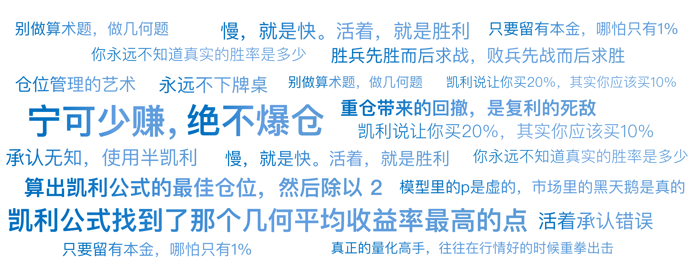

# 05｜赌徒的最后一道防线：凯利公式的仓位哲学

你好，我是陈旸。

在华尔街，流传着这样一句残酷的谚语：“有老交易员，也有大胆的交易员，但没有既老又大胆的交易员。”

很多学员找我，兴奋地展示他们的回测报告：“老师，你看这个策略，胜率 60%，盈亏比 2:1，是不是无敌了？我要把全部资金投入进去梭哈！”每当这时，我都会冷汗直冒。因为我知道，如果他不懂仓位管理，那后果不敢想象。

为什么呢？

因为策略能赚钱和你能赚到钱是两码事。中间隔着一条巨大的鸿沟，这条鸿沟的名字叫——爆仓。今天，我们要讲的这个公式，不教你怎么选股，也不教你怎么择时。它只教你一件事：**当机会来临时，你到底该下注多少？**

## **一个价值百万的硬币游戏**

为了讲清楚这个问题，我们先玩一个简单的游戏。假设我邀请你玩抛硬币。这枚硬币被我动过手脚：它正面朝上的概率是 60%，背面是 40%。这显然是一个对你极其有利的游戏（正期望值）。

现在，你有 1000 美元的本金。规则是：每次下注，你可以投入任意比例的本金。赢了，你拿回本金并获得 1:1 的赔付；输了，下注的钱归我。请问，为了最大化你的长期收益，你每次应该下注多少？

**选项 A：梭哈。**

反正胜率是 60%，我有优势！

结果：只要你玩得足够久，你总会遇到连续的背面（运气不好）。只要遇到一次，你的本金就归零了。游戏结束。

结论：梭哈是死路。

**选项 B：保守点，每次下 1 美元。**

这样绝对安全，你永远不会破产。

结果：你的收益增长极慢。哪怕你抛了一万次，你也赚不到大钱。

结论：过于保守是对机会的浪费。

**选项 C：平推，每次下固定金额，比如 100 美元。**

结果：这是一个线性增长策略。但它没有利用复利的力量。当你的本金变成 100 万时，你还下 100 块，资金利用率太低。

这就是问题的核心：下注太少，赚钱太慢；下注太多，容易破产。在太少和太多之间，一定存在一个上帝的数值。这个数值能让你的资产增长速度达到数学上的极限，同时又保证你永远不会破产。

这个数值是多少？如果凭直觉，有人会猜 10%，有人会猜 50%。但早在 1956 年，贝尔实验室的一位科学家就已经算出了标准答案。

## **贝尔实验室的私生子**

故事要回到 1956 年。那时候，信息论之父克劳德·香农正在贝尔实验室研究长途电话的信号噪音问题。他的同事，一位叫凯利的物理学家，对这个问题也很感兴趣。但他感兴趣的不是电话线，而是——赌马。

凯利发现，电话线里的噪音和赌局里的内幕消息在数学上是一回事。如果你有一条内幕消息（信息优势），你知道这匹马赢的概率是 60%，而赔率是 1:1，你应该下注多少才能让你的财富指数级增长最快？他在一篇名为《信息率的新解释》的论文中，提出了那个著名的公式——凯利公式。

f∗=bp−q​/b

其中：

- **f**\*：你应该下注的本金比例。
- **b**：赔率（Odds）。（赢了赚多少：输了亏多少。比如 1 赔 1，b 就是 1）。
- **p**：胜率。
- **q**：败率，即 1-p。

让我们回到刚才的硬币游戏：

- 赔率 b = 1 （赢 1 赔 1）
- 胜率 p = 0.6
- 败率 q = 0.4

代入公式：

f∗=1×0.6−0.4​/1=0.2

**答案是：20%。**

如果你想成为地球上赚钱最快的人，你每次应该拿出当前本金的 20% 去下注。

- 第一把你有 1000，下注 200。赢了变成 1200。
- 第二把你有 1200，下注 240。输了变成 960。
- ……

这就是最优解。如果你下注低于 20%，你的财富增长速度会变慢； 如果你下注高于 20%，虽然短期可能赚更多，但在长期，你的波动率拖累会把你拖垮，甚至导致负增长。

## **为什么赢了 99 次，最后还是会输光？**

这里有一个极度反直觉的数学陷阱，也是无数散户亏损的根源：算术平均 vs 几何平均。假设你是一个激进的赌徒，你不信凯利公式，你觉得 20% 太磨叽了。你决定每次下注 50%。毕竟胜率是 60% 嘛，优势在我！

我们来看看你的结局：假设你玩了 100 把。根据大数定律，你会赢 60 把，输 40 把。

- 当你赢的时候，资产翻倍（1 + 0.5 = 1.5）。
- 当你输的时候，资产减半（1 - 0.5 = 0.5）。

经过 100 把后，你的总回报是：

1.560×0.540≈0.00003

拿出计算器算一下，结果约等于 0.00003。这意味着，你的本金几乎归零了。这就是最残酷的现实：哪怕你拥有 60% 的胜率，只要你仓位过重（50%），你最终也会输光。这在数学上叫波动率税（Volatility Tax）。

在复利的世界里，亏损 50% 需要涨 100% 才能回本。下跌对资产的杀伤力，远远大于上涨对资产的推力。\*\*凯利公式的伟大之处在于，它找到了那个几何平均收益率最高的点。\*\*它在告诉我们：慢，就是快。活着，就是胜利。

## **现实世界的修正：半凯利（Half-Kelly）**

好了，公式学会了。是不是我们现在就可以去 QMT 里写代码，严格按照凯利公式计算出的比例满仓干了？千万别。如果你这样做，你还是会死得很惨。因为凯利公式有一个致命的前提假设：你知道准确的胜率（p）和赔率（b）。

在扔硬币和 21 点里，概率是上帝定的，是物理确定的。但在股票市场里，谁能告诉你下一笔交易的胜率精确是 60%？你回测出来的 60%，那是历史胜率。

- 未来发生了变化怎么办？
- 市场风格切换了怎么办？
- 发生了 911 事件怎么办？

如果真实的胜率其实只有 51%，而你误以为是 60%，按照凯利公式下了重注，你就会把自己置于过拟合的悬崖边上。在凯利曲线图上，有一个著名的悬崖：

- 在最佳比例（20%）的左边，少下注只是赚得少一点，比较平缓。
- 在最佳比例的右边，多下注会迅速导致收益归零，是一条陡峭的悬崖。

所以，著名的量化大师（包括爱德华·索普本人）都提倡一个原则：半凯利（Half-Kelly）。也就是：**算出凯利公式的最佳仓位，然后除以 2（甚至除以 4）。**

- 凯利说让你买 20%，其实你应该买 10%。
- 凯利说让你买 100%（满仓），其实你应该买 50%。

\*\*宁可少赚，绝不爆仓。\*\*这就是为什么你看到很多量化基金，明明策略回测收益很高，但他们实盘只敢上很小的杠杆。因为他们知道，模型里的 p 是虚的，市场里的黑天鹅是真的。

## **量化实战：从预测到应对**

在传统的交易思维里，大家关注的是：“这只股票明天会不会涨？”在 AI 量化思维里，我们关注的是：“如果它涨的概率是 55%，我应该配多少仓位？”这就是仓位管理的艺术。

在《QMT 实战训练营》中，我们会写一套动态的仓位算法：

**动态胜率计算**：用 AI 模型实时预测当前的胜率 p（比如根据最近的市场情绪、波动率）。**动态赔率计算**：根据止盈止损位，计算盈亏比 b。**凯利计算**：算出理论仓位 f。**安全折扣**：乘以 0.5 或 0.3 的安全系数。**波动率倒数**：如果市场波动率（VIX）太大，进一步降低仓位。

你会发现，真正的量化高手，往往在行情好的时候（胜率高、波动率低）重拳出击；在行情不明朗的时候（胜率低、波动率高）唯唯诺诺。这不就是《孙子兵法》说的吗？胜兵先胜而后求战，败兵先战而后求胜。凯利公式，就是那个让你先胜的数学保障。

## **AI 量化策略建议**

这一讲的内容，可能比任何一个涨停板战法都值钱。因为它保的是你的命。三个核心带走：

**别做算术题，做几何题**：不要只看单次交易的盈亏，要看长期复利的增长。重仓带来的回撤，是复利的死敌。**承认无知，使用半凯利**：你永远不知道真实的胜率是多少。对自己估算的胜率打个折，就是给自己的财富买个保险。**永远不下牌桌**：只要留有本金，哪怕只有 1%，只要按照凯利公式下注，理论上你永远不会破产，永远有翻身的机会。但如果你梭哈输光了，游戏就彻底结束了。

## 本讲金句弹幕

## **课后思考题**

打开你的交易账户，看一眼你仓位最重的那只股票。问自己三个问题：

我这笔交易预期的胜率是多少？赔率是多少？如果把它代入凯利公式，我是否严重超配了？如果明天这只股票跌停，我的心态会崩吗？（如果会崩，说明你已经越过了凯利公式的安全线）。

欢迎你分享自己的故事，如果你觉得这节课的内容对你有所帮助，也欢迎你分享给其他需要的朋友。到现在为止，我们已经把第一章：思维重构（道）讲完了。你已经拥有了一颗量化交易员的大脑，建立起了最核心的概率思维与风控防线。

从下一讲开始，我们将进入第二章：市场生态（地）。所有的策略都必须依附于特定的市场规则。在学习具体的核心战法（术）之前，我们必须先熟悉我们身处的战场。下一讲，我们将深入拆解 A 股的生存法则——面对 T+1 交易制度、涨跌停板限制以及印花税成本，量化交易到底该如何在戴着镣铐的情况下跳出优美的舞蹈？

\*\*来自小编的留言：\*\*马上就要春节啦，假期（2 月 16 日、2 月 18 日）停更 2 讲，2 月 20 日恢复正常更新。祝大家新春快乐！

***

来源：极客时间
链接：<https://time.geekbang.org/column/article/944796>
日期：2026-05-18
