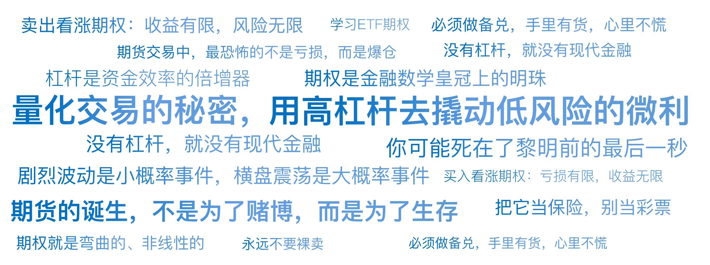

# 07｜衍生品的杠杆魔法：期货与期权

你好，我是陈旸。

巴菲特曾经说过一句名言：“衍生品是金融大规模杀伤性武器。”但在量化交易的世界里，我更倾向于另一句格言：“没有杠杆，就没有现代金融。”很多散户对衍生品这三个字充满了恐惧，觉得那是赌徒的乐园，是倾家荡产的捷径。确实，如果你把它当彩票买，它就是世界上最快的碎钞机。但如果你把它当工具用，它就是世界上最精密的防御武器。

在上一讲，我们谈到了 A 股的 T+1 和涨跌停限制。今天，我们要走进一个完全不同的世界。在这里，没有 T+1，你可以随时买卖；在这里，资金利用率可以放大 10 倍甚至 100 倍；在这里，你可以赚钱，不仅因为价格涨了，还因为时间流逝了，或者因为大家恐慌了。

这就是衍生品的世界，主要是**期货（Futures）和期权（Options）**。今天，我们就来揭开这层魔法面纱，看看 AI 量化是如何利用这些危险品来构建绝对收益的。

## **阿基米德的支点：杠杆的本质**

**什么是杠杆？**

阿基米德说：“给我一个支点，我能撬起地球。”在金融里，这个支点就是保证金。在股票交易中（如果不融资），你有 10 万块，只能买 10 万块的股票。这是一倍杠杆。在期货交易中，你只需要缴纳 10% 的保证金，就能买卖 100 万的货物。这是 10 倍杠杆。

**数学上的魔法：**

- **场景**：资产价格上涨 1%。
- **现货（1 倍）**：你赚 1%。
- **期货（10 倍）**：你的本金赚了 10%。

听起来很美？别忘了硬币的另一面。

- **场景**：资产价格下跌 10%。
- **现货（1 倍）**：你亏了 10%，还剩 9 万。只要不卖，还能等反弹。
- **期货（10 倍）**：你亏了 100%，本金归零。这叫爆仓。

**量化视角的杠杆**

对于散户，杠杆是贪婪的放大器。对于量化，杠杆是资金效率的倍增器。量化策略通常追求的是微小的、确定的优势（比如 0.2% 的套利空间）。如果不加杠杆，0.2% 的收益扣掉手续费就没肉了。但如果加上 10 倍杠杆，0.2% 就变成了 2%。**量化交易的秘密，往往在于：用高杠杆去撬动低风险的微利。**

## **期货：穿越时空的线性契约**

期货的诞生，不是为了赌博，而是为了生存。

**农民与面包师的故事**

想象你是一个种小麦的农民。你最怕什么？怕丰收时麦价大跌。想象你是一个面包师。你最怕什么？怕麦价大涨，面粉买不起。于是，你们签了一张契约：“约定在 3 个月后，面包师以每吨 2000 元的价格，收购农民的 10 吨小麦。”这张纸，就是期货合约。

- 农民（空头）：锁定了卖价，不再怕跌。
- 面包师（多头）：锁定了买价，不再怕涨。

这就是期货最原始的功能：套期保值（Hedging）。

**量化的玩法：对冲与 Alpha 策略**

在 A 股，量化机构最喜欢用股指期货（IF/IC/IM）来做对冲。

**痛点：**你写了一个很牛的 AI 选股策略，选出了 50 只股票。回测显示，这 50 只股票每年能跑赢大盘 20%。但是，如果今年大盘跌了 30% 呢？你的股票虽然跑赢了大盘，但依然亏了 10%（-30% + 20% = -10%）。对于追求绝对收益的量化基金，这是不可接受的。

**解决方案：Alpha 对冲**

- **做多**：买入那 50 只优秀的股票（市值 1000 万）。
- **做空**：在期货市场上，卖空同等价值的股指期货（市值 1000 万）。

**魔法发生了！**

**如果大盘跌 30%**：你的股票亏了 1000 万 × 10%（因为跑赢大盘）= 亏 100 万。但是！你的期货空单赚了 30% = 赚 300 万。总盈亏：赚 200 万。

**如果大盘涨 30%**：你的股票赚了 50%。你的期货空单亏了 30%。总盈亏：还是赚 200 万。

看到没？通过期货对冲，我们把大盘涨跌这个最大的不确定性因子（Beta）给消除了，只留下了你选股能力的超额收益（Alpha）。这就是为什么量化基金在熊市里也能赚钱的秘密。

## **期权：非线性的保险单**

如果说期货是线性的（涨一块赚一块），那么期权就是弯曲的、非线性的。它是金融数学皇冠上的明珠。

**买彩票与卖保险**

期权（Option），顾名思义，是一种权利。

**场景 A：买入看涨期权（Long Call）——买彩票**

你觉得茅台（假设现价 100 元）下个月会暴涨。但你只有 5 块钱。你给持有茅台的人 5 块钱（权利金），买了一个权利：“下个月我有权按 100 元买入你的茅台。”

- **结局 1**：下个月茅台涨到 150 元。
- 你行使权利，按 100 元买入，转手 150 卖出。赚 50 - 5 = 45 元。
- 本金 5 元，赚 45 元，收益率 900%。
- **结局 2**：下个月茅台跌到 80 元。
- 你不行使权利（没人傻到按 100 买 80 的东西）。
- 你只损失那 5 块钱权利金。

这就叫：**亏损有限（最多亏权利金），收益无限。**

**场景 B：卖出看涨期权（Short Call）——开保险公司**

你是那个收了 5 块钱的人。

- **结局 1**：茅台暴涨。你要赔死（必须按 100 元把股票卖给对方）。
- **结局 2**：茅台不涨，或者跌了。你白赚 5 块钱。

这就叫：**收益有限（只赚权利金），风险无限。**

**是赌场还是保险公司？**

很多散户喜欢买期权（当买方），因为他们喜欢以小博大的彩票感。但专业的量化机构，更多时候是在卖期权（当卖方）。为什么呢？

**因为在统计学上，剧烈波动是小概率事件，横盘震荡是大概率事件。**就像保险公司知道，虽然偶尔会发生大火灾赔一大笔钱，但绝大多数时候房子是没事的，保费是白赚的。

AI 量化策略中的卖波（Short Volatility）策略，就是在做保险公司的生意：通过精密的数学计算，赚取时间流逝带来的保费（Theta 收益）。

## **希腊字母：AI 眼中的仪表盘**

在 AI 量化模型里，我们不看涨跌，我们看希腊字母。这是驾驶衍生品这架战斗机的仪表盘。

**Delta**：速度。a. 股价涨 1 元，期权涨多少？b. AI 通过控制 Delta 来决定是做多还是做空。**Gamma**：加速度。a. GME 逼空事件的核心（第 26 讲会细讲）。它代表了爆发力。**Theta**：时间的租金。a. 期权每过一天，价值会自然损耗多少？b. 这是卖方最喜欢的指标。AI 会寻找 Theta 衰减最快的那一刻（通常是期权快到期时）去卖出，躺着赚钱。**Vega**：情绪的温度计。a. 波动率每变动 1%，期权价格变动多少？b. 当市场恐慌时（VIX 暴涨），Vega 会让期权价格飙升。

**AI 的优势：**

人类的大脑很难同时处理这四个维度的动态变化，但 AI 可以。AI 大模型通过写代码，可以实时监控全市场几千个期权合约的希腊字母，寻找定价错误的合约进行套利。

## **实战陷阱：衍生品的黑暗面**

衍生品是魔戒，戴上它你有无穷的力量，但也会被它反噬。

**归零的宿命**

股票跌了 90%，只要不退市，还有回本的希望。期权和期货都有到期日。一旦到期日到了，如果你判断错了，你的资产就是物理意义上的清零。那是一张废纸。所以，不要把身家性命压在临近到期的期权上（末日轮）。

**保证金的追杀**

在期货交易中，最恐怖的不是亏损，而是爆仓。当你的保证金不足以维持头寸时，券商不会等你筹钱，系统会强制按市价平仓。这意味着：你可能死在了黎明前的最后一秒。比如你做多，行情先暴跌把你强平了，然后立马 V 型反转暴涨。行情看对了，但钱没了。

**流动性陷阱**

有些冷门的期权合约，一天只有几笔成交。AI 回测时觉得自己能买能卖。实盘时，你想平仓平不掉，对手盘的价差大到让你绝望。

## **AI 量化策略建议**

如果你是新手，我对衍生品的建议只有三个字：先别碰。如果你一定要碰，请遵循以下路径：

**把它当保险，别当彩票**

如果你持有大量股票（现货），担心大跌。你可以买入一份认沽期权（Put Option）。这相当于给股票买了车险。如果股价跌了，期权赔你钱；如果股价涨了，你只损失一点保费。这是最健康的衍生品用法。

**学习 ETF 期权**

不建议玩个股期权（A 股目前门槛极高），也不建议玩高风险的期货。从 50ETF 期权或 300ETF 期权开始观察。它们的流动性好，规则透明，是学习这些希腊字母最好的练兵场。

**永远不要裸卖**

所谓裸卖，就是你手里没有股票，却卖出看涨期权。如果股价暴涨，你的亏损是无限的。不管是 AI 还是人工，风控的第一条铁律：必须做备兑，手里有货，心里不慌。

## 本讲金句弹幕

## **课后思考题**

假设你是一个量化交易员。现在 AI 预测未来一个月市场会在 3000 点到 3200 点之间横盘震荡（不涨也不跌）。

如果你只做股票，你能赚到钱吗？（很难）如果你用期权，你可以怎么做来赚钱？

> 提示：思考一下卖保险的逻辑。既然不涨也不跌，是不是意味着那些买彩票（买看涨 / 看跌）的人都会输？你可以赚他们的权利金吗？这叫“卖出跨式策略”。

这道题没有标准答案，但它会帮你打开非线性交易的大门。欢迎你在评论区分享你的思考，如果你觉得有所收获，也欢迎你分享给其他朋友。下一讲，我们要从工具回到交易对象。我们将面对 A 股那 5000 只形形色色的股票，如何用 AI 给它们打标签？如何区分谁是渣男（垃圾股），谁是高富帅（蓝筹股）？

---
来源：极客时间
链接：https://time.geekbang.org/column/article/944830
日期：2026-05-18
