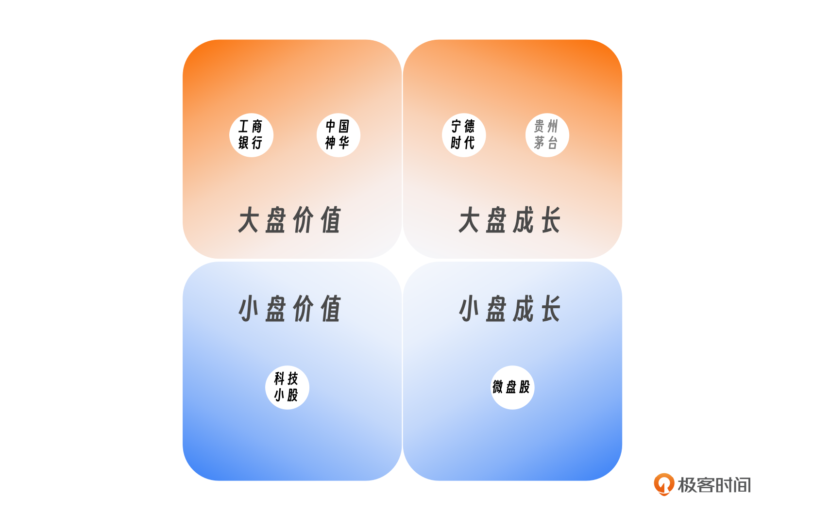
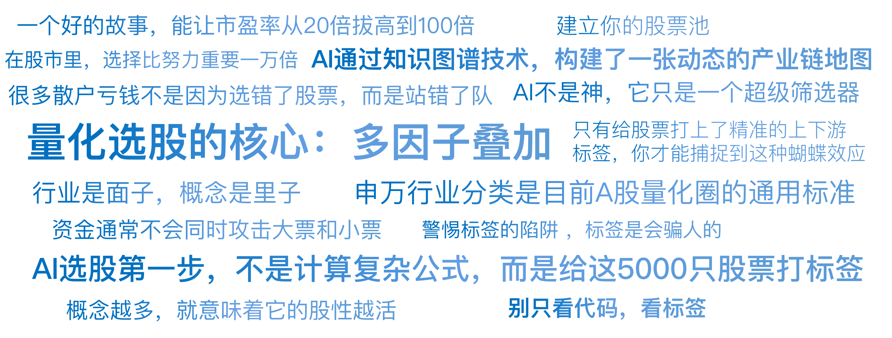

# 08｜给5000只股票画像（上）：行业、概念与风格

你好，我是陈旸。

请想象这样一个场景：你走进一家超级巨大的相亲角，里面有 5000 位候选人。你的任务是：在 10 分钟内，挑出一位未来一年最可能飞黄腾达的伴侣。如果你一个一个去聊天、看简历，别说 10 分钟，给你 10 年你也看不完。那高效的人是怎么做的？ 他们会先看标签。

- 程序员 vs 公务员（行业）
- 海归博士 vs 拆迁户（概念 / 题材）
- 稳重顾家 vs 激进冒险（风格）

如果你喜欢安稳，你会直接过滤掉“激进冒险”的标签；如果你看重潜力，你会重点筛选“海归博士”。通过标签筛选，5000 人瞬间变成了 50 人。这就是降维打击。

在 A 股市场，我们面对着超过 5000 只股票。对于散户，这是一个眼花缭乱的迷宫；但对于 AI 量化交易来说，这是一个巨大的结构化数据库。AI 选股的第一步，不是计算复杂的公式，而是给这 5000 只股票打标签。这就是我们常说的股票画像。

今天，我们来学习如何用量化思维给股票查户口。我们要讲的是三个最核心的标签维度：行业（赛道）、概念（故事）与风格（性格）。

## **第一张标签：行业（赛道）——资金流动的河床**

**1. 为什么男怕入错行？**

在股市里，选择比努力重要一万倍。如果你在 2020 年买了白酒行业的股票，哪怕是业绩最差的三线酒企，你也能翻倍。如果你在 2023 年买了房地产行业的股票，哪怕是龙头，你也可能腰斩。这就是贝塔（Beta）的力量。水涨船高，水落石出。资金就像水，行业就是河床。水流到哪里，哪里的鱼就活蹦乱跳。

**2. 量化的行业标准：申万一级**

在量化交易中，我们不说“做科技股”，我们说“做申万电子”或“申万计算机”。申万行业分类是目前 A 股量化圈的通用标准。它把全市场股票分为：

- **31 个一级行业**：如电子、医药生物、食品饮料、银行、国防军工。
- **134 个二级行业**：比如电子下面分为半导体、光学光电子。
- **346 个三级行业**：比如半导体下面分为分立器件、集成电路设计。

**3. AI 的进化：从静态分类到动态产业链**

传统的行业分类是死的，比如宁德时代，在申万分类里属于电力设备。但 AI 不满足于此。AI 通过知识图谱技术，构建了一张动态的产业链地图。

**AI 的视角**：它不仅仅把宁德时代看作电力设备，它看到的是一个巨大的蜘蛛网节点：

- **上游**：连接着赣锋锂业（锂矿）、恩捷股份（隔膜）。
- **下游**：连接着特斯拉（汽车）、蔚来（造车新势力）。
- **竞品**：连接着比亚迪（电池业务）。

**实战应用：供应链传导策略**

当 AI 监控到上游的碳酸锂价格暴跌时：

- 传统量化：可能只知道利空矿企。
- AI 量化：迅速推演。上游降价 = 中游成本降低 = 利好宁德时代。于是，AI 会在做空赣锋锂业的同时，反手做多宁德时代。

这就是产业链套利。只有给股票打上了精准的上下游标签，你才能捕捉到这种蝴蝶效应。

## **第二张标签：概念（故事）——情绪的放大器**

**1. 行业是面子，概念是里子**

如果说行业是基本面，那么概念就是想象力。A 股是一个非常讲究故事的市场。一个好的故事，能让市盈率从 20 倍拔高到 100 倍。比如低空经济、元宇宙、室温超导、Kimi 概念股。这些概念在申万行业里是找不到的。它们是游资和市场合力创造出来的虚拟标签。

**2. 概念的特征：多重身份**

一只股票只能属于一个行业，但可以拥有几十个概念。比如万兴科技：

- **行业**：计算机。
- **概念**：Sora 概念、AI 大模型、出海概念、短视频剪辑……

概念越多，意味着它的股性越活。当市场炒作 AI 时，它涨；当市场炒作出海时，它也涨。这就是所谓的辨识度。

**3. AI 的应用：自动打标**

概念是稍纵即逝的。今天早上的新闻，可能下午就变成了一个新概念（比如全固态电池）。等传统的分析师把股票整理好，黄花菜都凉了。AI 量化使用 AI 大模型接口，实时监控全网新闻和研报。

**工作流：**

**抓取**：AI 爬取财联社电报：“华为发布全液冷超充技术”。**提取**：识别关键词“全液冷”“超充”。**匹配**：在数据库中搜索哪些上市公司的公告里包含这些技术关键词，或者哪些公司是华为的供应商。**打标**：瞬间给永贵电器、双杰电气打上“华为液冷超充”的新标签。**买入**：在概念板块指数还没生成之前，AI 已经完成了潜伏。

这就是为什么现在的热点发酵速度极其快。你还在查这公司是干嘛的，AI 已经把它打上网红标签并推上网红榜一了。

## **第三张标签：风格（性格）——量化的灵魂**

前两个标签是给散户看的，第三个标签是给专业机构看的。风格（Style），决定了这只股票的性格底色。

**1. 两个最核心的风格维度**

就像人有外向和内向，股票主要看两个维度：

- **市值风格（Size）**：大盘股 vs 小盘股。
- **估值风格（Value）**：价值股 vs 成长股。

这构成了四个象限：

**大盘价值**：如工商银行、中国神华。性格稳重，不爱动，分红高。**大盘成长**：如宁德时代、贵州茅台（曾经）。性格也是大块头，但跑得快，业绩增速高。**小盘成长**：如刚上市的科技小票。性格泼辣，波动极大，要么翻倍要么退市。**小盘价值**：如一些被遗忘的传统行业小公司（微盘股）。

**2. 著名的风格轮动**

A 股市场有一个著名的现象：大小盘跷跷板**。**资金通常不会同时攻击大票和小票。

- **2017-2020 年**：是核心资产的天下（大盘成长）。买茅台、买平安躺赢。小票跌成了狗。
- **2021-2023 年**：是国证 2000 和微盘股的天下（小盘风格）。茅台跌跌不休，不知名的小票涨上天。

**AI 的应用：风格择时**

量化模型会实时计算大小盘指数的相对强弱。

- 当 AI 发现：代表小盘股的中证 1000 指数，连续跑赢代表大盘股的沪深 300 指数。
- AI 指令：切换风格。卖出所有的大盘股，一键买入小盘股量化指增基金。

很多散户亏钱，不是因为选错了股票，而是站错了队。在小盘股风格里死守大盘股，或者在大盘股风格里去赌小妖股，都是逆势而为。

## **AI 的终极选股逻辑：多维向量匹配**

了解了下面的三个标签，你就明白了 AI 是怎么选股的**。AI 不是神，它只是一个超级筛选器。**

**场景示例：**假设现在是 2026 年的某一天。

**宏观环境**：流动性宽松（利好小盘），AI 技术爆发（利好科技）。

**人类交易员的需求**：“我要买科技股。” （结果：选出 500 只，太宽泛，买入后发现有的涨有的跌。）

**AI 交易员的筛选逻辑（Prompt）**：“请帮我筛选满足以下标签的股票：

**行业标签**：申万计算机或申万通信（赛道对）。**概念标签**：必须包含算力租赁或 CPO 光模块（故事要性感）。**风格标签**：市值 < 100 亿（小盘，弹性大）。营业收入增长率 > 30%（真成长，不是纯炒作）。动量排名 > 前 10%（近期必须是强势的）。”

**输出结果**：5300 只股票 -> 行业筛选剩 200 只 -> 概念筛选剩 50 只 -> 风格筛选剩 5 只。这 5 只，就是六边形战士。

这就是量化选股的核心：多因子叠加。我们不赌某一个标签，我们赌的是概率的叠加。当一只股票同时具备了“好赛道 + 好故事 + 好性格”时，它上涨的概率将从 50% 提升到 70%。

## **AI 量化策略建议**

听完这一讲，你可能会有种豁然开朗的感觉。原来乱糟糟的股市，是可以被结构化的。

**1. 别只看代码，看标签**

以后看股票，不要只盯着 K 线看涨跌。去同花顺 F10，或者萝卜投研、QMT 里，看它的标签。问自己三个问题：

- 它属于哪个行业？现在这个行业是顺风还是逆风？
- 它有什么核心概念？这个概念是过气了（如口罩）还是正当红（如人形机器人）？
- 它是大票还是小票？现在的市场风格在它这边吗？

**2. 建立你的股票池**

不要每次都在 5000 只股票里大海捞针。利用 AI 工具（比如问财搜索），建立几个不同风格的股票池：

- **进攻池**：小盘 + 科技概念 + 高动量。
- **防守池**：大盘 + 高股息 + 低估值。
- **潜力池**：机构重仓 + 业绩超预期。

根据市场行情，在这几个池子里切换，而不是在全市场乱撞。

**3. 警惕标签的陷阱**

标签是会骗人的。

- **概念蹭热点**：很多公司发公告说自己有 AI 业务，其实只是办公在 DeepSeek。AI 量化需要通过供应链数据去伪存真。
- **风格漂移**：有些基金经理名为中小盘精选，结果偷偷买了茅台。你需要看它的持仓数据，而不是看名字。

## 本讲金句弹幕

## **课后思考题**

打开你的持仓，挑一只亏损最严重的股票。请给它打上行业、概念、风格三个标签。然后去看看，过去半年，市场涨得最好的股票是什么标签？

你会发现，你可能是在用“大盘 / 价值 / 房地产”的标签，去对抗“小盘 / 成长 /AI”的市场风口。输给风口，不丢人。但下次，我们要学会站在风口上。下一讲，我们要专门讲一讲那类性格最稳重的股票。它们是量化资产配置的压舱石，是普通人战胜通胀的神器。

---
来源：极客时间
链接：https://time.geekbang.org/column/article/944854
日期：2026-05-18
