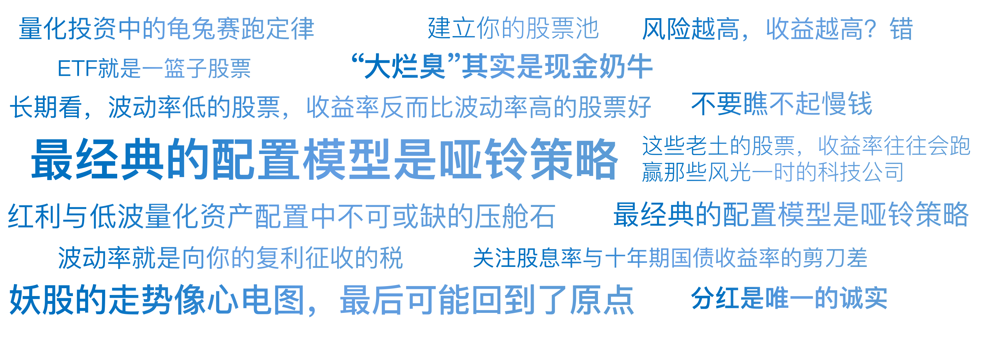

# 09｜给5000只股票画像（下）：红利低波与ETF配置

你好，我是陈旸。

在上一讲，我们置身于一个喧闹的舞池，周围是人工智能、低空经济这些性感的概念，我们挑选的是那些性格泼辣、上蹿下跳的成长股。那是猎人的游戏，刺激但充满风险。

今天，我们要离开喧闹的舞池，来到安静的后花园。这里没有一夜暴富的神话，只有像钟摆一样规律的现金流。这里的股票，可能一年都上不了一次头条，名字听起来土里土气（比如某某高速、某某水电、某某银行）。但如果你拉长周期看，比如看十年，你会发现一个惊人的事实：**这些老土的股票，收益率往往会跑赢那些风光一时的科技公司。**

这就是量化投资中的龟兔赛跑定律。今天我们要给股票打上最稳重的两个标签：红利与低波。这是普通人构建税后收入系统的基石，也是量化资产配置中不可或缺的压舱石。

## **第一张标签：红利——现金流的试金石**

**为什么说分红是唯一的诚实？**

在金融圈，有一句名言：“利润只是会计的意见，现金才是事实。”上市公司可以修饰财报，把应收账款做成利润（其实钱没收到），把折旧延后（让利润看起来更高）。但是，分红是装不出来的。分红意味着公司必须把真金白银从银行账户里划到股东的账上。这需要实打实的现金流能力。

对于 AI 量化模型来说，股息率是一个权重很高的因子。

- **定义**：年度分红金额 / 股票价格。
- **意义**：如果你把股票看作一张债券，股息率就是它的利息。

**量化策略：狗股策略**

这是一个风靡华尔街半个世纪的经典量化策略。

- **规则**：每年年初，在道琼斯指数（或沪深 300）成份股中，选出股息率最高的 10 只股票。平均买入，持有一年。
- **逻辑**：高股息率意味着两个信号：
- 公司极其赚钱（有钱分）。
- 股价处于低位（分母小，股息率才高）。

这本质上是一个 “深度价值 + 高现金流”的双重过滤器。在 A 股，这类股票通常集中在：银行、煤炭、石油、电力、高速公路。它们被戏称为“大烂臭”（大盘、烂板、臭名昭著的不涨），但其实它们是现金奶牛。

**AI 的进化：避开红利陷阱**

单纯看股息率，有一个致命的陷阱。

**场景**：某海运公司，因为周期爆发，去年赚了 1000 亿，大额分红，股息率高达 20%。

**散户反应**：哇！存银行才 2%，买这个能赚 20%，快买！

**结局**：今年周期结束，业绩亏损，不分红了，股价腰斩。你贪了它的利息，它吞了你的本金。这就是红利陷阱。

**AI 如何避坑？**AI 不只看静态的股息率（TTM），它会看分红的持续性和现金流质量。

- **因子 1：分红连续性**。过去 5 年是否每年都分红？且分红比例稳定？
- **因子 2：分红覆盖率**。每股自由现金流 / 每股分红。如果小于 1，说明公司在借钱分红（打肿脸充胖子），AI 会直接剔除。
- **因子 3：行业周期位置**。AI 结合行业标签，识别出这是周期性的一次性分红，还是公用事业的稳定性分红。

## **第二张标签：低波——反直觉的胜利**

**风险越高，收益越高？错！**

金融学教科书告诉我们：高风险对应高收益。但在股市实战中，存在一个著名的低波异象。长期来看，波动率低的股票，收益率反而比波动率高的股票要好。

为什么？ 因为人性喜欢买彩票。那些高波动的妖股（一年翻倍或归零），就像彩票，被散户过度追捧，导致价格虚高（负期望）。而那些低波动的股票（每天涨跌几分钱），像白开水一样无聊，被市场冷落，导致价格低估（正期望）。

**数学上的解释：波动率税**

还记得我们在第 5 讲（凯利公式）里提到的几何平均值吗？

- 股票 A：第一年涨 50%，第二年跌 50%。两年后亏 25%。
- 股票 B：第一年涨 5%，第二年涨 5%。两年后赚 10.25%。

波动率就是向你的复利征收的税。低波因子的核心逻辑，就是通过减少回撤，来保护复利的种子。对于想要慢慢变富的普通人，低波策略是心理压力最小的选择。

**AI 的应用：寻找抗跌神器**

AI 如何筛选低波股票？ 它会计算每只股票过去一年日收益率的标准差。

- **筛选标准**：选择标准差最小的后 10% 股票。
- **行业特征**：通常是农业银行、长江电力、宁沪高速这种。不管牛市熊市，它们走势像一条缓慢向上的心电图。

## **终极武器：ETF——把个股打包**

如果你觉得选股还是太难，还是怕踩雷（比如财报造假），那么量化思维给你准备了终极武器——ETF（交易型开放式指数基金）。

**什么是 ETF？**

ETF 就是一篮子股票。你买入一股红利 ETF，相当于你同时买入了中国神华、格力电器、工商银行等 50 只高分红的股票。这就彻底消除了非系统性风险（个股暴雷风险）。哪怕其中一家公司倒闭了，对你的净值影响也只有 2%。

**Smart Beta：把量化策略产品化**

现在市场上有很多 **Smart Beta ETF**，它们其实就是基金公司把量化策略写死在了指数编制规则里。

- **红利 ETF**：就是用股息率因子选股的量化策略。
- **红利低波 ETF**：就是叠加了“股息率 + 低波动”双因子的量化策略。

**AI 量化的建议**：对于资金量小于 50 万的普通投资者，不要自己去选股构建红利策略，直接买红利低波 ETF 是性价比最高的选择。这相当于你雇佣了一个顶级量化团队帮你每个季度调仓，而你只需要支付极低的管理费。

## **资产配置：哑铃策略**

讲完了进攻型的行业 / 概念（上一讲）和防守型的红利 / 低波（这一讲），我们要把它们拼在一起，构建一个完整的 AI 量化账户。这就像健身，既要练肌肉（进攻），也要练心肺（防守）**。**最经典的配置模型是哑铃策略。

**哑铃的一头：进攻（20%-30% 仓位）**

- **对象**：上一讲提到的科技、小盘、高动量股票（如 AI、芯片）。
- **策略**：趋势跟踪、动量轮动。
- **目的**：博取超额收益，负责让账户资产上台阶。
- **心态**：接受高波动，哪怕回撤 20% 也能接受。

**哑铃的另一头：防守（70%-80% 仓位）**

- **对象**：这一讲提到的红利低波 ETF、大盘价值股。
- **策略**：网格交易、定投、长期持有。
- **目的**：提供安全垫和现金流（分红）。
- **心态**：稳如泰山，负责给进攻端输送子弹（用分红的钱去加仓科技股）。

**AI 的角色：动态平衡**

AI 在这个哑铃中间做什么？它做平衡手。

- **再平衡**：每隔一个月，AI 计算两边的比例。
- **场景 1**：
- 科技股大涨，进攻端仓位变成了 40%。
- AI 指令：止盈一部分科技股，买入红利低波 ETF。
- 逻辑：把泡沫变成压舱石，锁定利润。
- **场景 2**：
- 股市大跌，科技股腰斩，进攻端仓位变成了 10%。
- AI 指令：卖出一部分红利 ETF（它们通常抗跌），抄底科技股。
- 逻辑：低位捡带血的筹码。

这种高抛低吸的纪律，人类很难执行（舍不得卖涨得好的，不敢买跌得惨的），但 AI 可以冷血执行。这就是时间的玫瑰——通过不断的动态平衡，让资产螺旋式上升。

## **AI 量化策略建议**

如果说上一讲是教你如何成为那个最靓的仔，这一讲就是教你如何成为那个活得最久的老头。

**建立底仓思维（再次强调）**

红利低波资产，是做网格交易最好的底仓。因为它们波动小，不容易破网；因为有分红，哪怕被套了也有利息拿。在你的 QMT 策略里，你可以将红利低波 ETF 作为你的核心配置。

**关注股息率与十年期国债收益率的剪刀差**

这是一个宏观量化指标。

- 当 A 股核心资产（如沪深 300）的股息率 > 十年期国债收益率时。
- 这意味着：买股票比买国债更安全、更划算。
- 这是历史大底的信号，是所谓砸锅卖铁买股票的时刻。
- AI 会实时监控这个剪刀差，告诉你现在的市场到底是贵还是便宜。

**不要瞧不起慢钱**

很多人做量化是为了年化 100%。但红利低波策略的长期年化可能只有 10%-15%。不要小看这 10%。加上分红复投，加上打新收益，加上网格增强，这可能意味着你的资产每 5-6 年就能翻一倍。而且，你不需要每天盯着 K 线心惊肉跳。你可以去工作，去旅游，去睡觉。这才是真正的 AI 为你打工。

## 本讲金句弹幕

## **课后思考题**

请去查一下红利低波 50 ETF（515450）或者是长江电力（600900）过去 10 年的 K 线图。把它们和创业板指或者当年的妖股对比一下。

你会发现，妖股的走势像心电图，最后可能回到了原点。而红利低波的走势，像画在纸上的一条斜率为 45 度的直线，虽然每天涨得很慢，但几乎从不回头。

你更希望你的家庭财富曲线是哪一种？欢迎你在留言区分享你的想法，如果你有所收获，也欢迎你把这节课分享给需要的朋友，我们下一讲将正式进入招式篇。既然我们已经选好了对象（不管是渣男小票，还是老实人红利股），我们该在什么位置买入？什么位置卖出？ 这就要用到 K 线的几何学。

---
来源：极客时间
链接：https://time.geekbang.org/column/article/945768
日期：2026-05-18
