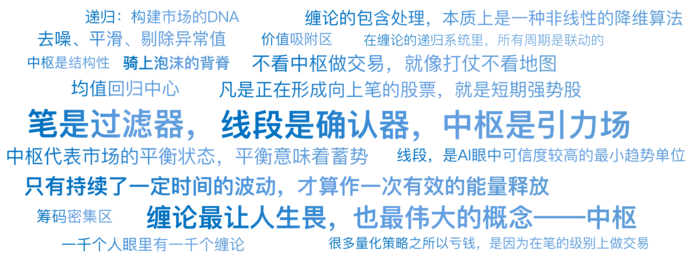

# 11｜量化视角看缠论（上）：笔、线段与中枢

你好，我是陈旸。

在金融交易圈，有一本无字天书，那就是《缠中说禅》留下的博客。据说，读懂它的人，能把股市变成提款机；读不懂的人，会走火入魔。

为什么缠论这么难学？因为一千个人眼里有一千个缠论。对于同一个走势，张三说这是一笔，李四说这不是。主观性太强，导致它很难被标准化。但在 AI 量化思维里，我们不允许模棱两可。我们要做的，是把缠论的形态学，降维成几何学，最后编码成数学逻辑。让我们开始这场去魅之旅。

## **数据清洗的艺术：包含关系**

在量化交易中，拿到原始数据的第一步是什么？是数据清洗。去噪、平滑、剔除异常值。

缠论的第一步，也是一模一样的逻辑。它叫 **K 线包含处理**。

打开任何一张 K 线图，你会发现很多 K 线是纠缠在一起的：一根长阳线后面，跟着一根完全被包在里面的小十字星；或者一根大阴线包住了一根小阳线。

在缠论（和量化）看来，这种被包住的 K 线，是没有独立意义的。它只是市场犹豫、震荡的噪音。如果不处理它，你的算法就会被这些噪音误导，频繁发出错误的买卖信号。

**量化翻译：**

**缠论的包含处理，本质上是一种非线性的降维算法。****它通过特定的规则（高高取高、低低取低等），把几根重叠的 K 线****合并**成一根新的标准 K 线。

- **原始数据**：充满了毛刺和随机波动。
- **处理后数据**：结构更加清晰，趋势更加平滑。

这就像我们在训练 AI 模型时使用的池化层，目的是提取主要特征，忽略次要细节。所以，别小看这一步。这是建立量化规则的基石：**只有剔除了噪音，才能看清方向。**

## **市场的最小单元：笔**

处理完 K 线后，我们得到了标准 K 线。接下来，我们要寻找市场的转折点。在缠论中，这叫做分型（上一讲提到过）：

- **顶分型**：中间高，两边低（^ 形）。
- **底分型**：中间低，两边高（V 形）。

如果你把所有的顶分型和底分型连起来，是不是就构成了走势？不对。那样线条会太乱、太碎。缠论引入了一个极其天才的概念——笔。

**定义：**一笔，必须由一个顶分型和一个底分型构成，且中间必须至少隔着一根独立的 K 线。

**量化视角的深度解读：**

为什么中间要隔着 K 线？为什么不能直接连？这在信号处理中，叫过滤器（Filter）。如果是紧挨着的顶底分型，说明行情只是瞬间跳动了一下，并没有形成真正的波段。笔的定义，强制要求时间跨度。它在告诉我们：**只有持续了一定时间的波动，才算作一次有效的能量释放。**

所以，在量化策略里，笔就是一个低通滤波器。它过滤掉了那些高频的、杂乱的波动，只保留了那些具有一定幅度和时间的走势片段。

- **传统技术分析**：用 ZigZag 指标来画折线，通常只看幅度（比如回撤 5% 算一个拐点）。
- **缠论的笔**：同时考虑了空间（分型结构）和时间（独立 K 线数量）。

这使得笔成为了目前技术分析领域中，定义最严格、最能反映市场真实波动的最小单位。

在 QMT 里，我们可以写一个算法，自动识别全市场 5000 多只股票的笔。凡是正在形成向上笔的股票，就是短期强势股。

## **趋势的确认：线段**

有了笔，为什么还需要线段？因为笔还是太不稳定了。一笔上涨，可能随时被一笔下跌终结。

**缠论规定：至少由三笔（下 - 上 - 下，或上 - 下 - 上）且有重叠的部分，才能构成一个线段。**

这又是什么逻辑？

这在量化里，叫趋势确认。

想象一下：

- **一笔**：像是一个人迈出了一步。他可能是想往前走，也可能只是试探一下。
- **线段**：像是一个人迈出了步子（第一笔），退半步蓄力（第二笔），然后继续向前迈进（第三笔）。

当线段形成时，说明市场的力量已经经过了一次 N 字形的验证。多空双方经过了一次完整的交手（进攻 - 防守 - 再进攻），方向被确立了。

**量化应用：**

很多量化策略之所以亏钱，是因为在笔的级别上做交易（太敏感）。而在线段级别做交易，虽然入场点会慢半拍，但胜率会大幅提高。线段，是 AI 眼中可信度较高的最小趋势单位。

## **灵魂的核心：中枢**

好了，终于讲到了缠论最让人生畏，也最伟大的概念——中枢。缠论原文的定义极其绕口：“某级别走势类型中，被至少三个连续次级别走势类型所重叠的部分……”听晕了吗？我们把它扔掉。

**量化视角的中枢是什么？**

请想象两军对垒。

- 多头进攻，占领高地。
- 空头反扑，夺回阵地。
- 多头再进攻，僵持不下。

这个僵持不下的区域，就是中枢。

在量化图表上，这对应着：

**筹码密集区**：大量的成交量堆积在这里，说明大家都认可这个价格。**价值吸附区**：价格涨上去，会被拉回来；跌下去，也会被拉回来。中枢就像一个**黑洞**。**均值回归中心**：价格围绕这个中心波动。

**中枢的物理意义：**

中枢代表了市场的平衡状态。既然是平衡，就意味着蓄势。

- **牛市**就是中枢不断向上移动的过程（平衡 - 突破 - 新平衡）。
- **熊市**就是中枢不断向下移动的过程。
- **盘整**就是围绕同一个中枢反复震荡的过程。

**这给了量化交易一个上帝视角：**

绝大多数传统的量化指标（如 MACD、KDJ）都是线性的，它们只管现在的价格比起昨天是涨是跌。而中枢是结构性的。它告诉我们现在的价格处于什么位置。

- **在中枢下方？** 那是买点（拉回引力）。
- **在中枢上方？** 那是卖点（回归引力）。
- **刚刚突破中枢？** 那是主升浪的开始（脱离引力）。

如果说 K 线是士兵，那么中枢就是战场上的阵地。不看中枢做交易，就像打仗不看地图，只知道冲锋，最终必然陷入埋伏。

## **递归：构建市场的 DNA**

现在，我们把“包含处理 -> 笔 -> 线段 -> 中枢”串起来。你会发现，这不仅是一套交易理论，这简直就是计算机科学中的递归数据结构！

- **1 分钟图上**：3 笔构成 1 个线段，3 个线段重叠构成 1 分钟中枢。
- **5 分钟图上**：这一连串的 1 分钟走势，在 5 分钟图上可能只是一笔。
- **30 分钟图上**：一连串的 5 分钟走势，构成了 30 分钟的一笔……

这就是我们在上一讲提到的俄罗斯套娃。**AI 量化如何利用这个特性？**我们不需要人眼去盯着屏幕。我们可以编写一个 Python 递归函数：

```
def find_center(level):
    sub_movements = get_data(level - 1) # 获取次级别数据
    # ... 计算逻辑 ...
    return center
```

这个程序可以自动从 1 分钟级别开始推导，一直推导到年线级别。它能清晰地告诉你：

- 现在 1 分钟级别是在**下跌**（空头主导）。
- 但 5 分钟级别是在**中枢震荡**（平衡）。
- 而日线级别是在**构建大底**（多头蓄势）。

**这种立体化的市场分析，是任何单一指标（如均线金叉）都无法比拟的。它解决了量化交易中最大的难题：策略的适用周期。**

你不再需要纠结这个策略是跑 5 分钟好还是跑日线好。因为在缠论的递归系统里，所有周期是联动的。你是在用上帝视角，看着大鱼吃小鱼，小鱼吃虾米。

## **AI 量化策略建议**

这一讲我们完成了对缠论骨架的拆解。如果你觉得还有点抽象，没关系。记住以下三个核心结论就够了：

**笔是过滤器**：它帮我们过滤掉假突破和微小波动，只保留真实的波段。**线段是确认器**：它告诉我们趋势是否已经形成。**中枢是引力场**：它告诉我们价格现在是处于平衡还是失衡，是该高抛低吸还是追涨杀跌。

在没有 AI 的时代，学习缠论需要极高的悟性，需要手绘几千张图。但在 AI 时代，我们可以通过代码在 QMT 平台上画出这些图形。我们不需要成为画图大师，我们只需要理解它背后的数学逻辑，然后让 AI 帮我们去执行。

## 本讲金句弹幕



## **课后思考题**

请打开一只你被套牢的股票。试着找一下，把你套住的那个位置，是不是正好在一个中枢的上方？你是不是在主力刚刚构建好阵地准备诱多的时候，冲进去站岗了？如果是，请不要难过。因为你那是输给了数学结构，非战之罪。

## **下节预告**

不管是笔、线段还是中枢，它们都是静态的结构。交易不仅需要结构，更需要动力。怎么判断一个中枢即将被突破？怎么判断一笔上涨即将结束？下一讲，我们将揭秘缠论中离交易最近的部分——背驰与三类买卖点。我会用量化语言告诉你：所谓的抄底，在数学上究竟是在抄什么？

---
来源：极客时间
链接：https://time.geekbang.org/column/article/947053
日期：2026-05-18
