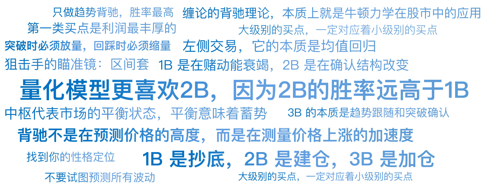

# 12｜量化视角看缠论（下）：背驰与第一二三类买卖点

你好，我是陈旸。

请想象这样一个物理场景：你把一个网球用力抛向天空。

- 阶段一：球向上飞，速度很快（动能大）。
- 阶段二：球还在向上飞，但速度越来越慢，直到停在最高点（动能衰竭，重力势能最大）。
- 阶段三：球开始下落（趋势反转）。

我们在做交易时，最想抓的是哪个点？当然是最高点做空或者最低点抄底。但是，大多数散户是死在半山腰的。因为他们看到球还在往上飞（价格还在涨），就以为球会一直飞到火星去。

**缠论的背驰理论，本质上就是牛顿力学在股市中的应用。它不是在预测价格的高度，而是在测量价格上涨的加速度。**当加速度为负，且速度趋近于零时，量化模型就会发出那个致命的信号：背驰，反转将至。

## **动量的物理学：背驰的本质**

在传统技术分析里，大家也看背离，比如 MACD 顶背离、底背离。但传统的背离往往不准，经常出现背离之后还有背离，把抄底的人埋了一遍又一遍。为什么？因为传统的背离只看指标，不看结构。缠论的伟大之处在于，它给背离加上了严格的结构约束。

**1. 缠论背驰的量化定义**

只有在趋势中，才存在背驰。什么是趋势？上一讲说了，至少包含两个同级别的中枢（比如下跌趋势：中枢 A + 下跌段 b + 中枢 B + 下跌段 c）。

**背驰的判断公式：**

```
Momentum(c) < Momentum(b)
```

即：**离开第二个中枢的力度，小于离开第一个中枢的力度。**

**2. 如何量化力度？**

在 QMT 等量化软件中，我们不需要凭感觉。我们有精确的算法：

- **MACD 红绿柱面积法**：计算下跌段 b 对应的 MACD 绿柱总面积（积分），和下跌段 c 的绿柱总面积。如果 Area© < Area(b)，且价格创了新低，这就是标准的趋势背驰。
- **斜率法**：计算 b 段下跌的斜率和 c 段下跌的斜率。如果 c 变平缓了，说明空头力量在衰竭。

**物理学解释：**

空头第一次砸盘（b 段），势如破竹，砸出了一个中枢 B。

空头第二次砸盘（c 段），虽然价格创了新低，但明显感觉砸不动了，MACD 面积在缩小。

这就好比两军交战，第一次冲锋杀敌一千，第二次冲锋虽然又前进了十米，但已经精疲力竭。这时候，AI 模型会告诉你：**这不是下跌的延续，这是下跌的尽头。**

**注意区分：盘整背驰 vs 趋势背驰**

很多新手亏钱是因为混淆了这两个概念。

- **趋势背驰**：发生在两个中枢之后，是大反转信号（变天了）。
- **盘整背驰**：发生在一个中枢内部，往往只是小反弹，反弹完可能继续跌。

**量化策略：** 只做趋势背驰，胜率最高；盘整背驰风险太大，那是高频交易的战场。

## **勇敢者的游戏：第一类买卖点（1B/1S）**

当 AI 确认了趋势背驰成立的那一刻，就诞生了缠论中的第一个圣杯——**第一类买卖点**。

- **1B（第一类买点）**：长趋势下跌末端，背驰引发的**绝对底**（V 形反转点）。
- **1S（第一类卖点）**：长趋势上涨末端，背驰引发的**绝对顶**（A 形反转点）。

**量化视角的风险评估：**

第一类买点是利润最丰厚的，因为你买在了地板价。但它也是最危险的。为什么？因为背驰之后可以再背驰。就像你接飞刀，你以为刀停了，结果它只是顿了一下，继续往下掉。

**实战策略：**

在我的量化策略库里，我很少单独使用 1B。如果要用，需要叠加多因子共振：

**形态**：日线级别出现缠论趋势背驰。**情绪**：全市场恐慌指数（VIX）达到极致。**估值**：股价跌破历史 10% 分位。

**这就叫左侧交易。它的本质是均值回归。**适合资金量大、能承受短期浮亏的机构，或者拥有极高频 AI 算法（能毫秒级止损）的量化团队。对于普通散户，我的建议是：**欣赏它，但不要轻易触碰它。**

## **稳健者的福音：第二类买卖点（2B/2S）**

既然 1B 接飞刀太危险，那什么最安全？答案是：确认。当价格在 1B 触底反弹后，一定会有一个回撤的过程。

- 如果这个回撤跌破了 1B 的最低点，说明之前的背驰是假的，下跌继续。
- 如果这个回撤不破 1B 的最低点，并再次拐头向上。

Bingo！ 这就是第二类买点（2B）。

**量化视角的逻辑：**

2B 的本质是双底结构或次低点。它在数学上确认了下跌趋势结构的破坏。

- 1B 是在赌动能衰竭（物理博弈）。
- 2B 是在确认结构改变（几何确认）。

**为什么量化模型更喜欢 2B？因为 2B 的胜率远高于 1B。**虽然你的入场成本比 1B 高了那么一点点，但你为了这点成本买了一份极其重要的保险——趋势确认。

**QMT 策略实现：**

编写代码非常简单：

监控到潜在 1B（底分型）。监控随后的一笔上涨，再监控随后的一笔下跌。如果 下跌低点 > 1B 低点 且 底分型形成，直接满仓买入。

这是所有波段策略中，盈亏比和胜率平衡得最好的一个点。如果你这辈子只做一种交易，我建议你只做 2B。

## **追涨者的狂欢：第三类买卖点（3B/3S）**

如果你是一个激进的趋势交易者，你可能会觉得 2B 太慢了。你想抓那种主升浪，那种天天涨停的快感。缠论为你准备了核武器——第三类买卖点（3B）。

**定义：**价格在完成 1B 和 2B 后，强力突破了底部的中枢（彻底脱离引力区）。然后，价格有一个回踩动作。

**重点来了：**这个回踩，完全不进入中枢的内部（不触及中枢的上沿）。

这意味着什么？这意味着多头力量太强了，空头根本没有能力把价格打回原来的平衡区。中枢原本是引力（压力），现在变成了最强力的支撑。这就是第三类买点（3B）。

**量化视角的逻辑：**

3B 的本质是趋势跟随和突破确认。它对应的是道氏理论中的“确认突破有效”。

- **1B** 是抄底（熊末牛初）。
- **2B** 是建仓（牛市初期）。
- **3B** 是加仓（牛市主升浪）。

为什么说 3B 是狂欢？因为出现 3B，意味着行情进入了非线性加速阶段。这时候，市场情绪高涨，资金疯狂涌入。在量化回测中，3B 买点出现后的短期爆发力是最强的，持仓时间最短，收益效率最高。

但是，风险在哪里？风险在于假突破。如果回踩跌回了中枢，3B 就不成立了，反而可能演变成中枢震荡的扩大。所以，3B 必须配合成交量。突破时必须放量，回踩时必须缩量。

## **狙击手的瞄准镜：区间套**

好了，现在你知道了 1B、2B、3B。问题是，你怎么能在盘中精确到分秒不差地买入？比如，日线级别的 1B 出现了，你是在收盘前买，还是第二天开盘买？如果你等到日线收盘确认底分型，价格可能已经反弹了 5%，你的成本就高了。缠论提供了一个究极的战术——区间套。

**原理：大级别的买点，一定对应着小级别的买点。**

想象你在用显微镜看细菌：

**日线图（10 倍镜）**：看到股价正在背驰段下跌，即将形成 1B。**30 分钟图（100 倍镜）**：看到这一段日线的下跌，在 30 分钟上表现为一个完整的下跌走势类型，并且也在背驰。**5 分钟图（1000 倍镜）**：看到 30 分钟的最后一笔下跌，在 5 分钟上也是一个背驰，且正在形成 5 分钟的 1B。**1 分钟图（10000 倍镜）**：看到 1 分钟底分型确立。

开枪！

你在 1 分钟的背驰点下单。这一刻，你买到的不仅仅是 1 分钟的底，你同时买到了 5 分钟、30 分钟、甚至日线的底。这就是多周期共振的几何学表达。

**AI 量化的绝对统治力：**

人类大脑很难同时处理 4 个周期的递归逻辑。但这对 AI 来说，是小儿科。在 QMT 里，我们可以写一个递归函数，实时监控全市场。当 AI 发现某只股票同时满足：Daily_Divergence AND 30m_Divergence AND 5m_1B 时，它能在毫秒级内完成狙击。这就是为什么量化机构的成本永远比你低的原因。他们在用显微镜做手术，而你在拿着斧头砍树。

**【实战警示：关于信号闪烁】**

这里必须泼一盆冷水。AI 虽然快，但必须遵守规则。在实盘 Tick 数据流中，小级别的底分型（特别是 1 分钟级别）是非常不稳定的。可能这一秒底分型成立，下一秒价格跳水，底分型就消失了。

所以，在定义 AI 的开枪逻辑时，千万不要用当下的最高 / 最低价去触发（那是未来函数），而要用完成的 K 线（Close 价）去确认**。**

记住：**量化缠论不追求买在最低的那一分钱，追求的是结构的确定性。**

## **AI 量化策略建议**

到这里，我们用两讲的时间，讲解了缠论这个投资分析工具：

- **中枢**是骨架，告诉我们位置。
- **背驰**是肌肉，告诉我们要变盘了。
- **三类买卖点**是神经，告诉我们要行动了。
- **区间套**是瞄准镜，告诉我们精确时刻。

## 本讲金句弹幕



## **课后作业（非常重要）**

**不要试图预测所有波动**：缠论只做看得懂的走势。如果图形乱七八糟，没有清晰的中枢和背驰，AI 的指令是 Pass（放弃）。**找到你的性格定位**：喜欢刺激、追求暴利的，研究 3B（趋势突破）。资金量大、追求稳健的，死磕 2B（回调确认）。绝大多数人，请远离 1B（接飞刀），除非你有 AI 辅助。

## **下节预告**

讲完了缠论这种结构性战法，你可能会觉得画笔画线太麻烦。下一讲，我们将引入 AI 的视觉能力，看看 AI 是如何像人眼一样，瞬间识别出这些复杂形态的。

---
来源：极客时间
链接：https://time.geekbang.org/column/article/947062
日期：2026-05-18
