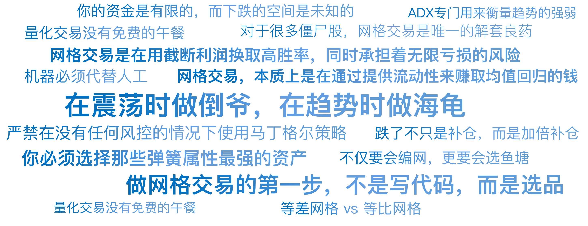

# 15｜永不疲倦的倒爷：网格交易

你好，我是陈旸。

如果说趋势交易者是猎人，趴在草丛里三天三夜，只为等一只大熊（大货）出现； 那么网格交易者就是渔夫，撒下一张大网，不管大鱼小鱼，只要进网就捞，讲究的是积少成多。很多新手第一次接触网格交易时，都会有一种相见恨晚的感觉：“天哪，这世界上竟然有这么傻瓜的赚钱方法？股价跌了我就买，涨了我就卖，来回做 T，这不就是高抛低吸吗？”

是的，网格交易带来的即时满足感是无与伦比的。你不需要像海龟交易员那样苦苦煎熬。你的账户里每天都有红色的止盈提示。这种多巴胺的持续刺激，会让很多交易者上瘾。但请记住我在第一讲里说的话：**量化交易没有免费的午餐。**如果有，那一定是你在某个你看不到的地方，支付了昂贵的代价。

## **网格的原理：做一只勤劳的蜜蜂**

网格交易的核心逻辑非常简单，简单到甚至不需要用到微积分。假设现在的股价是 10 元。你手里有 10 万元现金，还有 10000 股这只股票（总资产 20 万）。你命令计算机（QMT）在上面和下面分别挂好单子，织出一张“网”：

- **卖单网**：
- 10.5 元：卖出 1000 股
- 11.0 元：卖出 1000 股
- 11.5 元：卖出 1000 股
- ……
- **买单网**：
- 9.5 元：买入 1000 股
- 9.0 元：买入 1000 股
- 8.5 元：买入 1000 股
- ……

**场景示例：**

第一天，受消息影响，股价跌到了 9.5 元。系统动作：自动成交买入 1000 股。你手里的货变多了，钱变少了。关键一步：系统立刻在 10.0 元（刚才的起始价）挂出一笔“卖出单”，准备反手赚差价。第二天，市场情绪修复，股价反弹回 10.0 元。系统动作：自动成交卖出 1000 股。结果：你这一来一回，赚了 0.5 元 × 1000 股 =       **500 元**。

股价转了一圈，回到了原点。你的持仓数量没变，但你的口袋里多了 500 元现金。

这就是波动率套利。只要这只股票一直在 8 元到 12 元之间上下震荡（像心电图一样），你这台印钞机就会日夜不停地工作。你根本不在乎这家公司是造卫星的还是卖酱油的，你只在乎它跳得欢不欢。

**量化视角的定义：**

网格交易，本质上是在通过提供流动性来赚取均值回归的钱。你是在充当一个微型的做市商。当别人恐慌抛售时（跌），你接盘；当别人贪婪追涨时（涨），你派发。

## **数学基石：均值回归**

为什么网格能赚钱？因为它基于一个强大的物理学假设：均值回归。想象一根弹簧。你用力拉它（股价暴涨），它会产生一个反向的力；你用力压它（股价暴跌），它也会反弹。只要弹簧没有被拉断，它最终都会回到平衡位置。

在统计学中，这叫平稳时间序列。

- **趋势策略**赌的是：弹簧断了，或者这是一根无限延长的橡皮筋（发散）。
- **网格策略**赌的是：弹簧完好无损，且弹性十足（收敛）。

所以，做网格交易的第一步，不是写代码，而是**选品**。你必须选择那些弹簧属性最强的资产。

- **适合做网格的**：
- **ETF（指数基金）**：如沪深 300、恒生科技。指数很难归零，也不会像妖股一样天天涨停，它天生就是波动的。
- **外汇**：欧元兑美元。两个大国之间的货币汇率，通常极其稳定，就在一个区间里晃悠。
- **可转债**：下有保底（债性），上有顶（强赎），是网格的天堂。
- **绝对不能做网格的**：
- **垃圾股**：可能一路跌到退市，永远不回归。
- **强周期股（顶部）**：一旦周期结束，可能阴跌三年不回头。
- **妖股**：一旦被爆炒，波动率虽然大，但方向性极强，容易把你网破。

## **致命死穴：网破人亡**

听起来很美，对吧？那为什么还有人做网格亏得倾家荡产？因为网格交易有两个足以致命的破网时刻。

**死法一：卖飞暴涨**

假设你设置的网格上限是 15 元。结果这只股票遇到了大风口（比如最近的 AI 概念），一口气涨到了 30 元。在从 10 元涨到 15 元的过程中，你的网格系统会一路卖出，越涨越卖。等到了 15 元，你手里的股票**全部卖光了**。后面从 15 元涨到 30 元的这 100% 的利润，跟你一毛钱关系都没有。

虽然你没亏钱，但你看着别人赚得盆满钵满，这种踏空的痛苦，有时候比亏损更难受。这就是截断利润。

**死法二：接盘暴跌**

这是真正的灭顶之灾。假设你设置的网格下限是 5 元。结果公司财务造假，股价从 10 元一路跌到 1 元。在下跌过程中，你的网格系统会一路买入，越跌越买，不断补仓。

- 跌到 8 元，你加仓。
- 跌到 6 元，你重仓。
- 跌到 5 元，你满仓。
- 跌到 1 元……你的网格穿透了，资金耗尽了，你手里拿着一堆不值钱的废纸，被深套在山顶上。

这就是网格交易最残酷的真相：**它是在用截断利润换取高胜率，同时承担着无限亏损的风险。**在量化思维中，这叫推土机前捡硬币。你弯腰捡硬币（赚波动的钱）很爽，但如果不小心被推土机（单边趋势）压过，你的人生就结束了。

## **不同的织网手法：等差 vs 等比**

如果你决定承担这个风险，去做网格，那么你需要了解两种基本的织网数学模型。

**1. 等差网格**

- **规则**：每一格的价格差是固定的。比如每跌 **0.5 元**买一格。
- **特点**：比较直观。
- **缺点**：当股价较高时，0.5 元的占比很小（比如股价 100 元，0.5 元才 0.5%）；当股价较低时，0.5 元的占比很大（比如股价 5 元，0.5 元就是 10%）。这导致资金分布不均匀，低位消耗资金过快。
- **适用**：价格波动范围较小的资产（如银行股、债券）。

**2. 等比网格**

- **规则**：每一格的价格差是按百分比计算的。比如每跌 5% 买一格。
- **特点**：无论股价高低，每一格的盈亏比是固定的。
- **优点**：更符合复利逻辑。在低位时网格会变密，在高位时网格变稀疏。
- **适用**：波动率较大的资产（如科技股、加密货币）。

在 QMT 的实战训练营里，我会首选等比网格。因为它更科学，更能适应大幅度的市场波动。

## **AI 时代的补网匠：动态网格**

传统的网格是死的。你设置了 10 元到 15 元，它就死守这个区间。如果股价跑到 20 元，它就傻了。AI 量化思维引入了动态的概念。我们让网格长腿，跟着股价跑。

**1. 布林带网格**

还记得上一讲提到的均线吗？布林带就是均线 + 标准差。它天然就是一个动态的价值通道。

- **上轨**：压力位（网格上限）。
- **下轨**：支撑位（网格下限）。
- **中轨**：价值中枢。

**AI 策略逻辑：**

我们不再设置固定的 10-15 元。我们让网格区间等于布林带的上下轨。

- 当股价上涨，布林带开口向上，网格区间自动上移（解决了“卖飞”的问题）。
- 当股价下跌，布林带开口向下，网格区间自动下移。

**2. AI 趋势过滤器**

为了防止接盘暴跌，我们在网格策略里加一个熔断开关。还记得之前讲的 赫斯特指数 吗？它是从数学原理上判断趋势。而在实战交易中，我们还有一个更常用的工具，叫做 ADX（平均趋向指标），它专门用来衡量趋势的强弱。

- **正常震荡** （ADX < 25）：说明趋势极弱，市场处于震荡中。此时 开启网格，疯狂套利。
- **趋势爆发** （ADX > 50）：说明趋势极强（无论涨跌）。
- 如果是 **暴跌趋势** ：AI 识别出破网风险，**立刻停止买入**，甚至止损离场。
- 如果是 **暴涨趋势** ：AI 识别出主升浪，**停止卖出**，转为持仓待涨（让利润奔跑）。

这就是趋势 + 网格的双剑合璧。在震荡时做倒爷，在趋势时做海龟。这才是 AI 量化该有的样子。

## **马丁格尔策略的诱惑与陷阱**

在讲网格时，必须提一下它的魔鬼变种——马丁格尔策略，俗称倍投法。

**逻辑：**

跌了不只是补仓，而是加倍补仓。

- 10 元买 1 手。
- 跌到 9 元，买 2 手（摊低成本）。
- 跌到 8 元，买 4 手。
- 跌到 7 元，买 8 手……

**诱惑：**

只要股价反弹一点点，哪怕还没回到 10 元，只要回到 8.5 元，你就能连本带利全部赚回来！这也是很多散户最喜欢的解套战法。

**陷阱：**

这在数学上是指数级爆炸。如果是跌到 5 元呢？你需要买 2^5 = 32 手。如果是跌到 1 元呢？你需要买几千手。**你的资金是有限的，而下跌的空间是未知的。**一旦你在底部把子弹打光了，股价再跌一分钱，你就爆仓了。

**AI 量化的铁律：**

严禁在没有任何风控的情况下使用马丁格尔策略。如果非要用，必须结合凯利公式控制总仓位，并且设置最大加仓次数（比如最多加 3 次，再跌就认赔）。

## **AI 量化策略建议**

网格交易是量化入门最好的练手策略，因为它逻辑清晰，反馈即时。但要用好它，你需要注意以下几点：

**底仓思维**

做网格最好有底仓。比如你想长期持有茅台，但嫌它波动大。你可以拿 50% 的仓位做底仓不动（吃长期成长的钱），拿 50% 的仓位做网格（吃波动的钱）。这样既不会完全踏空，也能降低持仓成本。

**不仅要会编网，更要会选鱼塘**

不要在那种天天创新低的垃圾股里撒网。去 ETF 里撒网，去蓝筹股里撒网。鱼塘的质量决定了网格的生死。

**机器必须代替人工**

网格交易最大的敌人是疲劳和情绪。手动挂单是不可能的。一天几十次成交，你会累死。而且，当股价暴跌时，人性会让你不敢补仓（恐惧）；当股价暴涨时，人性会让你舍不得卖（贪婪）。**只有 QMT 这种自动化工具，才能像冷血杀手一样，严格执行每一次高抛低吸。**

## 本讲金句弹幕

## **课后思考**

打开你的持仓，找一只你被套了很久、但你确信它不会退市的股票。如果过去一年，你不是死拿，而是用这只股票做 5% 间距的网格交易。算一算，你现在的成本会降低多少？你会发现，对于很多僵尸股，网格交易是唯一的解套良药。

## **下节预告**

讲完了趋势（海龟）和震荡（网格），我们似乎已经覆盖了市场的所有状态？不。还有一种更高级的策略，它试图同时捕捉强者恒强的规律。它不需要你去判断大盘是涨是跌，它只需要你去判断谁涨得比谁快。下一讲，我们将进入相对价值的世界，讲解动量与板块轮动。

---
来源：极客时间
链接：https://time.geekbang.org/column/article/947408
日期：2026-05-18
