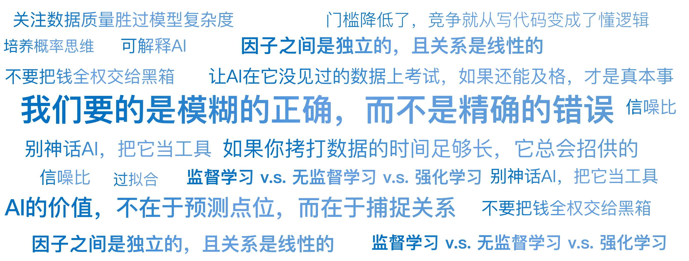

# 18｜AI不是算命先生：从逻辑推导到暴力美学

你好，我是陈旸。

请想象一下，你要教一个小孩分辨“什么是猫，什么是狗”。

- **方法 A（传统编程 / 传统量化）**：

你会给小孩写一套规则：

- 如果有尖耳朵，且胡须长，可能是猫。
- 如果体型很大，且会汪汪叫，是狗。
- 如果……

这就是我们在第二章学的：均线金叉买入，RSI 超卖卖出。这是一套人类预设的、线性的逻辑。

- **方法 B（AI 大模型 / 机器学习）**：

你不说话。你直接把 1 万张猫的照片和 1 万张狗的照片扔给小孩看。你看完之后问他：“这张是什么？”他一眼就能认出来。你问他：“为什么？”他说：“我不知道，我就是感觉它像猫。”这个感觉，就是 AI 的核心。

AI 不讲逻辑，AI 讲的是概率。AI 通过学习海量的数据，提取出人类语言无法描述的非线性特征。

在交易市场，传统量化是你告诉电脑怎么做（写死策略）；而 AI 量化是你把历史数据喂给电脑，让它自己找规律。

## **预测股价 vs 预测天气：信噪比的诅咒**

你可能会问：“既然 AI 能通过照片识别猫狗（准确率 99%），那它预测股价的准确率是不是也能达到 99%？”答案是：绝无可能。

如果在股市里有人告诉你他的 AI 模型准确率 90%，请直接报警，他是骗子。在顶级的量化对冲基金，AI 预测涨跌的准确率只要能达到 53%，就足以赚成世界首富（西蒙斯也就这个水平）。

为什么？因为信噪比。

- **图像识别**：一张猫的照片，像素点之间有很强的关联。猫的耳朵旁边大概率是猫的头。这是高信噪比数据。
- **股票市场**：股价的波动，90% 是噪音（随机漫步），只有 10% 是信号（规律）。

AI 在股市里，就像是在一个嘈杂的迪斯科舞厅里，试图听清楚角落里两个人说的悄悄话。它虽然听力很好（算力强），但噪音实在太大了。所以，AI 不是神。它不能在乱数中创造规律。它只能在人类肉耳听不见的频率上，捕捉到那微弱的一丝信号。

## **那个被忽略的非线性世界**

既然 AI 这么难，为什么我们还要用它？因为传统量化有一个致命的死穴：线性思维。

传统的多因子模型（如 Fama-French）假设：

这隐含了一个假设：**因子之间是独立的，且关系是线性的。**比如：PE（市盈率）越低越好。不管是在牛市还是熊市，反正 PE 越低分越高。但真实世界是这样的吗？当然不是。

- **场景 A**：经济复苏初期，低 PE 是好事（价值回归）。
- **场景 B**：流动性泛滥末期，高 PE 才是好事（泡沫炒作）。
- **场景 C**：如果这时美联储突然加息，且油价大涨，那么低 PE 的制造业股票可能会暴跌，而高 PE 的科技股可能会暴涨。

这种 “如果……且……但是……除非……”的复杂关系，就是非线性。人脑处理不了这么复杂的纠缠关系（超过 3 个变量我们就晕了）。但 AI（特别是大模型 / 神经网络）天生就是干这个的。它不需要你告诉它加息对科技股不好。

通过训练过去 30 年的数据，它自己会发现：“当利率因子变动 > 0.5 且 情绪因子 > 0.8 时，做空高 PE 股票的胜率由 48% 提升至 55%。”**AI 的价值，不在于预测点位，而在于捕捉关系。**它能看到因子之间那些隐秘的、动态的、人类无法理解的交互作用。

## **机器学习的三大流派：AI 怎么炒股？**

在《QMT 实战训练营》里，我们会用到具体的代码库。但在思维课，你需要理解它们背后的哲学。AI 在量化里主要有三种用法：

**1. 监督学习：你是老师**

- **原理**：你把过去 10 年的 K 线图（题目）和第二天的涨跌（答案）喂给 AI。让它自己去刷题。刷完 100 万道题后，给它今天的 K 线图，让它做这道新题。
- **常用模型**：随机森林（Random Forest）、XGBoost、LSTM。
- **应用**：预测明天的收益率、预测某个公告是不是利好。

**2. 无监督学习：你是观察者**

- **原理**：你不给答案，只给数据。让 AI 自己去分类。
- **常用模型**：K-Means 聚类、PCA（主成分分析）。
- **应用**：**股票画像**。

AI 可能会把贵州茅台和某只电力股分到一组。你很奇怪，它们行业不同啊？后来你发现，原来它们都是高分红、低波动的类债券资产。AI 帮你发现了人类行业分类之外的隐形关联。

**3. 强化学习：你是教练**

- **原理**：像训练 AlphaGo 下围棋一样。给 AI 一个账户，让它在模拟盘里随便交易。
- 赚了钱，给它一颗糖（正奖励）。
- 亏了钱，打它一板子（负惩罚）。
- 经过几亿次的训练，它自己练出了一套盘感。
- **应用**：高频交易、订单执行算法（如何买入 1 亿不被发现）。

## **最大的敌人：过拟合**

AI 这么厉害，为什么不是每个人都发财了？因为 AI 有一个致命的毛病：它太聪明了，聪明到会死记硬背。这叫过拟合。举个例子：你让 AI 寻找必涨公式。AI 翻遍了过去 10 年的数据，兴奋地告诉你：**“老板，我发现了！只要在这个股票代码最后一位是 8，且当天的温度是 25 度，且昨天是星期三的时候买入，胜率 100%！”**

在历史数据里，这可能真的是对的（纯属巧合）。但你敢拿真金白银去实盘吗？必死无疑。这就是量化交易中那句振聋发聩的警句：**“如果你拷打数据的时间足够长，它总会招供的。”**

**AI 量化思维的核心风控：**我们不追求模型在历史回测中表现有多完美。相反，**如果一个 AI 模型的回测曲线是一条笔直向上的直线，直接扔进垃圾桶。**因为它一定过拟合了。我们要的是模糊的正确，而不是精确的错误。我们会用交叉验证和样本外测试来防范过拟合。简单说，就是让 AI 在它没见过的数据上考试，如果还能及格，才是真本事。

## **黑箱的恐惧：可解释性**

用 AI 做交易，还有一个心理障碍：黑箱。传统量化（如双均线），亏了你知道是因为趋势反转了。AI 量化，亏了你不知道为什么。神经网络就像一个充满几百万个参数的大脑，你问它：“为什么要在这个位置满仓？”它无法回答你。它只是输出了一个数值：Buy_Signal = 0.98。

当你的钱在这样一个黑箱里剧烈波动时，你的心态很容易崩。这也是为什么**华尔街现在非常推崇可解释 AI**。我们可以使用 SHAP 值等工具，强行拆解 AI 的决策逻辑。它会告诉你：

- 这次买入，主要原因是动量因子贡献了 40%，情绪因子贡献了 30%。
- 虽然估值因子很难看，但由于动量太强，所以综合判定为买入。

**人机协作的新范式：**不要把钱全权交给黑箱。人负责制定战略（选什么因子、控制什么风险、什么时候关机）；AI 负责战术执行（挖掘非线性规律、寻找最优权重）。

## **AI 量化策略建议**

AI 不是算命先生，它预测不了哪只股票明天一定涨停。它只是一个拥有显微镜和望远镜的超级分析师。

**显微镜**：它能看到微观结构里，买一和卖一之间那 0.01 秒的套利机会。**望远镜**：它能看到宏观维度上，油价、汇率、天气、新闻之间那千丝万缕的蝴蝶效应。

对于想要在这个时代生存的你，我有三条建议：

**1. 别神话 AI，把它当工具**

Cursor、Trae、DeepSeek……这些工具大大降低了写代码的门槛。以前你要花一个月写一个 LSTM 模型，现在只要你会写 Prompt，5 分钟就能搞定。**门槛降低了，竞争就从写代码变成了懂逻辑。**你必须比 AI 更懂金融逻辑，才能指挥它，它会给你一堆看似正确的 Bug。

**2. 关注数据质量胜过模型复杂度**

Garbage In, Garbage Out（垃圾进，垃圾出）。与其花时间去研究最新的 AI 大模型架构，不如花时间去清洗你的数据，去寻找别人没有的另类数据。一个简单的逻辑回归模型跑在优质数据上，吊打一个跑在垃圾数据上的超级神经网络。

**3. 培养概率思维**

AI 输出的永远是一个概率分布。它说上涨概率 60%，不代表它会涨。它代表如果你做 100 次这样的交易，你会赢 60 次。**这就是我们在第一章讲的索普的思维。AI 是索普的终极武器。**

## 本讲金句弹幕

## **课后思考题**

你在使用 Cursor, DeepSeek 等 AI 工具时，有没有遇到过它一本正经的胡说八道？如果在交易代码里，AI 产生了幻觉，比如虚构了一个不存在的函数，或者算错了收益率，你觉得会发生什么？

**这告诉我们，在 AI 量化的世界里，为什么代码审查和逻辑验证比以前任何时候都更重要。**

## **下节预告**

既然 AI 是靠吃数据长大的，那它到底吃什么？只吃 K 线（开高低收）显然营养不良。现在的 AI，胃口大得很。它读研报、看新闻、刷推特，甚至看卫星云图。下一讲，我们将进入 AI 大模型的奇妙世界。

---
来源：极客时间
链接：https://time.geekbang.org/column/article/952983
日期：2026-05-18
