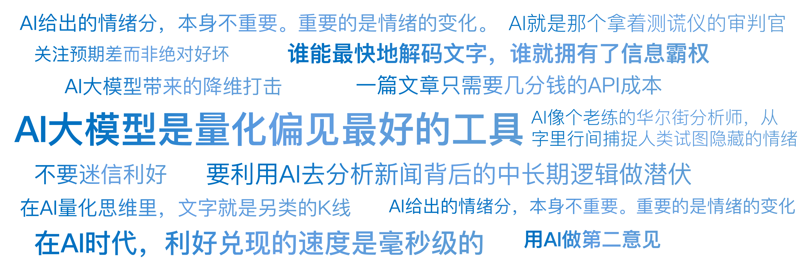

# 19｜当DeepSeek读懂了研报：从关键词统计到语义觉醒

你好，我是陈旸。

请想象这样一个场景：A 股财报季，就在今晚 8 点，市场上有 1000 家上市公司同时发布了年报。每一份年报平均 100 页，总共 10 万页。作为一个交易员，你会怎么办？ 你只能挑你关注的那两三家看，其他的只能放弃。你根本看不过来。

但此时，顶级对冲基金（比如 Two Sigma）的服务器正在疯狂运转。在财报发布的 0.1 秒内，AI 算法已经通读了这 5 万页文档，提取了关键数据，对比了历史措辞的变化，计算出了管理层情绪分，并自动下达了买卖指令。

等你第二天早上醒来，看到新闻说某公司业绩超预期准备买入时，你会发现股价早已高开 5%，因为昨晚 AI 已经把最肥的那块肉吃掉了。这就是 AI 大模型带来的降维打击。**在 AI 量化思维里，文字就是另类的 K 线。谁能最快地解码文字，谁就拥有了信息霸权。**

## **史前时代：只会数数的笨小孩**

AI 读研报的能力，不是一夜之间长出来的。它经历了一个从人工智障到人工智能的进化过程。最早期的 NLP（大概 2010 年前），用的方法叫词袋模型（Bag of Words）。这就像教一个刚学说话的小孩。他不懂语法，不懂逻辑，他只会数数。

**策略逻辑：**

建立一个情感词典：正向词：增长、突破、盈利、超预期……负向词：亏损、下降、风险、诉讼……数一数研报里，正向词出现了多少次，负向词出现了多少次。得分 = 正向词数量 - 负向词数量。

**致命缺陷：**这种方法经常闹笑话。比如研报里写了一句：“公司盈利能力下降，且面临巨大风险。”

- 词袋模型看到了盈利，加 1 分。
- 看到了下降，减 1 分。
- 看到了风险，减 1 分。
- 综合判定：负面。嗯，这次蒙对了。

但如果研报写的是：“虽然面临挑战，但公司不可能亏损。”

- 词袋模型看到了亏损，立刻判定为负面。
- **它看不懂“不”字（否定词）带来的逻辑反转。**

在那个时代，基于 NLP 的量化策略非常粗糙，甚至不如抛硬币。

## **大模型时代：AI 学会了“读空气”**

转折点发生在 2017 年，Google 推出了 Transformer 架构，随之诞生了 BERT 模型。这一刻，AI 终于学会了联系上下文（Context）。它不再是一个字一个字地看，而是把整句话放在一起看。它引入了注意力机制。它知道亏损前面的那个“不”字，权重极大，会彻底改变这句话的意思。到了 2022 年，ChatGPT 横空出世，事情发生了质变。AI 不仅懂了语法，还懂了语气和潜台词。

**案例：美联储的鹰与鸽**

以前的 AI 分析美联储会议纪要，只能统计“加息”这个词出现的频率。现在的 AI 能读出鲍威尔的犹豫。鲍威尔说：“我们需要继续观察数据，目前的通胀水平令人不安，但我们看到了一些缓解的迹象。”

- GPT 分析：
- 令人不安 = 强烈的鹰派信号（想加息）。
- 一些缓解 = 微弱的鸽派信号。
- 综合结论：表面鹰派，实则留有余地。建议策略：短期做空，但设紧止损。

这就是读空气。AI 开始像一个老练的华尔街分析师一样，从字里行间捕捉那些人类试图隐藏的情绪。

## **实战应用 1：RAG——让 AI 替你读研报**

在 AI 大模型时代，RAG（Retrieval-Augmented Generation，检索增强生成）技术非常火热。在《QMT 实战训练营》中，它就是你的超级阅读助手。现在的研报动不动几十页，大部分是废话（免责声明、公司介绍）。真正的干货（比如核心技术突破、新订单数据）藏在第 18 页的第三段。

**AI 量化实战流程：**

**投喂**：把今天更新的 1000 份研报 PDF 全部扔给 AI。**提问（Prompt）**：“请帮我找出所有涉及人形机器人产业链的公司，并提取出它们关于减速器产能的具体描述。如果是模糊的画饼，请标注可信度低；如果有具体数据，请标注可信度高。置信度按照 0-100 进行打分。”**输出**：3 秒钟后，你会得到一张 Excel 表格。公司 A：产能 2 万台（可信度高）。公司 B：力争实现突破（可信度低）。

这在以前，需要一个实习生团队干一周。现在，一篇文章只需要几分钱的 API 成本。这让你能够覆盖全市场，不错过任何一个细分赛道的机会。

## **实战应用 2：电话会的情绪解码**

除了文字，AI 现在还能听音。在美股，很多量化基金专门分析业绩电话会的录音。分析的维度令人细思极恐：

**文本分析**：CEO 在回答分析师提问时，使用了多少个模糊词（如 maybe，hopefully，roughly），模糊词越多，说明管理层越没底气，股价大概率下跌。**语音分析**：CEO 的声音颤抖频率是否异常？语速是否比平时快？停顿时间是否变长？如果 CEO 平时说话很流利，这次回答关键问题时停顿了 3 秒，AI 会立刻标记为 “撒谎 / 隐瞒风险”信号，并瞬间做空。

这就是另类数据的威力。管理层可以美化财报上的数字，但很难在几百个分析师的拷问下，控制自己微小的生理反应。AI 就是那个拿着测谎仪的审判官。

## **实战应用 3：舆情因子与反身性**

在第四讲索罗斯那一课，我们提到了偏见。AI 大模型是量化偏见最好的工具。**A 股的小作文策略**：A 股是一个散户主导的市场，极易受小作文（传闻）影响。往往是一个截图在微信群流传，某个板块就突然暴涨。

**AI 监控系统：**

**全网监控**：实时爬取雪球、股吧、财联社电报，甚至微信公众号。**热词聚类**：AI 发现，“超导”“室温”这两个词在过去 10 分钟内出现频率激增（爆发系数 > 500%）。**情感判断**：判定为极度利好。**关联映射**：AI 迅速在知识图谱中检索超导概念股，锁定那几只龙头。**自动打板**：在人类还在去百度什么是室温超导的时候，AI 已经挂单排队了。

这叫事件驱动（Event-Driven）策略。在这个策略里，速度就是一切。AI 不是在分析这个技术是不是真的（这不重要），AI 分析的是大家是否都在讨论它（情绪热度）。

## **陷阱：当所有人都用 AI 时**

AI 大模型看起来很美，但它也有量化的通病：内卷。

**同质化**：如果所有人都用 DeepSeek 来分析情绪，那么大家得到的结论是一样的。当一份利好研报出来，所有 AI 同时下达买入指令，会导致股价瞬间一步到位（瞬间涨停）。对于后知后觉的散户，这意味着你连喝汤的机会都没有了，一旦你买入，就是接盘。**对抗攻击**：现在很多上市公司也学聪明了。他们知道会有 AI 来读研报。于是，他们开始针对 AI 写研报。故意多用正向词汇（哪怕业绩不好）。故意把风险提示写得晦涩难懂，用复杂的从句绕晕 AI。这就是道高一尺，魔高一丈的博弈。

## **AI 量化策略建议**

作为普通投资者，你可能没有高频交易的设备，但你可以利用 DeepSeek 来武装你的大脑。

**1. 用 AI 做第二意见**

当你看到一篇吹得天花乱坠的研报，热血沸腾准备买入时。请把研报复制给 DeepSeek（Qwen/Kimi 等），输入 Prompt：“请作为一名苛刻、怀疑论的做空机构分析师，找出这篇研报中逻辑不通、避重就轻、或缺乏数据支持的风险点。列出 3 条最致命的。”你会发现，AI 泼冷水的能力是一流的。这能帮你省下很多冲动交易的钱。

**2. 关注预期差而非绝对好坏**

AI 给出的情绪分，本身不重要。重要的是情绪的变化。

- 如果一家公司一直很烂（情绪分 20），突然发了一份研报，情绪分变成了 40（还是很烂，但变好了）。这往往是最佳买点（困境反转）。
- 如果一家公司一直很好（情绪分 95），新研报情绪分 80。这可能是卖点（不及预期）。用 AI 量化边际变化，而不是存量状态。

**3. 不要迷信利好**

在 AI 时代，利好兑现的速度是毫秒级的。当你肉眼看到利好新闻时，价格通常已经反映完了。所以，不要追着新闻买股票。要利用 AI 去分析新闻背后的中长期逻辑（产业链逻辑），做潜伏，而不是做追涨。

## 本讲金句弹幕

## **课后思考题**

找一篇你最近关注的上市公司的公告或新闻。先自己读一遍，判断是利好还是利空，打个分（0-100）。然后扔给 AI，让它打个分，并给出理由。对比一下，AI 看到的哪个逻辑点，是你完全忽略的？

## **下节预告**

AI 不仅能读研报，它还能像人一样思考和行动。想象一下，如果你有一个 AI 员工，它不仅能分析行情，还能自己打开交易软件，自己下单，自己风控，甚至自己写复盘日记。这就是垂直领域的 AI Agent。下一讲，我们将揭秘全能的 AI 员工。我们将组建一支不仅不要工资，而且 7*24 小时辛勤工作的 AI 投研团队。

---
来源：极客时间
链接：https://time.geekbang.org/column/article/953112
日期：2026-05-18
