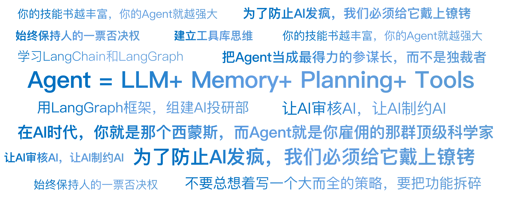

# 20｜Agent：24小时不睡觉的超级员工

你好，我是陈旸。

在过去的 3 年里，生成式 AI 经历了 3 个阶段：

**Chatbot（聊天机器人）阶段**：你问它“什么是均线”，它回答你。这是知识检索。**Copilot（副驾驶）阶段**：你写代码卡住了，它帮你补全。这是辅助工具。**Agent（智能体）阶段：**它的目标是全自动驾驶，基于你的需求，自主进行规划，利用各种工具和知识库经验，分成多个步骤一步一步来完成。

**简单来说**：**Agent = LLM（大模型大脑）+ Memory（记忆）+ Planning（规划）+ Tools（工具使用）**。

通俗点说：DeepSeek 就像一个被关在小黑屋里的博士，他知道所有的知识，但他没有任何工具，连网都上不了（早期版本）。Agent 就是把这个博士放出来，给他一台联网的电脑，给他 QMT 的交易权限，给他无限的硬盘空间。你只跟他说一句话：“帮我编写双均线策略，并针对贵州茅台进行 2024-2025 年的策略回测。” 他就会自己去拆解任务、自己查资料、自己写策略、自己下单。这就是具身智能在数字世界的形态。

## **核心进化：ReAct 模式（思考与行动）**

为什么 Agent 能自己干活？ 因为它学会了一种人类独有的思维方式——ReAct（Reasoning + Acting，推理 + 行动）。在传统量化脚本（Python）里，代码是一行行死板执行的：如果是价格突破 20 日均线 => 买入 => 结束。而在 Agent 的世界里，它有一个内心独白的循环。

### **场景示例：深夜突发利空**

凌晨 3 点，大洋彼岸传来消息，美联储意外加息。

- **Agent 的内心独白（Loop 1）：**
- **感知（Observation）**：监控到财联社推送美联储加息 50 个基点。
- **思考（Thought）**：这比预期的 25 个基点要高，是重大利空。我的持仓里有高估值的科技股，风险很大。
- **行动（Action）**：调用 check_portfolio() 函数，查看当前持仓。
- **Agent 的内心独白（Loop 2）：**
- **感知**：持仓显示持有英伟达 1000 股。
- **思考**：科技股对利率敏感，必须对冲风险。但我现在不能卖（美股收盘了 /A 股还没开盘）。我需要去期货市场做空对冲。
- **行动**：调用 trade_futures() 函数，做空对应名义价值的纳指期货。
- **Agent 的内心独白（Loop 3）：**
- **感知**：下单成功。
- **思考**：风险已对冲。记录日志，并发微信通知主人。
- **行动**：发送微信消息。

你看，这不再是一个死的脚本，这是一个会根据环境变化，动态调整策略的活人。它不需要你预设每一种情况（if-else），它利用大模型的常识（加息 = 利空科技）来进行逻辑推理，并自主调用工具解决问题。

## **给 AI 装上手：Function Calling（工具调用）**

Agent 之所以能干活，核心在于 Function Calling（工具调用）技术。这是连接自然语言和量化代码的桥梁。以前，你想让程序下单，你得写 `order_target_value('600519.SH', 10000)`。现在，你只需要把这个函数注册给 Agent。然后你对 Agent 说：“帮我买一万块钱茅台。”Agent 的大脑（LLM）会解析这句话：

**意图识别**：用户想买股票。**参数提取**：股票代码：茅台 -> 600519.SH（它自己会去查代码表）。金额：10000。**JSON 输出**：它不会直接下单，而是输出一个标准的 JSON 格式给交易系统。

```
{ "function": "order_target_value","args": { "symbol": "600519.SH","amount": 10000 } }
```

QMT 交易系统接收到这个 JSON，执行下单。

**量化视角的颠覆**：这意味着，你不需要再手写那些繁琐的 API 了。你可以定义几十个工具：查研报、算 RSI、画 K 线、下单、撤单…… 然后让 Agent 自己去组合使用这些工具。它就像一个拿着瑞士军刀的特种兵，遇到什么困难，就拔出哪把刀。

## **从单兵作战到军团作战：Multi-Agent（多智能体）**

一个 Agent 能力再强，也容易产生幻觉，或者顾此失彼。量化交易是一个复杂的系统工程，需要分工协作。在 AI 量化思维中，可以采用先进的多智能体架构（Multi-Agent System）。我们可以用 **LangGraph** 这样的框架，组建一个 AI 投研部。

让我们来看看你的 AI 员工们：

**角色 A：信息搜集员（Charles）****任务**：24 小时爬取新闻、公告、推特。**人设**：八卦、敏感、速度快。**输出**：每天早上 8 点，扔出一份今日重点情报摘要。**角色 B：数据分析师（Zoe）****任务**：收到 Charles 的情报后，去拉取相关的 K 线、财报数据，跑一遍多因子模型。**人设**：严谨、数学好、甚至有点死板。**输出**：“基于情报，该股票技术面 RSI 金叉，估值处于低位，胜率预测 65%。”**角色 C：风控官（Kriss）****任务**：审核 Zoe 的建议。**人设**：悲观、胆小，甚至有点讨厌。他只盯着回撤和仓位。**输出**：“虽然胜率 65%，但当前总仓位已达 80%，且该板块波动率过大。否决买入建议，或建议只买 1% 仓位。”**角色 D：交易员（Ethan）****任务**：执行 Kris 批准的指令。**人设**：冷酷、算法专家。**输出**：使用 TWAP 算法拆单，悄悄完成建仓。

这就是左右互搏。让 AI 审核 AI，让 AI 制约 AI。通过这种角色扮演和 SOP（标准作业程序），我们可以大大降低 AI 产生幻觉的风险，提高系统的稳健性。

## **最大的风险：AI 的肥手指与死循环**

Agent 听起来很梦幻，但在实盘中，它也可能变成噩梦。

**风险 1：死循环**

Agent 有时候会陷入一种执念。比如它想买入某只股票，但是挂单没成交（价格变了）。它的 ReAct 循环可能会这样：“没成交 -> 撤单 -> 提价 1 分钱再买 -> 还没成交 -> 撤单 -> 再提价……” 如果在高频交易中，这个循环没写好退出机制，它可能在 1 分钟内把你一年的手续费都刷光，甚至把股价拉涨停（类似光大乌龙指）。

**风险 2：幻觉执行（概率性灾难）**

这是 AI 特有的风险。万一大脑（LLM）抽风了呢？ LLM 本质上是概率模型，不是逻辑机器。

- 它可能把“卖出 100 股”幻视成了“卖出 100 万股”。
- 它可能把“600519（茅台）”识别成了“600518（康美，已退市）”。
- 它甚至可能编造一个不存在的股票代码，导致程序报错崩溃。

## **解决方案：构建双重安全锁**

为了防止 AI 发疯，我们必须给它戴上镣铐。

**第一道锁：确定性校验层**

这是最重要的一层防护。请记住：LLM 输出的是 JSON 指令，中间必须隔着一层硬代码（Hard Code）逻辑检查。这层检查代码不能是 AI 写的，必须是你写死的规则，且没有任何商量余地。

- **金额熔断**：if order_amount > 50000: REJECT （单笔超过 5 万，直接驳回，不管 AI 觉得机会多好）。
- **价格偏离**：if order_price > current_price * 1.02: REJECT （买入价偏离现价 2%，直接驳回，防止滑点）。
- **白名单检查**：if symbol not in stock_pool: REJECT （不在股票池里的，不许买）。

这层硬代码就像物理世界的保险丝。无论 Agent 多么聪明或多么疯狂，只要触碰了红线，电流直接切断。我们后面会详细讲解这层代码该怎么写。

**第二道锁：HITL（Human-in-the-Loop，人类在环）**

通过了第一道硬代码检查后，对于大资金操作，还不能直接发给交易所。

- Agent 生成一个通过了初步校验的订单列表。
- 它会发一条消息到你的手机：“老板，我建议买入这 3 只股票，理由如下……硬代码风控已通过，请批准 / 拒绝。”
- 你按一下批准，它才真正发送指令给 QMT。

这就是半人马模式。AI 负责 99% 的计算和生成，硬代码负责过滤掉荒谬的错误，人类负责这最后 1% 的责任承担。

## **未来展望：从量化策略到管理策略**

Agent 技术的出现，正在从根本上改变量化交易的定义。以前，量化交易员的工作是写策略（编写数学公式）。未来，量化交易员的工作是管理员工（设计 Agent 的提示词 Prompt 和工作流）。

你不需要去研究怎么算 MACD（Agent 自带工具包），你需要研究的是：

- 怎么设计一个更聪明的风控 Agent，让它能拦住激进的交易 Agent？
- 怎么设计情报 Agent 的 Prompt，让它不会错过重要的宏观线索？

你的核心竞争力，从代码能力转移到了系统架构能力和对金融本质的理解。这就好比西蒙斯（大奖章基金创始人）不再自己算题，而是专注于雇佣最聪明的科学家，并给他们创造最好的环境。**在 AI 时代，你就是那个西蒙斯，而 Agent 就是你雇佣的那群顶级科学家。**

## **AI 量化策略建议**

Agent 时代已经到来，虽然还在早期，但进化速度极快。我有三条建议，助你拿到这张通往未来的船票：

**1. 学习 LangChain 和 LangGraph**

这是开发 Agent 的主流框架。我会在《AI 量化交易训练营》将教你使用 LangGraph 打造你的多智能体员工，它能帮你把 Prompt、记忆、工具串联起来，像搭积木一样。

**2. 建立工具库思维**

不要总想着写一个大而全的策略，要把功能拆碎。写一个计算 RSI 的小函数，写一个查询新闻的小函数。这些小函数就是你喂给 Agent 的技能书。你的技能书越丰富，你的 Agent 就越强大。

**3. 始终保持人的一票否决权**

不管 AI 看起来多聪明，钱是你的。在很长一段时间内，不要把账户密码完全交给它。把 Agent 当成最得力的参谋长，而不是独裁者。

## 本讲金句弹幕



## **课后思考题**

如果让你设计一个简单的双 Agent 系统：

- Agent A 负责看多（永远寻找买入理由）。
- Agent B 负责看空（永远寻找卖出理由）。它们两个针对同一只股票进行辩论。你会给它们设计什么样的 Prompt（人设）？ 你作为裁判（Human），会根据什么标准来判定谁赢了？

## **下节预告**

有了 AI 员工（Agent），我们需要喂给他什么数据？不光是 K 线，在下一讲我们将进入另类数据的世界，看看还有哪些另类数据，可以让你领先市场，赚取额外的收益。

---
来源：极客时间
链接：https://time.geekbang.org/column/article/953127
日期：2026-05-18
