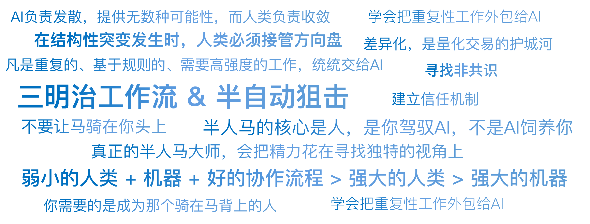

# 22｜为什么未来的交易员是半人马？

你好，我是陈旸。

在希腊神话中，半人马是一种上半身是人、下半身是马的生物。它拥有人类的智慧（大脑、战术、判断力）和马的体能（速度、耐力、力量）。这个隐喻，最早由国际象棋大师卡斯帕罗夫提出。1997 年，卡斯帕罗夫输给了 IBM 的深蓝电脑，人类第一次在智力巅峰被机器击败。那是一场悲剧性的失败。

但几年后，卡斯帕罗夫搞了一个有趣的比赛，叫自由式国际象棋。规则是：你可以是一个人，也可以是一台电脑，也可以是人 + 电脑。最终的冠军是谁？不是最强的人类大师，也不是最强的超级计算机（Hydra）。而是一对业余选手（人类），使用着几台普通的电脑。

卡斯帕罗夫总结了一个著名的公式 **：弱小的人类 + 机器 + 好的协作流程 > 强大的人类 > 强大的机器。** 这就是半人马理论。在交易市场，这个公式同样适用。未来的交易员，不需要你是数学博士，也不需要你有光速的手速。你需要的是成为那个骑在马背上的人。

## **马的职责：AI 负责战术与执行**

为了理解这种分工，我们要先承认人类的生理局限性。在某些领域，人类是彻底的弱者。这些领域，必须交给马（AI）去跑。

**1. 算力的碾压：广度**

- **人类**：你一天能看几只股票？哪怕你废寝忘食，看完 A 股 5000 只股票的 K 线也需要一周。
- **AI**：QMT 遍历全市场 5000 只股票的 100 个因子，只需要 3 秒。
- **分工**：筛选、扫描、监控，这是 AI 的绝对领地。人眼看盘是效率最低的行为。

**2. 情绪的剥离：纪律**

- **人类**：当股价跌破止损线时，你会心跳加速，你会抱有幻想：“再等一等，也许会反弹。”这是生物本能（厌恶损失）。
- **AI**：它没有杏仁核，没有恐惧。代码写了 `if price <   stop_loss then sell`，它就会在毫秒级执行。
- **分工**：风控、止损、仓位管理，必须交给冷血的 AI。

**3. 模式的记忆：深度**

- **人类**：你记得 2015 年股灾的走势，但你记得 2008 年、2000 年、1990 年的每一次细节吗？你的记忆会模糊，会重构。
- **AI**：它记得历史上每一根 K 线。它能在几秒钟内，把现在的走势和过去 50 年的历史做相似度匹配。
- **分工**：历史回测、概率计算，这是 AI 的强项。

**总结：凡是重复的、基于规则的、需要高强度的工作，统统交给 AI。这是半人马的腿。**

## **人的职责：人类负责战略与定义**

既然 AI 这么强，为什么不干脆全自动？因为 AI 有两个致命的弱点：缺乏常识和无法处理没见过的数据。这就需要人类的大脑来掌舵。

**1. 定义目标**

AI 是一个优化器。你给它一个目标函数，它就去求极值。如果你设定的目标是收益率最大化，AI 可能会满仓加杠杆梭哈妖股（因为这在数学上收益最高），最后导致爆仓。人类的职责是定义什么是好。我要赚钱，但我更要稳。我要夏普比率大于 2，最大回撤小于 10%。也就是不仅要告诉 AI 往哪跑，还要给它戴上缰绳。

**2. 处理黑天鹅**

AI 是基于历史数据训练的。它默认未来是过去的重复。但是，当新冠疫情第一次爆发时，历史上没有类似的数据。

- **AI 的反应**：模型失效，甚至发出错误的买入信号（比如抄底航空股，因为历史上跌多了就会涨）。
- **人类的反应**：你知道这是一种全新的病毒，全球航运会停摆。你会手动关掉电闸，强行清仓。
- **分工**：在结构性突变发生时，人类必须接管方向盘。

**3. 寻找新因子**

AI 擅长在旧数据里暴力挖掘规律（Alpha），但它容易把噪音当信号，陷入“伪相关”的陷阱。真正具备商业逻辑的新维度，往往源于人类的直觉与洞察：

- 是人类发现了卫星可以看油罐。
- 是人类发现了贴吧舆情可以预测股价。

但这不代表我们要抛弃 AI。现在的 AI 可以作为极佳的发散工具，帮我们打破认知茧房，涌现出海量线索。它的短板在于缺乏对现实世界的深刻理解，提出的思路往往天马行空却难以落地。

在这个环节，人的角色不可替代。AI 负责发散，提供无数种可能性；而人类负责收敛——基于商业逻辑进行识别和判断，筛选出那个最可行的猜想并加以验证。

## **协作的艺术：如何构建人机接口？**

既然要做半人马，那么人和马怎么连接？这里的关键不是代码，而是**流程（Workflow）**。

**模式一：三明治工作流**

这是目前最成熟的量化实战模式。

- **上层面包（人）**：
- 提出假设：我觉得最近小盘股要火，因为流动性在宽松。
- 设定参数：选择因子、设定风控阈值。
- **中间的肉（AI）**：
- 回测：跑过去 10 年的数据，验证这个假设是否成立。
- 执行：每天自动选股、下单、盯盘。
- **下层面包（人）**：
- 复盘：收盘后看 AI 的交易记录。
- 干预：如果发现 AI 买了一只即将退市的股票（数据源没更新），手动剔除。

**模式二：半自动狙击**

适合主观交易者的进化。

- **场景**：你在看盘，发现某只股票形态很好（缠论三买）。
- **人的动作**：你不需要计算仓位，也不需要手填价格。你只需要按一个键：买入。
- **AI 的动作**：
- 计算凯利公式，决定买多少。
- 拆单算法（TWAP），在接下来 10 分钟内慢慢买，不惊动主力。
- 自动挂好止损单。

在这个模式里，人是扣动扳机的狙击手，AI 是那把高精度的狙击枪（自动计算风偏、弹道）。

## **进化之路：从操盘手到系统架构师**

理解了半人马，你就明白了为什么我说未来的交易员会变成系统架构师。以前，你的简历上写的是：

- 擅长波浪理论，盘感好。
- 拥有 5 年实盘经验。

未来，你的能力模型应该是：

**翻译能力**：把模糊的市场逻辑，翻译成 AI 能听懂的工作逻辑（Prompt Engineering / Python）。**鉴别能力**：能看懂 AI 的回测报告，能一眼看出哪里过拟合了，哪里有幸存者偏差。**风控能力**：知道机器什么时候会发疯，并敢于在关键时刻拔网线。

你不再是那个在战壕里拼刺刀的士兵，你是坐在指挥室里，看着屏幕、指挥无人机群作战的指挥官。

## **警惕：不要让马骑在你头上**

做半人马，最危险的情况是什么？是人变懒了，变成了马的奴隶。这种现象叫自动化偏见。当你的 AI 连续赚钱 6 个月后，你会产生一种错觉：它全知全能。你开始不再复盘，不再检查代码，甚至连它买了什么都不知道。你只是每天看一眼账户余额。

这就是算法黑箱的反噬。一旦市场风格切换（比如从动量转为反转），或者发生黑天鹅，你的 AI 可能会在一天之内把半年的利润亏光，而你甚至不知道怎么停下它。

**切记：半人马的核心是人**。是你驾驭 AI，不是 AI 饲养你。你需要保持对市场的敏感度，AI 只是你验证想法的工具，而不是你的思想本身。

## **AI 量化策略建议**

作为本章的总结，我对想要进化为半人马的你，提出三个阶梯式的建议：

**阶梯一：学会外包**

别再用 Excel 手动算收益率了，别再用肉眼去数 K 线了。把所有重复性的工作，都外包给 DeepSeek、Cursor 或者 QMT。腾出你的大脑，去思考策略，而不是处理数据。

**阶梯二：建立信任机制**

不要一开始就让 AI 全自动。先让它模拟盘跑一个月。然后小资金实盘。你要像观察一个新员工一样观察它：它在极端行情下会怎么做？它的滑点大不大？信任是建立在回测和实盘表现的基础上的，不是建立在对技术的盲目崇拜上的。

**阶梯三：寻找非共识**

当所有的半人马都用同一套数据（K 线）、同一个模型（Qwen）、同一个策略时，就没有超额收益了。真正的半人马大师，会把精力花在寻找独特的视角上。

- 别人看 K 线，你看另类数据。
- 别人用通用大模型，你微调一个垂直领域的模型。差异化，是量化交易的护城河。

## 本讲金句弹幕

## **课后思考题**

请想象一下，1 年后的某一天。你坐在海边的沙滩上，手里拿着一杯咖啡。你的手机震动了一下，是一个叫 Wucai 的 AI 给你发的消息：“老板，检测到中东局势紧张，油价波动率突破阈值。我已经自动将原油期货的网格策略停止，并反手开了一张看涨期权作为对冲。目前账户回撤控制在 0.5% 以内。是否需要我进一步激进加仓？”

你会怎么回复它？是回复好的，还是回复“等等，让我先看看新闻”？你的这个决定，就是半人马哲学的终极体现。

## **本章结语**

至此，我们完成了 AI 觉醒这一章的学习。我们拥有了最先进的武器。但是，拿着冲锋枪的小孩，可能比空手的成年人更危险——对自己更危险。

武器越强，走火的代价越大。在金融市场，最大的敌人永远不是别人，而是风险。如何确保这把 AI 之剑，不会砍向自己？如何在这个充满不确定性的世界里，构建反脆弱的系统？下一讲，我们将开启第四章：风控与反脆弱（盾）。我们将从诺贝尔奖得主破产的故事讲起，直面量化交易中最黑暗、最血腥的一面。

---
来源：极客时间
链接：https://time.geekbang.org/column/article/953244
日期：2026-05-18
