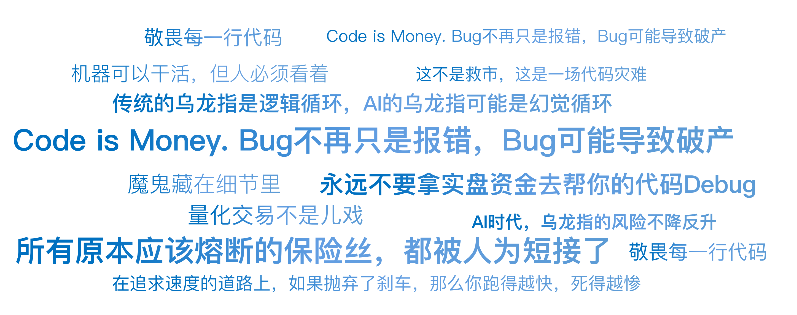

# 24｜程序员的手抖：光大乌龙指

你好，我是陈旸。

我们把时间拨回到 2013 年 8 月 16 日，星期五。那天上午，A 股像往常一样昏昏欲睡，上证指数在 2070 点附近无力地波动。11 点 05 分，诡异的事情发生了。毫无征兆地，中国石油、中国石化、工商银行、农业银行……这些平时一天波动不到 1% 的巨无霸，突然像被注入了兴奋剂一样，瞬间直线拉升。11 点 06 分，几十只权重股集体涨停。

**上证指数在短短两分钟内，暴涨 5.6%（超过 100 个点）。那一刻，全中国的股民都疯了。**

- 散户在喊：“国家队进场救市了！大牛市来了！”
- 分析师在找理由：“是不是出重磅利好了？降准了？印花税降了？”
- 期货交易员在疯狂平空单，多头在狂欢。

然而，在上海陆家嘴光大证券总部的策略投资部交易室里，没有狂欢，只有死一样的寂静。交易员们盯着屏幕，脸色惨白。他们看着自己编写的程序，像一头失控的怪兽，疯狂地向交易所发送着买入指令：“买入中石化！买入中石油！买入工行！再买！继续买！”他们想停下来，但找不到那个红色的停止按钮。

**短短几分钟，系统发出了 234 亿元的买单，实际成交 72.7 亿元。这不是救市，这是一场代码灾难。**

## **策略本无罪：ETF 套利的原理**

要理解这个 Bug，我们先得知道光大当时在做什么策略。他们做的是 ETF 申赎套利。这是一个非常经典、低风险的量化策略。

**逻辑如下：**

**ETF（交易型开放式指数基金）** 有两个价格：**二级市场价格**：你在股票软件上看到的实时价格。**IOPV（净值）**：ETF 包含的一篮子股票的实时价值总和。**套利机会**：当二级市场价格 > IOPV 时（溢价），说明 ETF 贵了。**操作步骤**：买入一篮子股票（Buy Basket）。用这些股票向基金公司申购 ETF 份额。在二级市场卖出 ETF 份额。赚取差价。

这本来是一个完美的闭环：风险低、拼速度、拼自动化。光大证券为此专门开发了一套名为 MEP 的策略交易系统。但是，魔鬼藏在细节里。

## **致命的 Bug：死循环的逻辑陷阱**

根据证监会的事后调查报告，那个毁灭一切的 Bug，藏在订单生成模块里。简单的说，光大的策略系统有一个功能：重下（Retry）。理解了这个逻辑，你就知道量化系统有多脆弱了。

**正常逻辑应该是：**

计算出需要买入一篮子股票（比如总价 1000 万）。发送订单。检查订单状态：如果全部成交 => 进入下一步（申购 ETF）。如果部分成交 => 补单（只买没成交的部分）。

**光大的 Bug 逻辑：**那天上午，系统在执行买入时，因为某些原因（可能是交易所回报延迟，或者某个股票停牌），导致有部分股票没有显示成交。这时候，程序员写的一个逻辑判断错误被触发了：系统错误地认为：“哎呀，这笔单子完全没成交啊！那我必须重新把整个篮子再买一遍！”

- 第一次重试：又发了 1000 万买单。
- 第二次重试：系统检测，好像还是没成交（其实是因为前一笔单子还在路上），再发 1000 万！
- 第三次重试……

这个检测 - 重发的间隔极短，且没有任何限制。于是，在那个致命的 2 秒钟内，计算机像发疯一样，生成了 26082 笔委托。这就像你在网上买火车票，点击支付没反应，于是你狂点鼠标 100 下。结果系统不是提示你请勿重复提交，而是真的从你的银行卡里扣了 100 次钱，给你买了 100 张票。

## **消失的保险丝：风控的全面缺位**

你会问：“难道光大证券没有风控吗？账户里没那么多钱，系统怎么能下单呢？”这就是光大乌龙指最令人震惊的地方：所有原本应该熔断的保险丝，都被人为短接了。

**1. 资金前端控制缺失**

在大多数交易系统中，下单前必须检查：可用资金 > 订单金额。如果不够，直接报错。但是，为了追求极速（高频交易），光大证券申请了交易所的交易单元直连模式。这种模式下，系统默认你是土豪，不再校验资金余额。光大当时账户里只有几个亿，但系统打出了 234 亿的单子。交易所照单全收。

**2. 订单量限制缺失**

任何成熟的量化系统，都会有一个胖手指限制。比如：单笔订单不能超过 100 万，单日累计买入不能超过 1 亿。光大的系统里，这个参数是空的，或者被设置为无限大。

**3. 缺乏 Kill Switch（一键自杀开关）**

当交易员发现系统失控时，他们竟然找不到一个物理按钮来切断程序。最后是怎么停下来的？是拔网线？还是杀进程？在慌乱中，每一秒钟流出去的都是上亿的真金白银。这告诉我们一个血淋淋的道理：**在追求速度的道路上，如果抛弃了刹车，那么你跑得越快，死得越惨。**

## **从技术事故到法律灾难**

故事还没结束。如果只是亏了钱，那叫操作风险。但光大接下来的操作，把它变成了法律风险（内幕交易）。11 点 07 分，系统终于停下来了。光大高层看着满手的股票（这 72 亿的股票是多出来的，如果不处理，收盘后要交割，光大就要破产），做出了一个决定：对冲。

当天下午开盘，光大证券在没有向公众披露这是乌龙指的情况下：

在期货市场疯狂**卖空**IF 股指期货（总计 43 亿元）。在 ETF 市场卖出 ETF。

他们试图把上午买错的货，通过做空期货对冲掉，减少损失。这在交易员眼里，是自救。但在监管和散户眼里，这是内幕交易。逻辑是这样的：你知道上午的暴涨是假的（是你自己搞出来的），你知道下午大概率会跌回来。但你没告诉大家，反而利用这个信息优势反手做空赚钱。

**结局：**

- 光大证券被没收违法所得，并处以 5 倍罚款，总计罚没 **5.2 亿元**。
- 相关高管被终身市场禁入。

## **AI 时代的新乌龙指**

你可能觉得，这是 2013 年的旧事了，现在的技术这么发达，不会发生这种事了吧？**错。AI 时代，乌龙指的风险不降反升。**还记得之前讲过的 AI Agent 吗？

- 传统的乌龙指是逻辑循环。
- AI 的乌龙指可能是幻觉循环。

**场景模拟**

你给 Agent 一个指令：“帮我把这只股票卖掉，如果要跌停了就赶紧跑。”

- **Agent 的幻觉**：它看到盘口上有一笔大卖单（可能是冰山订单），它误判为主力出货，马上要跌停。
- **Agent 的行动**：不计成本地市价抛售。
- **结果**：它的抛售把股价砸下去了。
- **Agent 的反馈**：“看！股价真的跌了！我的判断是对的！必须卖得更快！”
- **死循环**：Agent 自己吓自己，最后把股价砸到跌停。

这种自我实现的乌龙指，在 AI 自动交易中很难防范，因为它符合自己的闭环逻辑（虽然这个逻辑是错误的）。

## **如何给你的 AI 穿上防弹衣？**

作为《AI 量化思维》的学员，当你开始用 QMT 或者 Python 写策略时，你必须把光大的教训刻在脑子里。**不管你的策略多赚钱，请务必加上以下三行代码：**

**1. 硬性资金限额**

不要相信交易所的校验，不要相信账户余额的返回值。在你的代码最外层，设置一个绝对阈值。

Python 代码示例：

```
MAX_DAILY_BUY = 1000000  # 每天最多买100万
if current_buy_amount > MAX_DAILY_BUY:
    raise Exception("触发熔断：今日买入超限！")
```

**2. 单笔订单限制**

防止你把价格填成了数量，或者小数点点错位。

Python 代码示例：

```
MAX_ORDER_VALUE = 50000 # 单笔不能超过5万
if price * volume > MAX_ORDER_VALUE:
    print("警告：单笔订单过大，已拦截")
    return
```

**3. 死循环熔断**

如果你在用 while 循环或者递归下单，必须加一个计数器。

以下是 Python 代码示例：

```
retry_count = 0
while not order_filled:
    retry_count += 1
    if retry_count > 5:
        print("错误：重试次数过多，停止下单！")
        break
    # ... 下单逻辑 ...
```

**4. 物理开关**

如果你的程序是跑在云服务器上的。请确保你的手机里有一个脚本，能一键杀掉服务器上的所有 Python 进程。当看到账户异常时，不要去改代码，先按这个按钮。

## **AI 量化策略建议**

光大乌龙指教会了我们什么？

**1. 敬畏每一行代码**

量化交易不是儿戏。你写下的每一行代码，连接的都是你的银行卡。Code is Money. Bug 不再只是报错，Bug 可能导致破产。

**2. 模拟盘不等于实盘**

很多策略在模拟盘跑得很溜，一上实盘就出事。因为模拟盘通常没有拥堵、延迟、部分成交这些突发情况。**永远不要拿实盘资金去帮你的代码 Debug。**

**3. 无论何时，保留人类的监控**

这就是为什么我在上一讲强调半人马。哪怕是全自动策略，也要设置心跳报警。如果程序在 1 分钟内交易了超过 10 次，必须发短信轰炸你的手机。机器可以干活，但人必须看着。

## 本讲金句弹幕



## **课后思考题**

打开你的量化策略代码（如果你有的话），或者设想一下你未来的代码。

**找茬游戏：**

请找出至少三个可能导致无限循环下单的逻辑漏洞。

比如：

- 如果交易所接口卡死了，一直不返回成交回报，你的程序会怎么做？是傻傻地等待？还是认为没成交而继续下单？
- 如果你的策略逻辑是跌破 10 元就买，现在的价格是 9.99 元，你的程序会不会每一秒钟都发一笔买单？

## **下节预告**

光大乌龙指是操作风险的极致。而下一讲，我们要讲的是市场微观结构引发的崩盘。当全市场的机器都在同一时间决定卖出时，会发生什么？流动性会瞬间蒸发，买盘会凭空消失。这就是闪崩（Flash Crash）。

---
来源：极客时间
链接：https://time.geekbang.org/column/article/953374
日期：2026-05-18
