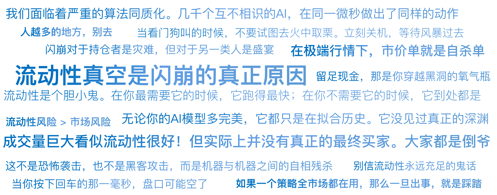

# 25｜谁偷走了流动性？闪崩之谜

你好，我是陈旸。

请想象你正在驾驶一辆自动驾驶汽车，行驶在宽阔的高速公路上。路上车流如织，一切都很顺畅。突然，在没有任何征兆的情况下，你周围所有的汽车瞬间全部消失了。你的雷达探测不到任何物体，你的前方是一片虚无的深渊。你的车失去了参照系，开始疯狂打转，冲向悬崖。

这就是 2010 年 5 月 6 日下午 2 点 45 分，华尔街交易员们的真实体验。那天下午，道琼斯指数在几分钟内暴跌近 1000 点（当时约 9%）。更离谱的是个股：

- 埃森哲（Accenture），一家咨询巨头，股价从 40 多美元瞬间跌到了 0.01 美元（一分钱）。
- 宝洁（P&G），瞬间跌了 37%。

20 分钟后，市场又奇迹般地涨了回来，仿佛什么都没发生过。但这短短的 20 分钟，蒸发了万亿美元的市值，也粉碎了人类对有效市场的最后一点幻想。是谁干的？是恐怖袭击？是黑客攻击？都不是，**是机器之间的自相残杀。**

## **大象闯进瓷器店：原本平平无奇的卖单**

闪崩的起因，竟然源于一笔普通的对冲交易。那天，一家叫 Waddell & Reed 的基金公司，决定卖出 7.5 万张 E-Mini 标普 500 期指合约（价值约 41 亿美元），以对冲他们手中的股票风险。这笔单子虽然大，但在平时，也就是市场几十分钟的成交量。问题出在他们使用的执行算法上。

他们用了一个简单的 **VWAP（成交量加权平均价）算法**。

- 逻辑：市场的总成交量越大，我就卖得越快。
- 目的：跟随市场的节奏，把这 7.5 万张单子混在人堆里卖掉。

这是一个不看价格，只看量的算法。它不知道那时候市场已经有点脆弱了（受欧债危机影响）。当它开始卖出时，引发了价格的小幅下跌和成交量的放大。

注意，Bug 来了：因为成交量放大了，VWAP 算法认为：“太好了！市场很活跃！我可以卖得更快了！” 于是它加速抛售。这一加速，导致价格跌得更猛，成交量更大。成交量更大，算法卖得更更疯狂。这就形成了一个正反馈循环。但这还不足以导致崩盘。真正的灾难，是高频交易商的加入。

## **击鼓传花：高频交易的热山芋**

E-Mini 标普 500 期货市场，是高频交易的主战场。当那只大象（基金卖单）冲进市场时，HFT（高频交易商）们就像一群敏捷的猴子，冲上去接货。HFT 的逻辑是做市：我以 99 元买入，马上以 99.1 元卖出，赚 0.1 元差价。我绝不过夜，甚至绝不持仓超过 1 分钟。

起初，HFT 们买下了基金抛出的合约。但是，他们发现这个卖压太大了，根本停不下来。HFT 不想持仓，于是 HFT A 把合约卖给 HFT B，B 卖给 C，C 又卖回给 A。

成交量瞬间爆炸。在这个过程中，每一张合约都在 HFT 之间疯狂转手，像一个烫手的山芋。这就造成了一个流动性假象：你看盘面，成交量巨大！看似流动性很好！但实际上，并没有真正的最终买家。大家都是倒爷。这就像一群人在房间里互相倒水喝，看起来很热闹，但水龙头的源头（真正的买盘）其实已经断了。

## **流动性的背叛：当做市商拔网线**

当价格跌破某个阈值，或者波动率（VIX）飙升时，HFT 们的风控系统被触发了。HFT 的算法是非常精明的。它们会计算毒性订单流（Toxic Flow）。当它们发现，无论怎么买都会亏，且对手盘（那个基金算法）像个疯子一样不计成本地砸盘时，HFT 做出了一个集体决定：我不玩了。

就在那一瞬间，所有的 HFT 同时撤单。他们关闭了做市程序，拔掉了网线，去喝咖啡了。**这就是闪崩的真正原因：流动性真空。**

- 买盘（Bid）：空空如也。
- 卖盘（Ask）：基金算法还在疯狂地按市价抛售。

这时候，市场上只剩下一种买单——Stub Quotes（占位报价）。这是一种极其荒谬的买单。有些做市商为了满足交易所必须挂单的规定，会在 0.01 美元这种极低的位置挂一个象征性的买单（意思是我根本不想买）。

平时，价格不可能跌到这里。但现在，中间的买单全撤了。基金的市价卖单，直接击穿了所有防线，像自由落体一样，砸到了 0.01 美元。于是，埃森哲（Accenture）就以 1 分钱的价格成交了。这就好比你在拍卖会上，原本这幅画值 1 个亿。突然所有买家都跑了，只剩一个收废品的出价 1 块钱。然后拍卖师一锤定音：“1 块钱，成交！”

## **AI 时代的同质化危机**

你可能会说：“那是 2010 年，现在的 AI 更聪明了，不会这样了吧？”错。风险反而更大了。在 AI 量化时代，我们面临着严重的算法同质化。

- AI 大模型的底座都是基于 Transformer 模型。
- 大家看的都是同样的因子（动量、拥挤度）。
- 大家用的都是同样的风控阈值（VaR）。

**这导致了羊群效应的数字化版本。以前是散户恐慌，现在是模型恐慌。**当市场出现异动时，所有的 AI 模型可能同时得出一个结论：“卖出，并撤销流动性。” 几千个互不相识的 AI，在同一微秒做出了同样的动作。这会导致流动性在瞬间归零。

这也是为什么这几年我们经常看到尾盘跳水、瞬间暴跌的原因**。流动性是一个胆小鬼。在你最需要它的时候（大跌时），它跑得最快；在你不需要它的时候（牛市），它到处都是。**

## **量化实战：如何防止掉进黑洞？**

作为《AI 量化思维》的学员，我们无法改变市场的微观结构，但我们可以通过策略设计，让自己幸存下来。

**策略一：严禁使用市价单**

在极端行情下，市价单就是自杀单。

- 你以为你在 40 元卖出。
- 结果成交价是 0.01 元。因为在你按下回车的那一毫秒，盘口可能空了。

**对策**：在 QMT 代码中，永远使用限价单。如果你非要急着卖，可以挂 对手价 - 2% 的限价单。这叫做带保护的市价单**。**它保证了你最差也能卖在某个价格，而不是卖在地板上。

**策略二：异常检测与熔断机制**

给你的 AI 加一个看门狗。实时监控市场的微观指标：

**买卖价差**：如果平时价差是 0.01 元，突然变成了 0.5 元，说明流动性正在枯竭。**盘口深度**：如果买一到买五的挂单量突然减少 90%，说明市场深度急剧萎缩，流动性瞬间枯竭。

```
Python代码逻辑：
if current_spread > avg_spread * 5:
    print("警告：流动性异常！暂停开仓！撤销所有挂单！")
    stop_trading()
```

当看门狗叫的时候，不要试图去火中取栗。立刻关机，等待风暴过去。

**策略三：不要把止损单设在拥挤的位置**

很多技术派喜欢把止损设在关键支撑位下方一点点。比如支撑位是 10.00 元，大家把止损设在 9.99 元。HFT 非常清楚这一点。一旦价格跌破 10.00 元，就会触发成千上万个 9.99 元的市价止损单。这些单子会瞬间抽干流动性，导致价格瞬间打到 9.50 元。

**对策**：使用软止损（程序内部监控，触发后手动或算法执行），而不是直接挂在交易所的硬止损单。或者把止损位设在宽一点的地方。

## **机遇：秃鹫的盛宴**

闪崩对于持仓者是灾难，但对于另一类人是盛宴。那就是低价捞货的量化策略。2010 年闪崩那天，有些极其简单的算法赚翻了。这个策略叫钓鱼策略。

**逻辑**：长期在那些蓝筹股（如苹果、茅台）的跌停板位置，挂一些买单。平时，这些单子永远不会成交。但是，一旦发生闪崩，流动性黑洞瞬间把价格打到地板。你的钓鱼单就会成交。20 分钟后，价格回到正常。你瞬间赚了 100 倍。

但这也有风险：万一不是闪崩，而是公司真的破产了呢？所以，这种策略通常只针对 ETF 或者大而不倒的巨头，且仓位很轻。这也算是一种另类的保险业——你为市场的极度恐慌提供了一点点流动性，市场回报你暴利。

## **AI 量化策略建议**

闪崩之谜告诉我们，现代金融市场是一个复杂自适应系统。它不是线性的，它是混沌的。

**1. 别信流动性永远充足的鬼话**

在做回测时，我们通常假设我想卖就能按收盘价卖出去。但在实盘中，滑点是真实存在的**。**特别是当你的资金量变大，或者做小微盘股时，**流动性风险 > 市场风险**。

**2. 远离拥挤的赛道**

如果一个策略（比如微盘股策略），全市场都在用。那么一旦出事，就是踩踏。2024 年初的微盘股闪崩，就是 2010 年美股闪崩的 A 股复刻版。人多的地方，别去。

**3. 保持敬畏**

无论你的 AI 模型多完美，它都只是在拟合历史。它没见过真正的深渊。留足现金，那是你穿越黑洞的氧气瓶。

## 本讲金句弹幕



## **课后思考题**

打开你的 QMT，查看你关注的一只股票的分时成交明细。找一找有没有那种瞬间跌了 2% 又瞬间拉回的尖刺。这往往就是一次微型的闪崩。思考一下：如果你的止损单刚好挂在那个尖刺的底部，你会遭遇什么？你应该如何修改你的止损逻辑来避免被误杀？

## **下节预告**

不管是 LTCM 的崩盘，还是光大的乌龙指，还是闪崩，主角都是机构。散户在这些故事里，通常是受害者。但是，在 2021 年，剧情反转了。一群散户，利用社交媒体集结起来，通过期权和现货的联动，把华尔街的顶级对冲基金逼到了破产的边缘。这就是游戏驿站（GME）逼空事件。

---
来源：极客时间
链接：https://time.geekbang.org/column/article/953405
日期：2026-05-18
