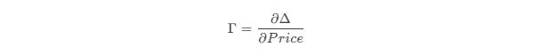
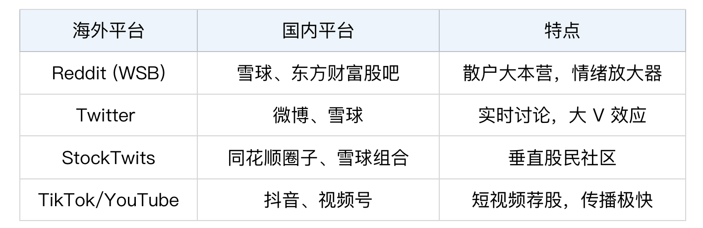
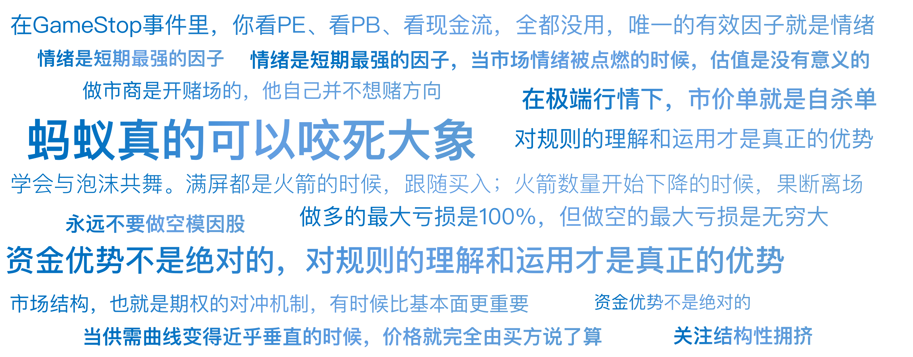

# 26｜散户的起义：GME逼空华尔街

你好，我是陈旸。

2020 年的游戏驿站（GameStop），在华尔街精英眼里，就是一只死票。这是一家卖实体游戏光盘的连锁店。在数字化下载和电商的冲击下，它看起来就像当年的诺基亚，注定要倒闭。股价最低跌到了 2 美元。华尔街的对冲基金们像秃鹫一样盘旋在它头顶，疯狂做空。其中，Melvin Capital（梅尔文资本）最为激进。

激进到什么程度？GME 的做空比例一度高达 140%。这时候量化视角的警钟敲响了，注意这个数字：140%。这意味着，市面上只有 100 股股票，但被卖空了 140 股。这在数学上是怎么实现的？

A 借给 B 卖空，B 卖给 C，C 又借给 D 卖空……同一股股票被借了多次。这就像一个堆满了炸药桶的房间。只要有一点火星，整个房间就会爆炸。华尔街的精英们太傲慢了，他们笃定 GME 会归零，所以无视了这个显而易见的流动性风险。直到那个带头大哥——Keith Gill 点燃了火柴。

## **第一重武器：轧空（Short Squeeze）**

Keith Gill 不是普通散户，他是专业的金融分析师。他发现 GME 被严重低估了（还有现金流，新主机要发布），且做空比例太高。他在 Reddit 的 WallStreetBets（WSB）板块上晒出了自己的多单，并喊出了口号： YOLO（You Only Live Once，你只活一次，梭哈！）散户们集结起来，开始疯狂买入 GME 股票。股价开始上涨。这时候，第一重数学机制启动了：轧空。

**原理：**

Melvin Capital 借了股票卖出（做空），现在股价涨了，他们亏损了。为了止损（或者被追加保证金），他们必须买回股票还给券商。关键点：他们买回股票的动作，会进一步推高股价。股价更高 => 亏损更多 => 需要买回更多 => 股价更高。

这是一个正反馈循环。但这只是常规武器。**真正让华尔街崩溃的，是散户们发现的第二重核武器——期权。**

## **第二重武器：伽马挤压（Gamma Squeeze）**

如果散户只是买股票，资金量是有限的。散户那点钱，怎么撬动几百亿的基金？答案是：杠杆。散户们没有直接买正股，而是疯狂买入看涨期权（Call Options）。期权很便宜，几百美元就能控制价值几万美元的股票。这时候，期权市场的做市商（如 Citadel）被迫卷入了战争。

\*\*请集中注意力，这里是本讲最硬核的量化知识：\*\*做市商是卖期权给你的人。他是开赌场的，他不赌方向，他要保持中性。当你从做市商手里买入一份 Call（看涨期权）时，做市商就持有了一份空头头寸。为了对冲风险，做市商必须在股票市场上买入一定数量的正股。

买多少？

这由期权的 Delta 值决定。股价低时，期权是虚值的，Delta 很小（比如 0.1），做市商只需买一点点股票。但是，随着股价上涨，期权从虚值变成实值，Delta 会迅速变大（接近 1）。

**Gamma 的概念：**

Gamma 是 Delta 随价格变化的速率（加速度）。

Γ=∂Δ​/∂Price

**伽马挤压的死亡螺旋：**

散户疯狂买入 Call => 做市商为了对冲，必须买入正股。做市商买入正股 => 推高股价。股价上涨 => 触发 Gamma 效应 => 期权的 Delta 变大。Delta 变大 => 做市商必须再买入更多的正股来对冲。做市商买入更多      => 股价继续暴涨……

看懂了吗？\*\*做市商变成了散户的免费打手。\*\*散户每买一张期权，就强迫做市商像机器一样去买正股。股价越高，做市商买得越猛。这就是为什么 GME 的股价能从 20 美元一路飙升到 483 美元。这在物理学上叫共振。散户找到了系统的固有频率，把这座大桥震塌了。

## **情绪因子：当信仰变成流动性锁**

在传统的量化模型中，我们假设投资者是理性的：赚了钱就会止盈。所以，Melvin Capital 一开始以为：“涨这么多了，散户肯定会卖的，我只要扛一扛就过去了。”但他错了。他遇到了一群不理性的疯子。在 WSB 论坛上，流行着一种文化：钻石手。意思就是：哪怕亏光，我也绝对不卖。他们互相晒单，谁卖谁就是叛徒，谁持有谁就是英雄。

**量化视角的解读**

这导致了流动性枯竭。

- 买盘：源源不断的期权做市商回补 + 空头止损。
- 卖盘：几乎为零（因为散户锁仓了）。

当供需曲线垂直时，价格是由买方说了算的。Melvin Capital 想买回股票平仓？对不起，没人卖给你。你出多少钱都不卖。最终，Melvin Capital 巨亏 53%，不得不寻求注资救命。这也宣告了传统基本面量化策略的失效。在 GME 事件中，你看 PE、PB、现金流，全是错的。**唯一的因子就是情绪。**

## **拔网线：游戏终结**

这场狂欢是如何结束的？不是因为空头赢了，而是因为赌场关门了。2021 年 1 月 28 日，散户常用的交易软件 Robinhood 突然宣布：禁止买入 GME，只能卖出。理由是：由于波动剧烈，清算所（DTCC）要求 Robinhood 缴纳巨额保证金，Robinhood 没钱了。这一招拔网线，直接切断了买盘。

- 只能卖，不能买 => 供需瞬间逆转。
- 恐慌蔓延，Gamma Squeeze 反向运行。
- 股价从 483 美元自由落体。

虽然散户最后输了钱，但他们证明了一件事：**只要足够团结，利用金融工程的规则，蚂蚁真的可以咬死大象。**

## **AI 量化的新课题：舆情监控**

GME 事件后，华尔街发生了一场革命。所有的量化基金都意识到：必须监控社交媒体。如果你的 AI 模型里还没有加入社交媒体因子，你就已经被时代淘汰了。

**现在的 AI 是如何捕捉下一个 GME 的？**

**1. 另类数据源**

**2. 核心指标计算**

- **提及量**：GME 今天被提到了多少次？如果比昨天暴增 1000%，预警。
- **情绪极性**：大家是在骂它还是在夸它？
- **表情包分析**：AI 学会了识别 🚀（火箭）和 💎🙌（钻石手）。如果一个帖子里全是🚀，AI 判定为：极度狂热 / 逼空前兆。

**3. 结合期权异动**

AI 不仅看舆情，还看期权链。如果某只股票的舆情热度飙升，同时看涨 / 看跌比异常升高，且隐含波动率（IV）暴涨。AI 会立刻发出信号：伽马挤压（Gamma Squeeze）可能正在形成，启动跟随策略。”

## **AI 量化策略建议**

GME 事件是金融史上的一座丰碑。它留给我们的教训是深刻的。

**1. 永远不要做空模因股（Meme Stocks，因社区情绪而暴涨的股票）”**

量化交易有一个铁律：\*\*不要做空波动率无限的资产。\*\*一只垃圾股，价格可以涨到天上去。做多的最大亏损是 100%（归零），做空的最大亏损是无穷大。当 AI 提示某只股票具有“Meme 属性”时，哪怕它基本面再烂，也禁止做空。

**2. 关注结构性拥挤**

在选股时，看一眼做空比例。如果一只股票的做空比例超过 30%，说明空头太拥挤了。这时候，只要有一点利好，就容易引发踩踏式上涨。这反而是做多的好机会（博弈空头回补）。

**3. 情绪是短期最强的因子**

在 A 股，这就是连板战法。当市场情绪被点燃时，估值是没有意义的。作为量化交易者，我们要学会与泡沫共舞，利用 AI 监控情绪的热度。当满屏都是火箭时，跟随买入；当 AI 检测到火箭数量开始下降时，果断离场，不要做最后的钻石手。

## 本讲金句弹幕

## **总结**

这一讲，我们讲了散户利用伽马挤压（Gamma Squeeze）和情绪因子击败机构的故事。这告诉我们：

市场结构（期权对冲机制）比基本面更重要。情绪是可以被量化、被利用的。资金优势不是绝对的，规则优势才是。

到这里，我们的第四章“风控与反脆弱”中关于外部风险（黑天鹅、闪崩、逼空）的部分就讲完了。但是，除了外部的敌人，量化交易还有一个内部的敌人。这个敌人藏在你的模型里，藏在你的回测报告里。它会用完美的曲线欺骗你，让你以为找到了圣杯，最后在实盘中让你亏得底裤都不剩。这就是过拟合与幸存者偏差。下一讲，我们将揭开量化回测中最大的骗局。

***

来源：极客时间
链接：<https://time.geekbang.org/column/article/953428>
日期：2026-05-18
