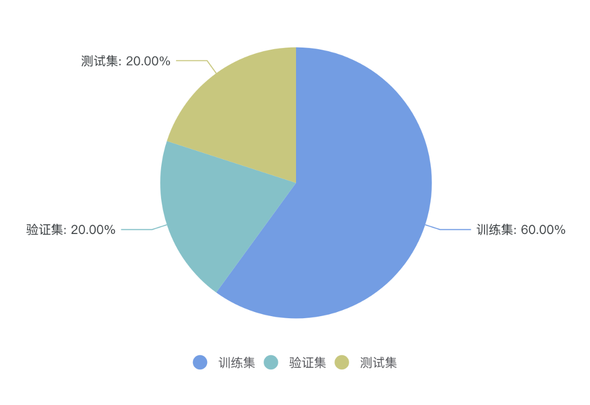
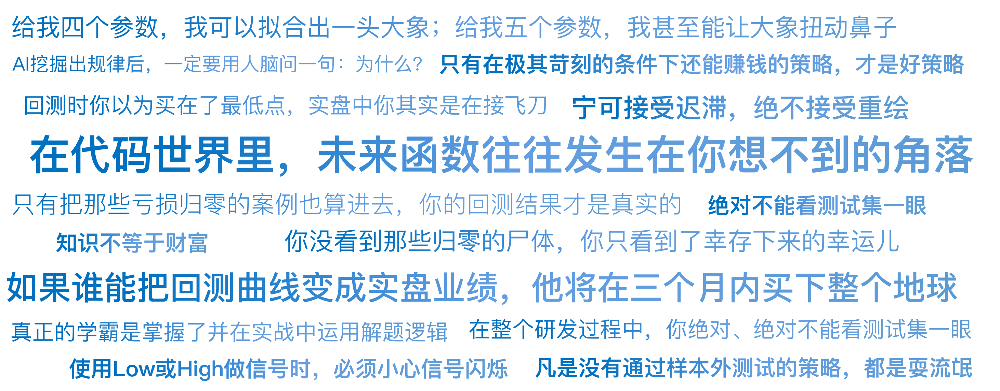

# 27｜最大的骗子：未来函数与过拟合

你好，我是陈旸。

在量化交易中，有一句著名的自嘲：“如果有谁能把回测曲线变成实盘业绩，他将在三个月内买下整个地球。”回测是量化交易的基石，但也是最大的陷阱。许多人做的所谓研究，有时候是在玩一个造假游戏。他们通过调整参数、修补代码，强行制造出了一条漂亮的曲线。这就像一个学生考试。

- 真正的学霸是掌握了并在实战中运用解题逻辑。
- 作弊的学生是提前偷看了答案（未来函数），或者是把这套试卷的答案背了下来（过拟合）。

一到正式考试（实盘），题目变了，作弊者瞬间原形毕露。

## **时间穿越者：未来函数**

什么是未来函数？ 简单说，就是在今天做决策时，用到了明天的信息。这听起来很蠢，谁会这么做呢？但在代码的世界里，这往往发生在你意想不到的角落。

**1. 经典的收盘价陷阱**

有些新手写策略逻辑是这样的：如果 (今日收盘价 > 昨日收盘价) 则 (在今日开盘时买入)

- **Bug 在哪里？**你在今日开盘这个时间点，是不可能知道今日收盘价是多少的。收盘价要等到下午 3 点才出来。
- **后果：**你的回测系统会以为你有预知能力。每当那天是大涨的，你都在早上买入了。回测收益率会高得离谱。

**2. 最高价 / 最低价的诱惑**

如果 (当前价格 < 最低价 * 1.01) 则 (买入)

- **Bug 在哪里？**K 线的最低价是在这根 K 线走完时确定的。在盘中，价格跌到 10 元，你以为是最低价买了；结果它后来跌到了 9 元。那你买的 10 元就不是最低价。使用 Low 或 High 做信号时，必须小心信号闪烁——盘中信号出现了，收盘后信号消失了。

**3. 财务数据的发布日陷阱** 这是一个更高级、更难发现的未来函数。

- **场景**：你写了一个低 PE（市盈率）策略。
- **代码逻辑**：在 2023 年 1 月 1 日，买入 2022 年财报显示净利润大增的公司。
- **Bug 在哪里？** 2022 年的年报，通常要等到 2023 年 4 月底才发布！ 在 1 月 1 日，你是不可能知道去年净利润是多少的。如果你在回测里用了这个数据，你就相当于穿越到了 4 个月后拿到财报，然后回到 1 月 1 日买股票。这当然稳赚不赔。

**AI 量化的对策**：在 QMT 或其他回测框架中，必须严格使用 Point-in-Time（PIT）数据。即：在 1 月 1 日，只能读取到 1 月 1 日之前已公开的信息。

**4. 动态指标的重绘陷阱（以缠论笔为例）**

这是量化缠论里最隐蔽的未来函数。

- **场景**：你在回测图表上看到，每次底分型刚出现，策略就精准买入，胜率极高。
- **Bug 在哪里？**缠论的笔和线段，在严格定义上往往需要后续的 K 线来确认（包含处理、底分型停顿验证）。在历史回测中，软件给你画出的笔是已经盖棺定论的。但在实盘的那个当下（Tick 级别），这一笔可能还没画完，价格如果继续跌，底分型就会消失，这一笔会继续向下延伸。
- **后果**：这叫信号重绘。回测时你以为买在了最低点，实盘中你其实是在接飞刀。
- **AI 量化的对策**：在写代码时，必须严格区分临时笔和确认笔。真正的实盘策略，必须等到底分型停顿（即下一根 K 线收盘确认不破低）才发出信号。宁可接受迟滞，绝不接受重绘。

## **记忆大师：过拟合**

如果说未来函数是偷看答案，那么过拟合就是死记硬背。在机器学习中，我们希望模型学会规律（比如：下雨天路滑）。但如果模型太复杂，它可能会学会噪音（比如：只要是星期二，且路边有只红色的鸟，路就会滑）。

**1. 参数过多的诅咒**

假设你有一个简单的均线策略：突破 MA20 买入。你回测了一下，效果一般。于是你开始加条件：突破 MA20 且 RSI < 30 且星期二且股票代码尾号是 6 且过去 3 天没下雨……

你加了 10 个条件。终于，回测曲线变得完美了！胜率 100%！**恭喜你，你通过过度优化，成功地记住了历史上的每一次巧合。**这就像你为了通过考试，把“C, A, B, D, A…”这串答案背下来了。只要试卷（市场环境）稍微变一点点，你的策略就会从 100 分变成 0 分。

**2. 冯·诺依曼的警告**

数学家冯·诺依曼说过一句名言：“给我四个参数，我可以拟合出一头大象；给我五个参数，我甚至能让大象扭动鼻子。”在 AI 量化（特别是深度学习）中，过拟合是头号大敌。现在的神经网络动不动就几百万个参数。它们太容易记住历史数据了。

**如何判断是否过拟合？**看参数敏感性。

- 如果你的策略在 MA20 时赚钱，在 MA19 和 MA21 时也赚钱（周围是一片高原），那是真规律。
- 如果你的策略在 MA20 时赚大钱，但在 MA19 和 MA21 时巨亏（这是一根孤立的针），那是过拟合。

## **幸存者偏差**

第三个骗子，叫死人不会说话。假设你今天要回测一个低价股策略。你拉取了现在 A 股所有价格低于 2 元的股票的历史数据。你发现：哇！如果你在 10 年前买入它们，持有到现在，收益率惊人！骗局在哪里？ 你只测试了现在还活着的股票。那些在 10 年前也是低价股，但后来退市了、倒闭了的公司，已经从你的数据库里消失了。你没看到那些归零的尸体，你只看到了幸存下来的幸运儿。

量化视角的修正：真正严谨的回测，必须包含已退市股票的数据。只有把那些亏损归零的案例也算进去，你的回测结果才是真实的。

## **科学家的解药：训练集与测试集**

面对这三个骗子，我们该怎么办？ 我们必须引入数据科学的标准流程。在 AI 量化中，我们永远不能把所有数据都拿来训练。我们必须把数据切成三份：

**1. 训练集—— 教科书**

- **占比**：60%。比如 2016 年 -2021 年的数据。
- **用途**：用来给 AI 模型找规律，调整参数，优化策略。
- **状态**：这是 AI 可见的数据。

**2. 验证集—— 模拟考**

- **占比**：20%。比如 2022 年 -2023 年的数据。
- **用途**：用来挑选模型。比如你有 A、B、C 三个策略，都在训练集上表现很好。那就用验证集跑一遍，看谁更稳。
- **状态**：这是用来调优的半可见数据。

**3. 测试集—— 高考**

- **占比**：20%。比如 2024 年 -2025 年的数据。
- **用途**：**终极审判**。
- **关键规则**：**在整个研发过程中，你绝对、绝对不能看测试集一眼**。只有当你确定了最终模型后，才能在测试集上跑一次。
- **结果**：如果测试集上的表现和训练集差不多，说明策略有效。如果训练集年化 50%，测试集年化 -10%，说明过拟合，**直接作废**。这叫**样本外测试**。它是检验真理的唯一标准。凡是没有通过样本外测试的策略，都是耍流氓。

## **纸面富贵的终结：实盘滑点与冲击成本**

除了数据层面的骗子，还有一个**物理层面**的骗子。回测通常假设：

- 你想买多少就能买多少。
- 你的买入价就是收盘价。
- 没有手续费，或者手续费很低。

**实盘的真相：**

**冲击成本**：如果你资金量大，你的买单会把价格推高。回测显示你买在 10.00 元，实盘你买均价可能是 10.05 元。这 0.5% 的成本会吃掉大部分高频策略的利润。**滑点**：你想买的时候，可能没人卖。**停牌 / 涨跌停**：回测里你可能卖出了一个跌停的股票，但实盘里你根本卖不掉。

**对策**：在回测代码中，必须把困难想得足一点。

- 设滑点：双边千分之二甚至更高。
- 设成交率：假设每天只能成交当天总成交量的 10%**。只有在极其苛刻的条件下还能赚钱的策略，才是好策略。**

## **AI 量化策略建议**

这一讲可能让你有点沮丧。原来那个年化 100% 的策略是假的？ 是的，打破幻想是成熟的第一步。

**1. 警惕完美曲线**

如果你看到一个交易策略，回测曲线平滑得像一根直线，没有任何回撤。请直接把它拉黑。真实的市场充满了波动。有回撤、有波动的曲线，反而更真实、更可信。

**2. 逻辑大于数据**

在 AI 挖掘出规律后，一定要用人脑问一句：为什么？

- 因为油价涨，所以石油股涨。—— 逻辑通顺，可用。
- 因为孟加拉国的黄油产量涨，所以美股涨。—— 数据相关，但逻辑不通，伪相关，不可用**。**可解释性是防范过拟合最好的盾牌。

**3. 模拟盘跑半年**

在你投入真金白银之前，先让你的 AI 在模拟盘上跑半年。模拟盘的数据是实时的、未知的。这是最真实的样本外测试。只要能忍住这半年的寂寞，你就能少亏很多冤枉钱。

## 本讲金句弹幕

## **课后思考题**

打开你现在的策略代码（或者你在网上看到的大神策略）。做一个参数平移测试。如果策略里用的是 RSI < 20 买入。请试着改成 RSI < 15 和 RSI < 25。看看收益率曲线是不是崩了？ 如果崩了，说明原来的那个 20 只是一个巧合的过拟合参数**。**如果曲线依然稳健，恭喜你，你的策略具有鲁棒性。

## **下节预告**

讲到这里，我们的前五个模块（道、地、术、器、盾）已经全部结束。你已经掌握了量化交易的完整知识体系。但是，知识不等于财富。从知道到做到，中间隔着最远的一条河——行动。

下一讲，我们将进入最后一个模块：第六章：进阶之路（路）。我们将不再谈论技术，我们谈论人生。投资是一场无限游戏，如何规划你的量化进阶之路？普通人如何迈出第一步？

---
来源：极客时间
链接：https://time.geekbang.org/column/article/953513
日期：2026-05-18
