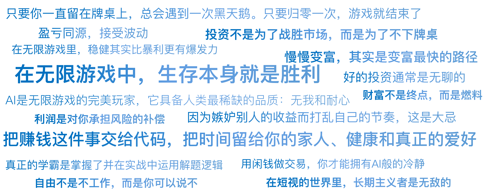

# 28｜投资是一场无限游戏：活得久，才是最高的阿尔法

你好，我是陈旸。

1986 年，哲学家詹姆斯·卡斯写了一本神书，叫《有限与无限的游戏》。书中把世界上的活动分为两类，有限游戏和无限游戏。

有限游戏是为了赢。它有明确的开始和结束，有固定的规则，有赢家和输家。比如，一场足球赛、一次高考、一局德州扑克、一轮牛市的博弈。

无限游戏是为了继续玩下去。它没有终点，规则可以改变，没有所谓的赢，只有存续或出局。比如，生物进化、企业经营、以及……个人财富管理。

金融市场的残酷之处在于：**它表面上看起来像一个充满了 K 线波动的有限游戏（大家都在比谁今天赚得多），但本质上，它是一个残酷筛选的无限游戏。**

如果你用有限游戏的心态（我要赢，我要翻倍，我要击败庄家）去玩无限游戏，结局注定是悲剧。

## **赢家的诅咒：为什么冠军常死于归零？**

在量化交易中，你可能会看到一种现象：短期业绩榜单的第一名，往往也是死得最快的那一个。

**场景示例：**

- **选手 A（赌徒心态）**：全仓梭哈妖股，加了 5 倍杠杆。运气好，一个月翻了 5 倍。他是这个月的冠军，享受着众人的膜拜。
- **选手 B（量化心态）**：多策略对冲，控制回撤，从不梭哈。一个月赚了 3%。没人注意他，觉得他太怂。

在有限游戏的视角（比如只看这一个月），A 是赢家，B 是输家。但在无限游戏的视角（比如拉长到 10 年），会发生什么？A 因为习惯了梭哈和暴利，他的风险阈值被拉高了。他觉得一个月赚 20% 都算亏。

根据概率论（我们之前学过的凯利公式），只要他一直留在牌桌上，总会遇到一次黑天鹅。因为他满仓加杠杆，这一次黑天鹅就能让他从 1000 万变成 0（甚至负债）。**只要归零一次，游戏就结束了。**你在前面赢了 99 次都没用，因为你无法参加第 101 局了。

而 B，虽然每个月只赚 3%，但如果不亏损，10 年后是几十倍的收益。更重要的是，他在第 101 局、第 1000 局，依然在桌上。

**量化思维的第一定律：投资不是为了战胜市场，而是为了不下牌桌。**在无限游戏中，生存本身就是胜利。

## **复利的谎言与真相：时间是你的朋友**

提到无限游戏，就绕不开复利。爱因斯坦说它是世界第八大奇迹。在理想情况下：如果你每天赚 1%，一年后你的本金将变成 37 倍！**这是数学上的真理，却是现实中的谎言。**因为在现实中，没有人能做到每天稳赚 1% 且不回撤。**现实中的复利，最大的敌人是波动率。**

让我们看两个公式：

**算术平均收益**：(+50% - 50%) / 2 = 0%，即不亏不赚。**几何平均收益**：(1+0.5) * (1-0.5) = 0.75，即你亏了 25%。

这就是我们在风控课里讲的波动率税。在无限游戏中，稳健比暴利更有爆发力。

**巴菲特的秘密：**巴菲特 99% 的财富是在他 50 岁以后赚到的。他的年化收益率是多少？只有 20% 左右。这个数字在 A 股很多散户眼里简直弱爆了（抓个涨停板就 10% 了）。**但巴菲特的可怕之处在于：他把这个 20% 维持了 50 多年。**他没有在某一年赚 200%，也没有在某一年亏光。他把自己变成了一个低波动、正期望的函数，然后把剩下的交给了时间。

**AI 量化的使命：**我们开发 AI，做多策略，做风控，不是为了把年化收益从 20% 提到 200%。而是为了把最大回撤从 30% 降低到 10%。因为只有把波动降下来，你才能拿得住；只有拿得住，复利才能在最后几年通过指数级爆炸，送你上青云。

## **从猎人进化为农夫**

在无限游戏里，我们需要通过改变心态，来改变行为。

**1. 猎人思维（有限游戏）**

- **关注点**：哪里有猎物？（哪里有大牛股？哪个板块最热？）
- **动作**：瞄准、射击、追逐。
- **结果**：有时候吃得很饱，有时候饿死。一旦受伤（亏损），就无法打猎。
- **代表策略**：打板、梭哈、听消息。

**2. 农夫思维（无限游戏）**

- **关注点**：土壤怎么样？天气怎么样？（宏观环境、资产配置、风控体系）。
- **动作**：播种、施肥、除草、等待。
- **结果**：收成有大年小年，但不会绝收。随着果树长大，收益越来越稳。
- **代表策略**：多因子选股、网格交易、资产配置（股票 + 债券 + 商品）。

**AI 是什么？**

AI 不是你打猎的枪（虽然它也可以是），AI 更应该是你的自动化农业机械。它帮你监控每一寸土壤（数据），帮你自动浇水（定投），帮你自动除虫（风控）。它让你从看天吃饭变成了科学种植。

## **所谓的财务自由，其实是选择权的自由**

在这个无限游戏中，我们要玩到什么时候是个头？很多人做量化的初衷是财务自由。但大多数人对财务自由的定义是错的。他们认为是一个具体的数字：赚够 1000 万我就收手。这是一个陷阱。如果你是为了赚 1000 万而在这个市场里搏杀，当你赚到 500 万时，你会想赚 2000 万；当你亏回 200 万时，你会想回本。你会永远在贪婪和恐惧中轮回。

**在无限游戏的视角下，财富不是终点，而是燃料。**

- **第一阶段（燃料积累）**：利用工作收入、量化策略，积累本金。
- **第二阶段（燃料循环）**：建立一套睡后收入系统（比如低风险的量化网格、分红策略）。当这套系统的产出 > 你的生活成本时，你就自由了。

**自由不是不工作，而是可以说不。**

- 你可以对不喜欢的上司说不。
- 你可以对高风险但看不懂的行情说不。
- 你可以对必须时刻盯盘、消耗生命的短线策略说不。

量化交易的终极意义不是为了让你变成世界首富，而是为了把你从枯燥的盯盘、焦虑的决策中解放出来。把赚钱这件事交给没有感情的代码，把时间留给你的家人、健康和真正的爱好。这才是真正的赢。

## **像 AI 一样思考：去情绪化的人生**

AI 之所以是无限游戏的完美玩家，因为它具备两个人类最稀缺的品质：

**无我**：AI 亏钱了，不会觉得自己无能，不会为了面子去死扛单子。它只会修正概率。人类往往不是输给了市场，而是输给了自尊心。**耐心**：AI 可以等待一个信号，等待一年，如果不触发，它就一年不动。人类空仓三天就受不了了，觉得踏空比亏损更难受。

**修行建议：**虽然我们是肉体凡胎，但我们可以通过修炼来接近 AI 的境界。

- **把账户看作一个数字游戏**：别把钱当成孩子的奶粉钱或明年的房贷。用闲钱做交易，你才能拥有 AI 般的冷静。
- **承认无知**：像索罗斯一样，时刻准备承认我看错了。砍仓不是羞耻，是风控。
- **享受无聊**：好的投资通常是无聊的。如果你在交易中感到了巨大的刺激和快感，那你大概率是在赌博。

## **AI 量化策略建议**

请记住以下三个锦囊，作为你行走江湖的护身符：

**1. 盈亏同源，接受波动**

不要试图寻找只赚不亏的圣杯。利润是对你承担风险的补偿。如果你接受不了回撤，你就不仅享受不到复利，还会死在黎明前。**拥抱波动，利用波动（网格 / 期权），而不是恐惧波动。**

**2. 弱水三千，只取一瓢**

市场上的钱是赚不完的。AI 热点来了，你没赶上；商业航天起来了，你没赶上。没关系。无限游戏的关键是：**只要你在你的策略射程范围内（能力圈），赚到了你该赚的那部分，就足够了。**因为嫉妒别人的收益而打乱自己的节奏，是大忌。

**3. 长期主义是最高级的算法**

在短视的世界里，长期主义者是无敌的。当所有人都想做高频、做 T+0、做一夜暴富时，你把目光放长到 5 年、10 年。你会发现，竞争对手少了很多，路越走越宽。**慢慢变富，其实是变富最快的路径。**

## 本讲金句弹幕

## **课后思考题**

请拿出纸笔，或者打开 Excel。不要计算下个月能赚多少。请计算一下：**如果我现在的本金，每年能稳定获得 15% 的收益（这是一个合理的量化目标），20 年后会是多少？**看着那个数字。然后问自己：为了这个数字，我是否愿意放弃那些一周翻倍的诱惑？我是否愿意忍受中间必然出现的 30% 回撤？如果你愿意，那么恭喜你。你已经拿到了无限游戏的入场券。

## **下节预告**

心态建设完毕。现在，你已经准备好迈出最后一步了。但是，路要一步步走，饭要一口口吃。从零开始学 Python？还是直接用 QMT？先实盘还是先回测？你需要一张清晰的进阶地图。

---
来源：极客时间
链接：https://time.geekbang.org/column/article/953544
日期：2026-05-18
