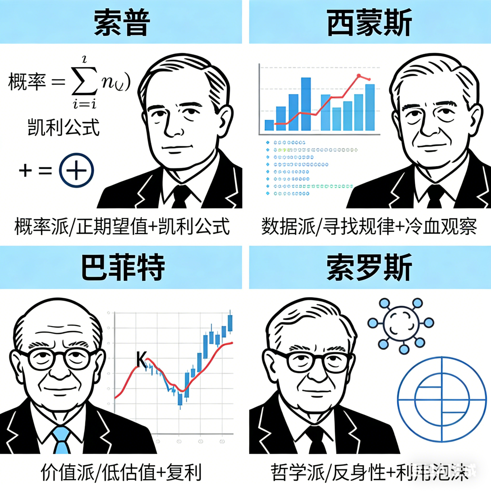
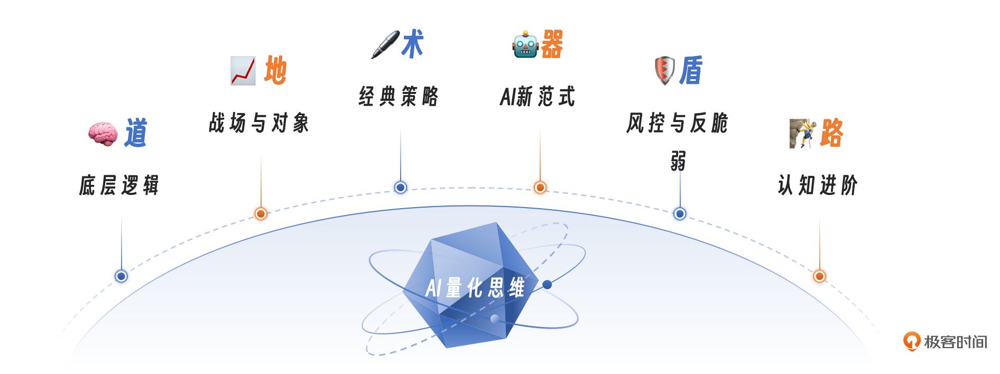
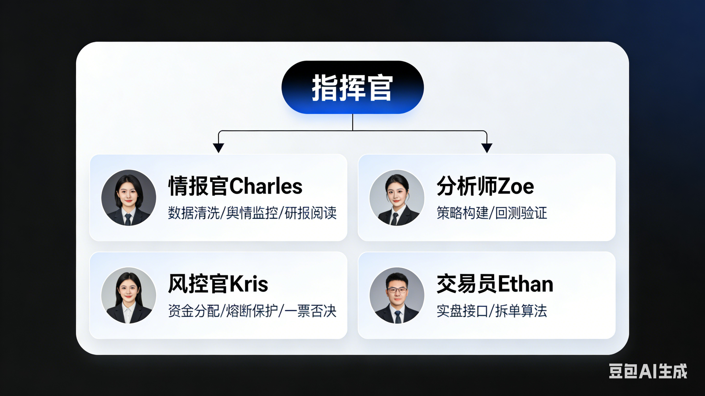

# 结束语｜从看客到剑客：知行合一，才是量化的终极圣杯

你好，我是陈旸。

美国第 26 任总统西奥多·罗斯福曾说过一段振聋发聩的话：“荣誉不属于那些批评家，不属于那些指指点点的人。荣誉属于那些站在竞技场上的人。他们的脸上沾满了尘土、汗水和鲜血；他们即使失败了，也是在伟大的尝试中失败的。”

在金融市场，这句话同样适用。我看过太多聪明人，他们读完了所有的量化书籍，学会了 Python 的所有语法，甚至把机器学习的原理背得滚瓜烂熟。但他们始终没有迈出实盘的第一步。

为什么？因为他们患上了一种完美主义绝症。

## **完美主义：新手的墓志铭**

在交流的过程中，我最怕听到的一句话是：“老师，我觉得我的策略还不够完美，等我把它优化到胜率 80% 再上线。”如果你抱有这种想法，你永远不会开始。因为市场上不存在完美的策略。

- 西蒙斯的大奖章基金，胜率只有 51%-52%。
- 索罗斯的胜率甚至不到 50%（但他盈亏比高）。

量化交易不是造火箭。造火箭需要万无一失，因为炸了就没了。量化交易更像是创业，或者是生物进化。你必须先弄出一个简单的、甚至有点丑陋的原型（MVP），把它扔到残酷的市场里。它会亏损，会报错，会遇到你从未想过的滑点。但这正是你需要的。这些真实的反馈，会逼迫你修改参数、优化逻辑、修补 Bug。所有的顶级策略，都是在实盘的炮火中炸出来的，不是在回测的温室里养出来的。

所以，成为剑客的第一条心法：**完成比完美更重要。** 哪怕是一个简单的“双均线金叉买入”，只要你敢挂实盘，你就比那些还在纸上谈兵的人强一万倍。

## **纳西姆·塔勒布的警告：Skin in the Game**

为什么模拟盘永远练不出高手？因为模拟盘没有痛感。《黑天鹅》的作者塔勒布提出了一个概念：**Skin in the Game（切肤之痛）。**当你在模拟盘亏了 10% 时，你会说：“哎呀，大意了，下次注意。”然后关掉软件去吃饭。当你在实盘亏了 10%（哪怕只有 1000 块钱）时，你会：

- 心跳加速，肾上腺素飙升。
- 晚上睡不着觉，反复复盘每一笔交易。
- 深刻地反思：“是不是我的风控没做好？是不是我太贪婪了？”

这种生理上的痛感，是进化的催化剂。人类的大脑有一种机制：它记不住道理，但它记得住痛苦。所以，我给所有新手的建议是：**尽早开始实盘，但用最小的资金。** 拿出一手茅台的钱（如果买不起茅台，就买一手低价股，几百块）。这不是为了赚钱，这是为了**购买痛感**。只有当真金白银在跳动时，你对概率、风控、人性的理解，才会从二维的文字变成三维的体验。

## **站在巨人的肩膀上：交易大师的思维模型**

在成为剑客的路上，你是孤独的，但你并不孤单。因为在量化交易的历史长河中，有无数大师的思想在为你引路。他们每个人都代表了一个门派，一种在这个不确定世界中生存的哲学。

**1. 概率派宗师：爱德华·索普。**当你怀疑数学能不能战胜赌场时，想一想索普。他告诉我们，只要你找到了正期望值的系统，并利用凯利公式严格管理下注比例，大数定律终将带你抵达胜利的彼岸。

**2. 数据派巅峰：詹姆斯·西蒙斯。**当你试图给市场的每一个波动找理由时，想一想西蒙斯。他告诉我们，“我们不试图解释市场，我们只寻找其中的规律。”不要让你的偏见干扰数据，做市场的冷血观察者。

**3. 价值派基石：巴菲特与格雷厄姆。**当你想要做短线博弈时，想一想巴菲特。他告诉我们，如果你把时间拉长，买得便宜（低估值）和活得久（复利）才是最强阿尔法。量化不仅仅是高频，更是基本面的量化。

**4. 哲学派猎手：乔治·索罗斯。**当你看到市场疯狂泡沫时，想一想索罗斯。他教给我们的反身性理论，让我们明白市场永远是错的。量化交易员不应恐惧泡沫，而应利用泡沫的非理性，完成财富的跃迁。

这些巨人构成了量化思维的坐标系。当你迷茫时，抬头看看他们，你就会知道自己身在何处。

## **最后的复盘：我们学到了什么？**

在结束之前，让我们快速回放一下这 30 讲的旅程，也就是我们在实战之前进行的量化交易思维的系统升级。

- **底层逻辑（道）**：我们确立了概率思维，明白了交易不是预测未来，而是寻找正期望值的博弈。
- **战场与对象（地）**：我们看清了 A 股的 T+1 约束，也掌握了期权期货的杠杆魔法，学会了像 AI 一样给股票打标签。
- **经典策略（术）**：我们拆解了缠论的分形结构，学习了海龟法则的截断亏损，也掌握了网格交易的收割波动。
- **AI 新范式（器）**：我们见证了 AI Agent 的崛起，它不仅能读研报，还能像人一样思考。我们发现了另类数据的金矿。
- **风控与反脆弱（盾）**：我们复盘了 LTCM 和光大乌龙指的惨案，学会了识别过拟合和未来函数这最大的骗子。
- **认知进阶（路）**：你接受了无限游戏的设定，知道了如何通过半人马模式，利用 AI 工具弯道超车。

这套体系，就是你下山后的内功心法。

## **一个真实的进化故事**

我想讲一个我身边的真实故事。我有位朋友叫老张，是一名资深的建筑工程师。做了十年交易，以前他每天盯盘，心情随着 K 线起伏。赚了钱就请客吃饭，觉得自己是股神；亏了钱就回家骂孩子，觉得自己是韭菜。十年下来，账户基本持平，但身体垮了，头发白了，心态崩了。

接触量化思维后，他做了一件小事。他并没有去写什么复杂的神经网络，他只是用我教的工具，写了一个最笨的 ETF 网格策略。逻辑很简单：买入沪深 300ETF，每跌 3% 买一份，每涨 3% 卖一份。然后，他把软件挂在云服务器上，就不管了。

起初，他很不习惯。总想打开软件看看，总想手动干预一下，总觉得机器太笨，会卖飞。但慢慢地，他发现那个笨笨的机器人，在震荡市里每天都能给他赚个几十块、几百块。虽然不多，但那种**睡后收入**的安稳感，是他从未体验过的。现在的老张，已经不再盯盘了。他周末去钓鱼，晚上陪孩子写作业。他对我说：“量化没有让我一夜暴富，但它把生活还给了我。”

这就是我想带给你们的——**不仅仅是赚钱的术，更是自由的道。**

## **现在的你，缺什么？**

思维课结束了。你现在的状态可能是：

- **脑子热热的**：觉得懂了很多道理。
- **手痒痒的**：想试一试。
- **心里虚虚的**：打开电脑，看着空白的屏幕，不知道第一行代码敲什么。

这很正常。因为你现在拥有了顶级的量化思维，但你还缺一套趁手的量化交易工具和代码。这就是知与行之间最后的一公里。

## **结束也是新的开始**

为了帮大家跑完这最后一公里，我准备了《AI 量化交易训练营》。在接下来的时间里，我们将一起卷起袖子干活，重点做三件事：

**1. 解决门槛：QMT 实盘权限与环境**

量化交易的第一道拦路虎是券商的门槛（有些券商 QMT 需要较高的资金）。我已经帮大家铺好了路，将尽可能降低大家开通 QMT 实盘权限的门槛。此外，你可以在本地或者云服务器上，配置你的交易策略 24 小时不断电运行。

**2. AI 实战：打造你的 AI 量化团队**

在训练营里，我们要组建一家属于你的 AI 量化公司。你将拥有四位不知疲倦的数字员工：

- **情报官 Charles**：帮你清洗数据，监控舆情，利用 RAG 技术阅读研报。
- **分析师 Zoe**：帮你构建策略，无论是海龟、缠论还是多因子，她都能回测验证。
- **风控官 Kris**：他是你的守门人，负责资金分配和熔断保护，拥有一票否决权。
- **交易员 Ethan**：负责对接实盘接口，执行拆单算法，确保交易精准落地。 你不再是一个人在战斗，你是指挥官。

**3. 社群共进：同侪的力量** 我们的学员都是 “剑客”的圈子。在这里，你会看到许多和你一样的人——他们都在用代码改变自己的投资方式。 这种叠加的人生会给你巨大的力量。当你看到别人做到了，你就会知道这件事是可行的；当你遇到困难时，你会发现你并不孤独。同侪共进，更能让你坚持下去。

这是你从看客变成剑客的快速通道。

## **结语：江湖路远，代码为马**

朋友们，专栏的内容就结束了。我想起电影《一代宗师》里的一句话：“念念不忘，必有回响。有一口气，点一盏灯。”量化交易这条路，注定是孤独的。市场会一次次打击你的自信，黑天鹅会一次次挑战你的神经。但我希望，这个专栏的内容能成为你心中的那一盏灯。

无论你是否报名实战营，我都祝福你。祝福你在这个充满不确定性的世界里，用概率的思维，构建出属于你自己的确定性人生。江湖路远，代码为马。愿你的收益曲线，永远是 45 度角向上。

我是陈旸，我们顶峰再见！

---
来源：极客时间
链接：https://time.geekbang.org/column/article/953640
日期：2026-05-18
