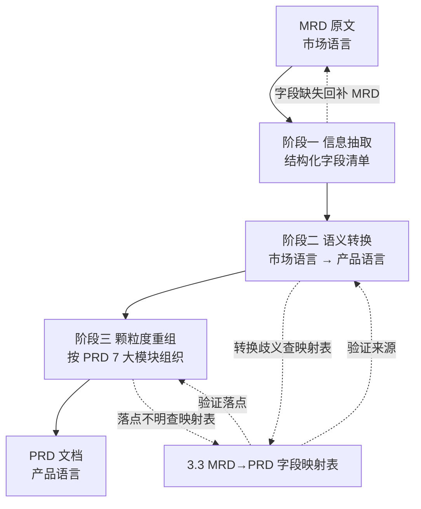

# MRD & PRD 结构与案例 · MRD→PRD 推导流程

---

> ## 📁 拆分资料导航
>
> 本文档已拆分为 3 个独立文件，分别存放在 [`MRD_PRD推导资料/`](./MRD_PRD推导资料/) 目录下：
>
> | 顺序 | 文件 | 路径 | 内容概要 |
> |---|---|---|---|
> | 1 | MRD 文档结构和案例 | [`MRD_PRD推导资料/1-MRD文档结构和案例.md`](./MRD_PRD推导资料/1-MRD文档结构和案例.md) | MRD 树状结构、核心字段定义、2 个真实案例（校园外卖配送、AI 翻译耳机）、MRD/BRD/PRD 边界 |
> | 2 | PRD 文档结构和案例 | [`MRD_PRD推导资料/2-PRD文档结构和案例.md`](./MRD_PRD推导资料/2-PRD文档结构和案例.md) | 最终 PRD 树状结构（融合 24 项优化点）、核心字段定义、2 个真实案例（批量导入工单、邮件发送 AC） |
> | 3 | 推导过程 | [`MRD_PRD推导资料/3-推导过程.md`](./MRD_PRD推导资料/3-推导过程.md) | 策划视角的 MRD→PRD 推导总纲、流程图、4 步法、字段映射表（14 行）、KANO 漏斗、端到端案例、7 条反模式、10 条自查 checklist |
>
> **本文档**为完整版（章节 1-3 全量内容），可作为单一文档查阅入口；如需按主题精读，建议打开上述 3 个拆分文件。

---

## 一、MRD 文档结构与案例

### 1.1 MRD 树状结构

```
MRD（7 大章节）
├── 1. 文档说明
│   ├── 1.1 版本控制（编号/日期/修改人/原因）
│   ├── 1.2 文档目的
│   └── 1.3 接收人与名词解释
│
├── 2. 市场背景与机会
│   ├── 2.1 行业概况（市场规模 / 增长率 / 发展阶段 / PEST）
│   ├── 2.2 市场问题与机会（核心痛点 + 机会点）
│   └── 2.3 市场细分与目标市场（TAM / SAM / SOM）
│
├── 3. 用户分析
│   ├── 3.1 用户画像（决策者画像 + 使用者画像 复合画像）
│   └── 3.2 场景分析（典型场景 + 任务流程 + 痛点）
│
├── 4. 竞争分析
│   ├── 4.1 直接竞品（对比表：定位/优势/短板）
│   ├── 4.2 间接替代型竞品
│   ├── 4.3 潜在进入者
│   ├── 4.4 竞争矩阵（多维度评分表）
│   └── 4.5 差异化优势
│
├── 5. 产品规划
│   ├── 5.1 产品定位（一句话定义 + 价值主张 + 市场定位）
│   ├── 5.2 功能规划（KANO 分级表）
│   ├── 5.3 非功能需求（性能/安全/可靠性/可扩展性）
│   └── 5.4 实施路线（里程碑 + 风险评估表）
│
├── 6. 商业模式（可选，B 端/硬件推荐保留）
│   ├── 6.1 收入来源
│   ├── 6.2 定价策略
│   └── 6.3 市场规模测算
│
└── 7. 风险评估与应对（含 Owner）
```

### 1.2 核心字段定义

| 章节 | 字段 | 填写指引 | 常见坑 |
|---|---|---|---|
| 2.1 行业概况 | 市场规模 | 必须含时间、金额、增长率 | 把"潜在用户量"当"目标用户量" |
| 2.1 行业概况 | PEST 分析 | 政策/经济/社会/技术四维 | 缺省字段填「无」不省略 |
| 2.3 目标市场 | TAM/SAM/SOM | 用 2-3 年数据 + 增长率 | 拿全行业数据当 SAM |
| 3.1 用户画像 | 决策者 + 使用者双视角 | 人口属性 + 行为特征双维度 | 写成"用户标签清单" |
| 3.2 场景分析 | 故事化描述 | 一个场景对应一个核心痛点 | 写成"打开 APP→点按钮"流水账 |
| 4.4 竞争矩阵 | 落到功能/价格/体验/生态 4 维 | 每条结论配证据 | 只写"体验差"等形容词 |
| 5.2 功能规划 KANO | 必备/期望/兴奋/无差异/反向 | 必备=P0 必做，兴奋=P2 亮点 | 把"功能"当"需求" |
| 5.4 实施路线 | 每阶段配"目标/时间/成功标准" | 避免"先做 A 再做 B" | 没有量化里程碑 |

### 1.3 MRD 真实案例

**案例 1：校园外卖配送 MRD 摘录** [cite:9]

```markdown
## 三、用户分析

### 3.1 目标用户
- 核心用户：有外卖需求的 18-25 岁在校大学生群体；
          想要从事兼职的在校大学生群体；
- 其他用户：其他在校工作人员；

### 3.2 用户需求（场景1：用餐高峰）
小王是北京某高校的一名大一学生，下课都是在用餐高峰期间。
面对食堂的人山人海，小王想订外卖，可外卖到了还要跑到学校门口去取。
后来了解到某个外卖软件能够提供将外卖送到校内的服务，
下课后小王急忙拿出手机订了一份外卖，半小时后小王在宿舍楼下取到了外卖。
```

- 优点：场景化故事好（3 场景覆盖用餐/宅寝/兼职）；用户分层清晰
- 不足：未给 TAM/SAM/SOM；未给竞品 SWOT；缺风险评估

**案例 2：AI 翻译耳机 MRD 摘录** [cite:5]

```markdown
| 模块 | 示例内容 |
|---|---|
| 市场背景 | 全球跨境交流与旅游增长，语言障碍制约交流效率 |
| 用户需求 | 旅游者/出海人员/留学生，希望能快速与他人沟通 |
| 竞品分析 | Timekettle、Google 翻译耳机等，普遍存在反应慢、离线效果差 |
| 市场规模 | 全球实时翻译设备市场 CAGR 预计达 13.2%（2023~2028） |
| 产品定位 | 主打"真·离线翻译 + 高准确率 + 通话同步" |
| 定价策略 | 高端款 ¥999、中端款 ¥599，采用硬件+App 订阅模式 |
```

- 优点：覆盖"商业模式+定价策略"（多数 MRD 缺这一层）；竞品落到差异化机会点
- 不足：缺用户使用场景故事；缺路线图与里程碑

---

## 二、PRD 文档结构与案例

### 2.1 PRD 树状结构（最终版，融合 24 项优化点）

```
PRD（7 大模块，融合案例 + 24 项优化点）
├── 1. 文档说明
│   ├── 1.1 修订记录表（版本号/章节/原因/日期/修改人）              ← 优化点 1
│   ├── 1.2 名词说明
│   └── 1.3 评审清单
│
├── 2. 产品概述
│   ├── 2.1 产品名称与定位
│   ├── 2.2 产品应用语言
│   ├── 2.3 产品愿景与目标（含北极星指标 - 量化）                  ← 优化点 5 补充
│   ├── 2.4 产品使用终端
│   ├── 2.5 核心价值主张
│   ├── 2.6 目标用户群体分析
│   ├── 2.7 市场需求与竞品简析
│   └── 2.8 浏览器兼容性要求
│
├── 3. 功能规格
│   ├── 3.1 功能详述
│   │   - 5 列表格：功能 ID（F-模块前缀_序号）/ 名称 / 描述 / 优先级 / 角色权限
│   │   - 3 级结构：模块（章）→ 子模块（节）→ 功能（表）           ← 优化点 19/20/21
│   ├── 3.2 验收标准 AC（Given-When-Then，每 P0 ≥3 条）          ← 优化点 2
│   ├── 3.3 功能模块间关系图（Mermaid）
│   └── 3.4 权限矩阵表（角色 × 功能 × 数据范围）                  ← 优化点 7
│
├── 4. 用户流程
│   ├── 4.1 用户旅程地图
│   │   - 8 列表：阶段 / 目标 / 行为 / 触点（页面 ID）/ 痛点 / 解决方案 / 体验 / 页面 ID
│   │   - 触点列硬性要求用"页面 ID"格式                           ← 优化点 22/23
│   ├── 4.2 关键业务流程图（Mermaid）
│   │   - 判断节点 + 分支条件命名规范                              ← 优化点 15
│   │   - 流程节点必须含页面 ID                                    ← 优化点 24
│   ├── 4.3 各场景下的用户操作步骤
│   │   - 步骤格式硬性规范：步骤 = 角色：动作                       ← 优化点 16
│   │   - 流程节点必须含页面 ID                                    ← 优化点 24
│   └── 4.4 用户故事清单（INVEST 拆分，作为.../想要.../以便...）  ← 优化点 3
│
├── 5. 数据流设计
│   ├── 5.1 数据结构与关系
│   │   - 表头固定 5 列：表名 / 字段 / 类型 / 约束（PK/FK/UK）/ 说明
│   │   - 约束标注范式：(PK) (FK to ...) (Unique identifier)      ← 优化点 18
│   ├── 5.2 关键数据流向图
│   │   - Mermaid 三层 subgraph：用户操作层 / 应用逻辑层 / 数据存储层 ← 优化点 17
│   └── 5.3 数据存储与处理原则（6 条：安全/一致/完整/可追溯/可扩展/索引）
│
├── 6. 非功能需求（独立模块）                                      ← 优化点 4
│   ├── 6.1 性能（P95/P99/QPS/并发量，全部量化值）                ← 优化点 5
│   ├── 6.2 安全（加密/访问控制/审计日志）
│   ├── 6.3 可靠性（可用性 99.9%/数据备份）
│   ├── 6.4 兼容性（浏览器/设备/系统）
│   └── 6.5 可维护性
│
└── 7. 页面规格设计与上线运营
    ├── 7.0 页面清单（5 列盘点表）                                ← 优化点 13
    │   - 页面 ID / 页面名称 / 核心功能 / 布局类型 / 右侧面板
    │   - 增加"页面类型"列（认证/概览/列表/详情/流程/数据展示/管理/配置）← 优化点 14
    ├── 7.1 基础布局与导航（拆 3 子字段）                          ← 优化点 10
    │   ├── 7.1.1 空间分配策略（顶部 60px / 左侧 200-240px / 主内容 ≥720px / 右侧慎用）
    │   ├── 7.1.2 导航体系
    │   └── 7.1.3 交互模式
    ├── 7.2 核心组件规格
    │   - 升级为"组件设计规范库"：尺寸/间距/颜色/字体 4 维度        ← 优化点 11
    ├── 7.3 响应式适配规则
    │   - 升级为"断点 × 行为"二维表（≥1440/1200-1439/768-1199/<768）← 优化点 12
    ├── 7.4 上线计划                                               ← 优化点 6
    ├── 7.5 回滚预案                                               ← 优化点 6
    ├── 7.6 埋点方案（事件/属性/触发时机）                          ← 优化点 6
    ├── 7.7 运营计划                                               ← 优化点 6
    └── 7.8 页面数据契约（每页附数据结构表）                        ← 优化点 9
```

> **关于"← 优化点 N"标注**：每项优化点对应一条"为什么这样改"的决策依据。完整 24 项优化点的"现状 / 风险 / 建议"详见 [附录 A：PRD 结构 24 项优化点决策依据](#附录A)。

### 2.2 核心字段定义

| 章节 | 字段 | 填写指引 | 常见坑 |
|---|---|---|---|
| 1.1 修订记录 | 版本号/章节/原因/日期/修改人 | 小改 D1.01；功能增 D1.1；大版本 D2.0 | 缺变更原因无法追溯决策 |
| 3.1 功能详述 | 功能 ID 格式 | `F-模块-序号`（如 `F-ORDER-001`） | 缺 ID → 测试无法引用 |
| 3.1 功能详述 | 五维描述 | 业务逻辑/交互逻辑/规则约束/权限逻辑/边界异常 | 只写"做什么"不写"边界" |
| 3.2 验收标准 AC | Given-When-Then | 每条 P0 功能 ≥3 条 AC | 写"尽量/大概/必要时"等模糊词 |
| 3.2 验收标准 | 硬规则 | 可测试 / 无歧义 / 覆盖异常 / 可追溯 | 漏掉异常分支 |
| 4.1 用户旅程地图 | 7 列表 | 阶段/目标/行为/触点/痛点/解决方案/体验 | 只到旅程不到 Story |
| 4.4 用户故事 | INVEST 原则 | 独立/可协商/有价值/可估算/规模小/可测试 | Story 过大互相依赖 |
| 5.3 数据原则 | 6 条 | 安全/一致/完整/可追溯/可扩展/索引优化 | 原则与功能需求混着写 |
| 6.1 性能 | 必填量化值 | "P95 响应 < 300ms" 而非"响应快" | 全写"高可用"无指标 |

### 2.3 PRD 真实案例

**案例 1：B 端「批量导入工单」** [cite:7]

```markdown
## Story：批量创建工单
作为：运营专员（有工单创建权限）
我想：上传 CSV 并批量创建工单
为了：减少手工录入时间与错误率

## AC（验收标准）
- AC1：上传 CSV 后，系统在 30 秒内返回导入结果页，
       展示成功/失败数量与批次号
- AC2：必填字段缺失的行导入失败，失败报告输出：
       行号、字段名、失败原因
- AC3：成功导入的工单进入"待分配"，并记录
       创建人、批次号、创建时间（审计可追溯）
- AC4：同一批次外部工单号重复：重复行失败，
       非重复行继续导入（不中断整批）
- AC5：无权限用户不显示入口；即便拿到链接也必须拦截
- AC6：单次导入最多 2000 行；超限提示拆分文件
```

- 6 条 AC 覆盖：成功路径、数据校验、审计追溯、重复处理、权限拦截、容量限制
- 全部可测试、无歧义、覆盖异常

**案例 2：邮件发送 AC（Given-When-Then）** [cite:10]

```gherkin
Scenario 1：收件人地址正确，邮件发送成功

Given  普通用户 userA 登录 aaa 邮箱成功
When   用户 userA 编写邮件，邮件内容不为空
And    在"收件人"输入 Jerry 邮箱地址，邮箱地址存在
And    点击"发送"
Then   提示"邮件发送成功"
```

- Given = 前置条件；When = 测试步骤；Then = 期望结果
- 编写 AC 时应标注使用频率以体现用户价值

### 2.4 标杆案例：物资管理系统 PRD 对照分析

> 案例来源：用户提供的完整 PRD 案例（物资管理系统，共 841 行，覆盖 5 大模块）。该案例结构完整度高，可作为反向"标杆"，识别现标准 PRD 结构的可优化点。

**案例结构与标准 PRD 对照表：**

| 标准 PRD 模块 | 案例对应章节 | 完整度 | 差距 |
|---|---|---|---|
| 1. 文档说明 | 无 | ❌ 缺失 | 缺修订记录/版本控制 |
| 2. 产品概述 | `<1 产品概述>`（1.1-1.8） | ✅ 完整 | 2.3 缺北极星指标量化 |
| 3. 功能规格 | `<2 功能规格>`（2.1-2.2） | ⚠️ 部分 | 缺验收标准 AC |
| 4. 用户流程 | `<3 用户流程>`（3.1-3.3） | ✅ 完整 | 缺用户故事 INVEST 拆分 |
| 5. 数据流设计 | `<4 数据流设计>`（4.1-4.3） | ✅ 完整 | 4.1 缺字段说明列 |
| 6. 非功能需求 | 散落在 1.4/1.8/4.3/5.2 | ⚠️ 分散 | 缺独立模块统一汇总 |
| 7. 页面规格与上线 | `<5 页面规格>`（5.1-5.2） | ⚠️ 部分 | 缺上线计划/回滚/埋点/运营 |

**案例亮点（值得复用）：**
- 5.2 页面详情 8 个核心页面给出 7 段式描述（页面类型/布局模式/空间分配/布局架构/响应式适配/组件尺寸/核心功能）
- 4.2 数据流向图采用"用户操作层-应用逻辑层-数据存储层"三层结构
- 3.2 业务流程图覆盖入库/出库/盘点 3 大核心流程，含审批分支
- 5.1.2 页面列表以"页面 ID+名称+核心功能+布局类型+右侧面板"5 列表格组织

**案例可优化点（共 8 项，详见第二章 2.5 节）。**

### 2.5 PRD 结构可优化点（详见附录 A）

24 项优化点已全部落地到 2.1 节 PRD 树状结构的对应章节位置（用 `← 优化点 N` 标注）。每项的"现状 / 风险 / 建议"完整内容见 [附录 A：PRD 结构 24 项优化点决策依据](#附录A)。

**24 项优化点分组速览：**

- **A 组（8 项）**：案例缺失 → 文档需新增。覆盖修订记录、AC、非功能需求独立模块、上线运营、权限矩阵、字段说明等结构性缺口
- **B 组（16 项）**：案例已用 → 文档需固化范式。覆盖空间分配策略、组件尺寸规范库、断点×行为表、页面清单、页面 ID 双向引用等字段级范式

---

## 三、MRD → PRD 推导流程

### 3.0 推导总纲：策划视角的 MRD → PRD 本质

> 本章从产品策划视角回答一个问题：**手握一份 MRD，怎么一步一步把它"翻译"成一份可指导设计/开发/测试的 PRD？**

**两个关键认知**：

1. **MRD 回答"做什么/为什么"**（市场要什么、用户是谁、竞品如何做）
2. **PRD 回答"怎么做/做到什么程度"**（功能细节、交互规则、验收标准）

**推导本质是 3 件事**：

| 推导动作 | 含义 | 典型产物 |
|---|---|---|
| 抽取 | 从 MRD 文字中提取结构化信息 | 字段清单、量化数据、场景列表 |
| 转换 | 把"市场语言"翻译为"产品语言" | Persona 化、Story 化、规则化、指标化 |
| 重组 | 按 PRD 章节框架重新组织内容 | 产品概述/功能规格/用户流程/数据流/页面规格 7 大模块 |

**从抽象到具体的 4 个层级**：

```
层级 1：MRD 的"问题陈述"（如：高峰期大学生订餐难）
    ↓ 抽取 + Persona 化
层级 2：PRD 的"用户故事"（如：作为大学生，我想要 30 分钟内宿舍楼下取餐）
    ↓ 转换 + 规则化
层级 3：PRD 的"功能详述 + AC"（如：F-LOGISTICS_001 + 3 条 Given-When-Then）
    ↓ 重组 + 落地化
层级 4：PRD 的"页面规格"（如：P-LOGISTICS_TRACK 页面 7 段式描述）
```

**核心心法**：MRD 描述的是"市场要什么"，PRD 描述的是"产品怎么交付"。中间是策划的翻译工作，不是研发的评审工作。

### 3.1 推导流程图（策划视角 · 三段式）



**三段式说明**：

- **阶段一（信息抽取）**：从 MRD 原文中按字段映射表（3.3）的"MRD 来源"列提取结构化信息（数据、字段、场景）
- **阶段二（语义转换）**：把"市场语言"翻译为"产品语言"——市场机会→愿景、痛点→价值主张、画像→Persona、场景→Story
- **阶段三（颗粒度重组）**：按 PRD 7 大模块（产品概述/功能规格/用户流程/数据流/页面规格）组织内容
- **回环机制**：每阶段如有歧义或缺漏，回退到前一阶段或查 3.3 映射表

### 3.2 策划推导四步法（替换原 7 步研发流程）

| 步骤 | 动作 | 输入 | 产出 | 工具/参考 |
|---|---|---|---|---|
| 1. 信息抽取 | 从 MRD 7 大章节抽取结构化字段 | MRD 全文 | 字段清单（每章节 1 张表） | 3.3 映射表的"MRD 来源"列 |
| 2. 语义转换 | 把市场语言翻译为产品语言 | 字段清单 | Persona / Story / 价值主张 / 量化指标 | 3.3 映射表的"产物形态"列 |
| 3. 颗粒度重组 | 按 PRD 7 大模块归类所有产物 | 转换后产物 | PRD 章节草稿（按 2.1 树状结构） | 2.1 PRD 树状结构 |
| 4. 一致性校验 | 用 3.8 自查清单验证闭环 | PRD 草稿 | 完整 PRD | 3.8 自查 checklist + 3.3 双向追溯 |

**核心区别**：

| 维度 | 原 7 步研发流程 | 新 4 步策划推导法 |
|---|---|---|
| 视角 | 研发项目管理 | 产品策划方法 |
| 关注点 | 评审/冻结/签字/版本 | 信息流和产物形态 |
| 角色 | 多角色协作（业务/研发/PMO） | 单一策划者 |
| 产出 | 签字文档 + 基线版本 | 结构化 PRD 草稿 |

### 3.3 MRD 字段 → PRD 字段映射规则（章节级 · 含产物形态）

> 本表是 MRD→PRD 推导的"目录级索引"。每行告诉你"MRD 的第 X 章第 Y 节内容，应该推到 PRD 的第 X 章第 Y 节，PRD 那一段具体写什么"。

| # | MRD 来源（章节级） | 推导动作 | PRD 落点（章节级） | 产物形态（PRD 那段写什么） |
|---|---|---|---|---|
| 1 | MRD 1.1 行业概况（PEST + 规模 + 增长率） | 提取关键数据 → 凝练为价值锚点 | PRD 1.3 愿景与目标（含北极星指标） | 1-2 句电梯演讲 + 3-5 个量化目标（含 1 个数据引用自 MRD 1.1） |
| 2 | MRD 1.2 市场问题与机会（核心痛点 + 机会点） | 把痛点翻译为"产品要解决什么" | PRD 1.5 核心价值主张 | 3-5 条价值主张，每条对应 1 个 MRD 痛点（1:1 对应） |
| 3 | MRD 1.3 市场细分与目标市场（TAM/SAM/SOM） | 取 SOM 作为"可获得市场" | PRD 1.3 北极星指标 + PRD 1.6 用户群体分析 | 北极星指标（数值化目标）+ 用户分层描述（核心/重要/边缘） |
| 4 | MRD 2.1 用户画像（决策者 + 使用者 双画像） | 双视角合并为 Persona + 场景化 | PRD 2.6 目标用户群体分析 + PRD 4.4 用户故事 | 1-3 个 Persona 卡片（含角色名/年龄/场景/KPI）+ N 条 Story（每条引用 Persona 名） |
| 5 | MRD 2.2 场景分析（典型场景） | 场景 → 业务节点 + 触点识别 | PRD 4.1 用户旅程地图 + PRD 4.2 业务流程图 | 7 列旅程地图（含 1 行 1 场景）+ Mermaid 流程图（每场景 1 张） |
| 6 | MRD 2.2 任务流程 + 痛点分析 | 痛点 → 功能 + AC | PRD 3.1 功能详述 + PRD 3.2 验收标准 | 5 列功能表（每痛点 1-3 条功能）+ Given-When-Then 格式 AC（每 P0 ≥3 条） |
| 7 | MRD 3.1-3.4 竞品分析（直接/间接/潜在 + SWOT） | 竞品能力 → 差异化决策 | PRD 2.7 市场需求与竞品简析 + PRD 3.x 差异化设计要点 | 简析段（1 段）+ 差异化决策表（列：竞品能力/我方决策/理由） |
| 8 | MRD 3.5 差异化优势 | 优势 → 价值主张支撑 | PRD 1.5 核心价值主张（与 #2 互补） | 价值主张第 2-3 条（从差异化优势倒推） |
| 9 | MRD 4.1 产品定位（一句话定义 + USP） | 定位 → 愿景关键词 | PRD 1.1 产品名称与定位 + PRD 1.3 愿景 | 一句话定位 + 1-2 句愿景陈述 |
| 10 | MRD 4.2 功能规划（KANO 分级表：必备/期望/兴奋/无差异/反向） | 5 类 → P0/P1/P2/不做 | PRD 3.1 功能详述的"优先级"列 | 5 列功能表中的优先级列：必备→P0、期望→P1、兴奋→P2、无差异/反向→剔除 |
| 11 | MRD 4.3 非功能需求（性能/安全/可靠性/可扩展性） | 类别 → 量化指标 | PRD 6.1-6.5 非功能需求（5 个子模块） | 5 个子模块，每个含 ≥1 个量化指标（如 P95 < 300ms） |
| 12 | MRD 4.4 实施路线（里程碑 + 风险评估表） | 阶段 → 迭代排期 + 风险 → 预案 | PRD 7.4 上线计划 + PRD 7.5 回滚预案 | 时间表（阶段/时间/成功标准）+ 预案清单（风险 N → 预案 N 1:1 对应） |
| 13 | MRD 5 商业模式（收入来源 + 定价策略 + 市场规模） | 收入/定价 → 业务规则 | PRD 3.1 业务规则 + PRD 7.7 运营计划 | 计费规则 + 状态机图 + 运营策略清单 |
| 14 | MRD 6 风险评估（含 Owner） | 风险 → 应对策略 + 监控 | PRD 7.5 回滚预案 + PRD 7.6 埋点方案 | 预案清单 + 监控指标 + 告警阈值 |

**核心使用方式**：写完 MRD 某个章节后，查本表找到对应行 → 按"产物形态"列写 PRD 对应章节内容；写 PRD 某节时，反向查本表确认"是否每条 MRD 来源都已覆盖"。

### 3.3.1 优先级推导漏斗（KANO → P0/P1/P2）

```
优先级推导规则
├── 必备（必做）= MRD P0 ∩ 关键路径 → PRD P0
├── 应做（应做）= MRD P1 ∪ MRD P0 非关键路径 → PRD P1
├── 可做（可选）= KANO 兴奋需求 + MRD P2 → PRD P2
└── 不做 = KANO 无差异需求 + KANO 反向需求 → 从 PRD 剔除
```

### 3.4 字段映射表双向使用指南

> 3.3 字段映射表既是"MRD→PRD 推导索引"，也是"PRD→MRD 追溯索引"。本节说明两个使用方向。

#### 方向 A：MRD → PRD 正向推导（策划者写 PRD 时使用）

```
步骤 1：写完 MRD 某章节（如 MRD 2.2 场景分析）
步骤 2：查 3.3 字段映射表，找到 MRD 2.2 对应的行（#5 #6）
步骤 3：按"产物形态"列写 PRD 对应章节内容
        - #5 写 PRD 4.1 旅程地图（每场景 1 行）
        - #6 写 PRD 3.1 功能表（每痛点 1-3 条功能）
步骤 4：写完后用 3.8 自查清单第 4/5 条核查
```

#### 方向 B：PRD → MRD 逆向追溯（策划者自查 PRD 完整性时使用）

```
步骤 1：拿到 PRD 某章节（如 PRD 6.1 性能需求）
步骤 2：查 3.3 字段映射表，找到 PRD 6.1 对应的行（#11）
步骤 3：核查 MRD 4.3 非功能需求是否包含此性能要求
步骤 4：若 MRD 4.3 未覆盖 → 标记 PRD 6.1 该指标"无来源" → 自查不通过
```

#### 两个方向的对比

| 维度 | 方向 A（正向推导） | 方向 B（逆向追溯） |
|---|---|---|
| 触发场景 | 写 PRD 时 | 自查 PRD 完整性时 |
| 起点 | MRD 章节 | PRD 章节 |
| 终点 | PRD 落点 | MRD 来源 |
| 主要工具 | 3.3 字段映射表（#1-#14） | 3.8 自查清单（10 条 checklist） |
| 失败处理 | 缺对应行 → 需补 MRD 章节 | 缺来源 → 标记 PRD 无依据 |
| 角色 | 策划者 | 策划者（自查） |

### 3.5 策划阶段产物清单（替换原"推导所需材料"）

> 策划四步法的每一步，都需要明确的输入材料和预期产出。下表按 3.2 的四步法组织。

| 步骤 | 输入材料 | 预期产出 | 缺失处理 |
|---|---|---|---|
| 1. 信息抽取 | MRD 全文（7 大章节齐全） | 字段清单（每章节 1 张表） | 缺章节 → 标记"待补"，禁止推测 |
| 2. 语义转换 | 字段清单 + 3.3 映射表 | Persona 卡片、Story 清单、价值主张、量化指标 | 转换无依据 → 回退到 MRD 原文 |
| 3. 颗粒度重组 | 转换后产物 + 2.1 PRD 树状结构 | PRD 章节草稿（按 7 大模块） | 落点不明 → 查 3.3 映射表 |
| 4. 一致性校验 | PRD 草稿 + 3.8 自查清单 | 完整 PRD | 未通过 → 回到步骤 1-3 补漏 |

**与原"推导所需材料"的关键区别**：

- 原表按研发步骤组织（评审/拆解/编写/评审/立项/跟踪），本表按策划步骤组织（抽取/转换/重组/校验）
- 原表产出物是文档（评审纪要/PRD 版本/立项单），本表产出物是中间产物（字段清单/Story 草稿/PRD 草稿）
- 删除了所有"签字/PLM/基线"等版本管理概念

### 3.6 策划常见反模式（替换原 9 条，保留 7 条策划相关）

| # | 反模式 | 表现 | 修正 |
|---|---|---|---|
| 1 | MRD 阶段缺失 → PRD 凭空编造 | 跳过 MRD 直接写 PRD，凭市场感觉推功能 | 强制按 3.2 步骤 1 从 MRD 抽取信息，禁止推测 |
| 2 | 推导不完整（画像未拆解到场景） | PRD 写出的功能无法还原真实用户行为 | 步骤 2 转换时，每条 Story 必须能溯源到"画像+场景+价值"三件套 |
| 3 | 抽取遗漏（MRD 章节未全覆盖） | 字段清单只覆盖 1-2 个 MRD 章节 | 步骤 1 完成后用 3.3 映射表逐章节打勾 |
| 4 | 转换错位（市场语言未翻译） | PRD 直接写"解决用户痛点"等空话 | 步骤 2 必须产出具体 Persona/Story/价值主张，不是抽象描述 |
| 5 | 重组错位（PRD 章节放错位置） | 把"性能指标"放在"产品概述"里 | 步骤 3 按 2.1 树状结构严格执行，每个产物放对位置 |
| 6 | 颗粒度跳跃（Story 直接到页面） | 跳过"功能详述 + AC"环节直接画页面 | 步骤 3 严格按 4 个层级（问题→Story→功能→页面）逐级细化 |
| 7 | 优先级方法单一（只谈"重要紧急"） | 忽略 KANO 分类 + ICE/RICE 打分 | 步骤 2 转换时同步用 KANO 分类 → P0/P1/P2 |

**已删除的反模式**（原 9 条中 2 条偏研发管理）：

- ~~"PRD 评审一次性集中评审"~~ → 偏研发评审流程
- ~~"缺乏可追溯的需求基线"~~ → 偏 PLM 版本管理

### 3.7 端到端转化案例（MRD 文本 → PRD 文本）

> 案例复用文档 1.3 节"校园外卖配送 MRD"，保证内部一致性。展示一段 MRD 场景化故事如何被推导为 PRD 多个章节的具体内容。

#### 输入：MRD 2.2 一段场景化故事

```markdown
## MRD 3.2 用户需求（场景1：用餐高峰）

小王是北京某高校的一名大一学生，下课都是在用餐高峰期间。
面对食堂的人山人海，小王想订外卖，可外卖到了还要跑到学校门口去取。
后来了解到某个外卖软件能够提供将外卖送到校内的服务，
下课后小王急忙拿出手机订了一份外卖，半小时后小王在宿舍楼下取到了外卖。
```

#### 推导过程（5 步字段映射）

| 步骤 | 识别内容 | 落到 PRD 哪一节 | 推导依据（3.3 字段映射表） |
|---|---|---|---|
| 1 | 角色识别：小王 = 在校大学生 | PRD 2.6 + PRD 4.4 | #4 MRD 2.1 画像 → Persona + Story |
| 2 | 场景识别：用餐高峰 + 宿舍楼下 | PRD 4.1 旅程地图 1 行 | #5 MRD 2.2 场景 → 业务节点 + 触点 |
| 3 | 痛点识别：高峰期 + 跑校门口取餐 | PRD 4.1 痛点列 + PRD 3.1 功能 | #6 MRD 2.2 任务流程 + 痛点 → 功能 + AC |
| 4 | 解决方案：外卖送到校内 | PRD 3.1 功能 F-LOGISTICS_001 | #6 同上 |
| 5 | 价值识别：节省 30 分钟 + 在宿舍取 | PRD 4.4 Story 的"以便..."部分 | #4 同上 |

#### 输出 1：PRD 4.1 用户旅程地图（1 行）

```markdown
| 阶段 | 用户目标 | 行为 | 触点（页面 ID） | 痛点 | 解决方案 | 体验 | 页面 ID |
|---|---|---|---|---|---|---|---|
| 午餐配送 | 节省高峰用餐时间 | 下课前 10 分钟下单，30 分钟后宿舍楼下取餐 | P-ORDER_CONFIRM → P-LOGISTICS_TRACK | 食堂排队 + 跑校门口 | 外卖校内配送 + 实时位置追踪 | 准时 + 省力 | P-LOGISTICS_TRACK |
```

#### 输出 2：PRD 4.4 用户故事（1 条）

```markdown
**Story：宿舍楼下取外卖**
- 作为：一个在校大学生（Persona: 小王）
- 我想要：在下课前通过外卖软件下单，并选择"校内配送"
- 以便：30 分钟后在宿舍楼下取到外卖，节省高峰期食堂排队和跑校门口取餐的时间
```

#### 输出 3：PRD 3.1 功能详述（1 条）

```markdown
| 功能 ID | 功能名称 | 功能描述 | 优先级 | 角色权限 |
|---|---|---|---|---|
| F-LOGISTICS_001 | 校内配送 | 用户下单时选择"校内配送"，配送员将外卖送至宿舍楼下指定地点 | P0 | 配送员：执行配送；学生：查看位置 |
```

#### 输出 4：PRD 3.2 验收标准（3 条 AC）

```gherkin
AC1：
  Given 用户在 P-ORDER_CONFIRM 页面选择"校内配送"且宿舍地址已填写
  When  用户点击"提交订单"并支付成功
  Then  订单状态变为"待配送"，并在 P-LOGISTICS_TRACK 页面显示预计 30 分钟内送达

AC2：
  Given 配送员已接单并正在配送中
  When  配送员点击"已送达宿舍楼下"
  Then  学生在 10 秒内收到推送通知，且订单状态变为"待取餐"

AC3：
  Given 学生已收到"待取餐"通知
  When  学生点击 P-LOGISTICS_TRACK 页面的"确认取餐"
  Then  订单状态在 5 秒内变为"已完成"，并弹出评价入口
```

#### 闭环验证

| 验证项 | MRD 来源 | PRD 落点 | 引用是否齐全 |
|---|---|---|---|
| 角色 | "小王 / 在校大学生" | Persona 卡片、Story 中"作为一个在校大学生" | ✅ |
| 场景 | "用餐高峰 / 宿舍楼下" | 旅程地图"午餐配送"、Story"宿舍楼下取外卖" | ✅ |
| 痛点 | "食堂人山人海 / 跑校门口" | 旅程地图痛点列、功能描述 | ✅ |
| 解决方案 | "外卖送到校内 / 30 分钟" | F-LOGISTICS_001、AC1 的"30 分钟内送达" | ✅ |
| 价值 | "半小时后在宿舍楼下取到外卖" | Story"以便..."部分 | ✅ |

**5 项内容全部从 MRD 一段故事推导到 PRD 4 个章节、7 处具体内容，无凭空补充。**

### 3.8 推导自查 checklist（策划者交付前必查）

> 用途：策划者完成 PRD 草稿后、移交研发前逐条打勾。任一条未通过则不能移交，必须回到 3.2 步骤 1-3 补漏。

| # | 检查项 | MRD 来源 | PRD 落点 | 验证方法 | 通过 |
|---|---|---|---|---|---|
| 1 | 行业关键数据是否进入愿景目标？ | MRD 1.1 | PRD 1.3 | 抽查 1.3 是否引用 ≥1 个 MRD 1.1 的量化数据 | ☐ |
| 2 | 痛点是否每条都有对应价值主张？ | MRD 1.2 | PRD 1.5 | MRD 痛点数 = PRD 价值主张数（1:1 对应） | ☐ |
| 3 | TAM/SAM/SOM 是否在北极星指标中体现？ | MRD 1.3 | PRD 1.3 | PRD 1.3 至少引用 1 个市场容量数字 | ☐ |
| 4 | Persona 是否在 User Story 中复用？ | MRD 2.1 | PRD 4.4 | 每条 Story 是否引用 Persona 名称 | ☐ |
| 5 | 场景是否拆到旅程地图？ | MRD 2.2 | PRD 4.1 | MRD 场景数 ≤ 旅程地图行数 | ☐ |
| 6 | 竞品分析是否落到差异化设计？ | MRD 3.1-3.5 | PRD 2.7 + PRD 3.x | 至少 3 条差异化决策 | ☐ |
| 7 | KANO 必备型是否全部标 P0？ | MRD 4.2 | PRD 3.1 优先级列 | MRD 必备数 = PRD P0 数 | ☐ |
| 8 | 非功能是否全部量化？ | MRD 4.3 | PRD 6.1-6.5 | 所有指标含数字 + 单位（如 P95 < 300ms） | ☐ |
| 9 | 风险是否都有回滚预案？ | MRD 6 | PRD 7.5 | MRD 风险 N → PRD 预案 N（1:1 对应） | ☐ |
| 10 | 实施路线是否覆盖所有里程碑？ | MRD 4.4 | PRD 7.4 | MRD 阶段 N → PRD 计划行 N | ☐ |

**使用方式**：

- 策划者完成 PRD 草稿后，自评 10 条
- 任一条未通过 → 回到 3.2 步骤 1-3 补漏
- 10 条全通过 → PRD 可移交

**与原"PRD 评审必查 checklist"的关键区别**：

- 标题从"评审必查"改为"自查"——单一策划者视角
- 删除"评审会议中，业务/研发/设计/测试四方各打勾"流程描述
- 删除"评审不通过 → 立项"等下游研发动作
- 保留 10 条检查项本身（与 3.3 字段映射表对齐）

---

## 附录 A：PRD 结构 24 项优化点决策依据

> 本附录是 2.1 节 PRD 树状结构中 `← 优化点 N` 标注的完整决策依据。每项含"现状 / 风险 / 建议"三段说明，对应一项具体的结构调整或字段级范式。

<a id="附录A"></a>

### A.1 A 组：案例缺失 → 文档需新增（8 项 · 优化点 #1-#8）

**优化点 1：缺独立的"修订记录/版本控制"模块**
- 现状：案例完全缺失修订记录，团队使用版本无追溯
- 建议：1.1 升级为强制首章，配套版本号命名规范（D1.0/D1.01/D1.1/D2.0）

**优化点 2：缺"验收标准 AC"作为功能详述的并列子模块**
- 现状：案例 2.1 仅给功能 ID+名称+描述+优先级，**完全无 AC**
- 风险：开发自测通过 ≠ 业务验收通过，需求返工率高
- 建议：3.2 每条 P0 功能必须 ≥3 条 AC（Given-When-Then 格式），作为功能详述的强制配对

**优化点 3：缺"用户故事 INVEST 拆分"子模块**
- 现状：案例 3.1-3.3 只到"用户旅程+流程图+操作步骤"，未拆到 Story 粒度
- 建议：4.4 用户故事清单，每条 Story 用"作为.../想要.../以便..."格式

**优化点 4："非功能需求"需从分散字段升级为独立模块**
- 现状：案例把性能/兼容性散落在 1.4+1.8+4.3+5.2，无统一模块
- 建议：第 6 章独立模块，统一归集性能/安全/可靠性/兼容性/可维护性 5 类指标

**优化点 5：缺"数据/技术约束"显式声明**
- 现状：案例 6.1 性能完全缺失（无 P95/QPS/并发量）
- 建议：6.1 明确给出"P95 < 300ms""QPS ≥ 1000""并发用户 ≥ 500"等量化值；2.3 北极星指标同步量化

**优化点 6：缺"上线/回滚/埋点/运营"模块**
- 现状：案例 5 大模块中无任何上线运营内容
- 建议：7.4-7.7 四个子模块：上线计划 + 回滚预案 + 埋点方案 + 运营计划

**优化点 7：缺"权限矩阵"子模块**
- 现状：案例 2.1.8 仅列 4 条权限功能，未给"角色×功能"权限矩阵
- 建议：3.4 权限矩阵表（角色 × 功能 × 数据范围），与 2.1.8 互补

**优化点 8：缺"字段说明"列，数据结构表不完整**
- 现状：案例 4.1 数据结构表只列字段名+类型+约束，缺"业务说明"列 → 字段含义需口头解释
- 建议：5.1 表头固定为"表名/字段/类型/约束/说明"5 列

### A.2 B 组：案例已用 → 文档需固化范式（16 项 · 优化点 #9-#24）

| # | 优化点 | 案例实际写法 | 落位章节 | 范式要求 |
|---|---|---|---|---|
| 9 | 缺"页面级数据结构表" | 案例 5.2 每页末尾附数据结构表（列名/类型/宽度/可排序/操作） | 7.8 | 标准化"页面数据契约" |
| 10 | 缺"页面布局空间分配策略"独立字段 | 案例 5.1.1 显式声明"顶部 60px / 左侧 200-240px / 主内容 ≥720px / 右侧慎用" | 7.1.1 | 拆出 7.1.1 空间分配、7.1.2 导航、7.1.3 交互 3 子字段 |
| 11 | 缺"组件尺寸规范"通用规范库 | 案例 5.2 反复出现按钮 36/32px、输入框 40/36px、行高 32-48px | 7.2 | 升级为"组件设计规范库"，含尺寸/间距/颜色/字体 4 维度 |
| 12 | 缺"响应式断点 × 适配策略"对照表 | 案例 5.2 给出 4 级断点（≥1440/1200-1439/768-1199/<768）各页面分别描述 | 7.3 | 升级为"断点 × 行为"二维表 |
| 13 | 缺"页面清单"作为独立章节 | 案例 5.1.2 用 5 列表格统一盘点所有 10 个核心页面 | 7.0 | 章节首部增加 7.0 页面清单（盘点表） |
| 14 | 缺"页面类型分类"维度 | 案例把页面分为认证/概览/列表/详情/流程/数据展示/管理/配置 8 类 | 7.0 | 页面清单增加"页面类型"列 |
| 15 | 缺"业务流程图分支条件"统一格式 | 案例 3.2 三张流程图都使用 `{"质量检查"} -- "合格" -->` 的判断节点 | 4.2 | 补充"判断节点+分支条件"命名规范 |
| 16 | 缺"操作步骤角色化标注"规范 | 案例 3.3 步骤用"用户：""系统：""审核人：""盘点员：""管理员："标注角色 | 4.3 | 步骤格式硬性规范：步骤 = 角色：动作 |
| 17 | 缺"数据流向图三层结构"范式 | 案例 4.2 用 `subgraph` 划分"用户操作层/应用逻辑层/数据存储层" | 5.2 | 规定必须使用三层 subgraph 结构 |
| 18 | 缺"数据约束（PK/FK/UK）"显式约定 | 案例 4.1 在字段后明确标注 `(PK)` `(FK to ...)` `(Unique identifier)` | 5.1 | 表头固定 5 列：表名/字段/类型/约束/说明 |
| 19 | 缺"功能 ID 命名规范" | 案例 2.1 采用 `F-模块前缀_序号` 格式（如 `F-MATERIAL_001` `F-INVENTORY_003`） | 3.1 | 改为 `F-模块前缀_序号`（下划线分隔），与生产工具兼容 |
| 20 | 缺"功能详述表格 5 列"标准化 | 案例 2.1 用 4 列 | 3.1 | 调整为 5 列（增加"角色权限"），与权限矩阵联动 |
| 21 | 缺"模块-子模块-功能"3 级拆分 | 案例 2.1 采用 `2.1.1 物资信息管理 → 2.1.2 库存实时监控 → ...` 8 个子模块分组 | 3.1 | 3 级结构：模块（章）→ 子模块（节）→ 功能（表） |
| 22 | 缺"用户旅程地图 8 列"标准 | 案例 3.1 用 7 列 | 4.1 | 增加"页面 ID"列（如 P-INBOUND_MANAGE），与页面清单联动 |
| 23 | 缺"触点 = 页面 ID"映射 | 案例 3.1 触点列直接引用 `P-LOGIN` `P-HOME` | 4.1 | 触点列硬性要求用"页面 ID"格式 |
| 24 | 缺"业务流程图 ↔ 页面 ID"双向引用 | 案例 3.2/3.3 反复引用 `P-INBOUND_MANAGE` | 4.2/4.3 | 流程节点必须含页面 ID 硬性规范 |

### A.3 24 项优化点的总览矩阵

| 维度 | A 组（结构缺口，#1-#8） | B 组（范式固化，#9-#24） | 合计 |
|---|---|---|---|
| 数量 | 8 项 | 16 项 | 24 项 |
| 视角 | 标准找案例 | 案例反推标准 | — |
| 颗粒度 | 章节级 | 字段级 | — |
| 落地形式 | 新增章节/子模块 | 标注 + 硬性规范 | — |
| 决策属性 | "防遗漏" | "防不一致" | — |

---

## Sources

[1] 需求开发及管理规范 V3.0 — http://m.toutiao.com/group/7327261679849390602/ 【P1】
[5] CSDN - 深度解读 MRD DT2016（AI 翻译耳机案例）— https://blog.csdn.net/DT2016/article/details/149722041 【P1】
[6] KANO 模型（人人都是产品经理）— https://www.woshipm.com/pmd/583840.html 【P0】
[7] PRD 8 模块模板 + 工单导入案例 — http://m.toutiao.com/group/7606609132963103272/ 【P2】
[9] 校园外卖配送 MRD（人人都是产品经理）— https://www.woshipm.com/pmd/1819402.html 【P0】
[10] AC 的 Given-When-Then 格式（搜狐）— https://www.sohu.com/a/197085925_505788 【P2】
[11] B 端 PRD 4 层结构模板（人人都是产品经理）— https://www.woshipm.com/share/5949871.html 【P0】
[12] 腾讯产品需求文档 PRD 模板 — https://m.renrendoc.com/paper/453810960.html 【P1】
[13] 滴滴 PRD 写作规范 — http://m.toutiao.com/group/7065643361364951587/ 【P1】

---

**文件位置：** `d:\360MoveData\Users\admin\Desktop\AgiP\AGI-obsidian\MRD_PRD_结构与案例拆解.md`
