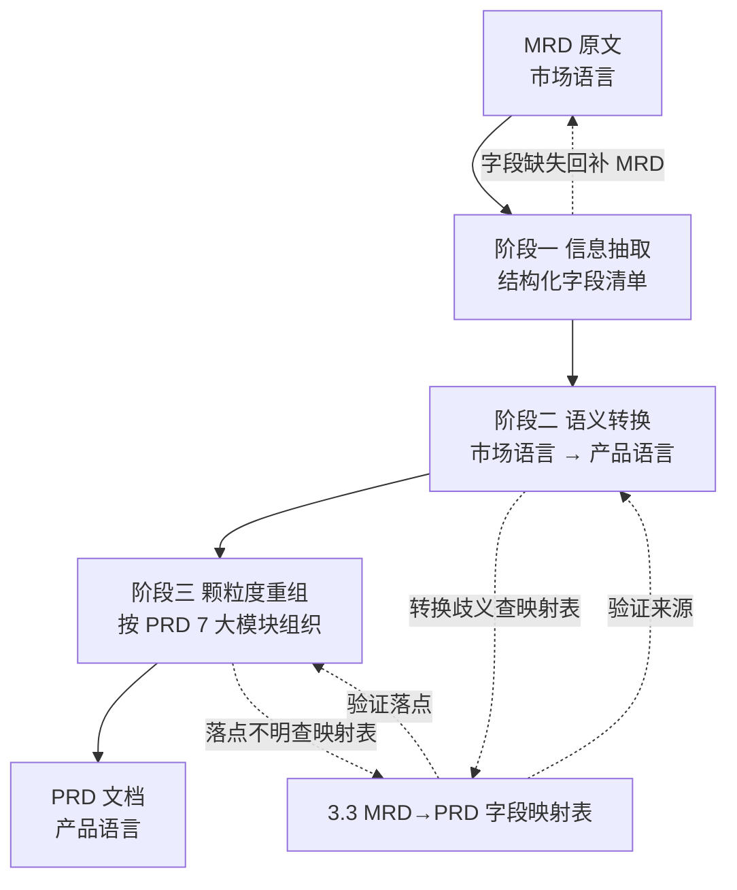

# MRD → PRD 推导过程

## 0. 推导总纲：策划视角的 MRD → PRD 本质

> 本章从产品策划视角回答一个问题：**手握一份 MRD，怎么一步一步把它"翻译"成一份可指导设计/开发/测试的 PRD？**

**两个关键认知**：

1. **MRD 回答"做什么/为什么"**（市场要什么、用户是谁、竞品如何做）
2. **PRD 回答"怎么做/做到什么程度"**（功能细节、交互规则、验收标准）

**推导本质是 3 件事**：

| 推导动作 | 含义 | 典型产物 |
|---|---|---|
| 抽取 | 从 MRD 文字中提取结构化信息 | 字段清单、量化数据、场景列表 |
| 转换 | 把"市场语言"翻译为"产品语言" | Persona 化、Story 化、规则化、指标化 |
| 重组 | 按 PRD 章节框架重新组织内容 | 产品概述/功能规格/用户流程/数据流/页面规格 7 大模块 |

**从抽象到具体的 4 个层级**：

```
层级 1：MRD 的"问题陈述"（如：高峰期大学生订餐难）
    ↓ 抽取 + Persona 化
层级 2：PRD 的"用户故事"（如：作为大学生，我想要 30 分钟内宿舍楼下取餐）
    ↓ 转换 + 规则化
层级 3：PRD 的"功能详述 + AC"（如：F-LOGISTICS_001 + 3 条 Given-When-Then）
    ↓ 重组 + 落地化
层级 4：PRD 的"页面规格"（如：P-LOGISTICS_TRACK 页面 7 段式描述）
```

**核心心法**：MRD 描述的是"市场要什么"，PRD 描述的是"产品怎么交付"。中间是策划的翻译工作，不是研发的评审工作。

## 1. 推导流程图（策划视角 · 三段式）



**三段式说明**：

- **阶段一（信息抽取）**：从 MRD 原文中按字段映射表（3.3）的"MRD 来源"列提取结构化信息（数据、字段、场景）
- **阶段二（语义转换）**：把"市场语言"翻译为"产品语言"——市场机会→愿景、痛点→价值主张、画像→Persona、场景→Story
- **阶段三（颗粒度重组）**：按 PRD 7 大模块（产品概述/功能规格/用户流程/数据流/页面规格）组织内容
- **回环机制**：每阶段如有歧义或缺漏，回退到前一阶段或查字段映射表

## 2. 策划推导四步法

| 步骤 | 动作 | 输入 | 产出 | 工具/参考 |
|---|---|---|---|---|
| 1. 信息抽取 | 从 MRD 7 大章节抽取结构化字段 | MRD 全文 | 字段清单（每章节 1 张表） | 字段映射表的"MRD 来源"列 |
| 2. 语义转换 | 把市场语言翻译为产品语言 | 字段清单 | Persona / Story / 价值主张 / 量化指标 | 字段映射表的"产物形态"列 |
| 3. 颗粒度重组 | 按 PRD 7 大模块归类所有产物 | 转换后产物 | PRD 章节草稿（按 PRD 树状结构） | PRD 树状结构 |
| 4. 一致性校验 | 用自查清单验证闭环 | PRD 草稿 | 完整 PRD | 自查 checklist + 字段映射双向追溯 |

## 3. MRD 字段 → PRD 字段映射规则（章节级 · 含产物形态）

> 本表是 MRD→PRD 推导的"目录级索引"。每行告诉你"MRD 的第 X 章第 Y 节内容，应该推到 PRD 的第 X 章第 Y 节，PRD 那一段具体写什么"。

| # | MRD 来源（章节级） | 推导动作 | PRD 落点（章节级） | 产物形态（PRD 那段写什么） |
|---|---|---|---|---|
| 1 | MRD 1.1 行业概况（PEST + 规模 + 增长率） | 提取关键数据 → 凝练为价值锚点 | PRD 1.3 愿景与目标（含北极星指标） | 1-2 句电梯演讲 + 3-5 个量化目标（含 1 个数据引用自 MRD 1.1） |
| 2 | MRD 1.2 市场问题与机会（核心痛点 + 机会点） | 把痛点翻译为"产品要解决什么" | PRD 1.5 核心价值主张 | 3-5 条价值主张，每条对应 1 个 MRD 痛点（1:1 对应） |
| 3 | MRD 1.3 市场细分与目标市场（TAM/SAM/SOM） | 取 SOM 作为"可获得市场" | PRD 1.3 北极星指标 + PRD 1.6 用户群体分析 | 北极星指标（数值化目标）+ 用户分层描述（核心/重要/边缘） |
| 4 | MRD 2.1 用户画像（决策者 + 使用者 双画像） | 双视角合并为 Persona + 场景化 | PRD 2.6 目标用户群体分析 + PRD 4.4 用户故事 | 1-3 个 Persona 卡片（含角色名/年龄/场景/KPI）+ N 条 Story（每条引用 Persona 名） |
| 5 | MRD 2.2 场景分析（典型场景） | 场景 → 业务节点 + 触点识别 | PRD 4.1 用户旅程地图 + PRD 4.2 业务流程图 | 7 列旅程地图（含 1 行 1 场景）+ Mermaid 流程图（每场景 1 张） |
| 6 | MRD 2.2 任务流程 + 痛点分析 | 痛点 → 功能 + AC | PRD 3.1 功能详述 + PRD 3.2 验收标准 | 5 列功能表（每痛点 1-3 条功能）+ Given-When-Then 格式 AC（每 P0 ≥3 条） |
| 7 | MRD 3.1-3.4 竞品分析（直接/间接/潜在 + SWOT） | 竞品能力 → 差异化决策 | PRD 2.7 市场需求与竞品简析 + PRD 3.x 差异化设计要点 | 简析段（1 段）+ 差异化决策表（列：竞品能力/我方决策/理由） |
| 8 | MRD 3.5 差异化优势 | 优势 → 价值主张支撑 | PRD 1.5 核心价值主张（与 #2 互补） | 价值主张第 2-3 条（从差异化优势倒推） |
| 9 | MRD 4.1 产品定位（一句话定义 + USP） | 定位 → 愿景关键词 | PRD 1.1 产品名称与定位 + PRD 1.3 愿景 | 一句话定位 + 1-2 句愿景陈述 |
| 10 | MRD 4.2 功能规划（KANO 分级表：必备/期望/兴奋/无差异/反向） | 5 类 → P0/P1/P2/不做 | PRD 3.1 功能详述的"优先级"列 | 5 列功能表中的优先级列：必备→P0、期望→P1、兴奋→P2、无差异/反向→剔除 |
| 11 | MRD 4.3 非功能需求（性能/安全/可靠性/可扩展性） | 类别 → 量化指标 | PRD 6.1-6.5 非功能需求（5 个子模块） | 5 个子模块，每个含 ≥1 个量化指标（如 P95 < 300ms） |
| 12 | MRD 4.4 实施路线（里程碑 + 风险评估表） | 阶段 → 迭代排期 + 风险 → 预案 | PRD 7.4 上线计划 + PRD 7.5 回滚预案 | 时间表（阶段/时间/成功标准）+ 预案清单（风险 N → 预案 N 1:1 对应） |
| 13 | MRD 5 商业模式（收入来源 + 定价策略 + 市场规模） | 收入/定价 → 业务规则 | PRD 3.1 业务规则 + PRD 7.7 运营计划 | 计费规则 + 状态机图 + 运营策略清单 |
| 14 | MRD 6 风险评估（含 Owner） | 风险 → 应对策略 + 监控 | PRD 7.5 回滚预案 + PRD 7.6 埋点方案 | 预案清单 + 监控指标 + 告警阈值 |

**核心使用方式**：写完 MRD 某个章节后，查本表找到对应行 → 按"产物形态"列写 PRD 对应章节内容；写 PRD 某节时，反向查本表确认"是否每条 MRD 来源都已覆盖"。

## 3.1 优先级推导漏斗（KANO → P0/P1/P2）

```
优先级推导规则
├── 必备（必做）= MRD P0 ∩ 关键路径 → PRD P0
├── 应做（应做）= MRD P1 ∪ MRD P0 非关键路径 → PRD P1
├── 可做（可选）= KANO 兴奋需求 + MRD P2 → PRD P2
└── 不做 = KANO 无差异需求 + KANO 反向需求 → 从 PRD 剔除
```

## 4. 字段映射表双向使用指南

> 字段映射表既是"MRD→PRD 推导索引"，也是"PRD→MRD 追溯索引"。本节说明两个使用方向。

#### 方向 A：MRD → PRD 正向推导（策划者写 PRD 时使用）

```
步骤 1：写完 MRD 某章节（如 MRD 2.2 场景分析）
步骤 2：查字段映射表，找到 MRD 2.2 对应的行（#5 #6）
步骤 3：按"产物形态"列写 PRD 对应章节内容
        - #5 写 PRD 4.1 旅程地图（每场景 1 行）
        - #6 写 PRD 3.1 功能表（每痛点 1-3 条功能）
步骤 4：写完后用自查清单第 4/5 条核查
```

#### 方向 B：PRD → MRD 逆向追溯（策划者自查 PRD 完整性时使用）

```
步骤 1：拿到 PRD 某章节（如 PRD 6.1 性能需求）
步骤 2：查字段映射表，找到 PRD 6.1 对应的行（#11）
步骤 3：核查 MRD 4.3 非功能需求是否包含此性能要求
步骤 4：若 MRD 4.3 未覆盖 → 标记 PRD 6.1 该指标"无来源" → 自查不通过
```

#### 两个方向的对比

| 维度 | 方向 A（正向推导） | 方向 B（逆向追溯） |
|---|---|---|
| 触发场景 | 写 PRD 时 | 自查 PRD 完整性时 |
| 起点 | MRD 章节 | PRD 章节 |
| 终点 | PRD 落点 | MRD 来源 |
| 主要工具 | 字段映射表（#1-#14） | 自查清单（10 条 checklist） |
| 失败处理 | 缺对应行 → 需补 MRD 章节 | 缺来源 → 标记 PRD 无依据 |
| 角色 | 策划者 | 策划者（自查） |

## 5. 策划阶段产物清单

> 策划四步法的每一步，都需要明确的输入材料和预期产出。下表按四步法组织。

| 步骤 | 输入材料 | 预期产出 | 缺失处理 |
|---|---|---|---|
| 1. 信息抽取 | MRD 全文（7 大章节齐全） | 字段清单（每章节 1 张表） | 缺章节 → 标记"待补"，禁止推测 |
| 2. 语义转换 | 字段清单 + 字段映射表 | Persona 卡片、Story 清单、价值主张、量化指标 | 转换无依据 → 回退到 MRD 原文 |
| 3. 颗粒度重组 | 转换后产物 + PRD 树状结构 | PRD 章节草稿（按 7 大模块） | 落点不明 → 查字段映射表 |
| 4. 一致性校验 | PRD 草稿 + 自查清单 | 完整 PRD | 未通过 → 回到步骤 1-3 补漏 |

## 6. 策划常见反模式

| # | 反模式 | 表现 | 修正 |
|---|---|---|---|
| 1 | MRD 阶段缺失 → PRD 凭空编造 | 跳过 MRD 直接写 PRD，凭市场感觉推功能 | 强制按步骤 1 从 MRD 抽取信息，禁止推测 |
| 2 | 推导不完整（画像未拆解到场景） | PRD 写出的功能无法还原真实用户行为 | 步骤 2 转换时，每条 Story 必须能溯源到"画像+场景+价值"三件套 |
| 3 | 抽取遗漏（MRD 章节未全覆盖） | 字段清单只覆盖 1-2 个 MRD 章节 | 步骤 1 完成后用字段映射表逐章节打勾 |
| 4 | 转换错位（市场语言未翻译） | PRD 直接写"解决用户痛点"等空话 | 步骤 2 必须产出具体 Persona/Story/价值主张，不是抽象描述 |
| 5 | 重组错位（PRD 章节放错位置） | 把"性能指标"放在"产品概述"里 | 步骤 3 按 PRD 树状结构严格执行，每个产物放对位置 |
| 6 | 颗粒度跳跃（Story 直接到页面） | 跳过"功能详述 + AC"环节直接画页面 | 步骤 3 严格按 4 个层级（问题→Story→功能→页面）逐级细化 |
| 7 | 优先级方法单一（只谈"重要紧急"） | 忽略 KANO 分类 + ICE/RICE 打分 | 步骤 2 转换时同步用 KANO 分类 → P0/P1/P2 |

## 7. 端到端转化案例（MRD 文本 → PRD 文本）

> 案例复用 MRD 文件中的"校园外卖配送 MRD"，保证内部一致性。展示一段 MRD 场景化故事如何被推导为 PRD 多个章节的具体内容。

### 输入：MRD 2.2 一段场景化故事

```markdown
## MRD 3.2 用户需求（场景1：用餐高峰）

小王是北京某高校的一名大一学生，下课都是在用餐高峰期间。
面对食堂的人山人海，小王想订外卖，可外卖到了还要跑到学校门口去取。
后来了解到某个外卖软件能够提供将外卖送到校内的服务，
下课后小王急忙拿出手机订了一份外卖，半小时后小王在宿舍楼下取到了外卖。
```

### 推导过程（5 步字段映射）

| 步骤 | 识别内容 | 落到 PRD 哪一节 | 推导依据（字段映射表） |
|---|---|---|---|
| 1 | 角色识别：小王 = 在校大学生 | PRD 2.6 + PRD 4.4 | #4 MRD 2.1 画像 → Persona + Story |
| 2 | 场景识别：用餐高峰 + 宿舍楼下 | PRD 4.1 旅程地图 1 行 | #5 MRD 2.2 场景 → 业务节点 + 触点 |
| 3 | 痛点识别：高峰期 + 跑校门口取餐 | PRD 4.1 痛点列 + PRD 3.1 功能 | #6 MRD 2.2 任务流程 + 痛点 → 功能 + AC |
| 4 | 解决方案：外卖送到校内 | PRD 3.1 功能 F-LOGISTICS_001 | #6 同上 |
| 5 | 价值识别：节省 30 分钟 + 在宿舍取 | PRD 4.4 Story 的"以便..."部分 | #4 同上 |

### 输出 1：PRD 4.1 用户旅程地图（1 行）

```markdown
| 阶段 | 用户目标 | 行为 | 触点（页面 ID） | 痛点 | 解决方案 | 体验 | 页面 ID |
|---|---|---|---|---|---|---|---|
| 午餐配送 | 节省高峰用餐时间 | 下课前 10 分钟下单，30 分钟后宿舍楼下取餐 | P-ORDER_CONFIRM → P-LOGISTICS_TRACK | 食堂排队 + 跑校门口 | 外卖校内配送 + 实时位置追踪 | 准时 + 省力 | P-LOGISTICS_TRACK |
```

### 输出 2：PRD 4.4 用户故事（1 条）

```markdown
**Story：宿舍楼下取外卖**
- 作为：一个在校大学生（Persona: 小王）
- 我想要：在下课前通过外卖软件下单，并选择"校内配送"
- 以便：30 分钟后在宿舍楼下取到外卖，节省高峰期食堂排队和跑校门口取餐的时间
```

### 输出 3：PRD 3.1 功能详述（1 条）

```markdown
| 功能 ID | 功能名称 | 功能描述 | 优先级 | 角色权限 |
|---|---|---|---|---|
| F-LOGISTICS_001 | 校内配送 | 用户下单时选择"校内配送"，配送员将外卖送至宿舍楼下指定地点 | P0 | 配送员：执行配送；学生：查看位置 |
```

### 输出 4：PRD 3.2 验收标准（3 条 AC）

```gherkin
AC1：
  Given 用户在 P-ORDER_CONFIRM 页面选择"校内配送"且宿舍地址已填写
  When  用户点击"提交订单"并支付成功
  Then  订单状态变为"待配送"，并在 P-LOGISTICS_TRACK 页面显示预计 30 分钟内送达

AC2：
  Given 配送员已接单并正在配送中
  When  配送员点击"已送达宿舍楼下"
  Then  学生在 10 秒内收到推送通知，且订单状态变为"待取餐"

AC3：
  Given 学生已收到"待取餐"通知
  When  学生点击 P-LOGISTICS_TRACK 页面的"确认取餐"
  Then  订单状态在 5 秒内变为"已完成"，并弹出评价入口
```

### 闭环验证

| 验证项 | MRD 来源 | PRD 落点 | 引用是否齐全 |
|---|---|---|---|
| 角色 | "小王 / 在校大学生" | Persona 卡片、Story 中"作为一个在校大学生" | ✅ |
| 场景 | "用餐高峰 / 宿舍楼下" | 旅程地图"午餐配送"、Story"宿舍楼下取外卖" | ✅ |
| 痛点 | "食堂人山人海 / 跑校门口" | 旅程地图痛点列、功能描述 | ✅ |
| 解决方案 | "外卖送到校内 / 30 分钟" | F-LOGISTICS_001、AC1 的"30 分钟内送达" | ✅ |
| 价值 | "半小时后在宿舍楼下取到外卖" | Story"以便..."部分 | ✅ |

**5 项内容全部从 MRD 一段故事推导到 PRD 4 个章节、7 处具体内容，无凭空补充。**

## 8. 推导自查 checklist（策划者交付前必查）

> 用途：策划者完成 PRD 草稿后、移交研发前逐条打勾。任一条未通过则不能移交，必须回到步骤 1-3 补漏。

| # | 检查项 | MRD 来源 | PRD 落点 | 验证方法 | 通过 |
|---|---|---|---|---|---|
| 1 | 行业关键数据是否进入愿景目标？ | MRD 1.1 | PRD 1.3 | 抽查 1.3 是否引用 ≥1 个 MRD 1.1 的量化数据 | ☐ |
| 2 | 痛点是否每条都有对应价值主张？ | MRD 1.2 | PRD 1.5 | MRD 痛点数 = PRD 价值主张数（1:1 对应） | ☐ |
| 3 | TAM/SAM/SOM 是否在北极星指标中体现？ | MRD 1.3 | PRD 1.3 | PRD 1.3 至少引用 1 个市场容量数字 | ☐ |
| 4 | Persona 是否在 User Story 中复用？ | MRD 2.1 | PRD 4.4 | 每条 Story 是否引用 Persona 名称 | ☐ |
| 5 | 场景是否拆到旅程地图？ | MRD 2.2 | PRD 4.1 | MRD 场景数 ≤ 旅程地图行数 | ☐ |
| 6 | 竞品分析是否落到差异化设计？ | MRD 3.1-3.5 | PRD 2.7 + PRD 3.x | 至少 3 条差异化决策 | ☐ |
| 7 | KANO 必备型是否全部标 P0？ | MRD 4.2 | PRD 3.1 优先级列 | MRD 必备数 = PRD P0 数 | ☐ |
| 8 | 非功能是否全部量化？ | MRD 4.3 | PRD 6.1-6.5 | 所有指标含数字 + 单位（如 P95 < 300ms） | ☐ |
| 9 | 风险是否都有回滚预案？ | MRD 6 | PRD 7.5 | MRD 风险 N → PRD 预案 N（1:1 对应） | ☐ |
| 10 | 实施路线是否覆盖所有里程碑？ | MRD 4.4 | PRD 7.4 | MRD 阶段 N → PRD 计划行 N | ☐ |

**使用方式**：

- 策划者完成 PRD 草稿后，自评 10 条
- 任一条未通过 → 回到步骤 1-3 补漏
- 10 条全通过 → PRD 可移交

## Sources

[1] 需求开发及管理规范 V3.0 — http://m.toutiao.com/group/7327261679849390602/ 【P1】
[5] CSDN - 深度解读 MRD DT2016（AI 翻译耳机案例）— https://blog.csdn.net/DT2016/article/details/149722041 【P1】
[6] KANO 模型（人人都是产品经理）— https://www.woshipm.com/pmd/583840.html 【P0】
[7] PRD 8 模块模板 + 工单导入案例 — http://m.toutiao.com/group/7606609132963103272/ 【P2】
[9] 校园外卖配送 MRD（人人都是产品经理）— https://www.woshipm.com/pmd/1819402.html 【P0】

---

**文件位置：** `d:\360MoveData\Users\admin\Desktop\AgiP\AGI-obsidian\MRD_PRD推导资料\3-推导过程.md`
