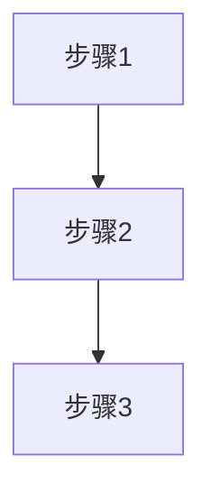

# 书籍知识提取器

将书籍PDF内容系统性地提取、分类、入库到知识框架。

## 工作流程

### Step 1: PDF类型检测

使用 `scripts/pdf_detector.py` 检测PDF类型：

```python
python scripts/pdf_detector.py <pdf_path>
```

**检测结果**：
- `text`：文字层可用 → 使用 pdfplumber 提取
- `scanned`：扫描件 → 使用 EasyOCR 识别

### Step 2: 目录结构分析

检查前20页内容，识别：
- 目录页位置
- 章节结构和标题
- 主要话题分布
- 序言、作者简介等前置内容

### Step 3: 分批次处理计划

使用 `scripts/batch_processor.py` 生成更新计划：

```python
python scripts/batch_processor.py <pdf_path> <total_pages> <pdf_type> 50
```

**输出更新计划**：
- 批次划分（每50页为一批）
- 每批次的页码范围
- 推荐提取方式
- 预估处理时间

**⚠️ 重要**：每批处理前必须先输出"更新计划"，用户确认后再执行。

### Step 4: 内容提取

根据PDF类型选择提取方式：

#### 文字层PDF（text）

使用 `scripts/pdf_extractor.py`：

```python
python scripts/pdf_extractor.py <pdf_path> <start_page> <end_page>
```

**提取内容**：
- 页面文字内容
- 图片位置和数量
- 页面尺寸信息

#### 扫描件PDF（scanned）

使用 `scripts/pdf_ocr.py`：

```python
python scripts/pdf_ocr.py <pdf_path> <start_page> <end_page>
```

**OCR配置**：
- 语言：中文简体（ch_sim）+ 英文（en）
- DPI：200（平衡质量和速度）
- 置信度阈值：>0.5

### Step 5: 知识分类映射

参考 `references/knowledge_classification.md` 将内容归类：

**分类规则**：
- 用户研究 → `01-产品通用知识/01-用户研究与需求调研/`
- 产品设计 → `01-产品通用知识/02-产品设计/`
- PRD撰写 → `01-产品通用知识/03-PRD文档撰写/`
- 业务知识 → `02-业务知识/`
- 思维方法 → `03-思维能力与方法论/`
- 管理知识 → `04-管理知识/`
- AI技术 → `05-AI通用知识/` 或 `07-AI新技术与工具/`
- AI实践 → `06-AI落地实践/`
- 商业增长 → `08-商业化与增长/`
- 软技能 → `09-软技能与职业成长/`

### Step 6: 内容结构化提取

参考 `references/extraction_requirements.md` 提取：

**必须提取**：
- ✅ 章节标题和小标题
- ✅ 关键概念定义
- ✅ 核心观点（编号列出）
- ✅ 方法论/框架/模型（完整步骤）

**重要提取**：
- 📊 重要案例（简化描述）
- 📊 数据/统计（关键数据）
- 📊 对比分析（表格形式）

**可视化内容**：
- 🖼️ 图片/图表 → 保存到 `assets/[章节名]/`
- 🖼️ 流程图 → 转换为Mermaid或保存原图
- 🖼️ 表格 → 转换为Markdown表格

### Step 7: 格式化输出

应用提取模板：

```markdown
# [章节标题]

## 核心概念

### [概念名称]
**定义**：[概念定义]

**要点**：
1. [要点1]
2. [要点2]
3. [要点3]

## 核心观点

1. **[观点1]**：[详细说明]
2. **[观点2]**：[详细说明]

## 方法论

### [方法名称]

**步骤**：
1. [步骤1]
2. [步骤2]
3. [步骤3]

**流程图**：


## 案例

### [案例名称]

**背景**：[案例背景]
**关键点**：[关键信息]
**结果**：[案例结果]

---
**来源**：[书籍名] 第X章
**日期**：YYYY-MM-DD
```

## 来源标注规范

每个入库文件底部必须标注：

```markdown
---
**来源**：[书籍名] 第X章
**提取日期**：YYYY-MM-DD
**提取工具**：book-knowledge-extractor
---
```

## 图片资源处理

### 保存位置
- 目录：对应知识域的 `assets/` 子目录
- 示例：`01-产品通用知识/assets/用户访谈/流程图_01.png`

### 命名规范
- 格式：`[章节名]_[图片类型]_[序号].png`
- 示例：`用户访谈_流程图_01.png`

### 引用方式
```markdown

```

## 执行示例

### 完整流程示例

```bash
# 1. 检测PDF类型
python scripts/pdf_detector.py book.pdf

# 2. 生成批次计划（假设300页）
python scripts/batch_processor.py book.pdf 300 text 50

# 3. 提取第一批（1-50页）
python scripts/pdf_extractor.py book.pdf 0 50

# 4. 用户确认后继续下一批
python scripts/pdf_extractor.py book.pdf 50 100
```

### 批次处理流程

1. **输出更新计划** → 用户确认
2. **提取第一批** → 分类入库
3. **提取第二批** → 分类入库
4. **...继续所有批次**

## 质量检查清单

### ✅ 内容完整性
- [ ] 章节标题完整
- [ ] 核心概念定义清晰
- [ ] 核心观点编号列出
- [ ] 方法论步骤完整
- [ ] 重要案例简化保留

### ✅ 格式规范性
- [ ] Markdown格式正确
- [ ] 标题层级清晰
- [ ] 图片路径正确
- [ ] 表格格式规范

### ✅ 来源标注
- [ ] 书籍名称标注
- [ ] 章节信息标注
- [ ] 提取日期标注

## 特殊情况处理

### 跨领域内容
- 创建多个文件，分别归类到不同目录
- 或在主文件中标注相关链接

### 新类型内容
- 先归类到最近的现有目录
- 后续根据需要创建新子目录

### 目录无序号
- 便于扩展新分类
- 保持灵活性

## 触发条件

当用户提供以下内容时自动触发：
- 书籍PDF文件路径
- 要求提取书籍知识的请求
- "从这本书提取知识"等类似表述

## 依赖工具

### 必需安装
```bash
pip install pdfplumber
pip install easyocr
pip install pdf2image
pip install Pillow
```

### EasyOCR语言包
首次运行会自动下载语言模型（约几百MB）

## 注意事项

1. **分批次处理**：避免一次性处理大量页面导致内存溢出
2. **用户确认**：每批次处理前必须获得用户确认
3. **图片保存**：重要图片必须保存，不可省略
4. **来源标注**：每个文件必须标注来源信息
5. **内容保真**：不得删减、过度概括原文核心内容