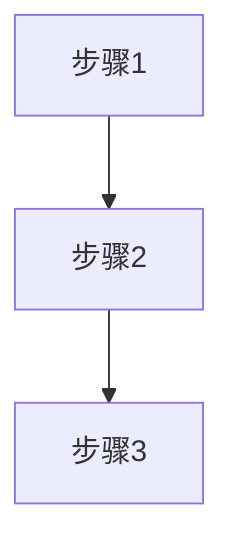

# 内容提取要求

## 提取内容清单

从书籍章节中提取以下关键内容：

### 1. 结构化内容

#### ✅ 必须提取
- **章节标题**：完整的章节标题和小标题
- **关键概念定义**：重要概念的清晰定义
- **核心观点**：编号列出（1、2、3...）
- **方法论/框架/模型**：完整的步骤或流程

#### 📊 重要内容
- **重要案例**：简化描述，保留关键信息
- **数据/统计**：关键数据和统计结果
- **对比分析**：对比表格或分析结论

#### 🖼️ 可视化内容
- **图片/图表**：必须保存，存放在 `assets/` 目录
- **流程图**：转换为Mermaid格式或保存原图
- **表格**：转换为Markdown表格

### 2. 提取格式模板

```markdown
# [章节标题]

## 核心概念

### [概念名称]
**定义**：[概念定义]

**要点**：
1. [要点1]
2. [要点2]
3. [要点3]

## 核心观点

1. **[观点1]**：[详细说明]
2. **[观点2]**：[详细说明]
3. **[观点3]**：[详细说明]

## 方法论/框架

### [方法名称]

**步骤**：
1. [步骤1]
2. [步骤2]
3. [步骤3]

**流程图**：


## 案例

### [案例名称]

**背景**：[案例背景]

**关键点**：
- [关键点1]
- [关键点2]

**结果**：[案例结果]

## 数据/表格

| 项目 | 说明 |
|------|------|
| [项目1] | [说明1] |
| [项目2] | [说明2] |

## 图片资源


---
**来源**：[书籍名] 第X章  
**日期**：YYYY-MM-DD
```

### 3. 内容简化原则

#### ✅ 保留
- 核心概念和定义（完整保留）
- 方法论步骤（完整保留）
- 关键数据和结论（完整保留）
- 重要案例的关键信息（简化但完整）

#### ⚠️ 简化
- 详细描述（提炼要点）
- 次要案例（保留关键信息）
- 背景介绍（精简到核心）

#### ❌ 删除
- 重复内容
- 过度详细的解释
- 与核心主题无关的内容

### 4. 图片处理规范

#### 图片保存
- **目录**：`assets/[章节名]/`
- **命名**：`[章节名]_[图片类型]_[序号].png`
- **示例**：`用户访谈_流程图_01.png`

#### 图片引用
```markdown

```

#### 图片说明
- 添加图片描述和说明
- 标注图片来源和用途

### 5. 质量检查清单

#### ✅ 内容完整性
- [ ] 章节标题完整
- [ ] 核心概念定义清晰
- [ ] 核心观点编号列出
- [ ] 方法论步骤完整
- [ ] 重要案例简化保留

#### ✅ 格式规范性
- [ ] Markdown格式正确
- [ ] 标题层级清晰
- [ ] 列表编号规范
- [ ] 图片路径正确
- [ ] 表格格式规范

#### ✅ 来源标注
- [ ] 书籍名称标注
- [ ] 章节信息标注
- [ ] 提取日期标注
- [ ] 图片来源标注

## 提取流程

### Step 1: 章节分析
- 识别章节结构
- 确定核心内容
- 标记重点段落

### Step 2: 内容提取
- 提取标题和概念
- 提取核心观点
- 提取方法论
- 提取案例和数据

### Step 3: 图片处理
- 保存重要图片
- 转换流程图
- 创建图片目录

### Step 4: 格式整理
- 应用Markdown模板
- 检查格式规范
- 添加来源标注

### Step 5: 质量检查
- 检查内容完整性
- 检查格式规范性
- 检查来源标注

## 特殊内容处理

### 1. 代码示例
- 使用代码块格式
- 标注语言类型
- 保留关键代码

### 2. 数学公式
- 使用LaTeX格式
- 标注公式含义
- 提供文字说明

### 3. 引用内容
- 标注引用来源
- 保留关键引用
- 说明引用意义

### 4. 脚注和注释
- 转换为正文说明
- 保留重要注释
- 删除次要注释

## 输出文件规范

### 文件命名
- **格式**：`[章节主题].md`
- **示例**：`用户访谈方法.md`

### 文件位置
- **目录**：对应知识域目录
- **示例**：`01-产品通用知识/01-用户研究与需求调研/用户访谈方法.md`

### 文件头部
```markdown
---
tags:
  - [知识域]
  - [主题]
created: YYYY-MM-DD
updated: YYYY-MM-DD
---

# [章节标题]
```

### 文件尾部
```markdown
---
**来源**：[书籍名] 第X章  
**提取日期**：YYYY-MM-DD  
**提取工具**：book-knowledge-extractor
---
```