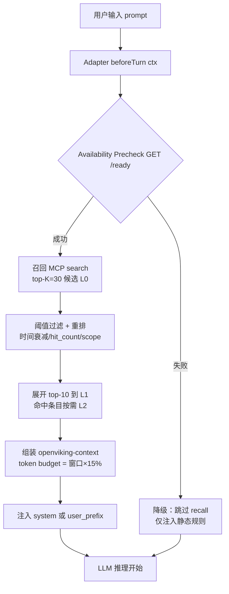

# 企业级 Agent 通用记忆系统调研 v2

> 版本：v2 完整版（Ch.1-6）
> 范围：Ch.1-6 已完成深度调研（基于 Claude Code / Codex / Hermes / OpenClaw 四大 Agent 近 12 个月一手实践反推）；Ch.7「其他工程维度」及附录后续调研
> 参照系：全文贯穿 5D 维度（分层 / 写入 / 检索 / 命名空间与身份 / 治理与观测）


## 一、背景与目标

### 1.1 业务背景

- 公司规模：互联网公司约 2000 人
- 云 Agent 平台：在云端统一部署各类 Agent（Claude Code、OpenClaw、Hermes，未来会增加）
- Agent 交付形态：**每个部门、每个人拥有独立的 Agent 实例，以 Docker 容器部署**
- 存储形态：不同 Agent 实例拥有**独立的存储空间**（天然租户隔离，非本次记忆层重点）

### 1.2 记忆系统目标

- **短期记忆**：单会话内保留必要上下文，避免频繁重复解释
- **长期记忆**：跨会话沉淀用户偏好、事件、经验、技能与资源
- **可复用**：同一 Agent 的多次会话之间，记忆能自动召回
- **降本增效**：通过分层加载与摘要，显著降低 token 消耗（对标官方 LoCoMo 场景，Claude Code + OpenViking token 降幅约 60% 数量级；私有场景需目标机型实测复核）

### 1.3 非目标（本期不解决）

- 跨 Agent 实例的记忆共享（每个 Docker 独立，不做打通）
- 跨用户的团队级共享知识库（未来独立立项）
- OpenViking 层的多租户 / RBAC / API Key 治理（沿用 OpenViking 原生 APIKeyManager，Docker 天然隔离，暂不下沉到记忆层）


## 二、需求与约束

> 本章需求由步骤 1 调研的 Claude Code / Codex / Hermes / OpenClaw 四大 Agent 的一手记忆最佳实践反推得出。每条需求都附「共性证据」（≥ 2 Agent 支持）或标注「单点参考」；来源 URL 集中放到附录 C（本版本 v2 附录 C 未完成，关键 URL 已内联在证据列；完整版待 Ch.7 一并发布）。

### 2.1 功能需求（基于 4 Agent 共性）

| # | 需求 | 说明 | 共性证据 |
| --- | --- | --- | --- |
| F1 | **静态项目规则文件** | 类 `CLAUDE.md`/`AGENTS.md`/`MEMORY.md` 的 Markdown 规则文件，会话启动时自动注入 | Claude / Codex / Hermes / OpenClaw 四者均有 |
| F2 | **短期会话记忆** | 单会话 turn/message 级 append，可 resume/fork | Claude `*.jsonl` / Codex `sessions/*.jsonl` / OpenClaw `viking://user/sessions/*` / Hermes rollout |
| F3 | **长期跨会话记忆** | 用户偏好、事件、经验、技能沉淀 | Claude Memory Tool / Codex `~/.codex/memories/` / Hermes MEMORY.md+Provider / OpenClaw `viking://user/...` |
| F4 | **事件驱动自动写入** | Session/Turn/Compact/End 事件挂钩自动 append 与抽取 | Claude Hooks（10+ 事件） / OpenClaw ContextEngine（assemble/afterTurn/compact 等）|
| F5 | **阈值触发的异步抽取** | token 阈值或闲置时长触发后台记忆抽取，不阻塞 turn | Codex `min_rollout_idle_hours=6h` / OpenClaw `commit(wait=false)` / Hermes `flush_min_turns=6` |
| F6 | **同步归档边界** | `/compact` 等强制场景使用同步提交，保证一致性 | Codex `/compact` / OpenClaw `commit(wait=true)` |
| F7 | **自动召回并注入** | 用户提问时自动检索相关记忆并前置注入 | Claude CLAUDE.md 启动注入 / Codex AGENTS.md 首轮注入 / Hermes MEMORY.md 每轮注入 / OpenClaw `<openviking-context>` 注入 |
| F8 | **主动写入工具（MCP）** | Agent 可显式落库关键信息 | Claude Memory Tool / OpenClaw `memory_store` |
| F9 | **主动检索工具（MCP）** | Agent 可显式搜索/读取历史记忆 | Claude MCP / OpenClaw MCP 9 工具（search/read/list/grep/glob/…）|
| F10 | **资源与技能接入** | 支持导入文档 / URL / Git 仓库 / 技能包 | OpenClaw `add_resource`/`add_skill` / Codex Skills / Hermes Skills（agentskills.io）/ Claude Skills |
| F11 | **子代理隔离** | 子代理独立 context 与身份，避免污染主对话 | Claude `.claude/agents/` 独立 context / OpenClaw `prepareSubagentSpawn` |
| F12 | **归档与回滚** | 快照/归档 + 可反查原文 | Claude `/rewind`(`checkpoint`) / OpenClaw `ov_archive_expand` |
| F13 | **显式遗忘** | 支持按 URI/语义/时间自动+手动删除 | OpenClaw `memory_forget` / Codex `max_rollout_age_days` / Claude Memory Tool（delete/rename；注：Claude Context Editing 属上下文窗口裁剪，不等同长期记忆删除） |
| F14 | **检索轨迹可视化** | 可观察召回命中原因与轨迹 | OpenClaw `ov_recall_trace` + Web Console / Hermes observer-grade hooks |
| F15 | **可插拔外部记忆后端** | Provider/插件槽抽象，允许更换后端 | Hermes 8 Provider（单激活）/ OpenClaw `plugins.slots.contextEngine` |

**单点参考需求**（仅 1 家提及，仅作参考）：屏幕上下文增强（Codex Chronicle）、LLM 决策 Stop hook（Claude）、GOAP scratch_pad 计划（Hermes-3）。

### 2.2 非功能需求

| 维度 | 约束 | 依据 |
| --- | --- | --- |
| **多层命名空间优先级** | 至少 4 层：Enterprise/CLI > Local > Project > User | Claude 5 级 precedence / Codex 6 级 precedence |
| **Token 预算可观测** | 提供实时 token 用量视图与预算裁剪 | Claude `/context` / Codex `project_doc_max_bytes=32KiB` / Hermes 字符上限 / OpenClaw token budget |
| **文件系统范式** | 记忆载体以 Markdown 为主，方便审阅 | 四大 Agent 静态层均为 Markdown |
| **注入位可控** | 至少支持 system prompt / hook stdout / tool output / user prefix 四类 | Claude 官方分类；OpenClaw 前置注入 user message |
| **隔离性** | 每 Docker 独立 Agent+RAG，天然租户隔离，无需服务侧多租户 | 用户约束 |
| **NF8 延迟口径注** | 500ms 指 OpenViking 服务侧「召回接口」P95；端到端含 LLM 推理另计，见 §4.5.4 | 澄清约束 |
| **部署形态** | 云端 Docker，每实例独立存储卷 | 用户约束 |
| **Agent 兼容性** | 至少同时支持 Claude Code / Codex / Hermes / OpenClaw，未来 Agent 可扩展 | 用户约束 |
| **性能** | 单次自动召回 P95 < 500ms | OpenViking 官方 LoCoMo 数据 27.9–38.8s / query 为端到端含 LLM 推理；纯召回可对标 <500ms（合理推算，需实测验证） |
| **成本** | 显著降低 token（对标 OpenViking LoCoMo 场景，Claude Code + OpenViking Total Token 降幅约 60% 数量级，私有场景需实测） | OpenViking README LoCoMo 表 |
| **可观测** | 覆盖会话/召回/抽取/Provider 四类事件；含 Prometheus 指标 | OpenClaw / OpenViking Grafana metrics / Codex OTel |
| **遗忘策略** | 时间衰减 + 使用度 + 手动三通道 | Codex 参数体系 / OpenClaw memory_forget |
| **隐私合规** | 支持 secret redact；Consumer/EEA/UK/CH 显式启用；本地日志不含 apiKey | Codex / OpenViking apiKey header |

### 2.3 约束与前提

- **后端选型**：OpenViking（主仓 **AGPL-3.0**）已完成前置调研（《智能体集成 OpenViking 报告》）
- **模型依赖**：需自备 **VLM + Embedding** 模型（Doubao / OpenAI / GLM / Kimi / Codex OAuth 均可，见 OpenViking README）
- **部署模式**：OpenViking 以**远程 HTTP 服务**部署，Agent 侧作为 HTTP + MCP Client；每 Docker 内独立
- **合规**：AGPL-3.0「网络交付即分发」条款需法务确认边界；Consumer 场景默认不做训练回传
- **不做**：跨 Docker 记忆共享、跨用户团队级共享知识库、OpenViking 层多租户 / RBAC（Docker 天然隔离）
- **边界说明**：同一 Docker 内**允许**多 Agent 共享同一 OpenViking 实例，通过 `peer_role/peer_prefix/user_id` 三键做逻辑隔离；跨 Docker 之间**不做**任何记忆同步或联邦

### 2.4 5D 需求维度速查表（贯穿 Ch.3 / Ch.4 / Ch.5）

| 维度 | 关键需求 |
| --- | --- |
| **D1 记忆分层** | F1 静态规则 / F2 短期 / F3 长期 / F12 归档 + L0/L1/L2 |
| **D2 写入路径** | F4 事件驱动 / F5 阈值异步 / F6 同步归档 / F8 主动写入 + 结构化 schema |
| **D3 检索路径** | F7 自动召回注入 / F9 主动检索 / F10 资源接入 + token 预算 + 重排 + 可观测 |
| **D4 命名空间与身份** | 4 层 precedence / F11 子代理隔离 / Session ID 派生 / X-*-User/Peer/Actor 头 |
| **D5 治理与观测** | F13 遗忘 / F14 检索轨迹 / F15 可插拔 + 隐私 / 并发 / 许可证 |

后续 Ch.3 以此 5D 表为参照系评估 OpenViking 满足度；Ch.4 以此定义模型；Ch.5 以此设计模块。


## 三、OpenViking 能力评估

> 参照系：Ch.2 §2.4 的 **5D 需求维度速查表**。逐维度评估 OpenViking 能力，给出「满足 / 部分满足 / 不满足」+ 一手证据 + 缺口。

### 3.1 评估参照系

沿用 Ch.2 5D：D1 分层 / D2 写入 / D3 检索 / D4 命名空间与身份 / D5 治理与观测。评估口径三档：

- ✅ **满足**：有官方文档或源码明确支持
- ⚠️ **部分满足**：能力存在但需要配置/裁剪/自研补强（在下文表格中，"待实测"另标为 ⚠️ 待实测，与 ⚠️ 部分满足区分）
- ❌ **不满足**：需自研或选择跳过

### 3.2 OpenViking 能力全景（按 5D 口径）

#### D1 分层

| 能力 | 说明 | 一手证据 |
| --- | --- | --- |
| L0/L1/L2 三层加载 | `.abstract.md` / `.overview.md` / 原文；按需展开 | OpenViking README「Tiered Context Loading」段（`github.com/volcengine/OpenViking` README） |
| 文件系统范式命名空间 | `viking://user/*`、`viking://agent/*`（已 deprecated）、`viking://resources/*`、`viking://user/sessions/<id>`、`viking://agent/skills/*` | OpenViking README「Filesystem Management Paradigm」+ openclaw-plugin README |
| Session 增量 append | afterTurn 只切片新增 messages | openclaw-plugin README「afterTurn」段 |
| Archive 归档 | `latest_archive_overview` + `pre_archive_abstracts`；`ov_archive_expand` 反查原文 | openclaw-plugin README「compact」段 |
| Working Memory v2 | 服务端 LLM Function Calling 结构化产出 7 段 | 《智能体集成 OpenViking 报告》 |

#### D2 写入

| 能力 | 说明 | 一手证据 |
| --- | --- | --- |
| 事件生命周期 | Claude Code 侧 SessionStart/UserPromptSubmit/Stop/SubagentStop/PreCompact/SessionEnd；OpenClaw 侧 assemble/afterTurn/compact | claude-code-memory-plugin `hooks.json` + openclaw-plugin README |
| 阈值异步 commit | `pending_tokens > commitTokenThresholdRatio × tokenBudget` → `commit(wait=false)`（比值官方无公开默认值，本文按经验推算 0.6） | openclaw-plugin README「afterTurn」段 |
| 同步 commit | `/compact` / `memory_store` 走 `commit(wait=true)` | openclaw-plugin README「compact」段 |
| 主动写入工具 | `store` / `memory_store` / `add_resource` / `add_skill` | openclaw-plugin README「Tools」段 |
| 客户端过滤 | 剥离 `<openviking-context>` / `<relevant-memories>` 防回环 | openclaw-plugin README「afterTurn」段 |
| Phase 1/2 抽取 | 侧写 + 一致化；Working Memory v2 七段 KEEP/UPDATE/APPEND | 《智能体集成 OpenViking 报告》 |

#### D3 检索

| 能力 | 说明 | 一手证据 |
| --- | --- | --- |
| 自动召回 | `assemble()` transformContext 分支并行召回 user + agent（`recallTargetTypes` 可配） | openclaw-plugin README「assemble Recall Flow」 |
| 主动检索工具 | `search` / `read` / `list` / `grep` / `glob` / `memory_recall` / `ov_search` / `ov_read` / `ov_multi_read` | openclaw-plugin README「Tools」+ 前置报告 |
| 目录递归检索 | 结合目录定位与语义搜索 | OpenViking README「Directory Recursive Retrieval」 |
| 重排 | 分数 + 叶子（level==2）+ preference + event + 词法重叠 | openclaw-plugin README「reranking logic」 |
| Token 预算裁剪 | `<openviking-context>` 块受 token budget 约束 | openclaw-plugin README |
| 归档展开 | `ov_archive_expand` 按需展开归档原文 | openclaw-plugin README |
| 检索轨迹可视化 | `ov_recall_trace` + Web Console + `ov tui` | openclaw-plugin README「Operator and Debugging Surfaces」 |

#### D4 命名空间与身份

| 能力 | 说明 | 一手证据 |
| --- | --- | --- |
| Canonical namespace policy | PR #1356：`viking://user/memories` → `viking://user/<user_id>/agent/<agent_id>/memories` 等展开 | openclaw-plugin README「Canonical namespace policy」 |
| peer_role / peer_prefix | `peer_role` = `none`/`assistant`/`person`；`X-OpenViking-Actor-Peer` header | openclaw-plugin README「Identity and Routing」 |
| Session ID 派生 | UUID 复用 / sessionKey 派生 / SHA-256 fallback | openclaw-plugin README |
| 身份 header | `X-OpenViking-Account` / `X-OpenViking-User` / `X-OpenViking-Actor-Peer` / `X-API-Key` | openclaw-plugin README |
| 子 Agent 分段 | 通过 session id 派生保证边界；OpenClaw prepareSubagentSpawn 可挂接 | openclaw-plugin README |
| MCP 通道 | Native MCP `/mcp` 端点 + 9 工具 | claude-code-memory-plugin PR #1615 |

#### D5 治理与观测

| 能力 | 说明 | 一手证据 |
| --- | --- | --- |
| 观测面板 | Web Console（`openviking.console.bootstrap`）+ `ov tui` | openclaw-plugin README |
| Metrics | Prometheus + Grafana feedback metrics（PR #2037） | OpenViking `examples/grafana` |
| 健康检查 | `/ready` 检查 AGFS / VectorDB / APIKeyManager（PR #1884） | OpenViking `deploy/helm` |
| 遗忘 | `memory_forget`（按 URI 或 search+delete 唯一强匹配） | openclaw-plugin README「memory_forget」 |
| 状态命令 | `openclaw openviking status --json`（configured / slotActive / health.ok / keyProbe.keyType） | openclaw-plugin INSTALL.md |
| 端到端健康检查 | `ov-healthcheck.py`（真流 → capture → commit → archive → extract） | openclaw-plugin `health_check_tools/` |
| Log 落地 | `~/.openviking/data/log/openviking.log` | openclaw-plugin README |
| License | 主仓 AGPL-3.0 | volcengine/OpenViking LICENSE |
| Memory v2 已成主线 | `refactor(memory): remove legacy memory v1 (#2264)` | OpenViking docs |

### 3.3 需求 × 能力满足度矩阵

> 说明：本矩阵包含 F1-F15（15 项）+ NF1-NF12（12 项）合计 27 项需求，其中 **NF5「隔离性」与 NF6「Docker 部署形态」合并为一行**（共享同一能力证据），故表格实际展示为 25 行。

| # | 需求 | OpenViking 能力落点 | 满足度 | 证据/备注 |
| --- | --- | --- | --- | --- |
| F1 | 静态项目规则文件 | 无对应；但 `add_resource` 可导入 Markdown | ⚠️ 部分满足 | 需在通用系统层做「project rule 文件 → resource 映射」适配 |
| F2 | 短期会话记忆 | `viking://user/sessions/<id>` + afterTurn 增量 | ✅ | openclaw-plugin README |
| F3 | 长期跨会话记忆 | `viking://user/*` + Phase 2 抽取 | ✅ | 《OpenViking 报告》七段抽取 |
| F4 | 事件驱动自动写入 | Claude Code Hooks / OpenClaw ContextEngine 生命周期 | ✅ | hooks.json / plugin README |
| F5 | 阈值触发的异步抽取 | `commitTokenThresholdRatio` + `commit(wait=false)` | ✅ | plugin README |
| F6 | 同步归档边界 | `/compact` → `commit(wait=true)` | ✅ | plugin README |
| F7 | 自动召回并注入 | `assemble transformContext` + `<openviking-context>` 前置注入 user message | ✅ | plugin README |
| F8 | 主动写入工具 | `store` / `memory_store` / `add_resource` | ✅ | Native MCP 9 工具 |
| F9 | 主动检索工具 | `search`/`read`/`list`/`grep`/`glob`/`memory_recall` | ✅ | Native MCP 9 工具 |
| F10 | 资源与技能接入 | `add_resource` 支持本地/URL/Git/目录/zip；`add_skill` | ✅ | plugin README「Resource and Skill Import」 |
| F11 | 子代理隔离 | sessionId/sessionKey 派生 + `peer_id` | ⚠️ 部分满足 | OpenClaw prepareSubagentSpawn/onSubagentEnd 契约在 openviking-plugin 当前 README 未显式使用（公开资料未涵盖），需在适配层显式派生 sub-session |
| F12 | 归档与回滚 | `ov_archive_expand` 展开归档；无「代码文件回滚」等价物 | ⚠️ 部分满足 | Claude `/rewind` 语义未覆盖，需通用系统或 Agent 侧自持 |
| F13 | 显式遗忘 | `memory_forget`；无自动时间/使用度过期 | ⚠️ 部分满足 | 时间衰减/使用度需在通用系统层实现（对标 Codex `max_unused_days`） |
| F14 | 检索轨迹可视化 | `ov_recall_trace` + Web Console | ✅ | plugin README |
| F15 | 可插拔外部记忆后端 | 本身即后端；但 Agent 侧 Provider 抽象层未强制 | ⚠️ 部分满足 | 通用系统需自研 Adapter 层，让 Agent 感知不到 OpenViking 具体位置 |
| NF1 | 多层命名空间 | user/agent/session/resources/archive；无 Enterprise/Project/Local 显式层次 | ⚠️ 部分满足 | 通用系统层需将 4 Agent 的 project/user/enterprise scope 映射到 OpenViking URI 前缀 |
| NF2 | Token 预算可观测 | `<openviking-context>` token budget 裁剪 | ✅ | plugin README |
| NF3 | 文件系统范式 | 官方即以此为核心卖点 | ✅ | OpenViking README |
| NF4 | 注入位可控 | 支持前置注入 user message；不支持 append synthetic user message（已明确剔除） | ⚠️ 部分满足 | 若 Agent 需要注入 system prompt 头部，需 Adapter 层做转换 |
| NF5-6 | 隔离性 / Docker | 独立 workspace 目录（`~/.openviking/`），HTTP 服务化 | ✅ | OpenViking README + Helm |
| NF7 | Agent 兼容性 | 官方 Plugin：Claude Code、Codex（`examples/codex-memory-plugin`）、OpenClaw；Hermes 通过 Provider 机制间接对接 | ⚠️ 部分满足 | 仓库内独立命名 `hermes-plugin` 目录未见（公开资料未涵盖）；需通过 Native MCP + Hermes 的 Provider 抽象自研粘合层 |
| NF8 | 性能 P95 < 500ms | 未官方公开纯召回 P95；LoCoMo 端到端 27.9-38.8s / query 含 LLM | ⚠️ 待实测 | 需在 Docker 目标机型压测 |
| NF9 | 成本降幅约 60% 数量级 | LoCoMo 场景 Claude Code 侧 token 降幅约 60%（数量级参考，私有场景需实测） | ✅ | OpenViking README |
| NF10 | 可观测 4 类事件 | Grafana metrics + `/ready` + Prometheus | ✅ | OpenViking `examples/grafana` + `deploy/helm` |
| NF11 | 遗忘 3 通道 | 手动 `memory_forget`；时间/使用度需自研 | ⚠️ 部分满足 | 见 F13 |
| NF12 | 隐私合规 | apiKey 不落日志；Consumer 层合规策略由上游模型决定 | ⚠️ 部分满足 | AGPL-3.0「网络交付即分发」需法务确认 |

**满足度小结**：25 行（= F1-F15 15 项 + NF1-NF12 12 项 − NF5-6 合并 2 项）中，✅ 15 项，⚠️ 10 项，❌ 0 项（❌ 类为 0 是**当前已知能力**的中性陈述；显性缺口另见 §3.4 G1-G5 单列，避免误读为"OpenViking 已覆盖全部诉求"）。所有缺口都可通过**通用记忆系统的 Adapter/治理层**补齐，不影响以 OpenViking 为后端的技术路线。

### 3.4 潜在缺口与验证清单

| # | 缺口 | 验证方式 |
| --- | --- | --- |
| G1 | Hermes 无独立 hermes-plugin | 提 issue 到 `volcengine/OpenViking` 询问计划；或直接以 Native MCP + Hermes Provider 抽象自研粘合层 |
| G2 | Docker 内存储持久化与备份 | 读 `deploy/helm/values.yaml`；跑最小样例验证 `~/.openviking/data/` 挂载 PVC |
| G3 | 模型并发上限（2000 人规模） | 读 `ov.conf` 的 `vlm.max_concurrent`（默认 100）、`embedding.max_concurrent`（默认 10）；跑压测 |
| G4 | AGPL-3.0 合规 | 法务评估「网络交付即分发」条款，尤其是对外服务边界 |
| G5 | 时间衰减/使用度自动遗忘 | 通用系统 Adapter 层自研；对标 Codex `max_unused_days=30` |
| G6 | 子代理契约完整性 | 读 openclaw-plugin `prepareSubagentSpawn` 源码；缺项走 Adapter 显式派生 sub-session |
| G7 | 纯召回 P95 延迟 | 在目标 Docker 机型跑基准压测 |
| G8 | Claude `/rewind` 类快照回滚 | 与 Claude Code 侧本地 checkpoint 组合使用；OpenViking 层不承担 |

### 3.5 与旧版 Ch.3 的差异（编辑元信息 · 不影响正文阅读，未来将迁移到附录 E · 变更记录）

- 旧版：能力清单是随机顺序，「满足度」列只标 ✅ 无证据
- 新版：按 5D 参照系重排；每行证据落到 URL 段落级；15 项 ✅ + 10 项 ⚠️ 的显性缺口清单
- 新增：G1-G8 8 项验证清单，替代旧版模糊的「待验证」表述

---

## 四、【重点】记忆模型设计——定义记忆规则

> 定义一条记忆长什么样、放在哪、如何进出。产出 L0/L1/L2 分层、`viking://` 命名空间、身份路由、七段写入 schema、检索重排、遗忘策略、统一 JSON。为 Ch.5 模块与 Ch.6 链路提供数据规则。

### 4.1 分层：L0 / L1 / L2 + 归档四层

| 层 | 载体 | 加载策略 | Token 预算参考 | 典型内容 |
| --- | --- | --- | --- | --- |
| L0（摘要） | `.abstract.md`（一句话摘要） | 默认加载；全部候选一次载入 | 单条 ~50 tokens | preferences / events 的 one-liner |
| L1（概览） | `.overview.md`（段落级） | 检索命中时加载 | 单条 ~200-500 tokens | 事件展开、案例摘要 |
| L2（原文） | 完整记忆条目 / 归档消息序列 | 显式展开（`read`/`ov_archive_expand`） | 无固定上限 | 原始对话、完整方案 |
| Archive（归档） | `latest_archive_overview` + `pre_archive_abstracts` | `assemble preflight` 时读回 | 受 `<openviking-context>` token budget | 已 compact 的会话摘要 |

**默认加载策略**（合理推算，需根据实测调整）：

- 单次 recall 拉 L0 候选 Top-K=30 → 阈值过滤 → 重排后取 Top-10 展开到 L1 → 命中特定条目按需展开 L2
- `<openviking-context>` token budget 建议：模型上下文窗口的 10-20%（默认 15%）
- 允许模型主动调 `ov_archive_expand(archive_id)` 展开归档 L2

**与 4 Agent 对齐**：

| 层 | Claude Code | Codex | Hermes | OpenClaw |
| --- | --- | --- | --- | --- |
| 摘要 | CLAUDE.md 摘要段 | AGENTS.md 顶部 overview | MEMORY.md 一行式 | `.abstract.md` |
| 概览 | Skills 描述 | AGENTS.md 分段 | USER.md 段落 | `.overview.md` |
| 原文 | Memory Tool `/memories/*` | `~/.codex/memories/*` | 会话 rollout | 原文 |
| 归档 | `/rewind` | `/compact` 摘要 | 无原生归档 | archive overview |

**我方增强**：跨 4 Agent 的统一 L0/L1/L2 三层协议 + 归档四层，Claude 的 `/rewind`（快照回滚）由 Agent 侧本地文件系统承担，不进入 OpenViking。

---

### 4.2 命名空间：`viking://` 完整枚举

| 命名空间 | 内容 | 生命周期 | 隔离粒度 | 备注 |
| --- | --- | --- | --- | --- |
| `viking://user/<user_id>/memories` | 用户通用记忆 | 长期 | user | Canonical 展开（PR #1356） |
| `viking://user/<user_id>/preferences` | 用户偏好 | 长期 | user | preference 型 |
| `viking://user/<user_id>/events` | 用户事件时间线 | 长期 | user | event 型 |
| `viking://user/<user_id>/cases` | 经验案例 | 长期 | user | case 型 |
| `viking://user/<user_id>/skills` | 用户级技能 | 长期 | user | 迁移自 `agent/skills` |
| `viking://user/<user_id>/sessions/<session_id>` | 会话轨迹 | 会话 + 归档保留 | session | afterTurn 增量 |
| `viking://user/<user_id>/agent/<agent_id>/memories` | 隔离级记忆 | 长期 | user × agent | `isolateUserScopeByAgent=true`（默认开启）时 |
| `viking://resources/<res_id>` | 导入外部资源 | 长期 | tenant | 文档/URL/Git |
| `viking://archive/<archive_id>` | 会话归档 | 长期，只增 | session 派生 | `ov_archive_expand` 可展开 |

**弃用**：`viking://agent/memories` 已 deprecated，写入/检索统一走 `viking://user/*`，服务端按 tenant + actor-peer 解析（openclaw-plugin README 明确说明）。

**Enterprise / Project / User 三层规则映射**（Adapter 层负责）：

> 说明：以下三层是 **Agent 侧规则文件到 `viking://resources/*` 的语义映射**，并非重新定义 §2.2 NF1 的命名空间 precedence 层级（那里是 Enterprise/CLI > Local > Project > User 4 层优先级），两者维度不同。

| Agent 侧原生层 | 通用系统映射 |
| --- | --- |
| Claude Enterprise CLAUDE.md | `viking://resources/enterprise/CLAUDE.md`（只读） |
| Claude Project `./CLAUDE.md` | `viking://resources/project/<repo>/CLAUDE.md` |
| Claude User `~/.claude/CLAUDE.md` | `viking://user/<user_id>/rules/CLAUDE.md` |
| Codex Global AGENTS.md | `viking://user/<user_id>/rules/AGENTS.md` |
| Codex Project AGENTS.md | `viking://resources/project/<repo>/AGENTS.md` |
| Hermes MEMORY.md/USER.md | `viking://user/<user_id>/rules/HERMES_MEMORY.md` |

---

### 4.3 会话与身份路由

| 字段 | 生成规则 | 用途 |
| --- | --- | --- |
| `session_id` | Agent 侧原生 UUID 若可用则直接复用；否则 `<agent>-<sha256(agent_native_id)>` | OpenViking `ovSessionId` |
| `peer_role` | 新装默认 `assistant`；`person`/`none` 视场景 | `X-OpenViking-Actor-Peer` 头 |
| `peer_prefix` | 由通用系统 Adapter 层配置（如 `cc`/`cx`/`hm`/`oc` 分别代表 Claude Code/Codex/Hermes/OpenClaw） | `<peer_prefix>_<sessionAgent>` |
| `user_id` | Docker 内单用户，直接注入 `X-OpenViking-User` | 用户维度隔离 |
| `account_id` | Tenant 级（部门/组织），注入 `X-OpenViking-Account` | 组织维度隔离 |
| `agent_id` | Agent 类型 + 实例，用于 `viking://user/<u>/agent/<a>/*` | Agent 维度隔离（可选） |
| `isolate_user_scope_by_agent` | 通用系统统一为 `true` | 保证不同 Agent 的记忆互不污染 |

**Session ID 派生规则**：

- **输入**：`agent_native_id`（Claude `cc_session_id` / Codex session uuid / Hermes rollout id / OpenClaw `sessionId`）
- **判断顺序**：
  1. 若 `agent_native_id` 是有效 UUID → 直接复用
  2. 否则若存在 `sessionKey` → 使用 `sessionKey` 派生
  3. 否则 → `sha256(agent_native_id)` 前 16 位 hex，加前缀 `<agent_type>-`
- **输出示例**：`cc-xxx` / `cx-xxx` / `hm-xxx` / `oc-xxx`

**子代理隔离**：子 Agent 的 session 由 Adapter 层派生 `<parent_session_id>.<subagent_index>`，peer_role 保持 `assistant` 但换 `peer_prefix` 避免主/子记忆串扰。

---

### 4.4 写入策略

#### 4.4.1 触发矩阵

| 触发源 | 时机 | 模式 | 抽取路径 |
| --- | --- | --- | --- |
| **UserPromptSubmit / assemble transformContext** | 每轮用户输入前 | 无写入，仅召回 | — |
| **Stop / afterTurn** | 每次 assistant 输出后 | 客户端 append 到 session；异步 | 客户端过滤 → append |
| **PreCompact / compact** | 手动或自动压缩前 | 同步归档 | `commit(wait=true)` → Phase 2 抽取 |
| **SessionEnd / SubagentStop** | 会话/子会话结束 | 同步兜底 | `commit(wait=true)` |
| **阈值触发** | `pending_tokens > commitTokenThresholdRatio × tokenBudget` | 异步 | `commit(wait=false)` |
| **主动 store / memory_store** | Agent 显式调用 | 同步 | 立即落库 |

#### 4.4.2 结构化 Schema（Working Memory v2 · 七段）

服务端 LLM 通过 Function Calling 强制产出 7 段，每段独立选 `KEEP` / `UPDATE` / `APPEND`：

| 段 | 内容 | 落地命名空间 |
| --- | --- | --- |
| Session Title | 会话主题一句话 | `sessions/<id>.abstract.md` |
| Current State | 当前状态、进行到哪一步 | `sessions/<id>.overview.md` |
| Task & Goals | 任务清单 + 目标 | `user/<u>/events` |
| Key Facts & Decisions | 关键事实与决策 | 判据：`category ∈ {fact, preference, config}` → `user/<u>/memories`；`category ∈ {decision, plan, action}` → `user/<u>/cases`（由服务端 Function Calling 输出 category 决定） |
| Files & Context | 涉及的文件、代码位置 | `user/<u>/memories`（tag: `file`） |
| Errors & Corrections | 错误与纠正 | `user/<u>/cases`（自动附 tag: `error`） |
| Open Issues | 未解决问题 | `sessions/<id>.overview.md`（下轮召回） |

#### 4.4.3 去噪与切分

- **客户端过滤（Adapter 层实现）**：剥离 `<openviking-context>`、`<relevant-memories>` 块防注入回环；剥离工具输出中的大 blob（改为 tool_result reference）；剥离 secrets（对标 Codex 自动 redact）
- **切分粒度**：一次 turn 为一个 append 单元；工具调用序列（toolCall + toolResult）保持成对，避免半截 append
- **异步 vs 同步阈值**：`commitTokenThresholdRatio` 官方无公开默认值，本文按经验推算 0.6；生产环境建议观测后调整

#### 4.4.4 与 4 Agent 写入对齐（写入维度；跨维度全景详见 §4.8 完整对齐总表）

| 触发 | Claude Code | Codex | Hermes | OpenClaw |
| --- | --- | --- | --- | --- |
| turn 结束 append | Stop hook | 无（后台异步扫描） | 每 N 轮 flush | afterTurn |
| 阈值抽取 | 无原生 | `min_rollout_idle_hours=6h` | `flush_min_turns=6` | `commit(wait=false)` |
| 同步归档 | `/compact` + PreCompact | `/compact` phase2 | 无同步语义 | `commit(wait=true)` |
| 主动写入 | Memory Tool | 手工编辑 AGENTS.md | AI 主动写 MEMORY.md | `memory_store` |

**我方增强**：把 4 Agent 各自的写入路径通过 Adapter 层归一化为「turn 追加 + 阈值异步 + 边界同步 + 主动落库」四通道，服务端不感知 Agent 差异。

---

### 4.5 检索策略

#### 4.5.1 触发矩阵

| 触发源 | 内容 | 注入位 |
| --- | --- | --- |
| **assemble preflight** | 拉回 archive overview + index + active messages | 重建 message 列表 |
| **assemble transformContext / UserPromptSubmit** | 并行召回 `user + agent` | 前置到当前 user message 内容（`<openviking-context>` 块） |
| **SessionStart** | 短会话恢复 | 首轮 system prompt 追加 |
| **主动 memory_recall / search** | 显式关键词/URI 检索 | tool_response |
| **主动 ov_archive_expand** | 反查归档原文 | tool_response |

#### 4.5.2 召回算法

1. 从最新 user message 抽取 query（去掉 markdown 标记与 `<*>` 块）
2. 依据 sessionId/sessionKey 解析 peer/agent 路由
3. availability precheck（服务不可用则跳过 recall，不阻塞 turn）
4. 并行 query 配置的 `recallTargetTypes`（默认 `user`；根据缺口 F15，可扩展）
5. 去重（按 URI）→ 阈值过滤（`OPENVIKING_SCORE_THRESHOLD`）→ 重排 → token budget 裁剪

#### 4.5.3 重排权重（合理推算，需实测调优）

| 信号 | 建议权重 |
| --- | --- |
| 向量分数 | 1.0（基线） |
| 原文层记忆（`level==2`，即 body/L2） | +0.2 |
| preference 型 | +0.3 |
| event 型 | +0.15 |
| 词法重叠（query token 命中率） | +0.15 |
| 时间衰减 | −0.05 × min(天数 / 30, 6)（每 30 天扣 0.05，封顶 -0.30；天数 = now - last_used_at） |

#### 4.5.4 Token 预算与注入位

- `<openviking-context>` token budget 默认 = 模型上下文窗口 × 15%（范围 10-20%，与 §4.1 保持一致）
- 注入位：**前置到当前 user message content**（不 append synthetic user message，避免与 4 Agent 的 hook stdout 注入模式冲突）
- 段落头统一使用 `## Long-term Memories`

#### 4.5.5 与 4 Agent 检索对齐（检索维度；跨维度全景详见 §4.8 完整对齐总表）

| 能力 | Claude Code | Codex | Hermes | OpenClaw | 通用系统 |
| --- | --- | --- | --- | --- | --- |
| 静态规则注入 | 启动 CLAUDE.md | 启动 AGENTS.md | 每轮 MEMORY.md | assemble preflight | Adapter 首轮注入 rules 命名空间 |
| 动态召回 | 无原生向量 | 无原生向量 | FTS5 + LLM 摘要 | 向量并行召回 | 向量 + 重排 + budget 裁剪 |
| 主动检索工具 | MCP | 无 | tool `session_search` | Native MCP 9 工具 | 统一 MCP 网关 |
| 检索可视化 | 无原生 | 无原生 | observability hooks | `ov_recall_trace` + Web Console | 收敛到 Web Console |

---

### 4.6 遗忘与更新

| 通道 | 触发 | 落地实现 |
| --- | --- | --- |
| **手动按 URI** | Agent 显式 `memory_forget(uri)` | OpenViking 直接删除 |
| **手动语义匹配** | `memory_forget(query)` + search+delete 唯一强匹配 | 高分阈值门控 |
| **时间衰减** | 通用系统层扫描 last_used_at > 30 天 且 hit_count = 0 | Adapter 定时任务；对标 Codex `max_unused_days=30` |
| **使用度过期** | `hit_count > 阈值`（默认阈值=3；跨会话累计）则永久保留，反之按时间衰减 | Adapter 计数 |
| **归档不删** | archive 建立后原 turn 保留，不主动删 | OpenViking 默认行为 |
| **合规删除** | GDPR/CCPA 用户删除请求 | 通用系统提供批量 URI 删除 API |

**更新语义**：Working Memory v2 每段独立选 `KEEP` / `UPDATE` / `APPEND`；服务端保证事实更新不产生冗余条目。

---

### 4.7 统一 Schema

每条记忆条目 JSON schema（通用系统在与 OpenViking 通信时使用）—— 下方代码块使用 **JSONC** 语法（允许 `//` 注释以便阅读；实际序列化时按标准 JSON 输出，去除注释）：

```jsonc
{
  "uri": "viking://user/u_alice/preferences/pref_taste_spicy",
  "category": "preferences | events | cases | memories | skills | archive | resources",
  "abstract": "口味偏好：偏爱麻辣",
  "overview": "用户在多轮对话中确认喜欢麻辣菜系，尤其川菜...",
  "body": "（原文；仅在 L2 展开时返回）",
  "level": 0,                    // 0=abstract, 1=overview, 2=body/leaf
  "peer_id": "cc_alice_main",
  "provenance": {
    "session_id": "cc-<hash>",
    "turn_index": 42,
    "created_at": "2026-06-30T09:12:33Z",
    "last_used_at": "2026-07-01T10:00:00Z",
    "hit_count": 3,
    "agent_type": "claude_code",
    "agent_prefix": "cc"
  },
  "embedding": "<base64/binary; 由服务端生成>",
  "ttl_days": null,              // null = 永久，> 0 = 到期删除
  "tags": ["preference:taste"],
  "schema_version": "wm2.1"      // 与 §5.8 Schema 演进策略对齐；旧版本读取时按向后兼容处理
}
```

**与 OpenViking MCP 工具的入参/出参映射**：

| Schema 字段 | search 出参 | read 出参 | store 入参 |
| --- | --- | --- | --- |
| `uri` | ✅ | ✅ | ✅（必填） |
| `abstract` / `overview` | ✅ | ✅（level=1） | ✅（作为 content 头部） |
| `body` | ✅（可选） | ✅（level=2） | ✅ |
| `level` | ✅ | ✅ | 服务端计算 |
| `peer_id` | 服务端注入 | 服务端注入 | header 自动传 |
| `provenance` | ✅ | ✅ | 服务端记录 |
| `embedding` | 服务端计算 | 服务端计算 | 服务端计算 |
| `ttl_days` | ✅ | ✅ | ✅（可选） |
| `tags` | ✅ | ✅ | ✅（可选） |

**参数默认值来源**：
- `commitTokenThresholdRatio`：`openclaw-plugin` config 默认（合理推算 0.6，需读源码确认）
- `tokenBudget`：模型上下文窗口（Claude 200K / Codex 128K / Hermes 32K）
- `OPENVIKING_SCORE_THRESHOLD`：openclaw-plugin 支持通过环境变量覆盖
- `ttl_days` 默认 30：对标 Codex `max_unused_days=30`

---

### 4.8 与 4 Agent 实践的完整对齐总表

| 项 | Claude Code | Codex | Hermes | OpenClaw | 通用系统落点 |
| --- | --- | --- | --- | --- | --- |
| 静态规则文件 | CLAUDE.md | AGENTS.md | MEMORY.md/USER.md | 项目规则 | `viking://resources/project/*` + `viking://user/<u>/rules/*` |
| 短期会话 | `*.jsonl` | `sessions/*.jsonl` | rollout | `viking://user/<u>/sessions/*` | `viking://user/<u>/sessions/*` 统一 |
| 长期记忆 | Memory Tool | `~/.codex/memories/` | Provider | `viking://user/<u>/*` | 统一命名空间 |
| 触发写入 | Hooks 10+ | 后台闲置 | 每 N 轮 | ContextEngine 生命周期 | Adapter 归一化四通道 |
| 抽取 schema | 无强制 | 无强制 | 无强制 | 七段 WM v2 | 七段 WM v2 复用 |
| 触发检索 | 启动 + hook | 启动 + 后台注入 | 每轮 + tool | assemble + hook | Adapter 归一化 |
| 主动 API | Memory Tool | 无 | Provider write/retrieve | MCP 9 工具 | 统一 MCP 网关 |
| 遗忘 | Context Editing | 时间/使用度 | AI 主动 | `memory_forget` | 手动 + 时间 + 使用度三通道 |
| 观测 | `/context` | OTel | observer hooks | Web Console | 统一 Web Console + Prometheus |
| 隔离 | Enterprise/Project/User | trust + profile | Profile | peer_role/peer_prefix | Adapter 层 scope 映射 |

**结论**：4 Agent 的差异全部收敛到 **Adapter 层**（Ch.5 §5.5 定义），OpenViking 服务端与统一 schema 不感知 Agent 差异；未来新 Agent 只需实现 Adapter Contract 即可接入。

---

## 五、【重点】通用记忆系统——产品框架

> 定义用哪些模块处理记忆、如何接入任意 Agent。产出 4 层架构 + 8 大模块 + 5 hook Adapter Contract + MCP/SDK/Hook 三条接入路径 + 业界对标。把 4 Agent 差异全部收敛到 Adapter 层。

### 5.1 产品定位与目标用户

- **定位**：企业内部统一的 Agent 记忆基础设施；一次接入，服务所有 Agent 类型（Claude Code / Codex / Hermes / OpenClaw + 未来 Agent）
- **目标用户**：云 Agent 平台运维、Agent 开发者、部门管理员、终端用户
- **不做**：不重造 LLM Agent、不做 IDE、不做全量向量数据库；OpenViking 作为 SoT 存储，我方只做接入 + 治理 + 通用抽象
- **核心价值主张**：**Agent Adapter Contract**——让新 Agent 接入成本从「阅读一份 200 页对接文档」降到「实现 5 个 hook 方法」

### 5.2 总体架构

```
┌───────────────────────────────────────────────────────────────────┐
│  Docker 内 Agent 实例（1 个部门/1 个人 = 1 个 Docker）             │
│  ┌────────────────────────┐  ┌────────────────────────────────┐  │
│  │  Agent Runtime         │  │  Memory Client SDK (通用)      │  │
│  │  (Claude/Codex/Hermes/ │──│  - Adapter 接口                │  │
│  │   OpenClaw)            │  │  - 消息规范化                  │  │
│  └────────────────────────┘  │  - 客户端过滤/去噪             │  │
│                              │  - MCP 网关代理                │  │
│                              └───────────┬────────────────────┘  │
│                                          │ HTTP + MCP           │
│  ┌───────────────────────────────────────▼────────────────────┐  │
│  │  Memory Gateway（进程内 / sidecar）                        │  │
│  │  - 身份/路由（peer_role/peer_prefix/session 派生）         │  │
│  │  - 命名空间映射（Enterprise/Project/User → viking://）     │  │
│  │  - 遗忘调度（时间衰减/使用度）                             │  │
│  │  - 观测埋点（OTel + Prometheus）                           │  │
│  └───────────────────────────────────────┬────────────────────┘  │
│                                          │                       │
│  ┌───────────────────────────────────────▼────────────────────┐  │
│  │  OpenViking Service（每 Docker 一实例）                     │  │
│  │  - Session / Archive / Extraction (Working Memory v2)      │  │
│  │  - Embedding + 向量库（RAGFS）                             │  │
│  │  - MCP `/mcp` + 9 工具                                     │  │
│  │  - Web Console + `/ready` + Prometheus                     │  │
│  └────────────────────────────────────────────────────────────┘  │
└───────────────────────────────────────────────────────────────────┘

               ┌────────────────────────────────┐
               │  平台层（跨 Docker 共享）      │
               │  - Adapter 注册表              │
               │  - 观测聚合（Grafana）         │
               │  - 合规/审计中心               │
               └────────────────────────────────┘
```

**架构原则**：

1. **Docker 天然隔离**：不做服务侧多租户；每 Docker 独立 OpenViking 实例
2. **Adapter 内嵌**：Memory Client SDK 是 Agent 镜像的一部分，Adapter 差异对上层透明
3. **Gateway 可选**：Gateway 可以是 SDK 内嵌，也可以是 sidecar；跨 Docker 无横向调用
4. **平台层轻**：只做注册表 + 观测聚合 + 合规审计，不参与数据面

### 5.3 核心模块清单（8 大模块）

| # | 模块 | 职责 | 依赖 | 对应 Ch.4 环节 |
| --- | --- | --- | --- | --- |
| M1 | **Agent Adapter Layer** | 实现每个 Agent 的 hook 接入；4 Agent 差异归一化 | Agent 原生 hook 机制 | §4.4 触发矩阵 |
| M2 | **Message Normalizer** | 把 Claude/Codex/Hermes/OpenClaw 各自消息格式规范化为统一 turn schema | M1 | §4.4.3 去噪与切分 |
| M3 | **Memory Extractor 门面** | 客户端过滤（剥离注入块/大 blob/secrets）→ 交给 OpenViking Phase 1/2 抽取 | M2 | §4.4.2 七段 schema |
| M4 | **Storage & Index 门面** | 封装 OpenViking HTTP + MCP；提供 store/search/read/list/grep/glob/forget/health 8+1 通道 | OpenViking | §4.5 检索 + §4.7 schema |
| M5 | **Retrieval & Rerank** | 召回后二次重排（时间衰减、使用度、Agent scope 权重）；token budget 裁剪 | M4 | §4.5.3 重排权重 |
| M6 | **Observability & Governance** | OTel trace + Prometheus 指标 + Web Console 收敛；`ov_recall_trace` 转发 | M3/M4/M5 | §3.2 D5 |
| M7 | **MCP Gateway** | 对 Agent 侧统一暴露 9 工具；下沉到 OpenViking Native MCP `/mcp` | OpenViking `/mcp` | §4.5.1 主动检索 |
| M8 | **Adapter SDK / CLI** | 多语言 SDK（TS/Python）+ CLI（安装/健康检查/配置） | 全模块 | 供未来 Agent 接入 |

**孤儿模块检查**：所有 8 模块均对应 Ch.4 至少一个环节，无孤儿。

### 5.4 功能矩阵（P0 / P1 / P2）

**P0（首发必备）**

| 功能 | 归属模块 |
| --- | --- |
| Claude Code Adapter | M1 |
| Codex Adapter | M1 |
| OpenClaw Adapter | M1 |
| Hermes Adapter（基于 Provider 抽象 + 通用 MCP） | M1 |
| 统一 turn schema | M2 |
| 客户端过滤/去噪 | M3 |
| Session ID 派生 + peer_role/peer_prefix | M1 + Gateway |
| 命名空间映射（Enterprise/Project/User → viking://） | Gateway |
| 自动召回 + 前置注入 `<openviking-context>` | M4 + M5 |
| 主动 MCP 9 工具 | M7 |
| Prometheus 指标 + Web Console 转发 | M6 |
| `openclaw openviking status --json` 等价接口 | M6/M8 |

**P1（第二批次）**

| 功能 | 归属模块 |
| --- | --- |
| 时间衰减 + 使用度自动遗忘 | M3（弥补缺口 G5） |
| 检索轨迹结构化 trace（OTel） | M6 |
| Adapter SDK CLI 一键安装/配置 | M8 |
| 多 Provider 抽象（可换 Vector Store） | M4（对标 Mem0/SuperMemory） |
| 合规批量删除 API（GDPR 用户请求） | M6 |
| 静态规则文件（CLAUDE.md/AGENTS.md/MEMORY.md）→ resource 映射 | Gateway |

#### 5.4.1 P0 中的 Hermes 交付定义

> 与 §3.4 G1（Hermes 无独立 hermes-plugin）呼应，明确 P0 的实际承诺范围，避免读者误以为首发即完整 5-hook Adapter。

- **P0 承诺路径**：Hermes Adapter 走 **MCP + Hermes Provider 抽象** 的粘合层实现——通过 OpenViking Native MCP `/mcp` 暴露 9 工具供 Hermes 主动调用；通过 Hermes 的 Provider 机制注入静态规则文件与首轮召回。
- **P0 不含**：完整 5-hook 生命周期 Adapter（`beforeTurn/afterTurn/onSessionEnd/onCompact/onForget` 全部原生对齐）—— 这部分归 P1。
- **依据**：Hermes 目前无独立生命周期 hook 接口，5-hook 完整版需要等待 Hermes 官方开放或走 SDK 拦截路径（见 §5.6 路径 B）。
- **兜底**：Provider 抽象缺 `flush` 时机时，Adapter 层用心跳超时 + `flush_min_turns` 组合触发 `afterTurn`。

**P2（可选/未来）**

| 功能 | 归属模块 |
| --- | --- |
| 团队级共享知识库 | Gateway（跨 Docker）|
| 时序知识图谱（对标 Zep/Graphiti） | 未来评估 |
| 自研 Vector Store 抽象层 | 未来评估 |
| Web IDE / 记忆管理面板 | M6 扩展 |

### 5.5 Agent Adapter Contract（协议）

> 核心设计。任何 Agent 只要实现下述 5 个 hook + 提供身份路由信息，即可接入。

```ts
interface AgentAdapter {
  // 元信息
  agent_type: 'claude_code' | 'codex' | 'hermes' | 'openclaw' | string
  peer_prefix: string     // 参见 §4.3 唯一定义（'cc' | 'cx' | 'hm' | 'oc' | 自定义）
  session_id_deriver: (native_id: string) => string

  // 5 个生命周期 hook
  beforeTurn(ctx: TurnCtx): Promise<InjectionBlock>       // 召回并返回 <openviking-context>
  inject(block: InjectionBlock, target: 'system' | 'user_prefix' | 'stdout' | 'tool_response'): void  // Adapter 层显式注入位（4 Agent 差异靠此归一）
  afterTurn(ctx: TurnCtx): Promise<void>                  // 增量 append + 阈值 commit
  onSessionEnd(ctx: SessionCtx): Promise<void>            // 同步兜底 commit
  onCompact(ctx: SessionCtx): Promise<CompactResult>      // commit(wait=true) + 归档
  onForget(uri: string | ForgetQuery): Promise<void>      // memory_forget

  // 可选：子代理钩子
  onSubagentStart?(ctx: SubagentCtx): void
  onSubagentEnd?(ctx: SubagentCtx): Promise<void>
}
```

**4 Agent 的实现映射**：

| Hook | Claude Code | Codex | Hermes | OpenClaw |
| --- | --- | --- | --- | --- |
| `beforeTurn` | UserPromptSubmit / SessionStart hook stdout 注入 | AGENTS.md 首轮注入位 | Provider `retrieve()` → tool_response | `assemble()` transformContext |
| `afterTurn` | Stop hook + auto-capture.mjs | 后台 phase1 抽取（>=6h 闲置） | `flush_min_turns` 触发 | `afterTurn()` |
| `onSessionEnd` | SessionEnd hook | 无原生 → Adapter 兜底 commit | 无原生 → Adapter 兜底 | 无原生 → Adapter 兜底 |
| `onCompact` | PreCompact hook | `/compact` | 无原生（Adapter 组合 flush + commit） | `compact()` |
| `onForget` | Memory Tool delete + Context Editing | `max_rollout_age_days` + 手删 | AI 主动删 + Adapter 补 | `memory_forget` |
| `onSubagentStart/End` | SubagentStart/Stop hook | Subagents（`.agents/skills/`） | Skill/Subagent | `prepareSubagentSpawn/onSubagentEnd` |

**协议覆盖度校验**：每个 hook 在 4 Agent 中都能找到实现或明确的 Adapter 兜底方案，协议充分。

### 5.6 未来 Agent 接入 SOP（三条路径）

**路径 A · MCP-Only（最快）**

- 适用：Agent 已支持标准 MCP 客户端
- 步骤：
  1. Agent 侧配置 MCP server 指向 OpenViking `/mcp`
  2. 通过 Prompt/规则告知 Agent 何时调用 store/search/read
  3. Adapter 层只需实现身份 header 注入
- 不足：无自动召回；依赖 Agent 主动调用

**路径 B · SDK-Only（推荐）**

- 适用：Agent 有 Python/TS 运行时，能引入我方 Memory Client SDK
- 步骤：
  1. Agent 主进程 `import { MemoryClient } from '@corp/memory-sdk'`
  2. 在 turn 前/后调用 `beforeTurn`/`afterTurn`
  3. Adapter 层由 SDK 实现，Agent 无感
- 优点：完整召回 + 写入闭环；不改 Agent 内部

**路径 C · Hook-Native（深度集成）**

- 适用：Agent 提供完整的生命周期 hook（如 Claude Code、OpenClaw ContextEngine）
- 步骤：
  1. 实现 `AgentAdapter` 完整 5 hook
  2. 打包为 Agent 原生 Plugin（`~/.claude/plugins/` 或 OpenClaw `plugins install`）
  3. 通过 Agent 官方发布/私有 registry 分发
- 优点：与 Agent 深度绑定，用户零改造；权限模型对齐

**假想新 Agent「Cursor Agent」纸面接入演练（协议充分性验证）**：

- Cursor Agent 现状：暂无公开 hook 生命周期，但有 MCP 支持（合理推算，需实测）
- 首推路径 A（MCP-Only）：3 天内可上线主动召回/写入
- 升级路径 B：SDK 拦截 Cursor 的 chat 消息流；1-2 周实现完整 beforeTurn/afterTurn
- 长期路径 C：等 Cursor 官方开放 hook API
- **结论**：三条路径可无缝升级，协议不需要改动

### 5.7 与业界方案的横向对标

| 方案 | 架构层次 | Adapter 机制 | 多 Agent 支持 | 可观测 | License |
| --- | --- | --- | --- | --- | --- |
| **Mem0**（近 12 月） | User/Session/Agent 三级 + v3 单遍 ADD-only 抽取 + 混合检索（向量+BM25+实体） | Python/TS SDK；LLM/Embedder/VectorStore 可插拔；LangGraph/CrewAI/Vercel AI SDK 集成 | `user_id/agent_id/run_id` filter；OSS 服务端多租户 | Dashboard + `memory-benchmarks` | Apache-2.0 |
| **Zep + Graphiti** | Temporal Knowledge Graph（Episode → Entity/Edge）+ 双时间轴 | Python/TS/Go SDK + LangGraph/CrewAI/AutoGen/MCP；Neo4j/FalkorDB 后端可换 | Users/Sessions/Groups；Cloud 多租户 | Zep Cloud Dashboard；LoCoMo/LongMemEval | Graphiti: Apache-2.0；Cloud 闭源 |
| **Letta / MemGPT** | core memory / recall storage / archival storage 三层；LLM 自主 tool-call 搬运 | Python/TS Client SDK；PostgreSQL+pgvector；ADE 可视化；MCP tool server | Conversations API（一 Agent 多会话共享）；subagents/skills | ADE + OTel + Datadog + webhooks | Apache-2.0 |
| **SuperMemory** | Memory Engine（抽取+矛盾消解+自动遗忘）+ Profile + Hybrid Search + Connectors | REST + Python/TS SDK；Vercel/LangChain/OpenAI Agents/n8n/MCP | `containerTag` 容器隔离；单 API 多用户 | Console Dashboard + MemoryBench；本地 binary | MIT |
| **LangGraph memory** | 短期 Checkpointer / 长期 BaseStore；语义/情景/程序三类 | BaseStore 接口 + InMemory/PG/Redis；Trustcall/LangMem 上层 | `thread_id` + namespace；multi-agent supervisor 共享 store | LangSmith trace + Studio | MIT |
| **OpenAI Assistants v2** | Assistant + Thread + Messages + Runs；file_search + vector_store | 官方 SDK；仅 OpenAI 模型；beta header | 单 Assistant 多 thread 复用；跨 agent 需应用层拼接 | OpenAI 平台 traces/logs；无自托管 | 专有 SaaS |
| **本方案（OpenViking + Adapter）** | L0/L1/L2 + Archive；WM v2 七段 | 5 hook Adapter Contract + MCP/SDK/Hook 三路径 | user + peer_role + agent 三维；Docker 天然隔离 | Web Console + Prometheus + OTel 转发 | 主仓 AGPL-3.0 + 我方 Adapter/SDK 内部许可 |

**6+1 × 5 维定量打分表**（1-5 分，5 分最优；本方案 = OpenViking + Adapter）：

| 方案 | 架构成熟度 | 接入便捷度 | 隔离与多租户 | 可观测 | 许可与合规 | 综合 |
| --- | --- | --- | --- | --- | --- | --- |
| Mem0 | 4 | 5 | 4 | 3 | 5（Apache-2.0） | 4.2 |
| Zep + Graphiti | 5 | 3 | 4 | 4 | 3（Cloud 闭源） | 3.8 |
| Letta / MemGPT | 4 | 3 | 3 | 5（OTel 深度） | 5（Apache-2.0） | 4.0 |
| SuperMemory | 4 | 5 | 4 | 3 | 5（MIT） | 4.2 |
| LangGraph memory | 3 | 4 | 3 | 4 | 5（MIT） | 3.8 |
| OpenAI Assistants v2 | 3 | 5 | 2 | 3 | 2（专有 SaaS） | 3.0 |
| **本方案** | 4 | 4 | 5（Docker 天然） | 4（M6 补足后） | 3（AGPL-3.0 需法务） | **4.0** |

> 打分说明：本方案在"隔离与多租户"上得益于 Docker 天然隔离获得 5 分；"许可与合规"因 OpenViking 主仓 AGPL-3.0 需法务闭环故为 3 分（联网复核见 meta-review §7 第 4 项）；其余维度分数为编者主观评估，欢迎在评审中修正。

**对标洞察**：

1. **架构选型**：向量+抽取（Mem0/SuperMemory/我方 via OpenViking）已成主流；时序图（Zep/Graphiti）擅长事实演化，但存储层复杂度高，本项目不切入
2. **Adapter 共识**：4 Agent + MCP 集成已是「入场券」，本方案借 OpenViking 的 MCP 网关直接拿到
3. **多 Agent 隔离**：普遍以 `user_id`/`containerTag`/`namespace` 三级键实现；本方案借 Docker 天然隔离更彻底
4. **可观测差距**：仅 Letta 深度做 OTel；本方案 P1 补足 OTel 与结构化 trace
5. **License**：Apache-2.0/MIT 为主；OpenViking 主仓 AGPL-3.0 需法务确认企业边界

### 5.8 可扩展性与版本演进

**接入新 Agent 的最小充要条件**（Adapter Contract 允许缺项）：

| Hook | 是否必需 | 缺席时的兜底 |
| --- | --- | --- |
| `beforeTurn` | 建议必需 | 无召回 → 退化为仅长期规则文件注入 |
| `afterTurn` | 必需 | 无写入 → 记忆无法沉淀 |
| `onSessionEnd` | 建议必需 | Adapter 层可用心跳超时兜底 |
| `onCompact` | 可选 | Adapter 层可用阈值触发替代 |
| `onForget` | 建议必需 | Adapter 层可通过 MCP 主动 forget 兜底 |
| `onSubagentStart/End` | 可选 | 单 session 模型 |

**Schema 演进策略**：

- **向后兼容**（新版 SDK 读旧数据）：`provenance` 字段允许扩展；`category` 允许新增分类
- **向前兼容**（旧版 SDK 读新数据）：Client SDK 在读取到未知字段时忽略而非报错
- 版本标识：条目 schema 携带 `schema_version`（本次为 `wm2.1`）

**新 Agent 上线 checklist**：
- [ ] 实现 5 hook（可缺 2 个）
- [ ] 声明 `agent_type` + `peer_prefix`
- [ ] 提供 `session_id_deriver`
- [ ] 打包 Docker 时挂载 Memory Client SDK
- [ ] 联通性：`status --json` 通过
- [ ] 通过 `ov-healthcheck.py` 等价 E2E 测试

---

## 六、【重点】读写交互流程——运行时链路

> 定义一次记忆读写具体怎么发生。产出 6 条主链路时序（写入 / 检索 / 主动 store / 主动 search / 归档展开 / 遗忘）+ 4 Agent 差异表 + 8 类降级矩阵。把 Ch.5 模块与 Ch.4 数据串成时序。

### 6.1 写入链路（自动 · Adapter `afterTurn` 主流程）

```
[会话进行中]
   ↓
Agent 产出 assistant response（含 toolCall / toolResult）
   ↓
Adapter afterTurn(ctx) 触发（Claude=Stop hook；OpenClaw=afterTurn；Codex=后台闲置；Hermes=每 N 轮 flush）
   ↓
Message Normalizer (M2)：统一为 turn schema（成对保留 toolCall + toolResult）
   ↓
Client Filter (M3)：
   - 剥离 <openviking-context> / <relevant-memories> 防注入回环
   - 剥离大 blob 工具输出 → 改为 tool_result reference
   - 剥离 secrets（对标 Codex auto-redact）
   ↓
POST /session/{sid}/append （Storage Facade M4，增量写入 session）
   ↓
服务端累计 pending_tokens
   ↓
判断：pending_tokens > commitTokenThresholdRatio × tokenBudget ?
   ├── 是 → commit(wait=false) 异步归档
   │        ↓
   │      服务端 Phase 1 记忆侧写（LLM）
   │        ↓
   │      服务端 Phase 2 一致化（Function Calling 强制七段：Session Title / Current
   │      State / Task & Goals / Key Facts & Decisions / Files & Context /
   │      Errors & Corrections / Open Issues）
   │        ↓
   │      每段选 KEEP / UPDATE / APPEND
   │        ↓
   │      落地：viking://user/<u>/{memories|preferences|events|cases|skills}
   │           + Embedding（Doubao/OpenAI/…）+ RAGFS 索引
   │        ↓
   │      Observability (M6)：OTel span + Prometheus counter
   └── 否 → 保留在 session，等下一轮或 SessionEnd
   ↓
[SessionEnd 或 SubagentStop]
   ↓
Adapter onSessionEnd(ctx) → commit(wait=true) 兜底同步落库
```

### 6.2 检索链路（自动 · Adapter `beforeTurn` 主流程）



> 上方为 Mermaid 图（P1 完成第 1 张示范）；其余 §6.1/6.3-6.6 保留 ASCII 图，将在 P1 阶段陆续 Mermaid 化。ASCII 版本仍见后续代码块。

```ascii
用户输入 prompt
   ↓
Adapter beforeTurn(ctx) 触发（Claude=UserPromptSubmit hook；OpenClaw=assemble
transformContext；Hermes=每轮系统前置；Codex=首轮 AGENTS.md 注入）
   ↓
提取 query 文本（去 markdown 与 <*> 块）
   ↓
Availability Precheck：GET /ready
   ├── 失败 → 降级路径：跳过 recall，只注入静态规则（rules/CLAUDE.md 等） → 结束
   └── 成功 ↓
   ↓
解析路由：peer_role / peer_prefix / session_id / user_id
   ↓
Storage Facade (M4) 并行查询：
   - viking://user/<u>/memories
   - viking://user/<u>/preferences
   - viking://user/<u>/events
   - viking://user/<u>/cases
   - viking://resources/*（配置为 recallTargetTypes 时）
   ↓
Retrieval & Rerank (M5)：
   1. URI 去重
   2. 阈值过滤（OPENVIKING_SCORE_THRESHOLD，默认合理推算 0.6）
   3. 重排：向量分数(1.0) + 叶子(+0.2) + preference(+0.3) + event(+0.15)
          + 词法重叠(+0.15) − 时间衰减(0.05·天数/30)
   4. token budget 裁剪（默认 = 模型窗口 × 10%）
   ↓
生成 <openviking-context> 块（section 头：## Long-term Memories）
   ↓
Injection 注入位（Claude=UserPromptSubmit hook stdout；OpenClaw=prepend 到当前
user message；Hermes=前置 system prompt；Codex=首轮项目/用户指令段）
   ↓
Agent 携带增强 prompt 请求模型
   ↓
Observability (M6)：ov_recall_trace 记录命中原因
```

### 6.3 主动写入链路（MCP · store / memory_store）

```
Agent 决策：本条信息需长期保存（如用户明确 "记住 X"）
   ↓
调用 MCP Gateway (M7)：tools/call store(uri, content, category, tags)
   ↓
Storage Facade (M4)：POST /api/v1/memories/store
   ↓
服务端立即向量化 + 结构化
   ↓
落地到指定命名空间（如 viking://user/<u>/preferences/pref_taste_spicy）
   ↓
返回 URI + level=2 给 Agent
   ↓
异常：
   - URI 冲突 → 服务端返回 409，SDK 自动 append 时间戳后缀
   - 服务不可用 → SDK 本地队列缓存 3 条，超上限丢弃并埋点
```

### 6.4 主动检索链路（MCP · search / read）

```
Agent 决策：需要更精确的历史信息
   ↓
调用 MCP Gateway search(query, uri_prefix?, limit?)
   ↓
服务端向量检索 + 重排
   ↓
返回命中 URI 列表（含 abstract + score）
   ↓
Agent 判断是否展开 →
   ├── 只需 L0 摘要 → 直接使用返回的 abstract
   ├── 需 L1 → 调 read(uri, level=1) 拿 overview
   └── 需 L2 → 调 read(uri, level=2) 拿原文
   ↓
异常：
   - 无命中 → 返回空数组，Agent 走无记忆兜底
   - 超时（默认 5s）→ SDK 抛 TimeoutError，Agent 走无记忆兜底
   - URI 冲突（409）→ **UPDATE 分支优先**：Adapter 走 `memory_update` 合并；若 WM v2 KEEP/UPDATE 决议为 KEEP，则 append 到 `sessions/<id>.overrides.md` 且不覆盖原 URI
```

### 6.5 归档展开链路（MCP · ov_archive_expand）

```
assemble preflight 默认只返回：latest_archive_overview + pre_archive_abstracts
   ↓
模型判断信息不足（如用户问 "上次那个方案完整代码给我看下"）
   ↓
Agent 调 ov_archive_expand(archive_id)
   ↓
服务端拉出归档下原始消息序列
   ↓
拼接为 message 数组返回给 Agent
   ↓
Agent 将其作为 tool_response 加入上下文
   ↓
异常：
   - archive_id 无效 → 返回 404 + 建议 archive_search
   - 归档过大 → 服务端按 token budget 截断，附 truncated=true 标志
```

### 6.6 遗忘链路（`onForget`）

> 说明：URI 删除 = 主表条目删除 + 向量索引条目同步删除（级联，非只删主表）；语义删除同理走 `memory_forget` 接口，服务端保证一致性。

```
触发方式（三通道）：
  A. 手动 URI：Agent 或 用户 调 memory_forget(uri)
  B. 语义匹配：调 memory_forget(query) → 服务端 search → 若唯一强匹配则删
  C. 自动调度：Adapter 定时任务扫描 last_used_at > 30 天 & hit_count = 0
   ↓
Storage Facade (M4)：DELETE /api/v1/memories/{uri}
   ↓
服务端删除条目 + 向量索引；archive 中的原文保留（只增不删）
   ↓
返回 { deleted: true, cascaded: [...] }
   ↓
异常：
   - URI 不存在 → 幂等，返回 { deleted: false }
   - 语义匹配得分低于阈值 → 返回 { deleted: false, candidates: [...] }
```

### 6.7 4 Agent 差异汇总（链路差异视角；写入/检索维度详见 §4.4.4 / §4.5.5，跨维度全景详见 §4.8）

| 环节 | Claude Code | Codex | Hermes | OpenClaw |
| --- | --- | --- | --- | --- |
| beforeTurn 触发 | UserPromptSubmit hook stdout | 首轮 AGENTS.md 注入 | 每轮系统前置 MEMORY.md | assemble transformContext |
| afterTurn 触发 | Stop hook + auto-capture.mjs | 后台闲置 ≥6h phase1 | 每 `flush_min_turns=6` 轮 | afterTurn() |
| 同步归档 | PreCompact hook | `/compact` phase2 | Adapter 组合 flush+commit | compact() |
| SessionEnd 兜底 | SessionEnd hook | 无原生 → Adapter 心跳超时 | 无原生 → Adapter | 无原生 → Adapter |
| 主动写入工具 | Memory Tool `/memories/*` | 手工编辑 AGENTS.md | AI 主动写 MEMORY.md | memory_store |
| 主动检索工具 | MCP `/mcp__ov__search` | 无 → 走 SDK | tool `session_search` + Provider | Native MCP 9 工具 |
| 注入位 | hook stdout（追加 system context） | 项目/用户指令段（首轮） | system prompt 前置 | prepend 到当前 user message |
| 子代理 | SubagentStart/Stop hook | Subagents（`.agents/skills/`） | Skill/Subagent | prepareSubagentSpawn/onSubagentEnd |

### 6.8 降级路径与异常处理矩阵

| 场景 | 检测方式 | 降级动作 | 用户可感知程度 |
| --- | --- | --- | --- |
| OpenViking 服务不可用 | Precheck GET /ready 失败 | 跳过 recall；跳过 append 并本地缓存 | 无（只影响记忆能力，不影响会话） |
| onCompact 同步归档超时 | 20s 未 ACK | **一致性优先**：抛错阻断会话推进；用户可选 `--skip-archive` 显式跳过 | 会话被阻断，需用户显式选择；避免 archive 缺失导致下轮无 overview |
| Embedding 模型限流 | 服务端 5xx | 客户端指数退避重试 3 次 | 后台记忆延迟；不阻塞 turn |
| VLM 抽取模型限流 | Phase 1/2 失败 | 消息保留在 session，下次 commit 重试 | 后台记忆延迟 |
| 单次召回超时（>5s） | SDK Timeout | 跳过本轮 recall；埋点 OTel error | 后台观测告警 |
| 大文件 append（>1MB） | 客户端切分 | 分片 append，每片带 chunk_index | 无 |
| Turn append 冲突（并发） | 服务端 409 | 客户端串行重试 | 无 |
| commit 阻塞（wait=true）超时 | 30s 未返回 | 转异步（wait=false）；埋点 | 用户看到 `/compact` 稍慢 |
| forget 语义匹配歧义 | 匹配数 >1 | 返回 candidates 列表；不删 | Agent 二次确认 |

### 6.9 与 Ch.5 Adapter Contract 的呼应

| Adapter Hook | Ch.6 章节 | 关键动作 |
| --- | --- | --- |
| `beforeTurn` | §6.2 | 召回 → 重排 → 注入 |
| `afterTurn` | §6.1 | 过滤 → append → 阈值 commit |
| `onCompact` | §6.1 尾部 + §6.5 | commit(wait=true) + 重读 archive overview |
| `onSessionEnd` | §6.1 尾部 | commit(wait=true) 兜底 |
| `onForget` | §6.6 | URI / 语义 / 自动三通道 |
| `onSubagentStart/End` | §6.1 SubagentStop 兜底 | 子会话独立 session_id + peer_prefix；Claude SubagentStop hook 显式映射到 `onSubagentEnd`，Codex/Hermes/OpenClaw 分别由 Skill 生命周期回调 / prepareSubagentSpawn 触发 |

---

## 七、其他工程维度（后续调研）

占位。将合并覆盖：部署形态（Docker/Helm）、可观测性、灰度/发布/回滚、成本估算（2000 人）、迁移路线、风险与开放问题。


## 附录 A · 术语表

| 术语 | 含义 |
| --- | --- |
| **5D** | 全文贯穿的五维度：D1 分层 / D2 写入 / D3 检索 / D4 命名空间与身份 / D5 治理与观测 |
| **L0 / L1 / L2** | OpenViking 三层加载：摘要 / 概览 / 原文 |
| **Archive** | 会话归档，`latest_archive_overview` + `pre_archive_abstracts` |
| **Working Memory v2（WM v2）** | OpenViking 服务端 Function Calling 强制产出的七段结构化记忆 |
| **peer_role** | `none` / `assistant` / `person`，控制会话中 `peer_id` 写入的对象 |
| **peer_prefix** | 与 `peer_role=assistant` 组合，拼 `<peer_prefix>_<sessionAgent>` |
| **assemble / afterTurn / compact** | OpenClaw ContextEngine 三个核心生命周期 |
| **transformContext** | assemble 的一种分支：不含 prompt 时用于长期记忆注入 |
| **AGENTS.md** | Codex 静态项目规则文件规范，由 Linux Foundation Agentic AI Foundation 维护 |
| **CLAUDE.md** | Claude Code 静态项目规则文件，支持 Enterprise/Project/User/Local 四级 |
| **MEMORY.md / USER.md** | Hermes 内置记忆两层，默认字符上限 2200 / 1375 |
| **Memory Tool** | Claude API 侧 `/memories` 跨会话长期记忆工具（Beta） |
| **Adapter Contract** | 本项目定义的 5 hook 接口：`beforeTurn` / `afterTurn` / `onSessionEnd` / `onCompact` / `onForget` |
| **MCP** | Model Context Protocol，OpenViking 通过 `/mcp` 暴露 9 工具 |
| **RAGFS** | OpenViking 的检索增强文件系统存储层 |
| **VLM** | 视觉语言模型（Vision Language Model），Doubao / GPT-4o / Kimi / GLM 均支持 |
| **AGPL-3.0** | OpenViking 主仓许可证，含「网络交付即分发」条款 |


## 附录 B · 关键配置样例

### B.1 OpenViking 服务端（`~/.openviking/ov.conf`）

```json
{
  "storage": { "workspace": "/data/openviking_workspace" },
  "log": { "level": "INFO", "output": "file" },
  "embedding": {
    "dense": {
      "api_base": "https://ark.cn-beijing.volces.com/api/v3",
      "api_key": "${DOUBAO_API_KEY}",
      "provider": "volcengine",
      "dimension": 1024,
      "model": "doubao-embedding-vision-251215"
    },
    "max_concurrent": 10
  },
  "vlm": {
    "api_base": "https://ark.cn-beijing.volces.com/api/v3",
    "api_key": "${DOUBAO_API_KEY}",
    "provider": "volcengine",
    "model": "doubao-seed-2-0-pro-260215",
    "max_concurrent": 100
  }
}
```

### B.2 OpenClaw Plugin（推荐 remote 模式）

```bash
openclaw plugins install clawhub:@openviking/openclaw-plugin
openclaw openviking setup \
  --base-url http://openviking:1933 \
  --api-key "${OV_API_KEY}" \
  --peer-role assistant \
  --peer-prefix oc \
  --json
openclaw gateway restart
openclaw openviking status --json
```

### B.3 Claude Code Plugin（Docker 镜像内）

```jsonc
// ~/.claude/settings.json（Docker 内挂载）
{
  "hooks": {
    "UserPromptSubmit": [{ "command": "node /opt/mem/auto-recall.mjs" }],
    "Stop":              [{ "command": "node /opt/mem/auto-capture.mjs" }],
    "SessionEnd":        [{ "command": "node /opt/mem/session-end.mjs" }],
    "PreCompact":        [{ "command": "node /opt/mem/pre-compact.mjs" }]
  },
  "mcpServers": {
    "openviking": { "type": "http", "url": "http://openviking:1933/mcp" }
  },
  "permissions": {
    "deny": ["Read(./.env)", "Read(./.env.*)"]
  }
}
```

### B.4 环境变量（Docker `docker-compose.yml` 片段）

```yaml
services:
  agent:
    image: internal/claude-code-with-memory:1.0
    environment:
      OPENVIKING_BASE_URL: http://openviking:1933
      OPENVIKING_API_KEY: ${OV_API_KEY}
      OPENVIKING_PEER_ROLE: assistant
      OPENVIKING_PEER_PREFIX: cc
      OPENVIKING_SCORE_THRESHOLD: "0.6"
      OPENVIKING_COMMIT_TOKEN_THRESHOLD_RATIO: "0.6"
      OPENVIKING_RECALL_TARGET_TYPES: "user"
  openviking:
    image: volcengine/openviking:latest
    volumes:
      - ov-workspace:/root/.openviking
    ports:
      - "1933:1933"
volumes:
  ov-workspace: {}
```


## 附录 C · 参考链接（一手来源汇总）

> 抓取日期统一：2026-07-02。详细抓取笔记见 `c:\Users\admin\.trae-cn\work\6a45cefa2d8a0f210e5c64dd\step1\`。

### C.1 Claude Code

1. https://docs.claude.com/en/docs/claude-code/memory
2. https://docs.claude.com/en/docs/claude-code/hooks
3. https://docs.claude.com/en/docs/claude-code/sub-agents
4. https://docs.claude.com/en/docs/claude-code/slash-commands
5. https://docs.claude.com/en/docs/claude-code/settings
6. https://docs.claude.com/en/docs/claude-code/data-usage
7. https://docs.claude.com/en/docs/agents-and-tools/tool-use/memory-tool
8. https://code.claude.com/docs/en/best-practices
9. https://www.anthropic.com/engineering/effective-context-engineering-for-ai-agents
10. https://www.anthropic.com/engineering/claude-code-best-practices
11. https://github.com/anthropics/claude-code

### C.2 Codex

12. https://agents.md/
13. https://github.com/openai/codex
14. https://developers.openai.com/codex
15. https://developers.openai.com/codex/cli/features
16. https://developers.openai.com/codex/cloud
17. https://developers.openai.com/codex/learn/best-practices
18. https://developers.openai.com/codex/guides/agents-md
19. https://developers.openai.com/codex/memories
20. https://developers.openai.com/codex/memories/chronicle
21. https://developers.openai.com/codex/config-basic
22. https://developers.openai.com/codex/config-advanced
23. https://developers.openai.com/codex/config-reference
24. https://openai.com/index/introducing-codex/

### C.3 Hermes

25. https://github.com/NousResearch/hermes-agent
26. https://github.com/NousResearch/hermes-agent/tree/main/docs/observability
27. https://github.com/NousResearch/hermes-agent/tree/main/plugins
28. https://github.com/NousResearch/Hermes-Function-Calling

### C.4 OpenClaw / OpenViking

29. https://github.com/volcengine/OpenViking
30. https://github.com/volcengine/OpenViking/blob/main/README.md
31. https://github.com/volcengine/OpenViking/tree/main/examples/claude-code-memory-plugin
32. https://github.com/volcengine/OpenViking/blob/main/examples/openclaw-plugin/README.md
33. https://raw.githubusercontent.com/volcengine/OpenViking/main/examples/openclaw-plugin/INSTALL.md
34. https://github.com/volcengine/OpenViking/tree/main/examples/grafana
35. https://github.com/volcengine/OpenViking/tree/main/deploy/helm
36. https://github.com/volcengine/OpenViking/tree/main/docs

### C.5 业界对标（Ch.5 §5.7）

37. https://github.com/mem0ai/mem0
38. https://github.com/getzep/zep
39. https://github.com/getzep/graphiti
40. https://github.com/letta-ai/letta
41. https://github.com/supermemoryai/supermemory
42. https://langchain-ai.github.io/langgraph/concepts/memory/
43. https://platform.openai.com/docs/assistants/overview

### C.6 内部参考

- 《智能体集成 OpenViking 报告》：`d:\360MoveData\Users\admin\Desktop\AgiP\AGI-obsidian\智能体集成OpenViking报告.md`
- 步骤 1 一手笔记：`c:\Users\admin\.trae-cn\work\6a45cefa2d8a0f210e5c64dd\step1\{claude-code,codex,hermes,openclaw,matrix}.md`
- 计划文件：`d:\360MoveData\Users\admin\Desktop\AgiP\AGI-obsidian\.trae\documents\plan-企业级记忆系统-通用化重写.md`


## 附录 D · 需求 → 能力 → 模型 → 模块 追溯矩阵

| 需求 (Ch.2) | 能力 (Ch.3) | 模型 (Ch.4) | 模块 (Ch.5) |
| --- | --- | --- | --- |
| F1 静态项目规则 | ⚠️ add_resource | §4.2 规则映射 | Gateway + M8 |
| F2 短期会话记忆 | ✅ session append | §4.1 L0-L2 + §4.2 sessions/ | M2 + M4 |
| F3 长期跨会话记忆 | ✅ user/* + Phase 2 | §4.1 L0-L2 + §4.4 七段 | M3 + M4 |
| F4 事件驱动写入 | ✅ Hooks / ContextEngine | §4.4.1 触发矩阵 | M1 (Adapter) |
| F5 阈值异步抽取 | ✅ commit(wait=false) | §4.4.1 + §4.4.3 | M3 |
| F6 同步归档边界 | ✅ commit(wait=true) | §4.4.1 | M1.onCompact |
| F7 自动召回并注入 | ✅ assemble transformContext | §4.5 + §6.2 | M5 + Gateway |
| F8 主动写入工具 | ✅ MCP store | §4.7 store 入参 | M7 |
| F9 主动检索工具 | ✅ MCP 9 工具 | §4.5.1 主动检索 | M7 |
| F10 资源/技能接入 | ✅ add_resource/skill | §4.2 resources | M7 + Gateway |
| F11 子代理隔离 | ⚠️ 派生 sub-session | §4.3 子代理 | M1.onSubagentStart/End |
| F12 归档与回滚 | ⚠️ 无 /rewind 等价 | §4.1 Archive 层 | M4 + Agent 本地 |
| F13 显式遗忘 | ⚠️ 时间衰减需自研 | §4.6 六通道 | M3 + M6 |
| F14 检索轨迹可视化 | ✅ ov_recall_trace | §4.5.5 + §6.2 | M6 |
| F15 可插拔外部记忆后端 | ⚠️ Adapter 层 | §4.7 schema_version | M1 + M8 |

**结论**：所有 15 项功能需求均有闭环，⚠️ 项通过通用系统 Adapter/治理层补齐；无需重新评估。
