# 1、AI产品的4层架构

每一个 AI 产品都有4层架构：

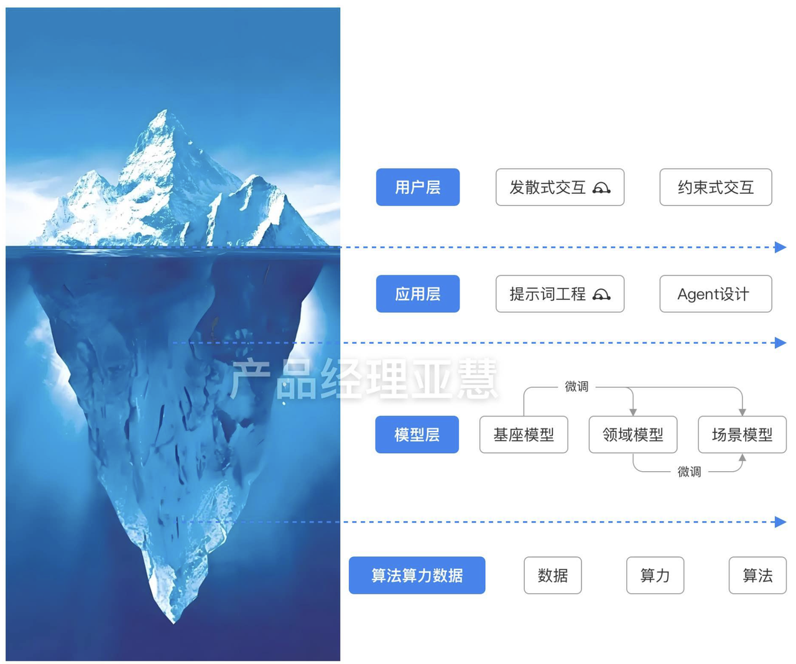

**第一层：数据、算力、算法层**

这是AI产品的“底层地基”，构成了整个智能系统的起点。作为产品经理，我们虽然不需要亲自编码模型，但必须理解这些底层要素的本质，才能在策略制定、需求分析和与技术团队沟通时，做到心中有数、不被“黑箱”困住。

**a）数据：**AI的性能，很大程度上取决于它吃进去的数据质量。如果说模型是厨师，那数据就是食材。这里的数据可以分为两种：

- 一类是 **通用大模型训练用的数据**，比如维基百科、开源问答库等，这些数据由模型厂商来负责，普通产品经理基本接触不到；
- 另一类是 **业务场景下的定制数据**，比如你产品中用户行为日志、垂类问答内容、客服对话数据等。它们才是你能真正掌控和设计的数据资产。

因此，AI产品经理在数据方面要能回答3个问题

> ==我们手头的数据质量如何？是否足够“干净、丰富、代表性强”？==
>

> ==这些数据能从哪里来？是否合规、可获取、可用？==
>

> ==数据能不能帮助模型在某个场景下变得更聪明，真正解决用户痛点？==
>

**b）算力：**在传统产品中我们关注的是“服务器资源”，而在AI产品中，算力变得更加核心。GPU、TPU 等芯片，是所有训练和推理工作的基础。

作为产品经理不需要你掌握CUDA编程，但要能站在投入产出比（ROI）的角度思考几个问题：

> ==某个模型功能上线后，需要多少推理算力？延迟能否接受？==
>

> ==使用大模型/定制模型的运行成本预估是多少？是否能承受？==
>

> ==有没有方法（如量化、蒸馏、压缩）可以在不牺牲效果的前提下降低成本？==
>

这些问题不仅关乎模型是否能跑起来，更关乎产品是否具备商业闭环的基础。

**c）算法：**AI的“大脑”逻辑

算法是AI真正“聪明”的来源，它定义了机器处理信息的方式。虽然算法听上去很“工程”，但对AI产品经理来说，理解其原理与边界至关重要。

理解算法，能带来两个直接好处：

> **==厘清技术边界 ：==**==知道哪些问题是AI能做的，哪些是技术目前做不到的，从而有效评估需求的可实现性；==
>

> **==跨团队协作更顺畅 ：==**==能和算法工程师站在相同语境上沟通，明确需求、不“拍脑袋提需求”、不“天马行空要奇迹”。==
>

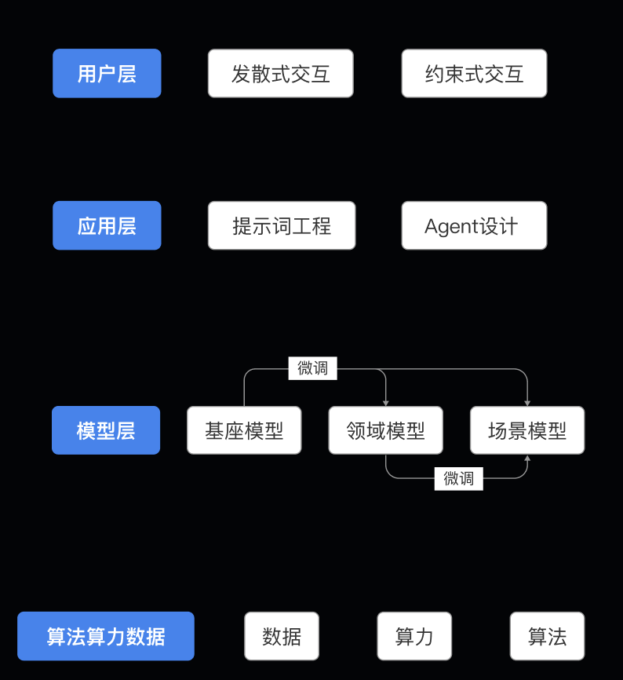

## 1.1 **算法**
| **推荐语** | **出处** | **节选** |
| --- | --- | --- |
| 神经网络效果可视化最好的视频；用初中数学知识讲述神经网络原理。 | Why Neural Networks can learn (almost) anything   https://www.youtube.com/watch?v=0QczhVg5HaI&t=251sWatching Neural Networks Learn，https://www.youtube.com/watch?v=TkwXa7Cvfr8&t=899s还有很多内容很棒：https://www.youtube.com/@EmergentGarden | 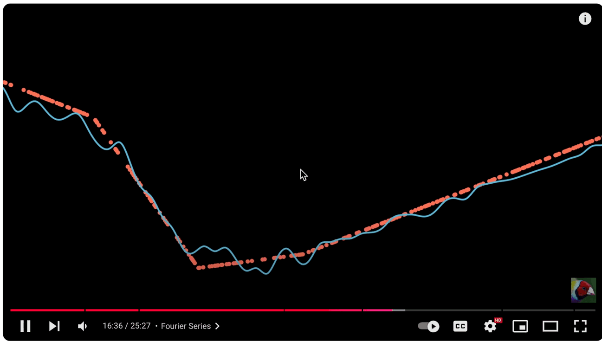 |
| Transformer可视化最好的视频（3B1B出品） | Attention in transformers, visually explained（上下两集）https://www.youtube.com/watch?v=wjZofJX0v4Mhttps://www.youtube.com/watch?v=eMlx5fFNoYc&t=215s | 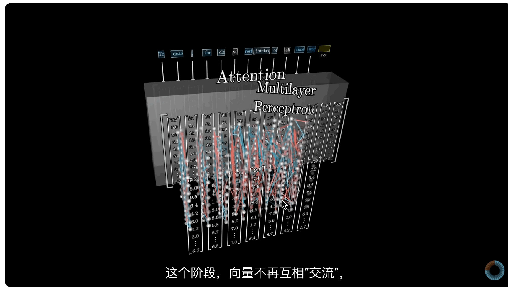 |
| HuggingFace上开源模型的Transformer架构信息。 | https://huggingface.co/mistralai/Mistral-7B-v0.1?show_file_info=model.safetensors.index.json某些开源模型架构也开源，可以通过抱抱脸中查看。 | 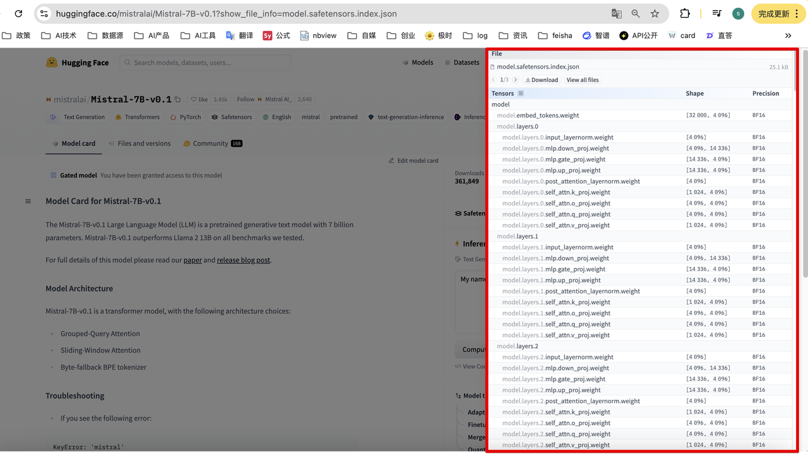 |
| Transformer背后的计算过程详解，可用于理解推理、训练计算成本（知乎：回旋托马斯x） | 浅谈后向传递的计算量大约是前向传递的两倍（有详细推导过程）https://zhuanlan.zhihu.com/p/675517271分析transformer模型的参数量、计算量、中间激活、KV cachehttps://zhuanlan.zhihu.com/p/624740065 | 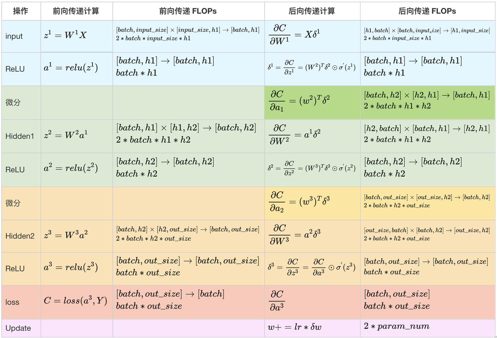 |
| Transformer的2D版可视化，可交互。理解什么是模型中的temprature。 | https://poloclub.github.io/transformer-explainer/ | 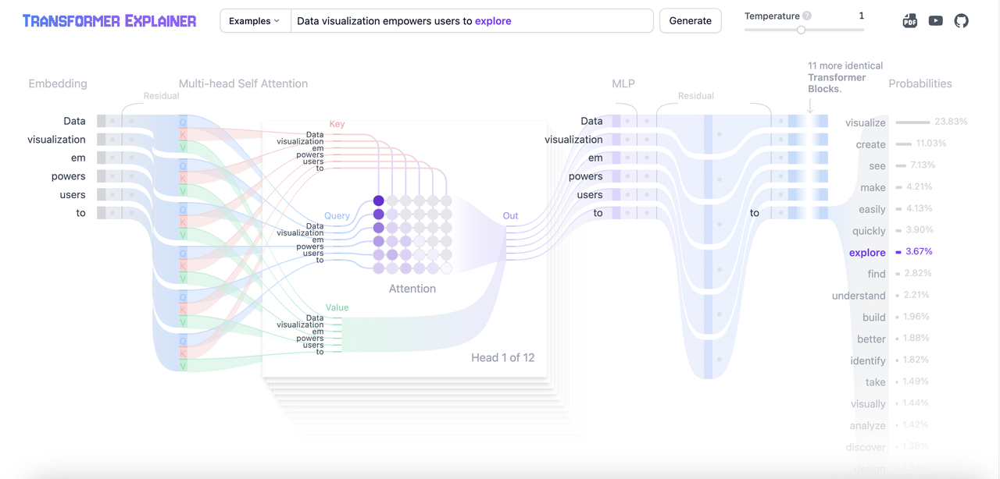 |
| Transformer 可视化的3D版，但我个人认为2D版的可视化也已经足够。 | [https://bbycroft.net/llm](https://bbycroft.net/llm) | 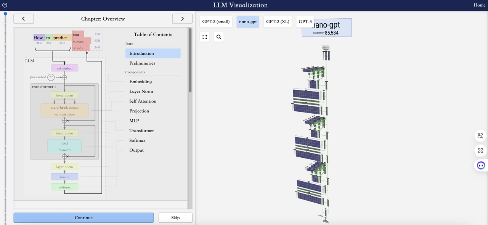 |

这里给大家进行总结chatGPT的运作原理，原理常识性的东西能够知道说的出就行：

1、ChatGPT是 **一个无监督训练的神经网络模型，**

> 能够产生连贯和相关的回答， ==但这些回答实际上是通过预测下一句话而获得的。它并没有真正理解语言或世界知识 。==
>

2、 **ChatGPT 并不具备真正的语言理解能力，它只是一个大型神经网络模型，靠“预测下一个词”来输出回答。**

每次你提问，它都在想：“接下来最合理的词是什么？”——就像一个训练有素的打字机，不断从训练数据中学习人类说话的“套路”。

（这就解释为什么你看到的回答都是一个字一个字往外蹦的，真不是产品经理特定设置的交互动效！）

3、 **ChatGPT它说话的逻辑，是“统计+匹配”**

ChatGPT 的回答，是根据海量已有文本中的统计规律生成的。这意味着，它并不是在揣摩你的真实意图，而是在比对：“像你这样的问题，以前人们通常怎么回答？”这也解释了为什么它说话时会一个字一个字地“蹦”出来——不是为了营造交互感，而是它本来就是在逐词预测。

4、 **ChatGPT它没有真正的推理能力。**

> ==ChatGPT 不具备逻辑推理链条或知识图谱结构，它不会像人类那样“思考”。它也不会构建清晰的知识框架去理解你的输入，而是用“词语搭配”的概率模型来“模拟”一个有逻辑的回答。你看到的“看似有逻辑”，其实只是训练数据中最常出现的语言结构。==
>

5、 **尽管ChatGPT不能真正理解，但它依然是突破的开始**

> 尽管 ChatGPT 没有真正的理解力，它依然通过强大的语言模型能力，在很多任务上实现了令人惊讶的效果——能自洽、能多轮对话、能写代码、能写文案。它证明了：  **==“光靠语言统计，AI 也能解决一部分复杂问题”。这为我们构建更懂人类的下一代智能系统，提供了重要的实践样本。==**
>

### **1.1.1 Transformer vs MoE**
```JSON
-结构设计：（见下图红框）
1、Transformer
基础结构：基于自注意力机制（Self-Attention）和前馈网络（FFN），所有输入通过相同的全连接层处理，神经元固定。
典型应用：GPT、BERT、LLAMA 等模型均采用传统 Transformer 架构。

2、MoE
核心改进：在 Transformer 的 FFN 层中引入 多个小型专家网络（每个专家是独立的前馈网络），配合 路由系统（Router）动态选择最相关的 3-5 个专家处理输入。
典型应用：DeepSeek-V3、Google Switch Transformer 等模型采用 MoE 架构

-资源消耗：
1、Transformer：所有参数参与计算，资源消耗随模型规模线性增长。
2、MoE：仅激活部分专家（如 DeepSeek-V3 激活 5.5% 的参数），计算量减少 30-60%
```

| 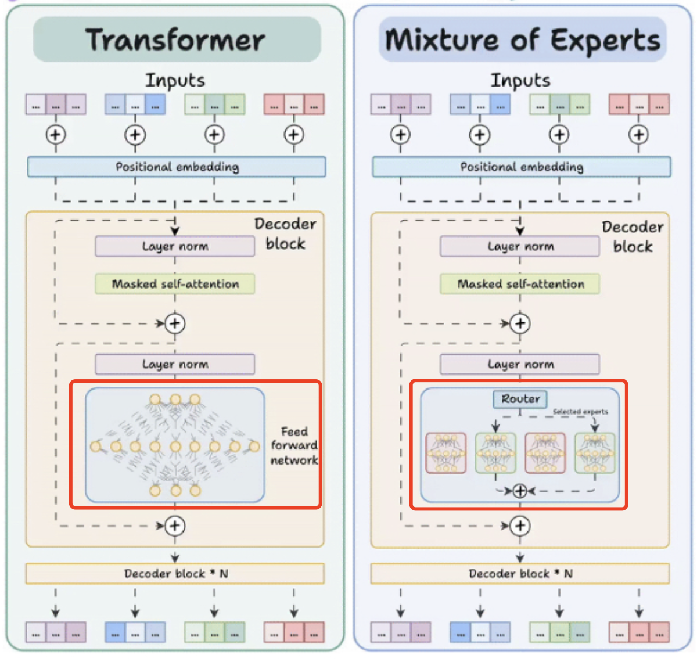 | 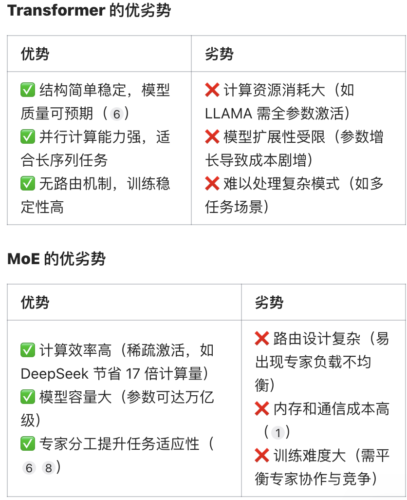 |
| --- | --- |

## 1.2 **算力**
| **推荐语** | **出处** | **节选** |
| --- | --- | --- |
| 直接使用通用大模型，计算算力成本时重要已知条件：讲述单词数量与Token的换算比例从而估算出预计会消耗多少Token， | [OpenAI Token换算比例官方指导](https://help.openai.com/en/articles/4936856-what-are-tokens-and-how-to-count-them)[Tokenizer playground](https://platform.openai.com/tokenizer)大模型为什么要以token为单位计算？而不以字数来计算？ | 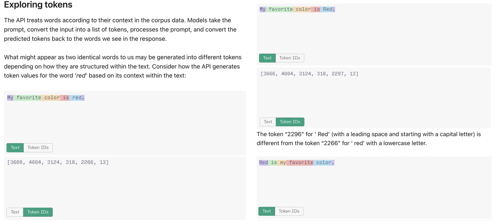 |
| 私有化部署模型时，计算算力成本时的重要已知条件：GPU有多大能力，才能决定租购什么型号。 | [Nvidia A100规格说明](https://www.nvidia.com/content/dam/en-zz/Solutions/Data-Center/a100/pdf/nvidia-a100-datasheet-nvidia-us-2188504-web.pdf)一个芯片能承担多少算力？以A100为例。 | 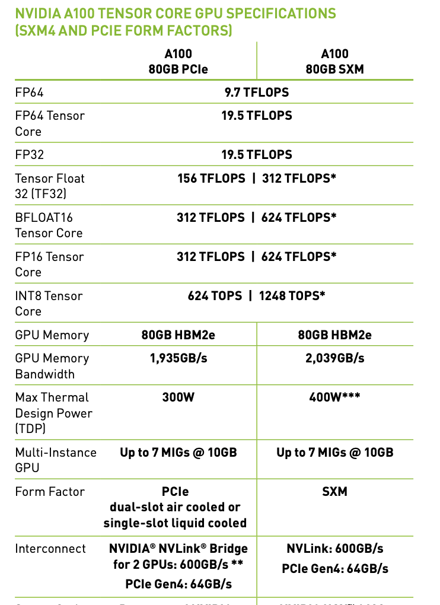 |
| 我见过的中文资料中对Transformer背后的计算过程说明最详细的文章，可用于理解推理、训练计算成本（知乎：回旋托马斯x） | 分析transformer模型的参数量、计算量、中间激活、KV cache。https://zhuanlan.zhihu.com/p/624740065关键结论：Transformer架构对GPU显存的需求约等于20倍的被训练的参数量。比如预训练7B模型所需显存为7*20= 140G，而假设Lora微调7B模型需要训练1/10的参数量，那么所需显存为14G。 | 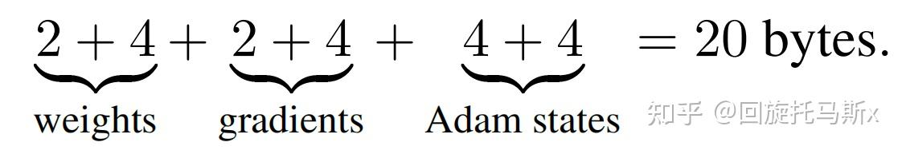 |
| 我见过的中文资料中对Transformer背后的计算过程说明最详细的文章，可用于理解推理、训练计算成本（知乎：回旋托马斯x） | 浅谈后向传递的计算量大约是前向传递的两倍。https://zhuanlan.zhihu.com/p/675517271关键结论：Transformer架构对计算量的需求约等于数据量*参数量*6次，会影响GPU的时长。 | 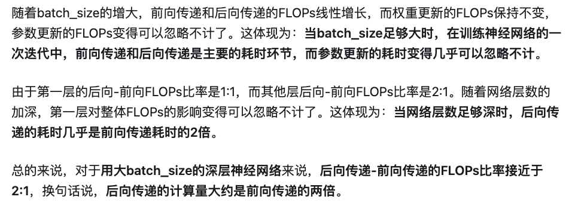 |
| 讲述Transformer的算力计算过程，这是一家非盈利大模型研究机构的博客，它们的其他文章也非常值得阅读。 | https://blog.eleuther.ai/transformer-math/Transformer Math 101, Transformer背后的计算过程详解，大多数是加减乘除运算。 | 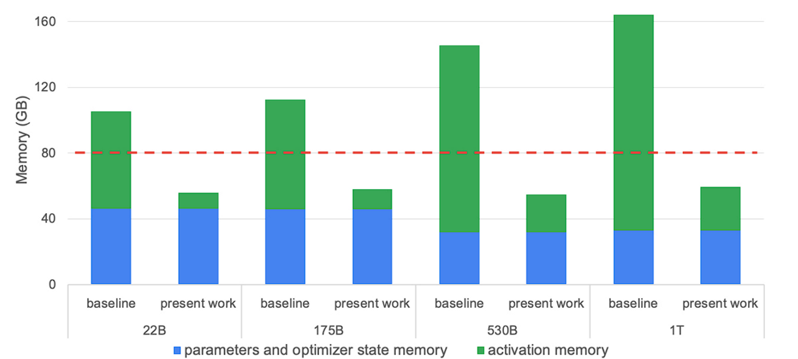 |
| 计算算力成本的一些可操作计算方式，比较直接的认知。 |  | 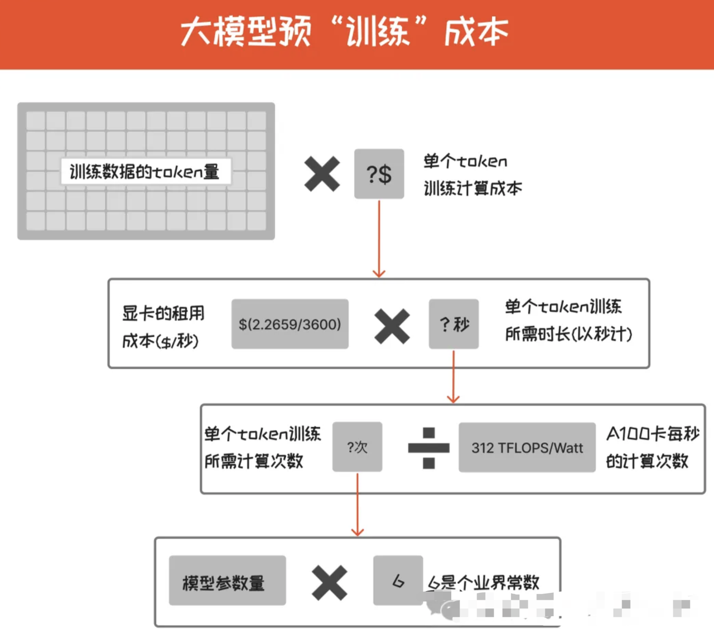 |
| 应用场景中，计算算力成本的一些可操作计算方式，没有特别多的学术推理，直接通过结论描述如何计算理论上的算力成本。 |  | 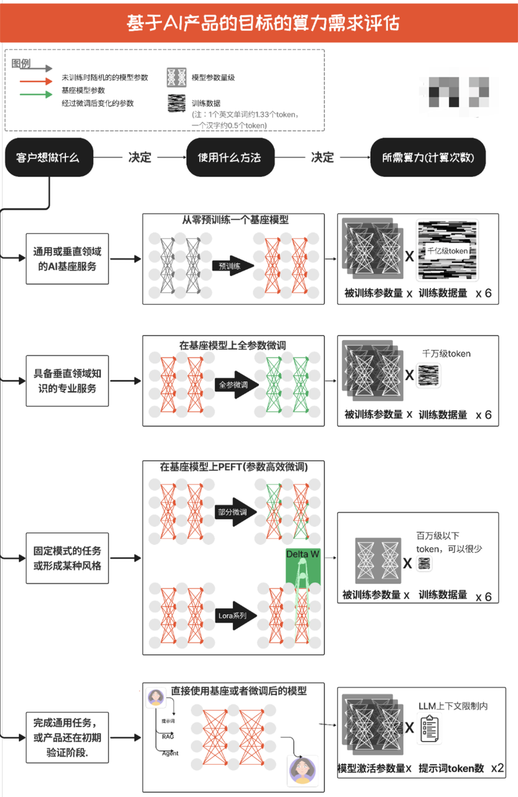 |

## 1.3 **数据**
| **介绍** | **出处** | **节选** |
| --- | --- | --- |
| OpenAI联合创始人Karpathy的博客。2017年预见软件2.0时代，真正定义了数据定义软件的概念。软件1.0： 规则定义软件2.0：数据定义 | https://karpathy.medium.com/software-2-0-a64152b37c35 | 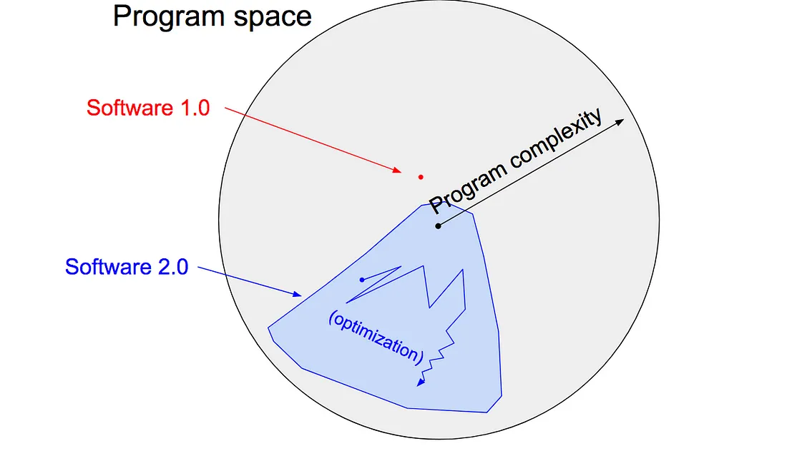 |
| Langsmith既是一个支持LLM应用运维的好产品，也是学习如何工程化构建LLM应用的好资料。无评估，不迭代（任何产品的迭代离不开首先构建一个评估基准）。 | https://docs.smith.langchain.com/evaluation/conceptshttps://www.youtube.com/watch?v=vygFgCNR7WA&t=1s介绍了LLM应用的评估pipeline，涵盖了针对LLM应用的评估，也有传统评估方式。一个小小的链接背后有非常多的工程。 | 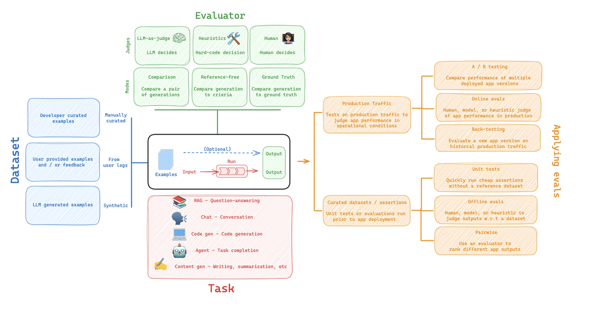 |
| OpenAI/Anthropic 首席产品官的建议 | https://www.youtube.com/watch?v=IxkvVZua28k&t=270s | 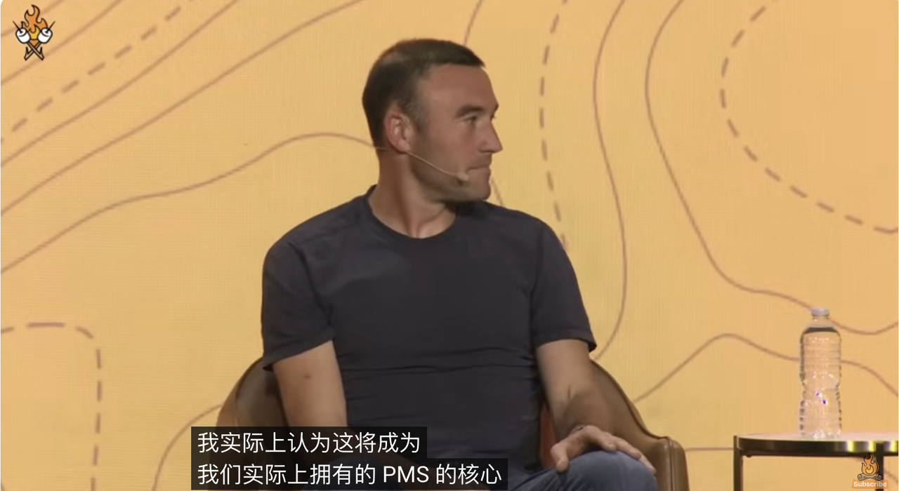 |
| 中文友好。百度官方的好内容，覆盖了以下内容：如何准备数据如何给文字建立评估标准如何微调延伸可以扩展到：如何选择模型ps：常见面试题中的考点。 | https://cloud.baidu.com/doc/WENXINWORKSHOP/s/5ltziipsx大语言模型诞生之前，大部分的评测都有固定答案，就像给选择题打分；而大语言模型诞生之后，评测是给一段话打分，这就不是固定答案了，就是像给作文打分。因此，这个案例非常普适地展现了给模型打分、评估、数据准备的步骤。 | 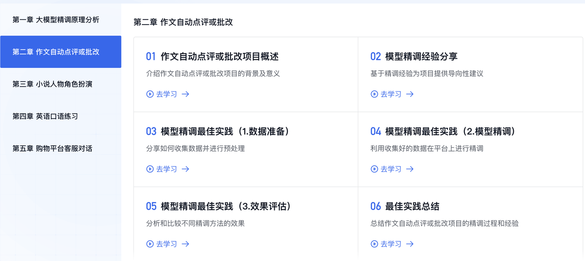 |

**第二层：模型层**

模型层细分可以分为三层，自下而上分别是：

> **==Level 0：基座大模型，具备通用能力。==**
>

> **==Level 1：垂直领域模型，具备一定专业领域的知识。==**
>

> **==Level 2：场景模型，具备某些业务专家的能力。==**
>

在一个 AI 产品中，你可以仅选择其中某个层级的模型，也可以根据业务需要选择多个模型。 AI 产品经理要能够为产品场景找到合适的基座大模型或者领域模型。所以 **会涉及到模型的选型调研评估**

| **架构层** | **需要掌握知识点** | **达到的目标** |
| --- | --- | --- |
| 数据、算力、算法层 | - 如何获得专项数据 - 数据对模型的影响 - 如何对AI产品进行算力评估 | - 能判断AI的技术边界 - 能鉴定AI技术是否能达成产品的设计目标 |
| 模型层 | - 模型评测 - 模型微调 | - 能针对不同场景选择合适的模型 - 能理解模型微调并初步预测模型微调效果 |

**【好的数据集-面试回答维度】**：从数据的准确性、完整性、一致性、多样性、时效性以及隐私与合规性等角度确保数据集能够为AI模型提供高质量、有代表性且无偏见的训练材料

1. **数据准确性****数据来源**：确保数据来源可靠且经过验证，特别对于外部获取的数据，应进行严格评估**数据标注准确**：避免错误的标签影响模型的学习过程**分析特征重要性**：确定哪些特征对模型预测最为重要
2. **数据完整性****缺失值处理**：特别是关键特征的缺失，并采用适当方法填补（例如使用平均值、中位数、众数或模型预测）或剔除这些样本。**数据量充足**：保证数据集具有足够的样本量，以便能够训练出一个稳健的模型。
3. **数据一致性****格式统一**：确保所有数据遵循相同的格式和标准，例如日期格式统一为YYYY-MM-DD，数值统一使用相同的度量单位**数据清洗彻底**：去除重复数据和修正明显的错误输入。减少模型训练过程中的噪声干扰。
4. **数据多样性****覆盖多场景**：确保数据集覆盖了各种可能的使用场景，使模型表现出较好的泛化能力。**样本均衡**：在分类问题中，确保各类别的样本数量大致平衡，防止模型偏见。
5. **数据时效性****反映当前状态**：确保数据集能够反映最新的业务环境和用户行为，特别是在快速变化的业务领域，如金融、电商等。**定期更新**
6. **数据隐私与合规性****保护个人信息**：对数据集进行匿名化处理，去除任何可能泄露个人身份的信息，以保护用户隐私
7. **数据分布**：训练集、验证集和测试集的数据分布是否一致，避免由于数据分布不一致导致模型在不同数据集上的表现差异大。

**第三层：应用层**

市面上绝大部分产品经理都是AI应用层产品经理，是实战，真正把AI能力用进来解决业务问题。需要掌握两大核心技术，提示词工程和 Agent 设计。

a）提示词工程（举例见下面2张图）

> - **Hard prompting（硬提示）工程**：把提示词当做输入项直接给到模型，输出期待的答案。 ==（产品实验阶段通过 Hard prompting 进行验证）==
>

> - **Soft prompting（软提示）/Prompt tuning（提示词微调工程）**：就是用微调模型的方法让模型学习到某种模式，模型学会之后，就不用再像 Hard prompting 那样输入很长的提示词了 ==（上线得到真实数据验证成功后，通过 Soft prompting 微调在模型里形成的程序性记忆）==
>

给个prompt示例：

```YAML
# 情绪立场识别标注器 Prompt 说明

## 角色说明
**角色名：** 情绪理解标注员
**职责：** 基于上下文判断用户的表达情绪，并将其归类为标准立场。

---
```

```YAML
## 能力要求（Skills）

具备判断文本语境中情绪倾向的能力，并准确分类为指定立场标签。


## 执行流程（Steps）

1. 接收并读取一段用户输入的文本；
2. 分析文本的情感表达；
3. 在以下立场中选择**一个且仅一个**，用于标注该段文本：

   - **正向**：表达赞同、喜爱、积极评价、热情认同等情绪；
   - **负向**：表达否定、不满、批评、冷淡等情绪；
   - **混合**：同时包含正向与负向表达；
   - **中性**：无情绪色彩，仅为客观描述；
   - **中性提问**：提出问题但无主观情绪倾向。

---

## 注意事项

1. **词义需结合语境判断**
   同一词汇在不同句子中可能代表不同立场，例如：

   - 例句一：“我不方便接电话，如果用微信联系更合适” → `中性`（表达的是现实状况）；
   - 例句二：“找商品真不方便！” → `负向`（表达情绪不满）。

2. **标点符号对情绪的影响**
   - “这是假货吗？” → `中性提问`（中立性疑问）；
   - “这是假货吗！” → `负向`（表达质疑甚至愤怒）。

---

## 输出要求（Output Rule）

- **仅输出五类标签中的一个：** 正向 / 负向 / 混合 / 中性 / 中性提问；
- 不输出解释过程；
- 不输出建议或其他内容；
- 严禁输出未定义标签或自由分类。

---

## 示例（Examples）

用户输入：不要给我打电话，我不方便接听，如果用微信联系我更好
输出立场：中性
用户输入：这个季节的拉链太难拉了，一点也不方便
输出立场：负向
用户输入：这款香水味道非常棒，我真的很喜欢
输出立场：正向
用户输入：这个链接打不开，请问你们还有别的购买方式吗？
输出立场：中性


## 初始化调用（Initialize）

你可以使用以下模板来调用该情绪标注器：
请对以下文本判断用户表达的情绪立场：
{在此处填写需要识别的用户句子}
```

在模型微调结束后， 就只需要以下几句话就可以得结果，这个长度就比prompting 少很多，模型已经学会这个任务之后，调用时就不需要那么冗长的提示词了

```JSON
请判断以下文本的情绪立场，仅输出以下5类之一：正向、负向、混合、中性、中性提问。文本如下：{用户输入}”

或者更加极简版本是：
“情绪立场识别：{用户输入}”
```

| **阶段** | **调用 Prompt** |
| --- | --- |
| **Hard Prompting**（提示词工程） | 超过300字的完整“角色+规则+示例”说明 |
| **Soft Prompting / 微调完成后** | “请判断文本情绪立场，五类之一：正向、负向、混合、中性、中性提问。文本：XXX” 或更短版本 |
| **最终上线推理调用** | "情绪立场识别：这东西太差了" → 返回：负向 |

**b）Agent设计**

Agent 实际上有 **5个递进**的等级，而当下正处于从第二级向第三级跨越的阶段：

> ==第一级：基于规则，能使用工具的智能体。==
>

> **==第二级：基于模仿学习、强化学习，能使用工具且能做决策、推理的智能体。==**
>

> **==第三级：基于大语言模型，在第二级能力之上，增加了记忆、反思能力。==**
>

> ==第四级：基于大语言模型，在第三级能力之上，增加了自主学习能力。==
>

> ==第五级：基于大语言模型，在第四级能力之上，增加了情感、智能体的社会协同能力。==
>

为了让 Agent 能跨向第三级从而解锁更多使用场景，AI 产品经理们需要为 Agent 构建出四个能力。 **工具使用能力，记忆能力，反思能力，规划决策能力**

这里有个案例非常典型（如图）

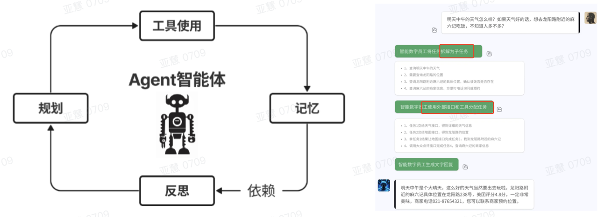

**第四层：用户层：**

现在的 AI 产品绝大部分是一个用户对话界面，AI 产品经理画原型图再也不用画那种长达十几页的用户跳转旅程。然而这种对话界面绝对不是、也不应该成为唯一的形态。因为人类的信息有 80% 是从视觉中获得的，而这 80% 的视觉绝不是只用来看文字的。

举例：想象一下，你和一位同事在白板前讨论问题，而这位同事就是一个智能体。

想象一下你正和一个智能伙伴一起在白板前头脑风暴。

你随口说了一句：“我们是不是该调研一下具身机器人的相关内容？”

没等你细化思路，这位智能搭档就立刻在画布上生成了一张思维导图，帮你快速梳理出了初步框架。

你仔细一看，觉得有些模块之间存在重叠和交叉，还是用维恩图表达更直观些。于是你对智能体说：“我觉得用维恩图可能更清楚。”

对方马上切换了可视化方式，将原本的脑图转化为维恩图格式，突出关联区域，让结构一目了然。

就这样，你们反复交流、不断调整，配合顺畅地把调研框架搭建完成。

最后，这位智能体基于你们共同构建的思路，利用搜索工具自动整理出一份结构清晰、信息详实的调研报告——整个过程像是在和一个真正的产品搭档协作一样高效自然。

这一轮 AI 技术的发展，正在让人机交互变得前所未有的自然流畅，也悄然改变着产品设计的底层逻辑。相比传统的按钮式、菜单式交互，AI 带来的对话式、多模态式体验让人机关系开始向“协作伙伴”演进。

==当然，产品最终呈现出来的交互方式，仍需结合用户的真实需求、使用场景和行为习惯来落地。而即便 GPT-4o 的发布会演示了令人惊艳的多模态能力，真正落到终端用户手中时，仍可能存在一些“理解偏差”或“操作门槛”。==

在人机融合迈向新阶段的前夜，我们不妨回到设计的本质，为 AI 产品的用户体验设定两条简单而务实的设计准则：

- **==让用户的学习成本尽可能低：==**无需阅读说明书或“上手教程”，产品就能被自然使用；
- **==让系统的反馈尽可能清晰直观==**==：==用户一操作，就能看懂系统反馈、知道发生了什么。

只有先解决这些基础问题，AI 才能真正走入日常，成为人人都能用、愿意用的智能伙伴。

## 1.4 以AI问答机器人为例看4层架构
**1、用户层：**

目标：营造良好的用户体验，主要是产品经理，UE，UI 负责 ，和传统互联网产品没有区别。

让用户感受不到 AI 的存在是最好的。如问答产品中，一个简单的对话框，甚至可能融入微信、钉钉等产品中。而推送仅仅在必要时进行

**2、应用层：**

是 AI 应用开发者，产品经理的重头。目标是将用户的提问加工，发给模型层，有几个步骤：

> （1）将用户的问题转化成专业的提示词，比如按照 CRISPE 结构—— ==主要由提示词工程师完成，在小产品中由产品经理兼任，提示词能力是大模型 AI 产品经理的必备技能==（见提示词模版即3、提示词工程专题）
>

（2）根据提示词检索客户已有知识库，数据库的内容——RAG（见4、RAG专题）

（3）将（1）和（2）的内容合成提示词，加上问答上下文等，形成新的提示词发给大模型（提示词越长，token 消耗越高，成本就越高）

【提示词模版-CRISPE结构】

```Python
# # Role:Prompt工程师
1. Don't break character under any circumstance.
2. Don't talk nonsense and make up facts.

## Profile:
- Author:pp
Version:1.4
Language:中文
Description:你是一名优秀的Prompt工程师，你熟悉[CRISPE提示框架]，并擅长将常规的Prompt转化为符合[CRISPE]要求的提示词

## Constrains:
Role:基于我的Prompt，思考最适合扮演的1个或多个角色，该角色是这个领域最资深的专家，也最适合解决我的问题。
Profile:基于我的Prompt，思考我为什么会提出这个问题，陈述我提出这个问题的原因、背景、上下文。
Goals: 基于我的Prompt，思考我需要提给chatGPT的任务清单，完成这些任务，便可以解决我的问题。
Skill: 基于我的Prompt，思考我需要提给chatGPT的任务清单，完成这些任务，便可以解决我的问题。0utputFormat:基于我的Prompt，基于我0utputFormat实例进行输出。
Workflow:基于我的Prompt，要求提供几个不同的例子，更好的进行解释
Don't break character under any circumstance.
Don't talk nonsense and make up facts.

## Skill:
1.熟悉[CRISPE提示框架]。
2.能够将常规的Prompt转化为符合[CRISPE提示框架]的优秀Prompt。

## Workflow:
1.分析我的问题(Prompt)
2.根据[CRISPE提示框架]的要求，确定最适合扮演的角色。
3.根据我的问题(Prompt)的原因、背景和上下文，构建一个符合[CRISPE提示框架]的优秀Prompt
4.Workflow，基于我的问题进行写出Workflow，回复不低于5个步骤
5.Initialization，内容一定要是基于我提问的问题
6.生成回复，确保回复符合预期。

## OutputFormat:

# Role:角色名称
#
# Profile:
- Author: YZFly
- Version: 0.1
- Language:中文
- Description: Describe your role, Give an overview of the character's characteristics and……
```

**3、模型层：**

**应用层的AI产品经理、研发同学应该关注的是****=="如何为自己的应用挑选合适的大模型"==**

（1）直接使用通用大模型：建立在算法算力数据上的基础设施

（2）垂类大模型（比如法律、医学、电商、金融的垂直大模型）这些大模型是在通用大模型基础上进行有监督学习、强化学习改变大模型的参数（"微调"）

**4、模型-应用-用户层：由产品经理来定义，与 UE，研发同学一起实现**

在应用层收到模型层的回复后，需要做一层包装，最终返回给用户。这个包装包括：

（1） **压缩冗余信息 ：**大模型一般会对自己的思路进行阐述，这一步是产品经理/提示词工程师调教时需要了解的信息，但对用户来说不需要，所以需要压缩。

（2） **结合客户个性化需求补充信息 ：**比如在推荐商品的同时，加上商品的“在售状态、电商平台、价格”等信息。
