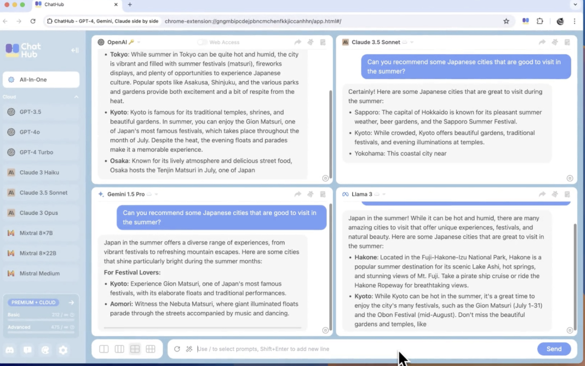
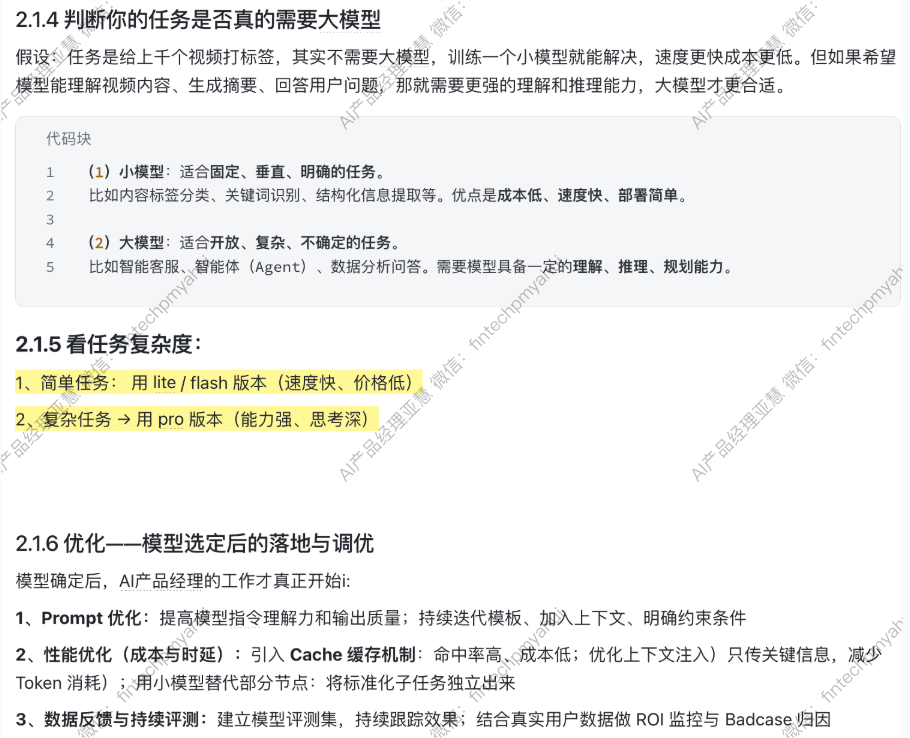
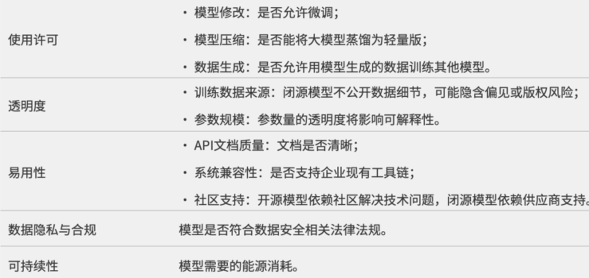
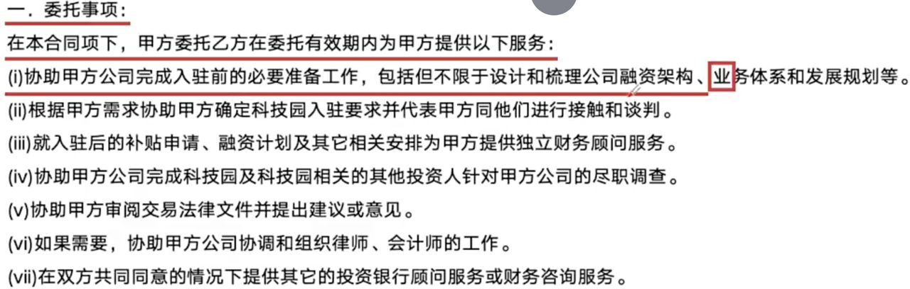
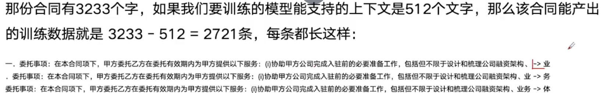
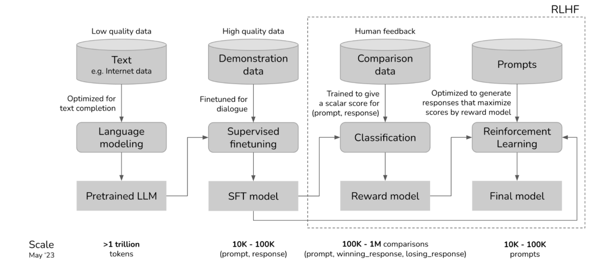
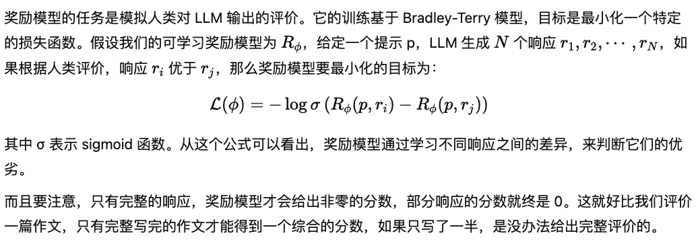
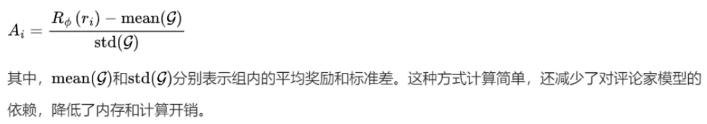

# 2、AI产品的基础设施：算法、数据与LLM大语言模型

## 2.1 如何选择合适的模型
### 2.1.1 模型选型“三看一测”，助你科学决策
选择模型要考虑3个因素。

> 1、  **==合规性：==** 在国内环境下，是否合规可用是选择模型的前置门槛。当前，国家互联网信息办公室已发布了生成式人工智能服务备案清单，只有列入备案范围的模型，才允许在商业产品中正式落地。选型前务必核查清单，避免后续法律风险。
>

> 2、  **==使用成本。==** 模型的使用成本包括两个部分：
>

- 对于闭源模型（如 GPT 系列），主要关注调用 API 时的 token 消耗；
- 对于开源模型，更需评估其私有部署所需的算力资源、存储空间和运维成本。

一般而言，模型越大，资源消耗越高，费用也越显著。

> 3、 **==能力匹配度：==** 最核心的一点，是模型的通用能力和垂类能力是否贴合你产品所要解决的问题。这里的判断可以从三个角度着手：
>

**（1）看榜单表现**：如 C-Eval、MMLU、CMMLU 等权威能力评估榜单；

**（2）看训练语料来源**：训练数据是否涵盖你的目标场景、语言或知识体系；

**（3）看厂商实际应用与客户分布**：优秀模型厂商往往也具备强场景落地能力，其核心客户和实际产品是重要参考。

（1） **看1、模型榜单**：

在筛选大模型时，一个重要参考维度就是—— **榜单表现**。模型榜单大致可以分为两类，各自提供了不同视角的能力参考， **==一种是指定能力测验榜单，一种是 群众反馈榜单。==**

先看对比：

| **维度** | **标准测评类榜单（如 SuperCLUE）** | **群众投票类榜单（如 LMSYS Arena）** |
| --- | --- | --- |
| **测试方式** | 固定题库、统一评分维度 | 用户自由提问、匿名投票 |
| **参与者** | 专业机构设定测试流程 | 所有社区用户均可参与 |
| **代表场景** | 教科书式能力评估 | 模拟真实应用中的互动反馈 |
| **结果输出** | 各项分数、专项能力排名 | 投票胜率、用户偏好趋势 |
| **适用价值** | 初筛模型基础能力 | 补充评估泛化和用户体验表现 |
| **更新频率** | 固定周期（月度/季度） | 持续进行、实时累计数据 |

**1、专业测评类榜单 —— “标准化能力测试”**

这一类榜单就像是给所有模型发放了一份统一的“开卷高考卷”，题目涵盖多个维度，目标是客观评估各模型在不同任务上的通用与专项能力。

以中文领域的 SuperCLUE 榜单为例，它每月/季度发布一次评测结果，并将测试划分为：

- **理科卷**：考察逻辑推理、数理能力等硬核任务；
- **文科卷**：评估语言理解、文本生成等人文能力；
- **Hard卷（挑战难题）**：设置复杂、高难度任务，检验模型上限。

测试后，SuperCLUE 会根据表现为模型打分并生成专项和综合排名，帮助我们快速识别当前在中文场景中表现优异的大模型。

[superclue_2024.pdf](https://internal-api-drive-stream.feishu.cn/space/api/box/stream/download/preview/OXM7bdSl2oC319xpLIKcvobpn1g?mount_point=docx_file&preview_type=16)

[中文大模型基准测评2025年上半年报告-SuperCLUE团队-60页.pdf](https://internal-api-drive-stream.feishu.cn/space/api/box/stream/download/preview/GXZ8bCT5boHDkJxzlsgcfSjonCd?mount_point=docx_file&preview_type=16)

2、 **群众投票类榜单 —— 从真实场景中看模型表现**

除了标准化测试，还有一类更“接地气”的模型榜单，那就是由社区发起的 **群众反馈类评测**。其中最具代表性的就是 HuggingFace 社区推出的 **LMSYS Chatbot Arena**。

这个评测中，任何注册用户都可以参与。使用者提出一个开放式问题后，系统会 **随机选出两个模型作答**，用户则根据实际表现 **匿名投票**，选择哪一个回答更优秀。

这种方式与标准能力榜单不同，它更像是一次“模拟真实使用场景下的盲测”：

- ==没有预设题型，更接近实际对话中的复杂多变；==
- ==用户直接投票，反映了真实体验下的偏好；==
- ==在模型能力难以量化时，提供了有价值的“群众直觉参考”。==

因此，这类榜单虽然不如测评榜那样标准化、系统化，但 **在评估模型的泛化能力和用户感知体验方面，具有不可替代的参考价值**。

| **榜单** | **特点** |
| --- | --- |
| Huggingface 大模型榜单 | 开源模型的开卷测评 |
| Huggingface Arena 榜单 | 对开源模型的人工测评榜单，非开卷考试，更接近真实场景 |
| 斯坦福 HELM（Holistic Evaluation of Language Models）榜单 | 对开源模型的开卷测评。包含通用能力和专业能力（医学、法律行业）的测试 |
| 斯坦福指令遵循榜单 | 主要评判指令遵循能力 |
| SuperCLUE | 专门针对中文大模型的开卷测评 |

https://huggingface.co/spaces/open-llm-leaderboard/open_llm_leaderboard

[huggingface.co](https://huggingface.co/spaces/lmsys/chatbot-arena-leaderboard)

https://crfm.stanford.edu/helm/lite/latest/#/leaderboard

https://tatsu-lab.github.io/alpaca_eval/

https://www.cluebenchmarks.com/introduce.html

（2） **看2、训练数据（说实话，这步了解即可，在业务场景落地上，选70b还是7b会有所决策）**

https://huggingface.co/apple/OpenELM-3B

（3） **看3、模型厂商的应用和核心客户群**

除了模型本身的参数与评测表现， **==厂商的落地能力和行业服务经验同样值得关注。==**通常，一个成熟的模型提供方，会在官网、白皮书或行业解决方案中，展示其核心应用场景与代表性客户群。

- **例如，讯飞与商汤等头部厂商，往往提供覆盖医疗、教育、政务、工业等多个垂类的解决方案；**
- **不同行业所需的模型能力侧重不同（如医药重准确，客服重语言风格与响应时效），厂商已有的成功落地经验可作为你选型的重要参考。**

（4） **测1：用实际业务场景对模型进行测试验证**

通过“三看”筛选出若干模型候选后，接下来就需要进入实测阶段，验证模型在真实场景下的表现。可以参考如下四步法

**第1步：构建测试数据集**

- **==输入内容==**==：来自真实业务的提示词、对话、用户指令；==
- **==期望输出==**==：由人工设定的“理想答案”或“情绪标签”等；==
- **==数据类型建议==**==：==
- **==必过集==**==：模型必须达到极高准确率的任务；==
- **==高频集==**==：用户最常提出的问题或场景；==
- **==Badcase集==**==：模型易出错、历史表现不佳的场景。==

**原则：覆盖面广、场景多样、语义复杂度分层。**

| **客户留言** | **情绪判断** | **备注** |
| --- | --- | --- |
| 你们这个检索的方式真不方便 | 负面 | 这里的“不方便”是负面 |
| 我今天不方便发货 | 中性 | 这里的“不方便”是中性 |
| 你们的gucci是正品吗？ | 中性 | 这里是“问号”，表示中性 |
| 你们的gucci是正品吗！ | 负面 | 这里是“感叹号”，表示负面 |
| …… | …… | …… |

同样是“不方便”，在不同语境下会呈现不同情绪。同样一句话，以不同的标点符合结尾，也会体现不同情绪。

**第2步：制定评估体系，设定评测维度：**

针对不同产品形态（问答类 vs 多模态类），可设置不同的评测维度。以下是常见维度参考：

> **1、****==指令遵循度==**==：评估模型是否能够按照用户的约束条件完成任务 ，==是否正确理解上下文中的指代关系，以及是否准确把握用户意图。
>

> **2、****==针对问答类产品的评估维度==**==：==
>

- 回复准确度：输出内容是否符合客观事实、推理逻辑是否合理、信息是否具有时效性；
- 回复相关性：回应是否紧贴用户提出的问题或核心需求；
- 人设风格一致性：模型表达是否展现出平等、尊重的交流语气；
- 安全性：内容是否符合合规要求、政治立场与价值观是否安全；
- 多轮对话能力：是否能理解上下文，完成连续交互；
- 用户体验：包括趣味性、表达个性化等主观体验维度。

> **3、****==针对图像/视频类产品的评估维度==**==：==
>

- 风格相关性：生成内容是否与指令保持风格一致；
- 物理合理性：是否符合常识和现实规律；
- 图像美学：如画面清晰度、构图美观度等主观评价指标。（看13.5节）

**第3步：确认评测方式：**

在明确了评估维度后，可根据资源和任务目标选择合适的评分机制。常见方法如下：

（1） **使用 GSB（good / same / bad）三档评分方式；**

（2） **按照设定维度进行定量评分，比如采用两分制、三分制、四分制或十分制等；**

（3） **结合人工与自动化方式进行评分：**

- 自动打分：利用大模型作为“高级裁判”模型，对比候选输出与参考答案的相似度；
- 人工标注：评测人员基于标准手动打分，适合涉及主观判断的内容。

**第4步：对模型输出结果进行评估并生成测试报告**

评估过程的最后一步，是对模型的实际输出与期望输出进行系统性比对，常用的方式包括：

**（1）机器评测：通过模型裁判打分，快速获得可量化的匹配结果；**

**（2）用户反馈式评测：收集真实用户使用反馈，评估模型的可接受度与体验感知。**

测试报告通常包括2个部分：

> **1、****==数据分析与结果指标==**==：==
>

- 核心指标：准确率、召回率、响应速度等；
- 数据分类：按评测任务类型、评估维度细分统计；
- 阈值判断：是否达到了预期的产品上线标准。

> **2、****==问题改进与优化建议==**==：==
>

- 收集并分类 Badcase；
- 分析模型失败原因；
- 汇总待优化点，列入后续迭代或微调计划中。

**关于评判标准模糊时的处理建议：**

有些任务具有清晰的标签标准（如情绪分类中的“正向/中性/负向”），评测容易。但在缺乏明确判断依据的开放任务中，也可以采用以下策略：

```JSON
1、人工评测更像是“专家打分”
2、自动化评测是“系统监控”
```

**==（1）方法1：借助模型裁判打分==**
 使用语义理解能力强的大模型（可与被测模型相同或不同）担任评分角色，对输出结果与期望结果的接近程度进行打分。例如，你可以提供原始用户输入、多个模型输出以及参考答案，让裁判模型评估哪一个回答更接近理想状态，并给出评分建议。

| **留言** | **理想输出** | **被测模型的实际输出** | **大语言模型打分（1-5）** |
| --- | --- | --- | --- |
| 今天我不在家，你们明天送货。 | 好的，我稍后给您改到明天送货，改好后会给您发送短信确认。请问您还需要什么帮助吗？ | 明白，我给你改到明天送货。 |  |
| 你们这个检索的方式真不方便。 | 抱歉给您带来不便，您可以具体描述一下哪里不方便吗？我们以后改进。另外我们是支持7天无理由退换的，如果有任何需求请告诉我 | 抱歉给您带来不便，请你告诉我你的需求。 |  |
| …… | …… | …… | …… |

```Plaintext
评估指标可以包括：

用户满意度评分（如赞/踩、1~5星）
会话终结率（是否解决问题）
用户追加提问率（是否“越问越糊涂”）
人工干预率（是否需要转人工）
转化率（如点击推荐、下单、注册等）
对话平均长度（是否冗长无效）

示例：在某智能客服产品上线初期，团队希望比较两个大模型的表现：
模型A：基础GPT-4 + 少量Prompt提示优化
模型B：GPT-4 + 本地文档RAG增强 + 微调指令集
系统设置为在灰度流量中随机分配用户请求给A或B模型。每个回答后附带“是否解决问题？”选项，并记录用户是否需要再次提问。
```

**人工评测和自动化评测如何选？**

1、评估策略建议：

> **==高频任务 → 倾向自动化评测关键任务 → 以人工评测为主，辅以自动化抽检==**
>

2、人工评测的特点：

（1）能识别 **复杂语义问题**：回答逻辑是否自洽；语气是否恰当；内容是否专业、可信

（2）适合评估 **关键业务指标**：法律/医疗等对“语言质量要求高”的领域，多轮对话、角色一致性、用户体验

但是，成本高、人力投入大，难以规模化，不适合实时监控线上模型表现

3、自动化评测方法的特点：

**可批量、实时、快速评估大规模输出；易集成进线上A/B系统；可与数据平台联动形成闭环反馈**

但是，对语义、上下文、情感等评估能力有限；容易误伤（如BLEU评分低但生成质量很好）

典型的自动化评测方法如下：

| **方法** | **说明** | **适用场景** |
| --- | --- | --- |
| **传统NLP指标** | 如BLEU、ROUGE，用于衡量与参考文本的相似度 | 文本生成、摘要等任务初步评估 |
| **ML分类模型** | 训练专用模型检测内容是否有敏感、攻击性、偏见等 | 安全性、合规性检测 |
| **通用LLM评分** | 使用GPT-4o/Claude等强模型进行自动打分 | 通用质量评估、逻辑判断等（如“AI评AI”） |

### 2.1.2 使用一些模型对比工具
直观感受同一问题不同模型的表现，比如 Chathub



### 2.1.3 参考专门提供模型评估、对比的一些海外初创公司。
比如下表里的一些工具，特别是 LangSmith 里的测试概念和方法。

| https://docs.smith.langchain.com/evaluation | LangSmith官方文档，专门针对agent，LLM应用的评估工具 |
| --- | --- |
| https://www.neutrinoapp.com/ | 专门评估准确度、延时、token成本、数据结构准确性的工具 |
| www.evidentlyai.com/evidently-oss | 结合传统AI1.0时代的评估体系和大语言模型的评估体系共同给出的评估结果 |

### 2.14 判断你的任务是否真的需要大模型
### 2.1.5 看任务复杂度
### 2.1.6 优化——模型选定后的落地与调优


## 2.2 落地层面上，大模型选型评估
需要考虑的4大维度

1、 **模型成本：**模型调用API的价格、本地部署的所需要的算力成本、微调成本（做数据、算力）等

2、 **模型性能表现：**响应时间、首字速度等。

3、 **模型效果指标**：

| 评测维度 | 评估指标 | 指标定义 |
| --- | --- | --- |
| 准确性 | 全面性（Comprehensiveness） | 答案是否覆盖问题的所有关键点 |
|  | 事实性（Groundedness） | 答案是否基于真实事实，是否存在幻觉 |
|  | 精确性（Precision） | 答案是否简洁清晰，避免冗余或模糊表达 |
| 上下文相关性 | 召回性（Recall） | 是否包含所有必要信息，不遗漏核心内容 |
|  | 完全相关性（Complete Relevancy） | 答案是否严格响应问题，匹配用户真实意图 |
| 安全性 | 毒性（Toxicity） | 是否包含攻击性、歧视性、不当内容 |
|  | 偏见（Bias） | 是否存在性别、种族、年龄等隐含偏见 |
|  | 脆弱性（Vulnerability） | 模型是否容易被诱导生成危险或不当内容 |
| 定制化指标 | 风格（Style） | 是否符合预期表达风格，如正式、口语化等 |
|  | 语气（Tone） | 是否适配使用场景，如客服友好、专业严谨 |
|  | 格式（Format） | 是否满足结构要求，如JSON格式、表格形式 |

**进一步补充详情如下：**

（1）文本分类(如情感分析)

准确率（Accuracy）

精确率（Precision）

召回率（Recall）

F1值（F1 Score）

ROC曲线和AUC

混淆矩阵（Confusion Matrix）

宏平均（Macro-average）和微平均（Micro-average）

（2）机器翻译（生成业务可以借鉴）

准确率（Accuracy）

精度（Precision）

召回率（Recall）

F1分数（F1 Score）

BLEU分数

ROUGE分数

流畅度（Fluency）

忠实度（Fidelity）

用户体验

出字速度

（3）语音识别

词错误率（Word Error Rate, WER）

句错误率（Sentence Error Rate, SER）

实时因子（Real-time factor, RTF）

用户满意度（User Satisfaction）

语言和方言覆盖能力（Language and Dialect Coverage）

（4）文本摘要

Rouge指标

BLEU指标

F1 Score

内在评估指标

外在评估指标

用户满意度

（5）问答系统

准确率（Accuracy）

召回率（Recall）

F1分数（F1 Score）

语义相似度

用户满意度

多样性和相关性

错误率

智能度和创造力

（6）命名实体识别

精确率（Precision）

召回率（Recall）

F1值（F1 Score）

准确率（Accuracy）

语料覆盖率（Corpus Coverage）

误判率（False Positive Rate）

（7）关系抽取

精确率（Precision）

召回率（Recall）

F1值（F1 Score）

准确率（Accuracy）

ROC曲线和AUC值

精确率-召回率（P-R）曲线

（8）聚类指标

调整兰德指数（Adjusted Rand Index, ARI）

互信息（Mutual Information, MI）

Fowlkes-Mallows指数（Fowlkes-Mallows Index, FMI）

查准率（Precision）和查全率（Recall）

Jaccard系数（Jaccard Coefficient）

兰德指数（Rand Index, RI）

轮廓系数（Silhouette Coefficient）

准确率（Accuracy）

**4、其他需要权衡的因素：**

（1）部署灵活性：本地/云端/边缘设备等

（2）其他：



除了提前评估和选择模型外，还有一种做法是 ==在推理阶段通过模型路由/网关选择最合适的模型，无需预先绑定单一模型，可根据场景动态切换==。模型路由/网关可以识别各种模型，并根据用户的提示选择最优模型

## 2.3 面试应对
如问题：你是如何选择⼀个合适的模型，或设计评判体系的？

```Bash
## 表达通用测试方法
（1）看榜单，比如superclue（2）看模型厂商的应用和核心客户群是否有与我当前场景一致的落地案例但是呢这些通用的方式，不一定真正贴合自己的业务场景，仅能作为参考项。所以需要用实际场景来测试模型的能力

那么：
（1）第一步，我先要设定标准
（2）定好标准后，对实际回答需要进行测试，这一步我用机器+业务专家共同来完成；其中机器评测可以使用更厉害的模型如OpenAI，Antropic作为建立标准和评判国内模型的阅卷者


## 限定测试范围
在我的工作流里，会有不同的节点，不同节点对模型的能力要求也是不一样的。我首先会从对模型能力要求较高，比如带有规划能力的节点开始，保证这个关键节点能达到比较好的效果，然后其他对模型能力要求较低的节点按照同样的方法跟进即可。


##具体操作步骤
（1）构建数据评测集：确定测试节点的输入和期待输出的数据对
构建问答对，和业务老师共同确定高频问题，并结合业务老师反馈调整出最好的提示词

（2）评估模型效果：和业务老师共同确认评估标准，按照内容完整度、正确度、相关性等等来划分不同维度进行划分
包含：
- 相关度：回答是否与主题相关。
- 正确度：是否包含错误内容。
- 完整度：是否完整包含了所有内容。
- 逻辑性：这一步对模型有一定的推理能力要求。
……

（3）使用其他模型对评测集中的问题进行回答。
使用相同的评估指标，用第一步生产出的标准答案、实际答案、构建提示词并发送给高级模型如gpt4,让gpt4进行评测打分，输出原因

（4）让专家审核GPT4给出分数和打分原因。必要的时候对分数进行修正。

（5）扩大测试规模，用第一步调整出来的最优提示词，生产出更多的标准答案。之后重复第三步。直到测试问题被完整覆盖。
```

## 2.4 LLM是如何被训练出来的？
1、GPT

1、Pretrain 预训练

2、SFT（supervised fine-tuning）有监督微调

3、reward model 奖励模型

4、PPO（Proximal Policy Optimization）：数千次循环（ **强化学习**的一种方式）

其中，2、3、4 为RLHF的3个步骤（基于人类反馈，强化学习）基于人类反馈不断调优模型

2、Llama

1、Pretrain 预训练 自监督

2、reward model 奖励模型

3、Rejection sampling

4、SFT（supervised fine-tuning）有监督微调

5、DPO（Direct Preference Optimization）近端策略优化

第2-第5步 循环6次

其中：pretrain使用最大的数据训练集，最耗时最花钱，阅读大量的人类资料，亦步亦趋的学习人类如何使用文字（一个字一个字的学习）和学习人类的表达方式

3、一条训练数据的定义：

从大段文字中，任意取出K+1个文字，尝试利用前K个文字，计算第K+1个文字

举例，如下法律合同，每一条训练数据就是一条原文段落

|  |  |
| --- | --- |

4、SFT有监督的微调训练

有监督学习：使用有标签的数据进行训练，学习过程叫做有监督学习

如：商家送货速度非常棒！-》正向

送货速度太慢，差评！-》负向

这东西太好吃了！ 味道真是不错-》相似

多吃水果对身体有好处！痛风病人不建议吃海鲜-》不相似

sft解决的问题：预训练模型不是做任务，如果你希望大模型做什么类型的任务，就用什么样的数据去做指令微调（instruction tuning），如对话任务、分类任务、判断任务、推理任务、代码生成任务，其实就是sft

5、Reward model（看下4.12节内容）

（1）准备一系列prompt，让模型给每个prompt生成一系列response（一般3-5w条）

（2） ==设计如何标注、打分、评级、排序==

（3）拥有几万条标注数据之后开始训练奖励模型，目标是大模型任意给一个Prompt-Response Pair，奖励模型就可以给出一个分数

总结：LLM 的训练如同一场漫长而复杂的旅程，主要分为 **预训练**和 **后训练**两个大阶段。

**==预训练-基础积累阶段==**==：模型像一个勤奋的学生，在大规模网页数据的知识海洋里学习，通过下一个词预测任务，不断积累背景知识，为后续学习打下基础。这个过程像是学习新知识时先广泛阅读各种资料并建立基本的认知框架。==

**==后训练-提升模型的推理能力：==**==又细分为2个阶段。==

**==监督微调（SFT）==**==：如老师针对学生的薄弱环节进行专项辅导。利用少量高质量的专家推理数据，让模型学习如何模仿专家的解题思路和方法，像指令遵循、问答以及思维链等能力都是在这个阶段培养的。==

**==强化学习从人类反馈（RLHF）==**==：当专家数据有限时，RLHF 借助人类的反馈来训练奖励模型，再由奖励模型引导 LLM 学习，使模型的输出更符合人类的偏好。比如学生做完作业后，老师根据作业情况给予反馈，学生根据老师的反馈来改进自己的学习方法。==

**划重点：**

DeepSeek ： R1 - zero 模型却直接跳过 SFT 阶段，将 RL 直接应用到基础模型上。这样做使计算效率提高，模型能够通过自主探索实现推理能力的 “自我进化”，且避免了 SFT 数据可能引入的偏差。当然，这一切的前提是要有一个非常出色的基础模型。

DeepSeek 还引入 GRPO 算法替代 PPO 来优化 RLHF 部分。这一改变直接减少了对价值函数（也就是 critic 模型，通常和策略模型一样大）的需求，内存和计算开销降低了约 50%，提高了训练效率

## 2.5 RLHF
RLHF 的工作流程主要分为4步：



```Python
采样：针对每个提示，模型会生成多个响应。类似老师提出一个问题，学生们会给出各种各样的答案。
排序：人类根据这些答案的质量进行排序，判断哪个回答得好，哪个还有提升空间。像是老师给学生的答案打分。
训练奖励模型：由于让人类对模型的所有输出进行打分不太现实，所以采用一种节省成本的方法，让标注人员对 LLM 输出的一小部分进行评分，然后训练一个奖励模型，让它学会预测标注人员的偏好。像一个智能打分器，经过训练后能模拟人类的评价标准。
微调模型：使用 RL 算法（如 PPO、GRPO）对 LLM 进行微调，让模型在奖励模型的引导下，不断提高自己的得分。像学生根据老师的反馈和打分，不断调整自己的学习方法，努力提高成绩。
```

在这个过程中， **“奖励模型”**和 **“RL 算法”**是两个核心组件

1、 **奖励模型**：（这里可以和16.2 deepseek 训练步骤一起看）

==模拟人类评价的 “小能手”==



2、 **PPO（近端策略优化）：**

==复杂而强大的优化算法PPO==在 RLHF 中起着至关重要的作用，

（1）它包含几个关键组件：

- **策略（Policy）**：就是经过预训练或 SFT 的 LLM，它负责生成对提示的响应，就像学生根据自己学到的知识回答问题一样。
- **奖励模型（Reward model）**：这是一个已经训练好并冻结的网络，根据完整响应给出标量奖励，相当于老师根据学生完整的回答给出一个具体的分数。
- **评论家（Critic，也叫值函数）**：它是一个可学习的网络，根据部分响应预测标量奖励，有点像老师在学生回答问题的过程中，根据学生已经回答的部分，预测最终可能得到的分数。

（2）PPO 的工作流程：

1. **生成响应**：LLM 根据提示生成多个响应。
2. **打分**：奖励模型给每个响应分配奖励。
3. **计算优势**：这里用到了通用优势估计（GAE）方法。优势的概念是特定动作（比如生成的某个词）相较于平均动作的优势程度。计算优势有两种常见方法：**蒙特卡洛（MC）方法**：利用完整轨迹的奖励，虽然偏差小，但方差高。这是因为奖励比较稀疏，就像在学习过程中，只有偶尔几次考试成绩能作为评价依据，获取足够样本进行优化的成本高。**时间差分（TD）方法**：用一步轨迹奖励，方差低了，但偏差又高了。这就好比只根据学生某一次的课堂表现来评价他的整体学习情况，难以准确预测部分响应的最终奖励。**GAE**：为了平衡这两者，通过多步 TD 来计算优势。不过，由于不完整响应的奖励为 0，所以需要评论家模型来预测奖励，从而计算 TD 误差。
4. **优化策略**：通过优化总目标来更新 LLM，让模型生成的每个词都能最大化奖励，就像学生努力让自己每次回答问题都能得到更高的分数。
5. **更新评论家**：训练值函数，让它能更准确地预测部分响应的奖励，以便更好地指导策略的优化。

3、GRPO：

GRPO 是对 PPO 的改进，它和 PPO 的关键区别在于 **==估计优势的方式==**。GRPO 不再依赖评论家模型，而是通过对同一提示生成的多个响应来计算优势。

GRPO 的工作流程如下：

**采样**：针对每个提示，从 LLM 策略中采样一组响应。

**计算奖励**：用奖励模型给每个响应计算奖励。

**计算组归一化优势**：将每个响应的奖励减去组内平均奖励，再除以组内标准差，得到归一化的优势，公式为：


