# 4、RAG

## 4.1 背景及概念
如果我们把大模型比作一个聪明的大学生：

**没有用 RAG 的时候**，就像你在面试现场问他：“你觉得我们公司怎么样？” 他虽然聪明，但只能凭自己以前见过的资料或听说过的内容来回答你，答得好不好，全靠“记忆”和“凑巧”。

**用了 RAG**，就相当于他已经入职，你告诉他：“去我们公司的资料库里查一查，写一份调研报告。” 于是他就先去看内部资料（知识库、网页、文档等），再根据看到的内容写出一份有依据、有细节的专业回答。

这个“查阅资料库再回答”的能力，就是 **RAG（Retrieval-Augmented Generation）**。

**没有用 RAG 的时候**，就像你在面试现场问他：“你觉得我们公司怎么样？” 他虽然聪明，但只能凭自己以前见过的资料或听说过的内容来回答你，答得好不好，全靠“记忆”和“凑巧”。

**用了 RAG**，就相当于他已经入职，你告诉他：“去我们公司的资料库里查一查，写一份调研报告。” 于是他就先去看内部资料（知识库、网页、文档等），再根据看到的内容写出一份有依据、有细节的专业回答。

这个“查阅资料库再回答”的能力，就是 **RAG（Retrieval-Augmented Generation）**。

**==一句话总结：RAG = 大模型 + 查资料能力，它让模型不只是“背过的会答”，而是“边查边答”。==**

2、RAG 本质上就是把搜索到的资料作为提示词的一部分发给大语言模型，让大语言模型有根据地输出内容，从而降低大模型“幻觉”的概率。RAG 的全称是 Retrieval Argumented Generation，中文是检索增强生成。 ==意思是把检索（资料库）的结果发给大模型，以增强大模型的生成能力。==

```JSON
RAG（Retrieval-Augmented Generation，中文叫“检索增强生成”）的本质，其实就是让大模型“看完资料再回答问题”。

你可以理解成——我们不是让大模型单凭记忆作答，而是先给它配一份参考资料，让它“带着提示词+查到的内容”一起生成答案，这样既能提升准确性，又能显著降低“幻觉”。
```

3、 **RAG 是怎么工作的？**

你可以把 RAG 想象成一条“知识回答流水线”（Pipeline）。整条流程大致分成十个环节，每一步都很关键。任何一个环节处理得不好，都会影响最终的生成质量。RAG 入门不难，但想做得出色，其实非常讲究细节和工程能力。

```JSON
用户提出问题
系统分析关键词
去知识库中检索匹配内容
清洗与过滤冗余信息
重组内容并准备成上下文
将用户问题 + 检索内容一起传给大模型
大模型基于这些信息进行生成
对输出内容进行审校
增加结构化包装或格式美化
最终返回用户期望的结果
```

RAG 入门容易，想做好不容易。就像：你把两批同样的资料派给不同的公司管理，还让不同人去查，二者都能得到答案，但要找到好答案可不是一件容易的事情。

4、为什么RAG这么重要？

```JSON
因为大语言模型（LLM）本身有两大局限：

1、知识是静态的：大模型训练完之后，它的知识就被“封存”在模型参数里了，没办法自己更新新闻、文档、业务知识；

2、上下文是有限的：大模型一次最多只能看几千~几万字，不可能记住所有知识，也不能每次都从头读起。

所以 RAG 就像给 LLM 加上“查资料”+“记得住上下文”的外挂，不仅提升了准确率，还让它在真实应用中变得更可控、更可信。因为LLM包含的知识是时效性的（更具体地说，是在训练时点固定的），并且决定它们一次可以处理多少信息的上下文窗口是有限的
```

5、在构建一个真正“有用”的大模型应用时，背后到底谁在影响最终效果？我们可以从4个层面来理解它的构成因素与权重分布： ==模型是底座，微调是精修，RAG是效率神器，应用/用户层是门面。四者合力，才能打造一个真正落地、有用、好用的 AI 应用。==

> **==1、模型本身的能力（约 40%）==**
>

大语言模型（LLM）的基础能力决定了上限，比如语言理解、生成质量、推理能力等。如果底层模型能力不够强，再怎么优化上层逻辑也救不了结果。

可以理解为： **模型是地基，地基不稳，上层设计再好也白搭。**

> **==2、微调（SFT，约 10%）==**
>

微调可以让模型更贴近特定任务或领域，比如金融问答、医疗对话等。但它成本高、周期长，还需要大量高质量标注数据。

所以在多数实际项目中， **微调不是常规首选，而是高投入、高门槛的进阶方法。**

> **==3、RAG（检索增强生成，约 40%）——用搜索引擎的方式给模型加个“外挂大脑”。==**
>

RAG 是应用层最具性价比的优化手段。与其花大力气去“教会模型记住所有内容”，不如让它“边查边答”。尤其在多场景、多业务、更新快的场合， **RAG 能以更轻的方式带来更强的适应性。**

你可以把 RAG 理解成： **用搜索引擎的方式给模型加个“外挂大脑”。**

> **==4、用户体验层（约 10%）——UI 很多团队都会做，但“做得懂 AI”的产品设计才是稀缺的。==**
>

不是说用户体验不重要，而是我们在移动互联网时代已经积累了非常成熟的 UI/UX 能力。做交互不是瓶颈，最大挑战还是让模型“答得对、答得快、答得准”。

## 4.2 RAG流程
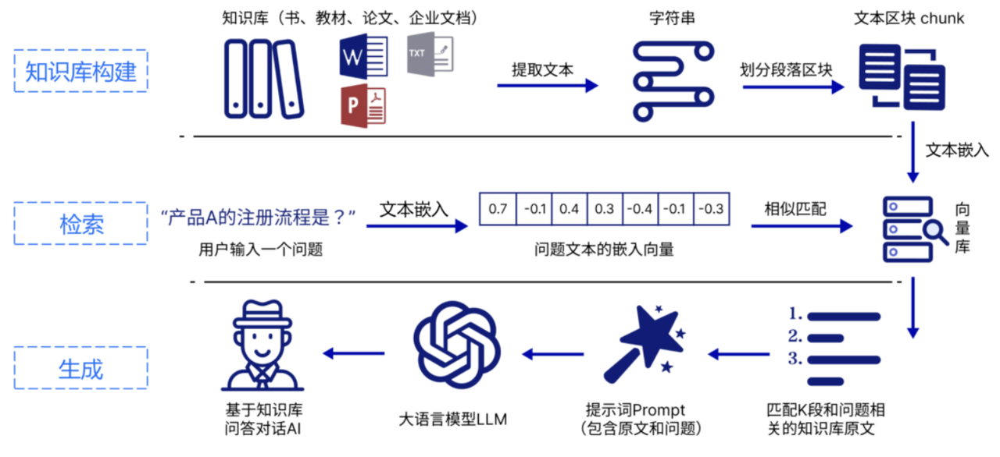

1、 **数据提取：资料库的“收集环节”**

这一阶段的目标是 **确保原始资料来源完整、可靠**。可以是网页、PDF、数据库、手册等。

除了“搬运原文”，还会用大模型先对资料做些预处理，比如：

自动摘要（Summary）

自动打标签（Tagging）

提取关键信息（如作者名、分类、时间）

**目的：让后续的分块、检索更高效。**

2、 **分块（Chunking）：资料“切多细”，这步决定你知识的颗粒度**

**这一步的关键是——怎么把长文档切成更小的段落块？**

可以按不同颗粒度来切分，比如：按照段落、句子、标题标记；或者每 N 字一个片段

3、 **向量化（Embedding）：让模型“看得懂”**

**向量化就是用多个数字维度来表示一个文本的“含义”**。比如一本书可以从“主题”“写作风格”“语气”“关键词密度”等维度来描述，最终变成一个长度为 N 的数字数组。向量就像是文本的“坐标”，后面所有的相似度匹配、检索召回，都靠它来实现。

**4、创建索引：让知识“能被快速找到”**

向量化后的资料需要被“整理归档”，这就像图书馆按分类号、作者名给每本书编排。系统会根据你的数据特点建立不同的索引结构，比如： **按内容相似度排序**（便于查找相关内容）； **按时间或标签排序**（便于筛选特定类别）

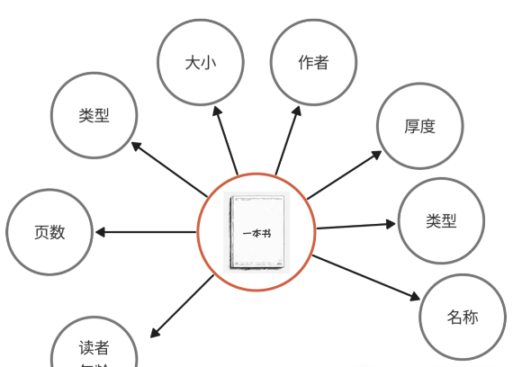

当我们说一本书被“向量化”时，指的就是这本书的核心信息被转化成了一个多维空间中的点。假设我们用的是八维向量，那么这本书就对应了这个八维空间里的某一个具体坐标。 ==计算机不理解“文字”，但它非常擅长处理“数字”。所以它通过把复杂的文本信息（像书名、段落、关键词等）转成向量的方式，来进行==**==相似度判断、检索匹配、关联联想==**==等工作。==同样， **语言文字也可以被转化为向量**。现在我们已经有很多成熟的语言向量模型，比如 BERT、Word2Vec、GloVe 等，它们可以把“语言的意思”变成“模型能理解的数字形式”。

**==换句话说：对人类来说，“意思”藏在语言里；对计算机来说，“意思”藏在向量里。==**

而通过向量对比，计算机就能“知道”这本书和谁的关系更近，从而在检索、推荐、问答中做出更精准的判断。

**资料库已经构建完成，接下来就轮到“大模型如何查资料并作答”这个阶段了。整个流程可以继续分成****==检索 → 重排序 → 生成 → 评估==****4个核心阶段，以下是每一步的解释与背后的工程逻辑：**

**5、检索环节（Retriever）：在资料库里“找线索”，这一步只是找资料，答案还没有生成出来**

当用户提出一个问题后，系统首先会在已建立好的向量索引中，根据语义相似度 **检索出与问题最相关的几个内容块**。

这个过程相当于：“我还不知道怎么回答你，但我先去找几段可能有用的资料。”

**6、检索效果评估（召回率）**

> 评估指标： **==召回率（Recall）= 实际检索到的目标文本数量 / 应该被检索到的目标文本总数==**
>

如果这一步效果不佳，模型后面就算再聪明，也是在“看错的资料”里拼命找答案，输出自然就偏离了正轨。

第6步结束后，称为“语义检索”阶段：知识库已经具备“语义搜索”能力，还需要另外2步可以实现基于 LLM 的问答应用了。

接下来的环节就是 **大语言模型 LLM 出来后特有的阶段：**

7、 **重排序（Rerank）：在“有用”里选“最有用的”**

初步检索讲究的是 **覆盖广**，而这一环节则关注 **精准性**。对语义检索返回的内容进行再次排序，优先把与用户问题最贴近、价值最高的文本放到前面。

8、 **重排评估：是否真的把“重要的”放在前面？**

重排序之后，同样需要评估效果

9、 **生成（Generator）：LLM 上场，整合成答案**

> 将： **==（1）用户的问题（Prompt）、（2）前面重排序后的资料片段（Context）一同交给大语言模型==**，让它综合内容、理解意图、组织语言，生成最终的答案。
>

关键点在于如何设计提示词、如何构建上下文窗口、如何传递用户真实意图。这一步决定了输出内容的质量、风格和专业度。

**10、最终评估：RAGAS 全链路评测工具**

最后一个环节需要全面评估整套系统的表现。不同于前面的检索或排序阶段，这里的评估更关注：

（1）回答是否正确？

（2）回答是否完整？

（3）语言是否自然？

（4）是否有幻觉或跑题？

现在有专门的工具可以实现这一步，推荐使用： **RAGAS（Retrieval-Augmented Generation Assessment Suite）**官网： [https://docs.ragas.io/en/stable/](https://docs.ragas.io/en/stable/)

> **==RAGAS 支持无参考评估，即使没有标准答案，也可以通过调用大模型“评分员”来进行评价，大大降低了评估成本，同时提供多个维度的可解释指标。==**
>

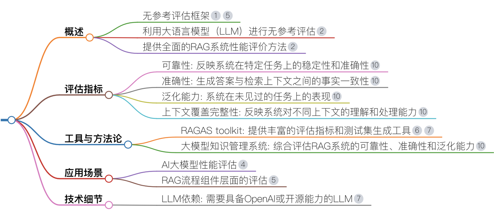

### 4.2.1 数据提取
RAG 流水线中，数据提取是第一步，相对其他步骤来说这一步较为可控。它的目标是保证数据完整、准确、易读，包括

（1） **内容完整**：不要漏掉内容，包括图片、文本、表格等

（2） **内容准确**：比如 PDF 文件中使用 OCR 识别时，尽可能避免识别错误

（3） **关系完整**：比如要保留段落层级关系、图片与图片说明的关系

（4） **元数据完整**：即数据本身的属性，比如文档标题、生成时间，某段字的字体大小、颜色等

#### **==1、对word文件解析逻辑：==**
在 RAG 系统的知识源接入过程中常常需要将 Word 格式的文档内容结构化处理，以便后续向量化、检索与生成。以下是对 `.docx` 文档的标准化解析方案：

-解析流程：

```JSON
（1）文本内容解析
 使用 “python-docx” 库对 .docx 文件进行解析，提取出正文段落、标题等文本内容，并保持文档原有的结构层级（如段落编号、列表等）。

（2）图片内容提取与映射管理
 将文档中的所有插图、截图等图像内容导出至指定的 image_folder 文件夹，并在处理过程中建立 image_map 映射关系：
映射字典的 key：图片在文档中的引用 ID
映射字典的 value：HTML 格式的  标签（指向图片路径）

（3）文档内容再处理与图片嵌入
 在遍历文档正文内容时，若检测到图片引用位置，会动态调用 image_map 中对应的  标签，将其插入至相应文本段落中，实现图文混排。整个处理过程遵循统一的 HTML 拼接逻辑。

（4）生成最终HTML格式文档
 输出结果为包含富文本结构（文本 + 图片）的 HTML 内容块，方便后续用于：向量化切分分块（RAG文档预处理）；检索展示（检索结果高亮/插图还原）；页面预览（用户检索结果直观呈现）
```

**参考代码（dify)**： `api/core/rag/extractor/word_extractor.py`

#### **==2、对pdf文件解析逻辑：==**
**参考代码（dify)**：https://github.com/langgenius/dify/blob/main/api/core/rag/extractor/pdf_extractor.py

构建企业级知识库时，PDF 是极为常见的数据来源。但其天然的“非结构化”特点，相比 Word、HTML 等文档，处理难度和技术复杂度显著更高，原因如下：

（1） **Word / HTML / Markdown**属于 **有标记文档（structured documents）**，天生具备结构化标签（如段落、列表、表格等），计算机可直接解析。

**（2）PDF**则是 **版面呈现驱动的文件格式**，本质上是为“人看”而设计，内容以页面流形式按坐标绘制，不含语义结构信息。

-解析流程：

（1）PDF 文本内容提取：

```JSON
使用如 pdfplumber / PyMuPDF 等工具，对 PDF 页面流进行解析（或者直接用OCR+文档解析）
提取每一页的文字块，并保留其坐标信息（x/y 位置、字体大小、页码等）
输出为结构化的“段落 + 位置信息”集合，为后续重构文档结构做准备
```

补充，pdf解析推荐用MinerU（完全开源，可自由定制和部署）https://github.com/opendatalab/mineru

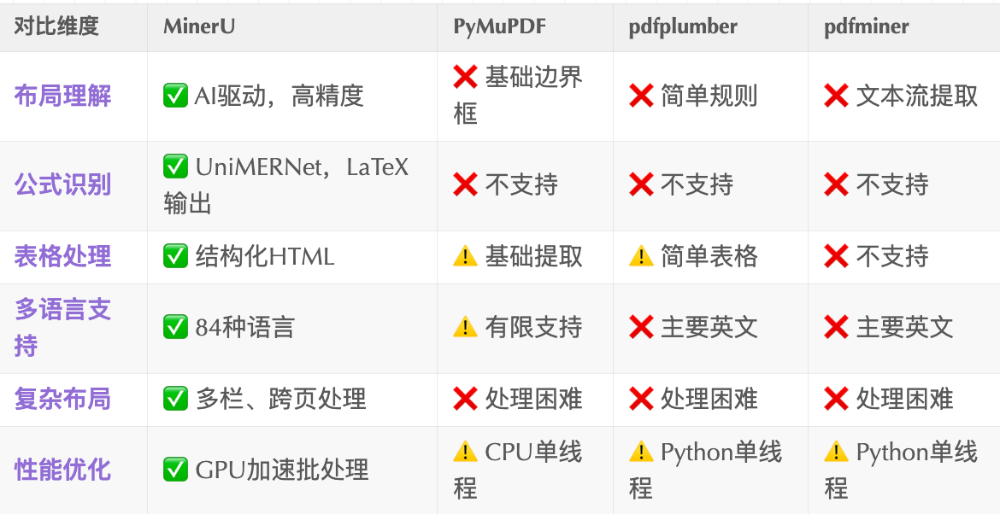

| 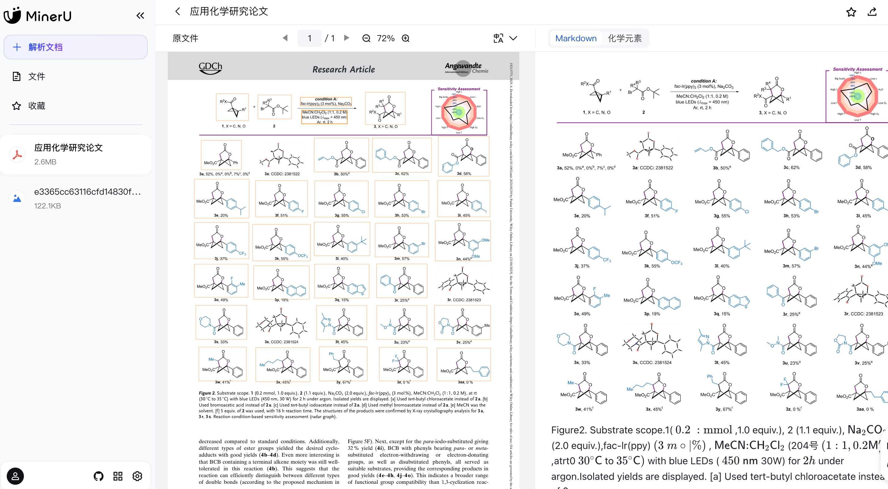 | 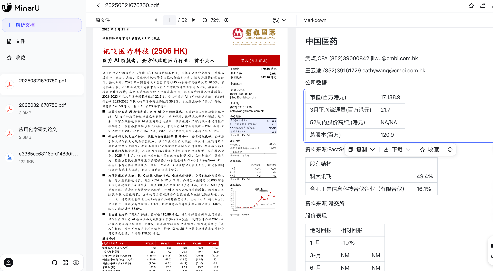 |
| --- | --- |

（2）版面还原与语义聚合：

```JSON
基于字符位置与排版特征，重建段落/标题/列表等结构；
对换行断句等错误进行修复（如段落跨页断裂、空格消失等）；
利用规则/模型判断内容的逻辑层级（如“二级标题”、“表格行”）
```

（3）图文内容同步处理

```JSON
检测文档中出现的嵌入图片（如表单截图、流程图等）；
将图片抽取至 image_folder，并建立 ID ↔ 图片 HTML 映射；
在解析出的文本中插入  标签，形成图文结合的 HTML 片段
```

（4）生成统一格式文档片段

```JSON
最终输出标准 HTML 文本块，每块表示一个段落/图文片段；
用于后续向量化切块、RAG 检索调用、富文本问答展示等流程
```

```Python
【示例伪代码】

from pdfplumber import open as pdf_open

with pdf_open('sample.pdf') as pdf:
    for page in pdf.pages:
        text_blocks = page.extract_words()
        images = page.images
        # 进行位置聚合、语义合并、图像挂载...
```

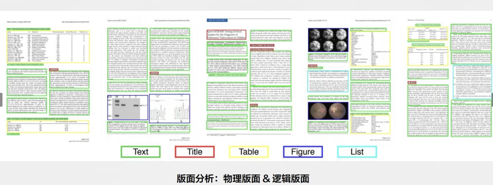

表格的处理：https://github.com/infiniflow/ragflow/tree/main/deepdoc

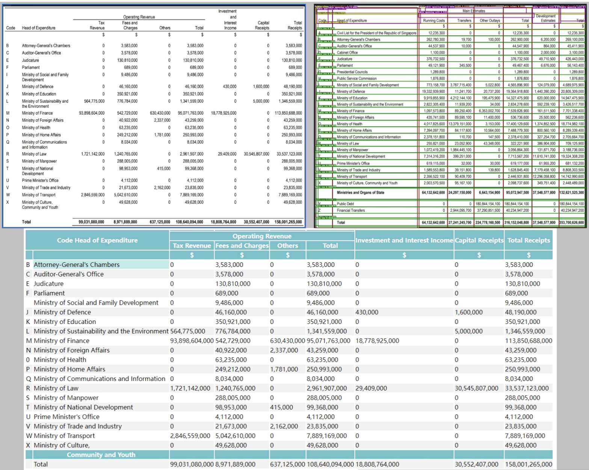

#### **==3、多种文档格式统一解析方案==**
让 RAG 系统支持各种格式的文档（比如 Word、PDF），需要设计一套统一的解析机制，无论什么格式的文件，最后都能变成结构一致的内容格式（比如 HTML 或 JSON），方便后续进行分块、向量化、检索

```JSON
目的：
（1）格式统一：把不同格式的文档转成统一结构（比如统一的 HTML/JSON），后续好做切块、向量化、检索等处理。
（2）准确抽取内容：无论是 Word 还是 PDF，我们都要准确提取里面的正文、标题、图片、结构信息（如段落层级、表格、超链接等）。
（3）灵活扩展格式：设计成模块化架构，支持后续快速接入更多文档格式（比如PPT、扫描件），不用推翻重来。
（4）为后续处理打基础：整理干净的结构化文档数据，是做文本分析、构建索引、向量化检索的基础
——为后续的文本切块、向量生成、知识问答提供高质量的输入，打好“知识输入管道”的地基
```

1、统一接口设计：

所有文档解析器都遵循一个共同的标准接口（ `extract()` 方法），背后继承了一个基础类（BaseExtractor），这样无论解析 Word 还是 PDF，调用方式都是一样的，方便系统统一调度

2、统一的处理流程：

不管上传什么文件都会通过 `extract_processor.py` 这个模块判断文件类型，然后自动选中合适的解析器。最终都会转成一个统一格式的内容结构对象（叫 `Document` ），便于后续使用

（参考代码：https://github.com/langgenius/dify/blob/main/api/core/rag/extractor/extract_processor.py）

（1）Word 文档解析：在 `word_extractor.py` 中提取Word 中的正文内容；把插图单独保存到指定目录；遇到超链接等结构也能正确处理

（2）pdf文档解析：在 `pdf_extractor.py` 中提取 PDF 里的文本，保留页面级的信息，比如第几页、原始坐标等（方便后续还原版面）

#### **==4、跨页表格如何处理？==**
（1）跨页表格处理难度：

```JSON
（1）表头重复：每一页可能都包含相同的表头
（2）行列错位:：页面分割导致行或列不完整
（3）格式不一致：不同页中表格样式、排版存在差异
（4）OCR 识别误差：尤其在扫描件中，文字识别错误影响结构恢复
```

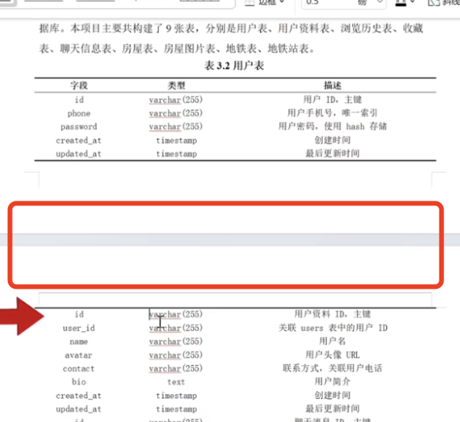

（2）关键技术方案：

```JSON
1.表格结构识别(TSR)

列(Column)
行(ROW)
列标题(Header)
行标题(Row Header)
合并单元格(Merged Cells)
```

```JSON
2.跨页表格合并策略（1）表头一致性检测
使用文本匹配或语义向量判断是否为同一张表的重复表头。

（2）表格位置分析
判断相邻页中的表格是否在文档布局中连续

（3）自动拼接与去重
对于相同表头的多个分页表格，按行拼接，并去除重复的表头行。
```

```JSON
3、结构化输出（json/markdown）：
将合并后的表格转为结构化格式，便于下游模型理解
```

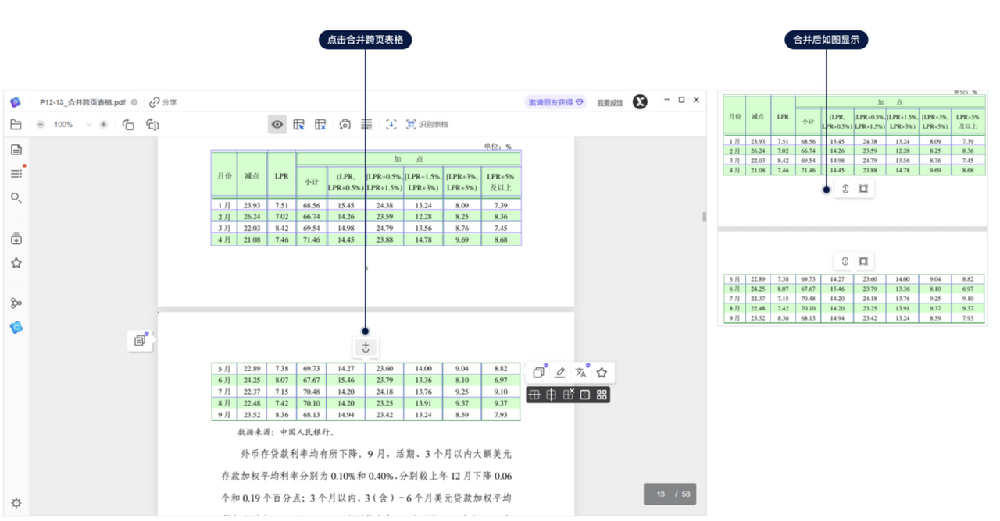

（3）完整流程：

1、布局预测(Layout Predict)

2、文档格式检测(MFD Predict)

3、文档格式识别(MFR Predict)

4、OCR处理：自动检测到使用CPU时切换为ch_lite语言模型

5、表格预测(Table Predict)

（4）操作方法示例（本地部署）

有很多的第三方工具可以处理/如果你在AI公司/互联网大厂也有对应的自研工具（以MinerU举例https://mineru.net/）

https://github.com/opendatalab/MinerU/blob/master/README_zh-CN.md

我使用的是aicoding工具Trae，也可以使用cursor（自行选择）

| 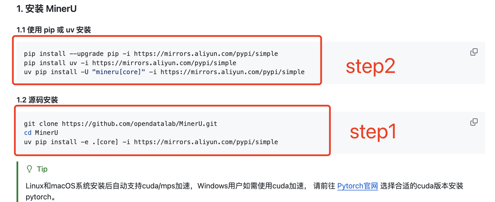 | 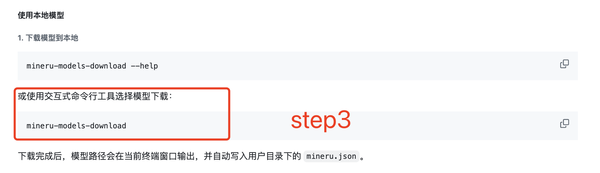 | 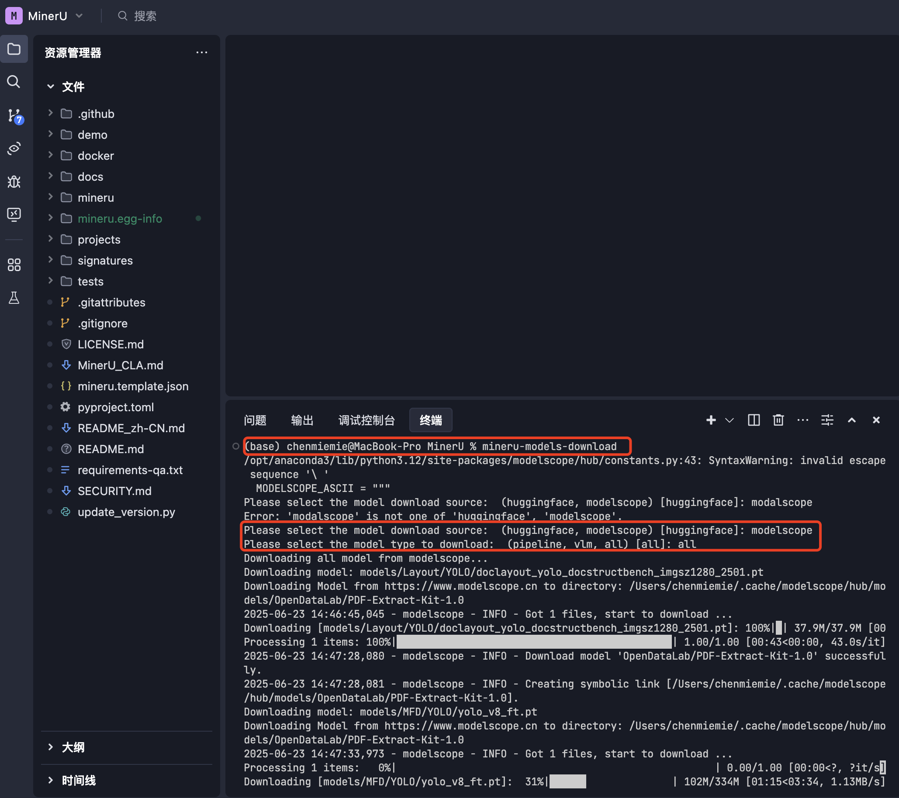 |
| --- | --- | --- |

下载完模型后，可以正式运行，可以自行准备一个pdf，通过和trae 自然语言交互就可以完成pdf/图片的解析，并查看所有“过程”的输出结果（0代码经验不要紧，我也是0代码经验）

| 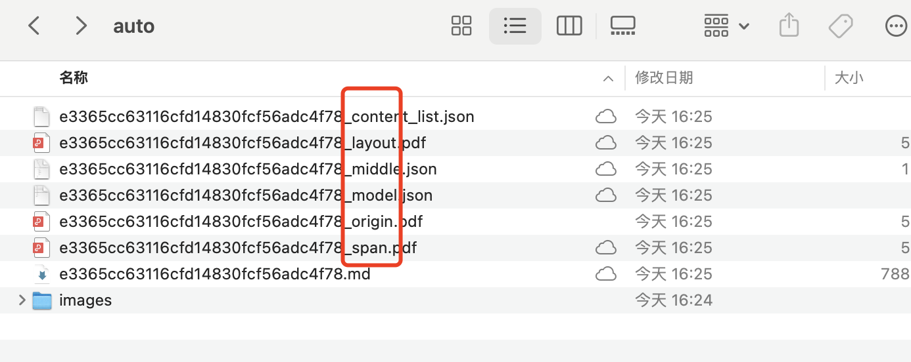 | 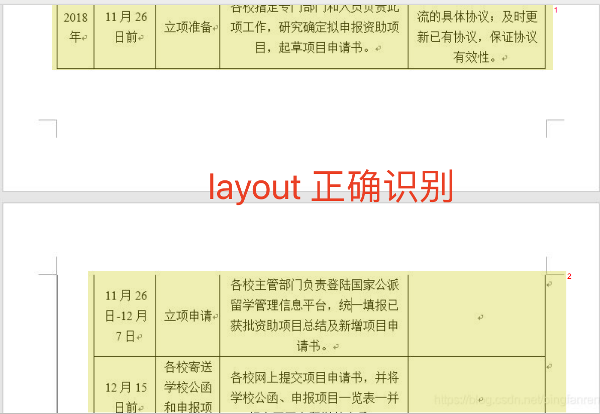 |
| --- | --- |

——以上其实就是RAG的知识库中的一个文件了，其中，d格式和json格式可以基于你的实际场景选择使用

```JSON
你可以把md文件丢给大模型验证下看是否将跨页表格已经拼接正确
```

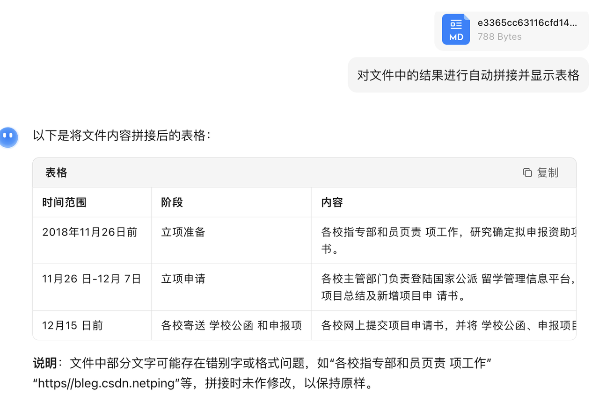

文档解析的过程如下：

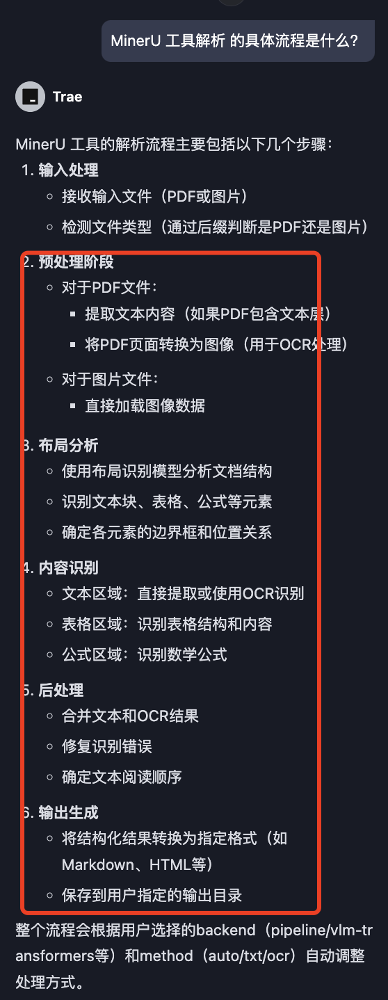

#### 5、【实际中的优化技巧】
**1、数据质量优先：准确性胜过海量堆积**

在构建知识库时， **==高质量的问答数据比大规模冗余数据更具价值。==**对于问答类内容，建议关注以下优化细节：

```JSON
统一问题表达：消除不同问法的差异，统一语义表述，提升语义检索稳定性；
提升答案质量：内容应保持简洁清晰，覆盖用户核心关注点；
定期内容维护：清理过时信息，更新制度、流程等变化类问题；
去重优化：剔除重复或高度相似的问答对，减少干扰项。
```

##### **5.2 元数据驱动：提升检索维度与精准度**
**为每条问答数据配置结构化元信息（通过打标签，看第3点）**，可在检索、排序、推荐等多个层面提供增强能力。例如：

```JSON
{
  "question": "如何申请退款？",
  "answer": "您可在订单详情页面点击页面下方‘申请退款’按钮进行退款申请...",
  "metadata": {
    "category": ["售后服务", "退款"],
    "applicable_products": ["实体商品", "虚拟产品"],
    "last_updated": "2024-05-08",
    "synonyms": ["如何退款", "退款流程", "钱怎么退"]
  }
}
```

| **元字段** | **含义** | **系统增强能力** |
| --- | --- | --- |
| category | 内容的业务类别 | 用于 query → 分类tag → 精准检索 |
| applicable_products | 内容适用的产品范围 | 实现检索过滤/场景限定（提高准确率） |
| last_updated | 内容更新时间 | 可作为排序权重（更新越新，排得越前） |
| synonyms | 用户常见问法别名 | 增强召回能力（query 与答案非直接匹配时也能命中） |

**元数据可支持以下能力扩展：**

```JSON
语义增强与问法扩展（通过别名字段丰富召回方式）
多维度筛选与过滤（按产品类型、服务场景等进行限定）
检索结果排序优化（根据更新时间或适配度动态调整展示顺序）
```

同时建议结合向量检索与结构化字段过滤，实现精准召回与重排序。

3、增加关键词/标签抽取（结构化）本质上其实就是构建结构化的 **元数据体系。**可以显著减轻在线召回压力、提升搜索准确率与整体匹配效果。

（1）标签抽取： **==离线内容理解中最常用也最有效的手段之一。它的核心是将非结构化内容转为结构化字段，供搜索系统命中匹配。==**

假设音乐搜索：

```JSON
用户常搜的是：
歌手名（周杰伦）
歌名（七里香）
风格（说唱/情歌）
作词作曲人、发行时间等
```

如果内容侧已经提前标注好这些字段，就能实现：singer = '周杰伦' → 精准匹配命中

技术手段：

```JSON
NER（命名实体识别）：识别人名、组织、风格等
规则/词典匹配：稳定、效果可控
——准确率高、误召少；可解释性强（字段命中）；用户体验好，点击率提升快
——离线处理量大（需周期性更新）；强依赖业务理解（标签定义靠业务认知）；不通用（每个垂类需定制）
```

（1）NER（命名实体识别，Named Entity Recognition）：

**==目标是从文本中识别出有意义的实体片段，比如人名、地名、机构名、产品名、时间、金额、类别标签等==**

比如：“周杰伦于2024年在北京鸟巢举办演唱会。”

```JSON
NER输出结果：
[
  {"text": "周杰伦", "type": "PERSON"},
  {"text": "2024年", "type": "DATE"},
  {"text": "北京鸟巢", "type": "LOCATION"}
]
```

（2）实现的3种方式：

| **方法** | **技术路线** | **特点** | **难易程度** |
| --- | --- | --- | --- |
| 1. 词典匹配 | 规则+词表 | 简单、快、可控，适合垂类场景 | 最简单 |
| 2. 序列标注模型（BiLSTM-CRF / BERT） | token级别打标签 | 主流方案，效果好，支持训练 | 中等，目前最常用 |
| 3. Prompt+大模型提取 | LLM+Prompt | 零样本/小样本能力强，但慢、不稳定 | 最难 |

（3）实际落地流程：

明确要识别的实体类型（结合业务）比如：在电商内容中识别：商品名 / 品类 / 品牌 / 使用场景 / 功能成分等

准备训练数据（含标注）：可以从已有内容中抽样标注

常用标注工具：HuggingFace Transformers、PaddleNLP、HanLP

训练小模型（如 BERT-CRF）

```JSON
可选预训练模型：bert-base-chinese、hfl/chinese-bert-wwm
输入：token序列 → 输出：标签序列
```

| **具体步骤** | **通俗解释** |
| --- | --- |
| 使用 BERT 处理输入 | 像让一个聪明的大脑看一句话，理解每个字的上下文含义 |
| 让模型对每个字打标签 | 比如“周”是人名的开始，就标“B-PER”， “杰伦”是继续，就标“I-PER”，空白词标“O” |
| 用 CRF 保证句子级别的合理性 | CRF像一个“规则检查员”，它保证识别出来的标签顺序不会太奇怪，比如不会出现“I-PER”前面没有“B-PER” |

**预测 + 后处理：**用NER模型识别出来一堆“实体”，然后要做“清洗、整理、标准化”，最后存入数据库当成“结构化字段”（元数据），让系统用起来

（1）多段内容批量提取实体

```JSON
比如有这些内容：
1. 京东物流今天发货，预计三天送达。
2. 商品由京东发货，时效稳定。
3. 这次用的是京东快递。

NER模型会从每一条中抽出实体，如：
[
  "京东物流", "京东", "京东快递"
]
```

（2）去重、归一化（标准化表达）：

抽出来的这些词其实都在说一个意思，但 **名字写法不一样**，如果直接当成3个标签，系统就“认为是3个品牌”了，出错。所以要做的事情是：把“京东物流”、“京东快递”都映射成“京东”（这一步就叫“归一化”或“标准化命名”）

（3）存入元数据字段（结构化使用）：把处理干净的标签，放进一段内容的“元数据”里，供后续用

```JSON
原始内容：
“本商品由京东快递发货，支持7天无理由退货。”

NER + 清洗之后，存储结构就变成：
{
  "content": "本商品由京东快递发货...",
  "metadata": {
    "logistics_provider": "京东"-》  （抽取并归一化后得到）
    "support_policy": "7天退货"
  }
}
这个结构化数据可以支持后续：搜索时命中关键词：“我只看京东发货的”；做精细推荐：“偏好京东物流的用户推荐XX”
```

#### 6、国内文档解析 chatdoc最佳实践
https://www.modelscope.cn/models/ChatDOC/OCRFlux-3B 开源应该是目前做的最好的了（ **支持跨页表格/段落合并，这是所有开源项目中首个支持此功能的**）

https://chatdoc.site/ 体验地址

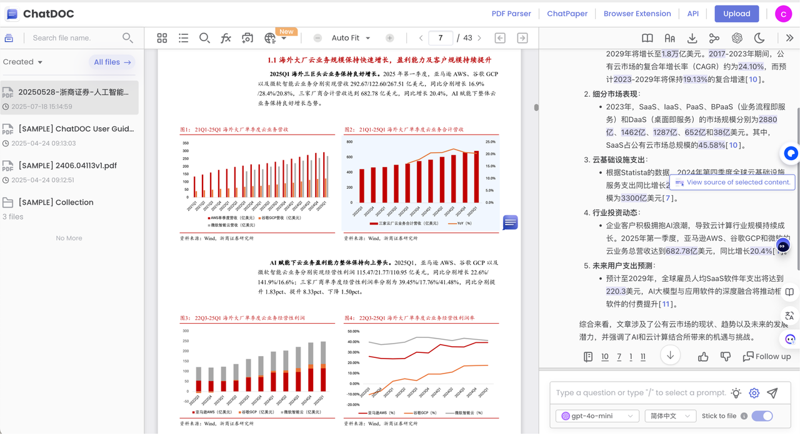

**划词细粒度溯源-TapSource****（支持对答案中的任何部分溯源，划选任意想溯源的文本片段，细粒度定位到原文中相关的句子、表格单元格等内容）**

文档解析任务中， **不同粒度的抽取目标对处理复杂度提出了不同要求**。 **当前很多产品都只是链接到原文的某个页面，或者某个页面的某个段落，但仍需用户在该页面中搜索具体的相关内容**

```SQL
（1）若仅进行页面级抽取，只需记录目标文本所在的页面信息。然而，现实场景中常出现段落或表格跨页的情况，导致简单的页面索引不足以满足需求。

（2）对于段落级处理，则需对文档结构进行精确解析，解决段落合并与阅读顺序判定等问题。

（3）当粒度进一步细化至句子级或span级（字符、词组），处理难度显著提升。尤其对于表格类元素，需要完成单元格级别的精确切分与定位，特别是跨行或跨列的合并单元格。此过程不仅要求检测单元格所在页面的边界框，还需重建表格的行列结构，并将OCR识别结果与结构信息进行对齐，以确保内容抽取的完整性与准确性。
```

溯源到原文表格（单元格颗粒度）；溯源到原文句子

| 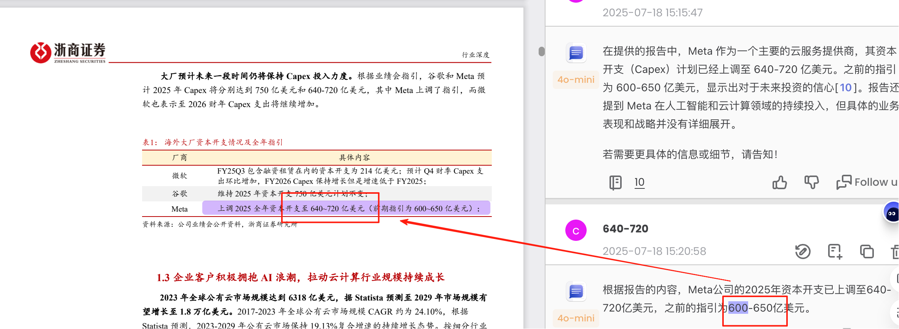 | 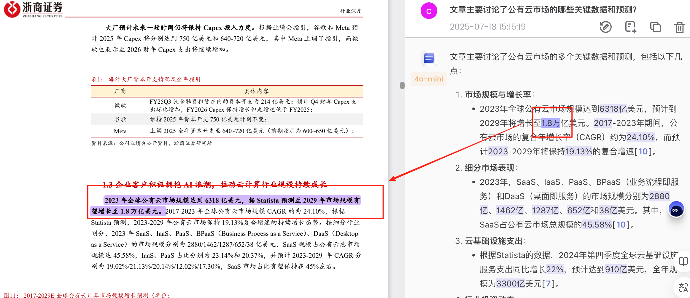 |
| --- | --- |

此外，单独训了目录结构模型：

```SQL
章节目录树，是一种层次化结构，展示了文档各章节及其子章节的组织方式，帮助明确文档框架并便于定位和引用特定内容，通常以树形结构呈现，其中根节点表示文档的整体内容，每个分支节点代表一个章节或小节，从而形成清晰的层次结构
```

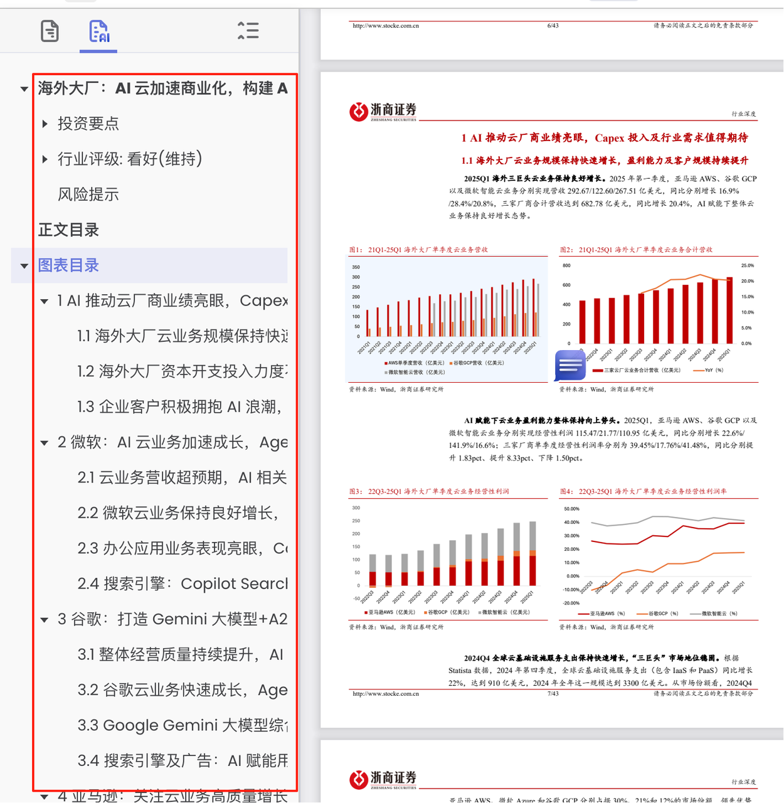

#### 7、OCR
##### 1、百度PaddleOCR拓展-5个有用的模块
（1）OCR识别时，常见的5类错误：

```SQL
识别字符时出现误判
部分文字被遗漏未识别
同一文字重复识别多次
文本格式出现混乱
对特殊符号的识别不准确
```

这些问题通常由以下几种因素引起：

```SQL
图像清晰度较差
字体样式复杂
背景元素干扰识别效果
算法性能或模型局限性
```

**大模型+OCR方案：**

```SQL
（1）OCR：使用 PaddleOCR 5 识别输入图像，得到初步文本结果
（2）LLM纠错：将OCR后的文本输入LLM，由LLM进行语义纠错和优化

流程：
[图片] → [PaddleOCR 5] → [初步OCR文本] → [LLM纠错] → [处理后最终文本]
```

**示例：使用百度飞桨：PP-ChatOCRv4 示例：**

```Python
from paddleocr import PPChatOCRv4Doc
import  os
BCE_API_KEY = os.environ.get("BCE_API_KEY")

chat_bot_config = {
    "module_name": "chat_bot",
    "model_name": "ernie-4.0-8k",
    "base_url": "https://qianfan.baidubce.com/v2",
    "api_type": "openai",
    "api_key": BCE_API_KEY,  # your api_key
}

retriever_config = {
    "module_name": "retriever",
    "model_name": "embedding-v1",
    "base_url": "https://qianfan.baidubce.com/v2",
    "api_type": "qianfan",
    "api_key": BCE_API_KEY,  # your api_key
}

pipeline = PPChatOCRv4Doc(
    use_doc_orientation_classify=False,
    use_doc_unwarping=False
)

visual_predict_res = pipeline.visual_predict(
    input="https://paddle-model-ecology.bj.bcebos.com/paddlex/imgs/demo_image/vehicle_certificate-1.png",
    use_common_ocr=True,
    use_seal_recognition=True,
    use_table_recognition=True,
)

mllm_predict_info = None
use_mllm = False
# 如果使用多模态大模型，需要启动本地 mllm 服务，可以参考文档：https://github.com/PaddlePaddle/PaddleX/blob/release/3.0/docs/pipeline_usage/tutorials/vlm_pipelines/doc_understanding.md 进行部署，并更新 mllm_chat_bot_config 配置。
if use_mllm:
    mllm_chat_bot_config = {
        "module_name": "chat_bot",
        "model_name": "PP-DocBee",
        "base_url": "http://127.0.0.1:8080/",  # your local mllm service url
        "api_type": "openai",
        "api_key": "api_key",  # your api_key
    }

    mllm_predict_res = pipeline.mllm_pred(
        input="https://paddle-model-ecology.bj.bcebos.com/paddlex/imgs/demo_image/vehicle_certificate-1.png",
        key_list=["xxxxx"],
        mllm_chat_bot_config=mllm_chat_bot_config,
    )
    mllm_predict_info = mllm_predict_res["mllm_res"]

visual_info_list = []
for res in visual_predict_res:
    visual_info_list.append(res["visual_info"])
    layout_parsing_result = res["layout_parsing_result"]

vector_info = pipeline.build_vector(
    visual_info_list, flag_save_bytes_vector=True, retriever_config=retriever_config
)
chat_result = pipeline.chat(
    key_list=["xxxxxxx"],
    visual_info=visual_info_list,
    vector_info=vector_info,
    mllm_predict_info=mllm_predict_info,
    chat_bot_config=chat_bot_config,
    retriever_config=retriever_config,
)

print(chat_result)
```

**==【版面区域检测】和【文本图像校正】保证图像信息完整==**

但有时并不想使用完整的 OCR 流程，而是希望利用其中的某些模块来增强自己的系统，可参考PaddleOCR

```Python
PaddleOCR 不仅是一个整体 OCR 工具包，还提供了多个可独立调用的功能模块，例如：

-  文本图像矫正（Text Image Unwarping）：专门处理图像扭曲、图像不完整的
-  版面区域检测（Layout Detection）
可以用来专门处理图像扭曲、图像不完整的特殊复杂情况。这两个模块可以提升图像质量、定位关键区域、避免冗余信息干扰。
```

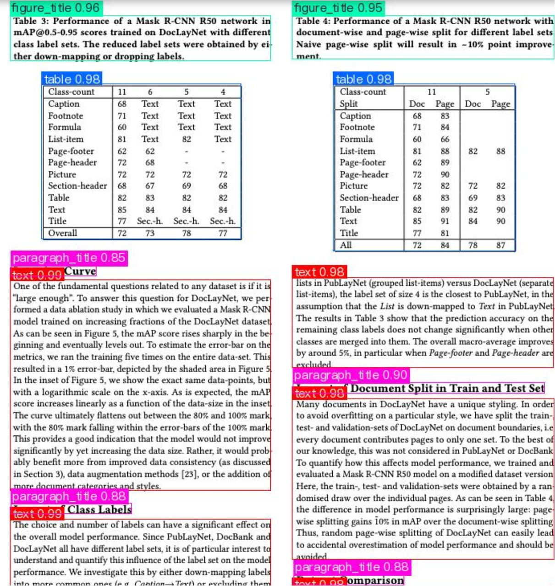

**【版面区域检测】**(https://paddlepaddle.github.io/PaddleX/latest/module_usage/tutorials/ocr_modules/layout_detection.html#_2)

```Python
from paddlex import create_model

model_name = "PP-DocLayout_plus-L"
model = create_model(model_name=model_name)
output = model.predict("layout.jpg", batch_size=1, layout_nms=True)

for res in output:
    res.print()
    res.save_to_img(save_path="./output/")
    res.save_to_json(save_path="./output/res.json")
```

支持模型列表：

| 模型 | mAP(0.5) (%) | GPU推理耗时 (ms) | CPU推理耗时 (ms) | 模型大小 (MB) | 描述 |
| --- | --- | --- | --- | --- | --- |
| PP-DocLayout-L | 90.4 | 34.62 / 10.39 | 510.57 / - | 123.76 | 高精度版面区域定位模型 |
| PP-DocLayout-M | 75.2 | 13.33 / 4.87 | 44.07 / 44.07 | 22.58 | 精度效率平衡模型 |
| PP-DocLayout-S | 70.9 | 8.30 / 2.38 | 10.06 / 9.93 | 4.83 | 高效率模型 |

**【文本图像校正模块】https://paddlepaddle.github.io/PaddleX/latest/module_usage/tutorials/ocr_modules/text_image_unwarping.html#_4**

针对图像进行几何变换，以纠正图像中的文档扭曲、倾斜、透视变形等问题，以供后续的文本识别进行更加准确

支持模型列表：

| 模型 | CER | GPU推理耗时（ms） [常规模式 / 高性能模式] | CPU推理耗时（ms） [常规模式 / 高性能模式] | 模型存储大小（MB） | 介绍 |
| --- | --- | --- | --- | --- | --- |
| UVDoc |  | 19.05 / 19.05 | - / 869.82 |  | 高精度文本图像矫正模型 |

**【表格处理模块】**

```Python
- 表格分类模块
- 表格单元格检测模块
- 表格结构识别模块
```

| **模块名称** | **主要功能** | **解决问题示例** |
| --- | --- | --- |
| 表格分类模块 | 对 **表格图像进行分类（如有线表、无线表等**） | 为后续识别流程提供先验信息 |
| 表格单元格检测模块 | **定位并标记每个单元格的边界框** | 精准划分单元格区域，便于内容提取 |
| 表格结构识别模块 | 将 **表格图像转换为可编辑的 HTML 结构** | 实现表格结构还原和语义理解 |

（1）表格分类：https://paddlepaddle.github.io/PaddleX/latest/module_usage/tutorials/ocr_modules/table_classification.html#_4

举例：（0.84是置信度）

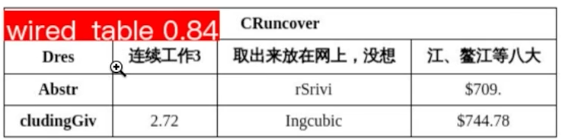

（2）单元格检测：https://paddlepaddle.github.io/PaddleX/latest/module_usage/tutorials/ocr_modules/table_cells_detection.html

（3）表格结构识别：https://paddlepaddle.github.io/PaddleX/latest/module_usage/tutorials/ocr_modules/table_structure_recognition.html

做完以上3步再做ocr

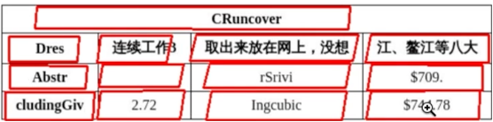

##### （补充）多模态RAG识别-开源模型PaddleOCR-VL，0.9B，轻量、多语言、高精度，“多模态文档解析”（10.16发布）
https://huggingface.co/collections/PaddlePaddle/paddleocr-vl-68f0db852483c7af0bc86849

https://huggingface.co/spaces/PaddlePaddle/PaddleOCR-VL_Online_Demo

```Python
能从复杂文档中识别并理解：
        •        文字内容（包括手写、印刷、多语言）
        •        表格结构
        •        数学公式（转为 LaTeX）
        •        图表（转为可计算数据）

特点：
        •        体积小（仅 0.9B 参数），但性能媲美 70B–200B 级大模型；
        •        支持 109 种语言；
        •        速度快、资源占用低；
        •        多个评测中 SOTA
```

```Python
PaddleOCR-VL 由两个核心模块组成：1. PP-DocLayoutV2：布局分析模块
负责“看懂”文档结构——识别出哪里是文字块、表格、图片、公式、图表等，并确定它们的阅读顺序。
它用了一种叫 RT-DETR 的目标检测算法，配合一种“指针网络”预测阅读顺序，既快又稳。

2. PaddleOCR-VL-0.9B：视觉语言识别模块
负责“读懂”每个区域的内容。
采用：
        •        NaViT 动态分辨率视觉编码器：能灵活处理不同大小的图片；
        •        ERNIE-4.5-0.3B 语言模型：百度自研的小型多语言模型；
        •        两者融合后，既能看懂视觉信息，也能生成结构化文本（如 Markdown 或 JSON）。

具体流程：
第一阶段：PP-DocLayoutV2负责版面分析，定位语义区域并预测其阅读顺序。
第二阶段：PaddleOCR-VL-0.9B基于这些版面预测，对文本、表格、公式和图表等多样化内容进行细粒度识别。
最后：聚合两个阶段的输出，并将最终待预测文档化为结构化的Markdown和JSON文件
```

| 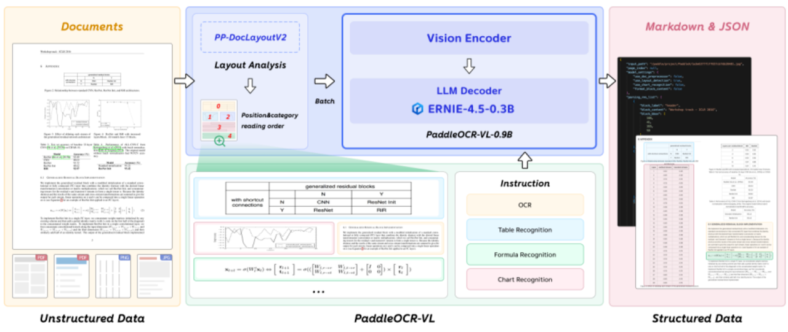 | 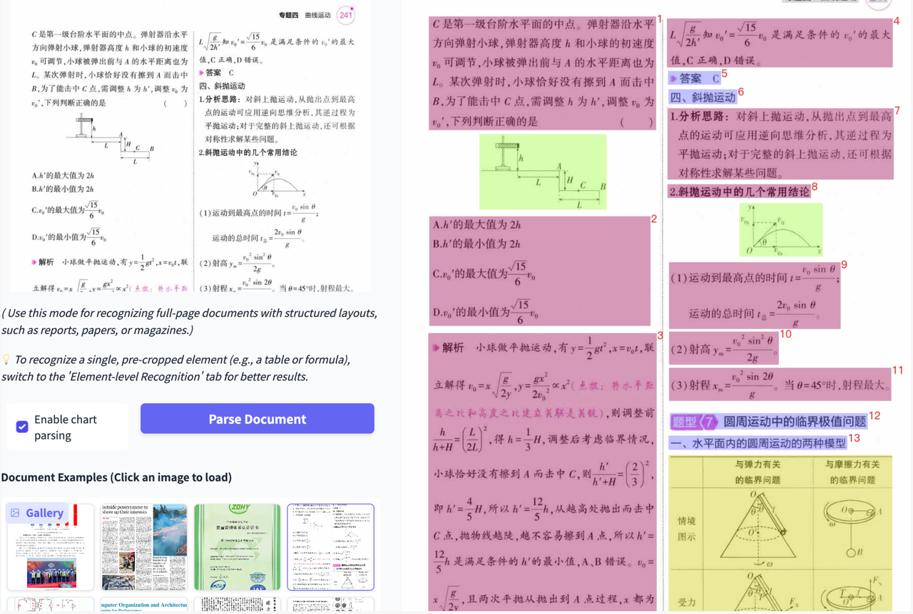 |
| --- | --- |

**PaddleOCR-VL每秒可处理1881个Token**，推理速度较MinerU2.5 **提升14.2%**，较dots.ocr **提升253.01%**。在当前主流开源多模态OCR方案中，PaddleOCR-VL展现出显著的速度优势。

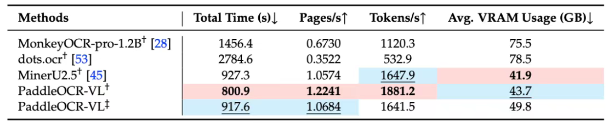

##### 2、多模态RAG识别-最强开源OCR模型：olmOCR（结合OCR+vlm能力）
https://olmocr.allenai.org/

https://github.com/allenai/olmocr

https://huggingface.co/collections/allenai/olmocr-67af8630b0062a25bf1b54a1

与百度OCR（纯视觉识别解决方案）相比，olmOCR是基于多模态大语言模型微调（qwen2.5-vl-7B-Instruct）的模型，不仅是视觉解决方案，也是语义理解解决方案。olmOCR是目前业内公认的最强开源基于语义和视觉推理能力的OCR模型

```Python
PDF 转 Markdown的重要性：

1、在多模态 RAG 系统中，"PDF → Markdown (MD)" 是整个流程中至关重要的一步。PDF 文件通常基于版面和坐标排版，而我们需要的文本应该是可以被拆分并且结构清晰的，便于检索和处理。将 PDF 转换为 MD 后，标题、段落、列表、表格和公式等内容都会被清晰地提取出来，这样可以为后续的处理提供更多的便利。

2、当前技术中，关于“PDF → MD”的转换有两种主要的工具路径：olmOCR 和 MinerU。
olmOCR：这是由 AI2 开源的工具，基于视觉-语言模型进行高质量的 PDF 转 MD 线性化。它特别适合处理包含复杂元素（如公式、表格和手写体）的 PDF，并且支持高质量的推理和大规模部署。它非常适合用作“文本轨”处理的起点，可以与后续的结构化和检索流程结合使用。
MinerU：这是一个一站式的开源工具链，专注于 PDF → Markdown/JSON 转换，尤其在科研文献等领域中表现突出。它方便与抽取和标注流程对接，特别适合需要处理和分析学术文献的场景。
```

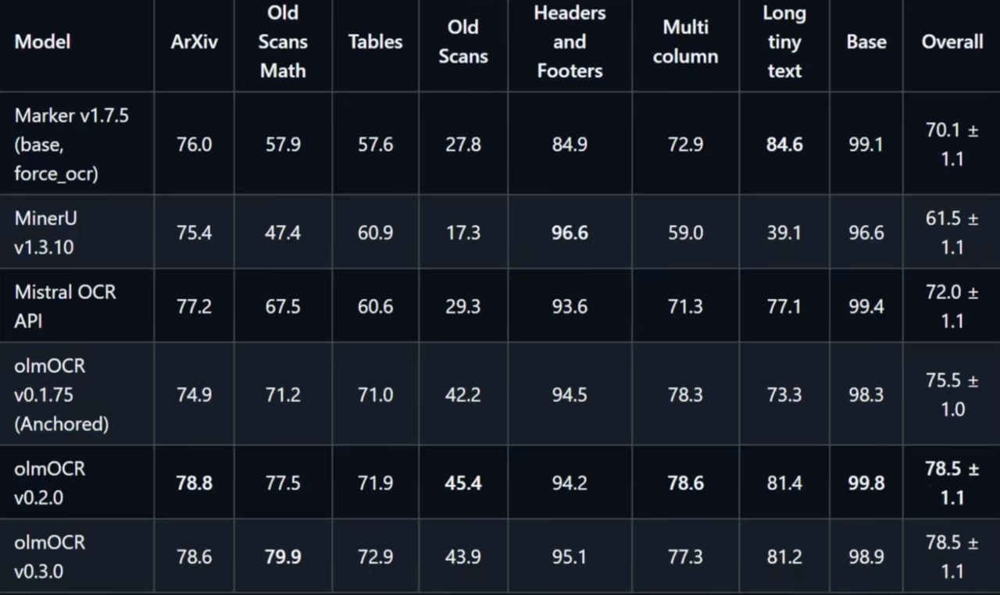

olmOCR只支持本地部署，硬件条件：NVIDIA GPU，建议显存 15GB及以上（RTX4090，A100、H100磁盘需30GB）

olmOCR模型微调数据集： https://huggingface.co/datasets/allenai/olmOCR-mix-0225

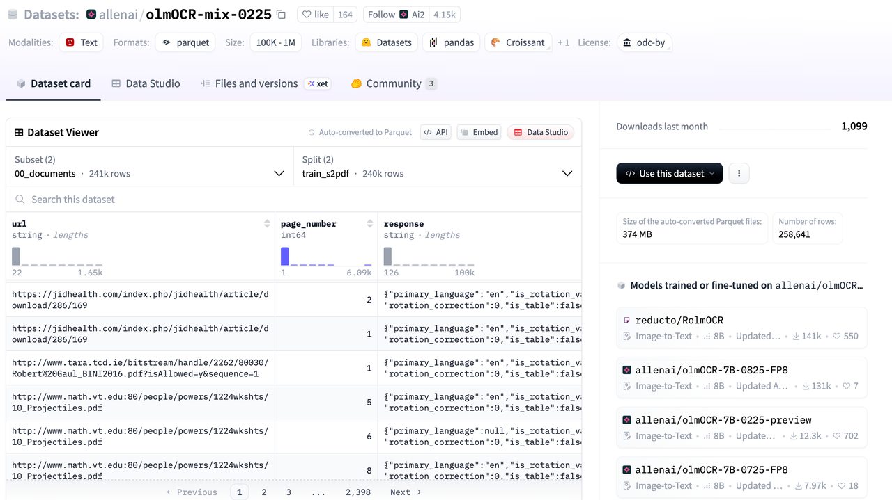

可以通过olmOCR来实现对于图片的核心解析，包括内容提取和图片描述行解释信息，且解析内容很规范，还能对部分信息进行补齐

| 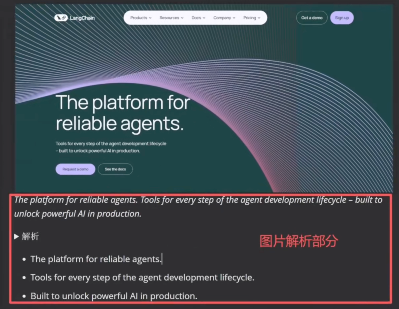 | 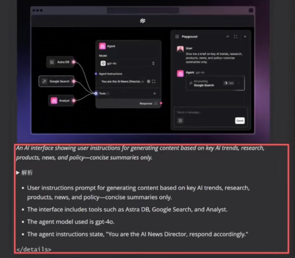 |
| --- | --- |

MinerU相对于olmOCR更加简单，且可以实现在线解析，在线api不收费，但是准确率相对于olmOCR较低，且本地部署相对复杂

#### **8、可配置、可扩展的自动化文档预处理pipeline（4步）**
PDF 文件上传

→ [PaddleOCR API]

→ 提取文本

→ [预处理/分块/添加元数据]

→ 通过API接入Dify

→ 知识库同步及更新

```Python
def main(pdf_path):
    config = load_config()  # 加载配置文件 [[4]]

    # 1. OCR 提取文本
    ocr_engine = OCREngine(config)
    raw_text = ocr_engine.extract_text(pdf_path)

    # 2. 文本预处理与分段
    processor = TextProcessor(config)
    cleaned_text = processor.preprocess(raw_text)
    segments = processor.segment(cleaned_text)

    # 3. 上传至 Dify
    uploader = DifyUploader(config)
    document_id = uploader.upload_by_text(segments)

    # 4. 绑定元数据
    bind_metadata(document_id, config, pdf_path)

if __name__ == "__main__":
    main("example.pdf")
```

**1、PDF 文件上传 ，提取文本（PaddleOCR API）**

调用 PaddleOCR 提取 PDF 中的文本，支持多语言和复杂排版。

伪代码示例如下：OCRengine 可以根据情况选择接入哪个api服务

```Python
import requests

class OCREngine
    def __init__(self, config):
        self.api_url = config["ocr"]["api_url"]  # 从配置加载 OCR API 地址
        self.high_precision = config["ocr"].get("high_precision", False)

    def extract_text(self, file_path):
        """调用 PaddleOCR API 提取 PDF 文本"""
        with open(file_path, "rb") as f:
            files = {"file": f}
            response = requests.post(self.api_url, files=files)
        if response.status_code == 200:
            return response.json()["text"]
        else:
            raise Exception(f"OCR 提取失败: {response.text}")
```

**2、文本预处理、分段**

清洗 OCR 文本并按配置规则分段（黄色部分是文本清洗（空格、url在知识库中没意义、和决定分块策略）

伪代码示例如下：

```Python
import re

class TextProcessor:
    def __init__(self, config):
        self.config = config
        self.rules = config["dify"]["process_rules"]

    def preprocess(self, text):
        """应用预处理规则（如去空格、去 URL）"""        if self.rules["pre_processing"][0]["enabled"]:            text = re.sub(r"\s+", " ", text)  # 去除多余空格 [[7]]        return text

    def segment(self, text):
        """按配置分段（如按标题分割）"""        separator = self.rules["segmentation"]["separator"]        return re.split(separator, text)  # 分段逻辑 [[7]]
```

**3、调用 Dify API 上传文件，添加元数据**

伪代码示例如下：

```Python
import requests
import json

class DifyUploader:
    def __init__(self, config):
        self.api_key = config["dify"]["api_key"]
        self.dataset_id = config["dify"]["dataset_id"]
        self.base_url = f"https://api.dify.ai/v1/datasets/ {self.dataset_id}"

    def upload_by_text(self, segments):
        """通过文本创建文档"""
        headers = {"Authorization": f"Bearer {self.api_key}", "Content-Type": "application/json"}
        for i, content in enumerate(segments):
            payload = {
                "name": f"segment_{i}.txt",
                "text": content,
                "indexing_technique": "high_quality",
                "process_rule": self.rules  # 从配置加载分段规则 [[7]]
            }
            response = requests.post(f"{self.base_url}/document/create_by_text", headers=headers, data=json.dumps(payload))
            print(f"Segment {i} uploaded: {response.status_code}")
        return response.json()["document"]["id"]
```

**4、根据配置动态绑定元数据字段**

伪代码示例如下：

```Python
def bind_metadata(document_id, config, filename):
    """动态绑定元数据（如从文件名提取来源）"""
    url = f"https://api.dify.ai/v1/datasets/ {config['dify']['dataset_id']}/documents/metadata"
    headers = {"Authorization": f"Bearer {config['dify']['api_key']}", "Content-Type": "application/json"}
    metadata_list = []
    for field in config["metadata"]["fields"]:
        value = field["value"]
        if field["value_from"] == "filename":
            value = filename  # 从文件名动态赋值 [[7]]
        metadata_list.append({
            "id": generate_metadata_id(field["name"]),  # 从 Dify API 获取字段 ID
            "value": value,
            "name": field["name"]
        })
    payload = {"operation_data": [{"document_id": document_id, "metadata_list": metadata_list}]}
    requests.post(url, headers=headers, data=json.dumps(payload))
```

同时，支持异步处理pdf（如增加定时任务 定期从文件夹下同步文件，经过文档与处理后上传至dify）

伪代码示例如下：

```Python
rom celery import Celery

app = Celery('tasks', broker='redis://localhost:6379/0')

@app.task
def process_pdf_async(pdf_path):
    config = load_config()
    ocr_engine = OCREngine(config)
    raw_text = ocr_engine.extract_text(pdf_path)

    processor = TextProcessor(config)
    cleaned_text = processor.preprocess(raw_text)
    segments = processor.segment(cleaned_text)

    uploader = DifyUploader(config)
    document_id = uploader.upload_by_text(segments)

    bind_metadata(document_id, config, pdf_path)
```

#### 9、多模态语料如何处理
1、音频怎么处理（如会议录音、播客等）

**最小可行做法（先跑通）：**

（1）转文字（ASR）：先用语音识别（ASR）把整段音频转成文字，自动生成时间戳（如：10:12–10:40）。

（2）切块：每 20–40 秒切成一段，段与段之间重叠2–3秒，每段都保留开始/结束时间，避免语义被切断（每段保留 {text, start, end, audio_path} 四元组，方便后续拼接）。

（3）构建索引：建立语义索引和关键词索引（方便检索时按关键词/语义快速检索）。

（4）检索流程：用户提问 → 在索引中检索 → 找到相关切块 → 按时间顺序拼接， 返回文本答案→ 附上时间戳跳转，支持“回溯原音频”。

2、视频怎么处理（如课程、直播、产品演示）

**最小可行做法（先跑通）：先用最低成本跑通“音轨问答”，再按需叠加“画面信息”**

（1）抽取音轨：参照音频流程做（ASR → 切块 → 索引），快速覆盖大部分基于口述内容的问题

（2）进阶：补画面信息（两步）

关键帧/关键页：镜头切换检测（如在 PPT 翻页/镜头切换）时，自动抓一张截图，作为“视觉书签”。

OCR 识别：对截图做文字识别，提取出标题、要点、表格、代码等。（输出：{timestamp, image_path, ocr_text}）

把识别出的文字切块，并和 时间戳、截图地址绑定。

用户提问时，系统既能在音轨文字里找到答案，也能在截图文字里定位关键信息，并能返回“相关画面”。

#### **（补充）为视频构建 RAG**
假设视频为讲座录像、会议录像、主题演讲、教学方法和分步视频。实际场景中，不需要关注来自音频的情感信息，也不需要保留视觉效果中的动作。

1、视频提取和检索的系统架构（如下）：

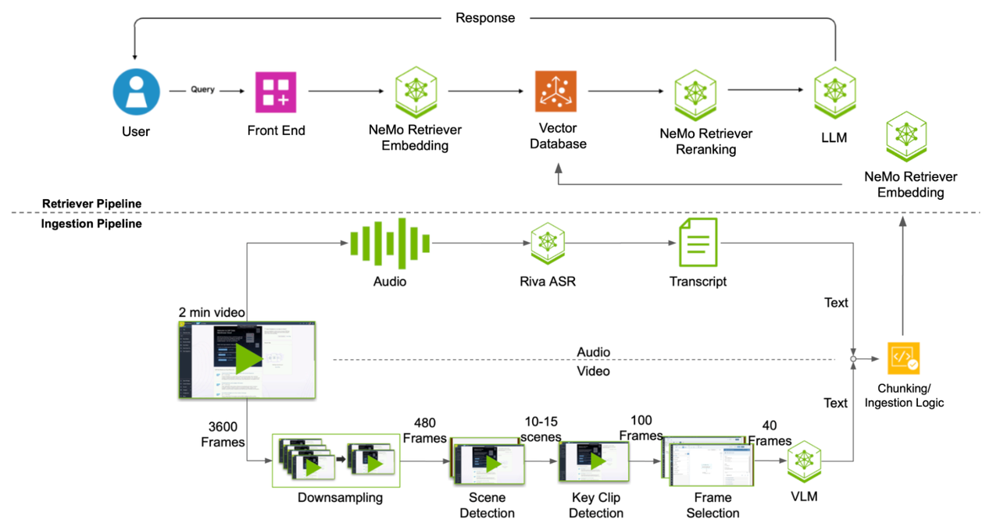

2、音频提取：

从视频里抽取音频， **通过ASR转成文字**。 **除了文本，要记录词语的时间戳，方便后续能定位到视频的具体时刻**

3、视频提取（专注于降低处理视频和从帧中提取信息的成本）

（1） **不需要保留所有帧（比如每秒几十张），而是挑选“最有信息量”的关键帧，包括3个步骤：**

a）用镜头边界检测把视频切分成章节：可以使用经典的计算机视觉技术，利用不断变化的 [__色彩空间 __](https://www.scenedetect.com/docs/latest/api/detectors.html)中的图案，或利用 [__镜头检测模型 __](https://arxiv.org/pdf/2008.04838)。需要进行章节化，以创建本地上下文来判断帧中存在的信息。

b）在每个章节里找出视觉上最有代表性的片段（比如 PPT 切换、出现新内容）：需要识别视觉效果在感知上独特或捕捉某些独特活动的所有片段。这可以使用 image encoder 或 signal processing filter 来完成，后者可以在两个连续帧中捕获差异。

c） **去噪声**：剔除模糊帧和重复帧，只保留信息密度高的帧。

（2） **图像理解**：把这些关键帧送进 **视觉大模型（VLM）**，提取屏幕里的文字、图表，并生成语义描述。

4、融合音频和视频信息

把音频转录得到的文本和视频关键帧提取的信息合在一起。 **最终得到一个统一的视频文本表示，包含讲解内容、幻灯片文字、时间戳。**

5、构建检索库

把这些文本切分成块，并附带元数据（比如时间戳、文件名、帧号）。用embedding模型把它们转成向量，存进向量数据库。

6、用户提问 & 答案生成（举例如图）

用户提问时，问题转成向量，用来检索最相关的片段。系统会挑选相关的文字块（带时间戳），拼接成上下文，交给大模型生成答案。回答时还能给出 **出处引用**（比如「见视频 12:30-12:45」），让结果可追溯。（如图）

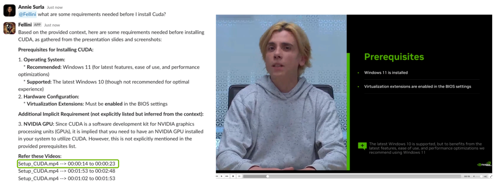

#### （补充）建筑行业知识库-CAD 平面图如何处理？
示例：


1、实现方案：

双轨并行：结构化为准，语义描述为辅 **==（原图：看图 + 抽数据，搜索：语义 + 精确搜索，结果做组装整合）==**

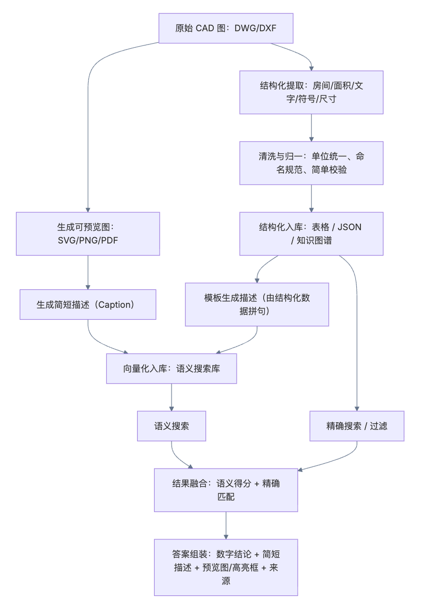

```Python
（1）结构化：把图纸关键信息变成表格数据（房间名称、面积、出口数量…），方便精确查询和统计。
（2）语义描述：形成图纸描述的简短文字，方便模糊搜索与展示（比如“这层有 4 个会议室，2 条走廊，3 个安全出口”）
```

（1）结构化数据

适用于精确问题，如：面积多少？；有几个出口？等

```JSON
JSON如下：

{
  "file_id": "projA_3F_v2",
  "floor": "3F",
  "rooms": [
    {"id":"3F-023","name":"会议室A","area_m2":42.5,"labels":["会议室"],"exits":1},
    {"id":"3F-024","name":"会议室B","area_m2":35.2,"labels":["会议室"],"exits":1},
    {"id":"3F-030","name":"财务室","area_m2":28.0,"labels":["办公室"],"exits":0}
  ],
  "symbols": [
    {"type":"安全出口","count":3},
    {"type":"消防栓","count":2}
  ]
}
```

（2）语义描述

适用于模糊问题，如：这层布局怎样？

```Python
三层平面图，包含 4 间会议室（最大 52 m²）、1 处开放办公区、2 条走廊；
设置 3 个安全出口、2 处消防栓，会议室主要分布在东侧。

处理方式：
 A. 根据结构化数据“拼装”；
 B. 把图导出成图片，用多模态模型生成描述性语言在做召回（准确性存在问题）
```

2、处理流程：

（1）文档准备：

```Python
（1）格式：保留原始 CAD（DWG/DXF），同时生成预览图（SVG/PNG 或 PDF）：方便网页看图和截取小块截图。
（2）命名与标签：统一命名，例如：“项目A_建筑_施工图_3F_v2.dwg”；对文件打标签（项目/阶段/专业/楼层/版本等）。
```

（2）结构化数据抽取：

CAD文档解析（解析 CAD 实体拿到几何与数值）-》规则（把文字、符号归属到对应房间或区域）-》模型兜底（OCR / 多模态模型）

```Python
落库示例：

{
  "file_id": "ProjA_BLDG_3F_v2",
  "floor": "3F",
  "rooms": [
    {
      "id": "3F-023",
      "name": "会议室A",
      "labels": ["会议室"],
      "area_m2": 42.5,
      "position": "东侧",
      "symbols": {"安全出口": 1, "消防栓": 0},
      "bbox": [100.2, 230.5, 180.0, 300.0],
      "source": {"path": "…/3F_v2.dxf", "image_url": "…/3F.png"}
    }
  ],
  "global_symbols": {"安全出口": 3, "消防栓": 2},
  "caption": "三层平面图，包含 4 间会议室（最大 52 m²）、2 条走廊，设 3 个安全出口，会议室主要在东侧。"
}
```

（3）图片语义描述：

先模版，在LLM润色（当然也可用多模态大模型，需要考察成本、性能、准确性的问题）

**a）模板**：将“会议室 4 间；面积 20–52 m²；安全出口 3 个”结构化数据按照模版拼装成描述性语言如“ `三层平面图，包含 4 间会议室（最大 52 m²）、2 条走廊；共 3 个安全出口”。`

**b）LLM润色（可选）**：调用LLM润色，但不要改动数字

（4）建索引及检索：

**建索引**：业务数据库支撑过滤和统计；向量数据库：支撑模糊搜索。通过意图+路由的方式决定用户query路由到哪个数据源进行检索，举例如下：

| **用户问法** | **处理路径** | **返回什么** |
| --- | --- | --- |
| 三层有几个会议室？ | 业务数据库：统计房间表 | 数字 + 会议室名单 |
| 会议室 A 面积多少？ | 业务数据库：房间记录 | 面积（含单位）+ 来源图 |
| 这层有没有消防通道/出口？ | 业务数据库：符号统计 | 数量 + 大致位置 |
| 三层的整体布局如何？ | 向量数据库：找短描述 | 一段概览 + 预览图 |
| 会议室主要分布在哪边？ | 业务数据库 | “东侧为主” + 例子房间 |
| 这张图是谁画的、哪个版本？ | 元数据 | 设计师、版本号、日期 |
| 我想看会议室相关图纸 | 元数据过滤 + 向量数据库 | 会议室相关图清单 |
| 给我看会议室 A 的位置 | 业务数据库 | 截图/高亮框 + 文字说明 |

举例：

1、用户query： **三层有几个会议室？查询结构化库 → 返回**

**答案**：共 **4**间会议室（最大 52 m²）。

**列表**：会议室 A（42.5 m²）、会议室 B（35.2 m²）…

> **来源**： `项目A_建筑_施工图_3F_v2.dwg` （[查看图纸]）
>

**可视化**：点击“查看图纸”，四个房间在图上高亮。

2、用户query： **这层布局概览？语义库召回 → 返回**

**描述**：三层平面图，包含 4 间会议室、1 处开放办公区、2 条走廊；设 3 个安全出口。会议室主要在东侧。

**图纸预览**：显示 PNG 可放大查看。

#### （补充）音频文件mp4 如何处理能使召回的更精准，用户体验更好？
mp4 本质上是音频 + 内容画面，要提升召回精度，至少要拆成三层结构化资产，需解决3个核心问题： **音频内容可检索化**、 **检索维度与用户 Query 匹配**、 **结果呈现直观化**

3、用户体验：回答形式：推荐的回答结构：

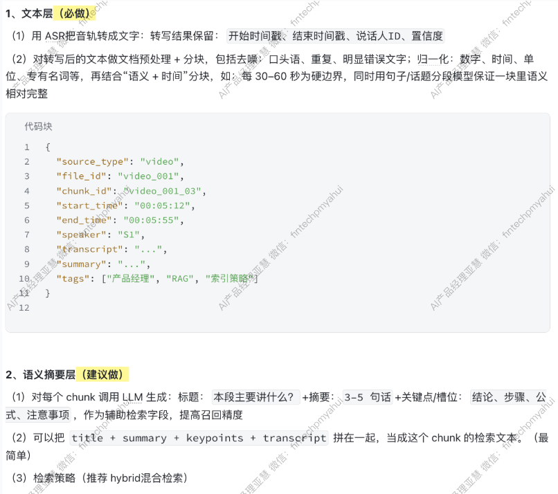

```Python
-直接回答（自然语言）
-引用音频片段：音频标题 + 时间戳：「本问题相关内容出现在《xxx》视频 05:12–06:05」并提供可点击的「跳转到 05:12 播放」链接
-关键点 bullet：把该片段里讲的 2–4 个重点用条目列出来

举例：
我整理了一段视频中和你问题最相关的内容：
音频文件：《多模态 RAG 实战》
片段：05:12–06:05（可跳转定位播放，鼠标移到时间戳处显示该段摘要预览）
核心内容：
 1）…
 2）…
 3）…
```

4、流程：

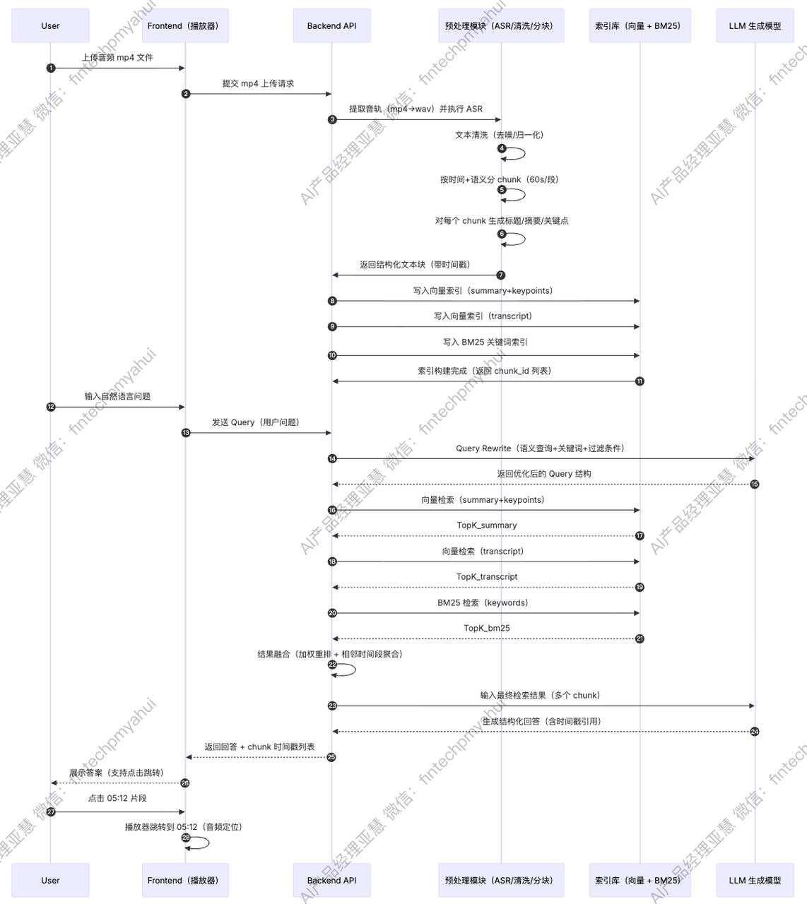

#### 10、若知识来源有 **大量网页和交互式表****`格，如何处理？`**
拆解问题：（1） 要不要全部爬下来存成 Markdown 或 JSON？（2）要不要定期全量爬？

**最小化可落地建议**

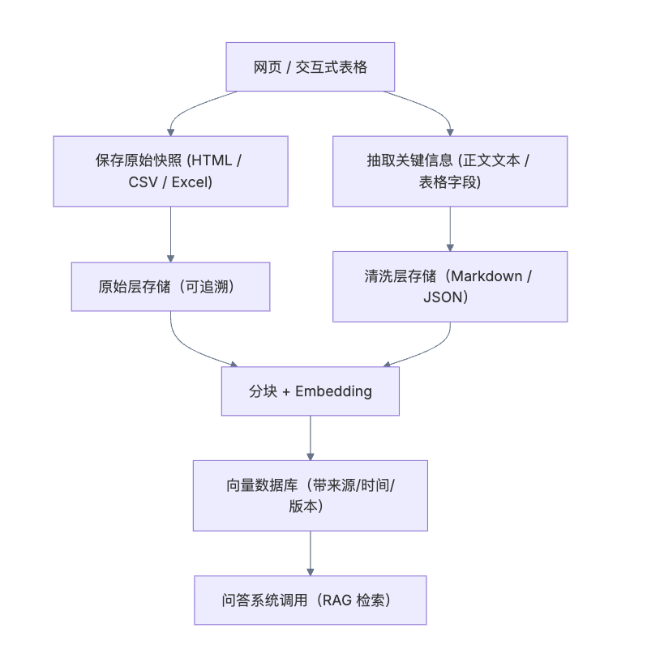

1、 **不要全量存 Markdown**

（1）网页直接保存原始快照（HTML 或表格 CSV/Excel）。

（2）只在需要做问答的部分，把核心文字或表格转成 Markdown/JSON。这样既能追溯原始页面，也不浪费存储。

2、 **如果交互表格有“导出 Excel/CSV”按钮，直接用它。如果有后台 API，可以直接取 JSON，比爬页面靠谱。**

3、 **存储与版本管理：双层存储：Raw（原始快照）+ Clean（抽取后用于检索）**

（1）目录结构：示例：

```Python
/kb/
  raw/{domain}/{path_hash}/{ts}/page.html
  raw/{domain}/{path_hash}/{ts}/table.csv
  clean/{domain}/{path_hash}/{ts}/doc.md
  clean/{domain}/{path_hash}/{ts}/data.jsonl
  index/manifest.jsonl
```

（2）每行一条快照索引，便于查找/回溯

```Python
{
  "source_url": "https://site.com/help/refund",
  "path_hash": "ab12cd...",
  "fetched_at": "2025-09-23T06:12:00Z",
  "etag": "W/\"3a1...\"",
  "last_modified": "Tue, 23 Sep 2025 05:58:00 GMT",
  "content_hash": "sha256:9f8...",
  "render_mode": "static|api|headless",
  "stored": {
    "raw_html": "raw/site.com/ab12cd/20250923/page.html",
    "clean_md": "clean/site.com/ab12cd/20250923/doc.md"
  }
}
```

4 **、定期更新：不用每次全量更新**

（1）变化快的内容（比如价格、库存、公告）：每天更新一次。

（2）一般手册类、政策类：一周或一个月更新一次（按需）。

（3）判断是否有变更：用上次hash 值 vs本次内容的hash 值的方式，只更新变的

实现方案：变更检测（只处理变化）：优先用响应头： `ETag / Last-Modified` ；兜底：对正文或数据做哈希（忽略动态噪声）

```Python
import re, hashlib
def stable_hash(html: str) -> str:
    html = re.sub(r'\s+', ' ', html)                  # 空白归一
    html = re.sub(r'__REQUEST_ID__=\w+', '', html)    # 动态token
    return hashlib.sha256(html.encode('utf-8')).hexdigest()
```

**未变**：跳过抽取与嵌入

**已变**：只重跑该 URL 对应的 Clean 与 embedding

**表格**：对每行的主键做行级哈希，识别新增/更新/删除

5、 **入知识库：**

（1）原始层raw：存完整网页/表格（方便后续追溯）。

（2）清洗层clean：只抽取有用的文字/表格，转成 Markdown 或 JSON

（3）知识库层KB：做 embedding，存到向量数据库，支持问答

#### （补充）如何用大模型清洗HTML内容（2个开源方案供参考：MinerU-HTML及Reader-LM ）
**HTML到Markdown的转换任务主要是一个“选择性复制”任务**，真实世界的原始HTML极其嘈杂且冗长。 **==因此需要加入很多工程上的处理手段，如：预处理、分类、后处理==**

**1、MinerU-HTML**

https://arxiv.org/pdf/2511.16397

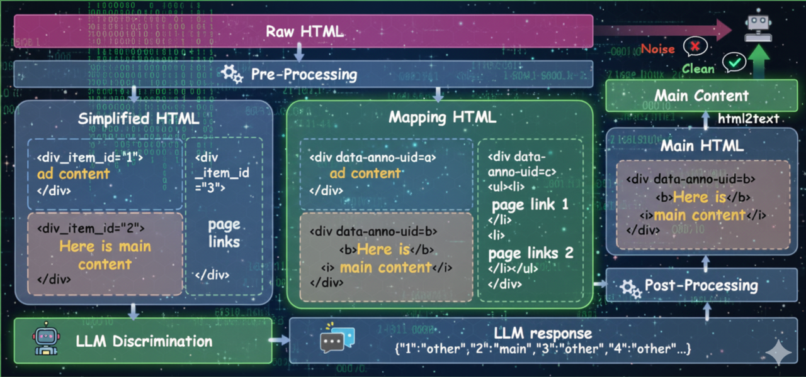

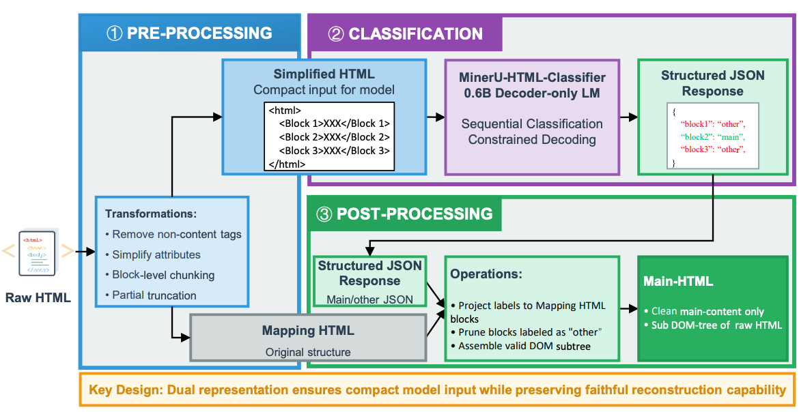

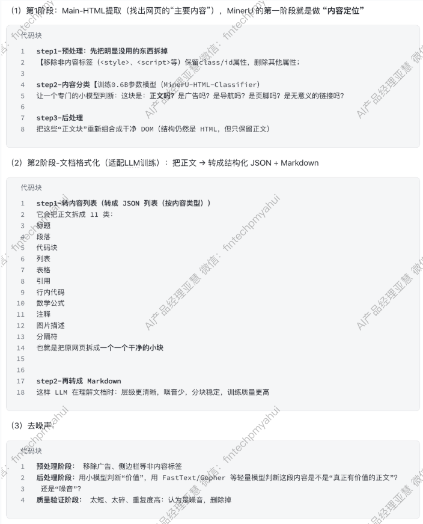

**2、JinaReader：Reader-LM处理HTML：**

Reader-LM，用于HTML清理和转换为Markdown（ https://jina.ai/zh-CN/news/reader-lm-small-language-models-for-cleaning-and-converting-html-to-markdown/ ）

| 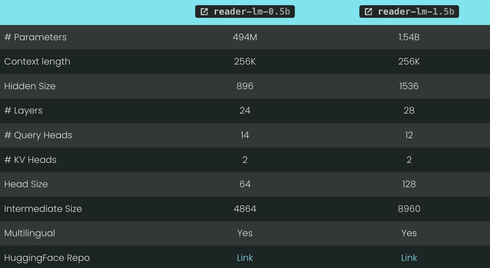 | 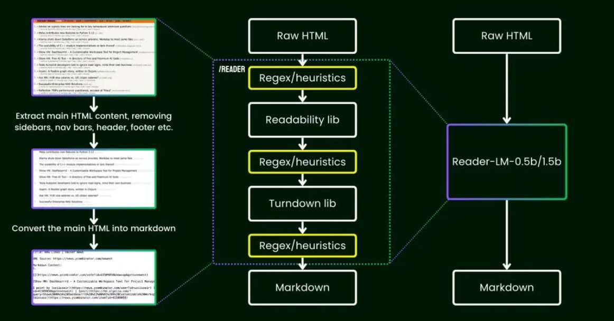 |
| --- | --- |

#### 11、【文档智能解析方案】总结进展（更新中……）
**1、技术方案1：OCR-Pipline式文档解析（layout+阅读顺序+ocr专家小模型）**

ocr-pipline： **可解释性强，更贴近落地解法，但泛化能力有限**

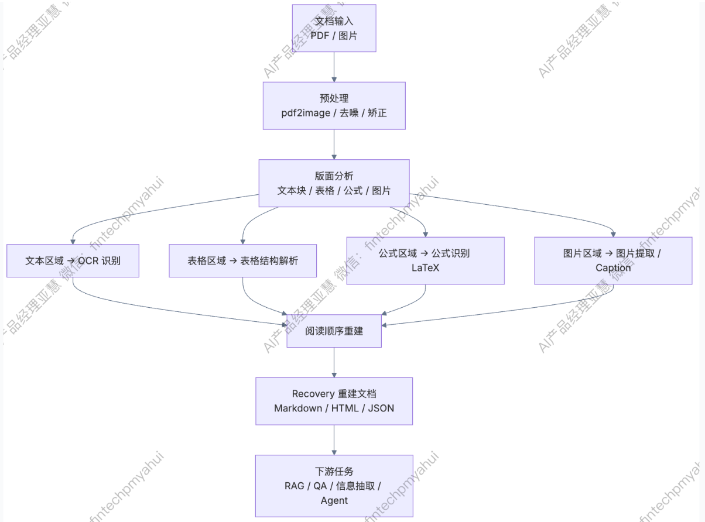

```Bash
1、MinerU1.x: https://github.com/opendatalab/MinerU
2、ppstructure: https://github.com/PaddlePaddle/PaddleOCR/blob/main/docs/version3.x/algorithm/PP-StructureV3/PP-StructureV3.md
3、Docling: https://github.com/docling-project/docling
4、Marker: https://github.com/VikParuchuri/marker
```

**2、Layout+VLM**

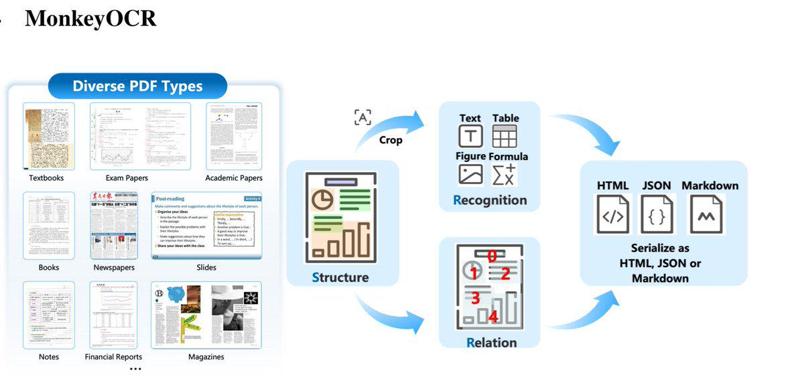

```Python
1、MinerU2.5（1.2B）: https://github.com/opendatalab/MinerU
2、MonkeyOCR（1.2B~3B）：https://github.com/Yuliang-Liu/MonkeyOCR
3、PaddleOCR-VL（0.9B）：https://github.com/PaddlePaddle/PaddleOCR
4、chandra（8B）：https://github.com/datalab-to/chandra
```

**3、多模态端到端的文档解析（finetune）**

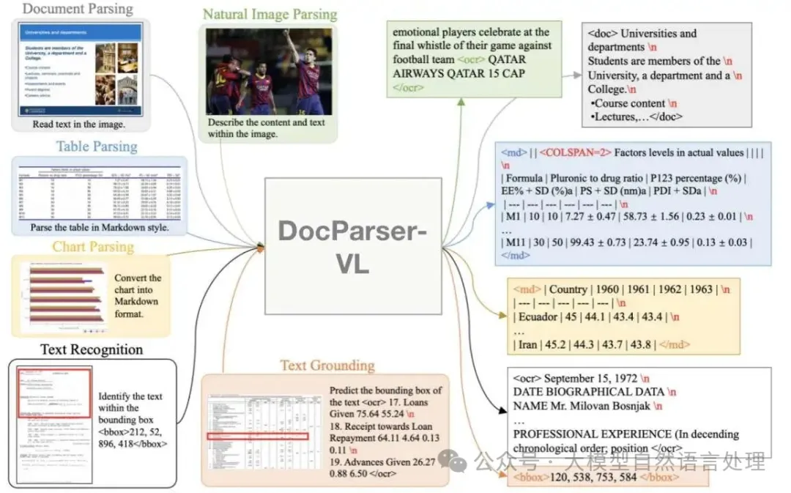

```Bash
1、Dolphin: https://github.com/bytedance/Dolphin
2、olmOCR: https://github.com/allenai/olmocr
3、GOT-OCR: https://github.com/Ucas-HaoranWei/GOT-OCR2.0
4、SmolDocling: https://huggingface.co/ds4sd/SmolDocling-256M-preview
5、Unstructured: https://github.com/Unstructured-IO/unstructured
6、OpenParse: https://github.com/Filimoa/open-parse
7、Mistral-OCR: https://mistral.ai/news/mistral-ocr?utm_source=ai-bot.cn
8、Nougat: https://github.com/facebookresearch/nougat
9、DeepSeek-OCR：https://github.com/deepseek-ai/DeepSeek-OCR
10、Hunyuan-OCR(0.9b）: https://github.com/Tencent-Hunyuan/HunyuanOCR/blob/main/HunyuanOCR_Technical_Report.pdf
```

#### 12、结构化数据提取
https://github.com/google/langextract

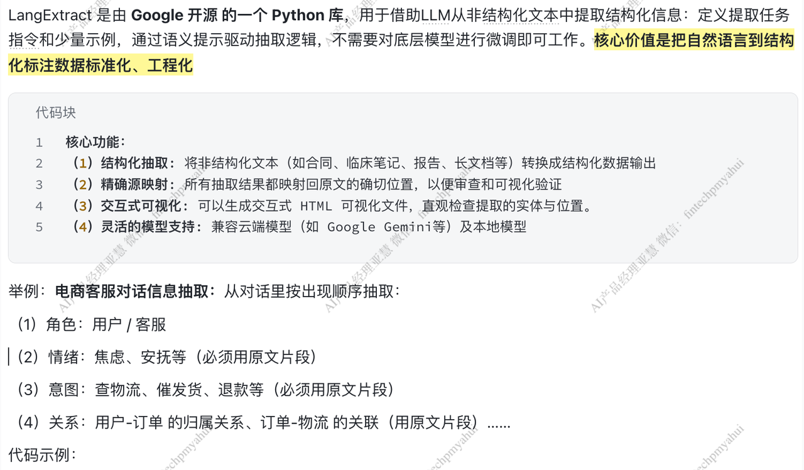

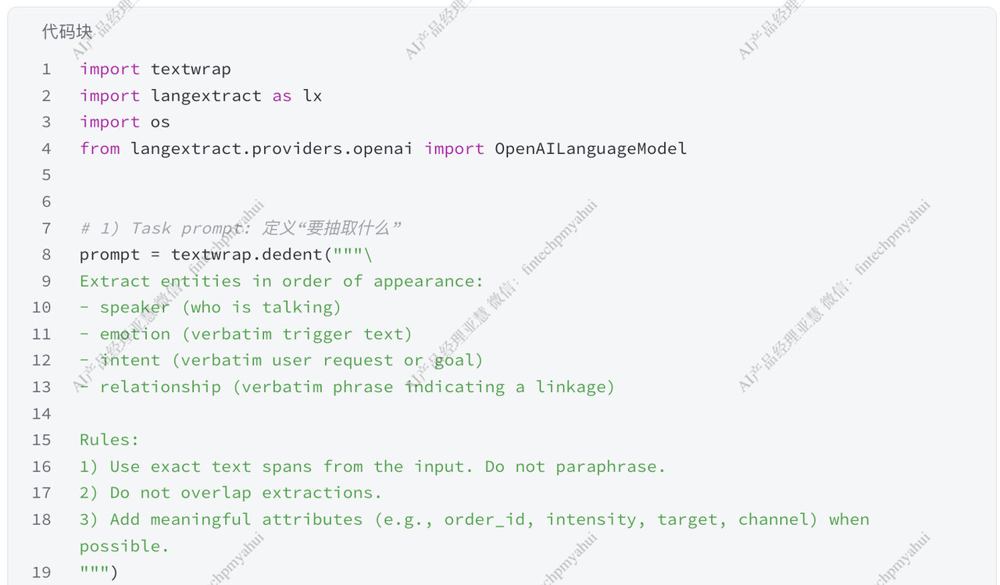

```Python
# 2) Few-shot example: 教模型什么叫“抽得对”
examples = [
    lx.data.ExampleData(
        text=(
            "User: I'm really upset. My order 8123 still hasn't shipped.\n"
            "Agent: I'm sorry about that. Let me check the status for order 8123.\n"
            "User: Please cancel it if it won't ship today."
        ),
        extractions=[
            lx.data.Extraction(
                extraction_class="speaker",
                extraction_text="User",
                attributes={"role": "customer"},
            ),
            lx.data.Extraction(
                extraction_class="emotion",
                extraction_text="really upset",
                attributes={"polarity": "negative", "intensity": "high"},
            ),
            lx.data.Extraction(
                extraction_class="intent",
                extraction_text="My order 8123 still hasn't shipped.",
                attributes={"intent_type": "shipping_status", "order_id": "8123"},
            ),
            lx.data.Extraction(
                extraction_class="speaker",
                extraction_text="Agent",
                attributes={"role": "customer_service"},
            ),
            lx.data.Extraction(
                extraction_class="emotion",
                extraction_text="I'm sorry about that.",
                attributes={"polarity": "supportive", "intent": "apology"},
            ),
            lx.data.Extraction(
                extraction_class="relationship",
                extraction_text="status for order 8123",
                attributes={"type": "agent_checks_order", "order_id": "8123"},
            ),
            lx.data.Extraction(
                extraction_class="intent",
                extraction_text="Please cancel it",
                attributes={"intent_type": "cancel_order", "condition": "won't ship today"},
            ),
        ],
    )
]

# 3) Model config: 用 OpenAI 兼容壳去调用 DeepSeek
deepseek_model = OpenAILanguageModel(
    model_id="deepseek-chat",
    api_key=os.getenv("DEEPSEEK_API_KEY"),
    base_url="https://api.deepseek.com/v1",
)

# 4) Input: 可多轮对话
input_text = (
    "用户：我这单怎么还没发货啊？都三天了！订单号A-20981。"
    "客服：非常抱歉让您久等了，我帮您查一下订单A-20981的物流状态。"
    "用户：如果今天还发不出就给我退款。"
)

result = lx.extract(
    text_or_documents=input_text,
    prompt_description=prompt,
    examples=examples,
    model=deepseek_model,
)

# 5) Save + Visualize: 统一输出路径，避免读写不一致
output_path = "extraction_results.jsonl"
lx.io.save_annotated_documents([result], output_name=output_path)

html_content = lx.visualize(output_path)
with open("visualization.html", "w", encoding="utf-8") as f:
    f.write(html_content)

print("Done. Outputs:")
print(f"- {output_path}")
print("- visualization.html")
```

输出示例

```JSON
{
  "text": "用户：我这单怎么还没发货啊？都三天了！订单号A-20981。\n客服：非常抱歉让您久等了，我帮您查一下订单A-20981的物流状态。\n用户：如果今天还发不出就给我退款。",
  "extractions": [
    {
      "extraction_class": "speaker",
      "extraction_text": "用户",
      "attributes": {
        "role": "customer"
      }
    },
    {
      "extraction_class": "emotion",
      "extraction_text": "怎么还没发货啊？都三天了！",
      "attributes": {
        "polarity": "negative",
        "intensity": "high"
      }
    },
    {
      "extraction_class": "intent",
      "extraction_text": "还没发货",
      "attributes": {
        "intent_type": "shipping_delay",
        "order_id": "A-20981"
      }
    },
    {
      "extraction_class": "speaker",
      "extraction_text": "客服",
      "attributes": {
        "role": "customer_service"
      }
    },
    {
      "extraction_class": "emotion",
      "extraction_text": "非常抱歉让您久等了",
      "attributes": {
        "polarity": "supportive",
        "intent": "apology"
      }
    },
    {
      "extraction_class": "relationship",
      "extraction_text": "订单A-20981的物流状态",
      "attributes": {
        "type": "agent_checks_order",
        "order_id": "A-20981"
      }
    },
    {
      "extraction_class": "speaker",
      "extraction_text": "用户",
      "attributes": {
        "role": "customer"
      }
    },
    {
      "extraction_class": "intent",
      "extraction_text": "给我退款",
      "attributes": {
        "intent_type": "refund_request",
        "condition": "今天还发不出"
      }
    }
  ]
}
```

### 4.2.2 文档分块
使用大语言模型时，文本分块对处理结果的好坏有重大影响。如果你有一个几百页的文档（充满了文字），你希望对其进行摘录和问答式处理。在这个流程中，最初的一步是提取文档的嵌入向量，但这样做会带来几个问题：

#### **（1）分块大小不合适 —— “太大压不下，太小撑不起”**
**a）块太大**：信息过于密集，导致检索系统很难准确抓住重点，影响性能，同时增加了模型加载成本，降低响应速度；

**b）块太小**：内容碎片化，可能把一个关键语义链条截断成零散的知识点，让模型“只能猜”，进而造成幻觉或误解。

#### **（2）上下文关系被切断 —— “割裂的语义无法还原原意”**
很多分块策略为了简化操作，只按固定字符数、段落长度或换行符切分， **却没有考虑语义的连续性**。

a）比如一段法律条文，如果“原因”和“结果”被分成两个块，就很可能检索到残缺内容；

b）如果一段论述被一刀切两半，模型将难以理解作者真正想表达的意思。

#### **（3）语义完整性丢失 —— “只见例子，不见解释”**
如果分块时没有尊重语义结构，系统可能提取到片段内容，但却缺乏解释或上下文支持。

举个例子：一篇论文的某一块只包含了实验数据，而没有前面的方法描述或结论分析。这时即使检索到了，也可能因信息残缺让模型“读不懂”。

#### （4）窗口大小的技术限制 —— “撑不下去的问题不能靠塞”
使用像 GPT-4 这样的模型，虽然上下文窗口已经扩大（如支持 32K Token），但仍然存在极限。

a）分块太多：可能选不出全部相关块，漏掉关键信息；

b）分块太长：可能被截断或超出上下文限制，影响整体推理。

**因此，控制好分块大小，同时保持语义完整，是设计提示词与上下文注入的前置必要条件**

chunk size 是个权衡多方面的“实验性工程”，需要考虑：

> 1、 **==用户提问的长度与复杂度：==**用户的查询如果较长或语义复杂，就意味着需要更完整的上下文来回答。
>

> 2、 **==原始内容本身的结构特点：==**不同类型的内容，天然就需要不同的分块方式：像微博、小红书笔记这种短内容，本身就简短，按句甚至短语分即可；而对于长篇博客、技术文档、论文等，需要更长的分块单位（如段落、逻辑块）以保留完整语义。
>

> 3、 **==与 Embedding 模型的适配性：==**不同的 embedding 模型在不同粒度的文本块上表现差异很大
>

> 4、 **==成本要求：==**chunk size 越大，意味着生成时发给 LLM 的 token 数越多，成本更高。
>

> **5、****==响应时间要求：==**有开发者按照不同 chunk size 做了实验，同样的任务当 chunk 越大，响应时间越长
>

#### 1、分块的方法有多种
- 固定大小分块：这是一种简单直接的方法，通过设定块的大小和是否有重叠来决定分块。
- Content-Aware 分块（ **语义段的切分及段落(句子)关键信息抽取）**：基于内容意图的分块，利用正在分块的内容的性质，并应用更复杂的分块策略。 **（见2）**
- 句分割：使用诸如句号、换行符等标点符号来分割句子。
- 递归分割：使用不同的分隔符或标准对生成的块进行递归调用，直至得到所需大小的块。
- 专门分块：适用于 Markdown 和 LaTeX 等结构化内容，保留内容的原始结构和格式。
- 自主分割：直接让LLM根据内容和上下文来决定怎么分块。AI 会自己判断哪里该切，哪里该留，确保每个块都有完整的意义

#### （1）固定大小分块
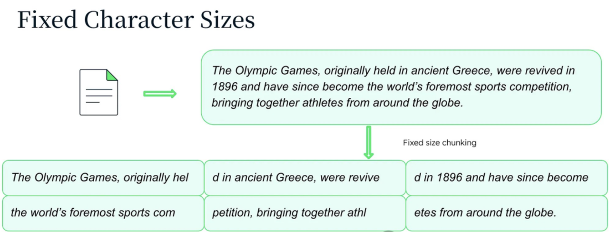

**技术实现方案：**

1、评测token 切片：

| **特性** | **描述** |
| --- | --- |
| **优势** | 可有效控制生成文本长度，适用于轻量级模型场景，部署与实现成本较低。 |
| **劣势** | 易导致语义中断或割裂，对上下文重合（overlap）机制依赖较强，但补偿效果有限，不适用于需保持语义完整性的复杂任务。 |

```Python
这段代码是一个文档处理系统的测试脚本，主要做了两件事：
（1）配置LLM（大语言模型）和嵌入模型（用于文本向量化）
（2）测试不同的文档切片方法并展示结果

核心逻辑流程
（1）模型配置部分：
使用阿里云的DashScope服务（类似OpenAI的API）
配置了Qwen-plus语言模型
配置了text-embedding-v4嵌入模型

（2）测试评估部分：
evaluate_splitter函数会：
a. 用指定的切片方法处理文档
b. 打印出每个切片的内容

测试的切片方法：
测试了两种TokenTextSplitter配置：
第一种：chunk_size=30，chunk_overlap=0（无重叠）
第二种：chunk_size=30，chunk_overlap=10（10个token的重叠）
```

```Python
安装：
pip install llama-index llama-index-llms-openai-like llama-index-embeddings-dashscope llama-index-readers-file

导入库：
import os
from llama_index.core import VectorStoreIndex, Settings, Document
from llama_index.core.node_parser import SentenceWindowNodeParser, SemanticSplitterNodeParser, TokenTextSplitter
from llama_index.core.postprocessor import MetadataReplacementPostProcessor


【伪代码】

# 导入 OpenAILike LLM (用于 DashScope 兼容模式，Qwen 模型)
from llama_index.llms.openai_like import OpenAILike
# 导入 DashScopeEmbedding (用于阿里云 DashScope 嵌入模型)
from llama_index.embeddings.dashscope import DashScopeEmbedding

# --- 配置阿里云 DashScope API Key ---
# 确保你的环境变量中设置了 DASHSCOPE_API_KEY
# 或者直接在这里设置（不推荐用于生产环境）：
# os.environ["DASHSCOPE_API_KEY"] = "sk-xxx"

# 获取 API Key
DASHSCOPE_API_KEY = os.getenv("DASHSCOPE_API_KEY")

# 初始化 LlamaIndex 全局设置

# 1. 配置 LLM (使用 DashScope 的 qwen-plus 模型，通过 OpenAILike 调用)
Settings.llm = OpenAILike(
    model="qwen-plus",
    api_base="https://dashscope.aliyuncs.com/compatible-mode/v1",
    api_key=DASHSCOPE_API_KEY,
    is_chat_model=True,
    temperature=0.1 # 添加温度参数，用于控制生成随机性
)

# 2. 配置嵌入模型 (使用 DashScopeEmbedding 类)
Settings.embed_model = DashScopeEmbedding(
    model_name="text-embedding-v4",
    api_key=DASHSCOPE_API_KEY,
)


def evaluate_splitter(splitter, documents, question, splitter_name):
    """
    评测不同文档切片方法的效果
    手动打印召回结果，方便直接对比切分效果。
    """
    print(f"\n{'='*50}")
    print(f"正在使用 {splitter_name} 方法进行测试...")
    print(f"{'='*50}\n")

    # 显示 raw chunks generated by the splitter
    print(f"【{splitter_name}】生成的原始文档切片 (Nodes):")
    raw_nodes = splitter.get_nodes_from_documents(documents)
    for i, node in enumerate(raw_nodes, 1):
        print(f"\n   切片 {i}:")
        if isinstance(splitter, SentenceWindowNodeParser):
            original_text = node.metadata.get("original_text", node.get_content())
            window_context = node.metadata.get("window", "N/A - 窗口内容未生成")
            print(f"   核心内容: \"{original_text}\"")
            print(f"   完整窗口上下文(供LLM用): \"{window_context}\"")
        else:
            print(f"   内容: \"{node.get_content()}\"")
        # Add metadata for debugging if needed
        # print(f"   元数据: {node.metadata}")
        print("   " + "-" * 40)
    print("\n" + "="*50)

    # # 构建索引
    # print("正在处理文档并构建索引...")
    # nodes = splitter.get_nodes_from_documents(documents)

    # index = VectorStoreIndex(nodes, embed_model=Settings.embed_model)

    # # 创建查询引擎
    # print("正在创建查询引擎...")
    # query_engine_params = {
    #     "similarity_top_k": 5,
    #     "streaming": True
    # }

    # # 如果是 Sentence Window 切片，添加后处理器
    # if isinstance(splitter, SentenceWindowNodeParser):
    #     query_engine_params["node_postprocessors"] = [
    #         MetadataReplacementPostProcessor(target_metadata_key="window")
    #     ]
    #     print("💡 检测到 Sentence Window 切片，已添加 MetadataReplacementPostProcessor。")

    # query_engine = index.as_query_engine(**query_engine_params)

    # # 执行查询
    # print(f"\n测试问题: {question}")
    # print("\n模型回答:")
    # response = query_engine.query(question)
    # response.print_response_stream()

    # # 输出召回的参考片段
    # print(f"\n{splitter_name} 召回的参考片段:")
    # if response.source_nodes:
    #     for i, node in enumerate(response.source_nodes, 1):
    #         print(f"\n--- 文档片段 {i} ---")

    #         # --- 优化后的打印逻辑 ---
    #         if isinstance(splitter, SentenceWindowNodeParser):
    #             # 对于Sentence Window，打印出窗口内容和原始中心句子
    #             window_content = node.metadata.get("window", "N/A - Window content missing")
    #             original_text = node.metadata.get("original_text", "N/A - Original text missing")
    #             print(f"【召回的窗口上下文】:\n{window_content}")
    #             print(f"\n【窗口中的核心句子】:\n{original_text}")
    #             # node.get_content() 在这里通常是核心句子
    #             # print(f"\n【Node Content (通常是核心句子)】:\n{node.get_content()}")
    #         else:
    #             # 对于其他切片器，直接打印节点内容
    #             print(f"【召回的文档内容】:\n{node.get_content()}")
    #         # --- 打印逻辑结束 ---

    #         print("-" * 50) # 分隔线

    # else:
    #     print("未召回任何文档片段。请检查文档内容或切片策略。")

    print(f"\n{splitter_name} 测试完成。")
    print(f"{'='*50}\n")

# --- 示例文档和问题 ---
documents = [
    Document(
        text="""
        LlamaIndex 是一个用于构建 LLM 应用程序的数据框架。
        它提供了一套工具，可以帮助开发者将私有数据与大型语言模型（LLMs）连接起来，
        实现包括问答、检索增强生成（RAG）等功能。
        LlamaIndex 支持多种数据源，包括 PDF、数据库、API 等。
        其核心概念包括文档加载器、节点解析器、索引和查询引擎。

        文档加载器负责将各种格式和来源的数据摄取到 LlamaIndex 中。
        节点解析器随后将这些加载的文档分解成更小、更易于管理的单元，称为节点。
        这些节点通常是句子或段落，具体取决于解析策略。
        索引是构建在这些节点之上的数据结构，旨在实现高效存储和检索，
        通常涉及向量嵌入以进行语义搜索。
        最后，查询引擎促进了与索引数据的交互，允许用户提出问题
        并利用 LLM 和检索到的信息合成答案。

        --- 以下是与 LlamaIndex 主题不太直接相关的内容 ---

        此外，Python 作为一门通用编程语言，其简洁性和丰富的库生态使其在 AI 领域广受欢迎。
        例如，NumPy 和 Pandas 是数据处理的基础，它们提供了强大的工具用于数值操作和结构化数据。
        Scikit-learn 则提供了全面的机器学习算法套件，适用于分类、回归和聚类等任务。
        这些工具共同构成了数据科学家和 AI 从业者的强大工具箱，
        使他们能够高效地开发和部署复杂的 AI 模型。

        --- 以下是另一个相关但概念上独立的部分 ---

        句子窗口切片是一种高级的切片策略，它在每个切片中包含一个目标句子，
        并在其前后添加一定数量的“窗口”句子作为上下文。
        这种方法旨在检索时为 LLM 提供丰富的局部上下文，从而提高生成答案的连贯性。
        语义切片则尝试根据文本的语义内容来划分段落，
        而不是仅仅依靠固定的字符数或句子数量。
        它利用嵌入模型计算句子或短语之间的语义相似度，
        识别出主题或含义发生自然转变的断点。
        这两种高级方法都能有效提升 RAG 应用的召回和生成质量。
        选择正确的切片策略通常取决于数据的具体特征和预期的查询类型。
        """
    )
]

question = "LlamaIndex 的主要功能和核心概念是什么？以及两种高级切片策略的区别？"

# --- 开始测试不同的切片策略 ---
# Token 切片 (Character/Token-based)
token_splitter = TokenTextSplitter(
    chunk_size=30, # Small chunk size to demonstrate forced breaks
    chunk_overlap=0 # No overlap for clear distinct chunks
)
evaluate_splitter(token_splitter, documents, question, "Token 切片 (chunk_size=30)")

token_splitter = TokenTextSplitter(
    chunk_size=30, # Small chunk size to demonstrate forced breaks
    chunk_overlap=10 # No overlap for clear distinct chunks
)
evaluate_splitter(token_splitter, documents, question, "Token 切片 (chunk_size=30,chunk_overlap=10 )")


# 文档原文: [.....内容X..... | 内容Y | .....内容Z.....]
#                      ↑           ↑
#                      切块A末尾    切块B起始点 (从切块A末尾往前50个字符)

# 切块A: [.....内容X..... | 内容Y] (512个字符)
# 切块B:                 [内容Y | .....内容Z.....] (512个字符)
```

测试结果：

（1）Token 切片 (chunk_size=30, overlap=0) 结果：

```SQL
==================================================
正在使用 Token 切片 (chunk_size=30) 方法进行测试...
==================================================

【Token 切片 (chunk_size=30)】生成的原始文档切片 (Nodes):

    切片 1:
    内容: "LlamaIndex 是一个用于构建 LLM 应用程序的数据框架。它提供了一套工具，可以帮助开发者将私有数据与大型语言模型（LLMs）连接起来，实现包括问答、检索增强生成（RAG）等功能。"
    ----------------------------------------

    切片 2:
    内容: "LlamaIndex 支持多种数据源，包括 PDF、数据库、API 等。其核心概念包括文档加载器、节点解析器、索引和查询引擎。"
    ----------------------------------------

    切片 3:
    内容: "文档加载器负责将各种格式和来源的数据摄取到 LlamaIndex 中。节点解析器随后将这些加载的文档分解成更小、更易于管理的单元，称为节点。"
    ----------------------------------------

    切片 4:
    内容: "这些节点通常是句子或段落，具体取决于解析策略。索引是构建在这些节点之上的数据结构，旨在实现高效存储和检索，通常涉及向量嵌入以进行语义搜索。"
    ----------------------------------------

    切片 5:
    内容: "最后，查询引擎促进了与索引数据的交互，允许用户提出问题并利用 LLM 和检索到的信息合成答案。"
    ----------------------------------------

    切片 6:
    内容: "--- 以下是与 LlamaIndex 主题不太直接相关的内容 --- 此外，Python 作为一门通用编程语言，其简洁性和丰富的库生态使其在 AI 领域广受欢迎。"
    ----------------------------------------

    切片 7:
    内容: "例如，NumPy 和 Pandas 是数据处理的基础，它们提供了强大的工具用于数值操作和结构化数据。Scikit-learn 则提供了全面的机器学习算法套件，适用于分类、回归和聚类等任务。"
    ----------------------------------------

    切片 8:
    内容: "这些工具共同构成了数据科学家和 AI 从业者的强大工具箱，使他们能够高效地开发和部署复杂的 AI 模型。"
    ----------------------------------------

    切片 9:
    内容: "--- 以下是另一个相关但概念上独立的部分 --- 句子窗口切片是一种高级的切片策略，它在每个切片中包含一个目标句子，并在其前后添加一定数量的“窗口”句子作为上下文。"
    ----------------------------------------

    切片 10:
    内容: "这种方法旨在检索时为 LLM 提供丰富的局部上下文，从而提高生成答案的连贯性。语义切片则尝试根据文本的语义内容来划分段落，而不是仅仅依靠固定的字符数或句子数量。"
    ----------------------------------------

    切片 11:
    内容: "它利用嵌入模型计算句子或短语之间的语义相似度，识别出主题或含义发生自然转变的断点。这两种高级方法都能有效提升 RAG 应用的召回和生成质量。"
    ----------------------------------------

    切片 12:
    内容: "选择正确的切片策略通常取决于数据的具体特征和预期的查询类型。"
    ----------------------------------------

==================================================
Token 切片 (chunk_size=30) 测试完成。
==================================================
```

（2）Token 切片 (chunk_size=30, overlap=10) 结果：

```SQL
==================================================
正在使用 Token 切片 (chunk_size=30,chunk_overlap=10) 方法进行测试...
==================================================

【Token 切片 (chunk_size=30,chunk_overlap=10)】生成的原始文档切片 (Nodes):

    切片 1:
    内容: "LlamaIndex 是一个用于构建 LLM 应用程序的数据框架。它提供了一套工具，可以帮助开发者将私有数据与大型语言模型（LLMs）连接起来，实现包括问答、检索增强生成（RAG）等功能。"
    ----------------------------------------

    切片 2:
    内容: "实现包括问答、检索增强生成（RAG）等功能。LlamaIndex 支持多种数据源，包括 PDF、数据库、API 等。其核心概念包括文档加载器、节点解析器、索引和查询引擎。"
    ----------------------------------------

    切片 3:
    内容: "其核心概念包括文档加载器、节点解析器、索引和查询引擎。文档加载器负责将各种格式和来源的数据摄取到 LlamaIndex 中。节点解析器随后将这些加载的文档分解成更小、更易于管理的单元，称为节点。"
    ----------------------------------------

    切片 4:
    内容: "分解成更小、更易于管理的单元，称为节点。这些节点通常是句子或段落，具体取决于解析策略。索引是构建在这些节点之上的数据结构，旨在实现高效存储和检索，通常涉及向量嵌入以进行语义搜索。"
    ----------------------------------------

    切片 5:
    内容: "通常涉及向量嵌入以进行语义搜索。最后，查询引擎促进了与索引数据的交互，允许用户提出问题并利用 LLM 和检索到的信息合成答案。"
    ----------------------------------------

    切片 6:
    内容: "并利用 LLM 和检索到的信息合成答案。--- 以下是与 LlamaIndex 主题不太直接相关的内容 --- 此外，Python 作为一门通用编程语言，其简洁性和丰富的库生态使其在 AI 领域广受欢迎。"
    ----------------------------------------

    切片 7:
    内容: "在 AI 领域广受欢迎。例如，NumPy 和 Pandas 是数据处理的基础，它们提供了强大的工具用于数值操作和结构化数据。Scikit-learn 则提供了全面的机器学习算法套件，适用于分类、回归和聚类等任务。"
    ----------------------------------------

    切片 8:
    内容: "适用于分类、回归和聚类等任务。这些工具共同构成了数据科学家和 AI 从业者的强大工具箱，使他们能够高效地开发和部署复杂的 AI 模型。"
    ----------------------------------------

    切片 9:
    内容: "复杂的 AI 模型。--- 以下是另一个相关但概念上独立的部分 --- 句子窗口切片是一种高级的切片策略，它在每个切片中包含一个目标句子，并在其前后添加一定数量的“窗口”句子作为上下文。"
    ----------------------------------------

    切片 10:
    内容: "句子作为上下文。这种方法旨在检索时为 LLM 提供丰富的局部上下文，从而提高生成答案的连贯性。语义切片则尝试根据文本的语义内容来划分段落，而不是仅仅依靠固定的字符数或句子数量。"
    ----------------------------------------

    切片 11:
    内容: "句子数量。它利用嵌入模型计算句子或短语之间的语义相似度，识别出主题或含义发生自然转变的断点。这两种高级方法都能有效提升 RAG 应用的召回和生成质量。"
    ----------------------------------------

    切片 12:
    内容: "生成质量。选择正确的切片策略通常取决于数据的具体特征和预期的查询类型。"
    ----------------------------------------

==================================================
Token 切片 (chunk_size=30,chunk_overlap=10) 测试完成。
==================================================
```

#### （2）句分隔（正则拆分）
在中文文本分块的场景中， **“正则表达式”**可以用来识别中文标点符号，从而将文本拆分成单独的句子。这种方法依赖于中文句号、“问号”、“感叹号”等标点符号作为句子结束的标志。虽然这种基于模式匹配的方法可能不如基于复杂语法和语义分析的方法精确，但它在大多数情况下足以满足基本的句子分割需求，并且实现起来更为简单直接。

```Python
import re

def split_sentences(text):
    # 使用正则表达式匹配中文句子结束的标点符号
    sentence_delimiters = re.compile(u'[。？！；:]|[\n]')
    sentences = sentence_delimiters.split(text)

    # 过滤掉空字符串
    sentences = [s.strip() for s in sentences if s.strip()]
    return sentences

text = "文本分块是自然语言处理（NLP）中的一项关键技术，其作用是将较长的文本切割成更小、更易于处理的片段。这种分割通常是基于单词的词性和语法结构，例如将文本拆分为名词短语、动词短语或其他语义单位。这样做有助于更高效地从文本中提取关键信息。"
sentences = split_sentences(text)
print(sentences)

output
[
  '文本分块是自然语言处理（NLP）中的一项关键技术，其作用是将较长的文本切割成更小、更易于处理的片段',
  '这种分割通常是基于单词的词性和语法结构，例如将文本拆分为名词短语、动词短语或其他语义单位',
  '这样做有助于更高效地从文本中提取关键信息'
]
```

**技术实现方案：**

1、评测句子切片：

先保证句子完整，再做chunk的切分，再做overlap上下文

| **特性** | **Token切片** | **句子切片** |
| --- | --- | --- |
| **切分单位** | 以 Token 为最小处理粒度 | 以句子为切分边界 |
| **chunk_size 控制** | 采用严格的 Token 数量限制，超出即强制截断 | 以句子完整性为优先，尽量避免截断句子 |
| **chunk_overlap 策略** | 在 Token 级别进行重叠，可能会切断语义单元或打断句子结构 | 按句子级别重叠，保持上下文衔接自然连贯 |

```SQL
导入库：
import os
from llama_index.core import VectorStoreIndex, Settings, Document
from llama_index.core.node_parser import SentenceWindowNodeParser, SemanticSplitterNodeParser, TokenTextSplitter, SentenceSplitter
from llama_index.core.postprocessor import MetadataReplacementPostProcessor


【伪代码示例】：
# 导入 OpenAILike LLM (用于 DashScope 兼容模式，Qwen 模型)
from llama_index.llms.openai_like import OpenAILike
# 导入 DashScopeEmbedding (用于阿里云 DashScope 嵌入模型)
from llama_index.embeddings.dashscope import DashScopeEmbedding

# 获取 API Key
DASHSCOPE_API_KEY = os.getenv("DASHSCOPE_API_KEY")

# 初始化 LlamaIndex 全局设置

# 1. 配置 LLM (使用 DashScope 的 qwen-plus 模型，通过 OpenAILike 调用)
Settings.llm = OpenAILike(
    model="qwen-plus",
    api_base="https://dashscope.aliyuncs.com/compatible-mode/v1",
    api_key=DASHSCOPE_API_KEY,
    is_chat_model=True,
    temperature=0.1 # 添加温度参数，用于控制生成随机性
)

# 2. 配置嵌入模型 (使用 DashScopeEmbedding 类)
Settings.embed_model = DashScopeEmbedding(
    model_name="text-embedding-v4",
    api_key=DASHSCOPE_API_KEY,
)

def evaluate_splitter(splitter, documents, question, splitter_name):
    """
    评测不同文档切片方法的效果
    手动打印召回结果，方便直接对比切分效果。
    """
    print(f"\n{'='*50}")
    print(f"正在使用 {splitter_name} 方法进行测试...")
    print(f"{'='*50}\n")

    # 显示 raw chunks generated by the splitter
    print(f"【{splitter_name}】生成的原始文档切片 (Nodes):")
    raw_nodes = splitter.get_nodes_from_documents(documents)
    for i, node in enumerate(raw_nodes, 1):
        print(f"\n   切片 {i}:")
        if isinstance(splitter, SentenceWindowNodeParser):
            # For Sentence Window, show the original text that forms the 'core' of the chunk
            # and indicate what its full window context would be.
            original_text = node.metadata.get("original_text", node.get_content())
            window_context = node.metadata.get("window", "N/A - 窗口内容未生成")
            print(f"   核心内容: \"{original_text}\"")
            print(f"   完整窗口上下文(供LLM用): \"{window_context}\"")
        else:
            print(f"   内容: \"{node.get_content()}\"")
        # Add metadata for debugging if needed
        # print(f"   元数据: {node.metadata}")
        print("   " + "-" * 40)
    print("\n" + "="*50)

    # # 构建索引
    # print("正在处理文档并构建索引...")
    # nodes = splitter.get_nodes_from_documents(documents)

    # index = VectorStoreIndex(nodes, embed_model=Settings.embed_model)

    # # 创建查询引擎
    # print("正在创建查询引擎...")
    # query_engine_params = {
    #     "similarity_top_k": 5,
    #     "streaming": True
    # }

    # # 如果是 Sentence Window 切片，添加后处理器
    # if isinstance(splitter, SentenceWindowNodeParser):
    #     query_engine_params["node_postprocessors"] = [
    #         MetadataReplacementPostProcessor(target_metadata_key="window")
    #     ]
    #     print("💡 检测到 Sentence Window 切片，已添加 MetadataReplacementPostProcessor。")

    # query_engine = index.as_query_engine(**query_engine_params)

    # # 执行查询
    # print(f"\n测试问题: {question}")
    # print("\n模型回答:")
    # response = query_engine.query(question)
    # response.print_response_stream()

    # # 输出召回的参考片段
    # print(f"\n{splitter_name} 召回的参考片段:")
    # if response.source_nodes:
    #     for i, node in enumerate(response.source_nodes, 1):
    #         print(f"\n--- 文档片段 {i} ---")

    #         # --- 优化后的打印逻辑 ---
    #         if isinstance(splitter, SentenceWindowNodeParser):
    #             # 对于Sentence Window，打印出窗口内容和原始中心句子
    #             window_content = node.metadata.get("window", "N/A - Window content missing")
    #             original_text = node.metadata.get("original_text", "N/A - Original text missing")
    #             print(f"【召回的窗口上下文】:\n{window_content}")
    #             print(f"\n【窗口中的核心句子】:\n{original_text}")
    #             # node.get_content() 在这里通常是核心句子
    #             # print(f"\n【Node Content (通常是核心句子)】:\n{node.get_content()}")
    #         else:
    #             # 对于其他切片器，直接打印节点内容
    #             print(f"【召回的文档内容】:\n{node.get_content()}")
    #         # --- 打印逻辑结束 ---

    #         print("-" * 50) # 分隔线

    # else:
    #     print("未召回任何文档片段。请检查文档内容或切片策略。")

    print(f"\n{splitter_name} 测试完成。")
    print(f"{'='*50}\n")

# --- 示例文档和问题 ---
documents = [
    Document(
        text="""
        LlamaIndex 是一个用于构建 LLM 应用程序的数据框架。
        它提供了一套工具，可以帮助开发者将私有数据与大型语言模型（LLMs）连接起来，
        实现包括问答、检索增强生成（RAG）等功能。
        LlamaIndex 支持多种数据源，包括 PDF、数据库、API 等。
        其核心概念包括文档加载器、节点解析器、索引和查询引擎。

        文档加载器负责将各种格式和来源的数据摄取到 LlamaIndex 中。
        节点解析器随后将这些加载的文档分解成更小、更易于管理的单元，称为节点。
        这些节点通常是句子或段落，具体取决于解析策略。
        索引是构建在这些节点之上的数据结构，旨在实现高效存储和检索，
        通常涉及向量嵌入以进行语义搜索。
        最后，查询引擎促进了与索引数据的交互，允许用户提出问题
        并利用 LLM 和检索到的信息合成答案。

        --- 以下是与 LlamaIndex 主题不太直接相关的内容 ---

        此外，Python 作为一门通用编程语言，其简洁性和丰富的库生态使其在 AI 领域广受欢迎。
        例如，NumPy 和 Pandas 是数据处理的基础，它们提供了强大的工具用于数值操作和结构化数据。
        Scikit-learn 则提供了全面的机器学习算法套件，适用于分类、回归和聚类等任务。
        这些工具共同构成了数据科学家和 AI 从业者的强大工具箱，
        使他们能够高效地开发和部署复杂的 AI 模型。

        --- 以下是另一个相关但概念上独立的部分 ---

        句子窗口切片是一种高级的切片策略，它在每个切片中包含一个目标句子，
        并在其前后添加一定数量的“窗口”句子作为上下文。
        这种方法旨在检索时为 LLM 提供丰富的局部上下文，从而提高生成答案的连贯性。
        语义切片则尝试根据文本的语义内容来划分段落，
        而不是仅仅依靠固定的字符数或句子数量。
        它利用嵌入模型计算句子或短语之间的语义相似度，
        识别出主题或含义发生自然转变的断点。
        这两种高级方法都能有效提升 RAG 应用的召回和生成质量。
        选择正确的切片策略通常取决于数据的具体特征和预期的查询类型。
        """
    )
]

question = "LlamaIndex 的主要功能和核心概念是什么？以及两种高级切片策略的区别？"

# --- 开始测试不同的切片策略 ---
# token_splitter = TokenTextSplitter(
#     chunk_size=30, # Small chunk size to demonstrate forced breaks
#     chunk_overlap=0 # No overlap for clear distinct chunks
# )
# evaluate_splitter(token_splitter, documents, question, "Token 切片 (chunk_size=30)")

# token_splitter = TokenTextSplitter(
#     chunk_size=30, # Small chunk size to demonstrate forced breaks
#     chunk_overlap=10 # No overlap for clear distinct chunks
# )
# evaluate_splitter(token_splitter, documents, question, "Token 切片 (chunk_size=30,chunk_overlap=10 )")

sentence_splitter = SentenceSplitter(
    chunk_size=512,
    chunk_overlap=50
)
evaluate_splitter(sentence_splitter, documents, question, "Sentence")
```

测试结果：

```Markdown
==================================================
正在使用 Sentence 方法进行测试...
==================================================

【Sentence】生成的原始文档切片 (Nodes):

    切片 1:
    内容: "LlamaIndex 是一个用于构建 LLM 应用程序的数据框架。它提供了一套工具，可以帮助开发者将私有数据与大型语言模型（LLMs）连接起来，实现包括问答、检索增强生成（RAG）等功能。LlamaIndex 支持多种数据源，包括 PDF、数据库、API 等。其核心概念包括文档加载器、节点解析器、索引和查询引擎。文档加载器负责将各种格式和来源的数据摄取到 LlamaIndex 中。节点解析器随后将这些加载的文档分解成更小、更易于管理的单元，称为节点。这些节点通常是句子或段落，具体取决于解析策略。索引是构建在这些节点之上的数据结构，旨在实现高效存储和检索，通常涉及向量嵌入以进行语义搜索。最后，查询引擎促进了与索引数据的交互，允许用户提出问题并利用 LLM 和检索到的信息合成答案。"
    ----------------------------------------

    切片 2:
    内容: "查询引擎促进了与索引数据的交互，允许用户提出问题并利用 LLM 和检索到的信息合成答案。--- 以下是与 LlamaIndex 主题不太直接相关的内容 --- 此外，Python 作为一门通用编程语言，其简洁性和丰富的库生态使其在 AI 领域广受欢迎。例如，NumPy 和 Pandas 是数据处理的基础，它们提供了强大的工具用于数值操作和结构化数据。Scikit-learn 则提供了全面的机器学习算法套件，适用于分类、回归和聚类等任务。这些工具共同构成了数据科学家和 AI 从业者的强大工具箱，使他们能够高效地开发和部署复杂的 AI 模型。"
    ----------------------------------------

    切片 3:
    内容: "复杂的 AI 模型。--- 以下是另一个相关但概念上独立的部分 --- 句子窗口切片是一种高级的切片策略，它在每个切片中包含一个目标句子，并在其前后添加一定数量的“窗口”句子作为上下文。这种方法旨在检索时为 LLM 提供丰富的局部上下文，从而提高生成答案的连贯性。语义切片则尝试根据文本的语义内容来划分段落，而不是仅仅依靠固定的字符数或句子数量。它利用嵌入模型计算句子或短语之间的语义相似度，识别出主题或含义发生自然转变的断点。这两种高级方法都能有效提升 RAG 应用的召回和生成质量。选择正确的切片策略通常取决于数据的具体特征和预期的查询类型。"
    ----------------------------------------

==================================================
Sentence 测试完成。
==================================================
```

#### （3）递归分割（基于langchain）
拆分器首先查找两个换行符(段落分隔符)。一旦段落被分割，它就会查看块的大小。如果块太大，那么它会被下一个分隔符分割。如果块仍然太大，那么它将移动到下一个块上，以此类推。

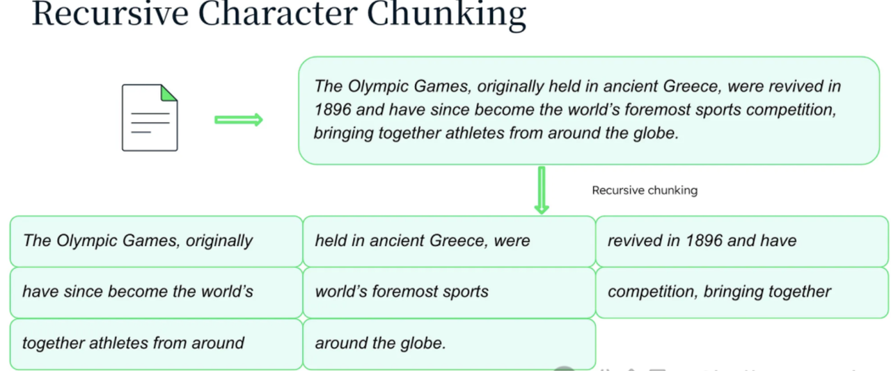

```JSON
#input text
input_text = "文本分块是自然语言处理（NLP）中的一项关键技术，其作用是将较长的文本切割成更小、更易于处理的片段。这种分割通常是基于单词的词性和语法结构，例如将文本拆分为名词短语、动词短语或其他语义单位。这样做有助于更高效地从文本中提取关键信息。"

from langchain.text_splitter import RecursiveCharacterTextSplitter
text_splitter = RecursiveCharacterTextSplitter(
    chunk_size = 100,  # 设置所需的文本大小
    chunk_overlap = 20
)

chunks = text_splitter.create_documents([input_text])
print(chunks)

>>>
[
    Document(page_content='文本分块是自然语言处理（NLP）中的一项关键技术，其作用是将较长的文本切割成更小、更易于处理的片段。这种分割通常是基于单词的词性和语法结构，例如将文本拆分为名词短语、动词短语或其他语义单位。这样做有助'),
    Document(page_content='短语、动词短语或其他语义单位。这样做有助于更高效地从文本中提取关键信息。')
]
```

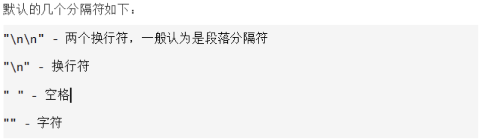

在上面的例子中，我们设置了一个块大小为30个字符，重叠部分为20个字符。RecursiveCharacterTextSplitter这个工具会尽量在保持文本逻辑结构的同时进行拆分。

不过，这也暴露了一个问题：由于块大小设置得比较小，它还是有可能在单词或句子中间“咔嚓”一刀，这显然不是我们想要的效果。

#### （4）专门分块（以markdown/Latex示例）
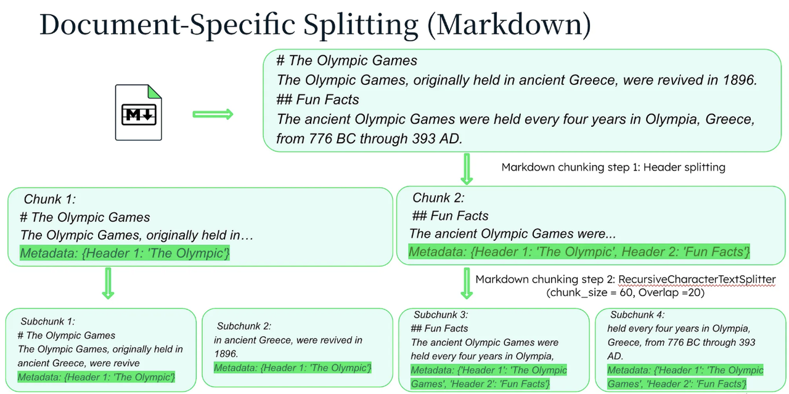

Markdown 文本拆分是一种根据 Markdown 的语法规则（例如标题、Bash代码块、图片和列表）进行文本分块的方法。具有对结构的敏感性，能够基于 Markdown 文档的结构特点进行有效的文本分割。

LaTex 文本拆分是一种专用于代码分块的工具。它通过解析LaTex 命令来创建各个块，这些块按照逻辑组织，如章节和小节等。能够产生更加准确且与上下文相关的分块结果，从而有效地提升LaTex文档的组织和处理效率。

#### （5）自主分割（代理分割（Agentic Splitter））
靠着LLM的超强理解力给文本分块：先理解内容的意思，再看上下文，找出最合适的地方“下刀”：准，灵活，但是计算资源和成本会高，会涉及微调

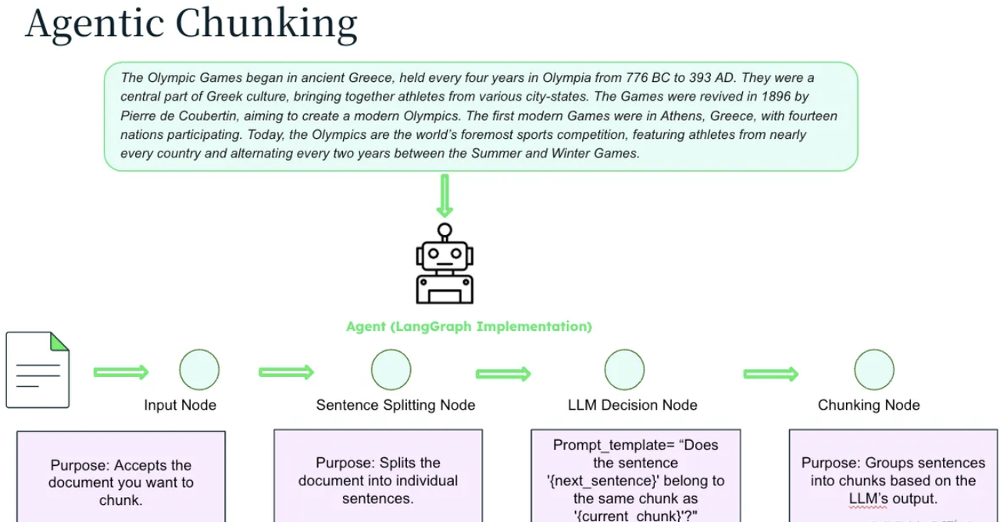

#### （6）滑动窗口+关键词语义切片
| **策略类型** | **优点** | **缺点** | **适用场景** |
| --- | --- | --- | --- |
| **滑动窗口** | - 上下文保留：通过 chunk_overlap 避免边缘信息丢失 - 可控大小：灵活设置 chunk_size 适配 LLM 上下文 - 成本低：不依赖大量 Embedding 调用，计算存储高效 | - 不懂语义：可能在逻辑密集处“硬切”，导致语义破坏 - 冗余高：切块重叠导致存储和计算成本上升 | 快速上线、成本敏感、对上下文连续性要求低的项目 |
| **语义切分** | - 语义完整：切块边界对齐语义，每块是紧凑逻辑单元 - 干净上下文：为 LLM 提供简洁输入 - 自适应大小：块长随语义结构动态调整 | - 上下文断裂：跨块信息可能遗漏，检索不全 - 块长难控：可能生成超长块，超出 LLM 处理能力 - 成本高：句子级向量计算频繁，调用成本高 | 高精度、逻辑完整性要求高，能接受额外成本的项目 |

**==先做语义切分（保证语义完整性），若语义切分后的块还是很大，超出token限制，再对这个块做滑动窗口切分（解决chunk大小问题）==**

```Python
import os
import re
import textwrap # 导入 textwrap 模块
from typing import List, Callable
from pydantic import Field
from llama_index.core import Settings, Document
from llama_index.core.node_parser import NodeParser, SentenceSplitter, SemanticSplitterNodeParser
from llama_index.llms.openai_like import OpenAILike
from llama_index.embeddings.dashscope import DashScopeEmbedding
from llama_index.core.utils import get_tokenizer

DASHSCOPE_API_KEY = os.getenv("DASHSCOPE_API_KEY")
# --- 自定义混合解析器类 (已更新为带详细打印的版本) ---
class HybridNodeParser(NodeParser):
    primary_parser: NodeParser
    secondary_parser: NodeParser
    max_chunk_size: int = 1024
    tokenizer: Callable = Field(default_factory=get_tokenizer, exclude=True)

    def _parse_nodes(self, documents: List[Document], **kwargs) -> List[Document]:
        print("--- 开始执行【混合切分】... ---")

        primary_nodes = self.primary_parser.get_nodes_from_documents(documents)
        print(f"\n{'='*25} 第一步（语义切分）结果 {'='*25}")
        print(f"初步切分出 {len(primary_nodes)} 个语义段落。")
        for i, p_node in enumerate(primary_nodes, 1):
            print(f"\n【原始语义段落 {i}】 (大小: {len(self.tokenizer(p_node.get_content()))} tokens)")
            print("-" * 60)
            print(textwrap.indent(p_node.get_content().strip(), '  '))
            print("-" * 60)

        print(f"\n{'='*25} 第二步（检查与二次切分）过程 {'='*25}")
        final_nodes = []
        for i, node in enumerate(primary_nodes, 1):
            node_size = len(self.tokenizer(node.get_content()))
            print(f"\n>>> 正在检查【原始语义段落 {i}】 (大小: {node_size} tokens)...")

            if node_size <= self.max_chunk_size:
                print(f"  └── 结果: 大小合适 (<= {self.max_chunk_size} tokens)，直接采纳。")
                final_nodes.append(node)
            else:
                print(f"  └── 结果: 段落过大 (> {self.max_chunk_size} tokens)，将使用滑动窗口进行二次切分。")
                print("\n      【即将被切分的原始内容】")
                print("      " + "-"*50)
                print(textwrap.indent(node.get_content().strip(), '      | '))
                print("      " + "-"*50)

                sub_nodes = self.secondary_parser.get_nodes_from_documents([Document(text=node.get_content())])
                print(f"\n      【二次切分结果】: 被切分成了 {len(sub_nodes)} 个重叠的子切块。")
                for j, s_node in enumerate(sub_nodes, 1):
                    print(f"\n        【子切块 {i}.{j}】 (大小: {len(self.tokenizer(s_node.get_content()))} tokens)")
                    print("        " + "-"*40)
                    print(textwrap.indent(s_node.get_content().strip(), '        | '))
                    print("        " + "-"*40)

                final_nodes.extend(sub_nodes)

        print("\n--- 【混合切分】完成！---")
        return final_nodes

    @classmethod
    def from_defaults(cls, **kwargs):
        raise NotImplementedError("请直接实例化此类，不要使用 from_defaults")

# --- 全局配置 --
DASHSCOPE_BASE_URL = "https://dashscope.aliyuncs.com/compatible-mode/v1"
Settings.llm = OpenAILike(model="qwen-plus", api_base=DASHSCOPE_BASE_URL, api_key=DASHSCOPE_API_KEY, is_chat_model=True, temperature=0.1)
Settings.embed_model = DashScopeEmbedding(model_name="text-embedding-v2", api_key=DASHSCOPE_API_KEY, batch_size=10)

# --- 中文分句函数 ---
def chinese_sentence_tokenizer(text: str) -> list[str]:
    sentences = re.findall(r'[^。！？…\n]+[。！？…\n]?', text)
    return [s.strip() for s in sentences if s.strip()]

# --- 准备长文档 ---
long_document = Document(
    text="""
    LlamaIndex 是一个用于构建、评估和部署高级 RAG（检索增强生成）应用程序的数据框架。它的核心使命是帮助开发者将私有或领域特定的数据与大型语言模型（LLMs）无缝连接。通过提供数据连接器、索引结构、查询引擎和评估工具，LlamaIndex 极大地简化了从原始数据到生产级 RAG 应用的全过程。它支持上百种数据源，包括 PDF 文件、数据库、Notion 页面以及各种 API，确保了数据接入的灵活性。

    在技术架构上，LlamaIndex 的设计哲学是模块化和可扩展性。其核心组件包括文档加载器（Document Loaders）、节点解析器（Node Parsers）、索引（Indices）、检索器（Retrievers）和查询引擎（Query Engines）。文档加载器负责从不同来源摄取数据。节点解析器（如我们正在讨论的这些）将加载的文档分解成更小、更易于管理的“节点”（Nodes），这是构建索引的基础单元。索引结构，特别是向量索引，利用嵌入模型将节点转换为高维向量，从而实现高效的语义搜索和检索。检索器则根据用户查询从索引中找出最相关的节点。最后，查询引擎协调检索器和 LLM，生成最终的、富有上下文的答案。这套架构使得开发者可以像搭乐高一样，自由组合和定制自己的 RAG 管道。

    评估是 LlamaIndex 另一个强大的功能。它提供了一整套工具来量化 RAG 应用的性能，包括答案的忠实度（Faithfulness）、相关性（Relevancy）以及上下文检索的准确率和召回率。通过这些量化指标，开发者可以系统地调试和优化他们的应用，而不仅仅是凭感觉。
    """
)

# --- 实例化两个基础的解析器 ---
semantic_parser = SemanticSplitterNodeParser(
    buffer_size=1,
    breakpoint_percentile_threshold=95,
    sentence_splitter=chinese_sentence_tokenizer,
    embed_model=Settings.embed_model
)
window_parser = SentenceSplitter(
    chunk_size=256,
    chunk_overlap=50
)

# --- 实例化并使用我们的混合解析器  ---
hybrid_parser = HybridNodeParser(
    primary_parser=semantic_parser,
    secondary_parser=window_parser,
    max_chunk_size=300,
    tokenizer=get_tokenizer()
)

# 执行混合切分
final_nodes = hybrid_parser.get_nodes_from_documents([long_document])

# --- 打印最终结果  ---
print(f"\n{'='*25} 最终生成的切块列表 {'='*25}")
print(f"切块总数: {len(final_nodes)}")
for i, node in enumerate(final_nodes, 1):
    content = node.get_content().strip()
    print(f"\n【最终切块 {i}】:")
    print("-" * 50)
    print(textwrap.indent(content, '  '))
    print("-" * 50)
```

测试结果：

```Markdown
--- 开始执行【混合切分】... ---

======================== 第一步（语义切分）结果 =======================
初步切分出 3 个语义段落。

【原始语义段落 1】 (大小: 150 tokens)
------------------------------------------------------------
LlamaIndex 是一个用于构建、评估和部署高级 RAG（检索增强生成）应用程序的数据框架。它的核心使命是帮助开发者将私有或领域特定的数据与大型语言模型（LLMs）无缝连接。通过提供数据连接器、索引结构、查询引擎和评估工具，LlamaIndex 极大地简化了从原始数据到生产级 RAG 应用的全过程。它支持上百种数据源，包括 PDF 文件、数据库、Notion 页面以及各种 API，确保了数据接入的灵活性。
------------------------------------------------------------

【原始语义段落 2】 (大小: 200 tokens)
------------------------------------------------------------
在技术架构上，LlamaIndex 的设计哲学是模块化和可扩展性。其核心组件包括文档加载器（Document Loaders）、节点解析器（Node Parsers）、索引（Indices）、检索器（Retrievers）和查询引擎（Query Engines）。文档加载器负责从不同来源摄取数据。节点解析器（如我们正在讨论的这些）将加载的文档分解成更小、更易于管理的“节点”（Nodes），这是构建索引的基础单元。索引结构，特别是向量索引，利用嵌入模型将节点转换为高维向量，从而实现高效的语义搜索和检索。检索器则根据用户查询从索引中找出最相关的节点。最后，查询引擎协调检索器和 LLM，生成最终的、富有上下文的答案。这套架构使得开发者可以像搭乐高一样，自由组合和定制自己的 RAG 管道。
------------------------------------------------------------

【原始语义段落 3】 (大小: 100 tokens)
------------------------------------------------------------
评估是 LlamaIndex 另一个强大的功能。它提供了一整套工具来量化 RAG 应用的性能，包括答案的忠实度（Faithfulness）、相关性（Relevancy）以及上下文检索的准确率和召回率。通过这些量化指标，开发者可以系统地调试和优化他们的应用，而不仅仅是凭感觉。
------------------------------------------------------------

======================== 第二步（检查与二次切分）过程 =======================

>>> 正在检查【原始语义段落 1】 (大小: 150 tokens)...
  └── 结果: 大小合适 (<= 300 tokens)，直接采纳。

>>> 正在检查【原始语义段落 2】 (大小: 200 tokens)...
  └── 结果: 段落过大 (> 300 tokens)，将使用滑动窗口进行二次切分。

      【即将被切分的原始内容】
      ------------------------------------------------------------
      在技术架构上，LlamaIndex 的设计哲学是模块化和可扩展性。其核心组件包括文档加载器（Document Loaders）、节点解析器（Node Parsers）、索引（Indices）、检索器（Retrievers）和查询引擎（Query Engines）。文档加载器负责从不同来源摄取数据。节点解析器（如我们正在讨论的这些）将加载的文档分解成更小、更易于管理的“节点”（Nodes），这是构建索引的基础单元。索引结构，特别是向量索引，利用嵌入模型将节点转换为高维向量，从而实现高效的语义搜索和检索。检索器则根据用户查询从索引中找出最相关的节点。最后，查询引擎协调检索器和 LLM，生成最终的、富有上下文的答案。这套架构使得开发者可以像搭乐高一样，自由组合和定制自己的 RAG 管道。
      ------------------------------------------------------------

      【二次切分结果】: 被切分成了 2 个重叠的子切块。

        【子切块 2.1】 (大小: 150 tokens)
        ----------------------------------------
        在技术架构上，LlamaIndex 的设计哲学是模块化和可扩展性。其核心组件包括文档加载器（Document Loaders）、节点解析器（Node Parsers）、索引（Indices）、检索器（Retrievers）和查询引擎（Query Engines）。文档加载器负责从不同来源摄取数据。节点解析器（如我们正在讨论的这些）将加载的文档分解成更小、更易于管理的“节点”（Nodes），这是构建索引的基础单元。索引结构，特别是向量索引，利用嵌入模型将节点转换为高维向量，从而实现高效的语义搜索和检索。
        ----------------------------------------

        【子切块 2.2】 (大小: 150 tokens)
        ----------------------------------------
        索引结构，特别是向量索引，利用嵌入模型将节点转换为高维向量，从而实现高效的语义搜索和检索。检索器则根据用户查询从索引中找出最相关的节点。最后，查询引擎协调检索器和 LLM，生成最终的、富有上下文的答案。这套架构使得开发者可以像搭乐高一样，自由组合和定制自己的 RAG 管道。
        ----------------------------------------

>>> 正在检查【原始语义段落 3】 (大小: 100 tokens)...
  └── 结果: 大小合适 (<= 300 tokens)，直接采纳。

--- 【混合切分】完成！---
```

#### （7） **LLM-Based chunking（基于模型的切块方法）行业最佳落地方案（适用于法律、医疗等高精度要求行业）**
背景：固定字符块、父子文档等传统切分方法准确性不足，无法满足法律、医学等专业领域中普遍存在的长文本切分难题。而传统LLM分块缺点：时延、成本、输出慢、输出窗口容量限制；

1、LLM-Based chunking（优化后的基于大模型的切块方法， **改进的ID编号分块法**）核心思路：

```Python
模仿人类阅读时的自然切分逻辑，利用LLM实现智能切分：让 LLM 只负责“切分逻辑”和“输出 ID”，而最终重构由本地完成

通过4步流程实现精准切分：
（1）文档标号：将文档解析为句子，为每个句子分配唯一 ID。（2）提示词引导：把带 ID 的文档送给 LLM，并通过 Prompt 引导它输出哪些句子应该合并成一个语义块。（3）模型输出分隔标记：LLM 输出的不是原文，而是 ID 的分组结果（如 chunk 1,2）。（4）按标记组合：本地再根据 ID，把原文拼接为最终的分块。
```

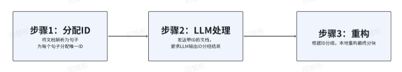

```Python
举例：

原文：
Alice opened the window.
The fresh air made her feel better.

处理后：
<1>Alice opened the window.</1>
<2>The fresh air made her feel better.</2>

系统先把文本拆分成句子，并为每个句子分配一个唯一的 ID（如 <1>、<2>）。在后续步骤中，LLM 不需要重复生成完整句子，只需要输出这些 ID（例如 chunk 1,2）,切分输出的内容变少最终本地系统会根据这些 ID，把对应的原文句子重新拼接成一个完整的语义块
```

举例：

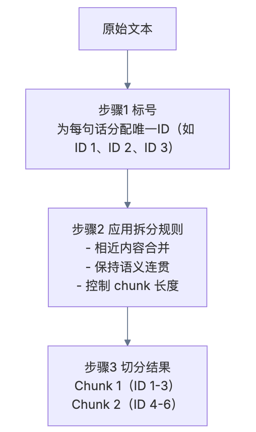

```Python
Day 1: We arrived in Beijing in the morning.
The weather was sunny and warm.
We visited the Forbidden City.

Day 2: We went to the Great Wall.
It was crowded but very impressive.
In the evening, we enjoyed Peking Duck together.
```

步骤1：把每句话加上唯一 ID：

```Python
<1> Day 1: We arrived in Beijing in the morning. </1>
<2> The weather was sunny and warm. </2>
<3> We visited the Forbidden City. </3>
<4> Day 2: We went to the Great Wall. </4>
<5> It was crowded but very impressive. </5>
<6> In the evening, we enjoyed Peking Duck together. </6>
```

步骤2：应用拆分规则

```Python
LLM Prompt示例：

相近内容放一起（同一天的行程合并）。
保证语义连贯（不能把同一事件拆开）。
控制 chunk 大小（>500字 <800字，但此例短文本可忽略）。
```

步骤3：切分结果

**Chunk 1**：包含 ID 1–3（第一天的行程）

```Python
Day 1: We arrived in Beijing in the morning.
The weather was sunny and warm.
We visited the Forbidden City.
```

**Chunk 2**：包含 ID 4–6（第二天的行程）

```Python
Day 2: We went to the Great Wall.
It was crowded but very impressive.
In the evening, we enjoyed Peking Duck together.
```

2、对文本的切块尽可能用本地模型，成本更低，最佳实践是先用最强模型先试1-2个文档，确定提示词和规则无问题，再逐步切换到小模型

3、优点：

```Python
（1）成本低：
模型只输出短短几个 ID，而不是几百字甚至上千字的原文，token 开销大幅减少。特别是在处理长文档（几十页、上万字）时，节省量非常可观。
（2）避免错误：
如果让 LLM 直接重写原文，可能会出现漏字、改写、甚至幻觉。只输出 ID，就把“重建原文”的工作交给本地程序（精准拼接），保证 100% 一致
（3）可控性更强：
可以随时调整拆分规则，本地重新组合，而不用再让 LLM 重新跑一遍
```

##### 4、【实践建议】几十万份法律文件如何切分，上来直接用LLM分么？
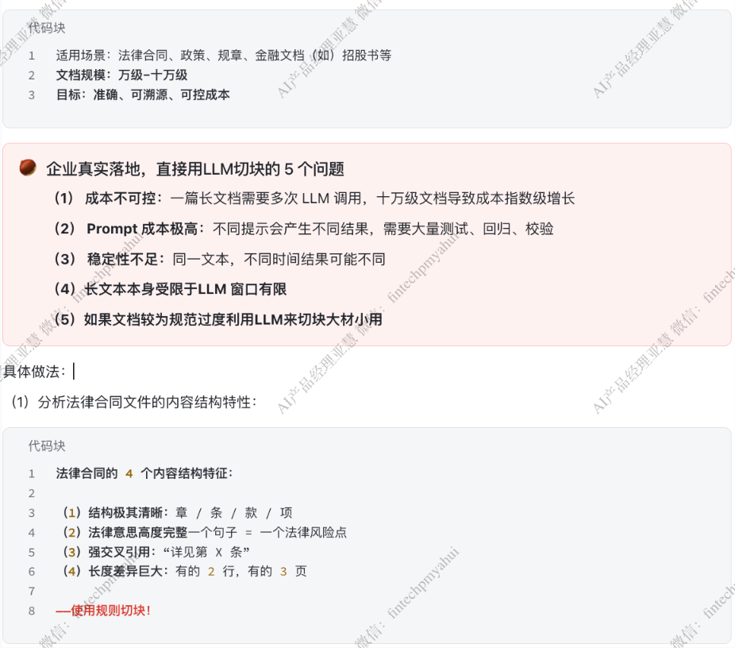

（3） **prompt推荐示例（召回数据时，提示词如何组织）**

```Python
你是一名专业法律助理。你只能依据下方提供的合同片段回答，不得引入外部知识、常识推断或自行补充条款内容。

#任务目标：
针对用户问题，综合多个合同片段给出结论，并确保“可核验、可溯源、可解释”。

#工作规则（必须遵守）：
仅基于 <context> 中的内容作答；若无法支持结论，必须明确说明“上下文不足”。
必须综合所有相关片段，不得只引用单一片段而忽略其他片段。
若片段之间存在冲突或不一致：
优先采用：补充/修订条款 > 主合同条款；
其次采用：更具体条款 > 更概括条款；
再其次采用：更晚签署/生效日期 > 更早日期（如上下文提供日期信息）；
必须在回答中明确指出冲突点与取舍依据。
每一个关键结论后都必须标注来源，来源格式为：【文档名称｜文档ID｜位置】
输出必须结构化，至少包含：结论、依据与引用、冲突处理（如有）、信息不足说明（如有）。

#合同上下文（检索结果）
<context>
    <search_result index="1">
        [文档名称：{document_name_1}]
        [文档ID：{document_id_1}]
        [位置：{article_number_1}]
        [条款类型：{clause_type_1}]
        <content>
        {retrieved_chunk_text_1}
        </content>
    </search_result>

    <search_result index="2">
        [文档名称：{document_name_2}]
        [文档ID：{document_id_2}]
        [位置：{article_number_2}]
        [条款类型：{clause_type_2}]
        <content>
        {retrieved_chunk_text_2}
        </content>
    </search_result>

    <search_result index="3">
        [文档名称：{document_name_3}]
        [文档ID：{document_id_3}]
        [位置：{article_number_3}]
        [条款类型：{clause_type_3}]
        <content>
        {retrieved_chunk_text_3}
        </content>
    </search_result>
</context>

用户问题
{用户问题}

#输出格式（严格遵循）：
结论（用 1–3 句话回答问题）
依据与引用（逐条列出）
要点A：……【文档名称｜文档ID｜位置】
要点B：……【文档名称｜文档ID｜位置】

#冲突与取舍（如存在冲突才输出）
冲突点：……
取舍依据：……
采用结论：……【文档名称｜文档ID｜位置】

#信息不足（如信息不足才输出）
缺少的信息：……
建议补充检索的方向/关键词：……
```

[Rules_LLM_Strategic_Document_Intelligence.pdf](https://internal-api-drive-stream.feishu.cn/space/api/box/stream/download/preview/KJbTbInK0o5COxxZHjccJoFhn3b?mount_point=docx_file&preview_type=16)

#### ==（8）总结与最佳实践建议（没有通用的方法也没有最好的办法，只有合适的办法）——面试可能会问==
让切片策略为混合检索、重排、查询转换、多阶段检索等“上层能力”提供高质量弹药，既提高召回，也控制成本与幻觉风险。 **总体建议：从结构优先出发，用语义与层次化补强；把重叠当作战术按钮而非主策略；用评估闭环持续校正**

**1、先结构后语义：优先使用结构感知策略**

**适用场景： HTML、PDF、Markdown、表格、手册、API文档等有明显结构的资料；对技术文档和政策规范，优先按“章节/小节/表格”切片，再决定是否追加语义微调或窗口扩展**

```SQL
具体做法：

结构模板化（如 RAGFlow 模板）。
LlamaIndex：HTMLNodeParser、MarkdownNodeParser、TableNodeParser 将标题层级、列表、表格保留。


优势：
最大化保留原始语义与上下位关系（章节、图表说明、脚注），减少“语义漂移”。结构信号可作为检索特征（如标题权重、表格标头）。
```

**2、文本为王时：采用语义驱动切片**

**适用场景：**新闻稿、研究报告、会议记录、访谈稿等非结构化文本。

```SQL
做法：LlamaIndex：SemanticSplitterNodeParser 基于语义边界切块，而非固定字数。

优势：上下文连贯性更好；避免“句中截断”导致的意义丢失。对抽象概念、跨段关联的提问更稳定。
```

```Markdown
SemanticSplitterNodeParser的核心思想是：根据文本语义变化点进行动态切分，而非依赖固定字符数或句法结构。

工作流程如下：
- 句子级拆分： 将文档按句子进行划分。
- 组块构建：连续多个句子组合成一个“句子组”（由`buffer_size`控制）。
- 语义嵌入生成：使用指定嵌入模型（如OpenAI或HuggingFace模型）为每个句子组生成向量表示。
- 语义相似度计算：通过余弦距离衡量相邻句子组之间的语义差异。
- 动态切分决策： 当语义差异超过设定的阈值（由`breakpoint_percentile_threshold`控制），则在此处插入切分点。

核心参数：
`embed_model` (BaseEmbedding, 必需): 用于生成语义向量的嵌入模型。这是语义比较的基础，其质量直接决定切片效果。
 `buffer_size` (整数, 默认:=1):评估语义相似性时，组合在一起的句子数量。设为1表示逐句比较；大于1则将多个句子视为一个单元，有助于考虑更广泛的上下文。
 `breakpoint_percentile_threshold` (整数, 默认: 95):确定切分点的余弦距离百分位阈值。敏感度调节参数： 较低值（如80）意味着对语义变化更敏感，产生更多、更小的区块；较高值（如98）要求语义变化非常显著才切分，产生更少、更大的区块。
```

```Python
from llama_index.core.node_parser import SemanticSplitterNodeParser
from llama_index.embeddings.openai import OpenAIEmbedding
from llama_index.core.schema import Document
import os

# 设置 API 密钥
# os.getenv("OPENAI_API_KEY")

# 示例文本：包含多个主题的内容
multi_theme_text = (
    "人工智能（AI）正在彻底改变医疗保健行业。AI算法能够通过分析医学影像，比人类放射科医生更早、更准确地诊断出癌症等疾病。"
    "此外，AI在药物研发中也发挥着关键作用，能够预测化合物的有效性，从而大大缩短新药上市的时间。"
    "话锋一转，我们来谈谈金融科技（FinTech）。移动支付已经成为全球主流，数字钱包和非接触式支付改变了人们的消费习惯。"
    "区块链技术则为跨境支付和资产代币化提供了去中心化的解决方案，有望重塑整个金融体系的底层架构。"
)

# 构建文档对象
document = Document(text=multi_theme_text)

# 初始化嵌入模型
embed_model = OpenAIEmbedding()

# 初始化语义切分器
splitter = SemanticSplitterNodeParser(
    buffer_size=1,
    breakpoint_percentile_threshold=90,
    embed_model=embed_model
)

# 执行切分
nodes = splitter.get_nodes_from_documents([document])

# 输出结果
print(f"语义切分后得到 {len(nodes)} 个节点：")
for i, node in enumerate(nodes):
    print(f"--- 节点 {i+1} ---")
    print(node.get_content())
    print("-" * 20)
```

**3、“由小到大”的层次化检索：精度 × 完整性**

**适用场景： 多跳问答、需要兼顾事实粒度与上下文完整性的任务。**

```SQL
做法（3选1 or组合）：父子模式（Dify ）：父块保整体结构与摘要；子块保细粒度事实。检索先父后子（或并行）。
窗口式节点（LlamaIndex SentenceWindowNodeParser）：将句子窗口（上下若干句）与核心句绑定。
命题化检索（Propositional Retrieval）：将段落抽为“命题/要点”，用命题嵌入做第一阶段召回，再回溯原文证据。

优势：小块 → 精准定位事实；大块 → 提供足够证据与上下文，降低模型自填空和幻觉。
```

```Markdown
### LlamaIndex 中的命题化实现方案
传统切片难满足RAG高精度与完整上下文需求。LlamaIndex引入“命题（Propositions）原子化检索。
- “由小到大”思想：细粒度检索提高准确率，结合父区块提供完整上下文。
- 目标：协同提升检索精度与生成质量。

#### 1. TopicNodeParser：LLM驱动的主题一致性重组器（代价高）
- 功能：
    - 利用LLM将段落分解为多个命题。
    - 根据主题一致性重组命题，形成新语义区块。
- 参数： `similarity_method`（LLM或嵌入模型判断主题相关性）。
- 场景： 检索精度要求极高、允许高计算成本的场景。
- 优势： 精准捕捉语义边界，深度解析复杂文本。
- 代价： 依赖大模型，推理成本高，适合离线处理。

#### 2. DenseXRetrievalPack：开箱即用的命题化解决方案
- 核心流程：
    - 自动为知识库节点提取命题。
    - 构建专门针对命题的检索器。
    - 返回与命题相关的原始父区块用于生成。
- 优势： 快速部署命题化检索，无需手动编写提示词或训练。
- 架构： 结合LLM提取命题 + 向量索引构建 + 递归检索。

### 命题提取的实现细节
- LlamaIndex和Langchain均有实现。
- LlamaIndex使用论文提供的提示词生成命题。
```

````TypeScript
from llama_index.core.prompts import PromptTemplate
from llama_index.llms.openai import OpenAI
from llama_index.embeddings.openai import OpenAIEmbedding
from llama_index.packs.dense_x_retrieval import DenseXRetrievalPack
from llama_index.core.readers import SimpleDirectoryReader
from llama_index.core.llama_pack import download_llama_pack
import os
import nest_asyncio

# 应用 nest_asyncio 以支持异步调用
nest_asyncio.apply()

PROPOSITIONS_PROMPT = PromptTemplate(
    """Decompose the "Content" into clear and simple propositions, ensuring they are interpretable out of
context.
1. Split compound sentence into simple sentences. Maintain the original phrasing from the input
whenever possible.
2. For any named entity that is accompanied by additional descriptive information, separate this
information into its own distinct proposition.
3. Decontextualize the proposition by adding necessary modifier to nouns or entire sentences
and replacing pronouns (e.g., "it", "he", "she", "they", "this", "that") with the full name of the
entities they refer to.
4. Present the results as a list of strings, formatted in JSON.

Input: Title: ¯Eostre. Section: Theories and interpretations, Connection to Easter Hares. Content:
The earliest evidence for the Easter Hare (Osterhase) was recorded in south-west Germany in
1678 by the professor of medicine Georg Franck von Franckenau, but it remained unknown in
other parts of Germany until the 18th century. Scholar Richard Sermon writes that "hares were
frequently seen in gardens in spring, and thus may have served as a convenient explanation for the
origin of the colored eggs hidden there for children. Alternatively, there is a European tradition
that hares laid eggs, since a hare’s scratch or form and a lapwing’s nest look very similar, and
both occur on grassland and are first seen in the spring. In the nineteenth century the influence
of Easter cards, toys, and books was to make the Easter Hare/Rabbit popular throughout Europe.
German immigrants then exported the custom to Britain and America where it evolved into the
Easter Bunny."
Output: [ "The earliest evidence for the Easter Hare was recorded in south-west Germany in
1678 by Georg Franck von Franckenau.", "Georg Franck von Franckenau was a professor of
medicine.", "The evidence for the Easter Hare remained unknown in other parts of Germany untilthe 18th century.", "Richard Sermon was a scholar.", "Richard Sermon writes a hypothesis about
the possible explanation for the connection between hares and the tradition during Easter", "Hares
were frequently seen in gardens in spring.", "Hares may have served as a convenient explanation
for the origin of the colored eggs hidden in gardens for children.", "There is a European tradition
that hares laid eggs.", "A hare’s scratch or form and a lapwing’s nest look very similar.", "Both
hares and lapwing’s nests occur on grassland and are first seen in the spring.", "In the nineteenth
century the influence of Easter cards, toys, and books was to make the Easter Hare/Rabbit popular
throughout Europe.", "German immigrants exported the custom of the Easter Hare/Rabbit to
Britain and America.", "The custom of the Easter Hare/Rabbit evolved into the Easter Bunny in
Britain and America." ]

Input: {node_text}
Output:"""
)

import json

def safe_json_loads(text: str) -> list:
    # 去除首尾空白和不可见字符
    text = text.strip()

    # 如果以 ```json 开头，去掉代码块标记
    if text.startswith("```json"):
        text = text[7:]
    if text.endswith("```"):
        text = text[:-3]

    # 再次去除首尾空白
    text = text.strip()

    try:
        return json.loads(text)
    except json.JSONDecodeError as e:
        print(f"JSONDecodeError at position {e.pos}: {e}")
        return []

def extract_propositions(text: str, llm: OpenAI):
    """
    使用 LLM 提取文本中的命题（Propositions）
    """

# 构建完整提示词
    prompt = PROPOSITIONS_PROMPT.format(node_text=text)

    # 调用 LLM 获取响应
    response = llm.complete(prompt).text.strip()

    # 解析响应为 JSON 列表
    try:
        propositions = safe_json_loads(response)
    except Exception as e:
        print("JSON解析失败，原始响应：", response)
        return []

    return propositions

# 初始化 LLM
llm = OpenAI(model="gpt-4o", temperature=0.1, max_tokens=750)
embed_model = OpenAIEmbedding(embed_batch_size=128)

# 示例文本用于测试 extract_propositions 函数
test_text = "埃菲尔铁塔位于巴黎，建于1889年。"

# 调用函数并输出结果
propositions = extract_propositions(test_text, llm)
print("提取出的命题：")
print(propositions)
````

**4、重叠是“战术补充”，而非战略依赖**

**适用场景：**固定或递归切片（例如长度驱动的 tokenizer 切块）。

```SQL
重叠比例： 10%–20% 通常够；更高会引发索引冗余、重复召回和重排成本上升。优先用层次化/窗口弥补上下文，而不是一味加大重叠。对对齐敏感（公式、代码、表格）片段，宁可小幅增加重叠，也不要切断语义单元。
```

**5、建立评估闭环：指标、对照与人审（任何RAG应用上线及运行全周期）**

```SQL
指标：召回率（Recall@k）、精确率、答案正确性（人审/判定规则）、覆盖率（Has-Answer）、延迟等。
实验：A/B 测试切片配置（大小、重叠、解析器），结合不同检索器（BM25/向量/混合）与重排器。
```

#### 2、文档切分最好是按照“语义切割”
分块如何选择：

（1）文档类型：结构化(如报告)适合段落分块，非结构化(如聊天记录)适合语义分块

（2）查询复杂性：复杂查询需语义或代理分块，简单查询可用固定长度分块。

（3）资源可用性：计算资源有限时，优先固定长度或基于句子的分块。

（4）期望结果：速度优先选固定长度，准确性优先选语义分块，上下文优先选滑动窗口

滑动窗口：

> 将文档视为连续的数据流， **==通过固定大小的窗口分段截取内容，每次只关注一小段内容，并逐步向前滑动以扫描全文。==**其核心在于平衡信息完整性与覆盖效率：窗口不宜过小，以避免信息碎片化；同时需合理设置步长，确保无遗漏地处理所有内容。在自然语言处理和大数据分析中广泛应用，既能聚焦局部细节，又能保持全局连贯性。
>

先举个例子：

| 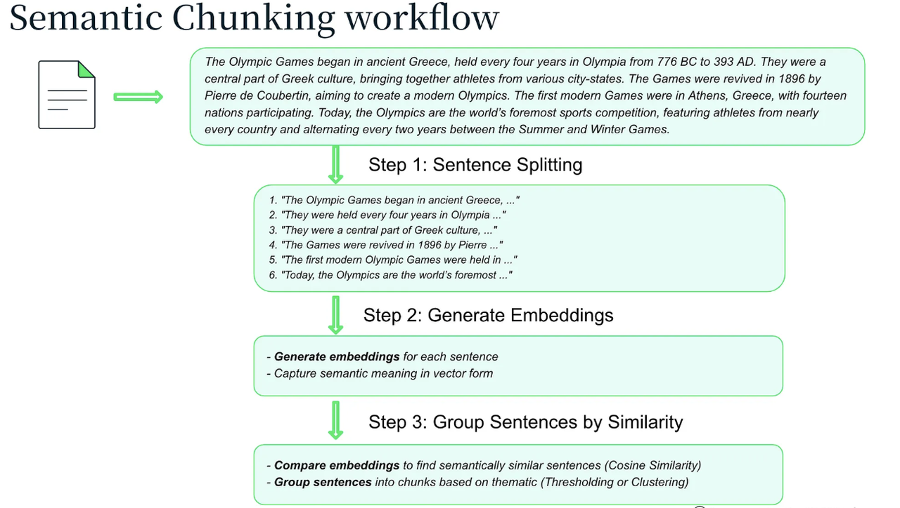 | 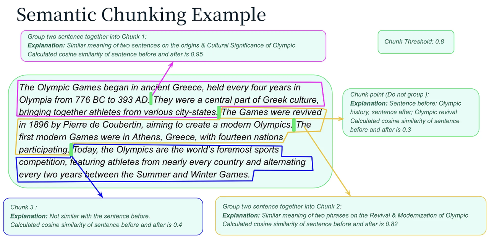 |
| --- | --- |

第一步：先把文档“切”成一句一句的。会像语文老师一样，准确地识别出每个完整的句子

第二步：给每个句子穿上“智能外套”——生成嵌入向量

第三步：系统把意思相近的句子归类到一起，就像把同类型的书籍放在同一个书架上

右上举例展示了：如何用余弦相似度来给句子分组。简单来说，就是让聊同一件事的句子待在一起，而话题不同的句子就各走各的路。通过这种可视化的方式能清楚地看到语义分块如何保持文本连贯性。 ==它用嵌入技术把意思相近的内容打包在一起，做成一个个“语义块”==

基于 LLM 的文档对话架构分为两部分：先检索，后推理。 **重心在检索(推荐系统)推理交给 LLM 整合即可**

检索部分要满足3点：

①尽可能 **提高召回率**

②尽可能 **减少无关信息**

③ **速度快**

**将所有的文本组织成二级索引，第一级索引是[关键信息]，第二级是[原始文本]，二者一一映射**。 **检索部分只对关键信息做embedding，参与相似度计算**，把召回结果映射的原始文本交给 LLM。架构如下：

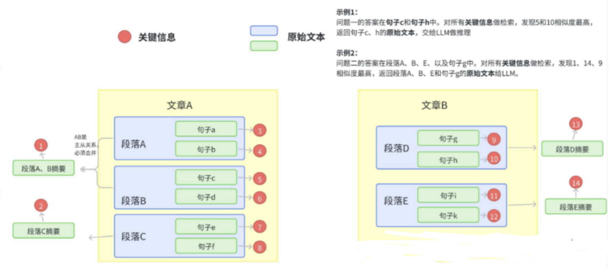

从架构图可以看到：句子、段落、文章都要关键信息，如果为了效率考虑，可以不用对句子构建关键信息

（1） **文章的切分及关键信息抽取**

a）关键信息：为各语义段的关键信息集合，或者是各个子标题语义扩充之后的集合

b) **==语义切分方法：==**

- **利用 NLP 的篇章分析(discourse parsing)工具：**提取出段落之间的主要关系，譬如上述极端情况2展示的段落

- **写一个简单算法利用BERT 等模型来实现语义分割：**BERT 等模型在预训练的时候采用了NSP（nextsentence prediction)的训练任务，因此 BERT 完全可以判断两个句子(段落)是否具有语义衔接关系。这里可以设置 **相似度阈值t**，从前往后依次判断相邻两个段落的相似度分数是否大于t，如果大于则合并，否则断开

```Python
def is_nextsent(sent, next_sent):
    encoding = tokenizer(sent, next_sent, return_tensors="pt", truncation=True, padding=False)

    with torch.no_grad():
        outputs = model(**encoding, labels=torch.LongTensor([1]))
        logits = outputs.logits
        probs = torch.softmax(logits / TEMPERATURE, dim=1)
        next_sentence_prob = probs[:, 0].item()

    if next_sentence_prob <= MERGE_RATIO:
        return False
    else:
        return True
```

c） **==语义段的(句子)关键信息抽取：==**

如果向量检索效率很高，获取语义段之后完全可以按照真实段落及句号切分，以缓解细粒度知识点检索时大语块噪声多的场景。当然，关键信息抽取还有其他思路：

方法 1： **利用 NLP中的成分句法分析(constituency parsing)工具和命名实体识别(NER)工具提取**

a）成分句法分析(constituency parsing)工具：可以提取核心部分(名词短语、动词短语……)

b）命名实体识别(NER)工具：可以提取重要实体(货币名、人名、企业名.....）

举例：

*原始文本：*

*MM团队的成员都是精英，核心成员是前谷歌高级产品经理张三，前meta首席技术官李四...*

*关键信息：(MM团队，核心成员，张三，李四)*

方法 2： **可以用语义角色标注(Semantic RoleLabeling)来分析句子的谓词论元结构**，提取“谁对谁做了什么"的信息作为关键信息。

方法 3： **直接法**。 NLP 的研究中本来就有关键词提取工作(Keyphrase Extraction)。也有一个成熟工具可以使用：

a）HanLP：中文效果好，需要付费，免费版调用次数有限。

b）开源工具KeyBERT，英文效果好，中文效果差。

方法 4： **垂直领域建议的方法（单独训模型）**。以上方法在垂直领域都有准确度低的缺陷，垂直领域可仿照 ChatLaw 的做法， **即单独训练一个生成关键词的模型**。ChatLaw 就是训练了一个 KeyLLM。

##### **==新方案：解决语义割裂：基于滑动窗口关键词语义段落==**
（1）关键词：包括重要的概念、专业名词，或者是反复出现的关键信息。它们相当于文章的"信息浓缩点"。

如果发现窗口刚好把一个关键词"拦腰截断"，或者把一个完整的意思给切开了；这时候就可以灵活调整窗口的位置，让关键词或完整语义保留在一个窗口里。

**简单来说，就是像"挪动相框"一样调整窗口位置，确保重要的内容不会被生硬地切开，保持意思的完整。**

（2）滑动窗口：将文档视为连续的数据流， **==通过固定大小的窗口分段截取内容，每次只关注一小段内容，并逐步向前滑动以扫描全文。==**

可以把这两种方法结合起来，打造一个更聪明的文档分段方案：

> ==先粗切：用滑动窗口把文档切成基础段落==；
>

> ==再检查：看看每段开头结尾有没有把关键词或完整意思给切断了==；
>

> 最后优化： ==根据关键词的位置和上下文，稍微调整分段位置，让每段话意思完整又不啰嗦==。
>

（3）如何评估切片效果：是否保留完整语义单元；是否避免关键词被割裂；是否有助于提升后续检索准确性

#### 3、文本分块不准 目前的采用的较多的解决方案 vs 可能的新方案
（1）当前方案- **文本块聚类总结：**

[《RAPTOR：Recursive Abstract Processing for Tree-Organized Retrieval》 ](https://arxiv.org/html/2401.18059v1)中提出了一种 **==基于文本块聚类的解决方案，以应对单一文本块缺乏全局信息的问题==**。

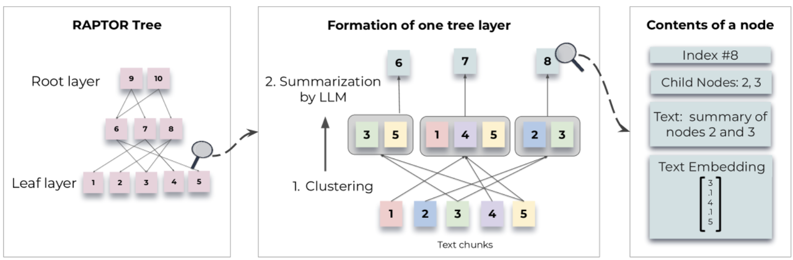

（1）首先 **使用聚类算法对切分后的文本块进行语义聚类**

（2）利 **用大模型对每个聚类的多个文本块生成总结**

（3）文本块和生成的总结 **被组织成树状结构，树的高层节点代表多个文本块的内容总结，底层节点则是具体的文本块**

> ==当用户提出问题时，检索器将从树的高层节点开始，按自顶向下的方式查找相关文本块==
>

限制： 实际应用中受限于树状结构带来的效率问题，构建树状结构需要对多个文本块进行聚类和总结，过程复杂且计算量大，导致运行效率较低 ，难以运用在大规模文档场景下

（2）当前方案- **文本块语义补充**

当前实践更倾向于采用文本块语义补充的策略。Anthropic 团队提出了一种基于长上下文大模型的语义补充方法（ [https://www.anthropic.com/news/contextual-retrieval ](https://www.anthropic.com/news/contextual-retrieval)），以增强文本块的完整性和可理解性。

（1）首先 **将每个文本块与全文一同输入到长上下文大模型**中

（2） **利用模型对全文信息的理解，补充当前文本块的上下文，从而使其语义更加完整**，避免歧义。

举例，以 [**《中华人民共和国民法典》**](https://docs.qq.com/doc/DVHpNSmNNVVFnc3Jx)第26页中的一段关于知识产权的法规为例：

```Python
第一百二十三条 【知识产权的定义】民事主体依法享有知识产权。
知识产权是权利人依法就下列客体享有的专有的权利:
(一)作品;
(二)发明、实用新型、外观设计;
(三)商标;
(四)地理标志;
(五)商业秘密;
(六)集成电路布图设计;
(七)植物新品种;
(八)法律规定的其他客体。
第一百二十四条 【继承权】自然人依法享有继承权。
自然人合法的私有财产,可以依法继承。
第一百二十五条 【投资性权利】民事主体依法享有股权和其他投资性权利。
```

a）在 **固定长度切块策略**下，该片段可能被拆分为以下两个文本块： 在检索过程中，文本块 1 由于包含完整的条款标题，较容易被模型召回。文本块 2 中由于与条款标题分离，模型无法准确捕捉到文本块2的语义，难以被准确检索到。 **这将导致 RAG 生成模型仅依据文本块 1 进行回答，错误地认为权利人只对列出的前四点对象享有知识产权，从而遗漏关键信息，影响回答的完整性和准确性**

```Python
<文本块1>

第一百二十三条 【知识产权的定义】民事主体依法享有知识产权。
知识产权是权利人依法就下列客体享有的专有的权利:
(一)作品;
(二)发明、实用新型、外观设计;
(三)商标;
(四)地理标志;
```

```Python
<文本块2>

(五)商业秘密;
(六)集成电路布图设计;
(七)植物新品种;
(八)法律规定的其他客体。
第一百二十四条 【继承权】自然人依法享有继承权。
自然人合法的私有财产,可以依法继承。
第一百二十五条 【投资性权利】民事主体依法享有股权和其他投资性权利。
```

b） **文本块语义补充后，**使用Anthropic提供的代码，并通过Claude 3.5模型对文本块2进行语义补充，补充后的文本块2内容如下，可以发现： **==大模型能够根据全文信息推理出文本块2的条款属于知识产权的内容，并将这一补充信息加入文本块的前方，从而完善了文本块的语义==****。**

```Python
<文本块2>

*本部分是《民法典》第一编《总则》第一章《基本规定》的一部分，特别是在讨论民事权利的部分。详细阐述了知识产权的种类，明确了民事主体的继承权和投资权。*

(五)商业秘密;
(六)集成电路布图设计;
(七)植物新品种;
(八)法律规定的其他客体。
第一百二十四条 【继承权】自然人依法享有继承权。
自然人合法的私有财产,可以依法继承。
第一百二十五条 【投资性权利】民事主体依法享有股权和其他投资性权利。
```

但是 **当用户提问：“根据知识产权的定义，哪些对象可以享有专有权利？”**

**由于补全后的文本块2中提及了“知识产权种类“这一信息，RAG系统能够召回该内容并正确返回答案。但是其实**模型添加的上下文信息并不完全正确。文本块2的内容实际上属于 [**《民法典》**](https://docs.qq.com/doc/DVHpNSmNNVVFnc3Jx)的第一编第五章《民事权利》，而非第一章《基本规定》。 **==所以大模型在进行语义补充时，可能会出现一定的事实错误。而且，文本块中丢失的语义也很难通过几句简短的语句来补充==**

c） **局限性总结：**

**==计算成本高：==**需要将每个文本块与其全文一同输入大模型进行处理，对于大规模文档来说计算开销极高，难以在实际应用中大规模推广

**==适用范围有限：==**==对==于更复杂的语义破碎、文章层级等问题（如段落之间的逻辑关联、细粒度的语义信息），大模型的补全能力仍然有限，难以保证文本块语义的完整性和正确性

##### **==新方案：方案1+方案2：1-上下文检索（方案来源于庖丁科技）==**
a）方案对比：

当前主流的重排模型是逐一将每个文本块和用户提问输入模型，通过评估每个文本块与提问的语义相似度进行排序。（如下图左），假设embedding模型召回n个文本块，传统的重排模型会将每个文本块与用户提问独立输入重排模型，通过n次独立评分，计算得到每个文本块与用户提问的相似度分数。由于n次输入相互独立，模型每次评分时只能“看到”一个文本块。加之文本切块带来的语义缺失和歧义等问题，往往无法准确捕捉文本块之间的关系。

**新方案：****==“长上下文重排模型”==****：旨在同时输入多个检索到的文本块，让重排模型能够“看到”多个文本块的内容（如下图右）。首先将检索到的n个文本块按照其在原文中的顺序进行拼接，形成一段语义连贯的长文本，再将这段长文本与用户提问一起输入模型。模型仅需一次输入便能计算出n个文本块与用户提问的相似度分数**

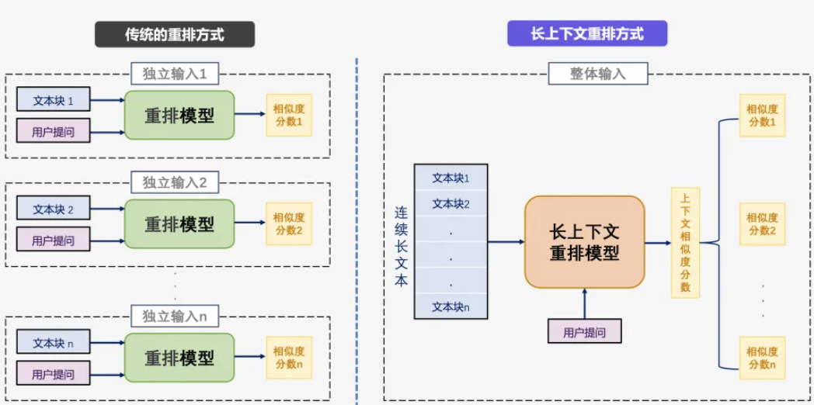

多个文本块作为一个整体输入到模型，可以相互补充在文本切块过程中丢失的语义，使模型能够基于更完整的上下文进行重排决策。当输入的文本块数量足够大时，输入重排模型的内容能够基本还原出原文档的语境，在文档切块阶段被打碎，在重排阶段又被重新拼凑完整

b）如何让切块拼的更好：

文本切分阶段选择“Overlap Chunk”的方法：按照每800个tokens的长度对文本进行切分，并让相邻的两个文本块重叠400个token。 **==由于相邻文本块存在一段重叠的文本，进而使得检索模型对相邻文本块计算得到的相似分数更为接近，更容易将连续文本块一起召回。在召回大量连续文本块后，根据文本块在原文中的顺序进行排序，并将其输入长上下文重排模型，从而确保重排阶段能够为文本块提供更加完整的语义信息。==**

（4） **==新方案1：方案1+方案2：2-融合目录结构==**

语义缺失”和“语义歧义”通过长上下文重排方法可以较为有效地进行处理，但对于“文档结构信息丧失”，长上下文重排依然难以达到理想效果。 ==文本切块破坏了文档的全局结构，当用户提问类似“请总结本文的第三章第二节”这样需要依赖文档结构的查询时，embedding模型往往难以完整召回与“第三章第二节”相关的文本块，导致后续的上下文重排无法提供良好的结果。==

所以，通过 **训练“目录结构模型”，在文档解析阶段，根据文档中的文字和图像信息识别出文档的章节目录树。****==文本切块结合章节目录树进一步优化切块策略——仅对同一目录结构下的文本进行切块==**

**章节目录树：**是一种层次化结构，展示文档各章节及其子章节的组织方式，帮助明确文档框架并便于定位和引用特定内容。它通常以树形结构呈现，其中根节点表示文档的整体内容，每个分支节点代表一个章节或小节，从而形成清晰的层次结构。

```Python
根节点：互联网保险业务监管办法
│
├── 第一章 总则
│
├── 第二章 基本业务规则
│   ├── 第一节 业务条件
│   └── 第二节 销售管理
│   └── 第三节 服务管理
│   └── 第四节 运营管理
│
└── 第三章 特别业务规则
    ├── 第一节 互联网保险公司
    └── 第二节 保险公司
    └── 第三节 保险中介机构
    ...
```

**保证不同章节或小节的文本不会被切分到同一个文本块中，从而提升了文本块的主题一致性，并有助于提高文本块语义向量的质量。在文本切块完成后，对每个文本块进行后处理，将其对应的目录链信息加入到文本块的前面，从而保留文本块的全局结构信息。**

举例：

```Python
<文本块1>

## 第二章 基本业务规则### 第二节 销售管理

第十一条 保险机构开展互联网保险业务，应加强销售管理，充分进行信息披露，规范营销宣传行为，优化销售流程，保护消费者合法权益。
第十二条 开展互联网保险业务的保险机构应建立官方网站，...（十）银保监会规定的其他内容。
```

```Python
<文本块2>

## 第二章 基本业务规则### 第二节 销售管理第十三条：保险机构应在开展互联网保险业务的...（七）银保监会规定的其他内容。
```

（5）实验对比：

将上下文检索方法应用于RAG系统，并在DocBench、FinanceBench以及从真实业务场景中收集并标注的ContextualBench上进行评估。评估涵盖了来自金融、学术、政务、法律等领域的342个文档和1495个问题。使用GPT-4对RAG系统的回答与人工标注的标准答案进行比较，并为RAG系统的回答准确性与完整度评分。为确保评分的公正性与准确性，在评测的提示词中详细说明了评估流程：要求每个模型对每个问题输出0、1、2、3四种分数

【评测标准】

对每个问题，模型首先根据标准答案的长度将问题分为“短答案问题”和“长答案问题”

对于简短回答问题，要求模型判断关键细节（如数字、特定名词/动词、日期等）是否与标准答案一致。如果答案完全正确，评分为3分；如果答案错误，则评分为0分。

对于详细回答问题，模型的回答可能使用不同的措辞，但必须传达相同的意思，并包含与标准答案相同的关键信息：

A. 如果答案完整且准确，涵盖所有关键信息，评分为3分；

B. 如果答案准确，但缺少少量关键信息（覆盖至少70%的关键信息），评分为2分；

C. 如果答案基本正确，但缺少较多关键信息（覆盖至少30%的关键信息），评分为1分；

D. 如果答案不准确，缺少过多关键信息（覆盖不到30%的关键信息），评分为0分。

要求每个模型对每个问题输出0、1、2、3四种分数。最终的准确率是通过将所有问题的评分总和除以总评分的最大值（即3乘以问题总数）来计算的

prompt如下：

```SQL
### Task Overview:
You are tasked with evaluating user answers based on a given question and reference answer. Your goal is to assess the correctness of the user answer using a specific scoring metric.

### Evaluation Criteria:
1. The scoring system consists of four levels: 3 points, 2 points, 1 point, and 0 points.
2. Questions are divided into two categories: Short Answers and Long Answers.
3. If there is a factual error in the user’s answer, it should automatically receive 0 points.
4. **Short Answers/Directives**: Ensure that key details such as numbers, specific nouns/verbs, and dates match those in the reference answer. If the answer is correct, give 3 points; if incorrect, give 0 points.
5. **Long Answers/Abstractive**: The user’s answer may use different wording but must convey the same meaning and include the same key information as the reference answer to be considered correct.
   - If the content is correct and all key points are present, give 3 points.
   - If the content is correct but missing a few key points (covering at least 70% of the key points), give 2 points.
   - If the content is correct but missing several key points (covering at least 30% of the key points), give 1 point.
   - If the content is incorrect or missing too many key points (covering less than 30% of the key points), give 0 points.

### Evaluation Process:
1. Identify the type of question.
2. Apply the appropriate evaluation criteria.
3. Compare the user’s answer with the reference answer.
4. Assign a score of 0, 1, 2, or 3. You should output only the score, without any additional words.

**Note**: If the user answer is "0" or an empty string, it should automatically receive a score of 0.

---

**Question**: {{question}}
**User Answer**: {{sys_ans}}
**Reference Answer**: {{ref_ans}}

### Evaluation Form (score ONLY):
- **Correctness**:
```

模型完成评分后，人工抽取了100个问题，由两位标注人员进行人工评估，并将模型评分与人工评分进行对比。若人工评分与模型评分之间的差距在1分以内，则视为一致。评估结果表明，模型与人工评分的一致性分别为97%和94%，这进一步验证了GPT-4模型在评测任务中的表现，达到与人类评分相同的水平，能够准确反映人类的评分偏好。

实验结果：

（1）相较于传统的固定长度分块策略，引入文档目录结构的文本分块策略在所有评测集上均展现出显著的性能提升，问答准确率平均提升4.8个百分点。在目录结构分块的基础上引入上下文重排机制能够充分发挥RAG的潜力，与标准RAG相比，同时采用目录结构和上下文重排模型的RAG在问答准确率上实现13.9个百分点的提升。

（2）在应对复杂提问时表现出更强的性能优势：在问题相对简单的DocBench数据集上，改进效果稳定；而在包含大量金融领域专业提问的FinanceBench数据集上，由于问题复杂度较高，上下文重排机制带来的提升达到了16.3个百分点。

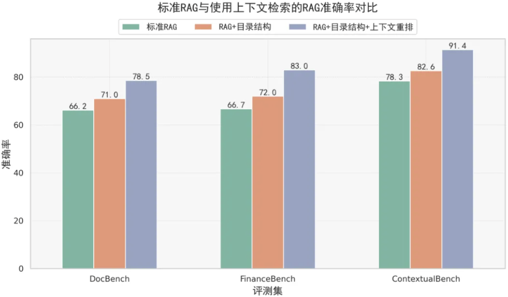

##### **==新方案2：上下文扩展+二次重排（引入两阶段重排机制）==**
```Python
1、第1次重排：使用【上下文重排模型】对初步检索结果进行精确评分

2、上下文扩展：基于重排得分，对高分文本块进行扩展：
将其在文档中相邻但未被召回的前后文本块纳入候选集。得分越高，扩展范围越大

3、二次重排：对扩展后的候选集再次重排，筛选出最终输入大模型的最优内容
```

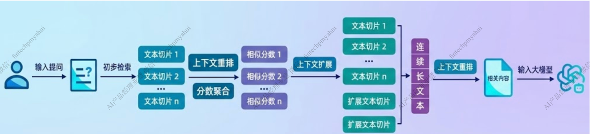

举例：

```Python
假设一共有4个chunk：初步检索仅召回文本块1和2
1、第一次重排后获得较高分数
2、上下文扩展将相邻的文本块3和4一并纳入
3、第二次重排识别全部内容
4、最终文本块1-4输入大模型，生成准确完整的回答
```

**实验评测：在50篇长文档上构建包含855个问题的数据评测集，平均每个问题涉及14.2个相关段落**

1、 **no_rerank**：直接使用初步检索的向量召回结果，不进行任何重排；

2、 **bge_rerank**：采用 BGE-M3 重排模型逐个评估，对每个候选文本块与查询进行独立相关性评估

3、 **extend_rerank**：基于上下文重排模型（如“流程二）：扩展后重排方案

4、 **rerank_extend_rerank**：在上下文重排模型的基础上，按照（“流程3”）：重排–扩展–重排方案

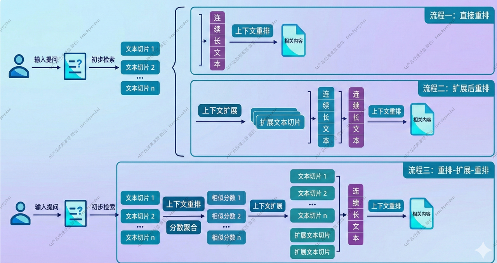

评测结果：

```Python
（1）对于依赖长上下文的问题，“整体评估”形式的重排模型显著优于”逐个评估“的重排模型；
（2）“上下文扩展 + 二次重排”策略能够进一步提升召回完整性，在全部召回长度下均取得最佳性能
```

#### **4、如何利用已有问答数据对构建RAG**
（1）问答数据的特殊性：与普通文档相比，问答数据具备鲜明的结构化特征和高价值信息密度，每一条问答构成了一个完整的语义闭环，天然适用于构建基于RAG（Retrieval-Augmented Generation）的系统

```JSON
（1）问题部分高度贴近用户真实意图，通常直接体现了用户在特定情境下的具体信息需求
（2）答案部分则往往经过提炼归纳，具备较高的准确性与实用性
（3）问答数据中的“问题—答案”一一对应，使其在检索与匹配阶段更具结构优势，能有效提升召回质量与响应相关性。
```

所以，问答数据在RAG系统中不仅是重要的补充，更是构建高效知识交互的重要支撑形式

##### 4.1 问答数据入库策略： **完整性vs.颗粒度**
a） **完整入库策略**： **将每组问答对作为一个整体存储，不进行内容拆分。**这种方式保留了问答语义的完整性，尤其适用于结构清晰、问答对应明确的标准化FAQ场景。

```JSON
{
  "问题": "如何开具电子发票？",
  "答案": "您可以登录账户后，前往【订单中心】-【发票管理】，选择需要开票的订单，点击‘申请电子发票’按钮，按提示填写相关信息即可。"
}
```

b） **细粒度切分策略：**针对 **内容较长或包含多个子问题的QA，可以尝试将其拆解为若干语义片段，以提升在向量检索或召回环节的匹配精度。**这种方式有助于提升检索灵敏度，但需注意保持语义连贯，避免割裂原意。

```JSON
文档1-1
{
  "问题片段": "开具电子发票的入口在哪？",
  "答案片段": "登录账户后，前往【订单中心】-【发票管理】即可找到相关订单。"
}

文档1-2
{
  "问题片段": "如何申请电子发票？",
  "答案片段": "在发票管理中，选择订单后点击‘申请电子发票’，并填写信息提交。"
}
```

（3）实践建议：

> **a）****==对于结构清晰、内容简短的FAQ，建议直接整体入库==**，确保问答逻辑完整、匹配精准；
>

> **b）****==对于内容较长或结构复杂的问答，可适度拆解为多个片段==**，但需谨慎设计切分逻辑，确保语义完整性不受损；
>

> **c）****==在实际应用中建议进行A/B测试，对比不同切分策略对检索召回率、用户满意度等指标的影响，选择最适合业务场景的方式==**。
>

##### **4.2 如何处理一个问题存在多个子问题的情况？**
在实际业务中，一个主问题往往会被用户进一步细化为多个子问题。例如，“如何使用会员积分？”下可能会派生出关于积分用途、兑换流程、有效期等多个子问法。

**推荐做法是将问答数据以层级结构组织，建立主问题与子问题之间的逻辑关联：**

```JSON
主问题提供概览性答案，覆盖用户的总体认知；
子问题拆解具体场景，用于补充细节或延伸说明；
检索时，系统先匹配主问题的语义，如果命中，再按需关联加载相关子问题，提高上下文的完整性与用户满意度。
```

```JSON
{
  "main_question": "会员积分如何使用？",
  "main_answer": "积分可用于兑换礼品、抵扣订单金额、兑换其他权益等。",
  "sub_questions": [
    {
      "question": "积分能直接抵现吗？",
      "answer": "可以，你可以在结算页面直接选择积分抵扣这个选项即可。"
    },
    {
      "question": "我的积分会过期吗？",
      "answer": "普通会员积分有效期为12个月，VIP会员积分无期限，不设置过期。"
    }
  ]
}
```

##### 4.3 问答数据体量庞大但质量不一致，该如何处理？
在构建大规模问答系统时，通常会面临数据来源复杂、内容质量参差不齐的问题。直接平铺所有问答会影响检索效果和响应质量。

**推荐策略是采用数据分层管理机制，将知识库划分为两个层级：**

```JSON
核心问答库（Core QA Set）：存放人工精选的高频、高质量问答，具备覆盖面广、语言标准、业务重要度高等特点；
扩展问答库（Extended QA Set）：包含低频、特定场景、自动生成或尚未完全验证的问题，作为辅助补充。
```

（1）检索策略优化：

```JSON
查询优先命中核心问答库，提高首答命中率与可信度；
核心库未命中时，再联动扩展库召回作为“次级推荐”或兜底补充；
可设定不同置信度分值，用于结果排序或展示逻辑区分。
```

（2）实施建议：

```JSON
核心问答库采用人工评估 + 运营维护；
扩展问答库允许自动更新但需定期清洗或人工抽查；
建立“由扩展转核心”的升级机制，基于点击率、满意度等指标动态评估内容质量。
```

#### 5、（补充）对每个文本块生成相关的问题（构建QA对），从而改进检索
目的：把文档内容按段落或语义分块，让大模型自动为每块生成一个或多个与其相关的问题，实现“内容驱动的问答构建”。

（1）丰富问答对训练集： **离线生成问答对，用于训练 QA 模型**

（2）用于构建向量检索库的 query 表达： **构建向量检索库的 query embedding（因为 embedding 问题比 embedding 文档更准）**

这是ragflow的相关功能，需要手工去对分块配置对应的问题（支持多个问题）

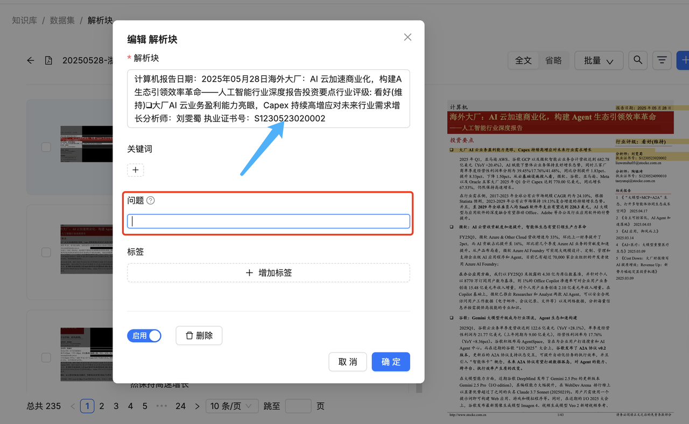

如果需要调用大模型自动生成，步骤如下：

（1）为每块 chunk 编写 prompt，如：

```JSON
请根据以下内容生成1~3个可能的用户问题。要求：
- 问题必须能从内容中推断得出，不可虚构
- 尽量覆盖内容重点
- 不要生成重复或等价的问题
- 用自然语言提问句形式表达

内容：
{{chunk_content}}
```

（2）调用大模型批量生成问题：

a）将每个 chunk 和 prompt 拼接后批量发送给模型；b）控制输出问题个数、格式、长度

（3）后处理与去重清洗：删除重复/相似的问题；清除过长、无意义、与chunk无关的问题；可为每个问题打上来源 chunk_id，便于追踪映射；加入人工审核

（4）入库/embedding：

```JSON
向量检索用：对生成问题进行 embedding，作为检索库的 query entry
用作训练集：将 chunk 和问题组成 QA 对，用于训练分类器、意图识别等下游任务
```

#### 6、（场景补充）教材习题册中的练习题——答案对抽取场景
1、背景： **教材、练习册、考试资料中**含有大量人工编写的结构化QA内容，但是没有充分挖掘出来

（1）有两种类型的QA对： **交错式QA对：**问题和答案交替出现； **远距离QA对：**问题和答案出现在不同章节或文档中，抽取出来的理想结果为右下：

| 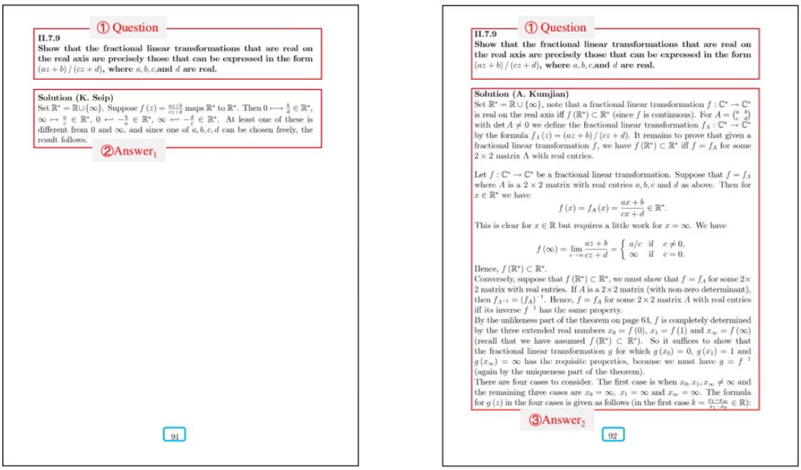 | 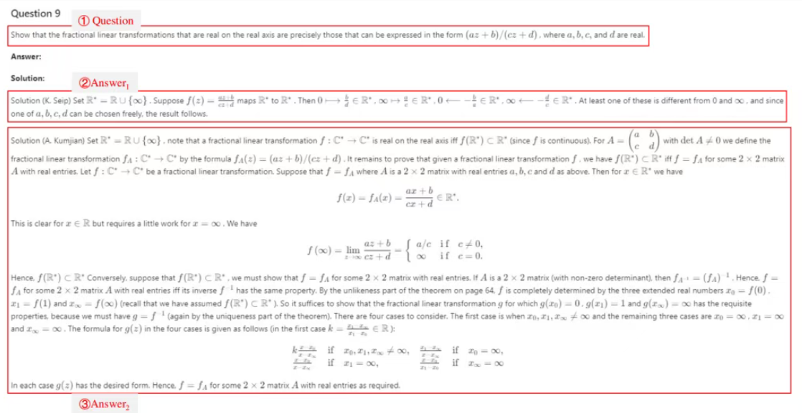 |
| --- | --- |

（2）中文习题集场景：题目在一个稠密的多栏布局中，其间穿插着无关的文本元素。而对应的答案在另一个独立的PDF文件中，抽取出来的理想结果为右下：

| 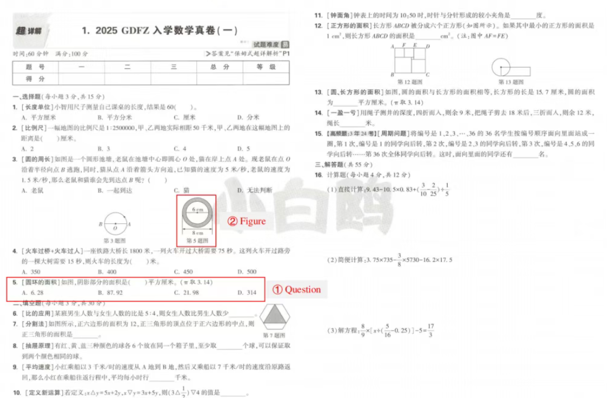 |  | 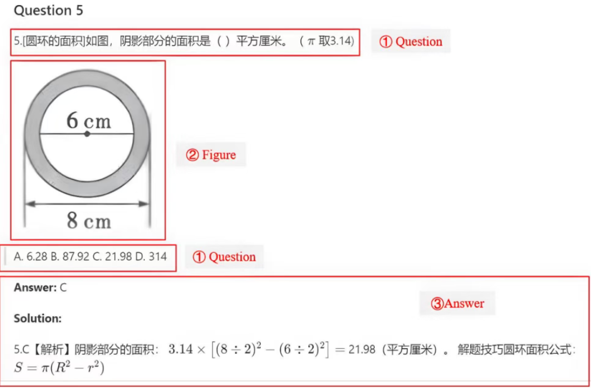 |
| --- | --- | --- |

2、技术方案实现思路：

论文： https://arxiv.org/pdf/2511.16216

所有代码和数据处理流程均已开源： [https://github.com/OpenDCAI/DataFlow](https://github.com/OpenDCAI/DataFlow)

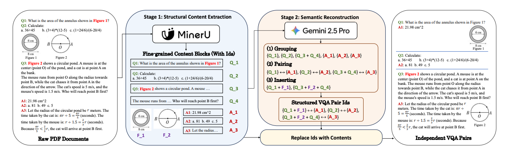

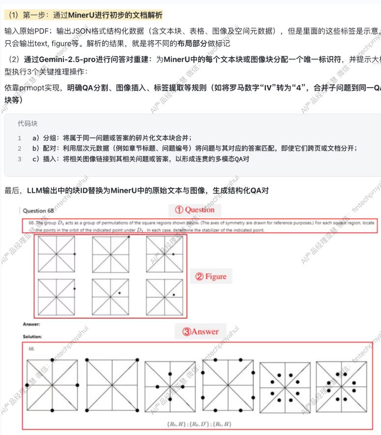

### 4.2.3 索引
索引是检索增强 LLM 的核心基础组件之一： **将向量化后的资料内容(chunk)按照一定规则排列好，目的是能让用户能快速查找到想要的东西**

几种常见的索引结构。

（1） **摘要索引**： **只是将节点存储为顺序链**。在后续的检索和生成阶段，可以简单地顺序遍历所有节点，也可以基于关键词进行过滤

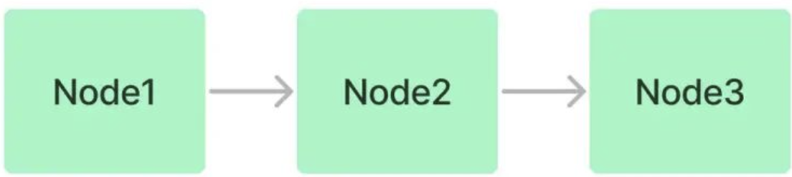

（2） **树索引**： **将一组节点 ( 文本块 ) 构建成具有层级的树状索引结构**，在检索阶段既可以从根节点向下进行遍历，也可以直接利用根节点的信息。树索引无需按顺序查询。

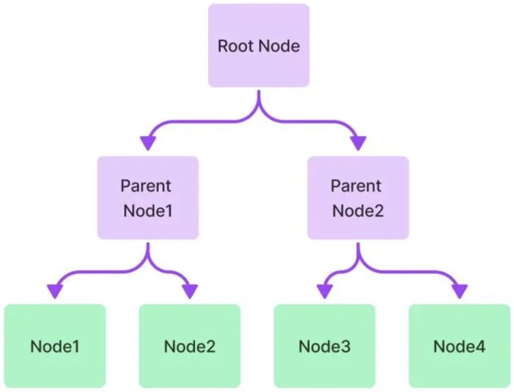

（3） **关键词表索引**： **从每个节点中提取关键词，构建了每个关键词到相应节点的多对多映射**，意味着每个关键词可能指向多个节点，每个节点也可能包含多个关键词。将文档的关键字存储在表格中，适用于查找包含特定关键字的文档。然而，它在处理多关键字查询时的效率较低。

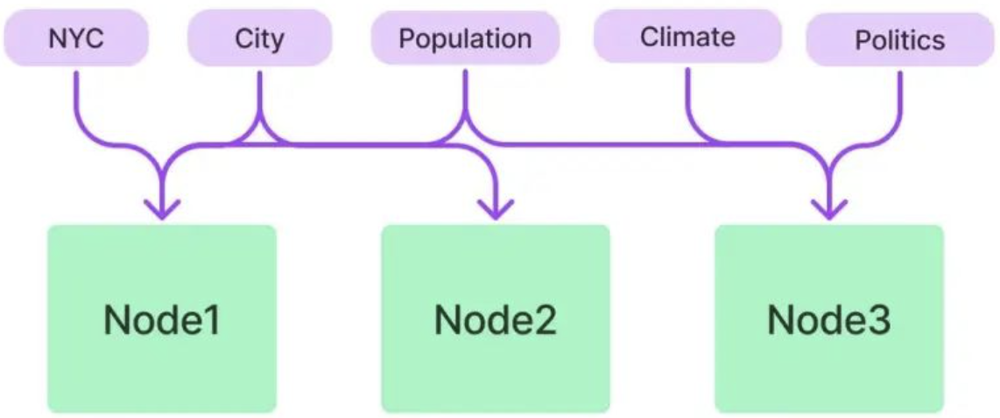

（4） **向量索引：**当前最流行。 **利用文本嵌入模型将文本块映射成一个固定长度的向量，然后存储在向量数据库中。**检索时，对用户查询文本采用同样的Embedding模型映射成向量，然后 **基于向量相似度计算获取最相似的一个或者多个节点**。

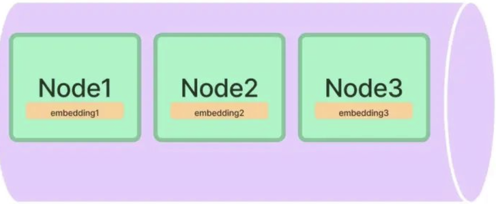

（5） **知识图谱索引：**知识图谱表达的是一种关系，比如通过下图你可以看到多个实体间的关系

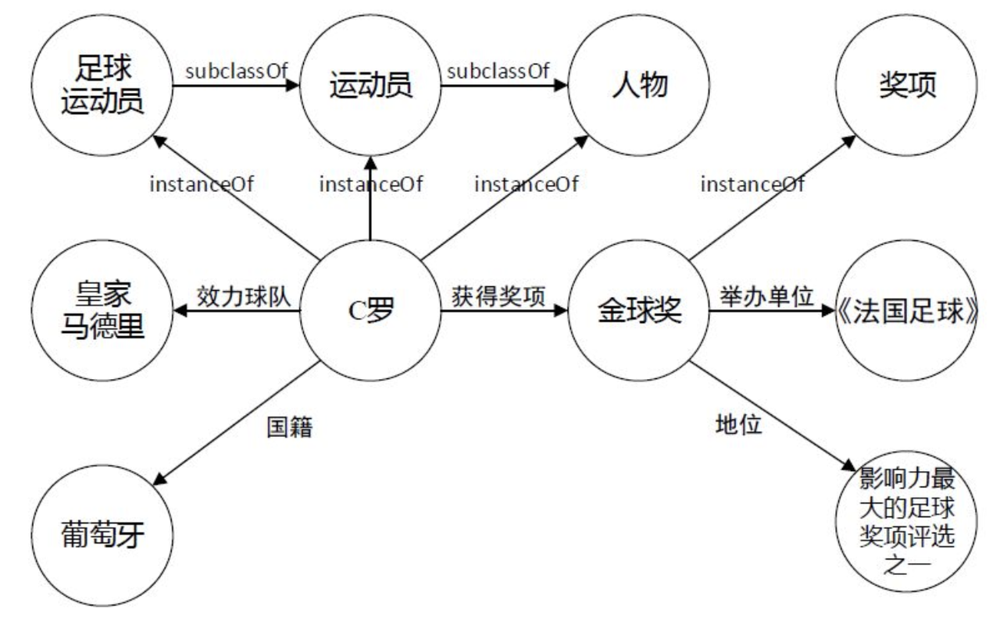

（6）多层表示索引：

由于文档被分割成块，在检索时返回相关的一部分块。然而，块大小和块数量是很难设置好的参数。 **如果返回的块不包含回答问题的所有上下文，则两者都会显著地影响结果。**

技术方案：多向量索引，对从原始文本以外的内容派生的向量执行语义搜索。有多种方法可以为每个文档创建多个向量:

**multi-vector retriever：将摘要向量化**，但将完整文档返给LLM

**parent-doc retriever：将块向量化，但将更大的父块返给LLM**.

核心思想是使用较小/简洁的表示(摘要或块)进行检索，但将它们链接到完整的文档/上下文中进行生成

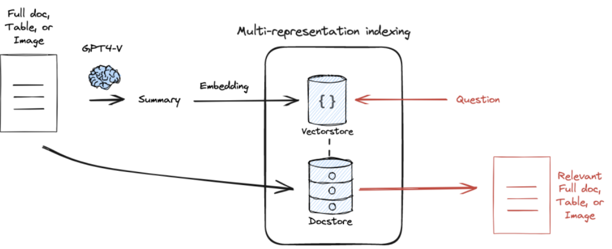

（7） **文档摘要树索引（高级）RAPTOR：**

文本切块索引存在的主要限制：只能检索短小、连续的文本段落。限制了它们表示跨文档话语结构和利用分散在长篇语料库中的主题信息的能力。因此，在需要多步骤推理或从多个部分综合知识的复杂问题上，性能会受到影响。

技术方案：RAPTOR是一种新型的递归抽象范式，通过层次化的多文档表示克服了上述问题。RAPTOR分割文本，然后递归地聚类、总结和嵌入段落。这将语料库结构化为编码不同抽象层次信息的多层树。

树构建过程： **RAPTOR基于文本块的向量嵌入递归地聚类这些文本块，并生成这些聚类的文本摘要，自下而上构建**树。 **聚在一起的节点是兄弟关系；父节点包含了该聚类的文本摘要**。

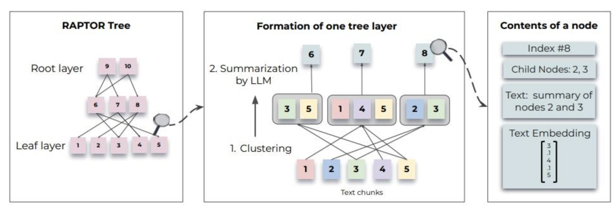

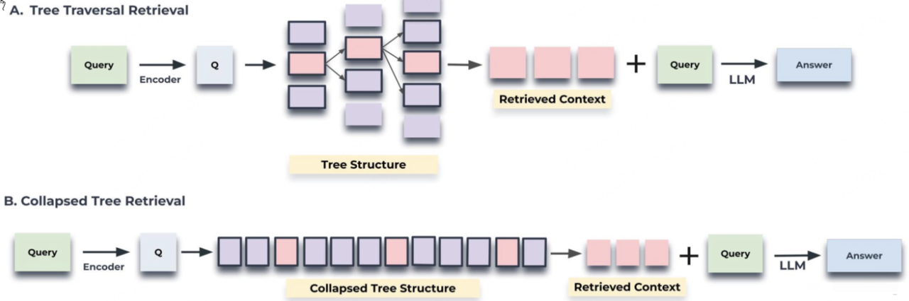

##### 1、【特定情况】标准问答数据索引构建策略：以问题为中心
如果是标准问答数据，相较于传统文档型知识， **问答数据具备结构清晰、语义明确、强监督对齐**等特点，每条数据通常由一个问题和对应答案组成，天然适合作为RAG系统中的结构化知识单元。因此， **==在构建问答型RAG系统的索引时，应优先采用“以问题为中心”的索引策略，确保检索阶段能够精准匹配用户提问。==**

（1） **问题向量化****：以“问题”作为主索引字段：**将问题部分作为主要索引内容进行向量化

```JSON
核心思路是：仅将每组问答中的“问题”进行向量化，作为主检索入口，答案作为附属信息存储在元数据中。

# 伪代码：仅对问题做embedding
for qa_pair in qa_dataset:
    question_embedding = embedding_model.encode(qa_pair["question"])
    doc_id = vector_db.add_document(
        embedding=question_embedding,
        metadata={            "question": qa_pair["question"],            "answer": qa_pair["answer"]        }
    )
```

（2） **双重索引****：为“问题”和“答案”同时构建索引，****==但偏向问题检索，在检索时主要依靠问题相似度==**

```JSON
为增强召回覆盖率，可以同时构建问题和答案的向量索引，但在查询时仍以问题字段的语义相似度为主要检索目标。

# 伪代码：检索时指定按问题字段搜索
question_embedding = embedding_model.encode(user_query)
similar_docs = vector_db.search(    embedding=question_embedding,    search_field="question",  # 指定在问题字段搜索top_k=10
)
```

优点：增强答案语义可见性，可支持跨问法检索与反向查找。

（3） **混合检索**：融合语义检索与关键词匹配（结合向量检索和关键词检索），提高召回质量

```JSON
# 伪代码：混合检索并合并结果vector_results = vector_db.vector_search(user_query, top_k=5)keyword_results = vector_db.keyword_search(user_query, top_k=5)final_results = merge_results(vector_results, keyword_results)
```

| 策略 | 检索主目标 | 优点 | 适用场景 |
| --- | --- | --- | --- |
| 问题向量化 | 用户问题 | 精准匹配、逻辑清晰 | 标准FAQ、结构化问答系统 |
| 双重索引 | 问题优先 | 提升召回范围、支持变体检索 | 多问法支持、答案倒查需求 |
| 混合检索 | 向量 + 关键词 | 提升召回率、增强容错能力 | 表述复杂、语义不稳定的问题集 |

##### 2、与普通文档RAG不同， **问答数据的RAG系统的检索生成策略**
相较于普通文档型RAG， **问答数据驱动的RAG系统**在检索与生成阶段需进行针对性的设计与优化，以最大程度发挥问答数据结构化、高质量的优势。

策略自（1）-》（3）

**（1）相似问题检索**：以问题为核心进行语义匹配

用户查询通过语义向量化 ==，与问答库中已有的“问题”进行匹配==，而非全文比对。 **目标是快速定位表达最接近用户意图的历史问题，并携带其答案作为参考依据。**==强调：“以问找问”，提升匹配准确性。==

**（2）上下文构建优化**：结构化拼接问答对，供LLM调用

==将检索得到的若干问答对，按语义相关性排序、格式标准化处理后拼接为Prompt上下文==。需避免冗余、冲突内容，并确保结构清晰、LLM易于理解。

```JSON
示例结构：
Q1: XXX
A1: YYY
Q2: XXX
A2: YYY
```

（3） **自适应生成策略**：根据检索结果的质量决定LLM的生成自由度： ==根据检索结果的质量（如匹配度评分、内容置信度），对生成策略进行调整==（目标：在“生成准确性”与“内容丰富性”之间灵活权衡)

```JSON
如果高匹配 → 控制LLM偏重复述/压缩现有答案
如果低匹配 → 放宽限制，引导LLM推理/创作新答案
如无有效召回 → 启用兜底通用生成模式或返回“无匹配”
```

```Python
# 伪代码示例
def generate_answer(user_query):
    # 检索相似问题
    similar_qas = retrieve_similar_questions(user_query)

    # 根据相似度评分决定策略
    if max_similarity_score > 0.85:
        # 高相似度：直接使用现有答案
        return format_existing_answer(similar_qas[0])
    elif max_similarity_score > 0.6:
        # 中等相似度：基于现有答案生成
        context = format_context(similar_qas)
        return llm.generate(prompt=f"基于以下内容回答问题：{context}\n问题：{user_query}")
    else:
        # 低相似度：LLM发挥更多创造性
        context = format_context(similar_qas)
        return llm.generate(prompt=f"参考以下可能相关的内容，创造性地回答问题：{context}\n问题：{user_query}")
```

##### **3、用户反馈闭环：构建持续优化的知识体系**
通过设计 **有效反馈机制**，将用户行为数据反哺至知识库迭代中：

```JSON
记录采纳行为：如点击、复制、点赞等操作可视为正向反馈；
收集用户评价：引导用户对回答进行“有用/无用”打分或评论；
分析回答失败场景：识别低满意度或用户跳出的问题，作为重点补强对象；
基于真实查询构建新QA：从高频搜索中挖掘潜在新增问答内容。
```

建议搭建 **==“查询日志 + 用户评价 + 内容更新”==**三联动机制，实现知识库的动态演化。

##### 4、父子索引（Parent-Child Indexing）
一种结合细粒度检索与上下文保留的RAG优化技术。其核心思想是将文档拆分为子块（Child Chunk）和父块（Parent Chunk）两级结构：

```SQL
子块：细粒度文本单元（如句子/段落），用于高精度语义匹配。
父块：包含子块的更大文本单元（如章节/整网页），提供完整上下文。
```

| 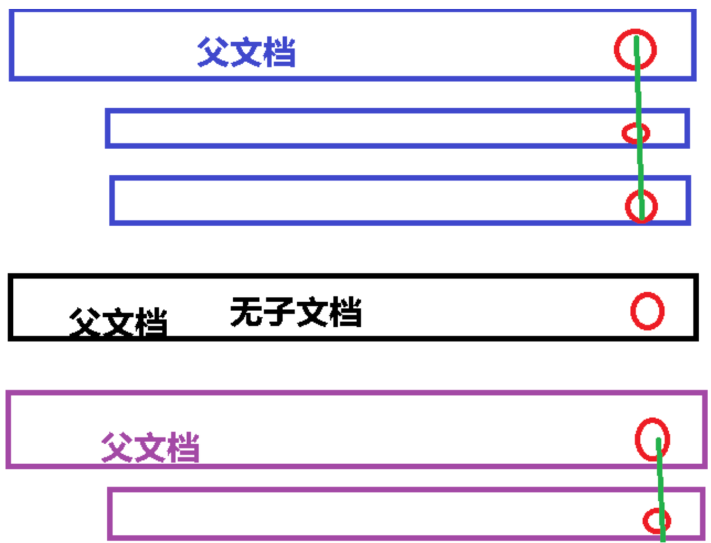 | 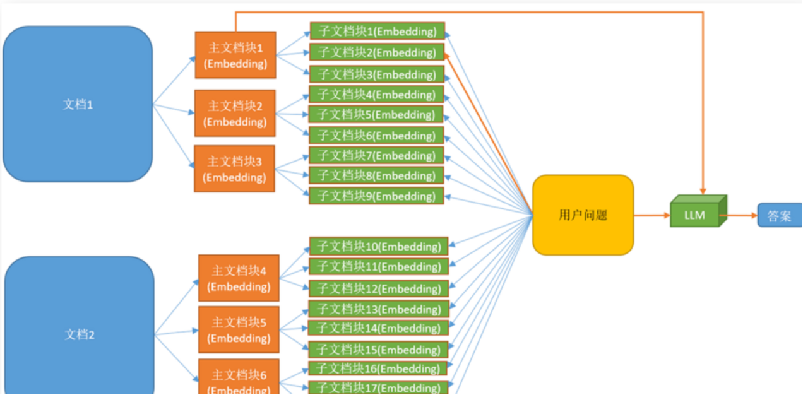 |
| --- | --- |

1、适用场景：

```SQL
1. 文档结构复杂，需要上下文保真典型案例：法规、合同、专利、学术论文。
问题：用户问“第 5 条中的罚则金额是多少？”
如果只检索 300-token 的小 chunk，可能只拿到一行“罚款金额：50000 元”，但上下文（适用条件、条款号）丢失，模型回答时容易误判。父片段可以快速回溯整个条款，避免回答缺背景。

2. 表格、长列表、跨页元素典型案例：财报、合同附表、账单。
子片段用于捕捉表格局部（每几行或几列），
父片段能提供完整的表格或表格标题（如“2024 年 Q4 财报”），否则 LLM 会只看到数字，无法知道其含义。

3. 提高召回速度，降低 Embedding 成本
向量数据库的 embedding 和索引开销大，如果所有 5000-token 段落都直接做 embedding，既贵又慢。
通过子片段（小 chunk）检索，减少 embedding 数量和向量维度计算；
但最终答案又能回溯到父片段，确保完整上下文。

4. 避免 LLM “幻觉” 或回答过于碎片化典型案例：用户问“请总结这份合同中的违约条款”，
子片段检索可能只拿到各条款碎片；父片段能补全上下文，让模型理解整体逻辑，而不是拼凑孤立句子。

5. 需要支持后处理或答案可追溯
输出答案时，系统可能要给出“出处链接”或“高亮源内容”。子片段 ID 用于检索，父片段提供完整原文（用于展示或审计）。
```

2、工作机制：

```SQL
1、子片段 ：
按固定长度（比如 300~500 tokens）切分，用于 向量化 和 语义检索。
存储在向量数据库（如 Milvus、Pinecone、FAISS）中。

2、父片段 ：
对应子片段所在的更大段落、章节、表格或文档块。
存储在 KV 存储或传统数据库（Redis、Elasticsearch、Postgres 等）。
用于在检索命中子片段后，快速回溯出完整上下文。
```

这样能在召回时：（1）通过子片段向量检索找到相关内容；（2）根据子片段的父级 ID，从 KV 或原始存储拉取 更大上下文（比如完整表格或段落）；（3）拼接后再交给大模型回答问题，保证上下文完整度。

3、Python代码实现：

```Python
# ======================= 依赖安装 =======================
# pip install langchain-community langchain-text-splitters chromadb

# ======================= 1. 数据加载 =======================
from langchain_community.document_loaders import TextLoader
loader = TextLoader(path, encoding='utf-8')
docs = loader.load()

# ======================= 2. 分块器初始化 ==================
from langchain_text_splitters import RecursiveCharacterTextSplitter
parent_splitter = RecursiveCharacterTextSplitter(chunk_size=1024)  # 父块
child_splitter  = RecursiveCharacterTextSplitter(chunk_size=256)   # 子块

# ======================= 3. 向量库 & 内存存储 ===============
from langchain_community.vectorstores import Chroma
from langchain_core.stores import InMemoryStore
vectorstore = Chroma(
    collection_name="split_parents",
    embedding_function=embeddings_model
)
store = InMemoryStore()   # 用于保存父块

# ======================= 4. 检索器 =========================
from langchain.retrievers import ParentDocumentRetriever
retriever = ParentDocumentRetriever(
    vectorstore=vectorstore,
    docstore=store,
    child_splitter=child_splitter,
    parent_splitter=parent_splitter,
    search_kwargs={"k": 1}
)

# 把文档加入检索器
retriever.add_documents(docs)

# ======================= 5. 检索示例 =======================
print("------------ 搜索子块 ------------------------")
sub_docs = vectorstore.similarity_search("介绍下DeepSeek和市场占用情况")
print(sub_docs[0].page_content)

print("------------ 返回关联父块 --------------------")
parent_docs = retriever.get_relevant_documents("介绍下DeepSeek和市场占用情况")
print(parent_docs[0].page_content)
```

4、实施建议：

```SQL
1、动态分块策略优化
根据具体业务领域（法规、财报、技术文档等）的内容结构，动态调整 chunk_size 和 overlap_ratio。
对长句、复杂段落或跨页表格，可适当增加重叠比例，确保语义完整性；对短小独立的段落则降低重叠，减少冗余。

2、多检索融合
在子片段向量检索的基础上，结合 父级索引与关键词检索，提升召回的覆盖率与准确性。
当用户查询涉及显式关键词（如条款号、字段名）时，关键词检索可快速锁定对应父块，减少误召回。

3、高频父块缓存机制对访问频率高、上下文稳定的父片段（如法规章节、固定模板），建立 内存缓存，降低反复回溯的存储和网络开销。

4、效果监控与动态调整
建立监控指标体系，包括：
上下文缺失率：检索结果未能覆盖完整上下文的比例；
冗余信息率：检索内容中无关信息的比例。
根据指标动态调整分块策略、召回排序权重和缓存策略，持续优化用户体验与系统性能。
```

分块策略优化：根据领域特点调整chunk_size与overlap_ratio。

混合检索结合：父子索引+关键词检索提升召回率。

缓存机制：对高频父块建立内存缓存。

监控指标：跟踪上下文缺失率和冗余信息率。

通过父子索引技术，企业可在保证检索精度的同时，显著降低LLM的上下文处理成本 **（实测显示可减少30-50%的token消耗）**

### 4.2.4 ReRank 重排序
举例： ==某app用户输入「性价比高的降噪耳机」，系统召回了200个包含「耳机」的商品，但真正符合「降噪+高性价比」的只有5个。==传统方法要么漏掉关键信息，要么被关键词绑架，而Reranker(重排序器)就是解决这个痛点的利器，用于评估搜索结果，并进行重新排序，提升查询结果相关性


1、 **Rerank 是基于深度学习的二次排序模型，它不做初筛召回，而是对粗排结果进行语义级精细打分**：就是把 RAG 中的检索环节结果中的 TopN（N通常较大比如50，100)）进行重新排序。如果说传统搜索引擎像用渔网捞鱼(召回阶段)，Reranker就是拿着显微镜挑鱼(精准排序)

在 RAG 流程的最后环节，需要把参考资料作为上下文发给大模型生成回答。如果把 Top20 的资料都发给大模型综合总结，显然会导致两个问题：

Token 消耗量大。

过多内容会让大模型也会失忆。

所以需要尽可能把最准确，最精炼的信息发给大模型，那么 **==追求 TOP3/TOP5 的精准度==****就是让 RAG 成功的关键步骤。Rerank 之后，意味着精准地找到了 top3 的相关资料，下一步就是将相关资料和用户最初的提问送给大模型生成最终回答。**

与 传统BM25等关键词匹配不同，Reranker的核心优势在于：

（1） **理解上下文语义**(知道「苹果」在数码场景指手机而非水果)

（2）捕捉隐含需求(搜索“出差用行李箱”时，轻便>颜值>容量)

（3）处理长尾query（小众、模糊的表达也能命中目标）

Reranker通常在向量查询(ANN)后使用，能够更有效地确定文档和查询之间的语义相关性，对结果进行精细重排最终提高搜索质量

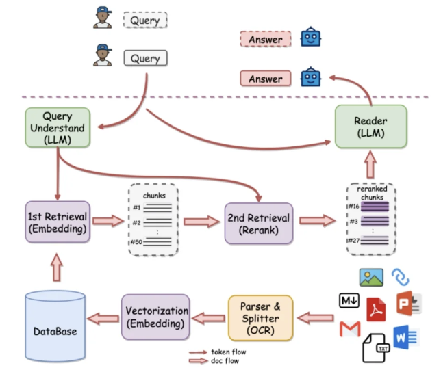

为什么光有embedding还不够，因为embedding有局限性（embedding看4.2.5）：

```JSON
（1）语义理解有限：嵌入embedding可以捕获语义信息，但通常缺乏对比信息。
例如，嵌入可能难以区分“我喜欢苹果”和“我曾经喜欢苹果”，因为两者都传达了类似的语义含义。

（2）维度约束：嵌入表示相对低维空间中的文档或句子，通常具有固定的维数(例如1024)。这种有限的空间使得准确编码所有相关信息变得具有挑战性，尤其是对于较长的文档或查询。
```

2、经过检索过程可能会得到很多相关文档，就需要进行筛选和排序。常用的筛选和排序策略包括：

基于 **相似度分数**进行过滤和排序

基于 **关键词进行过滤**，比如限定包含或者不包含某些关键词

让 **LLM 基于返回的相关文档及其相关性得分来重新排序**

基于 **时间**进行过滤和排序，比如只筛选最新的相关文档

基于 **时间对相似度进行加权**，然后进行排序和筛选

**3、Rerank的评估指标:**

==最重要的2个指标：==**==HitRate和 MRR==**，定义如下：

HitRate：结果命中率，是期望结果在 TopN 中出现的概率。

MRR：平均倒数排名（Mean Reciprocal Rank），衡量期待结果在实际结果中的排序是否靠前。比如一次查询中，你期待的结果排在实际结果中的第一位，则 MRR 为：1 的倒数，如果排在第二位，则 MRR 为 2 的倒数 1/2。把所有查询中的倒数排名平均一下就是 MRR。

显然，如果要精准地找到 Top3 甚至是 Top1， MRR 对 Rerank 效果的评估更有意义。

**4、增加Rerank的RAG架构**

图中增加了Reranker环节，这个检索系统包含两个阶段：

（1）在向量数据库中检索出 Top-K 相关文档；同时也可以配合 Sparse embedding(稀疏向量模型)覆盖全文检索能力

（2）Reranker 根据检索出来的文档与查询的相关性进行打分和重排。重排后挑选最靠前的结果作为 Prompt 中的 Context 传入 LLM，最终生成质量更高、相关性更强的答案

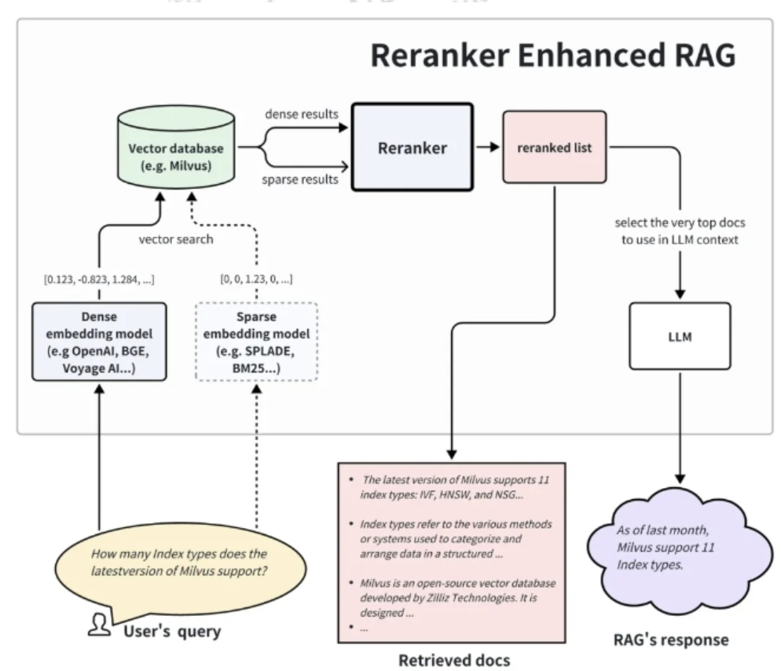

```JSON
举例：
第一阶段索中，向量搜索引擎可以在数百万向量中快速筛选出语义近似度最高的 20个文档，但这些文档的相对顺序还可以使用 Reranker 进一步优化。虽然会产生一定的成本，但Reranker 可以在 top-20 个结果进一步挑出最好的 top-5 个结果。那么，相对更加昂贵的 LLM 只需要分析这 top-5 个结果即可，免去了处理 20个文档带来的更高成本和注意力“涣散”的问题。这样就可以通过这种复合方案平衡延迟
```

（1）交叉编码器：

```JSON
将一对数据(例如两个句子)作为输入，并产生0到1之间的输出值，表示两个句子之间的相似性。
与向量嵌入不同的方法不同，可以更细致地理解数据点之间的关系。
需要注意的是，交叉编码器需要一对"项目"作为输入，这使得它们不适合独立处理单个句子
```

（2）多向量重排器：https://huggingface.co/jinaai/jina-colbert-v1-en

```JSON
CO|BERT这样的多向量嵌入模型具有后期交互功能、其中查询和文档表示之间的交互发生在流程的后期，在两者都经过独立编码之后。这种方法与交叉编码器等早期交互模型形成对比，在交叉编码器中，查询和文档嵌入在早期阶段
进行交互，可能会导致计算复杂度增加。
后期交互设计允许预先计算文档表示，有助于加快检索时间并减少计算需求，使其适合处理大型文档集合
```

（3）LLM重排（https://arxiv.org/pdf/2308.07107）

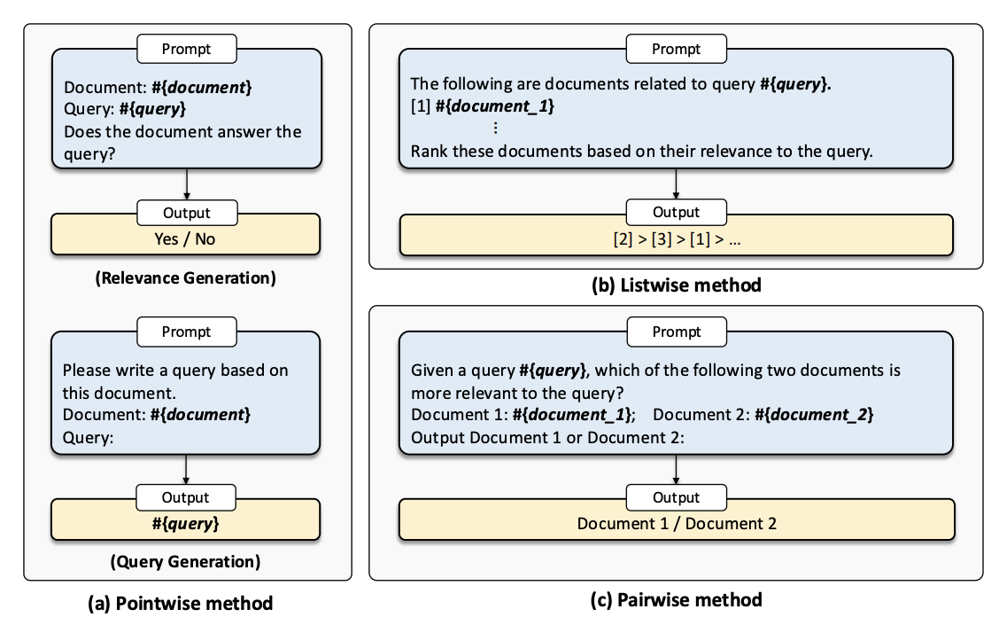

```JSON
通过提示LLMs自主改进文档重新排序来解决这个问题。
提示策略分为3类：点对点(pointwise)、列表对列表(listwise)和成对(pairwise)方法。
3种无监督重新排序方法:(a) 逐点方法，包括相关性生成(上部)和查询生成(下部)，(b)列表方法，以及(C)对比方法。
```

（4）监督微调LLM重排：

```JSON
在将LLM应用于重新排序任务时，监督微调是关键步骤。由于预训练期间缺乏排名意识，LLM无法准确衡量查询与文档的相关性。在特定任务的数据集(例如MS MARCO段落排名数据集)上进行微调，LLM可以调整参数以提高重新排序性能。
监督重排器可以根据主干模型结构分为两类:编码器-解码器，主要将文档排序作为生成任务，优化基于编码器-解码器的重排序模型。例如，RankT5模型经过微调，可以为相关或不相关的查询-文档对生成分类标记。仅解码器，尝试通过微调仅解码器模型(例如LLaMA)对文档进行重新排序。不同的方法(包括RankZephyr和RankGPT)提出了各种相关性计算方法。
```

（5） ==私有重排API（AI产品经理重点关注）==

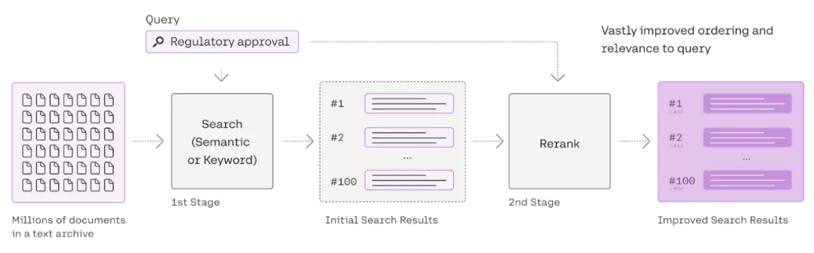

https://cohere.com/blog/rerank

```JSON
为增强RAG检索语义相关性提供了一种便捷的解决方案，而无需进行基础设施投资。推荐两个值得注意的私有重新排序 API:Cohere、Jina 。
（1）Cohere重新排序API提供针对英语和多语言文档量身足制的重新排序模型，每个模型都针对特定的语言处理任务讲行了优化。Cohere会自动将冗长的文档分解为可管理的块，以便高效处理。该API提供0到1之间的标准化相关性分数有助于结果解释和闯值确定。
（2）Jina重新排序API，以ina-colbert-v1-en为例，专门用于通过语义理解来增强检索结果，并支持更长的上下文长度
```

https://jina.ai/news/what-is-colbert-and-late-interaction-and-why-they-matter-in-search/

**6、优点：**

（1）显著提高生成答案的精确度，因为Reranker 能够在单路或多路的召回结果中挑选出和问题最接近的文档。

（2）扩大检索结果的丰富度(例如多路召回)配合精细化筛选最相关结果(Reranker)能进一步提升最终结果质量。

（3）使用 Reranker 可以排除掉第一层召回中和问题关系不大的内容，将输入给大模型的上下文范围进-步缩小到最相关的一小部分文档中。

（4）通过缩短上下文， LLM 能够更“关注”上下文中的所有内容，避免忽略重点内容还能节省推理成本。

**7、问题：**

（1）使用 Reranker 会增加延迟，需要判断对于业务的影响，不适合高频高并发的应用

（2）增加计算量对服务成本的增加：建议根据自己的业务需求，在检索质量、搜索延迟、使用成本之间进行权衡，合理评估是否需要使用 Reranker，前可选择的重排工具并不多

**8、哪种情况适合在 RAG 应用中使用 Reranker?**

追求回答高精度和高相关性的场景中特别适合，例如 专业知识库或者客服系统 等应用。因为这些应用中的查询都具有很高的商业价值，提升回答准确性的优先级远高于系统性能和控制成本。使用 Reranker 能够生成更准确的答案，有效提升用户体验。

（1）搜索增强：电商/内容平台提升长尾query转化率

（2）推荐系统：结合用户实时行为动态调整排序

（3）问答系统：从海量候选答案中匹配最精准结果

（4）多模态检索：图文/视频的跨模态语义对齐

**9、实践建议（7条）：**

==（1）何时不需要Reranker？==

==a）结果集小于50条时，直接规则排序更经济==

==b）排序维度单一(如纯价格排序)的场景==

==（2）关键指标监控：首条点击率(CTR@1)；前3条点击转化率(CVR@3)；90分位响应时间(影响用户体验阈值)==

==（3）冷启动方案：初期可用开箱即用的预训练模型，积累2000+用户真实query后，用业务数据微调最后一层==

==（4）目前rerank模型中，较好的应该是cohere（收费https://cohere.com/blog/rerank）。开源的是智源发布的bge-reranker-base、bgereranker-large、bce-reranker。bge-reranker-large的能力基本上接近cohere，而且在一些方面还更好==

==（5）几乎所有的Embeddings都在重排之后显示出更高的命中率和MRR，提升5%-15%，所以rerank的效果是非常显著的==

==（6）embedding模型和rerank模型的组合也会有影响，需要在实际过程中去调测最佳组合==

==（7）Refnement（过滤）： 由于即使通过重排序后的文档，有的与query的相关度也不是很高，可以通过设置一个阈值将相关度低于阈值的相关文档进行过滤。==

**10、如何设计rerank流水线？（以电商搜索场景为例）**

（1）召回阶段(效率优先)

使用ElasticSearch快速召回500个相关商品(基于标题/类目关键词)

（2）粗排阶段(基础过滤)用规则引擎排除无货/低评分商品，保留Top200

（3）Rerank阶段（示例代码）

使用 Hugging Face 的 sentence-transformers 库实现重排序。有以下几个主要特点：

使用 Cross-Encoder 模型

默认使用 cross-encoder/ms-marco-MiniLM-L-6-v2 模型

这是一个专门用于重排序任务的预训练模型

在 MS MARCO 数据集上进行了微调，适合文本相关性排序

2、模型选择建议

cross-encoder/ms-marco-MiniLM-L-6-v2：速度快，适合实时场景

cross-encoder/ms-marco-MiniLM-L-12-v2：精度更高，但速度较慢

3、主要改进

不再需要手动训练模型

直接使用预训练模型进行重排序

考虑了查询和商品描述的语义匹配

代码更简洁，更易维护

```Python
import numpy as np
from typing import List, Dict
from dataclasses import dataclass
from sentence_transformers import CrossEncoder
import logging

logging.basicConfig(level=logging.INFO)
logger = logging.getLogger(__name__)

@dataclass
class Product:
    """商品数据类

    Attributes:
        id: 商品ID
        title: 商品标题
        category: 商品类目
        price: 商品价格
        sales: 商品销量
        rating: 商品评分
        stock: 库存数量
        click_rate: 点击率
        conversion_rate: 转化率
    """
    id: str
    title: str
    category: str
    price: float
    sales: int
    rating: float
    stock: int
    click_rate: float
    conversion_rate: float

class CrossEncoderReranker:
    """基于Cross-Encoder的重排序器

    使用sentence-transformers的cross-encoder模型进行重排序
    """

    def __init__(self, model_name: str = "cross-encoder/ms-marco-MiniLM-L-6-v2"):
        """初始化重排序器

        Args:
            model_name: 预训练模型名称，可选值：
                - cross-encoder/ms-marco-MiniLM-L-6-v2 (推荐，速度快)
                - cross-encoder/ms-marco-MiniLM-L-12-v2 (精度更高，但速度较慢)
        """
        self.model = CrossEncoder(model_name)
        logger.info(f"加载模型: {model_name}")

    def _prepare_text_pairs(self, query: str, products: List[Product]) -> List[List[str]]:
        """准备文本对

        Args:
            query: 搜索查询
            products: 商品列表

        Returns:
            List[List[str]]: 文本对列表
        """
        text_pairs = []
        for product in products:
            # 构建商品描述文本
            product_text = f"商品标题: {product.title}, 类目: {product.category}, "
            product_text += f"价格: {product.price}元, 销量: {product.sales}, "
            product_text += f"评分: {product.rating}, 库存: {product.stock}"

            text_pairs.append([query, product_text])
        return text_pairs

    def rerank(self, query: str, products: List[Product]) -> List[Product]:
        """对商品进行重排序

        Args:
            query: 搜索查询
            products: 待排序的商品列表

        Returns:
            List[Product]: 排序后的商品列表
        """
        # 准备文本对
        text_pairs = self._prepare_text_pairs(query, products)

        # 计算相关性得分
        scores = self.model.predict(text_pairs)

        # 将得分与商品关联
        product_scores = list(zip(products, scores))

        # 根据得分排序
        sorted_products = sorted(
            product_scores,
            key=lambda x: x[1],
            reverse=True
        )

        # 返回排序后的商品列表
        return [product for product, _ in sorted_products]

class RerankPipeline:
    """商品重排序流水线"""

    def __init__(self, model_name: str = "cross-encoder/ms-marco-MiniLM-L-6-v2"):
        """初始化重排序流水线

        Args:7
            model_name: 预训练模型名称
        """
        self.reranker = CrossEncoderReranker(model_name)

    def rerank(self, query: str, products: List[Product]) -> List[Product]:
        """对商品进行重排序

        Args:
            query: 搜索查询
            products: 待排序的商品列表

        Returns:
            List[Product]: 排序后的商品列表
        """
        return self.reranker.rerank(query, products)

# 使用示例
if __name__ == "__main__":
    # 创建示例商品数据
    products = [
        Product(
            id="1",
            title="苹果iPhone 13 Pro Max 256GB",
            category="手机",
            price=8999.0,
            sales=5000,
            rating=4.9,
            stock=1000,
            click_rate=0.18,
            conversion_rate=0.08
        ),
        Product(
            id="2",
            title="华为Mate 40 Pro 256GB",
            category="手机",
            price=6999.0,
            sales=3000,
            rating=4.8,
            stock=800,
            click_rate=0.15,
            conversion_rate=0.07
        ),
        Product(
            id="3",
            title="小米12 Pro 256GB",
            category="手机",
            price=4999.0,
            sales=2000,
            rating=4.7,
            stock=600,
            click_rate=0.12,
            conversion_rate=0.06
        )
    ]

    # 创建重排序流水线
    pipeline = RerankPipeline()

    # 示例搜索查询
    query = "高端智能手机 256GB"

    # 执行重排序
    reranked_products = pipeline.rerank(query, products)

    # 打印排序结果
    print(f"搜索查询: {query}")
    print("重排序结果:")
    for product in reranked_products:
        print(f"商品ID: {product.id}, 标题: {product.title}, 价格: {product.price}元")
```

（4）业务规则注入：在模型得分基础上，叠加“库存周转率”、“促销权重”等业务因子，实现用户体验与商业目标的平衡

添加了业务规则注入功能。主要改动包括：

1、新增业务规则注入器（BusinessRuleInjector）

库存周转率得分：基于销量/库存比计算

促销权重得分：直接使用商品的促销权重

商品新鲜度得分：基于最近销售日期计算

2、业务规则权重设置

库存周转率权重：0.3

促销权重：0.4

商品新鲜度权重：0.3

3、得分合并机制

模型得分权重：0.7

业务规则得分权重：0.3

```Python
import numpy as np
from typing import List, Dict
from dataclasses import dataclass
from sentence_transformers import CrossEncoder
import logging
from datetime import datetime, timedelta

logging.basicConfig(level=logging.INFO)
logger = logging.getLogger(__name__)

@dataclass
class Product:
    """商品数据类

    Attributes:
        id: 商品ID
        title: 商品标题
        category: 商品类目
        price: 商品价格
        sales: 商品销量
        rating: 商品评分
        stock: 库存数量
        click_rate: 点击率
        conversion_rate: 转化率
        promotion_weight: float = 1.0  # 促销权重
        last_sales_date: datetime = None  # 最近销售日期
    """
    id: str
    title: str
    category: str
    price: float
    sales: int
    rating: float
    stock: int
    click_rate: float
    conversion_rate: float
    promotion_weight: float = 1.0
    last_sales_date: datetime = None

class BusinessRuleInjector:
    """业务规则注入器

    在模型得分基础上叠加业务因子
    """

    def __init__(self,
                 inventory_turnover_weight: float = 0.3,
                 promotion_weight: float = 0.4,
                 freshness_weight: float = 0.3):
        """初始化业务规则注入器

        Args:
            inventory_turnover_weight: 库存周转率权重
            promotion_weight: 促销权重
            freshness_weight: 商品新鲜度权重
        """
        self.inventory_turnover_weight = inventory_turnover_weight
        self.promotion_weight = promotion_weight
        self.freshness_weight = freshness_weight

    def calculate_inventory_turnover_score(self, product: Product) -> float:
        """计算库存周转率得分

        Args:
            product: 商品对象

        Returns:
            float: 库存周转率得分 [0, 1]
        """
        if product.stock == 0:
            return 0.0
        turnover_rate = product.sales / product.stock
        # 使用sigmoid函数将周转率映射到[0,1]区间
        return 1 / (1 + np.exp(-turnover_rate))

    def calculate_promotion_score(self, product: Product) -> float:
        """计算促销得分

        Args:
            product: 商品对象

        Returns:
            float: 促销得分 [0, 1]
        """
        return product.promotion_weight

    def calculate_freshness_score(self, product: Product) -> float:
        """计算商品新鲜度得分

        Args:
            product: 商品对象

        Returns:
            float: 新鲜度得分 [0, 1]
        """
        if product.last_sales_date is None:
            return 0.5  # 默认得分

        days_since_last_sale = (datetime.now() - product.last_sales_date).days
        # 使用指数衰减函数计算新鲜度
        return np.exp(-days_since_last_sale / 30)  # 30天为半衰期

    def calculate_business_score(self, product: Product) -> float:
        """计算业务规则得分

        Args:
            product: 商品对象

        Returns:
            float: 业务规则得分 [0, 1]
        """
        inventory_score = self.calculate_inventory_turnover_score(product)
        promotion_score = self.calculate_promotion_score(product)
        freshness_score = self.calculate_freshness_score(product)

        # 加权求和
        business_score = (
            inventory_score * self.inventory_turnover_weight +
            promotion_score * self.promotion_weight +
            freshness_score * self.freshness_weight
        )

        return business_score

class CrossEncoderReranker:
    """基于Cross-Encoder的重排序器"""

    def __init__(self,
                 model_name: str = "cross-encoder/ms-marco-MiniLM-L-6-v2",
                 business_rule_weight: float = 0.3):
        """初始化重排序器

        Args:
            model_name: 预训练模型名称
            business_rule_weight: 业务规则权重
        """
        self.model = CrossEncoder(model_name)
        self.business_rule_injector = BusinessRuleInjector()
        self.business_rule_weight = business_rule_weight
        logger.info(f"加载模型: {model_name}")

    def _prepare_text_pairs(self, query: str, products: List[Product]) -> List[List[str]]:
        """准备文本对"""
        text_pairs = []
        for product in products:
            product_text = f"商品标题: {product.title}, 类目: {product.category}, "
            product_text += f"价格: {product.price}元, 销量: {product.sales}, "
            product_text += f"评分: {product.rating}, 库存: {product.stock}"

            text_pairs.append([query, product_text])
        return text_pairs

    def rerank(self, query: str, products: List[Product]) -> List[Product]:
        """对商品进行重排序"""
        # 准备文本对
        text_pairs = self._prepare_text_pairs(query, products)

        # 计算模型相关性得分
        model_scores = self.model.predict(text_pairs)

        # 计算业务规则得分
        business_scores = [self.business_rule_injector.calculate_business_score(p) for p in products]

        # 合并得分
        final_scores = []
        for model_score, business_score, product in zip(model_scores, business_scores, products):
            # 使用加权求和合并模型得分和业务规则得分
            final_score = (
                model_score * (1 - self.business_rule_weight) +
                business_score * self.business_rule_weight
            )
            final_scores.append((product, final_score))

        # 根据最终得分排序
        sorted_products = sorted(
            final_scores,
            key=lambda x: x[1],
            reverse=True
        )

        return [product for product, _ in sorted_products]

class RerankPipeline:
    """商品重排序流水线"""

    def __init__(self,
                 model_name: str = "cross-encoder/ms-marco-MiniLM-L-6-v2",
                 business_rule_weight: float = 0.3):
        """初始化重排序流水线

        Args:
            model_name: 预训练模型名称
            business_rule_weight: 业务规则权重
        """
        self.reranker = CrossEncoderReranker(model_name, business_rule_weight)

    def rerank(self, query: str, products: List[Product]) -> List[Product]:
        """对商品进行重排序"""
        return self.reranker.rerank(query, products)

# 使用示例
if __name__ == "__main__":
    # 创建示例商品数据
    products = [
        Product(
            id="1",
            title="苹果iPhone 13 Pro Max 256GB",
            category="手机",
            price=8999.0,
            sales=5000,
            rating=4.9,
            stock=1000,
            click_rate=0.18,
            conversion_rate=0.08,
            promotion_weight=1.2,  # 促销中
            last_sales_date=datetime.now() - timedelta(days=1)
        ),
        Product(
            id="2",
            title="华为Mate 40 Pro 256GB",
            category="手机",
            price=6999.0,
            sales=3000,
            rating=4.8,
            stock=800,
            click_rate=0.15,
            conversion_rate=0.07,
            promotion_weight=1.0,  # 无促销
            last_sales_date=datetime.now() - timedelta(days=5)
        ),
        Product(
            id="3",
            title="小米12 Pro 256GB",
            category="手机",
            price=4999.0,
            sales=2000,
            rating=4.7,
            stock=600,
            click_rate=0.12,
            conversion_rate=0.06,
            promotion_weight=1.5,  # 大促销
            last_sales_date=datetime.now() - timedelta(days=10)
        )
    ]

    # 创建重排序流水线，设置业务规则权重为0.3
    pipeline = RerankPipeline(business_rule_weight=0.3)

    # 示例搜索查询
    query = "高端智能手机 256GB"

    # 执行重排序
    reranked_products = pipeline.rerank(query, products)

    # 打印排序结果
    print(f"搜索查询: {query}")
    print("重排序结果:")
    for product in reranked_products:
        print(f"商品ID: {product.id}, 标题: {product.title}, 价格: {product.price}元, "
              f"促销权重: {product.promotion_weight}")
```

11、 **重排序微调**

Reranker 的核心是 **==判断 “查询 - 文档” 对是否相关，因此数据需包含 “查询 + 文档 + 是否相关” 标签（yes/no）==**。

1、微调数据集准备：

（1）数据源：同 Embedding微调，假设从农林牧渔领域的问答数据中构建训练样本

```Python
样本构成：每个样本都包含：
一个问题（Query）
一段文档（Document）
一个标签（是否相关，yes 或 no）

示例：
问题：封闭式阳台冬季如何解决春兰春化问题？
文档：连栋温室大棚降湿方法：通风除湿。
标签：no（不相关）
```

```JSON
{
 "system": "Judge whether the Document meets the requirements based on the Query and the Instruct. Answer only 'yes' or 'no'.",
 "input": ": Retrieve relevant passages for the query\n: 封闭式阳台冬季如何解决春兰春化问题？\n: 连栋温室大棚降湿方法：通风除湿。",
  "output": "\n\n\nno"  // 文档与查询无关
  }
```

（2） **负样本处理**：通过随机抽取领域内不相关文档（如用 “温室降湿” 匹配 “春兰春化” 问题），正负样本比例保持在1:1，保证训练平衡。

2、微调训练： **用 SFT 微调相关性判断能力**

基于Qwen3的小参数模型， **==用LoRA方式进行轻量化微调，训练模型学会一个任务：只回答“yes”或“no”，判断给定文档是否能回答问题。==**

Reranker 采用 “生成式微调”，直接训练模型输出 “yes” 或 “no”，核心脚本如下（技术同学可参考）

```Python
swift sft \  --model /path/to/Qwen3-Reranker-0.6B \  # 基础模型路径
--dataset /path/to/qwen3_rerank_train.json \  # 训练数据
--model_type qwen3 \  # 模型类型
--split_dataset_ratio 0.05 \  # 验证集比例
--torch_dtype bfloat16 \  # 数据类型，节省显存
--lora_rank 8 \  # LoRA秩，控制参数规模
--lora_alpha 32 \  # LoRA缩放因子
--target_modules all-linear \  # 微调所有线性层
--eval_strategy steps \
--output_dir ./rerank_output \
--max_steps 1000 \  # 最大训练步数
--eval_steps 100 \
--num_train_epochs 1 \
--save_steps 100 \
--per_device_train_batch_size 4 \
--gradient_accumulation_steps 4 \
--learning_rate 6e-6 \  # 学习率
--loss_scale ignore_empty_think \  # 忽略无效思考过程的损失
--system 'Judge whether the Document meets the requirements. Answer only "yes" or "no".'  # 系统提示，约束输出格式
```

**关键设计**：用 `--system` 强化提示，引导模型始终只输出“yes”或“no”，后续可以用模型输出“yes”的 **概率大小**，作为文档相关性的打分依据。这个概率越高，文档就越可能是用户想要的答案。

### 4.2.5 向量化（Embedding）
Embedding 是文本语义含义的信息密集表示， **每个嵌入都是一个浮点数向量，使得向量空间中两个嵌入之间的距离与原始格式中两个输入之间的语义相似性相关联**。

例如，如果两个文本相似，则它们的向量表示也应该相似，这一组向量空间内的数组表示描述了文本之间的细微特征差异。

==Embedding 可以用来获取文本、图像、视频、或其他信息的特征“相关性”，这种相关性在应用层面常用于搜索、推荐、分类、聚类。简单来说，Embedding 是一种 “神奇魔法”，==**==能把离散的非结构化数据，比如文本里的单词、句子或者整篇文档，转化成连续向==**==量。==


#### **1、Embedding 工作机制：**
Embedding 将离散信息（单词和符号）压缩为分布式连续值数据（向量）；举例：有3句话：句子 1 和句子 2 几乎同义，句子 3 完全不同；但在英文原文句子中，句子 1 和句子 2 只有“The”是相同的，没有其他相同词汇。计算机该如何理解前两个句子的相关性？

“The cat chases the mouse” “猫追逐老鼠”

“The kitten hunts rodents” 小猫捕猎老鼠。

“I like ham sandwiches” 我喜欢火腿三明治。

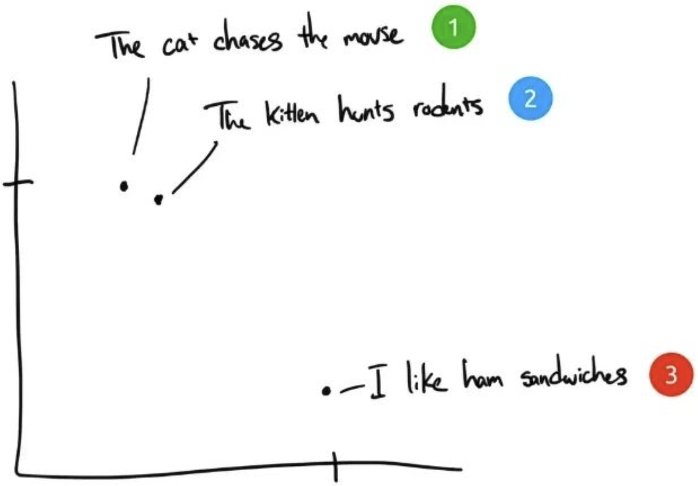

文本被 Embedding 压缩到计算机可以理解的多维向量化空间之后，由于句子 1 和 2 的含义相似，它们会被绘制在彼此附近。句子 3 距离较远，因为没有关联。如果第四个短语 “Sally 吃了瑞士奶酪”，它可能存在句子 3（奶酪可以放在三明治上）和句子 1（老鼠喜欢瑞士奶酪）之间的某个地方。

再举个例子： “人骑自行车” 这句话，计算机面对 “人”“骑”“自行车” 这些文字时一脸茫然，但经过 Embedding 的 “加工”，“人” 可以表示为 [0.2, 0.3, 0.4] ，“骑” 表示为 [0.5, 0.6, 0.7] ，“自行车” 表示为 [0.8, 0.9, 1.0] 。有了这些向量，计算机就能分析 “人” 和 “自行车” 之间的关系，判断 “骑” 这个动作和它们的关联性。Embedding 能帮助计算机处理自然语言里复杂的关系。像 “人” 和 “骑手” 这种相似的词，在向量空间里就离得很近；而 “人” 和 “汽车” 不相似，在向量空间里就离得很远。

#### 2、Embedding Model（嵌入模型）
是将词语、句子或文档转换成数字向量的技术。像一个 “指纹生成器”，给每个词或句子分配一个独特的 “指纹”，这个 “指纹” 就是在数学空间里表示它们含义的固定长度数字向量

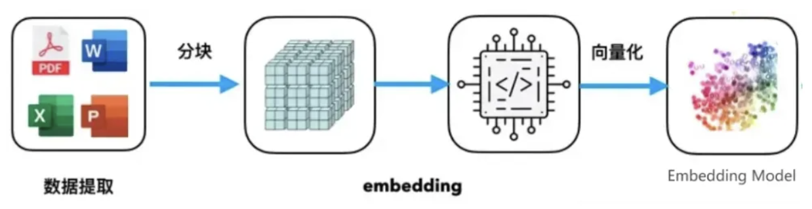

借助这个模型计算机能对文本进行各种数学计算。比如计算 **两个词语向量之间的距离（像余弦相似度）**表示在语义上的相似度；把句子里所有词语向量聚合起来（求平均值或者加权和），就能得到整个句子的向量表示，进而分析句子的语义信息。嵌入模型在很多 NLP 任务中都有重要应用：

**语义搜索**：输入 “如何制作披萨？”，系统通过计算查询向量和文档库中各文档向量的相似度，就能找到最相关的烹饪指南。

**情感分析**：面对 “这款手机性能出色，但电池续航一般” 这样的产品评论，系统能分析出整体是正面评价，但也有负面因素。

**机器翻译**：输入 “我喜欢猫”，系统能把它翻译成英文 “I like cats”。

**问答系统**：提问 “太阳有多大？”，系统借助嵌入模型找到相关天文学文档，给出详细回答。

**文本分类**：根据内容向量表示，把新闻文章自动分类成政治、体育、科技等类别。

**命名实体识别（NER）**：在 “李华在北京大学学习” 这句话里，能识别出 “李华” 是人名，“北京大学” 是组织名。

**嵌入的类型（Embedding model）**

https://openai.com/index/introducing-text-and-code-embeddings/

| **模型类型** | **示例模型** | **检索性能** | **计算复杂度** | **粒度/输入** |
| --- | --- | --- | --- | --- |
| Sparse（稀疏模型） | SPLADE | 好 | 低 | 句子，段落 |
| Dense（稠密模型） | Sentence transformers | 好 | 中 | 句子，段落 |
| Multivector（多向量） | COLBERT | 最佳 | 高 | 句子，段落 |
| Long context dense | text-embedding-3-small | 好 | 中 | 段落，章节 |
| Variable dimension | text-embedding-3-small | 好 | 中 | 句子，段落 |
| Code (dense) | text-embedding-3-small | 好 | 中 | 函数，类 |

#### **3、Embedding 的语义检索方式对比关键词检索（传统搜索）的优势：**
> **==语义理解==**：基于 Embedding 的检索方法 **通过“词向量”表示文本，模型能捕捉到词汇间的语义关系；基于关键词的检索往往关注字面匹配**，可能忽略词语间的语义联系
>

> **==容错性==**：基于 Embedding 的方法能够理解词汇之间的关系， **所以在处理拼写错误、同义词、近义词等情况时更具优势**。基于关键词的检索对这些情况的处理相对较弱
>

> **==多语言支持==**：许多 Embedding 方法可支持多语言， **有助于实现跨语言的文本检索**。比如你可以用中文输入来查询英文文本内容，基于关键词的检索方法很难做到
>

> **==语境理解==**：基于 Embedding 的方法在处理一词多义的情况时更具优势， **能够根据上下文为词语赋予不同的向量表示**。基于关键词的检索方法无法很好地区分同一个词在不同语境下的含义
>

#### **4、Embedding 检索存在的限制：**
> **==输入词数限制==**：即便借助Embedding技术选取与查询最为匹配的文本片段供大型模型参考，词汇数量的约束依然存在。 **当检索覆盖的文本范围广泛时，为了控制注入模型的上下文词汇量，通常会对检索结果设定TopK的阈值K**，不可避免地引发信息遗漏的问题
>

> **==仅支持文本数据==**：现阶段的GPT-3.5及诸多大型语言模型 **尚不具备图像识别功能，然而，在知识检索过程中，许多关键信息往往依赖于图文结合来充分理解**。例如，学术论文中的示意图、财务报告中的数据图表，仅凭文本难以精准把握其内涵。
>

> **==大模型的胡编乱造/幻觉==**：当检索到的相关文献资料不足以支撑大型模型准确回答问题时，为尽力完成响应，模型可能会出现一定程度的“即兴创作”，即在有限信息基础上进行推测与补充。
>

#### **5、嵌入模型在 RAG 引擎中的关键作用**
在 RAG 引擎里，嵌入模型作为 “顶梁柱”主要有以下这些作用：

**文本向量化**：把用户的问题和大规模文档库中的文本都转化为向量。比如用户问 “如何制作意大利面？”，嵌入模型就把这个问题变成高维向量。

**信息检索**：用用户的查询向量在文档库的向量表示里找最相似的文档。RAG 引擎计算问题向量和文档库中每个文档向量的相似度，返回和制作意大利面步骤相关的文档。

**上下文融合**：把检索到的文档和用户问题结合，形成新的上下文，用于生成回答。

**生成回答**：生成模型利用融合后的上下文，生成连贯、准确的回答。

**优化检索质量**：通过微调嵌入模型，提升检索的相关性和准确性。在医学或法律这些特定领域使用 RAG 引擎时，可以用领域特定数据微调嵌入模型，让检索结果更靠谱。

**多语言支持**：在多语言环境下，嵌入模型能处理不同语言的文本。用户用中文提问，文档库是英文内容，嵌入模型要把两种语言的文本都转化到统一的向量空间，方便检索。

**处理长文本**：把长文本分割成多个片段，给每个片段生成 Embedding，提高检索效率。长篇文章或报告可以被分成多个部分，每个部分都生成向量，还不会损失太多语义信息。

从 RAG 引擎的工作流（查询嵌入化、向量数据库查询、检索相关上下文、上下文融合、生成回答）中，嵌入模型处于核心位置，像一座桥梁连接着用户查询和大量文本数据，让信息检索和文本生成得以实现。

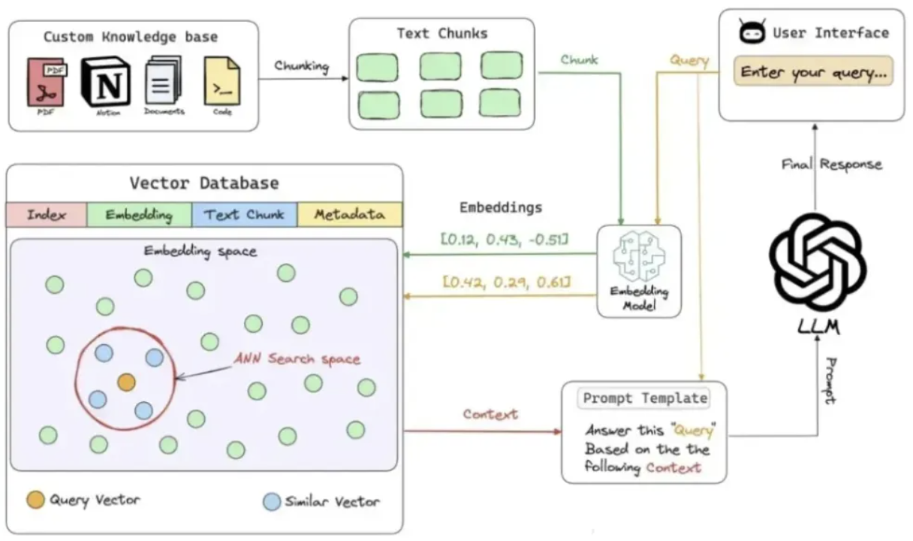

#### **6、Embedding模型选型（AI产品经理了解即可）**
常用embedding模型如下：

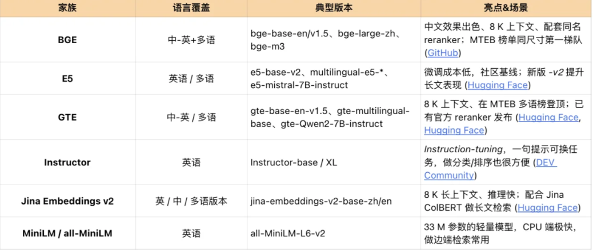

```JSON
怎么选？一般情况下无脑 bge-m3（一般就用这个）
中文或中英混合: bge-m3 或 bge-large-zh
多语言: gte-multilingual-base 或 bge-m3
资源紧张/边缘设备:e5-small 或 MiniLM
长文>8Ktoken:JinaEmbeddingsv2
```

#### **7、向量数据库**
```JSON
这些是专门用于存储嵌入向量并支持快速相似性搜索的数据库：
（1）Faiss是一个库（C++带Python绑定），可以在内存中处理数百万个向量，并提供各种索引策略（flat、IVF、HNSW）用于高效的近似最近邻搜索。

（2）Pinecone和Weaviate是云原生向量数据库服务，处理扩展、持久性和过滤。它们允许不仅存储嵌入向量，还存储元数据（如文档ID、标签），并执行混合查询（结合向量相似性和元数据过滤）。

（3）Chroma（开源）和Milvus是2024年其他流行的向量存储。这些允许自托管持久向量数据库。
对于小规模或简单部署，即使是内存中的Faiss索引或SQLite全文搜索也足够——但生产系统通常需要专用服务的健壮性。
```

补充： **“向量数据库”和“结构化数据库（如 SQL）”的区别**

（1）数据结构与使用方式

| **维度** | **向量数据库（如 FAISS, Milvus）** | **结构化数据库（如MySQL）** |
| --- | --- | --- |
| **数据形式** | 非结构化文本 → 向量 | 明确定义的表结构，字段、主键、索引 |
| **检索方式** | 相似度检索（最近邻搜索：top-k） | 精确匹配 / 条件筛选（WHERE、JOIN、GROUP BY） |
| **适用内容** | 语义内容、对话语料、知识摘要、文本嵌入 | 用户偏好、FAQ 索引、行业资料、订单记录等结构化数据 |
| **响应方式** | 基于“语义相关”的近似匹配 | 基于“规则条件”的精确过滤 |

（2）时效性角度：（这里去看agent 3层记忆架构）

```Python
a）中期记忆（向量数据库）：用于保存近期对话摘要、用户行为上下文（如最近咨询、最近操作），时效性强，用于支持当前任务链路（如 RAG、Agent 多轮协作）；

b）长期记忆（结构化数据库）：用于沉淀稳定信息，如用户身份、历史订单、个性化偏好、知识库 FAQ 等，长期稳定可查，不常更新；
```

（3）查询频率与延迟容忍度：

```Python
向量库：用于实时查询、响应上下文，强调快速、模糊、语义相似；
SQL：一般用于定时调取或后台分析，强调准确、结构化、批量。
```

举例1：

**向量数据库处理逻辑（中期记忆）：**

用户问：“上次你推荐的那款耳机叫什么来着？”

```Python
系统在最近几轮会话中找到“你上次说过小米Air 3 Pro很不错”；
将该话轮嵌入为向量，进行语义相似召回；
返回“您可能是想问小米 Air 3 Pro”。
```

举例2：

**结构化数据库处理逻辑（长期记忆）：**

```Python
用户问：“我账户里绑定的手机号是多少？”
需要在用户表中精确匹配字段：SELECT phone_number FROM users WHERE user_id = '123456';
返回：“您绑定的手机号是 138****0001。”
```

举例3：

用户问：“我去年买的那个基金现在怎么样了？”

**协同使用两种记忆/方式：**

| **步骤** | **系统行为** | **使用的数据库** | **说明** |
| --- | --- | --- | --- |
| 语义解析 | 将用户输入转为嵌入向量，找出“去年买的基金”对应的历史对话 | 向量数据库（FAISS / Milvus） | 支持模糊语义召回，找出“去年你说买了XX基金”这类历史对话 |
| 精准定位 | 从召回的历史会话中提取基金名称（如“华夏成长混合”） | —— | 用作中间桥梁变量 |
| 精确查询 | 查询该基金的当前净值、涨跌幅、用户持仓金额等 | 结构化数据库（PostgreSQL / MySQL） | 用于获取准确、可计算的理财数据 |
| 响应生成 | 综合历史行为 + 当前资产状况，生成个性化回答 | LLM + Prompt 模板 | 输出自然语言回答或图表报告 |

输出示例：“您在 2023 年 6 月购买的”华夏成长混合A“当前净值为 1.82，近一月上涨 2.3%。当前持仓收益为 +420 元，继续持有风险较低，建议保持观望。”

#### 8、微调embedding模型
在RAG系统中，“召回” 与 “排序” 是决定效果的两大核心环节。Embedding 负责从海量数据中 “粗召回” 相关内容，Reranker 则对召回结果 “精排序”，让最相关的信息脱颖而出。

（1）为什么需要微调embedding模型？

在实际落地中，特别是垂直领域（如专业术语密集的农林牧渔、医疗、金融等），embedding模型仍有提升空间。微调的核心价值在于：让模型 “吃透” 领域语义，提升检索精度。

```Python
Embedding 模型：用于将文本转换为向量形式，使系统能够通过向量间的相似度来实现初步的“粗召回”过程。

在实际应用中，模型通常以一个完整的文本片段作为输入，并提取其语义表示向量。具体做法是，使用与文本末尾（[EOS]）对应位置的隐藏状态作为该片段的整体语义表示，用于后续的相似度计算和检索。
```

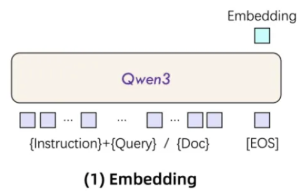

（2）以qianwen3 Embedding 微调举例

a）微调数据集准备：

微调 Embedding 模型时， ==提升效果的关键在于引入“难负样本”，这类样本虽然在语义上与查询文本相似，但在实际含义上并不相关。通过训练模型识别并区分这些“表面相似但语义无关”的文本，能够显著增强模型对语义细节的判断能力，从而提升表示精度。==**==（Hard Negative Mining）==**

假设数据集为 **Chinese-QA-Agriculture_Forestry_Animal_Husbandry_Fishery（**面向农林牧渔领域的中文问答数据集）。在负样本挖掘方面，采用了 **`sentence-transformers`** 库中提供的 `mine_hard_negatives` 函数，完成如下流程：

```Python
基于初始模型获取所有样本的嵌入向量
针对每个查询文本，从非正样本中选取语义最接近的若干负例
构建查询–正样本–难负样本三元组，用于后续训练
```

```Python
from datasets import load_dataset
from sentence_transformers import SentenceTransformer
from sentence_transformers.util import mine_hard_negatives

# 加载农林牧渔领域问答数据集（Parquet 格式）
dataset = load_dataset("parquet", data_files="/path/to/Chinese-QA-AFAF-train-v2.parquet")

# 划分训练/验证集，保留5%用于训练以加速样本挖掘
split_dataset = dataset["train"].train_test_split(test_size=0.95, seed=42)

# 加载预训练嵌入模型，用于初步语义检索
embedding_model = SentenceTransformer("/path/to/m3e-small")

# 基于语义相似度进行“难负样本”挖掘
hard_train_dataset = mine_hard_negatives(
    dataset=split_dataset['train'],
    model=embedding_model,
    anchor_column_name="prompt",         # 查询语句
    positive_column_name="response",     # 正确回复
    num_negatives=5,                     # 每个样本配5个难负例
    range_min=20,                        # 排除相似度排名前20的样本（避免混入正例）
    range_max=50,                        # 候选负例从 top-50 中选取
    max_score=0.8,                       # 限制负例与查询相似度不超过0.8
    absolute_margin=0.1,                # 要求负例相似度至少比正例低0.1
    use_faiss=True                       # 启用 FAISS 加速向量检索
)

# 构造三元组训练数据（query, 正例, 负例）
def format_data(example):
    # 提取标签为1的正例
    correct_resp = next(
        resp for resp, label in zip(example['response'], example['labels']) if label == 1
    )
    # 收集标签为0的所有负例
    rejected_resps = [
        resp for resp, label in zip(example['response'], example['labels']) if label == 0
    ]
    return {
        "query": example['prompt'],
        "response": correct_resp,
        "rejected_response": rejected_resps
    }

# 保存为 JSON 格式，供下游训练使用
hard_train_dataset.map(format_data).to_json(
    "/path/to/qwen3_emb_tr
```

b）启动lora微调（产品经理了解即可，主要是算法主导）

在这个项目中使用了 `ms-swift` 工具链进行 **Embedding 微调训练**，目标是提升向量匹配质量，让系统在召回时更容易匹配到正确的知识片段。

采用 **InfoNCE 作为训练损失函数**，目标是让模型拉近 query 和正例的向量距离，同时远离负例，从而提升语义匹配的区分能力。

> 启用 `INFONCE_MASK_FAKE_NEGATIVE=true` 的设置，自动跳过那些语义上和 query 有关联的“伪负例”，以避免干扰模型判断。
>

> 验证指标重点关注 `eval/margin` ，它表示正负样本之间的相似度差距，margin 越大，说明模型判别能力越强、召回更精准。
>

（3） **总结：AI Embedding 微调流程**

```Python
1、数据准备：
a）从真实业务中采集问答对数据，例如客服问答、知识库FAQ等。
b）划分训练集、验证集、测试集（如 721），用于后续训练与评估。
c）清洗异常样本、去重，确保数据质量。
```

```Python
2、难负样本挖掘
a）使用预训练 embedding 模型（如 m3e-small）将 query 和 answer 编码为向量。
b）对于每个 query，从非正例中挑选“语义最相近但实际错误”的负例（Hard Negative）。
c）过滤“伪负例”（语义接近但也可能是对的），提升训练信号质量。
```

```Python
3、数据构造
每条训练样本构造成一个三元组：
-query：用户的问题
-positive_response：正确答案
-negative_responses：多个相似但错误的答案

输出结构为 JSON 或其他格式，供训练使用。
```

```Python
4、微调配置（算法主导）使用 InfoNCE 损失函数：目标：让 query 更接近正例向量，远离负例向量。
启用 LoRA 轻量微调：只更新模型部分参数，减少显存占用和训练成本。
配置 ms-swift 工具超参数，如学习率、批次大小、训练轮次等。
```

```Python
5、启动训练（算法主导）
使用 ms-swift 工具进行训练。中途定期评估验证集表现，监控关键指标如：eval/margin（正例与负例的向量距离差距）
验证集准确率、过拟合迹象等。
```

```Python
6、评估与导出（产品经理&算法）
根据 eval/margin 判断模型区分能力是否提升。
导出微调后的 embedding 模型，供下游 RAG 系统或检索引擎调用。
可选做 A/B 测试或在线灰度观察“query → 检索 → 命中率”的实际提升
```

### 4.2.6 答案生成
### 【生成失败的原因】
#### **==1、上下文整合问题==**
未能有效利用检索到的信息时会出现上下文整合问题，从而导致不准确、幻觉或不一致。尽管上下文中存在相关事实，但模型可能依赖于其参数化知识，难以整合新数据，或误解检索到的内容。

**问题/局限性：**

（1） **未能正确整合检索到的信息**

常见问题：

检索到的数据可能相互矛盾或不完整，这使得模型难以形成连贯的答案

模型难以进行多跳推理，需要组合多条检索到的信息才能生成准确的响应

模型无法完全理解检索到的事实与原始问题的相关性

（2） **即使在上下文中拥有正确的信息，仍然出现幻觉**

模型过度依赖其已知信息或添加虚假细节以使响应听起来更好时就会发生这种情况。如果模型对其自身的假设比检索到的事实更信任，从而发生幻觉导致错误

例如，模型可能会提供不正确的引文或捏造统计数据，即使它可以在上下文中访问正确的数据

（3） **过度依赖模型的参数化知识，而非检索到的信息**

尤其是在处理时间敏感型查询时。模型也可能忽略检索到的证据，而偏向于其预训练的偏差，从而导致对与检索到的事实相冲突的答案过于自信

**方案：**

（1） **有监督微调：**使用人工注释的数据集进行微调

（2） **事实核查后处理：**实施二级验证步骤，其中模型或外部工具在响应之前交叉检查检索到的事实。在金融、医疗保健和法律服务等高风险应用中尤其有用

（3） **检索感知训练：**对模型进行显式训练，使其通过以外部来源为条件的响应来优先考虑检索到的数据。涉及强化学习/对比学习技术，教会模型更信任外部信息

(这里鼓励有技术bg的同学去看）此外，RAG 系统中，生成组件是生成既准确又上下文相关的回答的核心。要实现高质量输出需要克服2个挑战： **处理噪声检索**以及 **实现对多样化信息的有效推理**。

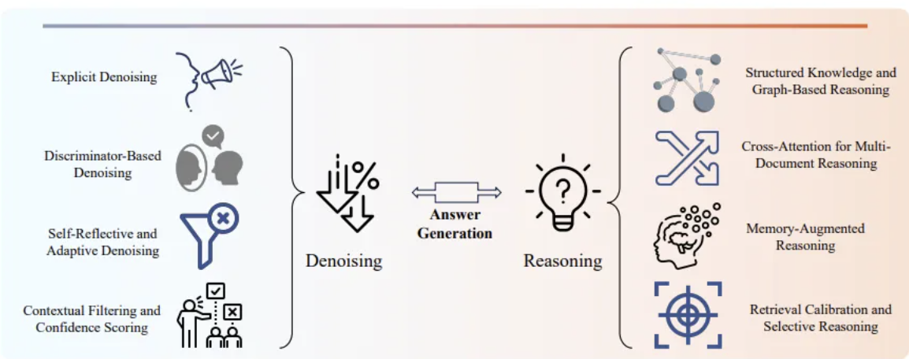

**去噪：减少从大型知识库中检索到的无关、矛盾或误导性信息的影响**

检索中的噪声会严重影响生成输出的事实准确性和连贯性，因此去噪机制在 RAG 管道中不可或缺。

**方式1：显式去噪技术**

InstructRAG引入了 **理性生成**，模型被指示生成中间理性，以澄清每个检索文档的相关性。这些理性通过引导模型专注于更准确和上下文相关的内容，有效地过滤了噪声。

REFEED 框架利用大语言模型根据检索数据重新评估响应的准确性，迭代地丢弃不太相关的信息，从而优化初始答案。

**方式2：基于判别器的去噪**

COMBO 框架使用预训练的判别器将生成的段落与检索到的段落配对，在最终生成阶段之前评估每对的连贯性和相关性。这种基于判别器的方法确保识别并过滤无关或矛盾的信息，从而最小化幻觉的风险。

**方式3：自反思和自适应去噪**

Self-RAG引入了一种自反思机制，模型通过评估其响应的连贯性和事实性来批评和修订自己的输出。这种方法提供了一种动态处理噪声的方式，因为模型可以通过自我评估迭代地过滤不可信或无关的信息。此外，自适应检索策略允许模型根据任务特定标准检索文档，动态调整检索范围和过滤强度，以优化相关性和质量。

**方式4：上下文过滤和置信度评分**

模型可以根据检索信息与查询的一致性为其分配分数，在整合之前过滤掉低置信度的检索。这种方法利用置信度阈值系统地排除噪声文档，特别适用于相关性差异显著的开放域问答任务

#### **==2、推理问题==**
模型难以逻辑地处理和综合检索到的信息时，就会出现推理局限性，从而导致零碎、不一致或矛盾的响应

**问题/局限性：**

（1） **无法从多个来源综合信息**

当模型从多个来源检索信息时可能无法有意义地将它们组合。相反可能会呈现脱节的事实，而没有得出必要的联系。

比如：如果模型检索到有关公司收入和支出的单独信息，但不能计算利润，表明无法有效地综合数据

（2） **组合检索到的事实时出现逻辑不一致**

当模型在组合信息时应用错误的推理时可能发生

当模型未能对齐不同的检索数据

比如：模型检索到一家公司的收入增加，但随后声称其财务状况正在下降（而没有提及成本或债务上升），则反映出逻辑不一致

（3） **未能识别检索材料中的矛盾**

当不同的来源提供相互冲突的信息时，可能难以检测矛盾。它可能不会批判性地评估哪个来源更可靠

比如：如果一个检索到的来源说“X 公司在 2023 年推出了一款产品”，而另一个来源说“X 公司自 2021 年以来没有发布过新产品”，则模型可能会呈现这两个陈述，而没有承认差异

**主要方案：**

（1） **思维链：**鼓励模型显式分解推理步骤，通过使其思维过程更加透明来提高逻辑连贯性

（2） **分层多步骤推理框架：**有条不紊地构建响应，确保在生成答案之前正确综合检索到的数据：

对于需要多步推理的复杂查询，分层或多轮推理模型允许模型迭代处理检索到的信息，每轮都优化其理解。多轮推理特别适用于涉及因果或时间依赖性的任务，因为它使模型能够根据新信息“重新审视”先前的知识，形成分层的理解，从而提高响应的准确性和连贯性

（3） **矛盾检测机制：**使用算法或辅助验证模型来识别和解决检索材料中的不一致之处，然后再最终确定响应。

此外还有4种方法：

**方式1：结构化知识和基于图的推理**

一种高级推理方法涉及整合结构化知识源（如知识图谱）以辅助复杂的关系推理。Think-on-Graph 2.0 引入了一个框架，将知识图谱与非结构化文本相结合，使模型能够推理实体之间的结构化关系。通过利用图结构，模型获得了更深层次的上下文理解，提高了回答涉及复杂关系的查询的能力。

**方式2：跨注意力用于多文档推理**

为了促进跨多个文档的推理，RETRO 模型采用了分块跨注意力，使生成模型能够关注检索到的文本块中的相关信息。这种跨注意力机制有助于保持上下文连贯性，特别是在信息跨越多个文档的开放域设置中。跨注意力也在增强的 kNN 方法中得到了探索，其中 kNN 注意力层允许模型在生成过程中利用邻域信息，从而实现上下文相关内容的无缝整合。

**方式3：记忆增强推理**

模型存储并动态检索与实体相关的信息，使生成模型能够随着时间的推移保持一致性和连贯性。记忆模块在需要纵向一致性或多步推理的任务中特别有益，因为它们允许模型在对话或文档的不同部分中回忆特定实体的细节。

**方式4：检索校准和选择性推理**

模型被训练为根据上下文相关性优先处理某些检索信息。校准技术帮助模型识别最关键的信息，在推理之前过滤掉不太相关的检索。

#### **==3、响应格式化问题==**
当模型未能以清晰、结构化和正确格式化的方式呈现信息时，就会出现响应格式问题

**不正确的归属**

模型会将信息 **归因于错误的来源、错误地引用数据，甚至创建捏造的引文**。这会损害响应的准确性，并可能侵蚀用户对所提供信息的信任。

**引文格式不一致**

当包含引文时，它们 **可能不遵循一致的格式，引文可能缺少必要的详细信息**，例如出版日期、作者姓名或来源 URL，难以验证信息。

**未能保持请求的输出结构**

模型 **无法遵循格式化说明，例如交付论文而不是表格，或在单个响应中混合不同的格式**。

解决方案：

```JSON
输出解析器： 通过使用“预定义的模板或规则”来强制执行结构化格式
结构化生成方法： 使用“提示词工程引导模型”，以确保一致的输出格式
后处理验证： 在最终确定响应之前，自动检查和更正归属、引文和结构
```

#### **==4、上下文窗口利用率==**
LLM在其有限的上下文长度内管理和处理信息，导致忽略关键细节、丢失相关信息或响应生成中的偏差

**低效使用可用的上下文空间**

模型可能未能优先考虑重要信息，从而导致在不相关、冗余或低价值内容上浪费空间。如果不重要的细节占用太多空间，关键信息会被截断，降低模型生成信息充分的响应的能力。

例如，如果模型处理法律文件，但在免责声明和脚注上花费了太多上下文空间，而忽略了核心条款，则可能会产生不完整或具有误导性的结论。

**长上下文中的注意力稀释**

处理冗长的输入时，模型的注意力会分散到所有标记上，从而降低了其专注于关键细节的能力。这种“注意力稀释”可能会导致模型忽略或误解关键信息，从而导致肤浅的理解或无效的综合。

例如，如果模型正在分析一篇 50 页的研究论文，但没有适当地权衡最重要的发现，可能会生成缺乏深度和特异性的过于笼统的摘要。

**处理检索文档中的近因偏差**

模型可能会过度优先考虑最近提供的信息，而忽略早期但同样（或更）相关的内容。这种近因偏差可能会导致有偏差或不完整的响应。

例如，如果模型被提供了多份有关公司财务业绩的检索文档，但过度重视最近一个季度的收益，而忽略了长期趋势，则可能会产生具有误导性的投资见解。

解决方案：

```JSON
策略性上下文排列： 在上下文窗口内组织信息，以便将最相关和最重要的细节放置在模型更可能关注的位置。
重要性加权文档放置： 在上下文限制内优先考虑高价值内容，同时最大限度地减少冗余，从而最大限度地提高有用信息。
注意力引导技术： 使用结构化提示或检索增强方法来引导模型关注关键部分，从而降低稀释和偏差的风险。
```

#### **==5、举个例子==**
LLM问答经常存在重复、幻觉、通顺、美化、溯源等问题，

比如：给定用户Query和参考文献后，一般产品落地时，需要LLM给带有溯源的答案，增加答案的可信度，同时用户想进一步了解的话，可以追踪到答案的出处，提升用户体验

```JSON
1、问题query:为什么这个城市被选为首府?2、LLM生成的答案：选择城市作为首府的原因因州而异。在某些情况下，州官员希望首府位于他们州的地理中心[1]，而在其他情况下，首府的位置可能是因为其相对于其他城市的地理位置而被选中，比如佛罗里达州的首府圣奥古斯丁[1]。在某些情况下，新的首府城市的选址是为了终止各种实体之间的实际或潜在争执[1][2]。首都城市还代表整个国家向世界展示[5],首都城市还代表整个国家向世界展示[5],首都城市还代表整个国家向世界展示[5]

但是上述case的“LLM答案”存在以下问题:
（1）溯源过多：可以合并成一个溯源标记
选择城市作为首府的原因因州而异。在某些情况下，州官员希望首都位于他们州的地理中心[1]，而在其他情况下，首府的位置可能是因为其相对于其他城市的地理位置而被选中，比如佛罗里达州的首府圣奥古斯丁[1]。

（2）溯源错误：这句话的正确溯源是[3]
首都城市还代表整个国家向世界展示[5],首都城市还代表整个国家向世界展示[5],首都城市还代表整个国家向世界展示[5].

（3）答案重复：同一句话重复多次
首都城市还代表整个国家向世界展示[5],首都城市还代表整个国家向世界展示[5],首都城市还代表整个国家向世界展示[5]

（4）出现幻觉：
佛罗里达州的首府是塔拉哈西而在其他情况下，首府的位置可能是因为其相对于其他城市的地理位置而被选中，比如佛罗里达州的首府圣奥古斯丁[1]

（5）答案不通顺：答案句子之间衔接待改进
在某些情况下，州官员希望首府………， 而在其他情况下，首府的位置可能……。在某些情况下，新的首府城市的选址是为..

（6）格式不美化：建议答案分点/分条展示
选择城市作为首府的原因因州而异:xxxxxxxxxxxx

（7）打字机效果：产品落地时一般是要求流式输出，提升用户体验（8）答案不正确:这一句(首都)与Query(首府)匹配度不高
首都城市还代表整个国家向世界展示[5]

【附】
Query召回的片段:
【1】选择首府城市的原因因州而异。在某些情况下，州官员希望首府位于他们州的地理中心。密苏里州的杰斐逊城和南达科他州的皮尔分别因这个原因被选为首府。在其他情况下，首府的位置可能是由于其相对于其他城市的地理位置而被选中。佛罗里达州在1824年选择塔拉哈西作为其首府，因为它位于当时该州最大的两个城市圣奥古斯丁和彭萨科拉之间的中点。有些首府位置被选中是因为它们是贸易和交通的中心。这就是为什么位于哈德逊河附近的奥尔巴尼被选为纽约州的首府。
【2】当安卡拉、伯尔尼、巴西利亚、堪培拉、马德里、渥太华和华盛顿成为首府城市时，选择或建立一个“中立”的首府城市，一个不受地区或政治身份束缚的城市，旨在代表新州的团结。有时，新的首府城市的选址是为了终止各种实体之间的实际或潜在争执，如巴西利亚、堪培拉、渥太华、华盛顿、惠灵顿和马那瓜的情况。
【3】不论一个国家如何决定其首都，那座城市都成为了国家身份的重要象征。虽然它是居民的家园和游客参观的地方，但它也是被选为代表整个国家向世界展示的城市。
【4】州首府之所以重要，是因为它们容纳了各自州的政府，并为州立法机构提供了会议地点。许多会议建筑被称为国会大厦，这与首府有所不同，因为国会大厦指的是建筑，而首府总是指代一个城市。城市被选为首府的原因各不相同，有时是因为它们位于州的中心，如杰斐逊城，或者是商业中心，如奥尔巴尼。如今，许多首府并不是各自州最大的城市，可能会被更大的城市所掩盖，但它们保留了重要的历史价值。
【5】“首府城市:它们是如何被选择的，它们代表什么?”BBC新闻。2017年12月6日。存档于2022年3月23日检索于2022年6月26日。
```

| **编号** | **问题类别** | **问题示例** | **描述** |
| --- | --- | --- | --- |
| ① | 溯源冗余 | [1][1][1]堆叠 | 同一句引用重复标注 |
| ② | 溯源错误 | “首都代表国家形象[5]” 实为[3] | 溯源编号指错文献 |
| ③ | 答案重复 | 同一句话多次出现 | 模型未判重 |
| ④ | 幻觉错误 | “佛罗里达首府是圣奥古斯丁” | 与事实不符（真实为塔拉哈西） |
| ⑤ | 不通顺 | 多句衔接重复“在某些情况下……” | 缺乏上下文连贯性 |
| ⑥ | 格式差 | 全文无分点、无结构 | 可读性差，不适合用户快速理解 |
| ⑦ | 输出方式 | 一次性返回所有内容 | 无流式“打字机”体验 |
| ⑧ | 语义不匹配 | 回答中反复说“首都”而非“首府” | 查询语义与回答不一致 |

1、初步技术方案：

```JSON
（1）溯源冗余、溯源错误、格式问题、溯源过多：sft的数据清洗好，高质量（使用清洗后的高质量 SFT 数据，明确标注规范，如"合并溯源标记"、"编号唯一对应"等）
（2）答案不正确、不通顺、幻觉：sft之后，可以尝试强化学习
（3）重复问题：可以尝试调大模型输出惩罚参数，开采样
（4）打字机效果采用流式输出
```

2、带溯源LLM微调：

https://arxiv.org/pdf/2306.07906

（1）对一个成熟且落地的RAG系统而言，不仅要回答出用户的问题，而且要能够湖源定位出答案时来自于文档库中哪些内容，提升答案可信度与用户体验。

（2）通常进入到LLM的文本chunk通常有若干块，而query的最终答案是来源于其中的某些块，一种可行的方案是让大模型直接溯源，标记出答案与哪些参考chunk有关。

（3）技术方案—— **带溯源的大模型监督微调**：

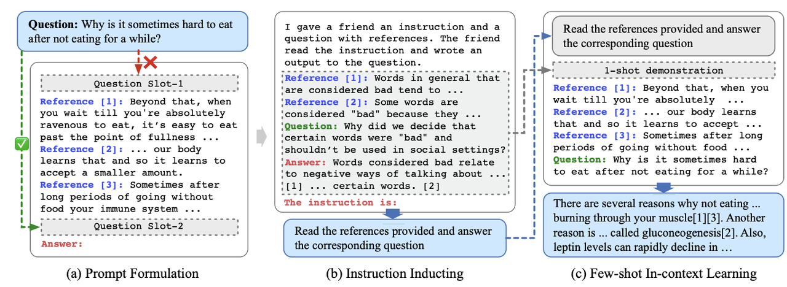

```JSON
（1）Prompt Formulation: 由于sft时输入到模型中的内容较多，包括一些示例(即高质量样本)、问题以及相应的参考材料，它们的表述可能会显著影响性能。比较了几种类型的提示，包括问题和其参考材料之间的顺序(即在前或在后)，用于标记参考索引的符号，以及参考和问题的提示词，最终发现<instruction，one-shot、answer>自然方式表现最佳。

（2）Instruction Inducting：需要一个适当的指令(例如,“请根据问题和参考材料写一个答案。”)来引导大型语言模型(LLM)生成合格的答案。可以利用LLM本身来设计上下文学习中的指令，而不是人工手工制作。使用几个高质量的例子来推导出几个可能的指令，并基于对几个查询的实证评估选择表现最佳的一个。

（3）Few-shot In-Context Learning: 由于参考部分经常占用大量的序列长度，大多数时间里，one-shot学习在答案质量方面可以超越few-shot学习。因此，可选择使用one-shot进行推断，收集不同的查询及其答案。通过在上下文引导启动中使用大型语言模型(LLM)来构建训练样本，用于生成器训练。
```

通过在上下文引导启动中使用大型语言模型(LLM)来构建训练样本，用于生成器训练。它包括三个阶段:（1）提示制定；（2）指令引导，（3）少量上下文学习。通过这种方式可以创建了一个高质量的引用长形问答数据集。

3、溯源+流式输出

需要以“流式”的形式返回给用户答案，为了减少用户等待，提升用户体验，这种场景下如何做好溯源?

技术方案：

（1） **方法1：通过prompt或者sft约束大模型按指定格式直接溯源输出**

劣势：溯源不准确，业务规则无法嵌入的……

```JSON
阅读提供的参考资料并回答相应的问题

question:随着年龄的增长，为什么头发会变灰？

references:
[1]头发为什么随着年龄增长变灰。头发变灰的平均年龄差异很大，20多岁变灰的主要原因之一是基因。人的头发变灰的年龄受IRF4基因的影响，其中一种特定变体(rs12203592)是早期变灰的标志。
[2]虽然社交媒体上的银灰色头发很受欢迎，但当它在你20多岁时出现时，就不那么酷了。压力、DNA和特定的健康状况都可能导致过早变灰。虽然无法逆转灰发，但可以通过一些改变来减缓变灰过程。
[3]黑色素细胞将黑色素注入头发毛干，赋予其独特的颜色。随着人体年龄的增长，头发变灰是因为黑色素细胞减少，黑色素的产生也会减少。空气袋取代了毛干中的黑色素，导致银灰色的头发，以及灰色的阴毛。
[4]除了年龄因素，其他引起头发变灰的原因包括基因、压力、营养不足和健康问题。这些因素影响黑色素细胞的功能，并通过降低色素的产生导致过早变灰。
[5]灰发是衰老过程中不可避免的一部分，但为什么有些人比其他人更早生长出天然灰发呢?在本文中找到答案

answer:
灰色头发是随着我们年龄增长自然发生的过程，其原因是随着年龄的增长，头皮毛囊中黑素细胞和黑色素产生的减少[3]。遗传也起到了作用，因为IRF4基因和一个特定的变体(rs***)是早白发的标记[1]。压力、营养不足和健康问题也可以影响黑素细胞的功能并导致早白发[4]。此外，有些人可能会比其他人更早地自然地长出灰色头发，这是因为遗传[5]。

……

question:xxx
references:
xxx
answer:xxxxx
```

**（2）方法2：大模型输出不带溯源，则可以通过流式token缓存的手段，比如缓存到分隔符时，用Embedding的方式将缓存的内容与所有候选chunk进行匹配溯源**

劣势：分隔符过多时，会造成 **溯源标记碎片化**，返回给用户的结果就有一大片溯源标记，影响用户体验，比如：“ `“灰色头发是自然过程。[3] 其原因在于毛囊退化。[3] 黑素细胞减少。[3]”`

```JSON
将流式生成的token缓存下来，比如模型刚刚输出：
“灰色头发是随着我们年龄增长自然发生的过程，其原因是随着年龄的增长……”

每当遇到一个分隔符（如句号、逗号、句子结尾）：
把这段缓存内容拿出来。
用 embedding 技术（如向量表示）将这段话转成向量。
再用相同方式把所有参考文献切成一段段chunk也转成向量。
和参考文献里的所有chunk对比，找出最相近的一段，认为它是溯源出处。
```

**（3）方法3：结合方法1与2（模型标注 + 精准校验）**

**保留了模型主动提供的溯源**（更有格式感），同时利用 **embedding 做校验**，让溯源更准确，举个完整的例子：

假设模型的流式输出内容如下：

“灰色头发是随着我们年龄增长自然发生的过程，其原因是随着年龄的增长，头皮毛囊中黑素细胞和黑色素产生的减少[3]。”

在句末加了一个引用标记 [3]，看起来像是引用了文献3。

**step1：提取用于匹配的句子：现在只取****`[3]`**  **前面的那句话作为匹配素材：**

“灰色头发是随着我们年龄增长自然发生的过程，其原因是随着年龄的增长，头皮毛囊中黑素细胞和黑色素产生的减少”

**step2：准备候选参考文献的 chunks，假设文献[3]的内容原文是这样一段话：**

[3] 黑色素细胞将黑色素注入头发毛干，赋予其独特的颜色。随着人体年龄的增长，头发变灰是因为黑色素细胞减少，黑色素的产生也会减少。

我们把它分成一个或多个 chunk（可以是整段，也可以是一句话一个chunk）。

**step3：向量化匹配（用 Embedding 技术）**

对上面两段文字做“语义向量化”，即把句子转成 embedding 向量，用来判断“它们是否语义上很像”：

生成文本（模型写的句子） ➜ 向量 A

候选文献（如文献[3]中一句） ➜ 向量 B

然后计算 A 与 B 的余弦相似度（cosine similarity），比如得分为 0.92（很高），就说明匹配成功。

**step4：判断模型是否标注正确**

如果 A 和 B 的相似度 > 阈值（如 0.85）：模型写的“[3]”是对的， **保留即可**。

如果 A 与其他文献（比如[1]）更相似： **修正标签：将 [3] 改为 [1]**，防止误引用。

## 4.3 最通俗易懂的讲清楚rag vs 提示工程 vs 微调及落地路径选择
**Prompt Engineering（提示工程）**

**Fine-tuning（微调）**

**RAG（Retrieval-Augmented Generation，检索增强生成）**

**混合方法（RAG + 微调）**

**优先提示工程，再RAG，实在不行再微调**

## **影响因素**（2个重要因素会影响我们的决策）：
**外部知识需求**：你的任务需要多少外部知识

**适应性需求**：适应性意味着改变模型的行为、词汇、写作风格等

### **如何决定**
**使用RAG**：如果你需要基于自定义知识库生成输出，并且LLM的词汇和写作风格保持不变。

**使用微调**：如果你想要改变模型的结构（行为）而不是知识。

**使用提示工程**：如果你没有自定义知识库，也不想改变模型的行为。

**混合方法（RAG + 微调）**：如果你的应用需要自定义知识库和模型行为的改变

1、提示工程

结构化整理和表达需求的过程，把问题整理成一个大模型能够理解听得懂的方式进行传递

本身对大模型没有任何改造

适用场景：

**快速原型验证、数据不足的初期阶段。**

**通用型任务(如简单翻译、摘要生成)需高灵活性的轻量级应用(如智能客服的通用回答模板)**

if解决不了，看是否是大模型欠缺相关领域知识

2、RAG

讲清楚业务的背景知识，让大模型知道问题的背景和问题的场景以及要解决的问题本身，也就是给 **大模型上下文**

本身对大模型没有任何改造

If 还是解决不了，有可能是大模型自身能力不足

3、微调：

解决大模型自身能力不足：是对大模型本身的一个改造，用领域知识

> **==在实际应用落地中，能不做微调就不做微调==**
>

适用场景：

**高精度要求的垂直领域(如医疗问答、法律文书生成)**

**需稳定输出的生产级应用(如企业级客服机器人)**

**复杂逻辑任务(如代码生成、数据分析报告撰写)**

具体如下：

**对结果“准确率”要求极高**

一些专业门槛高、术语复杂的行业，如 **医疗、法律、金融**，普通大模型往往“一知半解”。 通过微调让模型“考取专业证书”，是必要手段。

比如某金融团队在微调 Qwen 模型后， **数据分析准确率从 34% 提升到了 85%**，业务可用性大幅跃升。

**想要定制独特的“风格/语气/结构”**

你希望模型的回答总是符合你品牌调性？ 比如电商客服一定要礼貌、有情绪缓冲、话术规范；或你希望回答永远遵循“定义-分析-建议”的结构， **这就可以通过微调实现行为模式的固化**。

某电商企业就在微调后让客服 AI“更像真人”， **用户满意度提升了30%。**

**【场景举例】：**

我们为一家高端的私立牙科诊所打造一个在线客服系统。客服回复需体现出：

**高度专业性**，但同时保持患者友好，避免出现大量生硬的术语；

语言需传达出高品质服务的细致与体贴， **语气沉稳、富有情感温度**；

每次回答后都要自然地补充一句服务引导语，例如：“如果您还有其他疑问，欢迎随时再次联系我们或致电诊所 [电话号码]。”

在 Prompt 中，需要详细列明上述语言风格与沟通方式，并示例标准结尾话术，帮助模型稳定输出符合品牌调性的内容。但是：（1） **尾部固定语句易被遗漏**：模型并不总能稳定添加结尾引导语；（2） **情感和高端风格表达不一致**：例如“富有同理心”这类主观性风格，模型可能一会儿过于煽情，一会儿又显得冷淡，呈现出风格波动。（3） **长对话中风格漂移明显**：在多轮对话场景中，模型容易回到默认中性风格，难以持续维持定制语气；（4） **重度依赖 Prompt 模板**：每次对话都要靠较长Prompt才能维持风格，易出现提示词“跨轮失效”的问题，难以做到端到端风格记忆。

为了解决Prompt维持不稳定的问题，就需要准备大量 **符合品牌语气要求的对话示例**，这些数据由诊所市场团队、客服团队和牙医专家共同整理、审核，确保每条样例都精准反映品牌语调和沟通细节，供模型微调使用

**模型需要处理“边缘案例”或冷门问题**

普通模型没见过的场景、无法泛化的稀有问题（如：某设备特殊故障、少数民族语义理解等）， **微调是一种弥补通用模型短板的策略**。

**想把大模型“压缩”成可控成本的小模型**

先用大模型构造数据，再微调一个 **轻量模型（如LLaMA-2 7B）**，在 **接近质量的基础上大幅降低推理成本**。

用更小参数量的开源模型，通过微调机构内部的流程文档、操作规范和制度资料，使模型掌握定制化知识体系。完成微调后，将该小模型部署至机构的 **私有服务器**，实现低成本、低延迟、零外依赖的内部知识问答服务。

RAG 与微调如何组合用？真实落地场景下：

**先用 RAG 验证可行性，低成本跑通 demo**

**再微调模型进行定制优化，如增强风格、提升准确率**

高风险任务直接交给一个 **专门微调过的模型来推理和生成结果**（ **对准确性、权威性、合规性要求极高**的任务，如果出错可能带来严重后果，比如金融，医疗）

以此形成稳定的回答风格

减少自由生成带来的误差

更准确使用行业术语和标准结构

在“边界问题”上学会合理拒答（如“不做诊断建议”）

**==4、对于实际在工作中如何进行决策的几个原则==**

（1） **看产品所处阶段:**

早期：尽可能用Prompt验证需求，快速上线MVP最小可行产品

成熟期：积累数据后通过SFT优化性能，提升用户体验。

（2） **混合使用:**

核心功能用SFT保证效果，长尾需求通过Prompt补充。

在SFT模型中保留Prompt设计，增强灵活性(如支持用户自定指令)。

（3） **成本权衡:**

数据获取成本高时，优先优化Prompt

标注资源充足则倾向SFT

（4） **场景复杂度：**

结构化程度高、需要理解上下文逻辑 ， 更适合SFT

回答多变、用户偏好多样 ，Prompt 灵活应对

（5） **持续迭代:**

SFT模型可定期用新数据更新，Prompt需根据用户反馈持续调整

场景举例：

（1）以电商客服场景举例：

```JSON
产品初期：用Prompt“请以友好语气回答用户关于退货的问题”引导通用回复
后期/成熟期：用历史工单数据微调，使模型自动识别订单号、政策条款并生成专业回复
```

（2）以医疗咨询场景举例：

```JSON
初期：用Prompt 结合“Few-shot”示例让模型生成症状初步建议(标注“仅供参考”免责声明)
后期/成熟期：用权威医学文献和医生审核数据微调，确保回答的准确性与合规性
```

## 4.4 RAG 必考的一些面试题
**-初级：**

**1、什么是检索增强生成RAG**

（1）Meta AI的研究团队于2020年提出了RAG（检索增强生成），用来让大型语言模型在特定任务上表现得更出色

（2）大模型虽然强大但也有技术缺陷：会产生“幻觉”，会犯一些事实性错误。这是大模型技术逻辑带来的天然缺陷，大模型的技术机理是， **==通过大量的知识训练，基于概率最大的原则生成答案==**。那么带来了几个问题：

（1） **公开的数据库中往往缺乏真正有用的知识**，大模型能学习到只是“皮毛”，由此生成的答案只能是泛泛而谈

（2）一旦 **在训练过程中学习到了不准确的内容，大模型生成的答案就会产生偏差**

（3） **大模型是基于概率来生成答案**，即便是“1加1等于几”这样的问题，也是大模型在训练的过程中，“发现”1+1后面出现2的概率最大，所以才会给出2的答案。除了“1+1=2”这样铁一般的事实不容易出错外，在很多问题上，大模型都不能保证百分之百正确

（4） **没有办法实时更新知识**。比如，ChatGPT 3.5只学习了2021年9月之前的知识

（3）RAG有什么用？

RAG能找到相关信息给LLM作参考，这样LLM就能写出更有根据的内容。用好RAG，可以让LLM的知识库更广，不仅能访问到那些专属的知识库，还能及时更新数据，让它的回答更准确、更贴近最新情况。 **==RAG是一种结合了信息结算和文本生成的技术，通过从知识库中检索相关信息来辅助大模型生成更准确、更丰富的文本回复==**。

优势：确保模型能够访问到最新、最及时的事实和相关信息，通过定期更新外部参考信息，生成的回复能够纳入与用于查询相关的最新信息

**2、RAG的整个流程是怎样的？**

完整的 RAG 应用流程主要包含两个阶段：

1、数据准备阶段（离线）：

（A）数据提取–> （B）分块（Chunking）–> （C）向量化（embedding）–> （D）数据入库

2、检索生成阶段（在线）：

（1）问题向量化–> （2）根据问题查询匹配数据–> （3）获取索引数据 --> （4）将数据注入Prompt–> （5）LLM生成答案

**3、你能解释RAG与传统语言模型之间的基本区别吗?**

传统语言模型（如GPT-4），基于它们从训练数据中学到的模式和结构生成文本。它们无法从外部源检索特定信息，而是基于接收到的输入生成响应。另一方面，RAG包含一个检索组件。它在生成响应之前先从文档集合中搜索相关信息。 **==这允许RAG访问和利用外部知识。从而使其更加具有上下文意识，并能够比传统语言模型提供更准确、更详实的响应。==**

**4、RAG如何提高AI模型响应的准确性?**

RAG通过利用 **==结合了基于检索的方法和生成模型的两步方法来提高AI模型响应的准确性==**。

（1）检索组件首先搜索大量文档，根据输入查询找到相关信息。

（2）生成模型使用这些检索到的信息生成响应。

通过结合检索到的文档中的外部知识，RAG可以比仅依赖训练数据中学到的模式的传统生成模型提供更准确、更相关的上下文响应。

**5、RAG中检索模型的重要性是什么?**

RAG中的检索模型在访问和识别大型数据集或文档集合中的相关信息中起着至关重要的作用。这些模型负责根据输入查询搜索可用数据，并检索相关文档。 **==检索到的文档作为生成模型生成准确和翔实响应的基础。检索模型的重要性在于它们提供外部知识的能力。因此，提高了RAG系统的上下文意识和准确性==**

**6、RAG系统通常使用哪些类型的数据源?**

在RAG系统中，可以使用各种类型的数据源，包括：

（1） **文档集合：**RAG系统通常使用文本文档的集合，如书籍、文章和网站，作为数据源，这些集合为生成模型提供了丰富的信息来源，可以检索和利用。

（2） **知识库：**RAG系统也可以使用包含事实信息的结构化数据库，如维基百科或百科全书，作为检索特定和事实信息的数据源。

（3） **网络资源：**RAG系统也可以通过访问在线数据库、网站或搜索引擎结果从网络中检索信息，以收集生成响应的相关数据。

**-中级：**

**7、RAG中的检索组件扮演什么角色?**

根据输入问题，RAG的检索组件搜索可用的数据源，如文档集合或知识库，以识别相关信息。该组件使用各种检索方法，包括 **==关键词匹配和语义搜索，找到并检索包含相关信息的文档或数据点==**。生成模型接收并使用检索到的相关数据生成响应。 **==检索组件通过使外部知识更容易获取，显著提高了RAG系统的准确性和上下文意识。==**

**8、RAG如何处理偏见和错误信息?**

RAG可以通过涉及 **==基于检索的方法和生成模型的两步方法来帮助减少偏见和错误信息==**。设计者可以配置检索组件，以便在从文档集合或知识库检索信息时优先考虑可信和权威的来源，此外，他们 ==可以训练生成模型在生成响应之前对检索到的信息进行交叉引用和验证。从而减少偏见或不准确信息的传播。==通过结合外部知识源和验证机制，RAG旨在提供更可靠和准确的响应。

**9、使用RAG而不是其他自然语言处理技术的益处是什么?**

使用RAG而不是其他自然语言处理技术的一些关键益处包括：

（1） **提高准确性和上下文意识：**利用外部知识源和检索组件，RAG可以比标准语言模型产生更准确、更符合上下文的回复，可解释性更强

（2） **数据更新的及时性**：RAG模型具备检索库的更新机制，可以实现知识的即时更新，无需重新训练模型，从而提供与最新信息相关的回答。

（3） **减少训练成本**：RAG模型在数据上具有很强的可拓展性，可以将大量数据直接更新到知识库，以实现模型的知识更新，这一过程不需要重新训练模型，更加经济实惠。

（4） **多模态的拓展**：RAG不仅可以应用于文本，还可以面向语音、视频和图像等多模态场景，只要可以embedding的内容就可以。

**-高级：**

**10、RAG如何增强人与AI的协作?**

RAG可以通过以下方式增强人与AI的协作：

（1） **增加信息检索：**RAG的检索组件可以访问和检索大型数据集或文档集合中的相关材料。从而为用户提供全面和精确的查询答案。

（2） **提高上下文理解：**通过在讨论中保持上下文的一致性，RAG可以产生更有意义和有说服力的回复。因此，使人与人之间的互动更加无缝和有意义。

（3） **定制化响应：**RAG可以考虑用户选择和过去的互动，提供满足每个人需求和偏好的定制化答案。总

体而言，RAG利用外部知识源并生成上下文相关的回复的能力可以提高人与AI互动的质量，使协作更有效。

**11、RAG如何在对话中保持上下文?**

**==RAG利用从过去的互动或当前对话中获取的信息来保持对话中的上下文。==**通过不断地根据现有对话搜索和检索相关数据，检索组件确保生成模型能够获得产生连贯和上下文适当的回复所需的上下文。

由于这种迭代过程，RAG能够理解和适应对话上下文的变化，从而产生更自然的互动。

**12、RAG在训练推理阶段降低成本的方法：**

RAG的主要成本就在于GPU资源消耗，

1. **优化训练策略****增量学习**：只对新数据进行训练，保留旧数据的知识，避免了重复训练所有数据，降低了长期运营成本。这种方法特别适用于数据持续更新的场景，能够有效减少训练时间和计算资源消耗。**微调技术**：通过对现有模型进行微调，而不是从头开始训练，可以快速适应新的任务和数据。微调技术不仅节省了大量训练时间，还减少了计算资源的消耗，是一种高效的低成本训练策略。
2. **优化数据存储与检索****引入显式记忆格式**：通过将知识库或文本数据集转换为稀疏注意力键-值对的形式，可以有效减少存储和读取成本。显式记忆格式的写入和读取成本相对较低，且在推理过程中能够显著减少额外的计算和存储开销。**使用Self-RAG技术**：Self-RAG通过引入Reflection Tokens，使语言模型能够根据具体需求动态决定是否检索外部知识，从而大大减少了不必要的检索操作。这种方法不仅提高了响应速度，还降低了计算资源的浪费。
3. **改进模型架构****多模态RAG**：结合长上下文和多模态信息，可以提升模型的整体性能和生成质量。更长的上下文和多模态输入使得模型能够理解更多的文档内容，从而在推理时提供更准确的结果，减少了反复检索和调整的次数。**模块化设计**：采用模块化设计理念，将模型拆分为多个独立的模块，每个模块负责不同的功能。这样不仅可以提高模型的可维护性，还能方便地进行局部更新和优化，降低整体成本。
4. **利用云端资源****云计算平台**：利用云计算平台的弹性计算资源，可以根据需求灵活分配计算资源，避免本地硬件资源的浪费。这种方式特别适用于大规模数据处理和复杂模型训练，能够显著降低基础设施成本。**分布式训练**：通过分布式训练技术，将模型训练任务分散到多台机器上并行处理，可以大幅缩短训练时间，提高训练效率。分布式训练还可以充分利用闲置计算资源，进一步降低成本。
5. **数据增强技术****无监督学习和自学习**：利用无监督学习和自学习技术，可以在没有高质量标注数据的情况下进行模型训练。这些方法能够有效利用未标注的数据，减少对昂贵标注数据的依赖，从而降低数据获取和处理成本。**迁移学习和多任务学习**：通过迁移学习和多任务学习技术，可以将在一个领域学到的知识应用到其他相关领域。这种方法不仅提高了模型的适应性，还减少了对大量领域特定数据的依赖，降低了数据收集和标注的成本。

**13、如果你觉得知识问答的结果不达预期或者出现明显问题，你的排查思路和解决方案是什么？**

（1）问题排查的思路：先观察现象再进行定位，最后排查出原因。

（2）知识库的整个问答体系链路较长，其中包含几个主要环节，首先是解析，其次是改写，也就是对输入进行解析后进行改写；接着是召回、排序，最后是生成。所以在每个环节都需要进行一定的定位， **这是一个正向的链路流程**。

（3）排查问题的时候需要“从后往前”进行：按照以下逆向步骤一层一层往前排查，确定是哪个环节出了问题，然后进行解决

排查步骤：逆向排查

a）先查看生成环节的问题排查：先看Prompt，检查其拼接结果中是否召回了正确答案，答案是否有缺失。如果答案没有缺失但答非所问，那就说明是大模型本身在生成环节出现问题。

b）如果在Prompt拼接的召回片段中没有答案，那就说明需要再往前看排序环节是否有问题，答案是否没有排在靠前位置。

c）如果排序正常，那就继续往前查看是否有召回，也许根本就没有召回。

**这样一层一层往前排查，确定是哪个环节出了问题，然后进行解决**

方案：

（1）业务策略上制定很多方案：比如进行文档的增删改查，筛选出一些优质的对话示例让大模型学习，区分不同的Agent来处理不同的业务，使单个Agent能力更强、更聚焦，

（2）在业务上进行分层，区分不同渠道并绑定不同知识库，使知识更纯粹而不会相互缠绕等。

（3）工程链路优化：如文档解析、检索召回优化、prompt优化

（4）算法调优：改写策略、必要时微调

**14、如何构建基于LLM的知识问答助手**

将企业知识库文档和用户提问的实时信息通过向量特征提取然后存储到向量数据库，结合LLM大预言模型可以让chatbot（聊天机器人）的回答更具专业性和时效性，构建企业专属chatbot。向量数据库+大模型知识问答方案整体分为2个部分：

（1）首先将业务数据进行向量化预处理进行知识库的构建与更新

（2）其次通过在线搜索服务进行检索

（3）通过LLM大语言模型进行内容生成

**==（请对这张图牢记于心）==**

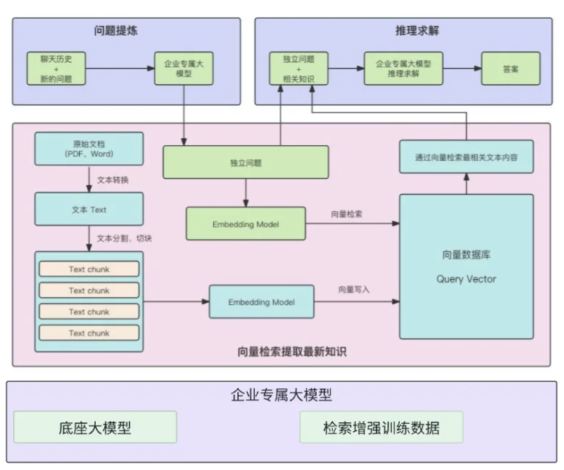

**15、如何进行业务数据预处理**

以文本数据为例：

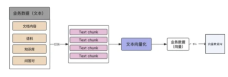

首先需要对业务数据进行向量化处理，然后构建向量索引。

（1）步骤1：将本文形式的业务数据分割成内容大小适当的片段

（2）步骤2：将内容判断导入文本向量化模型中，得到向量形式的业务数据

（3）步骤3：将向量形式的业务数据导入到向量数据库中，构建向量索引，检索问答服务

检索问答服务

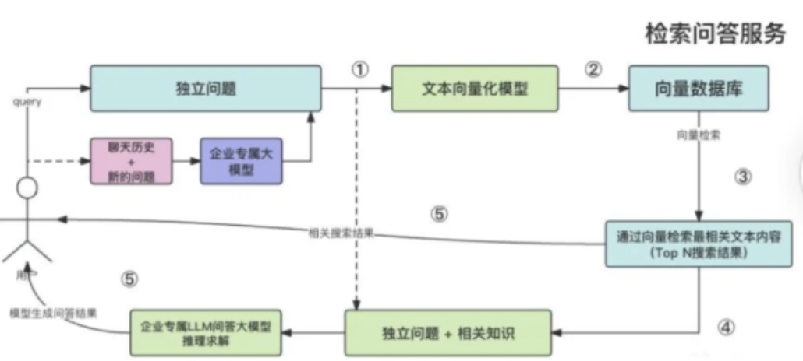

实现检索功能后，结合top N检索结果，基于LLM问答模型返回检索推理问答结果。

（1）步骤1：将用户输入的问题query作为独立问题输入到文本向量化模型，得到向量形式的用户query

结合聊天历史和新问题的query，通过企业专属大模型生成独立问题

LLM为可选，有些问题存在上下文依赖

（2）步骤2：使用向量检索引擎得到业务数据中的TOP N搜索结果

（3）步骤3：LLM给予最相关的知识（TOP N检索结果）和独立问题输入LLM问答模型进行求解推理，得到最终答案

（4）步骤4：将问答模型生成的问答结果和向量检索得到搜索结果返回给终端用户

**16、如何定义数据指标**

用户满意度/用户主观意见分（MOS）

问答准确率：准确回答个数/总的问答数

召回率：追却回答个数/实际正确问题数

F1值

……

## **4.5 RAG局限性?落地挑战？**
### 4.5.1 详细说明
（1） **检索质量**

（1） **语义歧义**：向量表示(例如词嵌入)可能无法捕捉概念之间的细微差别。例如，“苹果”一词可能指的是水果或科技公司。嵌入可能会混淆这些含义，导致不相关的结果。

（2） **用户输入变复杂**：与传统关键词或者短语搜索逻辑不太一致，用户输入问题不再是词或者短句，而是转变成自然对话声知识多轮对话数据，输入风格更加口语化。

（3） **文档切分**：文档切分主要有两种方式，一种是基于形式的切分，比如利用标点和段落的结束；另一种是基于文档内容的意义进行切分。

（4） **多模内容的提取及表征(例如表格、图表、公式等)**：对多模内容进行提取及动态表征，尤其是处理含糊或负面的查询，对 RAG 系统的性能有显著影响。

（2） **增强过程**

（1） **上下文的集成**：难点是将检索到的段落的上下文与当前的生成任务顺利地集成。如果做得不好，输出可能会显得脱节或缺乏连贯性。

（2） **冗余和重复**：多个检索到的段落包含相似信息，生成步骤可能产生重复的内容。

（3） **排名和优先级**：确定多个检索到的段落对于生成任务的重要性或相关性可能具有挑战性。增强过程必须适当权衡每个段落的价值。

（3） **生成质量**

（1） **过度依赖检索内容**：生成模型可能过度依赖增强信息，导致幻觉问题突出

（2） **无关性**：即模型生成的答案无法解决查询的问题

（3） **毒性或偏见**：即模型生成的答案有害或令人反感

### **4.5.2（补充面试题）**你觉得RAG可能会失效的原因是什么？
如果在面试中，会要求更聚焦：

**失效原因：**从以下3个方面回答：

**1、检索器未能检索到完整或相关的上下文**

**2、LLM虽然接收到上下文、但未能有效利用**

**3、LLM没有针对查询给出回答，而是从上下文中提取了不相关信息**

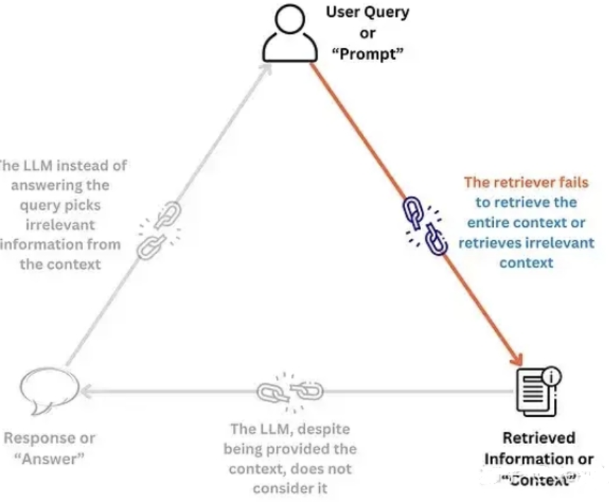

**如何评估检索器未能检索到完整或相关的上下文：**

**If 检索器未能检索到完整或相关的上下文：**

**2、检索模块（检索）：只考虑检索整体效果，不考虑结果排序，4个最核心指标**

（1） **准确率(Accuracy)**：衡量检索到的结果中有多少是相关的

> -计算方法： ==Precision=（检索到的相关文档数量）/（检索到的文档总数）==
>

（2） **召回率(Recall)**：衡量检索系统能够找到多少比例的所有相关文档

判断方法及计算：

> -计算方法： ==Recall=（检索到的相关文档数量)/(数据库中所有相关文档的数量）==
>

（3） **正确率@K(Precision@K)**：在前K个检索结果中，有多少是相关的。

> -计算方法： ==Precision@K=(前K个文档中相关文档的数量)/K==
>

（4） **F1分数(F1 Score)**：准确率和召回率的调和平均，是一个综合指标

> -计算方法： ==F1Score=2*(Precision* Recall)/(Precision+Recall)==
>

**高级指标：排序：考虑检索结果的排序指标，进行更深入的评估，3个最核心指标：**

（1） **平均精确率(Mean Average Precision,MAP)**：对于一系列查询，MAP 计算每个查询的平均精确率(AP)，然后计算所有查询的 AP 的平均值

-计算方法：对于每个查询，按照文档的相关性和排名计算精确率。

a）对每个査询点的精确率求平均，得到 AP

b）对所有査询的 AP 求平均，得到 MAP

（2） **平均倒数排名(Mean Reciprocal Rank,MRR)：**在一组查询中，每个查询的第一个相关文档的排名倒数的平均值。

-计算方法:

a）对于每个查询，找到第一个相关文档的排名。

b）计算该排名的倒数。

c）对所有查询的倒数求平均，得到MRR

（3） **NDCG(Normalized Cumulative Gain，归一化折损累积增益)：**考虑到文档的相关性和它们在排名中的位置，NDCG是一个衡量排名质量的指标。

-计算方法：

> ==Precision@K=(前K个文档中相关文档的数量) / K==
>

考虑了相关文档的位置，并为较早出现的相关文档分配更高的权重，特别适用于文档具有不同程度相关性的场景

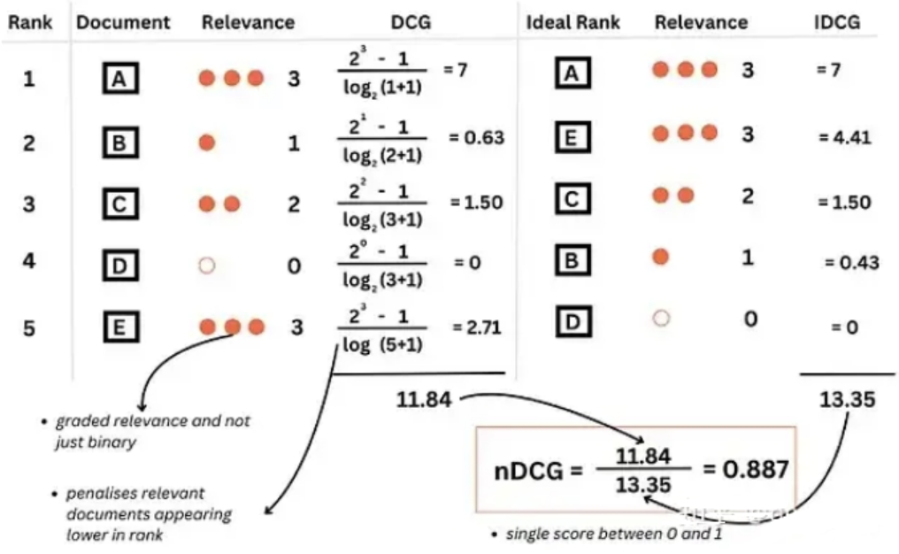

### **4.5.3 (补充面试题）**基于大模型的 RAG 系统中，如果用户提问不在知识库内，如何解决？
**==7个手段：==**

1、 **用 ragas 检测+新知识补充**

假设：如果一个问题的答案在外挂知识库中，则该问题的答案所在文档片段肯定会被召回。这种情况下就可用ragas 去评测 RAG流程的几个环节：

召回context对 query 的支持度、response对召回 context 的遵从度、response对 query 的相关度。

如果回答response质量不高，那就重点关注召回 context 对 query 的支持度。

**在前述假设下，response回答不好是因为召回的context和 query 关联不大，根本原因是知识库中没有本 query 相应的答案片段。补充新知识只需要把该问题相应的答案文档导入知识库即可。**

假设：答案在知识库中，有可能是没有正确召回，也有可能是知识库中没有答案。

这时要用不同于context 召回的策略首先去检查答案是否在知识库中，若在则说明 **context的召回环节有问题，需要更新召回算法或者知识组织形式；若答案不在知识库中，则直接增加新语料即可。**

2、 **使用大模型生成答案**

由于 RAG 系统结合了检索和生成能力，当检索不到相关知识时，可以利用大模型自身的生成能力来回答问题。这种方法依赖于模的语言理解和生成能力，但可能存在生成不准确或误导性答案的幻觉问题。

**3、利用互联网搜索**

如果系统允许，可以集成互联网搜索引擎检索相关信息，这种方法可以扩大信息来源，提高回答问题的能力，但需要注意版权和隐私问题。

**4、反馈机制**

当系统无法回答问题时设计反馈机制，允许用户指出问题未被解答，或者提供更多信息。这样系统可以学习并改进未来的回答。

**5、知识库定期更新和扩展**

定期更新和扩展知识库，确保覆盖更广泛的话题和领域。可使用自动化工具来监测和识别知识库中的盲点，并据此进行更新。

**6、多模态检索**

除了文本信息，还可以集成图像、视频等多模态数据。即使文本信息不足以回答问题，系统也可以从其他模态的数据中寻找答案

**7、问题重定向**

当系统确定无法回答问题时，可以尝试将问题重定向到其他可能更专业的系统或服务，如专业问答社区、在线客服等。

**8、透明度和解释性：**

当系统无法回答问题时，向用户提供透明度和解释性信息，如说明问题为何无法回答，以及系统未来可能改进的方向

**4.4 RAG产品架构**（举例某厂商的产品）

整个产品架构包含 **4层**：

（1） **最底层是模型层：**屏蔽掉了模型的差异，支持开源的大模型，第三方的模型。此外，为了优化embedding的效果提出一种跨语言Embedding模型，有效的解决跨语言检索问题，同时提高了模型的效果。

（2） **离线理解层：**主要围绕 **智能知识库**和 **搜索增强**两个模块设计的。智能知识库主要负责将非结构化的文本进行处理，从而转化为检索知识库，主要包括文本解析，表格识别，OCR识别等。搜索增强通过引入问句改写、重排等模块，保证检索的精准度。

（3） **在线问答层：**支持多文档、多轮次、多模态及安全性与拒识等

（4） **场景层：**针对不同行业的特点，预制多种场景类角色，降低产品使用门槛

## **4.6 RAG自动化评估框架**
RAG 的评估框架有好几种， OpenAI 的案例中的评估方式就是RAGAS(从定义到使用可以参考 https://docs.ragas.io/)

### 1、RAGAS
1、RAGAs 评估框架要求的输入是：

```JSON
用户问题（question）答案（answer）上下文（contexts）真实答案（ground truths）
```

上述输入可以通过 openAI GPT4 来生成，也可以用你真实业务场景中的现成的 FAQ。RAGAs 可以基于大语言模型对 RAG 系统进行打分。

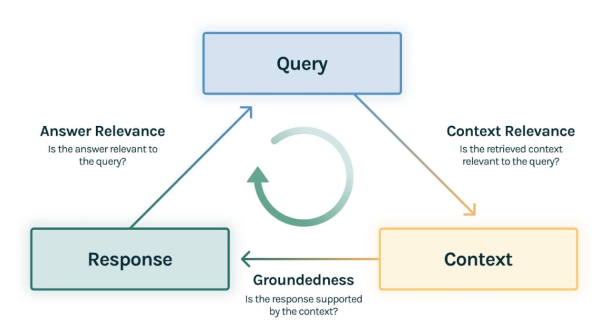

RAG 三元组（ [https://www.trulens.org/trulens_eval/core_concepts_rag_triad/ ](https://www.trulens.org/trulens_eval/core_concepts_rag_triad/)）

2、评估指标：

RAGAs 提供了2大类指标，一类 **评估生成能力**，一类 **评估检索能力**。

**生成能力包含以下指标：**

```JSON
忠实度（faithfulness）：衡量回答是否属实，比如北京是中国的首都这是真实事件。答案相关性（Answer relevancy）：衡量回答是否与答案相关，比如用户的问题是北京今天天气如何，回答为“北京是中国首都”，虽然事实正确，但并不相关。答案语义相似性：Answer semantic similarity：衡量回答与答案的相似性答案正确性：Answer Correctness：衡量回答与期待答案的正确性。
```

**检索能力包含以下指标：**

```JSON
上下文精度（Context precision)，衡量 Ground truth 在检索结果中是否排名较高，和检索评估中的 MRR(平均倒数排名)目标一致，但计算方法不一样。上下文召回率（Context recall），衡量 Ground truth 与检索结果的相关性，和检索评估中的召回率 指标一致。上下文相关性（Context relevancy），衡量检索结果与用户提问的相关性。
```

### 2、实际应用场景-生产环境RAG评价（实操）
1个典型的RAG系统主要由两部分组成，评估RAG系统，就得从这两个部分入手，同时还要关注 **系统整体的表现**。

**检索器**：负责响应用户的查询，从知识库（通常是向量数据库）里找出相关信息

**生成器**：它则利用检索到的上下文和用户的查询，生成连贯、相关且信息丰富的回答。

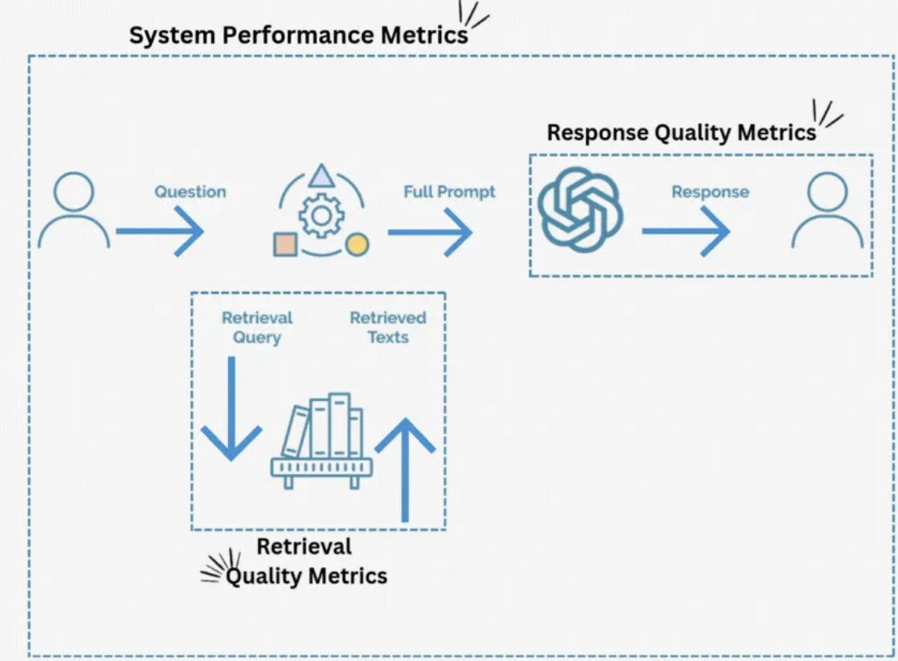

（注：以下内容可以和4.8一起看！）

（1） **RAG评估的3大维度**

**检索质量**：检索器 **能不能准确找到**并抓取相关文档？

**响应质量**：生成器能不能用好检索到的上下文， **给出准确且有用的回答**？

**系统性能**：整个RAG系统 **在成本和响应速度**上表现如何？

（2） **盯紧7个关键指标**

**Precision@k**（ 拿到的是相关内容吗？ ）：在检索器给出的前k个结果里，有多少是真正和查询相关的。质量永远比数量重要！

**Recall@k**（ 漏掉了什么？ ）：得知道系统有没有漏掉相关文档。召回率就是衡量在前k个结果里，我们抓到了多少真正相关的文档。

**Faithfulness/Groundedness(忠实度/真实性)（**有没有在瞎编？ ）：这个指标检查生成的回答是不是真的基于检索到的文档。方法可以是人工评估、自动事实核查工具，或者一致性检查。

**答案相关性**（ 真的在回答问题吗？ ）：答案光有事实还不够，还得真正解决用户的疑问。这个指标就是看生成的回答和用户的问题是不是对得上。

**幻觉检测**（ 是不是在编造事实？ ）：这个指标帮你盯紧系统，看它有没有在捏造事实，或者做出数据里根本没有的断言。

**延迟**（ 是不是太慢了？ ）：系统响应需要多长时间？如果太慢，用户可没耐心等你响应。

**Token消耗**（ 成本效益如何？ ）：估算每个请求的成本，帮助优化资源使用，避免浪费。

（3） **还有其他哪些指标值得关注？**

除了（2）外，根据你的场景的具体需求，还有很多其他指标可能会派上用场

**F1@k（F1 score)**：是精度和召回率的“和事佬”，平衡后给出一个综合的评估结果。

**平均倒数等级（MRR）**：如果你只关心第一个相关文档的位置，这个指标就特别有用。

**平均精度（AP）**：当检索到的相关文档的顺序很重要时，这个指标能派上大用场。

**累积收益（DCG@k）**：这个指标会根据文档的位置来衡量它们的有用性，位置越靠前，得分越高。

**标准化累积增益（NDCG@k）**：这是DCG的标准化版本，方便你在不同结果集之间进行比较。

**上下文精确度/召回率/相关性**：这些指标特别适合用来评估你的检索步骤，看看上下文抓取得准不准。

**BLEU、ROUGE、METEOR**：如果你在搞大量文本摘要或生成，这些指标能帮你分析生成的内容质量。

**语义相似性**：这个指标衡量生成的回答和参考文本在语义上是否接近，确保回答的意思没跑偏。

**正确性、安全性**：当你的应用对正确性和安全性要求极高时，这些指标就是你的“守护神”。

（4） **RAG评估的核心要素**

```Markdown
**已检索到的块 (RC)**：这是检索器从知识库里抓出来的内容块。
**已评估块 (EC)**：这些是经过人工或LLM评估，确认与问题相关的块。
**生成的答案 (GA)**：这是LLM根据检索到的内容生成的最终回答。
**参考答案 (RA)**：这是人类或另一个LLM提供的理想答案，用来做对比。
```

**问题（Q）**：用户实际提出的问题，评估的起点。

| **Metric** | **Retrieved Chunks (RC)** | **Evaluated Chunks (EC)** | **Generated Answer (GA)** | **Reference Answer (RA)** | **Question (Q)** |
| --- | --- | --- | --- | --- | --- |
| F1@k | ✓ | ✓ | ✗ | ✗ | ✓ |
| Mean Reciprocal Rank (MRR) | ✓ | ✓ | ✗ | ✗ | ✓ |
| Average Precision (AP) | ✓ | ✓ | ✗ | ✗ | ✓ |
| Discounted Cumulative Gain (DCG@k) | ✓ | ✓ | ✗ | ✗ | ✓ |
| Normalized Discounted Cumulative Gain (NDCG@k) | ✓ | ✓ | ✗ | ✗ | ✓ |
| Contextual Precision/Recall/Relevancy | ✓ | ✓ | ✗ | ✗ | ✓ |
| BLEU | ✗ | ✗ | ✓ | ✓ | ✓ |
| ROUGE | ✗ | ✗ | ✓ | ✓ | ✓ |
| METEOR | ✗ | ✗ | ✓ | ✓ | ✓ |
| Semantic Similarity | ✗ | ✓ | ✓ | ✓ | ✓ |
| Correctness | ✗ | ✓ | ✓ | ✓ | ✓ |
| Safety | ✗ | ✗ | ✓ | ✗ | ✗ |
| Precision@k | ✓ | ✓ | ✓ | ✗ | ✓ |
| Recall@k | ✓ | ✓ | ✓ | ✗ | ✓ |
| Faithfulness/Groundedness | ✓ | ✓ | ✓ | ✓ | ✓ |
| Answer Relevancy | ✓ | ✓ | ✓ | ✓ | ✓ |
| Hallucination Detection | ✓ | ✓ | ✓ | ✓ | ✓ |
| Latency | ✗ | ✗ | ✓ | ✗ | ✗ |
| Token Consumption | ✗ | ✗ | ✓ | ✗ | ✗ |

（5） **评估方法：从人工检查到LLM评审**

评估RAG系统，主要有2种方法：

**确定性测量**：指标可以直接从系统日志里算出来，比如延迟、令牌使用情况，还有召回率（前提是你有数据）。这类指标计算起来相对简单直接

**LLM评判式评估**：让另一个LLM充当“评委”（我们经常讲的高级模型），来评估相关性、忠实性和正确性等因素。虽然需要仔细设计提示词和调整评委LLM，但效果好。

（6）评估流程：分层评估-分布流程（结合4.4 第13道面试题一起看）

**初始检索测试**：首先用 精度、召回率和MRR 等指标， **确保检索到的文档质量过关**。

**回答质量检查**：一旦确认检索没问题就开始关注回答质量， 用自动评估和LLM评委来检查忠实度、幻觉检测和答案相关性 。

**系统性能分析**： 检查延迟和令牌token消耗 ，优化系统性能降低成本。

**迭代改进**：最后根据指标不断调整系统，跟踪超参数的变化，持续评估和优化

（7）RAG实践经验分享

**多样化数据**：评估集里得有各种各样的问题，才能全面覆盖系统的表现。

**明确目标**：优先关注那些真正重要的指标，别被次要的东西分散注意力。

**别跳过人工审核**：LLM虽然强大，但人工审核依然不可或缺。

**迭代和自动化**：持续测试，自动化评估流程，及时跟踪变化。

**平衡评估成本**：如果系统用的人少，搞太详细的指标可能不划算；但如果用的人多，没有合适的指标，成本反而更高。

**跟踪超参数和指标的变化**：记录实验配置，了解不同参数对指标的影响。

## **4.7 知识库问答助手（LLM+RAG）**
### 4.7.1 【案例】xx电信-知识库智能问答再 在项目中遇到的难点-知识歧义/冲突/噪音+行业方言+多路检索
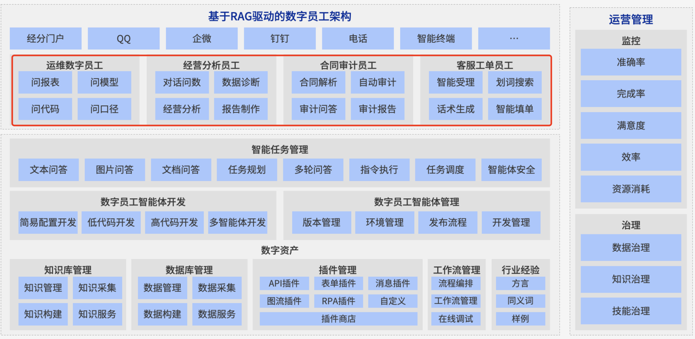

1、混合知识构建：

**将元数据标准转化为领域知识标准，以提升知识结构化的程度，使得知识切分更加准确**。同时优化自动化知识切分框架，对难点问题进行优化，例如 **自动提取概念实体，自动发现新词、同义词，自动进行语义纠错、语义消歧和补全，自动重复知识块检测**，使知识库构建效率和准确率大大提升

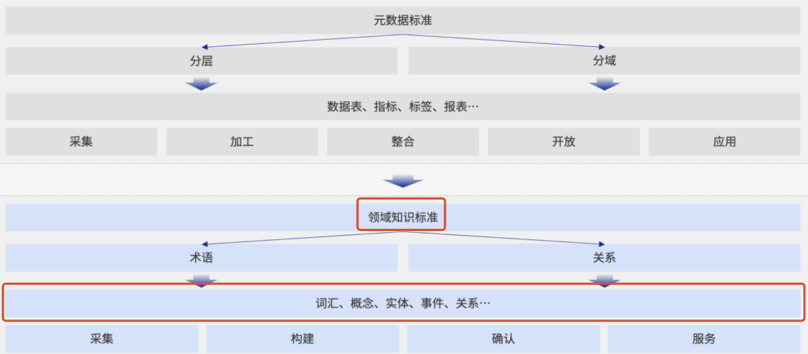

2、智能客户行业方言多，一题多问导致幻觉问题：

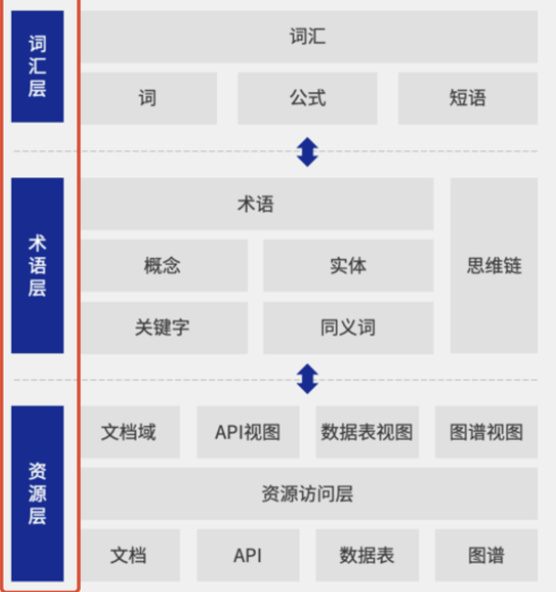

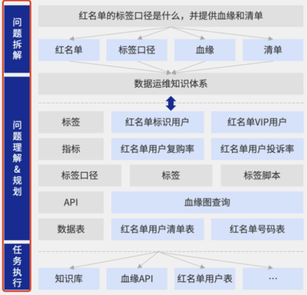

3、BI应用过程中，指标问数识别率低、准确率：

通过各类的召回增强技术解决，包括 **图数据库增强（知识图谱）、向量库增强，搜索引擎增强、原子术语增强（细粒度语义解析）**等 ==多路RAG检索方式==提高准确度，最终达到95%以上。

4、业务价值 ==（衡量的维度可以套用到大家项目中！看下降本提效业务覆盖等是如何描述的！）==

（1）数字运维员工：累计 节约16-24人的维扩人员成本。如果按照人均10万/年成本计算，可节约160-240万元 ，并且实现即问即答以及7x24小时的精准问答服务

（2）通过覆盖5类主要经分场景， 接入300多个核心指标，服务于191名市场部等业务人员 ， 减少15%的数据统计需求和12%的报表需求量 ， 提升了13%的自助报表开发量，累计生成诊断报告5000+ ，实现一页跳转看全所有指标、所有维度的分析报告， 耗时由1小时缩短至10分钟 ，增强企业的风险管理能力和运营效率。

（3）合同自动解析、合同自动问答以及审计智能问答 揭露疑点超过150个，涉资超近亿元 ， 形成底稿20+个 ， 确认问题金额达千万元级别 ;

（4）智能审计助手 缩短现场审计周期从14天缩短至10天 ， 非现场审计时间占比达到了80%以上 ，实现 从人工审计合同到自动审计合同并且时间缩短超过50%

（5）客服工单助手提升用户服务质量， 按照8小时工作时长计算，客服工单助手日均 **多办结**396张本级工单、日均 **多处理**59张越级工单 ， 工单处理及时率稳定在85%以上

### 4.7.2 利用FastGPT构建RAG知识问答（很简单，主要是想提供一个时序图供大家参考）
构建知识库：采用【自动化数据集】为主 【手动数据集】为辅的策略。将文档中心 & 腾讯会议纪要两部分打通自动化设置数据集的流程，剩余的交付整理的 QA 文档作为手动数据集为补充。

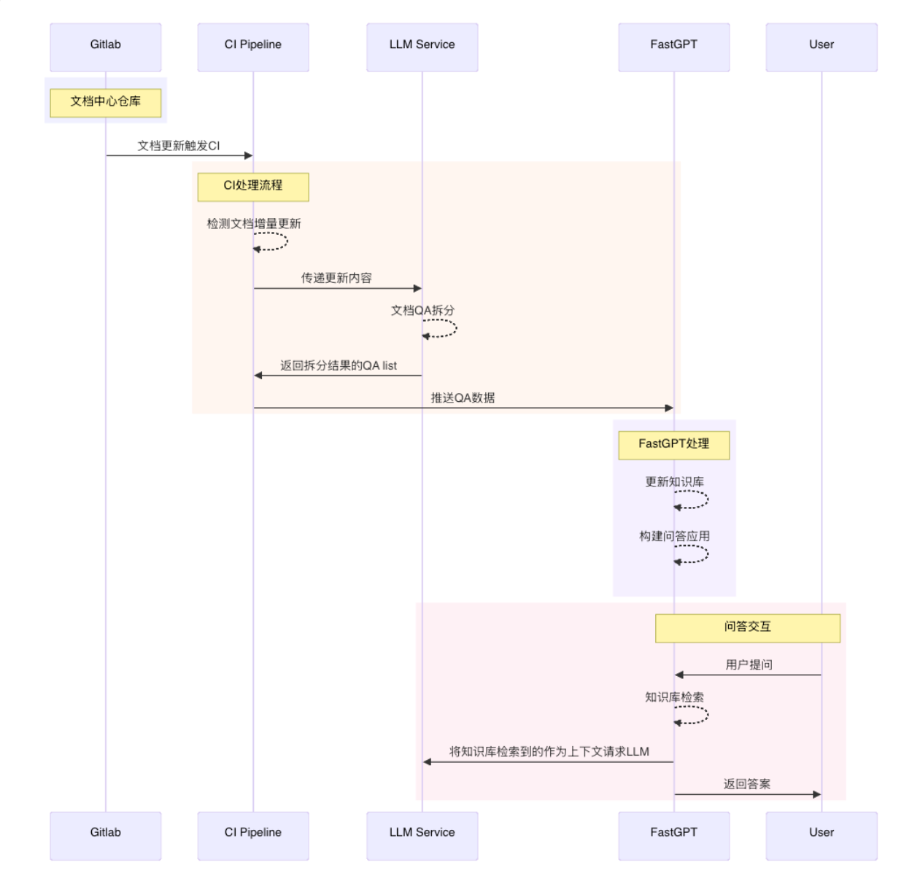

```Python
1、文档中心Gitlab仓库：文档更新会从这里触发，通过 Gitlab CI 监听文档更新

2、CI Pipeline：在文档中心的文档负责文档更新的自动化处理流程，当更新档后，它会自动跑一系列步骤，如：
编译、构建
运行测试
部署到服务器
触发后续的处理逻辑
CI Pipeline 流程：检测文档变化 → 把更新的文档内容传给 LLM Service 做 QA 分析 → 返回 QA list → 推送到 FastGPT 去更新知识库

3、LLM Service：大语言模型服务层，把文档解析成“问题–答案”对（Q&A list），方便后续检索

4、FastGPT：向量数据库和知识检索服务：
接收 LLM 生成的 Q&A list；更新知识库（把 Q&A 入库）；构建“问答应用”，也就是让后面的用户能直接用。

5、用户交互层：提供统一的问答接口
```

注，这个流程中，qa是自动化入职的，但是如果拆的不准，建议人机结合： **==高置信度：自动入库；低置信度：推到人工审核。==**所以在QA 拆分这个节点可以增加一个 质量保障环节（如下）

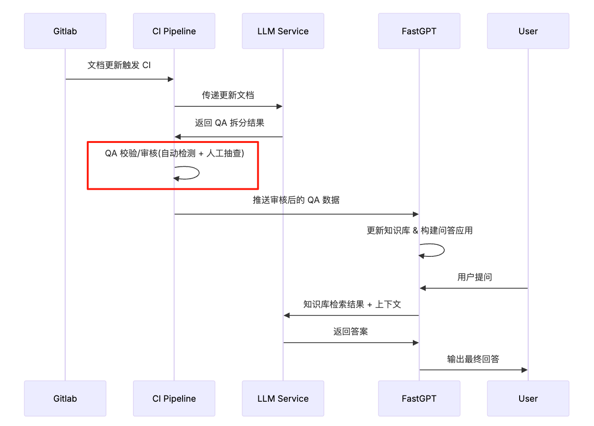

### 4.7.3 基于LLM+RAG+Agent的问答助手的实践案例
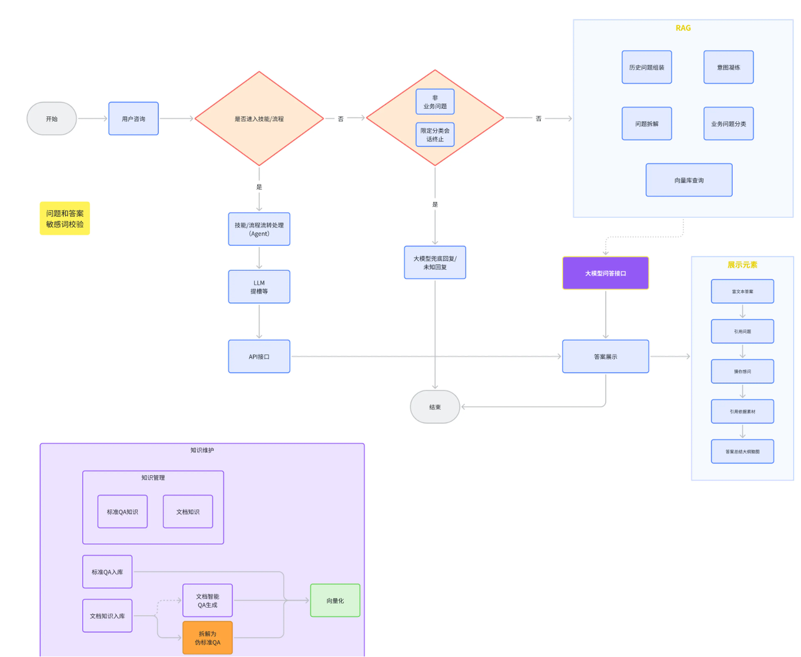

1、系统架构：

```Python
整个系统可以分为7大部分：

1、用户交互界面：用户输入问题的入口，支持文本、语音等多种方式
2、问题处理模块：通过小模型进行意图识别、分类和问题拆解
3、RAG 模块：结合检索与生成，实现知识增强问答
4、LLM 与 Agent 技术：应对复杂、多步骤或需要外部调用的场景。
5、知识库管理系统：提供标准QA与文档知识，支持向量化与智能维护；

智能文档处理：
文档导入时，可以使用自训练的小模型自动进行内容拆解和伪QA生成。基于文档的多级目录结构或上下文关系，生成类似标准QA的结构化数据。

知识维护与更新：
文档智能QA生成：管理员可以选择特定文档，使用系统生成QA对，然后进行人工审核和发布。
直接伪QA向量化：对于某些文档，可以选择直接使用伪QA方式进行向量化，无需人工干预。
支持定期批量更新和实时增量更新，确保知识库的时效性。


6、答案生成与展示模块：对结果进行加工并选择合适的呈现方式
7、专用小模型训练与应用模块：针对特定任务定制轻量高效模型
```

2、工作流程：

```Python
1、用户输入：用户在交互界面提出问题。

2、问题预处理：小模型识别问题类型、提取意图、判断是否需要拆解。

3、路径分流：
如果问题能直接匹配答案 → 走 RAG 模块 检索相关知识。
如果涉及流程、技能调用或外部系统 → 走 Agent + LLM 路径。

4、知识增强与生成：
RAG 提供相关文档或历史答案。
LLM 或 Agent 对复杂问题做推理、调用 API，生成最终解答。

5、答案整合与展示：通过统一接口处理，并选择适合的展示元素（文本、引用、图表等），最后呈现给用户。
```

## **4.8 史上最全的RAG评估指标体系**
prompt提示词模版

```JSON
已知信息：
{context}

根据上述已知信息，简洁和专业地来回答用户的问题。如果无法从中得到答案，请说 “根据已知信息无法回答该问题” 或 “没有提供足够的相关信息”，不允许在答案中添加编造成分，答案请使用中文。
问题是：{question}
```

1、 **改写模块（query改写）**

（1） **准确率(Accuracy)**：衡量改写的 Query 是否准确捕捉了原始Query 的意图

> 判断方法及计算：可以通过 ==人工评估==获得，即由人类专家比较原始 Query 和改写 Query，并评分其准确性；也可以使用 ==自动化的语义相似度评估工具==，如使用预训练的BERT模型进行语义编码，然后计算原始和改写 Query 之间的余弦相似度。
>

（2） **完整性(Completeness)**：衡量改写后的 Query 是否包含了执行搜索所需的所有关键信息

> 判断方法及计算：可以通过 ==将改写的 Query 输入到搜索系统中，并检查返回的结果是否全面覆盖了用户的信息需求==。具体的自动化方法可能包括 ==从改写的 Query 中提取实体和概念，并与原始 Query 的实体和概念进行对比，确保关键信息未丢失==
>

（3） **语法正确性(Grammatical Correctness)**：评估改写的 Query 在语法上是否正确无误。

> 判断方法及计算：自动化工具如 ==语言检测工具(Grammarly API)或自然语言处理工具(如 SpaCy 或 NLTK)==可以用来检测和评分改写 Query 的语法正确性。
>

（4） **流畅度(Fluency)**：评估改写的 Query 是否在自然语言处理上流畅

> 判断方法及计算：可以通过使用 ==统计语言模型来计算改写Query 的困惑度(Perplexity)==。Perplexity 越低，流畅度越高。此外，也可以 ==利用 GPT等语言模型生成的文本作为参考标准，通过专家评分来衡量流畅度==。
>

（5） **查询效果(Query Effectiveness)**：衡量改写的 Query 是否能够有效地提升检索系统返回相关结果的能力。

> 判断方法及计算：可以通过 ==A/B 测试，比较使用原始 Query 和改写 Query 对搜索引擎进行査询时，返回结果的相关性==。相关性可以通过 ==点击率(Click-Through Rate,CTR)==或者 ==用户满意度==调查来衡量。
>

**2、检索模块（检索）**

（1） **准确率(Accuracy)**：衡量检索到的结果中有多少是相关的

> 判断方法及计算： ==Precision=（检索到的相关文档数量）/（检索到的文档总数）==
>

-工具/模型：可以使用数据测试集（已知哪些文档是相关的）来自动计算准确率

（2） **召回率(Recall)**：衡量检索系统能够找到多少比例的所有相关文档

判断方法及计算：

> -自动化计算： ==Recall=（检索到的相关文档数量)/(数据库中所有相关文档的数量）==
>

-工具/模型：需要一个带有标记的数据集来评估召回率

（3） **F1分数(F1 Score)**：准确率和召回率的调和平均，是一个综合指标

> -自动化计算： ==F1Score=2*(Precision* Recall)/(Precision+Recall)==
>

-工具/模型：同样依赖于测试集

（4） **平均精确率(Mean Average Precision，MAP)**：衡量检索到的结果中有多少是相关的

> -自动化计算： ==(检索到的相关文档数量)/(检索到的文档总数)==
>

-工具/模型：可以使用测试集（已知哪些文档是相关的）来自动计算精确率

**3、排序模块（排序）**

（1） **平均精确率(Mean Average Precision,MAP)**：对于一系列查询，MAP 计算每个查询的平均精确率(AP)，然后计算所有查询的 AP 的平均值

-计算方法：对于每个查询，按照文档的相关性和排名计算精确率。

a）对每个査询点的精确率求平均，得到 AP

b）对所有査询的 AP 求平均，得到 MAP

（2） **正确率@K(Precision@K)**：在前K个检索结果中，有多少是相关的。

> -计算方法： ==Precision@K=(前K个文档中相关文档的数量)/K==
>

（3） **召回率@K(Recall@K)**：在前K个检索结果中，检索到的相关文档的数量占总相关文档数量的比例。

-判断方法及计算：

> ==Recall@K=(前K个文档中相关文档的数量)/(数据库中所有相关文档的数量)==
>

（4） **平均倒数排名(Mean Reciprocal Rank,MRR)：**在一组查询中，每个查询的第一个相关文档的排名倒数的平均值。

-计算方法:

a）对于每个查询，找到第一个相关文档的排名。

b）计算该排名的倒数。

c）对所有查询的倒数求平均，得到MRR

（5） **NDCG(Normalized Cumulative Gain)：**考虑到文档的相关性和它们在排名中的位置，NDCG是一个衡量排名质量的指标。

-计算方法：

> ==Precision@K=(前K个文档中相关文档的数量) / K==
>

（6） **排名损失(Ranking Loss)：**在多标签排序问题中，衡量模型预测的排名与真实排名之间的平均配对损失。

-判断方法及计算:

a）对于每对文档，如果相关文档的排名低于不相关文档的排名则计数

b）计算所有不正确配对的比例

（7） **错误发现率(Error Discovery Rate,EDR)：**在某个截断点K时，错误排名的文档数量与前K个文档总数的比例。

-计算方法:

> ==EDR@K=(前K个文档中错误排名的数量)/K==
>

> ==这些指标可以使用自动化的信息检索评估工具或自定义脚本来计算，通常需要一个带有标记的测试集来确定哪些文档是相关的。在实际应用中，根据业务需求和特定场景选择最合适的指标。例如，如果用户更关心顶部的搜索结果，那么 Precision@K 和NDCG 可能是更合适的指标。如果用户期望系统能检索到所有相关文档，那么 MAP 和 Recall@K 可能更为重要。==
>

**4、生成模块（生成）**

（1） **BLEU(双语评估替补)**：比较机器生成的文本与一个或多个参考文本之间的重叠度，通常用于评估机器翻译质量。

-计算方法：

a）从机器翻译的文本中提取 n-grams，并计算这些 n-grams 与参考翻译中 n-grams 的匹配度。对各个 n-gram 计算精确度，并计算这些精确度的加权平均值。

b）为避免短句偏好问题，引入长度惩罚因子。

（2） **ROUGE(召回率取向摘要评估)**：用于评估自动文本摘要或机器翻译的质量通过衡量生成的摘要或翻译与一组参考摘要之间的重叠度。

-计算方法：

a）ROUGE-N：计算 n-grams 的召回率，即参考摘要中出现的n-grams 在生成摘要中的频率

b）ROUGE-L：基于最长公共子序列(LCS)，衡量生成文本与参考文本之间的序列相似度

c）ROUGE-S：基于跳跃的二元组(skip-bigram)来计算相似性

（3） **METEOR(度量评估翻译编辑率)**：考虑了同义词和句法结构，是对 BLEU 的改进，更能反映人类翻译质量评价。

-计算方法：

a）对齐生成文本和参考文本中的单词，考虑同义词和词形变化计算对齐单词的精确度和召回率，并计算它们的调和平均值

b）根据对齐的单词顺序，引入惩罚因子来计算最终分数

（4） **Perplexity(困惑度)：**困惑度是评估语言模型性能的一个指标，衡量模型预测样本的能力。

-计算方法：

a）使用语言模型计算测试集中每个词的条件概率

b）计算整个测试集的概率的对数似然

c）对这个对数似然取负值，然后求平均，并指数化

（5） **自动化评估与人工评估：**自动生成的文本通常还需要通过人工评估来确保其自然度和适用性，尤其是在自动化评估指标不能涵盖的情感表达、幽默感、文化相关性等方面。

-评估方法：

请专家或普通用户对生成文本的流畅性、一致性、相关性等方面进行打分。进行盲测，比较生成文本当我们讨论生成模块的优化时，我们可能指的是提高自然语言生成系统(如文本生成器、对话系统或机器翻译系统)产生文本的质量。

（6） **自动文本质量评价指标：**近年出现了一些尝试自动评估文本质量的指标，如 BERTScore、BLEURT 等。

-评估方法：

a）BERTScore：利用预训练的 BERT模型的内部表示来计算生成文本与参考文本之间的相似度。

b）BLEURT：Google 研发的 BLEURT 是一个学习型的评估指标，它在预训练的语言模型基础上进一步训练以评估生成文本的质量

## **4.9 利用Agent 优化 RAG**
**1、为什么需要 利用 Agent 优化 RAG?**

简单的单向 RAG 应用很难满足企业级应用的要求，落地的指标结果不达预期，目前正在尝试借助 Al Agent 的思想让 RAG 应用更加聪明与智能。

**2、利用 Agent 优化 RAG 有哪些方法?**

> （1） ==将复杂问题拆分成多个步骤或者小问题==，并借 ==助不同的 RAG管道==来完成
>

> （2）在多知识源的 RAG 应用中，能够 **==回答跨越多知识源、多 RAG管道的问题==**（比如比较两个文档中知识的差异）
>

> （3）将 ==知识密集型任务的 RAG 应用与其他类型的应用进行集成，以完成更加复杂的流程==，比如涉及数据操作的任务看这样一个 Agentic RAG 的应用架构
>

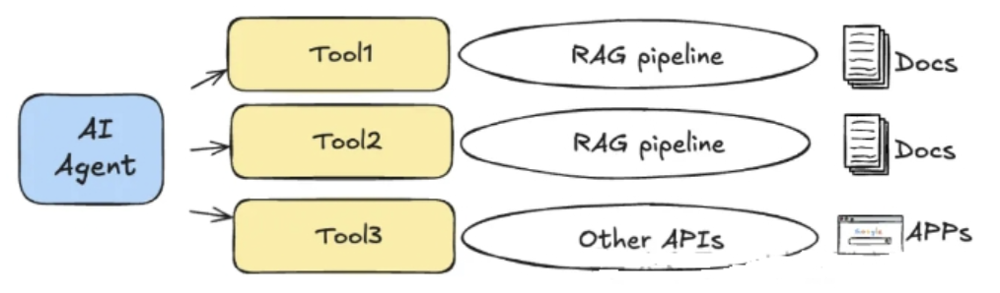

这种架构中，传统的 RAG应用(RAG pipeline)退化成一个 **Agent 可以使用的 Tool**，Agent 借助于 LLM 推理完成任务的步骤使用的工具以及输入参数，并调用必要的工具来最终完成任务。

比如，在完成一个数据比对任务时，Agent可能会借助 LLM 推理，决定首先调用第一个 RAG 应用获得数据，再调用另一个 RAG 应用获得数据，最后将两部分数据输入 LLM 进行比对获得答案。

## **4.10 RAG优化策略**
文档检索作为 RAG 核心工作，其效果对于下游工作至关重要。常用的方式直接用用户的问题进行文档召回， **但是用户的问题是十分口语化的，描述也模糊，会影响向量召回的质量，进而影响模型回答效果**。

### 【RAG失败的原因】
一般来说，RAG 失败的原因主要集中在3方面：

**==检索失败==**—— **没找到**正确的信息，或者 **找到了但不相关**。

**==生成失败==**—— **检索的内容没被合理利用**，AI 仍然生成了错误或无关的回答。

**==系统级失败==**—— 由于配置、数据更新或架构问题，整个系统 **表现不稳定**。

### 4.10.1 RAG 检索模块如何优化?
一个靠谱的检索系统是 RAG 的基石，决定模型能否获取准确、相关、符合上下文的信息。检索常见问题如下：

1、 **查询-文档不匹配**

当系统选择不合适的数据时就会发生不匹配，从而导致不相关或不完整的结果。需要用到 **查询扩展、意图识别和消除歧义**等技术可以显著提高检索性能。

**（1）使用意图识别模块定义意图，去除无关信息，优化RAG检索模块：**

如果你的业务数据比较小且垂直，这个模块还可以做成一个拒识模块，可以直接用大模型+prompt方式，也可以用一个浅层的分类模型，主要目的是对用户 query 进行快速分类，把明显不是属于该领域的数据先过滤掉。 **去除无关信息可以明显提升检索准确率**

（2） **使用“多路召回源”优化 RAG 检索模块：**

将字面相似的传统搜索算法与向量相似性检索相结合，实现混合搜索；可以加权融合分数、取各自 topk 检索后并集或RRF+rerank（见3）

优点：值得尝试的低成本高收益方案

```JSON
可以增加字面召回，如 es 里的 bm25，浅层语义召回 x2vec，深度语义召回 DSSM 等，QQ 匹配、QA 匹配等等。
有些专有领域还可以结合知识图谱，graph embedding 召回，还有专有名词、实体词召回等等。召回源越丰富，真实答案被漏掉的可能性也相应就越小了。
```

（3） **上下文理解和个性化：**根据用户历史记录、偏好或会话上下文定制查询，可提高结果的相关性。

**如：原始查询：**“附近最好的餐厅？”； **增强查询：**“5 英里范围内最好的素食餐厅，考虑到我过去对意大利菜的偏好。”

**影响：**过滤掉不相关的结果，并优先考虑个性化推荐，从而改善用户体验。

---

**2、搜索/检索算法的缺点**

关键词依赖、语义搜索差距、受欢迎程度偏差、糟糕的同义词处理会降低检索准确性。这些问题会导致不相关的数据检索、幻觉和事实不一致。增强 RAG 性能需要混合检索、查询重写和集成方法等解决方案，提高相关性和上下文

缺点：

（1） **过度依赖关键词匹配**

传统的检索模型（如 BM25）依赖于精确的关键词匹配，这使其在处理结构化数据方面非常有效，但在处理同义词或相关概念方面则较弱。这种局限性可能会导致遗漏关键信息，从而降低响应准确性

（2） **语义搜索的局限性**

虽然向量搜索和基于 Transformer 的嵌入改进了语义理解，但它们可能会误解意图，尤其是在专业领域或模糊查询中。检索语义相似但上下文不正确的数据可能会导致误导性响应

（3） **检索中的流行度偏差**

许多系统偏向于频繁访问或排名靠前的文档，并假设相关性更高。这种偏差可能会掩盖不太受欢迎但至关重要的来源，从而限制了多样性和深度，尤其是在小众领域或新兴研究领域

（4） **无法处理同义词和相关概念**

基于关键词和语义的检索通常难以处理同义词、释义和相关术语。例如，搜索“AI 伦理”可能会忽略有关“负责任的 AI”或“算法公平性”的内容，导致不完整或不准确的响应

**提高检索准确率的解决方案：**

（1） **查询重写：**通过扩展同义词、改写意图和添加上下文线索来增强查询，可以提高检索效率。

（2） **混合检索：**将 BM25（基于关键词的检索）与向量搜索（语义检索）相结合，可以平衡精确度和上下文理解。——见4.10.1.2.1

（3） **集成检索方法：**并行使用多种检索技术，例如词汇搜索、密集检索和重排序模型，这些方法可以提高覆盖率、相关性和鲁棒性。

（1）查询重写：业务中常用的优化思路，主要 **围绕这4个方向**：

（1）把问题 **改写**成多个

（2）把问题 **总结**

（3）把问题 **分解**

（4）把问题 **通过大模型生成答案再检索**

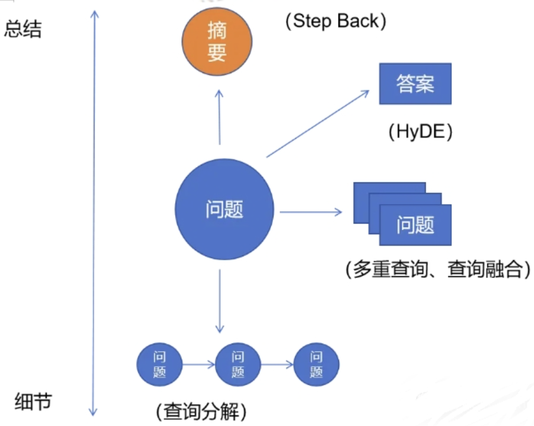

#### ==4.10.1.2.1==**==检索的3种方式==**
目前常用的知识检索方式主要包括 **向量检索（也叫相似度检索）**、 **关键词检索**以及 **混合检索**

**（1）向量检索：**

RAG 检索环节中的主流方法是向量检索，即语义相关度匹配的方式。技术原理是通过将外部知识库的文档先拆分为语义完整的段落或句子，并将其转换（Embedding）为计算机能够理解的一串数字表达（多维向量），同时对用户问题进行同样的转换操作。计算机能够发现用户问题与句子之间细微的语义相关性，比如 “猫追逐老鼠” 和 “小猫捕猎老鼠” 的语义相关度会高于 “猫追逐老鼠” 和 “我喜欢吃火腿” 之间的相关度。在将相关度最高的文本内容查找到后，RAG 系统会将其作为用户问题的上下文一起提供给大模型，帮助大模型回答问题。

优势：

（1） **相近语义理解**（如老鼠/捕鼠器/奶酪，谷歌/必应/搜索引擎）

（2） **多语言理解（跨语言理解**，如输入中文匹配英文）

（3） **多模态理解**（支持文本、图像、音视频等的相似匹配）

（4） **容错性（**处理拼写错误、模糊的描述）

效果不佳：

（1）搜索一个人或物体的名字（例如，伊隆·马斯克，iPhone 15）

（2）搜索缩写词或短语（例如，RAG，RLHF）

（3）搜索 ID（例如，gpt-3.5-turbo，titan-xlarge-v1.01）

【dify】

**TopK： 用于筛选与用户问题相似度最高的文本片段**。系统同时会根据选用模型上下文窗口大小动态调整片段数量。系统默认值为 3。

**Score 阈值： 用于设置文本片段筛选的相似度阈值，**即：只召回超过设置分数的文本片段。系统默认关闭该设置，即不会对召回的文本片段相似值过滤。打开后默认值为 0.5。

**Rerank 模型：**可以在“模型供应商”页面配置 Rerank 模型之后，在检索设置中打开“Rerank 模型”，系统会在语义检索后对已召回的文档结果再一次进行语义重排序，优化排序结果。设置 Rerank 模型后，TopK 和 Score 阈值设置仅在 Rerank 步骤生效。

基于llama-index FAISS IVF实现：

```Python
%pip install faiss-cpu llama-index-vector-stores-faiss
```

核心流程：

```Python
# 导入FAISS相关模块
import faiss
from llama_index.vector_stores.faiss import FaissVectorStore  # 修正类名大小写
from llama_index.core import StorageContext, VectorStoreIndex

# 创建FAISS索引 (使用FlatL2替代IVF以简化测试)
d = 1536  # 与text-embedding-3-small维度匹配
faiss_index = faiss.IndexFlatL2(d)  # 改用L2距离（更通用）

# 创建向量存储
vector_store = FaissVectorStore(faiss_index=faiss_index)
storage_context = StorageContext.from_defaults(vector_store=vector_store)

# 构建索引
faiss_vector_index = VectorStoreIndex.from_documents(
    documents, storage_context=storage_context, show_progress=True
)

# 创建检索器并查询
faiss_retriever = faiss_vector_index.as_retriever(similarity_top_k=2)
faiss_retrieved_nodes = faiss_retriever.retrieve("What happened at Viaweb and Interleaf?")

# 显示结果
print("FAISS检索结果:")
for node in faiss_retrieved_nodes:
    display_source_node(node, source_length=5000)

# BM25与FAISS结果比较
print("\nBM25 vs FAISS 比较:")
print(f"BM25检索到{len(retrieved_nodes)}个节点，FAISS检索到{len(faiss_retrieved_nodes)}个节点")

# 提取相似度分数进行比较
bm25_scores = [node.score for node in retrieved_nodes]
faiss_scores = [node.score for node in faiss_retrieved_nodes]
print(f"BM25平均相似度: {sum(bm25_scores)/len(bm25_scores):.4f}")
print(f"FAISS平均相似度: {sum(faiss_scores)/len(faiss_scores):.4f}")
```

**（2）关键词检索：**

使用向量检索/相似度检索所存在的缺点确都是传统关键词搜索的优势所在，传统关键词搜索擅长：精确匹配（如产品名称、姓名、产品编号）；少量字符的匹配（通过少量字符进行向量检索时效果非常不好，但很多用户恰恰习惯只输入几个关键词）；倾向低频词汇的匹配（低频词汇往往承载了语言中的重要意义，比如“你想跟我去喝咖啡吗？”这句话中的分词，“喝”“咖啡”会比“你”“想”“吗”在句子中承载更重要的含义）如 **稀疏检索**（如BM25）

缺点：

（1） **无法理解词语之间的语义关系。**例如当用户搜索“狗”时，系统可能无法识别“犬”与“狗”是同义词，导致相关文档被遗漏。这种语义上的缺失，使得关键词检索在处理同义词或近义词时表现不佳。

（2）多义词的处理。例如“苹果”既可以指水果，也可以指科技公司。如果用户搜索“苹果”，系统无法确定用户的具体意图，从而可能返回不相关的结果

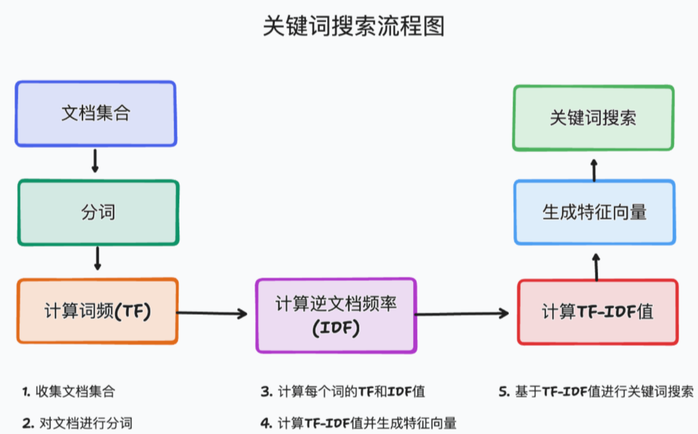

基于 *LlamaIndex *实现

```Python
%pip install llama-index
%pip install llama-index-retrievers-bm25
%pip install matplotlib
```

核心流程：导入必要的库和模块-》配置LLM/embedding模型-》加载文档数据-》文档分块处理（chunk_size设置为512）：

```Python
import os
from llama_index.core import Settings
from llama_index.llms.openai import OpenAI
from llama_index.embeddings.openai import OpenAIEmbedding
Settings.llm = OpenAI(model="gpt-4.1-nano-2025-04-14")
Settings.embed_model = OpenAIEmbedding(model_name="text-embedding-3-small")

# 加载数据
from llama_index.core import SimpleDirectoryReader # load documents
documents = SimpleDirectoryReader("./09/").load_data()

from llama_index.core.node_parser import SentenceSplitter # initialize node parser
splitter = SentenceSplitter(chunk_size=512)
nodes = splitter.get_nodes_from_documents(documents)
```

进行BM25检索：

关键参数：

**关键参数说明 nodes=nodes**

使用之前分割好的文档节点作为检索库

这些节点包含了要搜索的文本内容

**similarity_top_k=2**

设置返回最相关的前2个文档片段可以根据需要调整这个数值

**stemmer=Stemmer.Stemmer("english")**

词干提取 ：将词汇还原到词根形式

例如："running", "runs", "ran" → "run"

提高匹配的准确性，避免词形变化影响检索

**language="english"**

停用词过滤 ：移除常见的无意义词汇

如："the", "is", "and", "or" 等

提高检索的精确度

```Python
from llama_index.retrievers.bm25 import BM25Retriever
import Stemmer

# We can pass in the index, docstore, or list of nodes to create the retriever
bm25_retriever = BM25Retriever.from_defaults(
    nodes=nodes,
    similarity_top_k=2,
    # Optional: We can pass in the stemmer and set the language for stopwords
    # This is important for removing stopwords and stemming the query + text
    # The default is english for both
    stemmer=Stemmer.Stemmer("english"),
    language="english",
)
```

**（3）混合检索（Hybrid Retrieval）（打破单一检索的束缚）：**

主要结合了向量检索和关键词检索两者的优点，同时也弥补了两方的缺点。对于大多数文本搜索的情景， **==首要的是确保潜在最相关结果能够出现在候选结果中。在混合检索中，你需要在数据库中提前建立向量索引和关键词索引，在用户问题输入时，分别通过两种检索器在文档中检索出最相关的文本。==**

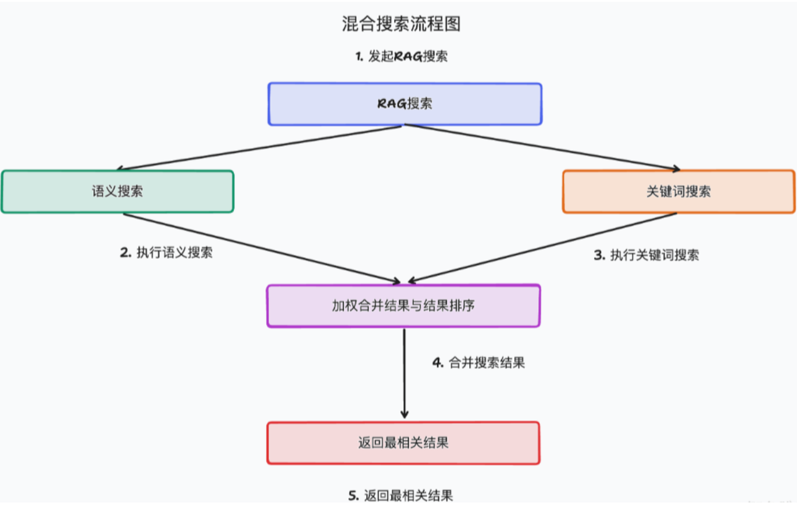

#### **==4.10.1.2.2==** **选检索方案，其实就看三件事**
**==公式：R = f(数据量、延迟要求、预算)==**

```Python
数据量有多大
响应速度要多快
能花多少钱
```

| **数据量级** | **怎么选比较划算** |
| --- | --- |
| 不到 10 万条 | 别搞太复杂，BM25 + 拼写纠错就够了，简单、便宜、上线快 |
| 10 万 ~ 100 万条 | 如果内存够大，用 知识图谱；内存紧张就选 FAISS IVF ，省资源。 |
| 100 万 ~ 1000 万条 | 选 FAISS IVF4096 ，用 GPU 训练半小时左右，速度和准确度都不错。 |
| 上千万条 | 上 Milvus 分布式，再加分层索引（一级 Faiss，二级知图谱），大数据也能稳跑。 |

3、 **使用query改写或扩展优化 RAG 检索模块：**

通过生成多个用户查询并重新排序结果

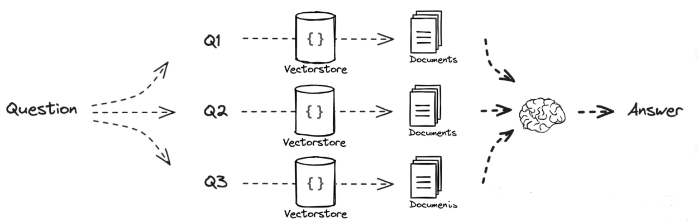

（1）思路：

a）LLM优化用户query，改写，尝试从多个角度补充原来的问题，变成多个问题尽量全面的从向量数据库中查找结果

b）丰富搜索信息后，都分别喂给LLM

c）获取到回复后，使用 **“倒数排序融合（Reciprocal rank fusion RRF）”**得到统一得分，重排取topk检索结果

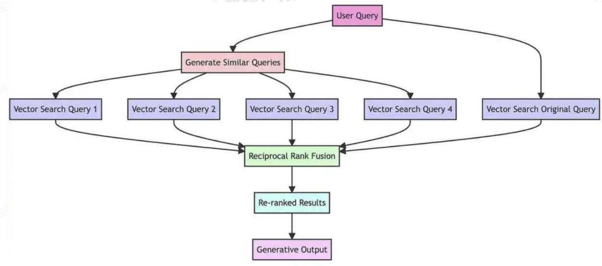

（2）工作流程：利用LLM+提示词工程生成多个查询，不仅与原始查询相似，同时提供不同视角和角度

a）调用LLM（如图中chatgpt）：system message指导模型充当一个ai助手

b）自然语言查询：LLM基于用户原始查询生成多个查询

c）多样性和覆盖范围：如原始查询问气候变化的影响，生成的查询包括气候变化的经济后果、气候变化与公共健康等角度

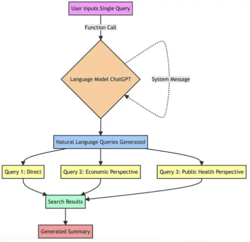

（3） **倒数排序融合RRF：**

**将多个搜索结果列表的排名结合起来产生单一统一排名**的技术，通过结合不同查询的排名， **增加了最相关文档出现在最终列表顶部的机会**，很适合具有不同规模或分数分布的查询结果

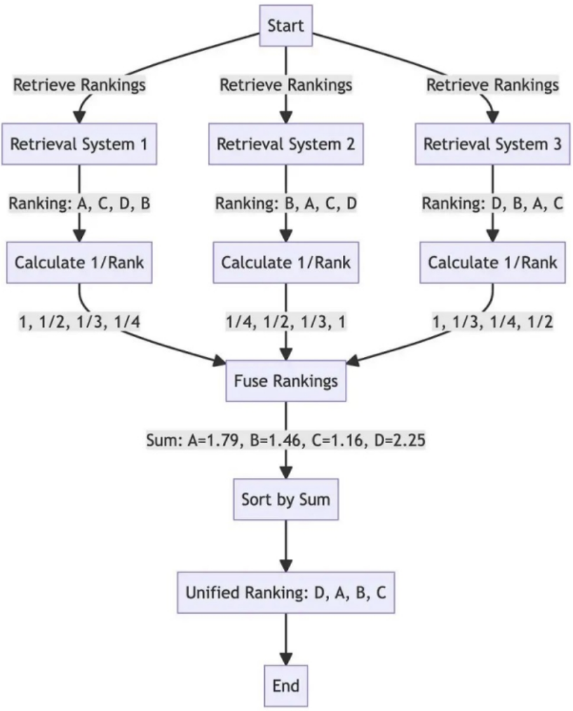

1、函数reciprocal_rank_fusion接收一个搜索结果的字典，其中每个键是一个查询，相应的值是更具该查询的相关性排名的文档ID列表

2、RRF基于其在不同列表中的排名为每个文档计算一个新分数，并根据这些分数排序以创建最终的重新排名列表

3、计算完融合分数后，函数按照这些分数的降序对文档进行排序，已获得最终的重新排名列表，然后返回该列表

4、 **使用重排序 rerank 优化 RAG 检索模块：**

即采用推荐/搜索的做法，把检索过程做成漏斗型。例如先从大量文本中得到 100个召回结果，然后初排得到 20个结果，接着 rerank 重排得到8个结果。最后把这8个结果送给大模型，结合提示归纳生成最终的结果。这一过程主要是对齐不同召回源的评分标准， **==通过对多个召回结果进行二次排序，提高其与用户查询语义的匹配度，从而优化排序结果。==**

4. 1 **为什么要使用重排序？**

混合检索结合不同检索技术的优势以获得更好的召回结果，但在不同检索模式下的查询结果 **需要进行合并和归一化（将数据转换为统一的标准范围或分布，以便更好地进行比较、分析和处理）**，然后再一起提供给大模型。所以需要引入评分系统：重排序模型（Rerank Model）：计算候选文档列表与用户问题的语义匹配度，根据语义匹配度重新进行排序，从而改进语义排序的结果。其原理是计算用户问题与给定的每个候选文档之间的相关性分数，并返回按相关性从高到低排序的文档列表。

【混合检索+重排序】

重排序一般都放在搜索流程的最后阶段，非常适合用于合并和排序来自不同检索系统的结果。而且重排序并不是只适用于不同检索系统的结果合并，即使是在单一检索模式下，引入重排序步骤也能有效帮助改进文档的召回效果，比如可以在关键词检索之后加入语义重排序。

**重排序是一种用于增强现有检索系统的辅助工具。它最大的优势是不仅提供了一种简单且低复杂度的方法来改善搜索结果，允许用户将语义相关性纳入现有的搜索系统中，而且无需进行重大的基础设施修改。**

5、 **使用 引用追问机制 优化 RAG 检索模块**

==在 Promot 中加入”如果无法从背景知识回答用户的问题，则根据背景知识内容，对用户进行追问，问题限制在3个以内”。==这个机制没有技术含量，主要靠大模型的能力。但是可以大大改善了用户体验，用户在多轮引导中逐步明确了自己的问题，从而能够得到合适的答案。

6、 **使用 关键信息抽取 优化 RAG 检索模块**

==利用 NLP 的句法分析、NER（命名实体识别）、依存分析（Dependency Parsing）、语义角色标注（识别句子中的动词及其相关的语义角色，例如主体、目标、发起人）、关键词提取等抽取关键信息==，将抽取到的关键信息加入至前面层次检索的顶部。先检索关键信息，然后在检索对应关键信息下的内容。

7、 **使用 更小的 text chunk 配合更大的topk** **优化 RAG 检索模块**

（1）为什么？

a）一些开源的 embedding 模型效果一般，尤其是当 textchunk 很大的时候，强行变成一个简单的 vector 是很难准确表示的，开源的模型在效果上不如 openai Embeddings

b）多语言问题，paper 的内容是英文的，用户的 query 和生成的内容都是中文的，这里有语言之间的对齐问题，尤其是可以用中文的 query embedding 来从英文的 text chunkingembedding 中找到更加相似的 top-k是个具有挑战的问题

c）为保证检索的结果尽量精准，通常会尝试尽量小的文本块(chunk)，以保持较高的检索质量；但另一方面这又牺牲了更多的语义与上下文的丰富性。

（2）优化思路：

**方法一、扩充句子窗口：**

即在通过相似度检索到最高分的 Chunk 后，将内容发送给 LLM 之前，给这个 Chunk 前后添加一定数量的Chunk，这个数量取决于你设定的窗口大小。因为尽管你的问题最相似的可能只是某个中间块，但这个块提供的信息很可能是不完整的。

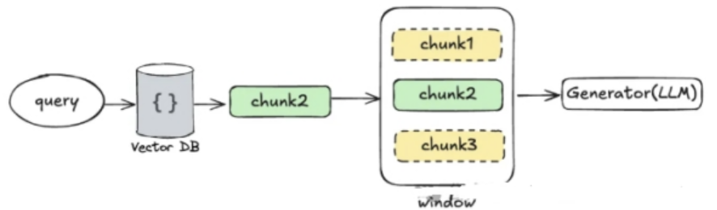

**方法二、自动合并检索：**

每个文本块被指定一个“父”快，甚至可以构建一个多层级、树状的块结构，每个级别可以有不同的块大小

**检索时，首先在叶子“块”这个层级上进行检索，然后在检索出的块基础上，采用一定的算法判断是否需要合并到具有更丰富语义的“父”块，并用于生成**（父子检索器）

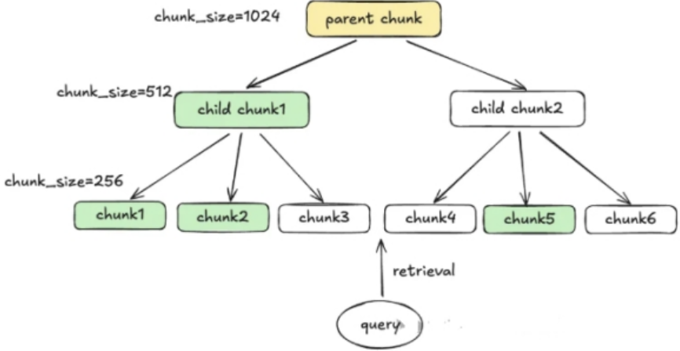

**8、使用 查询分解优化 RAG 检索模块：**

查询分解是通过将问题分解为子问题来改善问答效果的策略，分2条实现路径：

（1） **序列求解**：将上一个子问题的答案与当前问题一并扔给 LLM 生成答案，再把当前生成答案与下一个子问题一起给 LLM 生成答案，直到最后一个子问题生成最终答案

（2） **并行独立回答问题，然后将多路答案合并为最终答案**。

**9、使用 step Back 优化 RAG 检索模块**

Step-back prompting：把问题变得更抽象。为什么要让问题变得更抽象？抽象的目的不是为了让你更迷糊，而是对问题进行了总结，提供了更大范围的检索

**10、使用 递归检索 优化 RAG 检索模块**

递归检索相较于普通 RAG ，可以解决后者因文档切片过大而导致检索信息不准确的问题：

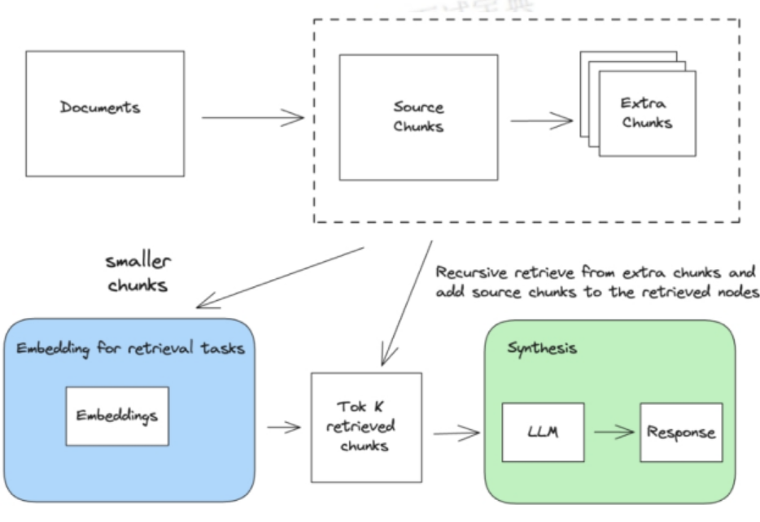

递归检索在原始文档节点基础上，扩展了更多粒度更小的文档节点： **检索文档时如果检索到扩展节点，会递归检索到其原始节点然后再将原始节点做为检索结果提交给 LLM**。

### 4.10.2 RAG 检索模块如何使用大模型辅助召回？（6种）
**1、大模型辅助召回策略1：Hyde**

查询重写（也称作查询转换或查询分析等）已经是 RAG 工作流的常见环节。当用户的查询不够明确或具体时，通过查询重写来分解或者细化问题，以提升检索与生成的准确性。因此， **查询转换是一种****==“检索前”的处理步骤==**。

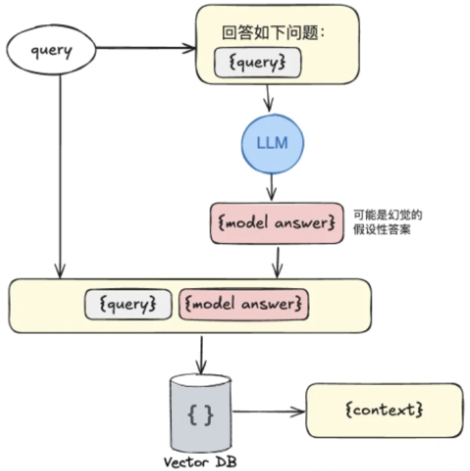

（1） **用 LLM 根据用户 query 生成k 个“假答案”**。

（大模型生成答案采用 sample 模式，保证生成的k个答案不一样。此时的回答内容很可能存在知识性错误，因为如果能回答正确，那就不需要召回补充额外知识了）

（2）利用向量化模型， **将生成的k个假答案和用户的 query 变成向量，检索相似的上下文内容**

（3）将 k+1个向量取平均：其中 dk为第k个生成的答案，q为用户问题，f为向量化操作

（4）利用融合向量v从文档库中召回答案。融合向量中既有用户问题，也有想要答案的模式信息，可以增强召回效果

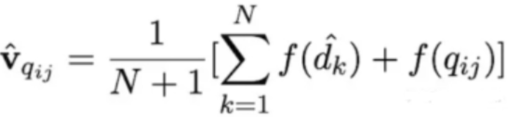

**2、大模型辅助召回策略2：Flare**

对于大模型外挂知识库，通常做法是根据用户 query 一次召回文档片段，让模型生成答案。只进行一次文档召回在长文本生成的场景下效果往往不好，生成的文本过长，更有可能扩展出和 query相关性较弱的内容，如果模型没有这部分知识，容易产生模型幻觉问题。 **一种解决思路是随着文本生成，多次从向量库中召回内容**

（1）FLARE 方法的召回策略：

a） **每生成固定的 n个 token 就召回一次**

b） **每生成一个完整的句子就召回一次**

c） **用户 query一步步分解为子问题，需要解答当前子问题时候就召回一次**

已有的多次召回方案比较被动，召回文档的目的是为了得到模型不知道的信息，a、b 策略并不能保证不需要召回的时候不召回，需要召回的时候触发召回。c方案需要设计特定的 prompt 工程，限制了通用性

（2） **策略1：通过设计 prompt 以及提供示例的方式，让模型知道当遇到需要查询知识的时候，提出问题，并按照格式输出：**

a）提出问题的格式为[Search("模型自动提出的问题”)](称其为主动召回标识)。利用模型生成的问题召回答案。

b）召回出答案后，将答案放到用户 query 前边，去掉主动召回标识之后，继续生成。

c）当下一次生成主动召回标识之后，将上一次召回出来的内容从prompt 中去掉。

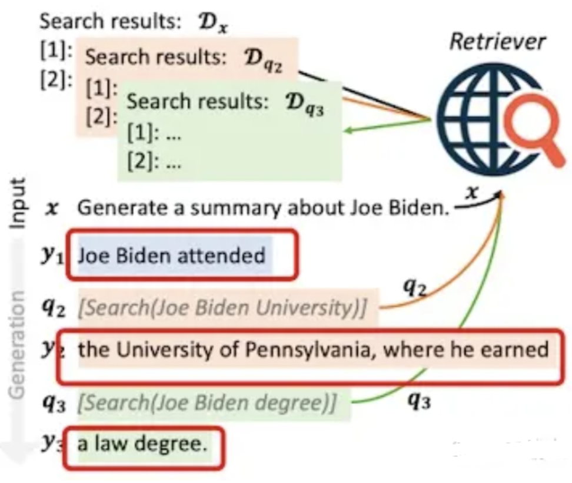

（3）策略2：基于假设：模型生成的词对应该的概率能够表现生成内容的置信度

a）根据 **用户的 query，进行第一次召回，让模型生成答案**

b）之后每生成 64 个 token， **用工具包从 64 个 token 里边找到第一个完整句子，当作“假答案”**，扔掉多余的 token。(和策略1的思想一样,利用 LLM 生成符合回答模式的“假答案”）

c）如果“假答案”里有任意一个 token 对应的概率，低于某一阈值，那么就利用这个句子进行向量召回。触发召回的“假答案”很可能包含事实性错误，降低召回准确率。设计了两种方法解决这个问题。方法 1：将“假答案”中生成概率低于某一阈值的 token扔掉(低概率的 token 很有可能存在错误信息)，然后再进行向量召回。方法 2：利用大模型能力，对“假答案”中置信度低的内容进行提问，生成一个问题，用生成的问题进行向量召回。

d） **利用召回出来的文本，重新生成新的“真答案”**，然后进行下一个句子的生成。

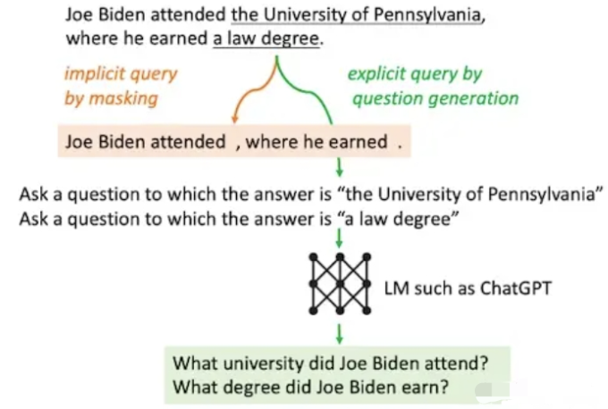

**3、大模型辅助召回策略3——基于上下文的查询细化**

通常用于在 **多次、连续、有上下文的 RAG对话**中， **根据历史对话记录与当前输入消息，改写出一个独立的、具备完整语义的问题然后做检索**。常用来消除一个连续对话场景下的问题中的指代词、歧义，并让输入问题更完整。

**4、大模型辅助召回策略4——应用分层索引检索（ApplyHierarchical Index Retrieval）**

**利用文档摘要创建多层索引，优先检索与查询最相关的摘要部分，再深入到详细文档，提高检索效率。**比如说先快速浏览一本书的目录或摘要，找到相关章节，然后再仔细阅读。这比从头到尾读整本书要快得多。

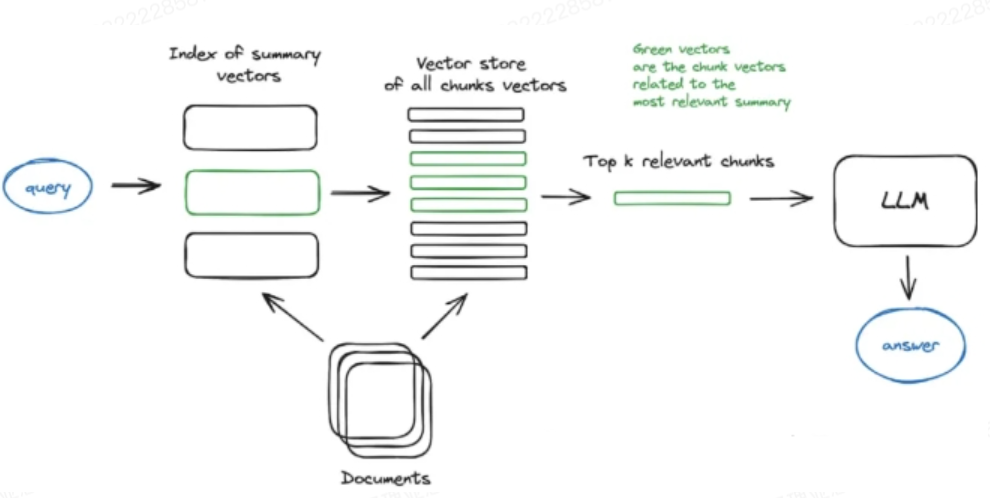

**5、大模型辅助召回策略5——改善检索对称性(Improve RetrievalSymmetry with Hypothetical Question index)**

**利用大模型将文档转换为适合 RAG 系统中使用的嵌入模型和query 的最佳格式。**

（1）比如使用 GPT-4 为每个文档生成hypothetical/possible 的问答对列表，然后使用生成的问题作为要嵌入的块进行检索。

（2）检索时，系统将检索问题及其相应的答案，并将其提供给 LLM。因此，query 的嵌入可能与生成的问题的嵌入具有更大的余弦相似度。这种相似性降低了在分块过程中丢失相关上下文的风险。

举例：

query 通常是一些简短的问题，比如“XYZ 金融机构提供的最好的旅行信用卡是什么?”然而，该 query 的相关文档块要长得多（例如，包含 XYZ 金融机构提供的所有信用卡的细分的大量段落）

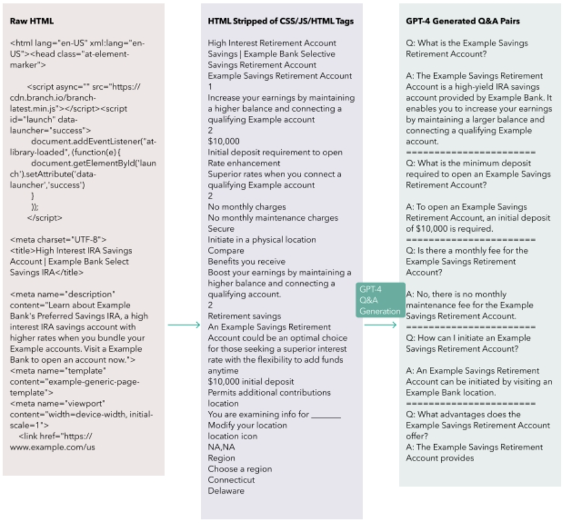

```JSON
generated_question_answer_pairs = openai.ChatCompletion.create(
    model="gpt-4",
    messages=[
        {
            "role": "system",
            "content": "Analyze the provided text or html from Example bank’s website and create questions an Example bank customer could ask a chatbot about the information in the text. You should not create a question if it does not have a useful/informative answer to it that would be helpful for a customer. For every question, please formulate answers based strictly on the information in the text. Use Q: for questions and A: for answers. Do not write any other commentary. Questions should not reference html sections or links. Create as many useful Q&A pairings as possible.",
        },
        {
            "role": "user",
            "content": "<scraped web page>"
        },
    ],
    temperature=0
)
```

**6、大模型辅助召回策略6——使用 LLM 去重信息(DeduplicateInformation in Your Data Index Using LLMs)**

通过 LLM 对嵌入空间中的数据块进行去重，将重复的信息浓缩成更少的、更有用的数据块，提高响应的质量。

根据具体情况，数据索引中的信息重复可能有助于或阻碍 RAG系统的输出。一方面，如果在生成响应的LLM 的上下文窗口中重复了回答查询所需的正确信息，则会增加LLM 做出理想响应的可能性。相反，假设重复的程度稀释了甚至完全挤出了 LLM 上下文窗口中的所需信息。在这种情况下，用户可能会收到一个没有答案的答案，或者更糟。

举例：重复数据删除前后嵌入空间中的块:

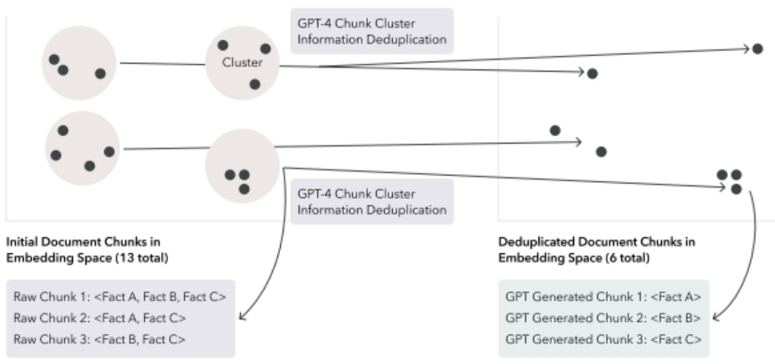

### `4.10.3 RAG 检索模块如何使用知识图谱（KG）辅助召回？`
`典型 RAG 架构中，向量数据库进行上下文增强 存在2个问题：（1）无法获取长程关联知识；（2）信息密度低（尤其当 LLM context window 较小时不友好）， ```==增强。==

**==策略：增加一路与向量库平行的 KG（知识图谱）上下文增强策略==**，具体方式如下：

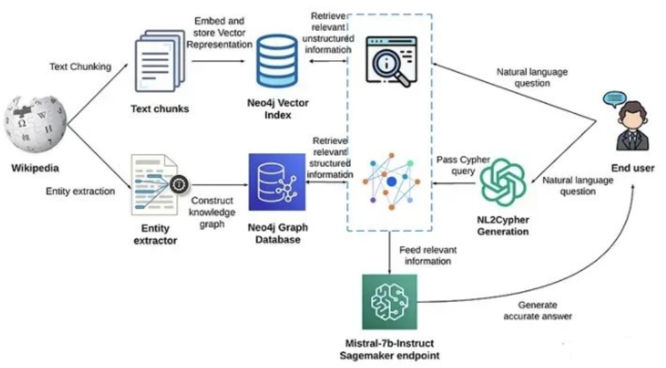

（1）对于用户 query， **利用 NL2Cypher 进行 KG增强**

（2）优化策略：常用 “图采样技术”来进行 KG上下文增强

（3）处理方式： **根据 query 抽取实体，然后把实体作为种子节点对图进行采样（必要时，可把 KG 中节点和 query 中实体先向量化，通过向量相似度设置种子节点），然后把获取的子图转换成文本片段，从而达到上下文增强的效果**

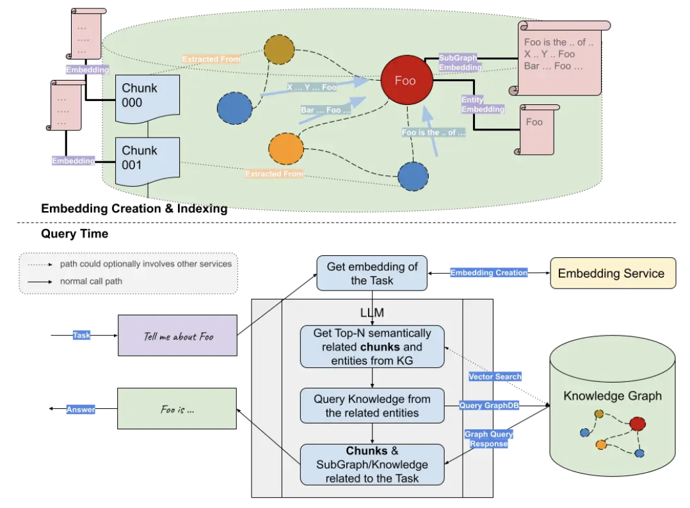

备注：

NL2Cypher 是一种自然语言处理技术，旨在将自然语言查询转换为 Cypher 查询语言，使得非专业人士也能方便地与 Neo4j 图数据库进行交互。NL2Cypher 为 Neo4j 提供了一种更直观、更人性化的查询方式，用户可以通过自然语言描述查询需求，然后将其自动转换为 Cypher 查询语句。

在知识图谱中的应用

1. **自然语言查询转换**

NL2Cypher 可以将自然语言问题转换为 Cypher 查询语句，从而从知识图谱中检索信息。例如，用户输入“查询 xx 车辆的发动机型号”，通过 NL2Cypher 技术可将其转换为可执行的 Cypher 查询语句：“match (v:vehicle)-[:has_engine]->(e:engine) where v.name='xx车辆' return e.model as engine_model”，进而获得数据库中的数据。

2. **知识图谱查询增强**

> ==NL2Cypher 可以作为 RAG（Retrieval-Augmented Generation）技术的一部分，用于从知识图谱中检索和生成更准确、更相关的答案。具体流程如下：==
>

使用 LLM（或其他）模型从问题中提取关键实体

根据这些实体检索子图，深入到一定的深度

利用获得的上下文利用 LLM 产生答案

3. **图数据库集成**NL2Cypher 可以与图数据库（如 NebulaGraph）集成，通过自然语言查询图谱，实现更智能、更个性化的信息获取体验

#### 【案例】知识图谱实现过程
知识图谱：利用“图结构”表示和建模现实世界中实体及其关系的技术方法。 ==将信息以节点（实体）和边（关系）的形式组织成一个有机的网络，从而实现对复杂知识的高效存储、查询和分析。==知识图谱的核心在于 ==通过三元组形式（实体-关系-实体）来描述事物之间的关联==，不仅能够捕捉数据的语义含义，还能便于理解和分析

1、知识图谱在RAG中的整体流程：

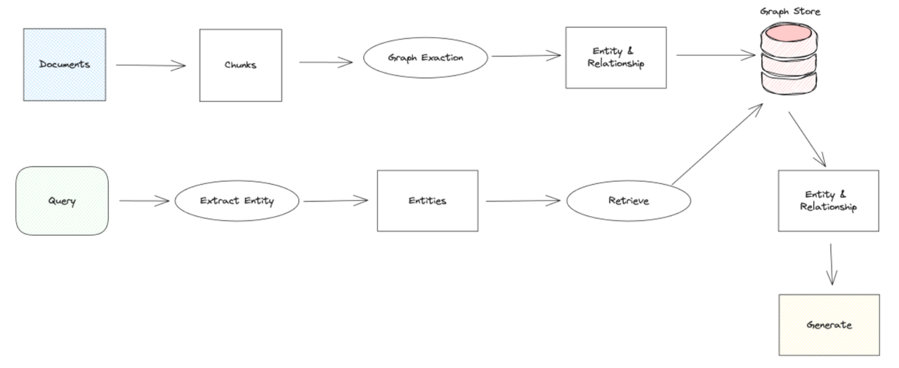

知识图谱 RAG = 文档转成“知识网络”，用户提问时在网络里检索相关节点，再交给大模型生成答案

```Python
1、文档处理（Documents → Chunks）
把原始文档（PDF、网页、Excel）进行 分块（chunking），把大段内容切成更小的片段。
目的：让后续处理更精准（小颗粒度）。

2、实体与关系抽取（Graph Extraction → Entity & Relationship）
对每个片段进行 实体识别（比如“产品经理”“AI 技术”“公司”）。
同时抽取 实体之间的关系（比如“产品经理 → 需要掌握 → AI 技术”）。
得到“实体 + 关系”的三元组。

3、存入图数据库（Graph Store）
实体和关系会被保存到图数据库（Graph Store）里。
图数据库的特点是擅长存储“网络结构”，能方便地查找一个实体相关的上下文。

4、用户提问（Query → Extract Entity）
用户提问时，系统会先进行 实体提取，识别问题里涉及的核心概念。
例如：问题是“AI 产品经理需要什么技能？”，系统会提取出“AI 产品经理”“技能”作为实体。

5、图数据库检索（Entities → Retrieve）
系统用在query中提取的实体在图数据库中检索，找到相关的 实体节点和关系网络。
例如，它可能检索出一个网络：“AI 产品经理 → 需要掌握 → 数据分析、机器学习、沟通能力”。

6、答案生成（Entity & Relationship → Generate）
把检索到的实体和关系交给大语言模型（LLM）。LLM 会基于这些结构化知识生成自然语言答案，返回给用户。
```

2、数据入库

在 知识图谱 RAG 中，除了向量化，还会对文档片段进行 **实体和关系抽取**，将结果存储到 **图数据库**中。在后续检索时，系统可以利用图结构更好地找到关联知识。

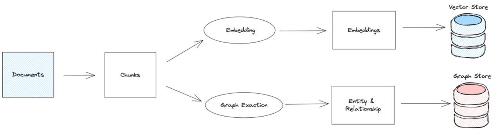

（1）实体抽取方式

过去常用的方法依赖人工规则、词典或统计模型来识别实体和关系。现在更多使用LLM，更好地理解上下文含义，实现效果更好、流程也更简化。例如在 **LlamaIndex**的 `KnowledgeGraphIndex` 中，LLM 会被提示从文本里抽取出「三元组」的形式：

```Python
(实体, 关系, 实体)
 比如：
Text: Alice is Bob’s mother.
Triplet: (Alice, is mother of, Bob)

在提示词中要求 LLM 将文档块 text 提取成实体-关系-实体这样的三元组，实体一般是名词，表示文档块中的实体，关系是动词或者介词，表示实体之间的关系，再给几个 Few Shot，让 LLM 能更好地理解实体抽取的任务
```

```JSON
DEFAULT_KG_TRIPLET_EXTRACT_TMPL = (
"Some text is provided below. Given the text, extract up to "
"{max_knowledge_triplets} "
"knowledge triplets in the form of (subject, predicate, object). Avoid stopwords.\n"
"---------------------\n"
"Example:"
"Text: Alice is Bob's mother."
"Triplets:\n(Alice, is mother of, Bob)\n"
"Text: Philz is a coffee shop founded in Berkeley in 1982.\n"
"Triplets:\n"
"(Philz, is, coffee shop)\n"
"(Philz, founded in, Berkeley)\n"
"(Philz, founded in, 1982)\n"
"---------------------\n"
"Text: {text}\n"
"Triplets:\n"
)
```

```Python
简版提示词示例：

请从下面的文本中抽取实体-关系-实体形式的三元组 (subject, predicate, object)。
要求：
- 实体一般是名词（人、地点、组织、产品等）。
- 关系通常是动词或介词，表示两个实体的联系。
- 输出格式：Triplets: (实体1, 关系, 实体2)

示例1:
Text: "Alice is Bob's mother."
Triplets: (Alice, is mother of, Bob)

示例2:
Text: "Philz Coffee was founded in Berkeley in 1982."
Triplets: (Philz Coffee, was founded in, Berkeley)
          (Philz Coffee, was founded in, 1982)

现在请处理下面的文本：
Text: "{text}"
Triplets:

##Few shots:
输入文档片段（text）：
海南金钻凤梨产自海南，富含维生素C，是夏季常见的水果。
Triplets:
(海南金钻凤梨, 产自, 海南)
(海南金钻凤梨, 富含, 维生素C)
(海南金钻凤梨, 是, 水果)
```

（2）数据存储与检索

抽取出来的实体和关系会统一保存到图数据库中。后续检索时，系统可以基于图结构进行高效搜索，也可以结合传统的向量检索，从而兼顾 **语义相关性**与 **知识结构**的优势。例如 【GraphRAG】会在检索时融合这两种方式，提升准确性与效率。

3、检索生成

对问题进行实体提取与数据入库时的实体提取方法类似（通过 LLM ），但只需要提取出问题中的实体即可，不需要提取三元组

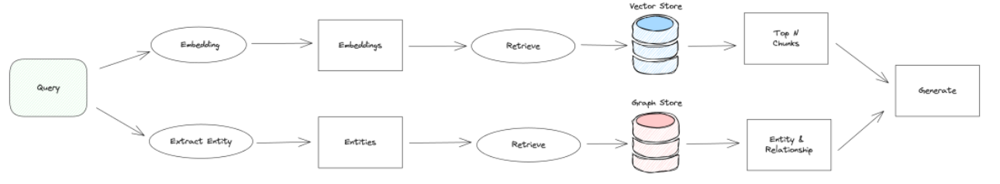

LlamaIndex 的 `KGTableRetriever` 类中提取问题关键字的提示词：

```JSON
DEFAULT_QUERY_KEYWORD_EXTRACT_TEMPLATE_TMPL = (
"A question is provided below. Given the question, extract up to {max_keywords} "
"keywords from the text. Focus on extracting the keywords that we can use "
"to best lookup answers to the question. Avoid stopwords.\n"
"---------------------\n"
"{question}\n"
"---------------------\n"
"Provide keywords in the following comma-separated format: 'KEYWORDS: <keywords>'\n"
)
```

将问题的实体提取出来后，再 **==用实体名称去图数据库中进行检索， 检索的原理就是使用图数据库的查询语句对每个实体进行检索，获取对应的三元组，==**举例：

```Python
MATCH (n {name: 'Alice'})-[r]-(m)
RETURN n, r, m

——查找图数据库中所有与实体 Alice 相关的实体和关系，这样就可以获取到 Alice 相关的所有三元组，最后将得到的数据转换为文本，作为问题的上下文，提交给 LLM 进行答案生成
```

4、LlamaIndex 知识图谱 RAG 实现

（1）安装Neo4j，通过 Docker 下载镜像并启动

```Python
docker run --name neo4j -d \
--publish=7474:7474 --publish=7687:7687 \
--volume=/your/host/path/neo4j-data/data:/data \
--env NEO4J_PLUGINS='["apoc"]' \
neo4j:5.21.0
```

服务成功启动后，打开浏览器访问 `http://localhost:7474` ，输入初始账号密码： `neo4j/neo4j` ，再设置新密码

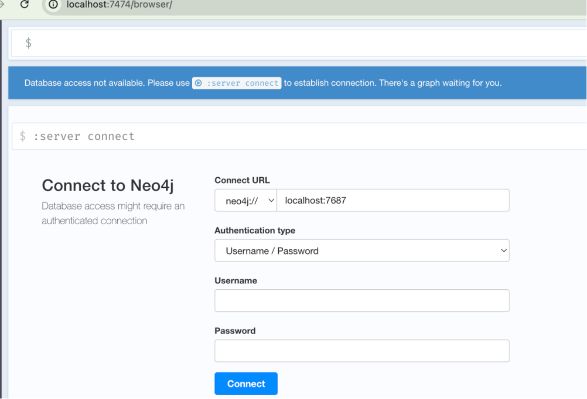

（2）在 LlamaIndex 中使用 Neo4j

使用 `Neo4jGraphStore` 创建连接 Neo4j 数据库的存储对象，传入用户名、密码、连接地址、数据库名称等参数

```Python
from llama_index.graph_stores.neo4j import Neo4jGraphStore

username = "neo4j"
password = "neo4j"
url = "bolt://localhost:7687"
database = "neo4j"
graph_store = Neo4jGraphStore(
username=username,
password=password,
url=url,
database=database,
)
```

将文档保存到 Neo4j 数据库中，示例代码如下：

```Python
from llama_index.core import StorageContext, SimpleDirectoryReader KnowledgeGraphIndex

documents = SimpleDirectoryReader("./data").load_data()
storage_context = StorageContext.from_defaults(graph_store=graph_store)
index = KnowledgeGraphIndex.from_documents(
documents,
storage_context=storage_context,
max_triplets_per_chunk=2,
include_embeddings=True,
)
```

使用 `SimpleDirectoryReader` 加载文档数据

使用 `StorageContext` 创建存储上下文对象，传入图数据库存储对象

使用 `KnowledgeGraphIndex` 从文档中创建知识图谱索引对象

`max_triplets_per_chunk=2` 参数表示每个文档块将被最多提取成 2 个三元组

`include_embeddings=True` 参数表示将提取后的三元组转成 Embedding 向量并保存

`KnowledgeGraphIndex` 默认使用 OpenAI 的 LLM 模型和 Embedding 模型 来进行实体提取和 Embedding，因此需要在环境变量中设置 OpenAI 的 API Key

文档经过分块、实体提取、Embedding 等操作后，最后将实体和关系保存到 Neo4j 数据库中

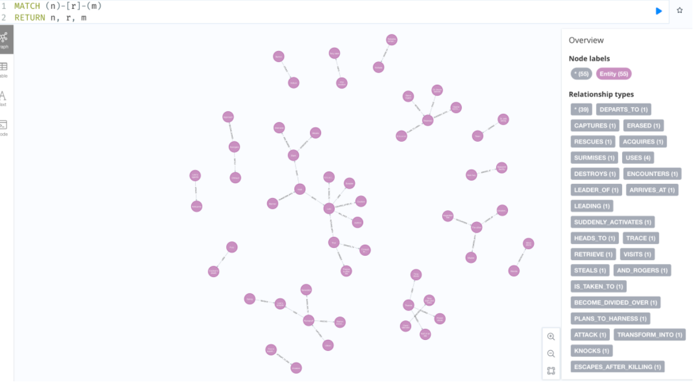

### 4.10.4 RAG检索模块如何对召回结果进行筛选？（5种）
**1、SeIf-RAG：自我反思检索增强生成，提升语言模型生成质量与准确性**

经典的 RAG 架构中(包括 KG进行上下文增强)，对召回的上下文无差别地与 query 进行合并，然后访问大模型输出应答。 **但有时召回的上下文可能与 query 无关或者矛盾，此时就应舍弃这个上下文，尤其当大模型上下文窗口较小时非常必要。**

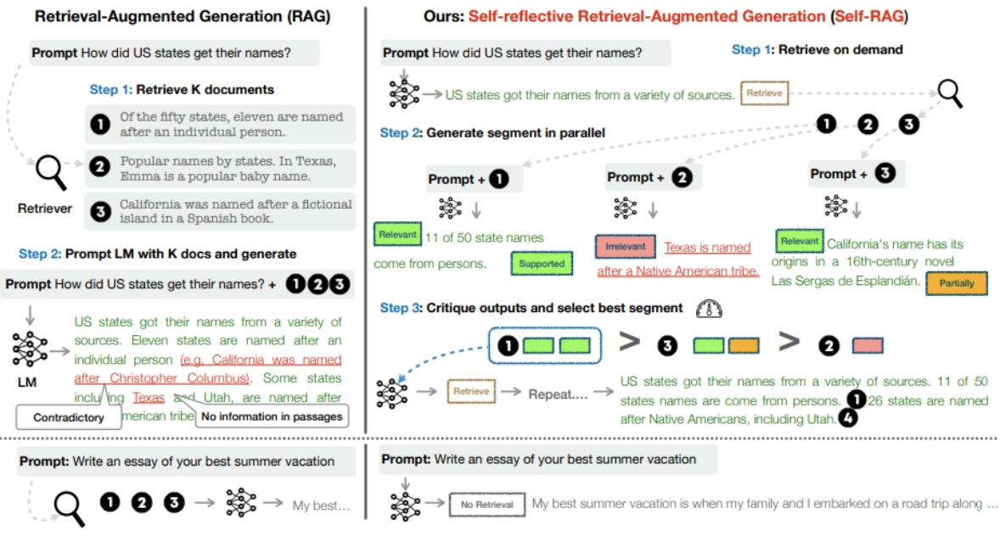

主要步骤：

（1）判断 **是否需要额外检索事实性信息**(retrieve on demand)，仅当有需要时才召回

（2） **平行处理每个片段**：生产 prompt +一个片段的生成结果；

（3） **使用反思字段，检查输出是否相关，选择最符合需要的片段**

（4）再 **重复检索**

（5） **生成结果会引用相关片段，以及输出结果是否符合该片段**，便于查证事实

**==SeIf-RAG 的重要创新:：Reflection tokens (反思字符)==**。通过生成“反思字符”这一特殊标记来检查输出。 **==这些字符会分为 Retrieve 和Critique 两种类型==**，会标示：检查是否有检索的必要，完成检索后检查输出的相关性、完整性、检索片段是否支持输出的观点。

**2、提升索引质量**

索引的数据决定了 RAG 答案的质量，因此首要任务是在摄取数据之前尽可能对其进行整理。(垃圾输入，垃圾输出仍然适用于此)：通 **过删除重复/冗余信息，识别不相关的文档，检查事实的准确性来实现**。

构建 RAG 时，清理数据非常重要：

（1）通过清理特殊字符、奇怪的编码、不必要的 HTML 标签来消除文本噪音

（2）通过实施一些主题提取、降维技术和数据可视化，发现与主题无关的文档，删除它们

（3）通过使用相似性度量删除冗余文档

**3、使用压缩提示词优化搜索结果(Optimize Search Resultswith Contextual Prompt Compression)**

通过 LLMs 对检索到的信息进行处理、压缩或重新格式化，只保留生成最终响应所需的关键信息。

注：LLMLinqua是实现这种方法的一个很有前途的框架。LLMLingua使用小型语言模型，如GPT2-small或LLaMA-7B、来检测和删除提示符中不重要的标记。它还支持在黑盒llm中使用压缩提示符进行推理，以最小的性能损失实现高达20倍的压缩。LongLLMLingua在此基础上更进一步，通过在执行压缩时考虑输入查询以删除通常不重要且对相关查询不重要的令牌，使其适用于RAG系统

注：LLMLingua 是一种通过提示压缩（Prompt Compression）来加速大型语言模型（LLM）推理的技术。该技术由微软的研究团队提出，旨在通过压缩提示信息来减少模型推理的开销，同时保持语义完整性

**4、 使用纠正 RAG 对检索文档打分和过滤(Score and FilterRetrieved Documents with Corrective RAG)**

使用一个经过训练的模型对 RAG 结果进行打分（正确/相关、模糊或不正确），将不相关或不准确的文档过滤掉，只保留有用的部分。这就像是请一个专家帮你筛选资料，只留下真正有用的信息。而不是用所有召回的文档summary

**5、Contextual compression（常用）**

本质上利用 LLM 去判断检索之后的文档和用户 query 的相关性，只返回相关度最高的k个，用LLM+提示词

### **4.10.5 RAG如何优化响应生成模块？（7个手段）**
1、 **将检索出的块（首先做合并），多次输入LLM，并不断对生成结果完善**

经典RAG应用的生成模式非常简单（下左），但在实际场景应用中，由于输入问题或任务的多样性，经典RAG并不总是合适，或者生成质量不高，很多时候你需要结合任务输入与响应要求来优化生成的流程与提示词。

| 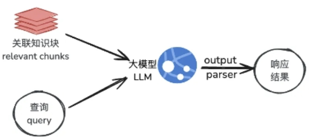 | 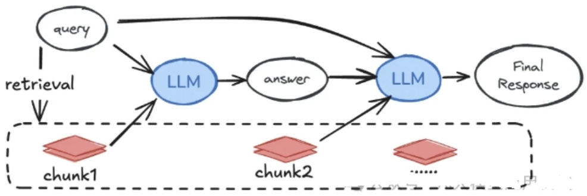 |
| --- | --- |

这种模式下（上右）， **==将检索出的块（首先做合并）多次输入LLM，并不断的对生成结果进行完善==**，最后获得响应结果。常见的生成模式:

（1） **简单合并生成：**用检索出的多个关联块，借助LLM 依次生成答案，并对答案进行简单合并，如使用某个分割符。用于一些希望获得多个答案的任务场景。

（2） **自我反思生成：**借助LLM 对生成的响应进行评估与反思(如与问题的相关性、正确性等)，并根据评估结果进行选择或再次优化(如通过问题重写后再次生成)。

（3） **树状总结生成：**用于对检索出的关联块，自底向上的进行不断合并与摘要生成，直到无法合并(只有一个摘要结果)。

**2、通过链式思维提示屏蔽噪音（Tune Out Noise withChain-of-Thought Prompting)**

利用链式思维提示(Chain-of-Thought Prompting)提高 LLM 在有噪音或无关信息情况下给出正确答案的概率。

**3、让系统具备自我反思能力（Make Your SystemSelf-Reflective with Self-RAG）**

==通过训练模型生成“反思字符”这一特殊标记判断是否需要检索或修正生成的内容从而提高生成内容的质量和准确性==。和人的思考方式类似，会先想一想有没有漏掉什么信息，或者之前的判断是不是有问题，然后再做出最终决定大模型都是在模拟人脑的行为。

**4、微调模型忽略无关上下文**

LLM没有针对 RAG 进行明确的训练或调优，因此，通过微调模型，增强其在 RAG 中的表现使其能够忽略无关的上下文提高对相关信息的响应能力。

**5、使用自然语言推理让 LLMs更好地应对无关上下文：**

在某些情况下，不相关的RAG 上下文会对LLM 的性能产生负面影响。所以使用 NLI模型(自然语言推理）用来过滤掉不相关的上下文。只有当假设(即，使用问题和 LLM 生成的答案)被归类为前提(即，检索的上下文或 RAG 结果)所包含时，才使用检索到的上下文

**6、Refine 对生成的回答进行进一步改写**

提示词：

```JSON
The original query is as follows: {query_str}
We have provided an existing answer: {existing_answer}
We have the opportunity to refine the existing answer (only if needed) with some more context below.
__________
{context_msg}
__________
Given the new context, refine the original answer to better answer the query. If the context isn't useful, return the original answer.
Refined Answer:
```

**7、Emotion Prompt**

提示词工程，思路来源于微软的论文：Large Language Models Understand and Can Be Enhanced by Emotional Stimuli，微软提出， **提示词中增加一些情绪情感相关的提示，有助于大模型输出高质量的回答**

```Python
emotion_stimuli_dict = {
    "ep01": "Write your answer and give me a confidence score between 0–1 for your answer. ",
    "ep02": "This is very important to my career. ",
    "ep03": "You'd better be sure.",
    # add more from the paper here!!
}

# NOTE: ep06 is the combination of ep01, ep02, ep03
emotion_stimuli_dict["ep06"] = (
    emotion_stimuli_dict["ep01"]
    + emotion_stimuli_dict["ep02"]
    + emotion_stimuli_dict["ep03"]
)

from llama_index.prompts import PromptTemplate

qa_tmpl_str = """\
Context information is below.
---------------------
{context_str}
---------------------
Given the context information and not prior knowledge, \
answer the query.
{emotion_str}
Query: {query_str}
Answer: \
"""

qa_tmpl = PromptTemplate(qa_tmpl_str)
```

### **4.10.6 如何解决知识库中内容缺失问题**
知识库中缺失上下文，导致 RAG生成错误回复。当知识库中没有答案时，RAG 系统会提供一个看似可信但并不正确的答案，而不会承认它不知道。用户会收到错误信息，遭遇挫折。

1、清洁数据：

输入垃圾，那也必定输出垃圾。如果源数据质量低劣，比如包含互相冲突的信息，那不管 RAG 工作构建得多么好，都不可能用你输入的垃圾神奇地输出高质量结果。任何 RAG 工作流程想要获得优良表现，都必须先清洁数据。清洁数据的常用策略:

**移除噪声和不相关信息：**包括移除特殊字符、停用词(stopwords，如 the 和 a)、HTML 标签

**识别和纠正错误：**包括拼写错误、错别字和语法错误。可以使用拼写检查器和语言模型等工具解决

**去重：**移除重复数据记录或可能导致检索过程出现偏差的相似记录

2、更好的提示词设计：

对于因为信息缺乏而导致系统给出看似可信却不正确结果的问题，更好的提示词设计能提供很大帮助。 **通过为系统给出「如果你不确定答案是什么，就告诉我你不知道」这样的指示，就能鼓励模型承认自己的局限，并更透明地向用户传达它的不确定。**虽然不能保证100% 准确度，但在清洁数据之后，精心设计 prompt 是最好的做法之一

### **4.10.7 语义匹配 to检索式聊天机器人**
聊天机器人是语义匹配中最广泛应用的场景。目前的聊天机器人主要分成5种：

（1） **基于问答对**：输入用户的问题，在由（问题：答案）组成的知识库中检索相似问题，最后将用户相似问题的答案作为结果返回

（2） **基于机器阅读理解**：输入用户问题，从知识库中检索相关文档，然后通过机器阅读理解的形式返回答案，这种也涉及检索，不过最关键一步是通过指针网络的形式从文档中抽取出 Span 作为回答，容易不稳定

（3） **基于知识图谱**：输入用户问题，通过语义解析转化成对应的 Cypher 语法，从建立好的知识图谱中检索问题，困难主要在于知识图谱的建立需要耗费大量人力

（4） **基于任务型对话**：针对有限的实际业务场景，例如携程的聊天机器人，输入用户问题，通过意图识别、提取词槽，转换为对应的“订机票”、“查酒店”等服务

（5） **闲聊**：类似微软小冰，实际应用场景较少

其中“基于问答对”是最为简单的方案，能快速建立一个可用的聊天机器人，其中里面最关键的技术就是语义匹配。需要首先根据业务场景定义一批【标准问】以及它们对应的答案，当有新的问题来时，计算新问题与标准问的相似度则可。

1、知识库的标准问如何整理?

基于问答对较为简单，但实际应用中需要考虑这个场景究竟有多泛，是解决一个医药问答、还是一个金融问答、还是一个百科式的问答。一定要先梳理场景： **假如场景过大，还需要分级管理，如赶着上线，则应该先做高频问答，20%的问题涵盖了 80%的常见问题。**

2、如何处理冷启动?

**对于一个新需求之前没有任何的数据积累，这时可以通过搜索引擎，如谷歌搜索一些网民提出的一些相关问题作为知识库（起码这些问题是真实的）或者用大模型生成问题**，假如面对的场景十分窄，搜索不出来/生成效果不好，只能让客户提供一些常见问题再进行发散

3、如何制作训练集?

同样容易遇到冷启动，假如已经梳理完知识库，如何生成训练集?可以通过，如同一个含义的标准问作为一对正样本，不同含义的标准问为一对负样本，但这样容易训练集不够丰富。

推荐一种做法：把标注问拿去搜索，通常第1页搜出来的都是语义相同的问题可以作为正样本，10 多页的都是些相似度高但语义不同的问题则可以作为负样本，当然还需要人工过审，做法的好处是极大丰富了训练集

首先思考“什么叫语义相同的句子?” 如“怎么成为网络红人"、“怎么样可以成为网络红人”属于同一语义的句子对，但假如是"怎么成为网络红人"、"女的怎么容易成为网络红人”实质上是不严格相同的。假如在你的业务场景中，这两个问题都对应的是同一个答案，能否把这两个句子作为相似度为1的正样本让模型去训练的决策在于：你想做得有多粗多细，假如很细粒度，那这两个句子就不是语义相同的句子，或者说它们的相似度不是1，是06或0.8，但假如做得很细的话，你需要定义很多标准问。假如做得很广，如把同一个回答的问题都定义为相似度为1的句子。你必须把你认为相似的样本拿去给模型训练，做广的好处是不用定义太多问题，但容易不稳定。

4、用户的问题在知识库中没有相似问题?（可以结合6.1-4 一起看）

可以设定:

（1）假如有标准问与用户问题相似度 0.8以上：直接返回相似度最高的标准问对应的答案

（2）假如相似度最高在 0.4~0.8：可以返回用户“你是否想问……？

（3）假如相似度在 0.4 以下：可以返回与用户问题相似度最高的3个问题，输出：“你是否想问这些问题……”

这其实就涉及到用户体验的问题，不是说一定要返回一个答案，也不是说找不到相似的就让客户重新问。即使没有很相似的问题，大部分场景下我们也可以返回“接近相似”作为引导让客户重新提问，如何构建良好的用户体验需要很强的产品思维

### 4.10.8 **如何应对RAG的潜在陷阱？(RAG优化策略总结：6大阶段17个技巧）**
当遇到RAG效果不佳时，简单来说可以从5个流程步骤入尝试进行优化，通过在这些步骤中寻找优化点而提升性能

**预检索**：将嵌入数据导入向量存储。

**检索**：查找与问题相关的内容。

**后期检索**：在将结果发送给LLM之前，对检索到的内容进行预处理。

**生成**：利用提供的上下文来解决用户的问题。

**路由**：处理请求的整体路由，比如使用代理方法将问题分解，并与模型进行多次交互

1、 **原始数据创建/准备**

当文档包含以下内容时，问题就出现了：

特定领域甚至特定文档的缩写

链接到维基其他部分的文本段落

以下示例展示了如何通过正确的方式设置内容，让我们的RAG应用程序更轻松地工作。

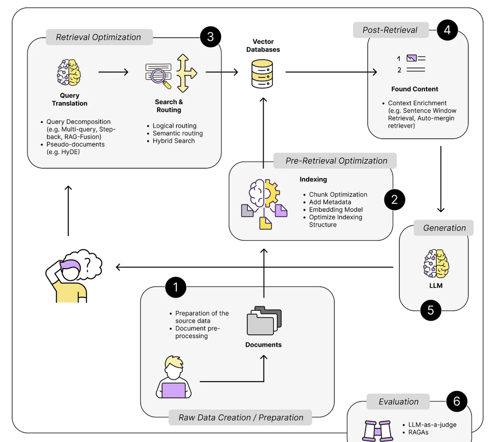

**==技巧1：以文本块不言自明的方式准备数据==**

在下图中，你可以看到一个类似于教程和技术文档中常见的例子。如果没有纯粹的LLM或者多模态模型，LLM将很难完全理解左侧版本1中的内容。而版本2至少给了它更好的机会去理解。


2、 **索引/分块——分块优化**

考虑文本片段和提示的最佳长度会对性能产生重大影响，比如：

响应时间（以及成本）

相似性搜索的准确率

有多种文本分割器可以用来对文本进行分块。

**==技巧2：块优化——滑动窗口、递归结构感知拆分、结构感知拆分、内容感知拆分==**

块的大小是一个需要仔细考虑的参数——它取决于你使用的嵌入模型及其处理token的能力。标准的Transformer编码器模型（比如基于BERT的句子转换器）最多只能处理512个token，而一些嵌入模型能够处理更长的序列，比如8191个token。但 **越大并不总是越好，**分块的目标是找到既能提供足够上下文，又不会过于冗长的平衡点。

去看4.2.2分块策略

**==技巧3：提高数据质量——缩写、技术术语、链接==**

数据清理技术可以删除不相关的信息，或者将文本部分放入上下文中，使其更易于理解。比如：

一个缩写、特定技术术语或公司内部术语可能会让模型难以理解其完整含义。

如果你对篮球一无所知，你可能永远不会将“MJ”与“迈克尔·乔丹”联系起来。

如果你不知道某个句子描述的是供应链环境中的内容，你可能会认为“PO”指的是“邮局”或其他以P和O开头的词组合。

可以尝试在处理数据时提取必要的附加上下文。比如， **使用缩写翻译表将缩写替换为全文**。这在处理文本到SQL相关的用例时尤其重要

**==技巧4：添加元数据==**

在所有向量数据库中向量数据添加元数据。这些元数据可以帮助我们在执行矢量搜索之前预先过滤整个矢量数据库。举个例子，假设我们的向量存储中有一半数据是针对欧洲用户的，另一半是针对美国用户的。如果我们知道用户的位置，我们就不想搜索整个数据库，而是希望能够直接搜索相关部分。如果我们将这些信息作为元数据字段添加进去，大多数向量存储都允许我们在执行相似性搜索之前预先过滤数据库。

**==技巧5：优化索引结构——全搜索与近似最近邻、HNSW 与 IVFPQ==**

大多数向量数据库中的相似性搜索都非常快，即使我们有数百万个条目，因为它使用了近似最近邻技术，比如FAISS、NMSLIB、ANNOY等。这些技术使得搜索变得非常高效。（看4.10.1）

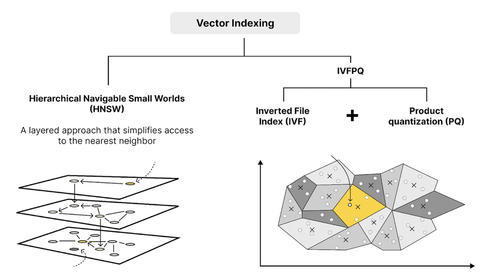

**==技巧6：选对嵌入模型==**
 嵌入文本块有很多选择。如果你不确定该用哪个模型，可以参考一些现有的性能基准，比如 MTEB（海量文本嵌入基准）能帮你评估不同模型的表现。

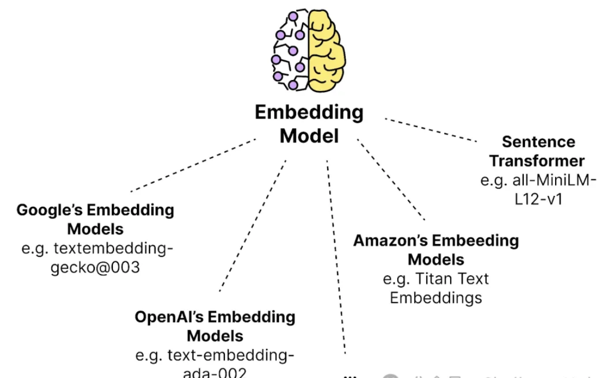

3、 **检索优化-查询翻译/查询重写/查询扩展（看4.10.1）**

核心目标都是一样的：用 LLM 的力量来优化原始查询，然后再交给向量搜索去处理。就是让 LLM 把用户的查询“升级”，让它更适合搜索。有几种常见的方法：

**方法一**：用 LLM 生成一些相关的文档或信息，来扩展用户的查询。

**方法二**：让 LLM 稍微改述用户的查询，然后发送不同的提示给模型，最后整合模型的反馈。

**==技巧7：用生成的答案进行查询扩展——比如 HyDE（看6.3、4）==**

可以先让 LLM 生成一个答案，然后再用这个答案去做相似性搜索

**==技巧8：多种系统提示==**

可以生成 4 个不同的提示，然后得到 4 个不同的回答。提示之间的差异可以是任何形式的。比如：

如果我们有一篇长文章需要总结，可以用不同的提示去抓取文章的不同方面，最后把这些发现整合成一个完整的答案。

或者，我们可以用 4 个基本相同的提示，上下文也差不多，但系统提示稍微调整一下。这样就能让 LLM 以稍微不同的方式处理问题，或者用不同的风格来表述答案。

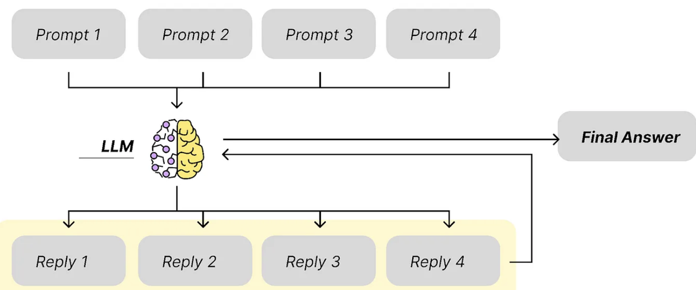

**==技巧9：查询路由（看6.4、5）==**

查询路由（Query Routing）可以利用 LLM 的决策能力来灵活决定下一步该怎么做。举个例子，假设的向量存储里存了来自不同领域的数据。为了让搜索更有针对性，我们可以先让模型判断一下：应该从哪个数据池里找答案最合适。

比如，下图中的向量存储里就存了来自世界各地的新闻，包括体育和足球、烹饪趋势，还有政治新闻。当用户向聊天机器人提问时，我们肯定不希望把这些数据混在一起。

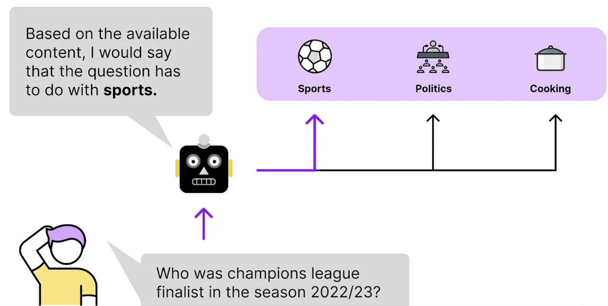

**==技巧10：混合搜索==**

RAG 管道的检索步骤本质上就是一个搜索引擎。如果想提升相似性搜索的效果，混合搜索的思路是同时进行向量搜索和词汇（关键词）搜索，然后把两者的结果结合起来。这样既能捕捉语义上的相似性，又能抓住关键词的精准匹配

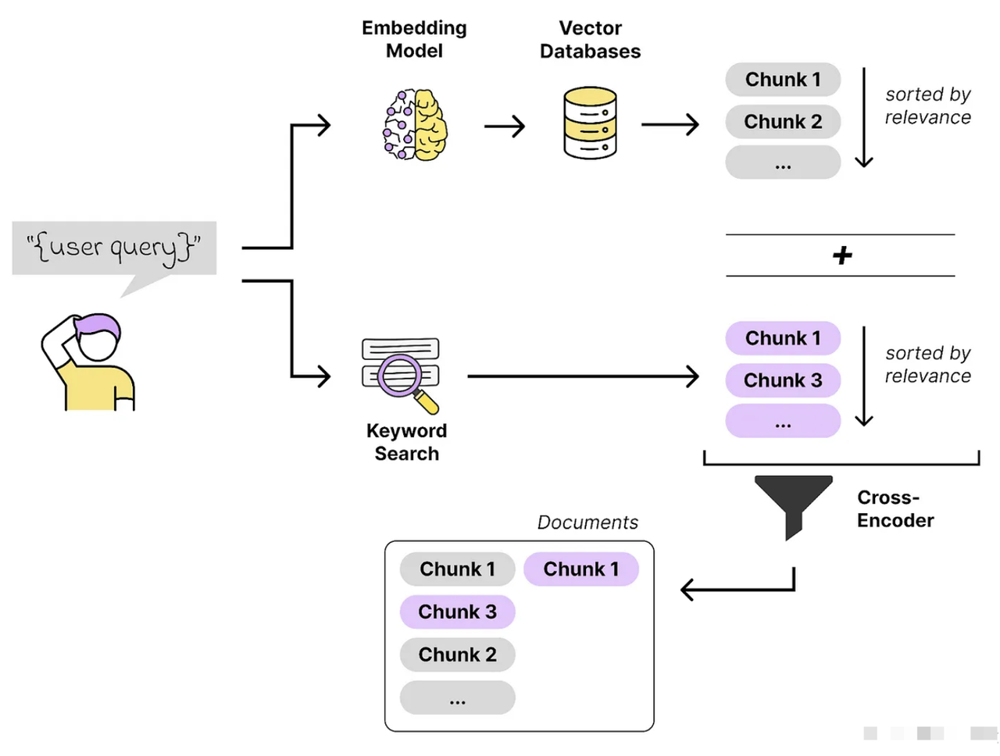

4、 **检索后：如何改进检索步骤？**

**上下文丰富：**

**句子窗口检索器**

**自动合并检索器**

**==技巧11：句子窗口检索==**
 当通过相似度搜索找到得分最高的文本块时，这个块通常是最匹配的内容。但在把它交给 LLM 处理之前，会在它的前后各加上 k 个句子，因为相关信息很可能分布在中间文本块的周围，而单独的文本块可能信息不完整，缺乏上下文。

**==技巧12：自动合并检索器（也叫父文档检索器）==**
 自动合并检索器的思路和句子窗口检索类似，但它的做法不太一样。它会为每个小文本块分配一个特定的“父”块，这个父块不一定是前后相邻的块，而是根据内容相关性来确定的。

你可以根据自己的需求，灵活定义文本块之间的关系。比如，在处理技术文档或法律合同时，经常会发现某些段落或章节引用了文档的其他部分。这时候，挑战就在于如何将这些被引用的部分与当前段落关联起来，从而丰富上下文信息。我们需要能够识别文本中这些引用关系，并把它们整合到一起。

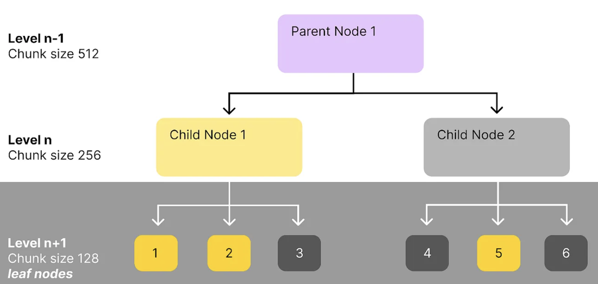

可以基于这个概念构建一个完整的层次结构，比如决策树。这个结构可以包含不同层级的父节点、子节点和叶节点。可以设计一个3层结构，每一层都有不同的块大小：

**第一层**：块大小为 2048

**第二层**：块大小为 512

**第三层**：块大小为 128（叶节点）

当对数据进行索引并执行相似性搜索时，会从最小的块——也就是叶节点——开始搜索。找到匹配的叶节点后再向上追溯，找到对应的父节点。

5、 **生成/代理大模型**

**==技巧13：如何挑选合适的大模型和服务商——开源还是闭源？服务还是自托管？小型还是大型？==**

现在市面上有不少基准测试，可以从各个维度来比较这些大模型。但最靠谱的办法还是亲自上手，针对RAG解决方案试一试才知道哪个最合适。（参考3看1测）

**==技巧14：代理==**

代理运用了“思路推理链”：

先抛出一个问题，

然后请大模型（LLM）解读收到的答案，

接着根据解读结果，决定下一步怎么走，

最后，再次启动这个过程。

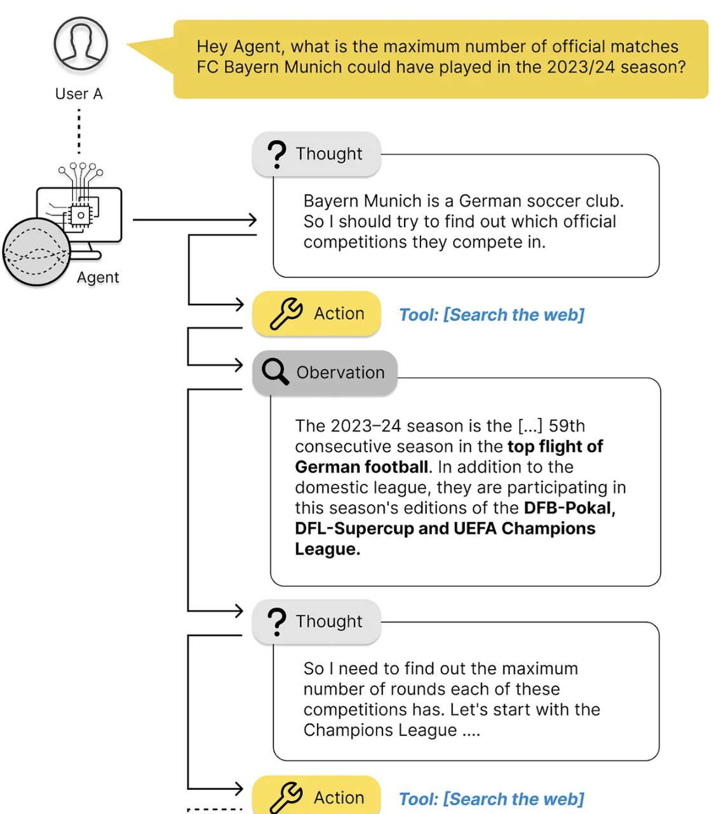

**6.评估——评估 RAG 系统**

RAG 的系统表现很大程度上取决于两个关键点：一是你喂给它的数据质量，二是大模型从这些数据里提取有用信息的能力。为了让整个系统跑得好，咱们得确保各个组件都能各司其职，协同工作。所以要看整体表现，还得看每个组件是不是在好好干活： **检索器（Retriever）**和 **生成器（Generator）**检索指标看：4.8节；生成评估如下：

**==技巧15：大模型作为判断模型==**

生成部分的评估可以用“LLM-as-Judge”的方法来做。分3步：

**搞评估数据集**：就是准备一些问题和答案，用来测试模型的表现。

**定义“裁判代理”**：其实就是选一个大模型，让它根据咱们定的标准（比如答案的准确性、专业性啥的）来打分。

**自动化测试流程**：让系统根据定义的标准，自动评估大模型的回答，不用每次都手动操作。

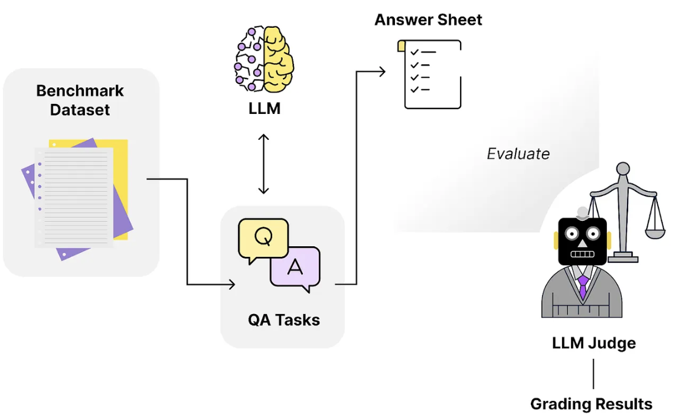

**第1步：生成综合评估数据集**

这个数据集通常包括三部分： ==(1) 上下文、(2) 问题、(3) 答案==。如果手头没有现成的完整数据集，就可以自己动手造一个：给大模型提供一段上下文，让它猜猜可能会问什么问题。这样一步步来，就能慢慢构建出一个合成的数据集。

**第2步：设置“裁判代理”**

这个“裁判代理”就是另一个大模型（通常更强大），用它来根据一些标准评估系统的回答。比如：

```JSON
definition=(
    "专业性指的是使用正式、尊重且适合具体场景和受众的沟通风格。通常要避免太随意的语言、俚语或者口语，而是用清晰、简洁、尊重的表达方式。"
 ),
grading_prompt=(
    "专业性评分标准如下："
    "- 1 分：语言非常随意，甚至可能带俚语或口语，完全不适合专业场合。"
    "- 2 分：语言比较随意，但还算尊重人，没有太多俚语。在一些不那么正式的专业场合还能接受。"
    "- 3 分：语言总体正式，但偶尔会冒出一两个随意的词。算是专业场合的底线了。"
    "- 4 分：语言平衡，既不太随意也不太正式。适合大多数专业场合。"
    "- 5 分：语言非常正式、尊重，完全没有随意的成分。适合正式的商务或学术场合。"
 )
```

**第3步：测试 RAG 系统**

用刚刚创建的评估数据集来测试系统。对于每个想测试的指标（比如专业性）会定义一个详细的评分标准（比如从 1 到 5 分），然后让“裁判代理”来打分

**==技巧16：RAGAs（看4.6、1）==**

**RAGAs（检索增强生成评估）**是一个专门用来评估 RAG 系统各个组件的框架。它的核心思想之一就是“让大模型当裁判”，也就是用大模型来辅助评估。Ragas 提供了一些预定义的指标，可以单独评估 RAG 流程的每个环节。比如：

**生成部分：**

**忠诚度**：生成的答案到底有多准？是不是跟事实对得上？

**答案相关性**：生成的答案跟问题搭不搭？是不是答非所问？

**检索部分：**

**上下文精度**：检索到的内容里，有用信息和噪音的比例怎么样？

**上下文回忆**：它能不能把回答问题需要的所有相关信息都找出来？

除此之外，Ragas 还有一些指标是用来评估整个 RAG 流程的效果的，比如：

**答案语义相似度**：生成的答案和标准答案在意思上有多接近？

**答案正确性**：答案到底对不对？

Ragas 就像是个“体检工具”，把 RAG 系统的每个环节都检查一遍，找出问题，然后对症下药。

**==技巧17：持续从应用程序和用户收集数据==**

通过一些方式让用户能轻松地给我们反馈，这样我们才能知道问题在哪儿，分析badcase然后改进。

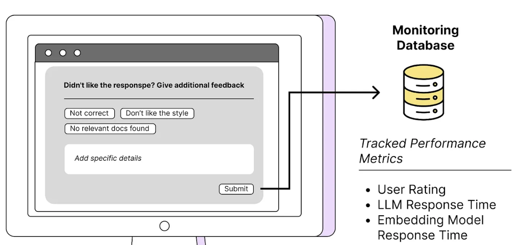

除了基本数据，还可以收集：

==每次响应的时间点==，以及 RAG 流程中每个步骤花了多长时间（比如矢量化、相似性搜索、大模型生成答案这些环节）

具体 ==用了哪个提示模板==

==找到了哪些相关文档，文档版本是什么==

大模型给 ==出的最终答案==

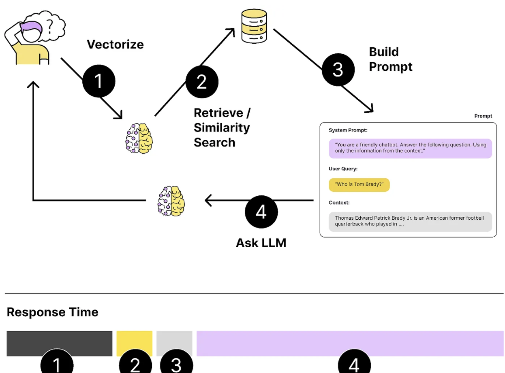

### 4.10.9 【性能优化】如何提升首字响应
==（主要是算法同学考虑，高亮部分产品经理注意）==

1、embedding阶段存在的问题：

```JSON
网络往返多、一次算一条
I/O 等待白白浪费CPU
重复文本反复算
模型本身推理慢
```

```JSON
（1）批量请求Embedding：
将多个文本一次性发送以减少总请求数。例如，可以把待嵌入的多个查询或文本段组合成数组传入单次API调用，避免逐条请求所带来的网络开销。需要注意每次请求的最大token限制(如模型对每个输入文本通常限制~8192 tokens)并在超出时拆分批次，以免报错

（2）并发调用与异步处理:
合理利用并发提高吞吐量，可以在等待一个Embedding结果时并行触发其他请求。实践中OpenAl对并发请求有一定限制，过高并发可能引起排队延迟，经验上将并发控制在单-digit数量比较稳妥(例如同时5~10个请求)并监控接口返回的速率限制信息。当高并发场景下，可以采用指数退避重策略来应对429/Rate Limit错误。异步非阻塞调用能让CPU空闲时间用于处理其它任务，从而提升整体吞吐。

（3）缓存Embedding结果：
针对重复出现的文本，缓存Embedding以避免重复计算。例如，对于常见问题或频繁查询，可以在首次获取Embedding后将query->embedding 键值对存入内存或Redis缓存。下次遇到相同查询时直接复用缓存向量，跳过API调用，从而显著降低延迟。对于文档语料，尽量预先计算并存储Embedding，避免在查询时现算
```

2、向量检索存在的问题：

```JSON
全库都扫，暴力
海量数据 串行查
QUERY多但每次只看少量数据
CPU饱和
```

```JSON
（1）使用近似邻居索引(ANN)，避免对大型语料库进行逐条精确暴力搜索：可改用近似最近邻算法构建索引，例如IVF、HNSW等，以大幅提升检索速度。实践表明，对于百万级向量数据，HNSW索引在保持较高召回的同时能将查询延迟降低到毫秒级。Milvus官方也推荐在需要高性能检索时选用HNSW索引。如果使用IVF索引，可调节细分簇数量(nlist)和查询探测范围(nprobe ):增大 nlist 提高召回率，减少 nprobe 缩短查询时间，从而在速度与准确率间取得平衡。索引构建时的参数(如HNSW的 efConstruction 或IVF的分桶参数)也应根据数据规模调优，以保证查询阶段有良好性能

（2）优化数据分片与过滤: 利用Milvus的分区和过滤功能缩小检索范围，从而减少每次查询需要遍历的向量数量。如果先验知道查询只涉及某部分语料(例如按来源、时间分区的数据)，可将向量集合按属性切分成分区，查询时指定相应分区检索，避免全库扫描。对于规模超大的向量集合，合理分片(sharding)有助于降低单机内检索延迟。同时剔除过期或低相关

（3）批量查询与并发连接: Milvus支持在一次请求中执行批量搜索(即传入多个查询向量一起检索)，这相比逐一查询能减少网络开销和调度开销，适用于需要同时回答多子问题或多用户批量请求的场景。对于并发请求量高的系统，可在客户端维护连接池或使用多线程/协程并发查询Milvus。Milvus2.x的无锁架构对并发查询有良好支持，但仍需确保后端资源充足(CPU/内存不成为瓶颈)。如果QPS需求特别高增加检索副本:Milvus允许在内存中加载数据的多个副本来提高并行查询能力。通过在Collection.load()时设置replica number>1，可以启用多副本使查询负载分摊到不同Query Node，从而提升整体吞吐。例如，将副本数设为4可显著提高QPS上限。同样，需要搭配增加Milvus后端的QueryNode实例数和计算资源，以充分利用副本带来的并行度。

（4）系统配置与硬件加速:调整Milvus的配置以匹配性能需求。例如，在保证召回的前提下将搜索参数efSearch(对HNSW)或nprobe(对IVF)设为较小值以加快查询。确保在查询前调用collection.load()将数据加载至内存，并设置合适的 cacheconfig (Milvus会将常用数据页缓存在内存)。
```

3、系统整体优化：

从架构层面综合考虑全链路的优化，确保各模块高效协同工作:

```JSON
（1）异步架构与并发设计: 采用异步非阻塞架构以充分利用服务器资源，提高整体吞吐量。例如使用Python的 asyncio 或多线程池，让Embedding计算、向量检索、LLM生成等步骤能够流水线并行或重叠执行。对于单个查询流程，大部分步骤是顺序依赖的，但可以**并行化独立操作**(如同时处理多个用户请求，或如上节所述在生成回答的同时预取下次检索)。针对高并发的场景，可引入**任务队列**(如RabbitMQ、Kafka)和工作进程批量处理请求。例如积攒一定数量的查询统一进行Embedding或检索操作，以摊薄单次处理开销。同时，可以部署**多实例LLM服务**(如果使用自托管模型)或使用OpenAI多APIKey分流，请求端做负载均衡以避免单点瓶颈。无论何种并发方案，都要监控关键指标如每秒查询数(QPS)和端到端延迟，根据负载动态扩容缩容资源。


具体做法如下：
如果部分阶段间不存在明确的上下文依赖关系，就可以通过并行请求的方式显著压缩整体响应时间，从而提升在线服务的性能表现。

示例1：
以一个典型的RAG知识问答系统为例，用户发起Query后，系统可能需要经历以下大模型处理步骤：
a) 意图识别（Intent Classification）
 判定用户的问题类型，例如“查信息”还是“流程操作”。
b）实体抽取（Entity Extraction）
 从问题中识别出关键实体，如“基金名称”、“指标维度”等。
c）生成总结（Answer Synthesis）
 结合检索结果，由大模型撰写最终回答内容。

通常会将这三步串行执行，但如果意图识别与实体抽取之间不存在强依赖关系，则可以将这两个任务并行发起，节省一次推理时间。对ToC类知识助手、智能客服系统等交互频繁的场景尤为明显串行路径：意图识别 → 实体抽取 → 检索 → 总结生成   🕒 总计约3轮推理时间并行路径：意图识别 ＋ 实体抽取（并行） → 检索 → 总结生成   🕒 减至约2轮


示例2：
企业财报分析助手中的RAG并行调用优化，系统的完整推理链条包括：
a）意图识别：判定这是一个“财务分析类”请求；
b) 时间抽取：识别出“2023年”；
c）公司识别：识别出“特斯拉”；
d）领域分析任务规划：根据意图，决定需要分析“盈利能力”，即包含哪些财务指标（毛利率、净利率、ROE 等）；
e) 文档检索：基于公司 + 年份 + 指标 召回财报文本段落；
f）指标抽取（结构化信息解析）：从召回结果中抽取财务指标及数值；
g）答案生成：将结构化数据与段落内容整合为自然语言回答。

并行重构后系统链路示意：意图识别 vs 时间抽取 vs 公司识别；文档检索 vs 指标抽取
```

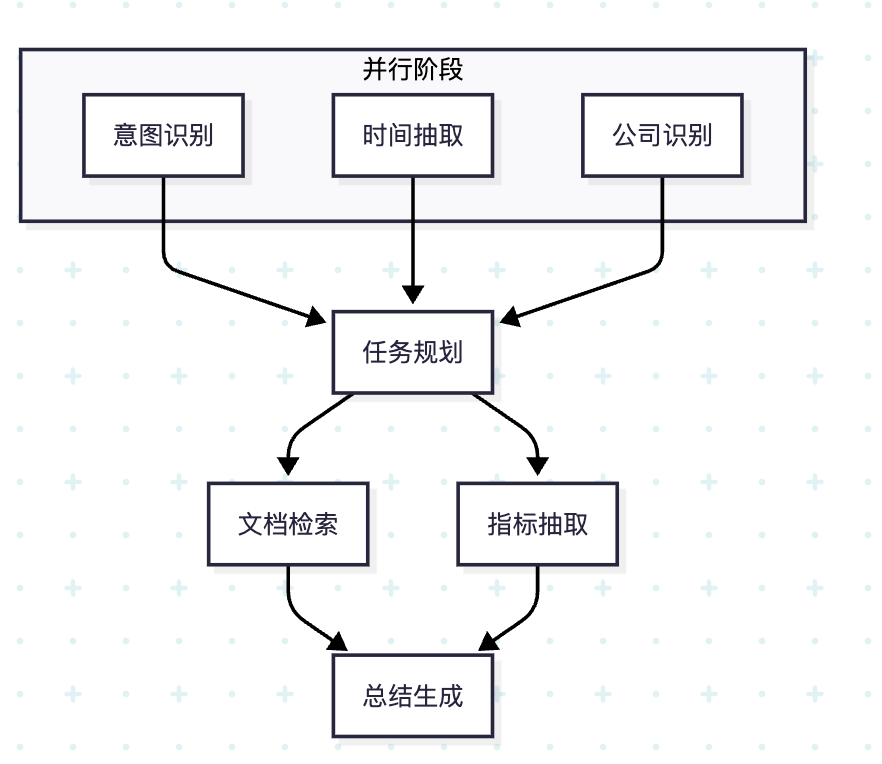

```SQL

（2）引入缓存层(Redis等):在系统中增加缓存机制，用空间换时间，避免重复计算开销。

真实线上业务中，用户提出的问题往往存在高度集中趋势，遵循“二八法则”：约80%的请求集中在20%甚至更少的问题类型中。针对这一特点，在RAG系统中引入一种“预生成+缓存命中”的高频问题优化机制，有效降低推理成本、显著提升响应效率

缓存可存在多个层次:
(1)Embedding缓存:缓存常见查询文本的向量表示，下次出现直接复用；缓存文档向量同样重要，静态语料库可以离线算好全部向量并存入
(2)检索结果缓存:对于经常被Milvus或KV存储。查询的问题，其检索到的文档列表往往相同，可缓存这些文档ID列表，下次查询时直接使用缓存结果而无需访问向量库
(3)答案缓存:对于高度重复且答案固定的提问(如FAQ)，可以直接缓存上一次的完整回答文本。下次相同提问立即返回缓存答案，实现需要注意对于有时效性的数据(如近乎零延迟响应。新闻、股价)，缓存过久可能失准，需设置适当TTL或在数据更新时主动清除相关缓存。使用Redis这类内存KV存储可以提供毫秒级的读取性能，适合做共享缓存层。同时通过哈希key(例如将query字符串规范化后哈希)索引缓存内容，并采用LRU等策略淘汰冷门条目。总之，缓存系统的引入能大幅减少重复调用OpenAIAPI和向量库的次数，从架构上加快响应


具体做法如下：
1. 构建高频问题缓存库的策略：
（1）数据收集与聚合：从线上实际用户日志中提取大量历史 query，无需去重，保留原始语义和长尾特征。对这些 query 使用向量化模型（如 BGE）编码，进行粗粒度聚类或直接统计出现频次，筛选出最常见的Top-N问题。

（2）问题归一与清洗：对高频问法进行归一化处理，包括同义替换、关键词泛化、意图标签绑定等，确保语义范围覆盖广泛。人工或半自动方式对聚合后的问题进行审查，形成“标准问法池”。

（3）预生成答案与缓存入库：将这批高频问法通过大模型离线批量生成回答，结合上下文、知识库或结构化数据增强回答质量。生成后的内容统一入库，作为线上响应前的缓存检索项。

2. 在线阶段的高效命中与调用流程
（1）用户 query 进入系统后，大模型调用前引入一个缓存检索模块。
可采用精准匹配+ 语义检索（向量 Top-K）组合方式（尽量简化会更好，如对极高频问题用Key-Value暴力匹配；剩下用轻量向量模型近邻扫一遍；真正复杂再交给大模型慢慢处理）。命中后直接返回缓存内容，响应时间可控制在10ms~50ms以内，大幅节省模型调用资源。未命中缓存的部分，再进入常规的RAG检索-生成流程，确保覆盖所有长尾需求。
```

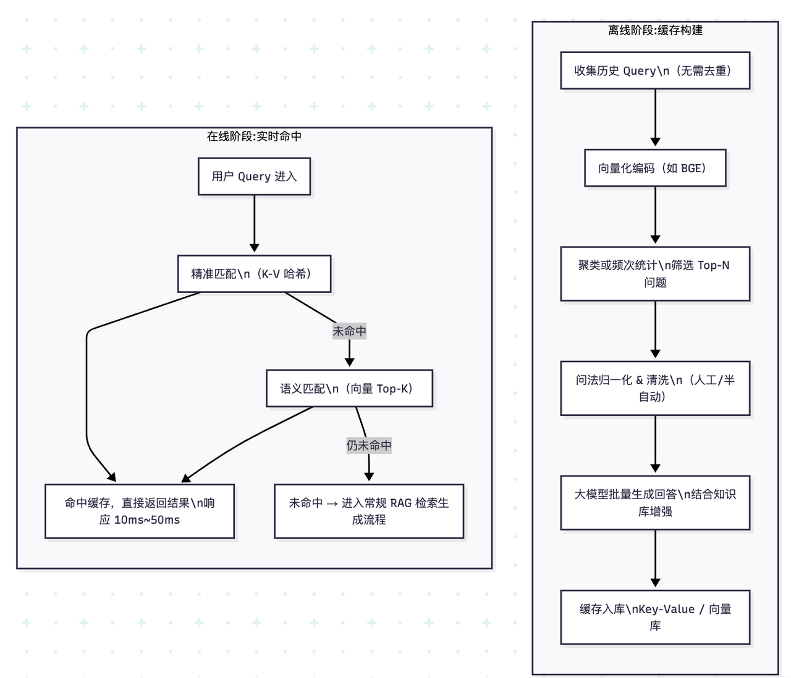

| **维度** | **优势** |
| --- | --- |
| **性能效率** | 高频问题缓存命中率高，避免重复向大模型发起推理， 减少平均响应延迟 |
| **成本控制** | 减少token调用与生成请求次数， 显著降低API调用成本 |
| **用户体验** | 对重复性问题做到秒级甚至毫秒级响应， 优化用户满意度 |
| **可维护性** | 高频问题集可每日或每周更新， 适配时效性场景（如热点问题、活动问题） |

**4、推荐系统的实时与离线协同（特定场景）**

在基于大模型的推荐系统中，如果每次用户请求都完整走一遍向量生成、召回、排序和内容生成链路，会面临 **高延迟、高算力开销**的问题，尤其在高并发、低延迟要求的场景（如电商首页推荐、视频个性化流）下压力巨大。

```SQL
优化策略：
将低时效性内容和高结构化数据的处理前置，提前离线完成Embedding计算、候选集筛选及初步排序缓存，实时链路仅负责动态特征的增量检索和精排。这样能大幅减少每次推荐请求触发的大模型推理量，降低响应时间。
```

举例：视频/电商推荐

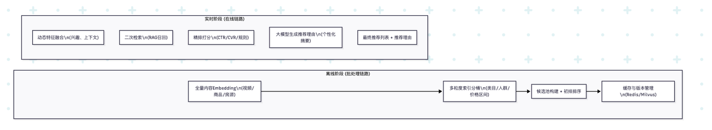

```SQL
-离线阶段（批处理）：（1）全量内容Embedding预计算
每天/每小时对平台内的全量内容（视频、商品、房源等）计算Embedding向量，采用大模型或轻量化模型提取多模态特征（标题、图像、标签、互动数据）。通过多维度索引（如按类目、价格区间、受众群体分群），构建分层向量索引，提升后续召回效率。

（2）候选池构建与初步排序
基于用户的历史行为（浏览、点击、购买）和画像特征，在离线阶段生成一个候选内容池。利用协同过滤、Graph Embedding 或传统机器学习模型对候选内容进行初步打分和排序，输出一个“基础推荐列表”。
同时将这些候选内容的元数据（来源、类目、标签）与Embedding一起存储，为实时召回提供快速访问。

（3）缓存与版本管理
将离线生成的候选池、索引和排序结果缓存在高速存储（如Redis），并通过版本号管理更新，确保实时链路取用最新可用数据。


-实时阶段（在线链路）：（1）动态特征融合与二次检索
当用户发起请求时，实时获取其当前兴趣信号（最近点击、搜索关键词、会话上下文），结合上下文意图（如“找低价折扣”或“看新片预告”）对候选池执行二次向量检索。通过RAG，将这些动态特征作为查询Embedding，快速召回与用户实时需求最匹配的内容。

（2）精排与个性化打分
对二次检索得到的候选集进行精细化排序，常用策略包括：大模型辅助的序列建模（结合用户交互历史预测CTR/CVR）；排序模型融合（Wide & Deep、DeepFM等）；业务规则加权（库存、冷启动保护、多样性约束）。

（3）大模型生成理由与摘要
对最终推荐列表，调用大模型生成个性化推荐理由或摘要文案，结合内容标签和用户画像，使推荐结果更可解释（例如：“这套房源距离地铁仅300米，符合您的预算区间”


优势：
延迟降低：绝大部分计算任务（Embedding、初排）在离线完成，实时阶段只需轻量化检索与模型推理。算力稳定：减少大模型每次全链路计算。个性化增强：动态特征与离线索引结合，既保持推荐的基础覆盖，又快速响应用户的短期兴趣波动。
```

### 4.10.10 构建精准术语库，提升检索一致性
**【术语混淆】是影响检索准确性和回答质量的核心隐患之一**。尤其在To B场景/垂直行业中，如果术语识别不清，会直接导致召回不准、问答偏离、生成答复出现歧义，严重影响系统效果。

```JSON
检索阶段：词义不清，向量或关键词召回偏离目标段落；
生成阶段：模型对“相近词”的理解不一致，容易生成风马牛不相及的内容；
用户层面：搜索出的结果不一致，降低了用户对系统的信任。
```

#### 1、术语库构建与维护
是整个知识问答系统中 **提升语义一致性和索引准确率**的基础设施，术语问题不是技术bug，而是业务语境复杂性的体现

**术语多义性**：同一个词在不同上下文下有不同含义，如“投标”在工程/采购/招标业务中指代不同角色；

**近义词/异名词泛滥**：如“服务器实例”VS“云主机”，本质一样但用户问法不同；

**组织/地域差异**：同一家公司不同部门或分子公司使用习惯不同，如“客户编号”和“用户ID”可能指代同一字段；

**行业专属术语**：特定行业自造词，如保险行业的“保单责任”或银行的“资产证明”；

**用户表达非标准**：用户问“怎么报修”实际上是指“提交售后工单”；

**拼写/命名不统一**：如大小写、下划线/驼峰混用等命名混乱情况。

2、构建术语库的目标：

建立一个“概念层统一映射”体系，从多个维度提升RAG的整体表现

| **目标** | **说明** |
| --- | --- |
| 检索统一性提升 | 同义词/异名词映射后统一索引词， 提升召回准确度 |
| 上下游语义解耦 | 用户口语问法与底层知识字段做映射， 增强问法容错能力 |
| 语料清洗标准化 | 在 数据分块、embedding前统一术语标准， 避免多版本导致冗余向量存储 |
| 模型增强训练 | 用标准术语增强训练数据集， 让LLM更稳定理解领域术语 |
| 多语言支持准备 | 若支持中英文/多语言问答， 术语统一是多语言映射的前置条件 |

3、 **术语词库构建流程（5步法）**

| **步骤** | **操作内容说明** |
| --- | --- |
| Step 1：术语收集 | 来源包括产品说明书、行业标准、业务知识库、客服对话、问法日志等，优先考虑高频使用术语 |
| Step 2：术语标准化 | 对 术语的命名进行统一 （区分大小写、缩写格式、中文/英文/中英混写），形成标准表达 |
| Step 3：别名映射关系 | 将常见的同义词、用户问法中的“土话” 归一映射到标准术语 ，例如“CNN”“神经网络”等 |
| Step 4：上下文补充 | 为 术语打上“使用场景标签” ，如“深度学习”“图像识别”，便于限定使用范围，避免语义歧义 |
| Step 5：术语索引生成 | 构建可被程序使用的术语索引表，支持API调用、RAG系统中作为query改写/命名实体识别模块接入 |

**==一个高可用术语库==**应包含的关键字段：

| **字段名** | **含义说明** | **作用** |
| --- | --- | --- |
| **术语（Term）** | 标准术语的 正式表达方式 （如“神经网络”） | 术语→别名是query改写模块的训练数据源，直接影响query到文档的对齐 |
| **别名（Synonyms）** | 同义词/简称/用户常见表达方式 列表（如“人工神经网络”，“NN”） |
| **定义（Definition）** | 术语的 权威释义 ，可引用行业标准/百科，如“神经网络是一种模拟生物神经网络结构的计算模型……” | 定义+上下文标签可作为LLM prompt中约束生成的辅助输入，降低语义偏差 |
| **上下文标签（Context Tags）** | 表示该术语 在哪些使用场景/系统模块中出现 ，如“AI算法”、“图像分类”、“深度学习” |
| **所属领域（Domain）** | 术语 归属的行业或知识体系模块 ，如“人工智能”、“金融科技”、“云计算”等 |  |
| **示例用法（Usage Example）** | 一条简洁的使用示例，说明术语在实际中如何出现，如“在图像识别中，使用了卷积神经网络……” | 便于训练微调模型识别术语实际语境，提高任务泛化能力 |
| **外部链接（External Link）** | 权威说明链接或文档跳转 （如维基百科、公司内知识库、产品文档） | 便于人工review、质检溯源、业务接入系统查看的跳转锚点 |
| **禁用词/误导词（Stop Words / Misleading Terms）** | 与该术语 近似但语义不同、容易混淆的词 ，如“神经系统”（医学中的词汇，容易与AI领域混用） | 用于召回/生成后的badcase过滤，防止“看似对了但其实错”的假阳性答案 |

4、 **（重要）术语词库与RAG进行集成**

1、在 query预处理阶段 替换术语

2、检索增强

3、重排序

4、后处理

| **集成方式** | **应用阶段** | **应用说明** |
| --- | --- | --- |
| **方式一：术语预替换（预处理阶段）** | Query预处理 | 在用户提问进入检索前， 通过查表将术语别名（如“CNN”）替换为标准术语（如“神经网络”），提高query与知识库中术语的一致性， 减少表述差异带来的向量偏移问题 |
| **方式二：术语增强检索（Recall阶段）** | 检索模块 | 召回时基于术语库扩展query关键词 （如同时召回“神经网络”、“人工神经网络”）， 提升召回广度 ；也可对术语设定权重，提高其在检索中的优先级 |
| **方式三：语义重排序（Re-ranking）** | 排序模型 | 利用术语上下文标签辅助reranker模型判断文本相关性， 使得与目标术语语义场景高度匹配的文档优先排序靠前，提升Top-k命中率 |
| **方式四：术语约束生成（后处理阶段）** | LLM生成后 | 生成结果中可 通过术语库过滤禁用词、纠偏术语表述 ，也可以 在Prompt中注入术语定义与示例用法，约束大模型输出更规范的专业表达 |

5、术语词库的维护

```JSON
（1）术语词库结构设计是基础，确定词库所需包含的字段和它们之间的关系
（2）自动抽取术语候选： 利用NLP工具（如利用 NER / TextRank）从大量文本中自动识别和提取潜在的术语
（3）领域专家对自动抽取的术语进行人工审核、修正和补充，确保准确性和专业性
（4）如果有需求可进一步构建术语之间的层次、关联关系，形成本体或知识图谱，提升语义理解能力
（5）建立术语词库的版本管理和定期更新机制
```

**【总结】**

（1）数据预处理：文档进入 RAG 系统前，对原始语料进行预处理，提取潜在术语并进行标准化处理，统一表述形式，避免多义、近义带来的向量漂移。上下文信息应同步保留，支持术语多维判别——利用 NER / TextRank / GPT-4.0 自动生成术语候选集；

（2）术语库构建与管理：构建结构化术语词表，包含字段如标准术语、别名、定义、上下文标签、领域、示例等。进一步可构建术语之间的层级、从属、上下位、互斥等语义关系

（3）向量嵌入与语义映射： **==将标准术语及其别名进行embedding处理，构建术语向量索引（如FAISS），用于RAG中高效语义检索==**。可通过LoRA等方式对基础嵌入模型进行术语层微调，提升小众术语建模能力

（4）检索增强与精排优化：基于术语库增强Query的表达能力。 **==如：将“CNN”识别为“神经网络”，加入检索关键词集合==**。 **==排序阶段利用术语匹配程度或是否包含关键术语作为排序因子==**，提升召回结果精准度。

（5）生成控制与术语对齐：生成回答中，确保关键术语的表达规范性。例如：通过prompt控制大模型使用标准术语输出，或输出后进行术语验证，防止输出歧义、低俗、非专业术语。

（6）评估机制与用户反馈：建立术语使用一致性的评估体系，如“术语正确率”、“术语召回率”等。结合用户点击率、采纳率等行为数据，迭代术语推荐机制

【示例代码】：

```Python
import re
from typing import List, Dict, Any

# 1. 定义术语词库 (保持更新，包含上下文标签)
GLOSSARY = [
    {"term": "卷积神经网络", "synonyms": ["CNN", "卷基神经网络"], "definition": "一种模仿生物神经网络结构和功能的计算模型，特别适用于图像处理。", "context_tags": ["图像识别", "深度学习"]},
    {"term": "机器学习", "synonyms": ["ML", "机器学", "AI算法"], "definition": "一种人工智能领域，使计算机系统能够从数据中学习而无需明确编程。", "context_tags": ["人工智能", "数据科学"]},
    {"term": "自然语言处理", "synonyms": ["NLP", "自然语言"], "definition": "研究人类语言和计算机之间交互的领域。", "context_tags": ["人工智能", "语言学"]},
    {"term": "中央处理器", "synonyms": ["CPU"], "definition": "计算机的算术、逻辑和控制单元。", "context_tags": ["计算机硬件", "电脑"]},
    {"term": "每单位成本", "synonyms": ["CPU"], "definition": "业务分析中衡量每个产品或服务单位的成本。", "context_tags": ["业务分析", "财务管理", "成本"]},
]

class TerminologyProcessor:
    def __init__(self, glossary: List[Dict[str, Any]]):
        self.glossary = glossary
        self.standard_term_map = {}
        self.alias_to_entries_map = {}
        self._build_mappings()

    def _build_mappings(self):        """构建映射，一个别名可以映射到多个术语条目以处理歧义。"""
        for entry in self.glossary:
            standard_term = entry["term"]
            self.standard_term_map[standard_term.lower()] = standard_term

            all_aliases = [standard_term] + entry.get("synonyms", [])
            for alias in all_aliases:
                alias_lower = alias.lower()
                if alias_lower not in self.alias_to_entries_map:
                    self.alias_to_entries_map[alias_lower] = []
                if entry not in self.alias_to_entries_map[alias_lower]:
                    self.alias_to_entries_map[alias_lower].append(entry)

    def standardize_text(self, text: str, context_window: int = 10) -> str:
        """        使用迭代和替换函数进行上下文感知的术语标准化。        为不同类型的术语动态生成正确的正则表达式。        """
        standardized_text = text
        sorted_keys = sorted(self.alias_to_entries_map.keys(), key=len, reverse=True)

        for key_lower in sorted_keys:
            possible_entries = self.alias_to_entries_map[key_lower]

            # --- 动态为每个key创建正确的正则表达式 ---
            pattern_str = ""
            # 如果key包含英文字母，我们假定它是一个缩写，需要边界判断
            if re.search(r'[a-zA-Z]', key_lower):
                 # 使用环视来确保不匹配单词内部
                 pattern_str = r'(?<![a-zA-Z])' + re.escape(key_lower) + r'(?![a-zA-Z])'
            else:
                 # 对于中文术语，直接精确匹配
                 pattern_str = re.escape(key_lower)

            pattern = re.compile(pattern_str, flags=re.IGNORECASE)

            # 定义一个替换函数，在每次匹配时调用
            def replacer(match: re.Match) -> str:
                if len(possible_entries) == 1:
                    return possible_entries[0]["term"]
                else:
                    # --- 上下文消歧逻辑 ---
                    context_snippet = standardized_text[
                        max(0, match.start() - context_window):
                        min(len(standardized_text), match.end() + context_window)
                    ]
                    for entry in possible_entries:
                        clues = entry.get("context_tags", []) + [entry["term"]]
                        if any(clue in context_snippet for clue in clues):
                            return entry["term"]
                    # 如果没有上下文线索，回退到第一个定义
                    return possible_entries[0]["term"]

            # 使用替换函数更新文本
            standardized_text = pattern.sub(replacer, standardized_text)

        return standardized_text

    def extract_terms(self, text: str) -> List[str]:
        """        从文本中提取已知的标准术语        """
        found_terms = set()
        text_lower = text.lower()

        for standard_term_lower, original_standard_term in self.standard_term_map.items():
            # 直接进行字符串搜索，不使用 \b
            if re.search(re.escape(standard_term_lower), text_lower):
                found_terms.add(original_standard_term)

        return sorted(list(found_terms))


# 1. 使用词库初始化术语处理器。
term_processor = TerminologyProcessor(GLOSSARY)

# 2. 数据预处理阶段：术语标准化
print("--- 2. 数据预处理阶段：术语标准化 ---")
user_query = "我想了解一下ML模型在图像识别中的应用，还有NLP的相关知识。"
processed_query = term_processor.standardize_text(user_query)
print(f"原始查询: {user_query}")
print(f"标准化查询: {processed_query}")

document_text = "最近研究了CNN和AI算法，发现它们在处理大数据方面表现出色，特别是ML在某些场景下的应用。"
processed_document = term_processor.standardize_text(document_text)
print(f"原始文档: {document_text}")
print(f"标准化文档: {processed_document}")

# 3. 术语提取（用于后续的向量化或元数据标记）
print("\n--- 3. 术语提取 ---")
extracted_terms_query = term_processor.extract_terms(processed_query)
print(f"从查询中提取的术语: {extracted_terms_query}")

extracted_terms_document = term_processor.extract_terms(processed_document)
print(f"从文档中提取的术语: {extracted_terms_document}")

# 4. 模拟向量化存储和检索增强（概念性）
print("\n--- 4. 模拟向量化存储和检索增强（概念性） ---")
print("在实际应用中，我们将使用嵌入模型（例如 SentenceTransformers）将标准化后的文本和术语转换为向量。")
print("这些向量随后存储在专门的向量数据库中（如 FAISS、Pinecone 或 Weaviate），以便进行高效的相似性搜索。")
print("在检索过程中，用户查询首先被标准化并向量化，然后用于查询向量数据库以获取相关文档。")

# 5. 模拟检索增强：查询扩展
def enhance_query_for_retrieval(query: str, processor: TerminologyProcessor) -> List[str]:
    """通过术语词库扩展查询关键词以提高召回率。"""
    standardized_query = processor.standardize_text(query)
    query_terms = processor.extract_terms(standardized_query)

    expanded_keywords = set([standardized_query])
    for term in query_terms:
        expanded_keywords.add(term)
        for entry in processor.glossary:
            if entry["term"] == term:
                for synonym in entry.get("synonyms", []):
                    expanded_keywords.add(synonym)
                break
    return sorted(list(expanded_keywords))

print("\n--- 5. 模拟检索增强：查询扩展 ---")
original_query_for_retrieval = "我想知道CPU在电脑里的作用，还有成本CPU是什么？"
expanded_keywords = enhance_query_for_retrieval(original_query_for_retrieval, term_processor)
print(f"原始检索查询: {original_query_for_retrieval}")
print(f"扩展后的检索关键词列表: {expanded_keywords}")

print("\n在生产RAG系统中，这些扩展关键词将驱动混合检索策略，结合语义（向量）搜索与基于关键词的搜索，以获得最佳结果。")

```

5. 1 数据预处理阶段：提升语义表示质量

**术语一致性优化****==（highlight部分起决定性作用）==**

| **技术名称** | **描述** | **对术语一致性的帮助** |
| --- | --- | --- |
| **==术语抽取(NER、TF-IDF、KeyBERT等)==** | ==自动从非结构化语料中识别候选术语== | ==提供术语候选来源，是术语库构建的基础== |
| **==术语标准化(Term Normalization)==** | ==将非统一表达（如“AI”、“人工智能”、“A.I.”）归一成标准术语== | ==消除输入冗余，保证术语统一入库== |
| **文本清洗与格式统一** | 统一大小写、去除噪声符号（如多余空格、错别字、无意义字符） | 减少无关干扰因素，提升术语识别准确率 |
| **上下文语义切块策略(Semantic Chunker)** | 按语义相似性与结构边界切分段落，形成术语所在语境区块 | 保证术语在上下文内表达完整，避免割裂 |

【举例】

**1、术语词库结构设计**

```Python
前提：需要安装3个python 软件包如下：

! pip install transformers sentence-transformers faiss-cpu scikit-learn spacy
! python -m spacy download zh_core_web_sm
! pip install faiss-cpu
```

【示例代码】

```Python
# 这是一个结构化的JSON，定义知识体系的核心

term_glossary = {
    "神经网络": {
        "synonyms": ["人工神经网络", "NN"],
        "definition": "模仿生物神经网络结构和功能的计算模型",
        "context_tags": ["人工智能", "深度学习"],
        "domain": "计算机科学",
        "stop_words": ["神经系统"]
    },
    "卷积神经网络": {
        "synonyms": ["CNN", "ConvNet"],
        "definition": "通过卷积层提取局部特征的深度学习模型",
        "context_tags": ["计算机视觉", "图像识别"],
        "domain": "人工智能",
        "stop_words": []
    },
    "图像识别": {
        "synonyms": [],
        "definition": "使计算机识别图像内容的任务",
        "context_tags": ["计算机视觉"],
        "domain": "人工智能",
        "stop_words": []
    },
    "自动驾驶": {
        "synonyms": [],
        "definition": "使车辆无需人工操作即可自主行驶的技术",
        "context_tags": ["人工智能", "机器人"],
        "domain": "计算机科学",
        "stop_words": []
    },
    "医疗影像诊断": {
        "synonyms": [],
        "definition": "利用医学影像进行疾病诊断",
        "context_tags": ["医疗", "图像处理"],
        "domain": "医学",
        "stop_words": []
    }
}
```

**2、术语自动化抽取与术语标准化：**

【示例代码】

```Python
# 使用spaCy的EntityRuler，根据词库自定义实体识别规则

import spacy

def extract_terms_with_ruler(text, glossary):
    nlp = spacy.load("zh_core_web_sm")

    # 创建一个实体规则管道，并从词库中加载所有术语和别名
    ruler = nlp.add_pipe("entity_ruler", before="ner")
    patterns = []
    for term, data in glossary.items():
        patterns.append({"label": "TERM", "pattern": term})
        for syn in data.get("synonyms", []):
            patterns.append({"label": "TERM", "pattern": syn})
    ruler.add_patterns(patterns)

    # 处理文本并提取被识别为"TERM"的实体
    doc = nlp(text)
    candidates = {ent.text for ent in doc.ents if ent.label_ == "TERM"}
    return candidates

# 来看一个例子
text = "CNN模型在图像识别中的应用案例包括自动驾驶和医疗影像诊断。"
candidates = extract_terms_with_ruler(text, term_glossary)
print(f"自动抽取的术语候选: {candidates}")
```

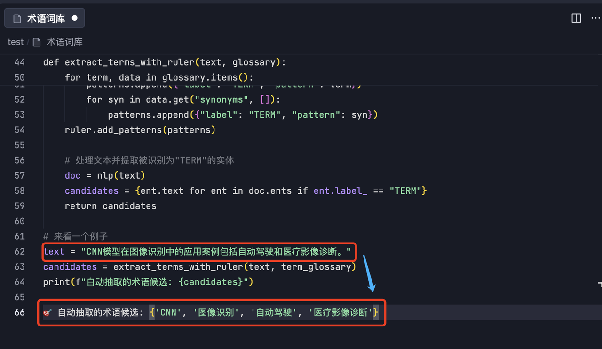

当然，可以直接使用现成是微调模型（如NER实体抽取模型，比如modalscope中）：https://www.modelscope.cn/models/iic/nlp_raner_named-entity-recognition_chinese-base-ecom

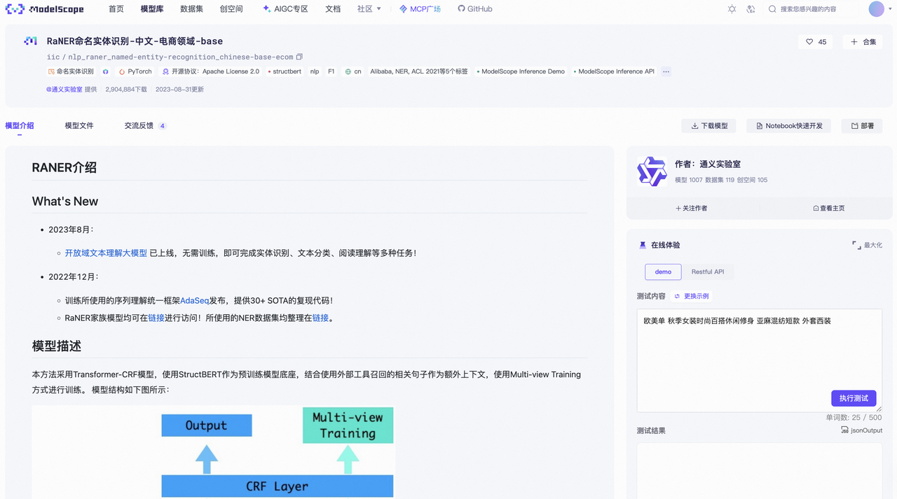

#### **2、嵌入构建与向量化阶段**
目标：将经过清洗与标准化处理的专业术语、高频表达等文本内容，转化为向量且构建高效的向量检索结构，为后续语义匹配和问答召回提供技术支撑。

| **技术方案** | **核心说明** | **对术语一致性的提升** |
| --- | --- | --- |
| **向量索引（FAISS / Pinecone）** | 将标准化术语及其别名嵌入为高维向量，并通过向量索引系统（如FAISS、Pinecone）建立快速检索结构 | 有效提升语义召回效率与精度，增强术语识别能力，支持模糊匹配 |
| **领域专用嵌入模型（Legal-BERT、ChatLaw-Text2Vec）** | 在法律、金融、医疗等垂直领域数据上对预训练模型进行领域适配微调，生成更贴近业务语境的向量表示 | 强化专业语义理解，减少术语歧义，提升领域术语的一致性表示 |
| **Sentence Transformers + PEFT（LoRA微调）** | 利用轻量参数高效调优（如LoRA），对基础语义模型进行小样本快速适配 | 针对特定任务进行语义表示优化，适用于长尾术语、复杂表达的补充建模 |

**3.1 基于向量相似度发现同义词**

【示例代码】

这个脚本的功能包括：（1）语义相似度计算 : 使用sentence-transformers计算术语间的余弦相似度；（2）智能同义词映射 : 根据相似度阈值自动匹配同义词；（3）详细结果展示 : 显示每对术语的相似度分数和匹配状态

**==高度依赖于嵌入模型的质量、可以指定相似度的阈值（示例代码中是0.8）==**

```Python
from sentence_transformers import SentenceTransformer, util

# 建议在项目初始化时加载模型，避免重复加载
# model = SentenceTransformer('paraphrase-MiniLM-L6-v2')

def map_synonyms_by_similarity(main_terms: list, candidates: list, threshold: float = 0.8) -> dict:
    """
    通过计算向量余弦相似度，将候选词映射到最接近的标准术语。

    Args:
        main_terms (list): 标准术语列表。
        candidates (list): 待匹配的候选同义词列表。
        threshold (float): 判断为同义词的相似度阈值。

    Returns:
        dict: 映射成功的同
    """
    _matched_synonyms = {term: [] for term in main_terms}

    if not main_terms or not candidates:
        return _matched_synonyms

    # 批量编码以提升效率
    embeddings = model.encode(main_terms + candidates, convert_to_tensor=True)
    term_embeddings = embeddings[:len(main_terms)]
    candidate_embeddings = embeddings[len(main_terms):]

    # 计算标准术语与所有候选词的余弦相似度矩阵
    similarity_matrix = util.cos_sim(term_embeddings, candidate_embeddings)

    for i, term in enumerate(main_terms):
        for j, candidate in enumerate(candidates):
            if similarity_matrix[i][j] > threshold:
                _matched_synonyms[term].append(candidate)

    return _matched_synonyms

 # 示例：
main_terms_to_map = ["卷积神经网络", "神经网络"]
all_possible_synonyms = ["CNN", "ConvNet", "人工神经网络", "NN", "神经系统", "深度学习模型"]

optimized_mapped_synonyms = map_synonyms_by_similarity(main_terms_to_map, all_possible_synonyms)
print("\n优化后匹配的别名:", optimized_mapped_synonyms)
```

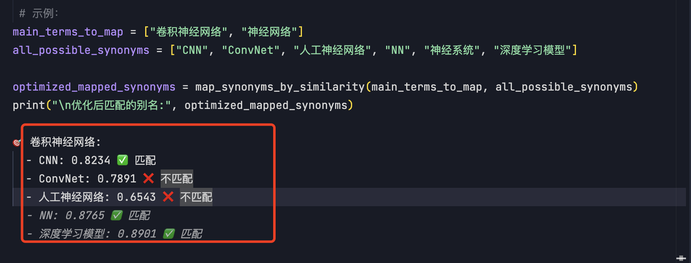

**3.2 构建术语向量索引**

自己构建 or 用微调过的embeding模型：

-自己构建：

（1）先下载模型

【示例代码】

用的是 ==paraphrase-multilingual-MiniLM-L12-v2 模型==，因为支持中文并且在多语言任务中表现良好

```Python
import os

# 定义你的代理地址
proxy_url = 'http://127.0.0.1:4780'

# 为HTTP和HTTPS流量设置代理
# 大多数模型下载等操作都通过HTTPS，所以 'HTTPS_PROXY' 至关重要
os.environ['HTTP_PROXY'] = proxy_url
os.environ['HTTPS_PROXY'] = proxy_url

print("代理环境变量已设置。")
print(f"HTTP_PROXY: {os.getenv('HTTP_PROXY')}")
print(f"HTTPS_PROXY: {os.getenv('HTTPS_PROXY')}")

# --- 在这里开始你的正常代码 ---
# 例如，现在加载模型，它将通过指定的代理进行下载
from sentence_transformers import SentenceTransformer

# 只有在模型未被缓存时，才会通过代理下载
model_name = 'paraphrase-multilingual-MiniLM-L12-v2'
print(f"\n正在尝试加载模型 '{model_name}'...")
try:
    model = SentenceTransformer(model_name)
    print("模型加载/下载成功！")
except Exception as e:
    print(f"加载模型时出错: {e}")
    print("请检查您的代理服务是否正在运行，并且地址和端口是否正确。")
```

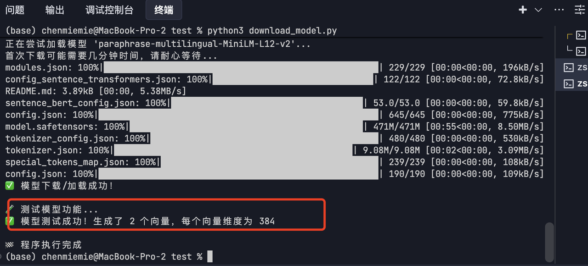

（2）将术语存入向量数据库

【示例代码】

```Python
import faiss
import numpy as np
from sentence_transformers import SentenceTransformer

def build_term_vector_index(term_glossary: dict, model: SentenceTransformer) -> tuple:
    """
    将术语词库中的所有术语及其别名转换为向量，并构建FAISS索引。    Args:
        term_glossary (dict): 结构化的术语词库。键为标准术语，值为包含'synonyms'列表的字典。
        model (SentenceTransformer): 已加载的SentenceTransformer模型实例。

    Returns:
        tuple: (faiss.Index, list) 返回构建好的FAISS索引对象和与之对应的术语列表。
    """
    terms_to_index = []
    # 遍历术语映射字典，收集所有标准术语和别名    # 修正点：将 term_mapping_dict 修改为 term_glossary
    for standard_term, info in term_glossary.items():
        terms_to_index.append(standard_term)
        if "synonyms" in info and isinstance(info["synonyms"], list):
            terms_to_index.extend(info["synonyms"])

    unique_terms_to_index = sorted(list(set(terms_to_index)))

    print("正在生成术语向量...")
    embeddings = model.encode(unique_terms_to_index, show_progress_bar=True)

    embeddings = embeddings.astype('float32')
    dimension = embeddings.shape[1]

    index = faiss.IndexFlatL2(dimension)
    index.add(embeddings)

    print(f"FAISS索引构建完成。包含 {index.ntotal} 个向量，维度为 {dimension}。")
    return index, unique_terms_to_index

# 1. 加载模型
model = SentenceTransformer('paraphrase-multilingual-MiniLM-L12-v2')

# 2. 准备术语数据
term_mapping_example = {
    "卷积神经网络": {"synonyms": ["CNN", "ConvNet"]},
    "Transformer": {"synonyms": ["transformer", "TRANSFORMER"]},
    "图像识别": {"synonyms": ["图像分类", "视觉识别"]}
}

# 3. 使用修正后的函数进行调用
faiss_index, indexed_term_list = build_term_vector_index(term_mapping_example, model)

# 4. 验证结果
print("\n--- 索引构建成功 ---")
print(f"FAISS 索引中的向量数量: {faiss_index.ntotal}")
print(f"被索引的术语列表: {indexed_term_list}")
```

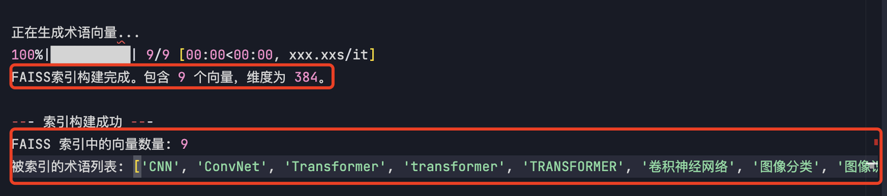

验证：如何调用该函数并获取索引和术语列表的示例

```Python
# --- 第2部分：定义我们的核心检索函数 ---

def search_similar_terms(query_text: str, model: SentenceTransformer, index: faiss.Index, term_list: list, k: int = 5):
    """
    在FAISS索引中检索与查询文本最相似的k个术语。

    Args:
        query_text (str): 用户输入的查询词。
        model (SentenceTransformer): 用于编码查询词的模型。
        index (faiss.Index): FAISS索引对象。
        term_list (list): 与索引向量顺序一致的术语列表。
        k (int): 希望返回的最相似结果的数量。
    """
    print(f"\n--- 正在执行检索 ---")
    print(f"查询: '{query_text}'")

    # 1. 将查询文本编码为向量
    query_vector = model.encode([query_text])
    query_vector = query_vector.astype('float32')

    # 2. 在FAISS索引中执行搜索
    # index.search返回两个数组：D (distances) 和 I (indices)
    distances, indices = index.search(query_vector, k)

    # 3. 解析并打印结果
    print("检索结果:")
    for i in range(k):
        idx = indices[0][i]
        dist = distances[0][i]
        term = term_list[idx]

        # 对于IndexFlatL2，距离是平方欧氏距离，距离越小代表越相似
        print(f"  Top {i+1}: 术语='{term}',  距离={dist:.4f} (值越小越相似)")


# 4. === 演示效果 ===

# **案例一：用别名查询标准术语**
# 目标：测试系统能否理解 "CNN" 就是 "卷积神经网络"。
search_similar_terms(query_text="CNN", model=model, index=faiss_index, term_list=indexed_term_list, k=3)

# **案例二：语义相近查询（核心优势展示）**
# 目标：查询一个不在我们词库中，但意思相近的词 "计算机视觉"。
# 预期：系统应该能找到 "图像识别" 或 "视觉识别" 等相关术语。
search_similar_terms(query_text="计算机视觉", model=model, index=faiss_index, term_list=indexed_term_list, k=3)

# **案例三：用一个更宽泛的词查询**
# 目标：查询 "语言模型"，看是否能找到更具体的 "大型语言模型" 或 "自然语言处理"。
search_similar_terms(query_text="语言模型", model=model, index=faiss_index, term_list=indexed_term_list, k=3)

# **案例四：测试对轻微噪声的容忍度**
# 目标：查询一个不存在的、略有差异的词 "变换器模型"，看是否能正确匹配到 "Transformer模型"。
search_similar_terms(query_text="变换器模型", model=model, index=faiss_index, term_list=indexed_term_list, k=3)
```

| 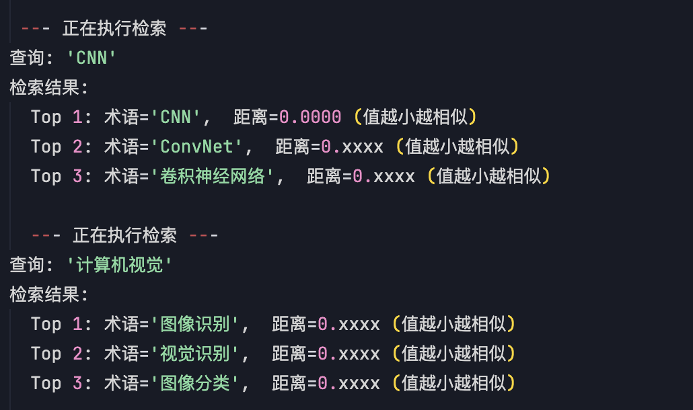 | 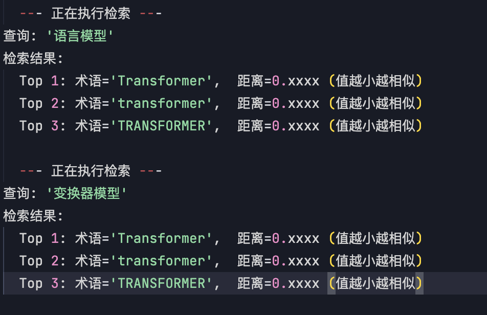 |
| --- | --- |

-用微调过的embedding模型：

也可以直接使用现成是领域向量模型（如modalscope中 法律embedding模型）：

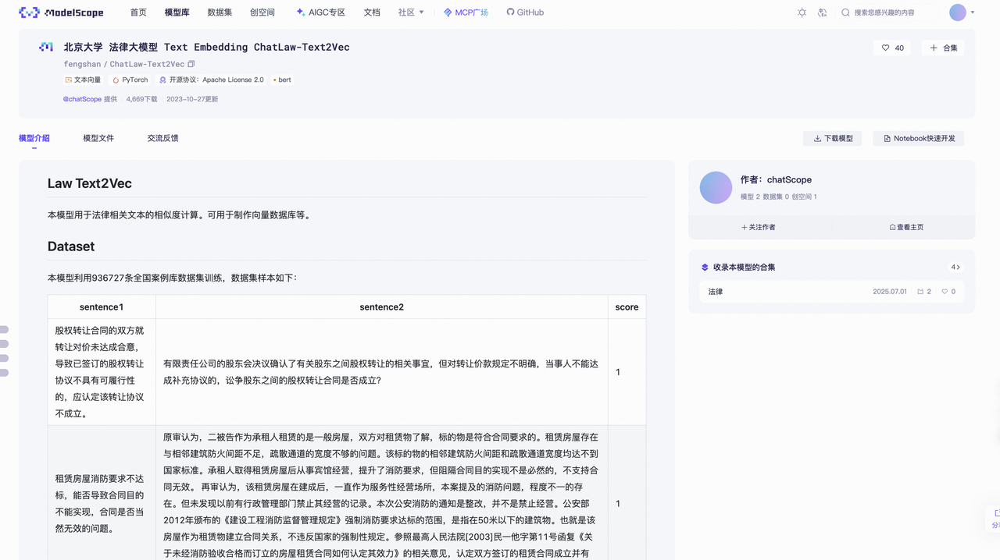

#### **3、 检索增强阶段（核心应用场景）**
RAG系统中，为了提升术语检索的广度与准确性，构建术语词库并配合多种检索增强技术是关键手段之一。分为初步召回与精细排序两个阶段，具体应用方式如下：

==其中1、2 配合术语词库效果更好==

| **技术方式** | **应用原理** | **对术语识别与匹配的优势** |
| --- | --- | --- |
| **多查询扩展与重写（MultiQueryRetriever）** | 借助大语言模型（LLM）生成多个语义相近的查询改写，再合并各自检索结果 | 自动补充用户未显式提出的同义术语及相关表述，显著增强对多样术语的识别与覆盖能力 |
| **HyDE（假设文档嵌入）** | 基于查询意图生成一份“理想回答”，并将其作为文档嵌入参与检索 | 利用上下文丰富的假设答案，有效缓解术语原始表达模糊或信息不全的困境，提升相关性召回 |
| **混合检索（BM25 + FAISS）** | 同时结合关键词匹配（如 BM25）与语义向量检索（如 FAISS） | 兼顾术语的字面精确匹配与语义层级相似性，确保基础术语不遗漏，并发掘潜在相关概念 |
| **交叉编码器重排序（BGE-reranker）** | 利用复杂交叉编码器模型对候选结果进行深度匹配排序 | 基于术语与上下文间的交互建模，进一步提升语义匹配的精度与排序质量 |

先安装2个包：langchain

```Python
! pip install langchain_community
! pip install langchain langchain-openai faiss-cpu sentence-transformers
```

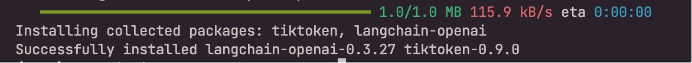

**1、查询扩展与重写（使用langchain的MultiQueryRetriever的函数）**

```Python
 ## 查询扩展与重写
from langchain.retrievers.multi_query import MultiQueryRetriever
from langchain_community.vectorstores import FAISS
from langchain_openai import OpenAIEmbeddings, ChatOpenAI
from langchain.text_splitter import RecursiveCharacterTextSplitter
from langchain_community.document_loaders import TextLoader
import os

# --- 准备工作：设置API Key并创建向量数据库 ---

# 设置你的OpenAI API Key
# os.environ["OPENAI_API_KEY"] = "sk-..."

# 1. 准备示例文档
# 创建一些包含专业术语的示例文本
doc_text = """
卷积神经网络（CNN）是深度学习中的一种关键模型，尤其在图像识别领域表现出色。
它的核心在于通过卷积层和池化层自动提取图像的局部特征。

与CNN不同，Transformer模型最初应用于自然语言处理（NLP）任务，
例如机器翻译。如今，它也被成功应用于计算机视觉，称为Vision Transformer。

大型语言模型（LLM）是当前AI研究的热点，它基于Transformer架构，
能够理解和生成类似人类的文本，展现出强大的推理能力。
"""
with open("sample_tech_doc.txt", "w", encoding="utf-8") as f:
    f.write(doc_text)

# 2. 加载和切分文档
loader = TextLoader("sample_tech_doc.txt", encoding="utf-8")
documents = loader.load()
text_splitter = RecursiveCharacterTextSplitter(chunk_size=100, chunk_overlap=20)
docs = text_splitter.split_documents(documents)

# 3. 创建向量数据库
embeddings = OpenAIEmbeddings()
vectorstore = FAISS.from_documents(docs, embeddings)

# --- MultiQueryRetriever 实现 ---

# 4. 初始化LLM和检索器
llm = ChatOpenAI(temperature=0)
retriever_from_llm = MultiQueryRetriever.from_llm(
    retriever=vectorstore.as_retriever(), llm=llm
)

# 5. 执行查询
query = "CNN是什么？"
retrieved_docs = retriever_from_llm.invoke(query)

# --- 效果分析 ---print(f"原始查询: {query}")print("\n--- MultiQueryRetriever 生成的查询变体 ---")# MultiQueryRetriever 内部有日志记录生成的查询，这里我手动展示其可能生成的查询# 实际使用中可以通过设置 logging.basicConfig(level=logging.INFO) 查看generated_queries = [    "卷积神经网络的定义是什么？",    "CNN模型在深度学习中的作用是什么？",    "介绍一下卷积神经网络（CNN）。"
]
for i, q in enumerate(generated_queries):
    print(f"查询变体 {i+1}: {q}")

print("\n--- 最终检索到的文档内容 ---")
for doc in retrieved_docs:
    print(doc.page_content)

```

效果：

```Python
原始查询: CNN是什么？--- MultiQueryRetriever 生成的查询变体 ---查询变体 1: 卷积神经网络的定义是什么？查询变体 2: CNN模型在深度学习中的作用是什么？查询变体 3: 介绍一下卷积神经网络（CNN）。

--- 最终检索到的文档内容 ---
卷积神经网络（CNN）是深度学习中的一种关键模型，尤其在图像识别领域表现出色。
它的核心在于通过卷积层和池化层自动提取图像的局部特征。
与CNN不同，Transformer模型最初应用于自然语言处理（NLP）任务，
例如机器翻译。如今，它也被成功应用于计算机视觉，称为Vision Transformer。
大型语言模型（LLM）是当前AI研究的热点，它基于Transformer架构，
能够理解和生成类似人类的文本，展现出强大的推理能力。
```

**2、Hyde（设性文档嵌入)（使用langchain的MultiQueryRetriever的函数）**

先安装1个包：langchain

```Python
! pip install --upgrade langchain langchain-community langchain-openai rank_bm25 faiss-cpu
```

```Python
import os
from langchain.retrievers import MergerRetriever
from langchain_community.retrievers import BM25Retriever
from langchain_community.vectorstores import FAISS
from langchain_openai import OpenAIEmbeddings
from langchain.text_splitter import RecursiveCharacterTextSplitter
from langchain_community.document_loaders import TextLoader

# --- 1. 准备工作：设置API Key并准备数据 ---

# os.environ["OPENAI_API_KEY"] = "sk-..."

# 准备示例文档
doc_text = """
第一部分：关于卷积网络。
卷积神经网络（CNN）是深度学习中的一种关键模型，尤其在图像识别领域表现出色。
它的核心在于通过卷积层和池化层自动提取图像的局部特征。CNN的这个特性让它非常高效。

第二部分：关于Transformer。
与CNN不同，Transformer模型最初应用于自然语言处理（NLP）任务，
例如机器翻译。如今，一种被称为Vision Transformer（ViT）的变体也被成功应用于计算机视觉领域。

第三部分：关于大模型。
大型语言模型（LLM）是当前AI研究的热点，它通常基于Transformer架构，
能够理解和生成类似人类的文本，展现出强大的推理能力。
"""
with open("hybrid_search_doc.txt", "w", encoding="utf-8") as f:
    f.write(doc_text)

# 加载和切分文档
loader = TextLoader("hybrid_search_doc.txt", encoding="utf-8")
documents = loader.load()
text_splitter = RecursiveCharacterTextSplitter(chunk_size=120, chunk_overlap=20)
docs = text_splitter.split_documents(documents)

print(f"文档已被切分为 {len(docs)} 个块。")

# --- 2. 构建两个不同的检索器 ---

# **检索器一：FAISS 向量检索器 (用于语义匹配)**
print("\n正在构建FAISS向量检索器...")
embeddings = OpenAIEmbeddings()
vectorstore = FAISS.from_documents(docs, embeddings)
faiss_retriever = vectorstore.as_retriever(search_kwargs={"k": 3})
print("FAISS检索器构建完成。")

# **检索器二：BM25 关键词检索器 (用于精确匹配)**
print("\n正在构建BM25关键词检索器...")
# BM25Retriever可以直接从文档列表初始化，它不需要嵌入模型
bm25_retriever = BM25Retriever.from_documents(docs)
bm25_retriever.k = 3
print("BM25检索器构建完成。")

# --- 3. 使用 MergerRetriever 合并 ---

print("\n正在初始化 MergerRetriever...")
# 创建一个检索器列表
retriever_list = [bm25_retriever, faiss_retriever]

# 初始化 MergerRetriever
# 它会自动处理并行检索和结果去重
merged_retriever = MergerRetriever(retrievers=retriever_list)
print("MergerRetriever 初始化完成。")

# --- 4. 执行查询并对比效果 ---

query = "ViT的技术细节"
print(f"\n\n--- 正在执行混合检索 ---")
print(f"查询: '{query}'")

# **为了对比，我们先看看每个检索器单独工作的结果**
print("\n--- 单独检索结果对比 ---")
bm25_results = bm25_retriever.invoke(query)
print(f"【BM25 关键词检索结果】(共 {len(bm25_results)} 条):")
for doc in bm25_results:
    print(f"  - {doc.page_content[:50]}...")

faiss_results = faiss_retriever.invoke(query)
print(f"\n【FAISS 向量检索结果】(共 {len(faiss_results)} 条):")
for doc in faiss_results:
    print(f"  - {doc.page_content[:50]}...")

# **现在看看 MergerRetriever 的混合结果**print("\n--- MergerRetriever 混合检索结果 ---")merged_results = merged_retriever.invoke(query)print(f"【最终混合结果】(共 {len(merged_results)} 条，已去重):")for doc in merged_results:    print(f"  - {doc.page_content[:50]}...")
```

效果：

```Markdown
文档已被切分为 3 个块。

正在构建FAISS向量检索器...
FAISS检索器构建完成。

正在构建BM25关键词检索器...
BM25检索器构建完成。

正在初始化 MergerRetriever...
MergerRetriever 初始化完成。


--- 正在执行混合检索 ---
查询: 'ViT的技术细节'

--- 单独检索结果对比 ---
【BM25 关键词检索结果】(共 3 条):
  - 第三部分：关于大模型。
大型语言模型（LLM）是当前AI研究的热点，它通常基于Transformer...
  - 第二部分：关于Transformer。
与CNN不同，Transformer模型最初应用于自然语言处...
  - 第一部分：关于卷积网络。
卷积神经网络（CNN）是深度学习中的一种关键模型，尤其在图像识别领域表现出...

【FAISS 向量检索结果】(共 3 条):
...
  - 第一部分：关于卷积网络。
卷积神经网络（CNN）是深度学习中的一种关键模型，尤其在图像识别领域表现出...
  - 第三部分：关于大模型。
大型语言模型（LLM）是当前AI研究的热点，它通常基于Transformer...
Output is truncated. View as a scrollable element or open in a text editor. Adjust cell output settings...
```

#### **4、 生成控制与输出验证阶段：**
RAG系统的生成阶段，仅依赖检索结果不足以保障术语规范输出，因此需通过多维机制对生成过程进行精准引导与输出质量校验。5种方法已被验证在术语一致性保障中效果显著：

| **技术策略** | **核心做法** | **在术语一致性上的价值体现** |
| --- | --- | --- |
| **提示工程（Prompt Engineering）** | 精细设计提示词，引导大模型在生成中优先使用标准术语，维持预期语风 | 属于最基础也最直接的控制手段，有效影响模型生成的术语用法，减少随机性偏差 |
| **结构化输出（Structured Output）** | 要求输出内容符合预设结构（如 Pydantic 或 JSON Schema），限制自由生成范围 | 从根源上杜绝术语乱用，确保关键信息输出精准、统一且便于后续解析 |
| **输出解析与修复（Output Parsers）** | 结合如 OutFixingParser 等工具，发现格式问题时自动纠错或回退 | 对术语拼写与格式错误具备容错能力，提升结构化输出的可靠性与完整性 |
| **后处理增强（Post-processing）** | 在生成文本后加入术语高亮、弹窗说明或来源链接等可解释性内容 | 增强最终回答的术语透明度，便于用户理解和溯源，提升可信度 |
| **LLM 自动评审（LLM-as-a-Judge）** | 引入另一个 LLM 对生成结果进行术语一致性打分或审核 | 提供一种可扩展的自动化术语质检方案，适用于规模化输出的合规性控制 |

（1）生成时控制：结构化输出：术语可以额外样式或解释，用户更友好，回答质量更高

```Python
import os
from typing import List

# 修正点：直接从 pydantic 库导入 BaseModel 和 Field
from pydantic import BaseModel, Field

from langchain_core.prompts import ChatPromptTemplate
from langchain_openai import ChatOpenAI

# --- 1. 准备工作 ---
# os.environ["OPENAI_API_KEY"] = "sk-..."
llm = ChatOpenAI(temperature=0, model="gpt-4o")

# --- 2. 定义期望的输出结构 (使用 Pydantic V2) ---
class TerminologyInAnswer(BaseModel):
    """一个包含标准答案和其中使用的技术术语的结构化模型。"""
    answer: str = Field(description="对用户问题的详细、准确的回答。")
    standard_terms_used: List[str] = Field(        description="在回答中明确使用到的、来自官方词库的标准技术术语列表。",        example=["卷积神经网络", "图像识别"]
    )

# --- 3. 创建一个结构化输出链 ---
prompt = ChatPromptTemplate.from_messages([
    ("system", "你是一个精通AI技术的专家。请根据用户的问题，以结构化的形式提供答案。"),
    ("human", "请解释一下什么是CNN，以及它的主要应用领域。")
])

# 使用 .with_structured_output() 将LLM与我们的Pydantic V2模型绑定
# 现在它会默认使用最高效的json_schema模式，而不会产生警告
structured_llm_chain = prompt | llm.with_structured_output(TerminologyInAnswer)

# --- 4. 执行链并查看结果 ---print("--- 正在执行结构化输出链 ---")structured_response = structured_llm_chain.invoke({})print("\n--- LLM返回的结构化对象 ---")print(structured_response)print("\n--- 对结果的分析 ---")print(f"回答内容: {structured_response.answer}")print(f"模型确认使用的标准术语: {structured_response.standard_terms_used}")if "卷积神经网络" in structured_response.standard_terms_used:    print("验证通过：答案中正确地使用了标准术语'卷积神经网络'。")

# --- 5. 内容增强：自动添加术语解释 ---
print("\n" + "="*50)
print("--- 开始执行内容增强 ---")

# 假设已有这样一个简化的术语词库glossary = {    "卷积神经网络": "一种特殊的深度学习模型，擅长处理图像数据。",    "深度学习": "机器学习的一个分支，它基于人工神经网络。",    "图像识别": "计算机视觉中的一个核心任务，旨在识别和分类图像中的对象。"}# 获取LLM生成的答案文本llm_answer_text = structured_response.answerdef enhance_text_with_definitions(text: str, term_glossary: dict) -> str:    """    在文本中查找标准术语，并为其添加Markdown格式的悬浮注释。    """    enhanced_text = text    for term, definition in term_glossary.items():        # 创建带注释的Markdown/HTML格式        replacement = f'<abbr title="{definition}">{term}</abbr>'        # 替换文本中的术语        enhanced_text = enhanced_text.replace(term, replacement)    return enhanced_text# 执行内容增强final_output = enhance_text_with_definitions(llm_answer_text, glossary)print("\n--- 内容增强后的最终输出 (在支持HTML的Markdown渲染器中查看) ---")print(final_output)
```

效果：

```Markdown
--- 正在执行结构化输出链 ---

--- LLM返回的结构化对象 ---
answer='卷积神经网络（Convolutional Neural Network, CNN）是一种深度学习模型，专门用于处理具有网格结构的数据，例如图像。CNN通过使用卷积层来提取输入数据的特征，通常包括卷积层、池化层和全连接层。卷积层通过卷积运算提取局部特征，池化层用于减少特征图的尺寸，从而降低计算复杂度。\n\n主要应用领域包括：\n\n1. **图像识别**：CNN在图像分类任务中表现出色，能够识别和分类图像中的对象。\n2. **目标检测**：用于在图像中定位和识别多个对象。\n3. **图像分割**：将图像划分为不同的区域或对象。\n4. **自然语言处理**：在文本分类和情感分析等任务中也有应用。\n5. **医学影像分析**：用于分析医学图像，如X光片和MRI扫描。\n6. **自动驾驶**：用于识别道路标志、行人和其他车辆。' standard_terms_used=['卷积神经网络', '图像识别', '目标检测', '图像分割', '自然语言处理', '医学影像分析', '自动驾驶']

--- 对结果的分析 ---
回答内容: 卷积神经网络（Convolutional Neural Network, CNN）是一种深度学习模型，专门用于处理具有网格结构的数据，例如图像。CNN通过使用卷积层来提取输入数据的特征，通常包括卷积层、池化层和全连接层。卷积层通过卷积运算提取局部特征，池化层用于减少特征图的尺寸，从而降低计算复杂度。

主要应用领域包括：

1. **图像识别**：CNN在图像分类任务中表现出色，能够识别和分类图像中的对象。
2. **目标检测**：用于在图像中定位和识别多个对象。
3. **图像分割**：将图像划分为不同的区域或对象。
4. **自然语言处理**：在文本分类和情感分析等任务中也有应用。
5. **医学影像分析**：用于分析医学图像，如X光片和MRI扫描。
6. **自动驾驶**：用于识别道路标志、行人和其他车辆。
模型确认使用的标准术语: ['卷积神经网络', '图像识别', '目标检测', '图像分割', '自然语言处理', '医学影像分析', '自动驾驶']
验证通过：答案中正确地使用了标准术语'卷积神经网络'。

==================================================
--- 开始执行内容增强 ---

--- 内容增强后的最终输出 (在支持HTML的Markdown渲染器中查看) ---<abbr title="一种特殊的<abbr title="机器学习的一个分支，它基于人工神经网络。">深度学习</abbr>模型，擅长处理图像数据。">卷积神经网络</abbr>（Convolutional Neural Network, CNN）是一种<abbr title="机器学习的一个分支，它基于人工神经网络。">深度学习</abbr>模型，专门用于处理具有网格结构的数据，例如图像。CNN通过使用卷积层来提取输入数据的特征，通常包括卷积层、池化层和全连接层。卷积层通过卷积运算提取局部特征，池化层用于减少特征图的尺寸，从而降低计算复杂度。...3. **图像分割**：将图像划分为不同的区域或对象。4. **自然语言处理**：在文本分类和情感分析等任务中也有应用。5. **医学影像分析**：用于分析医学图像，如X光片和MRI扫描。6. **自动驾驶**：用于识别道路标志、行人和其他车辆。Output is truncated. View as a scrollable element or open in a text editor. Adjust cell output settings...
```

（2）生成后处理：验证与内容增强

```Python
# 假设已有这样一个简化的术语词库
glossary = {
    "卷积神经网络": "一种特殊的深度学习模型，擅长处理图像数据。",
    "Transformer架构": "一种基于自注意力机制的神经网络结构，在NLP领域取得巨大成功。",
    "大型语言模型": "基于海量数据训练的、参数规模巨大的语言模型。"
}

# 假设这是LLM返回的、已经验证过的答案文本
llm_answer_text = "大型语言模型通常基于Transformer架构，而卷积神经网络则在图像处理方面是主流。"

def enhance_text_with_definitions(text: str, term_glossary: dict) -> str:
    """
    在文本中查找标准术语，并为其添加Markdown格式的悬浮注释。
    在支持HTML的Markdown渲染器中，这通常会显示为鼠标悬停提示。
    """
    enhanced_text = text
    for term, definition in term_glossary.items():
        # 创建带注释的Markdown/HTML格式
        replacement = f'<abbr title="{definition}">{term}</abbr>'
        # 替换文本中的术语
        enhanced_text = enhanced_text.replace(term, replacement)
    return enhanced_text

# 执行内容增强
final_output = enhance_text_with_definitions(llm_answer_text, glossary)

print("\n--- 内容增强后的输出 ---")
print(final_output)
```

效果：

```XML
--- 内容增强后的输出 ---
<abbr title="基于海量数据训练的、参数规模巨大的语言模型。">大型语言模型</abbr>通常基于<abbr title="一种基于自注意力机制的神经网络结构，在NLP领域取得巨大成功。">Transformer架构</abbr>，而<abbr title="一种特殊的深度学习模型，擅长处理图像数据。">卷积神经网络</abbr>则在图像处理方面是主流。
```

#### **5、术语词库的评估和反馈：**
让LLM做评委：

```Python
import os
from typing import List
from pydantic import BaseModel, Field
from langchain_core.prompts import ChatPromptTemplate
from langchain_core.output_parsers import JsonOutputParser
from langchain_openai import ChatOpenAI

# --- 1. 准备工作 ---
# os.environ["OPENAI_API_KEY"] = "sk-..."
evaluator_llm = ChatOpenAI(temperature=0, model="gpt-4o")

# --- 2. 定义评估结果的结构化模型 ---
class TerminologyEvaluation(BaseModel):
    """用于评估术语一致性的结构化模型。"""
    consistency_score: int = Field(description="一个从1到5的分数，5代表完全一致，1代表严重不一致。")
    is_consistent: bool = Field(description="布尔值，是否整体上符合术语规范。")
    reasoning: str = Field(description="对评分的详细解释，指出做得好的地方和存在的问题。")
    suggestions_for_improvement: List[str] = Field(description="为改进答案中的术语使用提出的具体建议。")

# --- 3. 构建评估链 ---
# 创建一个专门的评估提示
evaluation_prompt_template = """
你是一个严格的AI技术文档质量评估员，你的核心任务是评估一段回答在术语使用上的一致性和准确性。**评估标准:**1.  **准确性**: 是否正确地使用了标准术语？2.  **规范性**: 是否避免了使用非官方的、易产生歧义的别名？3.  **全面性**: 是否在必要时使用了最能表达其意的标准术语？**权威术语词库 (部分):**- 卷积神经网络 (别名: CNN)- Transformer模型 (别名: Transformer)- 大语言模型 (别名: LLM)**待评估的回答:**{answer_text}请根据以上标准和词库，以JSON格式输出你的评估结果。"""

prompt = ChatPromptTemplate.from_template(evaluation_prompt_template)
parser = JsonOutputParser(pydantic_object=TerminologyEvaluation)

# 使用LCEL构建评估链
evaluation_chain = prompt | evaluator_llm | parser

# --- 4. 执行评估 ---

# 案例一：一个使用规范的回答
good_answer = "大语言模型（LLM）是基于Transformer模型构建的，而卷积神经网络（CNN）则在图像领域应用广泛。"

# 案例二：一个使用了非标准术语的回答
bad_answer = "大模型是基于变换器架构的，而卷基神经网络在图片处理上很强。"

print("--- 正在评估【优秀回答】---")
good_evaluation_result = evaluation_chain.invoke({"answer_text": good_answer})
print(good_evaluation_result)

print("\n--- 正在评估【待改进回答】---")
bad_evaluation_result = evaluation_chain.invoke({"answer_text": bad_answer})
print(bad_evaluation_result)
```

效果：

```SQL
--- 正在评估【优秀回答】---
{'准确性': {'评价': '高', '说明': "回答中正确使用了'大语言模型'、'Transformer模型'和'卷积神经网络'等标准术语。"}, '规范性': {'评价': '高', '说明': '回答中避免了使用非官方的、易产生歧义的别名，使用的术语均为官方标准术语。'}, '全面性': {'评价': '高', '说明': '回答在必要时使用了最能表达其意的标准术语，清晰地传达了大语言模型与Transformer模型的关系，以及卷积神经网络的应用领域。'}}

--- 正在评估【待改进回答】---
{'准确性': {'评价': '不准确', '问题': "使用了不正确的术语'卷基神经网络'，应为'卷积神经网络'。"}, '规范性': {'评价': '不规范', '问题': "使用了非官方的术语'大模型'，应为'大语言模型'或其别名'LLM'。"}, '全面性': {'评价': '不全面', '问题': "未使用最能表达其意的标准术语'Transformer模型'，而是使用了非标准的'变换器架构'。"}}
```

#### 6、总结
从数据预处理到生成验证全流程，已构建起一整套保障术语一致性的技术体系。以下是按优化阶段划分的术语一致性解决方案全景图：

| **优化阶段** | **关键技术与解决方向** |
| --- | --- |
| 基础构建 | 从术语词表建设、术语抽取到嵌入生成与预处理标准化 ，夯实术语一致性的根基，确保模型输入具备语义可控性与规范性。 |
| 关键增强 | 引入混合检索（如 BM25 + 向量索引）、查询改写（MultiQuery）、假设文档生成（HyDE）及交叉编码器排序 等方式，全面提升术语检索覆盖与召回质量。 |
| 辅助优化 | 结合领域微调与上下文语义块建模 ，增强术语识别的上下文感知与语义连贯性，进一步提升术语精度。 |
| 生成控制 | 借助提示工程、 结构化输出、输出解析修复 等手段，引导生成阶段稳定输出标准术语格式与内容。 |
| 持续保障 | 构建术语一致性评价机制，如 LLM 自动评审 、用户闭环反馈与日志审计，支持长期可持续的质量迭代与优化闭环。 |

## **4.11**RAG 如何选择合适的 LLM?
选择合适的 LLM 不是直接选用最强大、最先进模型的问题。因为在企业实际应用场景中，需要综合考虑准确性、用户体验、成本等诸多因素。有以下4个原则：

**1、不同的任务环节选择不同的LLM：**

RAG 应用并不只有生成阶段才会需要 LLM，在索引、路由、查询重写、生成等阶段都需要 LLM，针对这些不同的任务要求使用不同的模型组合可以更好地发挥整体优势。

**2、最强大与最先进的模型并不总是最合适的模型：**

不能基于简单的官方宣传或者公开测试报告做直接选择，对于许多任务而言，较小、成本更低、速度更快的模型可能更适合。比如：如果需要在多个 RAG pipeline中进行决策推理，生成的文本不需要极高的复杂性，但响应时间却至关重要。这时候可能较小的模型可以显著提升响应速度，可能会更合适。

**3、企业应用场景下需要充分考虑部署的要求：**

自托管的模型更适合对数据隐私要求严格的场景，而依赖云端服务的闭源模型则通常提供了更为强大的算力和模型更新频率；此外，开源模型的可定制性可为高度个性化的应用提供支持

**4、通过评估测试的结果进行比较与选择（用数据集进行验证）：**

包括不同模型的生成质量、速度与成本。在 RAG 流程中进行实际验证并最后选择能够在成本、速度与准确性达到平衡的 LLM

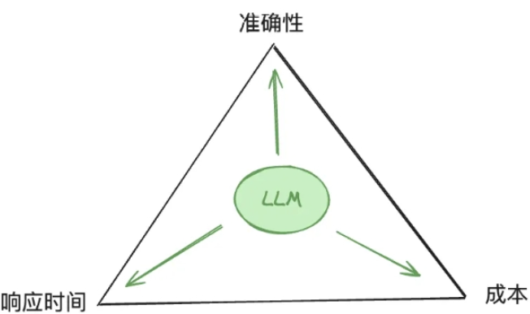

## **4.12 奖励模型（RM）在RAG中的应用**
在LLM对齐问题上，OpenAI提出的 `RLHF` 训练范式最为人熟知： `RLHF` 通常包含三个步骤： `SFT` , `Reward Model` , `PPO` 。 **==奖励模型（Reward Model）是强化学习过程中一个关键的组成部分。它的主要任务是根据给定的输入和反馈来预测奖励值，从而指导学习算法的方向。在RLHF（Reinforcement Learning from Human Feedback）中，Reward Model 通过整合人类反馈，帮助强化学习算法更有效地优化策略。==**可以通过奖励建模优化检索增强生成（RAG）系统的性能

在大语言模型训练中，Reward Model 通常指的是偏好模型（Preference Model）。通过在训练时提供相同提示词的好与坏（chosen&rejected）的回复来拟合人类的偏好，并在推理时预测出一个奖励值，以指导 RLHF 过程中 Actor 模型的优化过程。Reward Model的应用场景包括但不限于：

**RLHF训练**：在使用 Proximal Policy Optimization（PPO）算法进行 RLHF 训练时，Reward Model提供奖励信号，指导模型优化策略，提高生成内容的质量并使其更贴近人类偏好。

**BoN采样**：在 Best-of-N（BoN）采样过程中，用户可以使用 Reward Model 对同一个提示词的多条回复进行打分，并选择奖励得分最高的生成结果，从而提升模型的输出效果。

**数据构造**：Reward Model 可以用于评估和过滤训练数据，或者也可以使用 Reward Model 替代人工标注来构造 DPO 训练数据。

训练过程： **==基于SFT后的模型，在偏好数据集上做训练，最后得到Reward Model。==**

1、 为什么需要 RM 模型?

因为微调后的模型输出可能不符合人类偏好，所以需要利用强化学习优化模型，而奖励模型是强化学习的关键一步，所以需要训练奖励模型。

（1） **模型输出可能不符合人类偏好**

在 SFT 数据有限的情况下，对模型的引导能力是有限的。这将导致预训练模型中原先错误或有害的知识没能在 SFT数据中被纠正，从而出现「有害性」或「幻觉」的问题。

（2） **需要利用强化学习优化模型**

一些让模型脱离昂贵标注数据，自我进行迭代的方法被提出，比如：RLHF，直接告诉模型当前样本的(好坏)得分，最终目的是告知模型什么是好的数据，什么是不好的数据，将大模型训练地更加符合人类偏好

在进行RLHF时，需要奖励模型来评估语言大模型(actor model)回答的是好是坏， 奖励模型的输入是 prompt+answer 的形式，让模型学会对 prompt+answer 进行打分 。奖励模型的目标是构建一个文本质量对比模型，对于同一个提示词，SFT模型给出的多个不同输出结果的质量进行排序。

2、训练数据如何构建？

奖励模型的训练数据是人工对问题的每个答案进行排名，如图；对于每个问题给出多个若干答案，然后人工进行排序，奖励模型利用人工排序结果进行反向训练

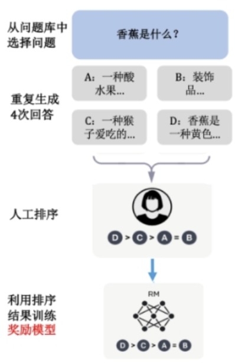

**为什么是人工排序而不是人工打分？**

受不同标注人员主观影响，比起绝对的分数，相对的顺序更利于模型预测。举例：假设想让模型说出对榴莲的评价，模型生成了 ABCD 4个句子（如下），而如果想要训练一个“对榴莲都生成正面评价”的 reward 模型

A:榴莲具有浓郁香味和奶油般的口感。

B:成熟的榴莲可以有甜美的味道,对一些人而言，这是其吸引之处。

C:榴莲的强烈气味是一些人无法忍受的

D:一些人可能不喜欢榴莲的奶油质地和特殊口感。

**打分结果和排序结果如下：可见对于打分的结果模型更容易疑惑（到底应该是几分）而排序更能得到统一的结果，便于模型学习：**

| 生成句子 | 标注员打分1 | 标注员打分2 |
| --- | --- | --- |
| A | 5 | 4.5 |
| B | 4.5 | 4 |
| C | 1 | 0.5 |
| D | 1.5 | 1 |

| 生成句子对 | 标注员打分1 | 标注员打分2 |
| --- | --- | --- |
| A B C D | A>B>C.D | A>B>D>C |

3、RAG-Reward强化学习做RAG的实现思路

《RAG-Reward: Optimizing RAG with Reward Modeling and RLHF》，https://arxiv.org/abs/2501.13264

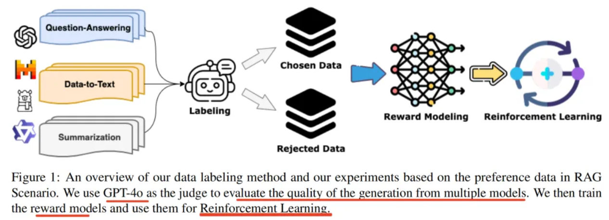

（1）数据集构建：

首先基于现有的RAG数据集构建，涵盖 **问答、数据到文本和总结**三种常见类型。使用WebGLM、Yelp和XSum数据集，每个数据集对应一种RAG场景；从12个候选模型中随机选择两个模型的生成作为偏好对。这些模型包括Llama-3.1-8B-Instruct、Llama-3.2-3B-Instruct、Mistral-7B-Instruct-v0.1等。

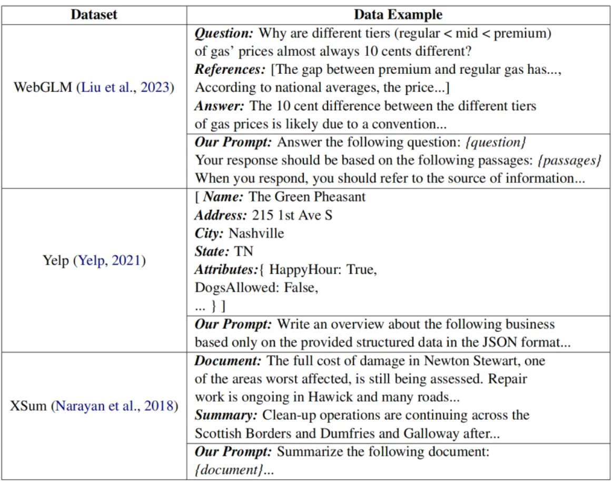

使用GPT-4o作为标注工具，根据4个关键指标（幻觉、全面性、冗长性和归属）比较和选择偏好响应。

接着，将每个样本和两个响应输入GPT-4o，分别基于每个指标进行判断，然后汇总结果构建偏好对；

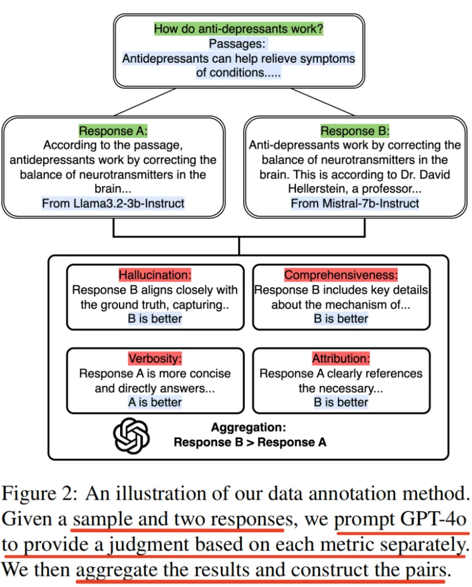

（2） **==✔️引入奖励模型来增强RAG模型==**

《Reward-RAG: Enhancing RAG with Reward Driven Supervision》（https://arxiv.org/pdf/2410.03780）

（1） **数据方面：**给定一个查询和文档，通过计算嵌入向量之间的余弦相似度来确定相关性分数。

（2）为了 **减少收集人类偏好的时间和成本，使用CriticGPT来评估检索文档的相关性。**CriticGPT根据输入的查询和文档生成一个相关性评分，具体实现上，使用少量人类偏好示例来指导CriticGPT模仿人类偏好。

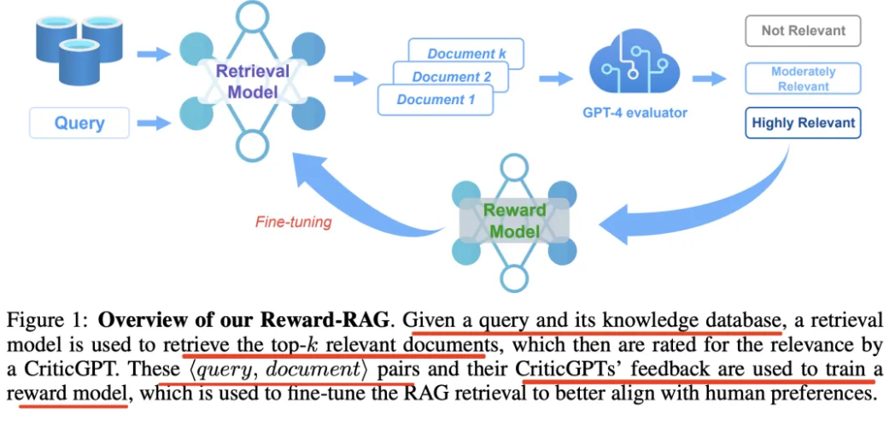

## **4.13 RAG文档检索-负样本挖掘**
在各类检索任务中， **为了训练好一个高质量的检索模型，往往需要从大量的候选样本集合中采样高质量的负例，配合正例一起进行训练**。模 **型的目标是学习如何区分与查询相关的文档（正样本）和不相关的文档（负样本），**通过这种方式，模型可以在实际应用中更准确地检索出与用户查询相关的文档。

举例：

**查询**

用户输入的查询是：“人工智能在医疗领域的应用”。

**正样本**

正样本是与查询高度相关的新闻文章。例如：

**文章1**：标题为“人工智能在医疗诊断中的应用”，内容详细介绍了AI如何帮助医生进行疾病诊断。

**文章2**：标题为“AI驱动的医疗影像分析”，内容讨论了AI在医学影像分析中的应用。

这些文章与查询“人工智能在医疗领域的应用”高度相关，因此它们被标记为正样本。

**负样本**

负样本是与查询不相关的新闻文章。例如：

**文章4**：标题为“全球气候变化的最新研究”，内容讨论了气候变化对地球的影响。这篇文章与查询无关，因为它不涉及人工智能或医疗领域。

**文章5**：标题为“2023年最佳旅游目的地”，内容列出了今年最受欢迎的旅游地点。这篇文章与查询无关，因为它与人工智能或医疗领域无关。

这些文章与查询“人工智能在医疗领域的应用”无关，因此它们被标记为负样本。

**1、负样本构建方法（5种）：**

**（1）随机采样策略（Random sampling）：**直接基于一均匀分布从所有的候选 Document 中随机抽取 Document 作为负例

存在问题：由于无法保证采样得到的负例质量，故经常会采样得到过于简单的负例，其不仅无法给模型带来有用信息，还可能导致模型过拟合，进而无法区分某些较难的负例样本

（2） **Top-K 负例采样策略/困难负采样（Top-K Hard Negative Sampling）**：基于检索模型（如BM25）对所有候选 Document 与 Query 计算匹配分数，然后直接筛选其中 Top-K 的候选 Document 作为负例

优点：可以保证采样得到的负例是模型未能较好区分的较难负例，帮助模型学习更复杂的边界

存在问题：很可能将潜在的正例也误判为负例，即假负例(False Negative)，如果训练模型去将该部分假负例与正例区分开来，反而会导致模型无法准确衡量Query-Document 的语义相似度。需要额外的计算资源来筛选困难负样本

示例：

查询：“人工智能在医疗领域的应用”。

负样本：选择一篇关于“人工智能在金融领域的应用”的文章。虽然与“人工智能”相关，但与“医疗”无关。

（3） **批量负采样（In-batch Negative Sampling）：**在一个训练批次（batch）中，将其他查询的正样本作为当前查询的负样本。

优点：高效，无需额外存储负样本。

缺点：负样本的质量可能不稳定，取决于批次内的数据分布。

示例：

查询1：“人工智能在医疗领域的应用”。

查询2：“气候变化对农业的影响”。

对于查询1，查询2的正样本（如“气候变化对农业的影响”的文章）可以作为查询1的负样本。

（4） **基于点击日志的负采样（Click-based Negative Sampling）：**从用户点击日志中选择未被点击的文档作为负样本。假设用户点击的文档是正样本，而未点击的文档可能是负样本。

优点：基于真实用户行为，负样本更贴近实际应用场景

缺点：需要大量用户行为数据，且未点击的文档不一定是不相关的

示例：

查询：“人工智能在医疗领域的应用”。

负样本：在搜索结果中展示但未被用户点击的文章。

（5） **混合负采样（Mixed Negative Sampling）：结合多种负采样方法，例如随机采样和困难负采样**

优点：兼顾简单负样本和困难负样本，提升模型的泛化能力

缺点：需要平衡不同采样方式的比例

示例：

查询：“人工智能在医疗领域的应用”。

负样本：50%随机负样本（如“旅游”文章）+ 50%困难负样本（如“人工智能在金融领域的应用”文章）。

**2、负样本构建注意事项：**

（1）负样本数量：负样本的数量通常远多于正样本，但需要避免样本不平衡

（2）质量：高质量的负样本可以显著提升模型性能

（3）多样性：负样本应覆盖不同的不相关场景，以增强模型的泛化能力

## **4.14 （RAG架构专题——前沿论文及方法）**
### **4.14.1 RAG Fusion（RAG融合）**
在传统RAG框架中的检索过程存在很多局限，通过RAG-Fusion 这一思路来弥合“用户查询的问题和他们想要询问的问题”之间的差距，从而提高 RAG 的效果

1、工作机制： 其实只增加了query重写、重排

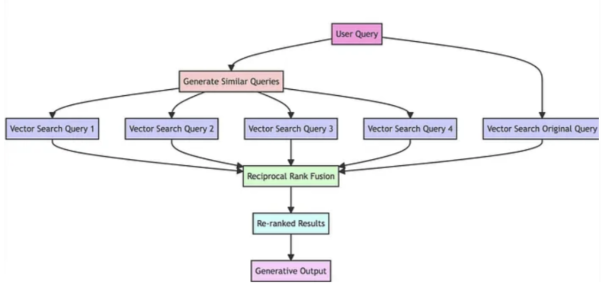

```JSON
RAG-Fusion的工作步骤:
（1）查询语句的相关性:通过LLM将用户的查询转换为相似但不同的查询。——对应query重写（见6.3、4、query重写的5种策略）（2）并发的向量搜索：对原始查询及其新生成的同级查询执行并发的向量搜索。——对原始的 user query 和生成的 generated query 执行 vector search

（3）智能重新排名：聚合和细化所有结果使用倒数排序融合(RRF)。
       倒数排序融合(RRF)是一种将具有不同相关性指标的多个结果集组合成单个结果集的方法，不同的相关性指标 也不必相互关联即可获得高质量的结果。该方法的优势在于不利用相关分数，而仅靠排名计算。——对应重排（见4.2.4 Rerank重新排序）（4）最后生成：用精心挑选的结果引导LLM进行输出。——将检索到的结果和 query 填入 prompt template，输入给 LLM 引导其生成回复
```

2、实现细节：

（1）Multi-Query Generation（即query重写， ==见6.3、4、query重写的5种策略）==：传统 RAG 是用一个 user query 来做检索，这种方法存在一个局限性：单个查询可能无法涵盖用户感兴趣的全部内容，或者范围太窄而无法产生全面的结果。RAG-Fusion 从多个不同的角度来生成多个 query 来进行检索

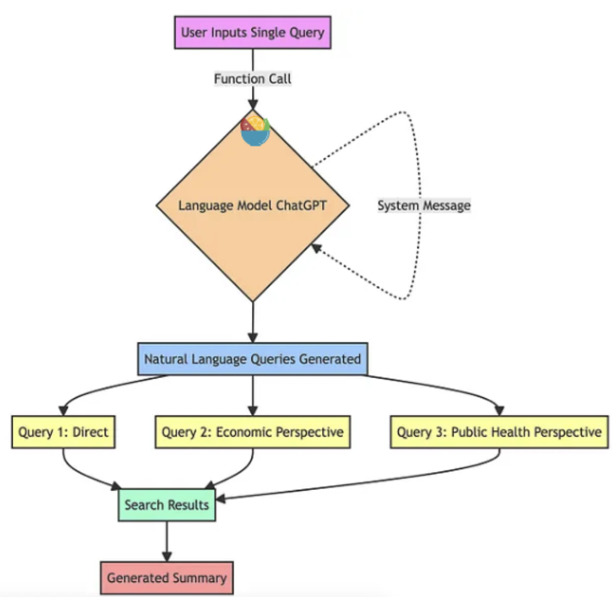

举例： 将 user query + prompt 输入ChatGPT让它生成多个 query，每个 query 侧重了一个不同的 [perspective ](https://so.csdn.net/so/search?q=perspective&spm=1001.2101.3001.7020)。比如，如果原始查询是关于“气候变化的影响”，则生成的查询可能包括“气候变化的经济后果”、“气候变化与公共健康”等角度。

（2）Reciprocal Rank Fusion（RRF，即重排） **==(见4.10.1.2.1 检索的3种方式）==**

RRF)是一种将多个搜索结果列表的排名合并起来以产生单一统一排名的技术。RRF 依靠排名列表中的相对排名来计算文档的 score：

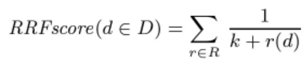

通过合并不同 query 的排名结果，让最相关的文档出现在合并列表的最顶部。RRF 特别有效，因为它不依赖于搜索引擎分配的绝对分数， **==而是依赖于相对排名==**，这使得它非常适合合并可能具有不同范围或分数分布的查询结果。

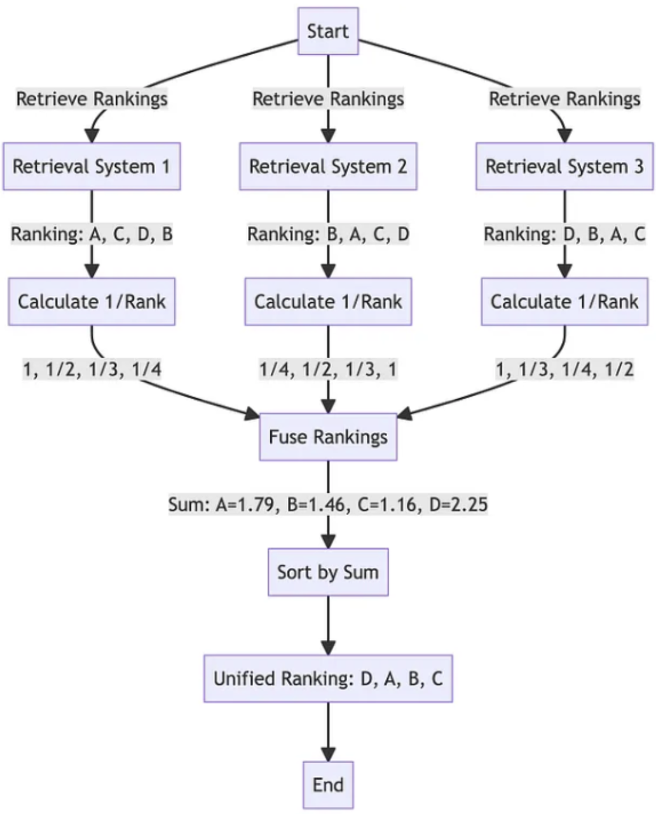

（3）Generative Output：使用多个 query 的一个挑战是： ==可能会削弱用户的原始意图。为了缓解这个情况可以在 prompt 中给予 raw user query 更多的权重。==

### **4.14.2 Adaptive RAG（自适应RAG)**
https://github.com/starsuzi/Adaptive-RAG

https://arxiv.org/pdf/2403.14403

1、存在问题：现有RAG处理复杂度各异的查询方法尚存不足，或在处理简单查询时消耗过多计算资源，或难以妥善解决复杂的多步骤问题，且用户的查询并非都能明确划分为简单或复杂。

2、技术方案：在Adaptive-RAG中，【训练 **分类器**】以准确评估问题的复杂性，为检索增强的LLMs选择最合适的策略,范围从迭代到单一，甚至不进行检索的方法

```JSON
复杂性等级：简单(A)、中等(B)和复杂(C)
-简单问题：可以直接由LLM回答,
-中等复杂度问题：需要单步检索
-复杂问题：则需要多步检索和推理

策略类型：
-非检索方法(No Retrieval)：
直接使用大型语言模型(LLM)本身的知识库来生成答案。这种方法适用于那些模型已经知道答案的简单问题，不需要额外的外部信息。

-单步检索方法(Single-step Approach)：
当问题需要额外的信息时，先从外部知识源检索相关信息，然后将检索到的文档作为上下文信息输入到LLM中，帮助模型生成更准确的答案。这种方法适用于需要一次额外信息检索的中等复杂度问题。
——但对于简单查询来说基本上很低效

-多步检索方法(Multi-step Approach):
对于最复杂的问题，需要从多个文档中综合信息并进行多步推理。这种方法通过迭代地访问检索器和LLM，逐步构建起解决问题所需的信息链。这种方法适用于需要多步逻辑推理的复杂问题。
```

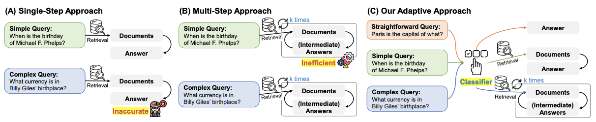

### **4.14.3 Agentic RAG**
1、传统 RAG 的局限：一般遵循“检索 → 拼接 → 生成”的线性流程，简单直接，但在复杂场景下力不从心：

**缺乏推理链条**：比如任务需要先查 A 文档，再基于结果查 B 文档，传统 RAG 就无法连续处理。

**没有任务分解能力**：像“先生成报告再发邮件”这样的多步骤执行，它做不到。

**知识源过于单一**：只能依赖已有知识库，难以同时结合 API、网页数据等多模态来源。

因此，在真实业务中，RAG 往往表现为“机械式回答”，既不够灵活，准确性也难以保证。

但企业真正需要的是“你提需求，我能理解并帮你完成”。

2、Agentic RAG 的核心理念：为了让知识系统从“被动应答”进化为“主动决策”，真正具备“思考—行动—完成”的闭环能力

**架构升级**：RAG 不再只是信息通道，而是一个能推理、能决策的智能系统；

**引入 Agent**：作为大脑，统筹整个流程；

**四大核心能力**：

```Python
明确目标与角色定位
管理记忆（既能处理临时状态，也能积累长期知识）
自动规划任务、拆解执行路径
主动调用外部工具与系统交互
```

3、Agentic RAG -单Agent：工作范式为ReAct框架

**（1）能力1：构建多源检索能力 —— 基于 LlamaIndex**

LlamaIndex 支持将不同知识源封装为标准化工具，实现了知识访问的模块化与可调度性

> 1、为每份文档构建两种索引并将每个索引包装为 `QueryEngineTool`
>

（1）向量索引：用于细节查询

（2）摘要索引：用于整体理解

2、注册至： Agent 工具池，供其按需调用

````Python
工具定义与封装

```python
tools = []

for file, name in zip(file_list, name_list):
    docs = SimpleDirectoryReader(input_files=[file]).load_data()
    nodes = SentenceSplitter(chunk_size=512).get_nodes_from_documents(docs)

    vector_index = VectorStoreIndex(nodes)    summary_index = SummaryIndex(nodes)

    tools.append(
        QueryEngineTool(
            query_engine=vector_index.as_query_engine(similarity_top_k=3),
            name=f"{name}_vector_tool",
            description=f"查询{name}文档中的具体技术细节"
        )
    )
    tools.append(
        QueryEngineTool(
            query_engine=summary_index.as_query_engine(response_mode="tree_summarize"),
            name=f"{name}_summary_tool",
            description=f"获取{name}文档的整体概述"
        )
    )
```
````

````Python
初始化 Agent react:让agent可以有推理与执行能力、对所有工具支持语义理解，决策过程输出具备解释性

```python
agent = ReActAgent.from_tools(
    tools,
    system_prompt=(
        "你是一个RAG领域的专家，能根据用户问题合理选择使用工具获取信息。\n"
        "请你务必遵循ReAct模式：先思考，再决定行动，然后观察结果，最后得出结论。\n"
        "请严格执行：只能使用提供的工具进行查询，不得虚构信息，不得使用未提供给你的工具。"
    ),
    verbose=True
)
```
````

实现效果：

```Python
（1）跨文档对比分析：用户问题：
 “请对比 GraphRAG 与 Agentic RAG 的核心思路，并说明它们在处理复杂任务时的差异。”

Agent 执行步骤：首先判断任务目标是：需要提取两篇技术论文的核心框架；调用 graphrag_overview_tool 获取 GraphRAG 的知识图谱式检索方案；调用 agenticrag_agent_tool 查询 Agentic RAG 的任务分解与决策机制；

将两方面信息进行归纳整理，输出结构化的对比分析结论。

（2）多阶段任务分解：

用户问题：
 “请从 finance-rag 文档中提取风险管理模块的内容，并整理成一段高管易读的摘要。”

Agent 行动路径：思考：首先需要定位原始资料；行动：调用 finance-rag_vector_tool 检索“风险管理模块”；观察：返回结果多为专业化、技术性表达；思考：需将其转化为简洁的高管语言；行动：利用 LLM 对文本进行语义重写与精简；输出：面向管理层的风险管理摘要。
```

附原始代码：

```Python
from llama_index.core import SimpleDirectoryReader, VectorStoreIndex, SummaryIndex
from llama_index.core.node_parser import SentenceSplitter
from llama_index.core.tools import QueryEngineTool
from llama_index.core.agent import ReActAgent
from llama_index.core.llms import ChatMessage
from llama_index.llms.openai import OpenAI as LlamaIndexOpenAI
from llama_index.embeddings.openai import OpenAIEmbedding
from llama_index.core import Settings
import os
from dotenv import load_dotenv

# 加载环境变量
load_dotenv()
api_key = os.getenv('V3_API_KEY')
# 配置 LlamaIndex 使用新的 OpenAI API
Settings.llm = LlamaIndexOpenAI(
    api_key=api_key,
    api_base="https://api.vveai.com/v1",
    model="gpt-3.5-turbo"
)

Settings.embed_model = OpenAIEmbedding(
    api_key=api_key,
    api_base="https://api.vveai.com/v1",
    model="text-embedding-ada-002"
)

print("正在初始化 Agentic RAG 系统...")

# 加载多个文档（修改为txt文件）
file_list = ["./data/graphrag.txt", "./data/agenticrag.txt", "./data/financerag.txt"]
name_list = ["graphrag", "agenticrag", "financerag"]

tools = []

for file, name in zip(file_list, name_list):
    print(f"正在处理文档: {file}")
    try:
        # 读取并分割文档
        docs = SimpleDirectoryReader(input_files=[file]).load_data()
        nodes = SentenceSplitter(chunk_size=512).get_nodes_from_documents(docs)

        # 构建向量索引（用于细节查询）
        vector_index = VectorStoreIndex(nodes)
        vector_query_engine = vector_index.as_query_engine(similarity_top_k=3)

        # 构建摘要索引（用于整体理解）
        summary_index = SummaryIndex(nodes)
        summary_query_engine = summary_index.as_query_engine(response_mode="tree_summarize")

        # 将两种能力封装为工具 - 使用正确的参数格式
        vector_tool = QueryEngineTool.from_defaults(
            query_engine=vector_query_engine,
            name=f"{name}_vector_tool",
            description=f"查询{name}文档中的具体技术细节"
        )

        summary_tool = QueryEngineTool.from_defaults(
            query_engine=summary_query_engine,
            name=f"{name}_summary_tool",
            description=f"查询{name}文档的整体概述。"
        )

        tools.extend([vector_tool, summary_tool])
        print(f"✓ {file} 处理完成")
    except Exception as e:
        print(f"✗ 处理 {file} 时出错: {e}")

print(f"共创建了 {len(tools)} 个工具")

# 初始化 Agent，传入所有可用工具
try:
    agent = ReActAgent.from_tools(
        tools,
        system_prompt=(
        "你是一个RAG领域的专家，能根据用户问题合理选择使用工具获取信息。\n"
        "请你务必遵循ReAct模式：先思考，再决定行动，然后观察结果，最后得出结论。\n"
        "请严格执行：只能使用提供的工具进行查询，不得虚构信息，不得使用未提供给你的工具。"
        ),
        verbose=True
    )
    print("✓ Agent 初始化成功")
except Exception as e:
    print(f"✗ Agent 初始化失败: {e}")
    exit(1)

def main():
    """主函数：演示 Agentic RAG 的核心能力"""
    print("\n=== Agentic RAG 系统启动 ===")
    print("可用工具：")
    for tool in tools:
        print(f"- {tool.metadata.name}: {tool.metadata.description}")
    print("\n" + "="*50 + "\n")

    # 示例查询
    queries = [
        "请对比 GraphRAG 与 Agentic RAG 的核心思路。",
        "从 GraphRAG 文档中提取产品介绍，并整理成一段面向客户的简洁说明。",
        "请总结这2种RAG方法的主要优势和适用场景。"
    ]

    for i, query in enumerate(queries, 1):
        print(f"查询 {i}: {query}")
        print("-" * 50)
        try:
            response = agent.chat(query)
            print(f"回答: {response}")
        except Exception as e:
            print(f"查询失败: {e}")
        print("\n" + "="*50 + "\n")

if __name__ == "__main__":
    # 运行示例查询
    main()
```

（3）动态工具路由：

````Python
扩展系统接入外部工具：

```python
def search_web(query):
    return f"根据网络搜索，{query} 的最新研究进展包括..."

web_tool = FunctionTool.from_defaults(
    fn=search_web,
    name="web_search_tool",
    description="获取最新的公开研究动态"
)

agent.add_tool(web_tool)
```

**用户提问：**
“graphrag 最近有没有新的更新版本可以使用？”

**Agent 决策：**
- 判断本地文档未覆盖“新的更新版本”；
- 选择 `web_search_tool` 进行联网查询；
- 实现知识源动态切换。
````

## **4.15 RAG的相关性：相似≠相关**
1、 **rag中的相关性问题，不是通过向量嵌入就能解决的：**

向量嵌入在 RAG 中扮演了重要角色，但 **相关性**并不仅仅依赖于这些技术。 **事实上很多时候，****==传统的数据库查询和文本搜索已经足够解决问题。向量嵌入虽然强大，但并不是万能的==**

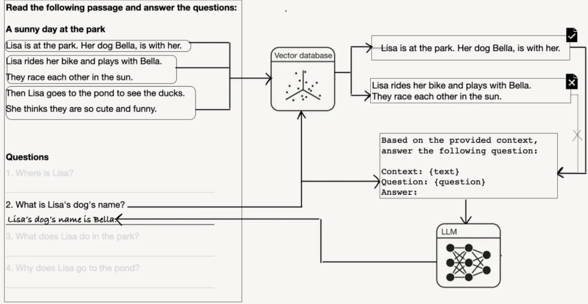

举例：假设开发一个基于 LLM 的医疗保健应用程序。 **与“使用 LLM 构建医疗保健软件”相关的信息在向量空间中可能包括“用于诊断疾病的 AI”和“用于视频游戏开发的 AI”。虽然这些信息在向量空间中看起来“相似”，但它们实际上缺乏关键的联系。**

用数据库和文本搜索用了好几十年，效果一直不错。大多数时候，用传统的方式查询数据反而更简单直接。 **向量嵌入**当然也有它的用处，但很多时候其实并不需要那么复杂的技术。如果数据真的很难找，这时候真正面对的其实是 **相关性**的问题

2、“ **相关性”超越“表面相似性”**

**相关性**不仅是表面上的相似性，涉及到更深层次的上下文理解： **“对人类有用的信息对 LLM 也有帮助”**。因此需要构建一个能够理解上下文、提供真正有用信息的系统，而不是仅仅依赖于向量相似性。

==研究发现，==**==添加不相关文档有时甚至能提高 RAG 系统的准确性==**==。这听起来有点反直觉，但背后的逻辑是：==**==不相关文档可能通过某种方式“激活”模型的推理能力==**==，==从而帮助它更好地理解问题。然而并不意味着可以随意添加不相关文档。 **区分相关和非相关信息**仍然是 RAG 系统的核心挑战。

3、数据量 vs 效果：RAG 系统的双刃剑

（1）数据越多，效果不一定越好：

在QAnythingd **升学百科问答**的实验中，随着数据量的增加，RAG 系统的表现并非线性提升。 **第一批数据加入后，问答正确率为 42.6%；第二批数据加入后正确率提升到了 60.2%。当第三批数据加入后，正确率却急剧下降了 8 个百分点**。这表明， **海量数据并不总是带来更好的效果**，反而可能导致 **检索退化**问题。

| **版本** | **数据** | **正确率** | **数据说明** | **备注** |
| --- | --- | --- | --- | --- |
| v1 | 第一批数据 | 75/176 = 42.6% | 第一批数据，已有数据：FAQ、书本、其他整理资料 | 先加一批数据感受一下 |
| v2 | 第一批数据 +第二批数据 | 106/176 = 60.2% | 第二批数据，互联网数据：（1w+文件） | 灌入大量数据后，效果提升非常明显 |
| v3 | 第一批数据 +第二批数据 +第三批数据 | 93/176 = 52.8%（-7.4%） | 第三批数据，有道领世志愿院校信息 + 985 院校信息总结 | 加了更多数据，但效果变差，原因是数据多了之后检索到的相关片段也更多，把之前本来最相关的片段挤掉了 |

（2） **检索退化**：相似 ≠ 相关

举例：问题：“大连医科大学怎么样？”：加入第三批数据前，系统能够正确回答，但加入第三批数据后，系统却错误地返回了与“大连理工大学”相关的信息。这是因为第三批数据中包含了与“大连理工大学”相关的句子，这些句子在向量空间中与“大连医科大学”非常相似，但实际上并不相关。

**语义检索的核心矛盾在于：相似性 ≠ 相关性**。RAG 系统需要在有限的 LLM 输入 token 内，选择最相关的片段。如果检索到的片段虽然相似但不相关，就会导致回答错误。因此， **如何优化检索机制，确保最相关的片段被选中，是 RAG 系统设计中的关键挑战**。

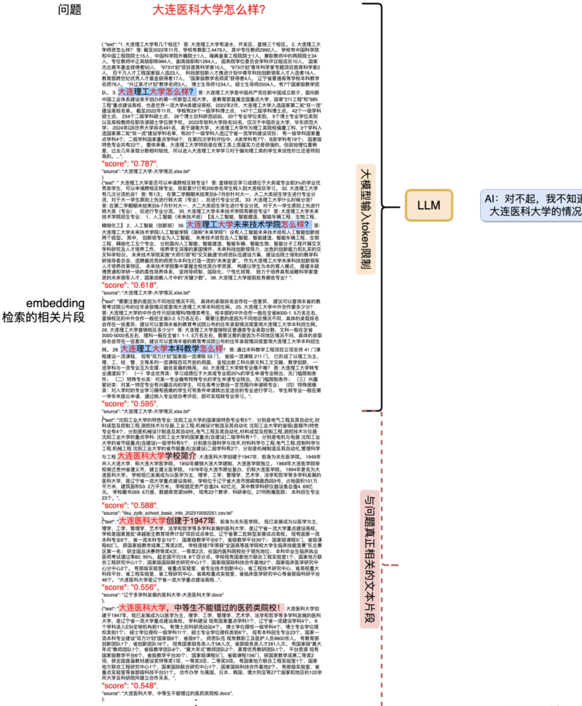

4、如何 **定义和衡量相关性**？

**《How Easily do Irrelevant Inputs Skew the Responses of Large Language Models?》**中提到一些实验：通过构建不同类型的信息（如 **无关信息**、 **部分相关的无关信息**和 **相关但误导性的无关信息**）测试大模型对相关性的敏感性。

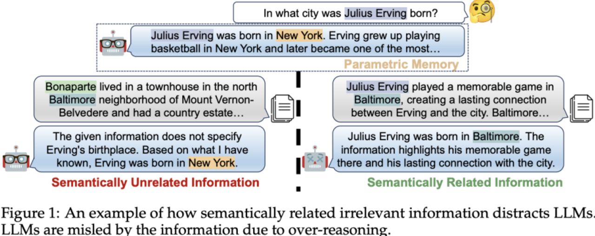

**无关信息**可能与问题主题无关，但由于高相似性得分而被检索到。而 **部分相关的无关信息**则包含与问题主题部分重叠的信息，但不提供问题的答案。实验表明： **大模型对相关性的理解与传统的检索系统并不完全一致，**这就需要更精细的方法来衡量和优化相关性

a）大模型 **更容易被语义高度相关但不相关的信息误导**

b） **随着无关信息数量的增加，大模型识别真正相关信息的能力会降低**

c） **大模型对无关信息的鲁棒性会随着问题格式的变化而变化**。例如，自由格式的问题（如开放式问答）通常比多选 QA 格式更鲁棒。 **在多选 QA 格式中，模型可能会因为选项的干扰而选择不相关的答案。**这说明，问题的设计方式也会影响模型对相关性的判断。

5、如何 **优化相关性**？

（1）方法1： **结合多维度评分**

传统的向量相似性评分（如余弦相似度）虽然有用，但不足以完全衡量相关性。可以结合以下多维度评分：

**==语义相似性评分==**：基于向量嵌入的相似性。

**==上下文匹配评分==**：基于信息是否能够回答问题的核心。

**==任务目标评分==**：基于信息是否有助于完成特定任务。

（2）方法2： **引入人类反馈**

通过让人类评估模型返回的结果可以更好地理解哪些信息是真正相关的。例如，可以设计以下评估指标：

**==有用性评分==**：结果是否有助于完成任务？

**==准确性评分==**：结果是否准确回答了问题？

**==相关性评分==**：结果是否与问题真正相关？

（3）方法3：提示词优化

**CoT提示**和 **指令增强提示**对提高模型辨别能力的效果有限，甚至可能产生副作用。因此需要更精细地设计提示，帮助模型更好地理解任务和上下文。例如：

**==明确任务目标==**：在提示中明确告诉模型需要完成的任务。

**==过滤无关信息==**：在提示中加入“忽略无关信息”的指令，但需要结合其他优化手段。

（4） **动态调整检索策略**

**==分层检索==**：先进行粗粒度检索，再进行细粒度筛选。

**==多轮检索==**：通过多轮交互逐步缩小检索范围，提高相关性。

## 4.16 开源知识库如何选择的建议
RAG+AI工作流+Agent：LLM框架该如何选择，全面对比MaxKB、Dify、FastGPT、RagFlow、Anything-LLM！

| 工具 | 优点｜保护隐私 | 缺点 | 部署难度 | 资源要求 |
| --- | --- | --- | --- | --- |
| MaxKB | 功能清晰 界面简洁支持中文 | 不显示引用的知识库原文，不提示是否命中知识库 | 简单 | 低 |
| AnythingLLM | 可选 Chat/Query 两种模式，Query 模式每次都查询知识库 | 暗色调使用不习惯，不支持中文 | 简单 | 低 |
| [Dify.ai](http://Dify.ai) | 功能清晰 界面简洁支持中文 | 不显示引用的知识库原文，不提示是否命中知识库，最多上传 5 个文件，文件最大 15M | 中等 | 中等 |
| FastGPT | 知识库支持 1000 个文件，单个文件最大 500M知识库命中率高，显示原文 | 本地知识库配置难度高 | 较难 | 中等 |
| RAGFlow | 自带一些大模型知识库命中率高，显示原文 | 体积大（20G） | 较难 | 高 |

1、MaxKB： [https://maxkb.cn/](https://link.zhihu.com/?target=https%3A//maxkb.cn/)

| 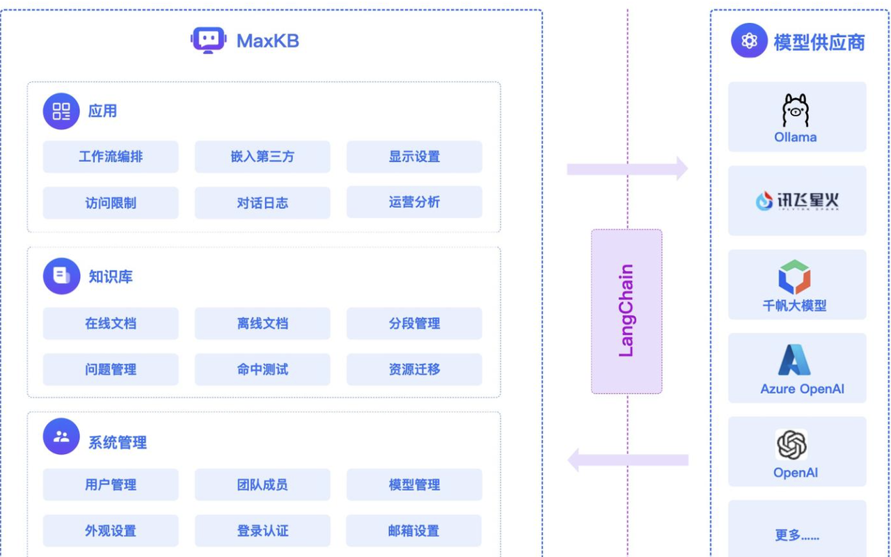 | 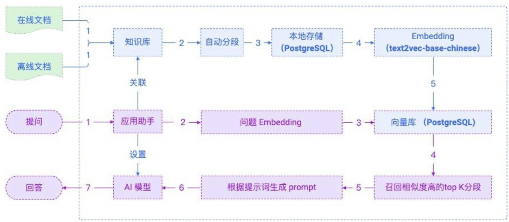 |
| --- | --- |

```JSON
技术栈：
前端：Vue.js、logicflow
后端：Python / Django
Langchain：Langchain
向量数据库：PostgreSQL / pgvector
大模型：Ollama、Azure OpenAI、OpenAI、通义千问、Kimi、百度千帆大模型、讯飞星火、Gemini、DeepSeek等
```

2、Dify： [https://dify.ai/zh](https://link.zhihu.com/?target=https%3A//dify.ai/zh)

3、Fastgpt： [https://fastgpt.in/ ](https://link.zhihu.com/?target=https%3A//fastgpt.in/)专注于知识库训练和自动化工作流程的编排。它提供了一个简单易用的可视化界面，支持自动数据预处理和基于Flow模块的工作流编排

4、RagFlow：

| 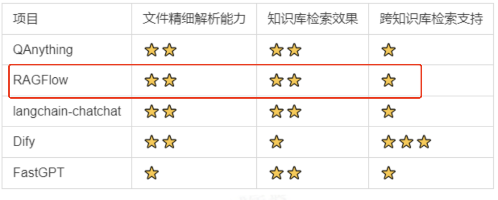 | 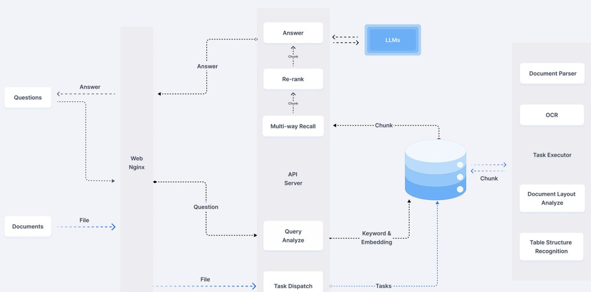 |
| --- | --- |

文件精细解析，RagFlow 做的最深入的；Dify 检索效果不佳，经常召回不到正确的内容；跨知识库检索，目前只有 Dify提供了相关的能力

项目开源地址：https://github.com/infiniflow/ragflow

项目文档https://ragflow.io/docs/dev/

5、Anything-LLM： [https://anythingllm.com/](https://link.zhihu.com/?target=https%3A//anythingllm.com/)

一个全栈应用程序，可以使用大语言模型，结合向量数据库解决方案构建一个私有ChatGPT，可以本地运行，也可以远程托管

```JSON
支持的 LLM、嵌入模型和向量数据库
LLM：包括任何开源的 llama.cpp 兼容模型、OpenAI、Azure OpenAI、Anthropic ClaudeV2、LM Studio 和 LocalAi。
嵌入模型：AnythingLLM 原生嵌入器、OpenAI、Azure OpenAI、LM Studio 和 LocalAi。
向量数据库：LanceDB（默认）、Pinecone、Chroma、Weaviate 和 QDrant
```

## 4.17 OpenAI发布GPT-4.1，100 万 token 上下文窗口，RAG没用了么？（某家大厂面试问了）
参考阅读：https://mp.weixin.qq.com/s/mFsQz8shoJvGKOEUW0BnDQ

GPT-4.1 能够可靠地处理 100 万 token 上下文长度的信息，并在注意相关文本和忽略长短上下文干扰项方面比 GPT-4o 更加可靠。长上下文理解是法律、编程、客户支持以及许多其他领域应用的关键能力。但是：

（1）成本不被接受：一个典型的 RAG 查询约 1000 个 token（成本约 0.002 美元）。扩展到完整的 100 万 token 上下文会使成本增加 1000 倍（每次查询约 2 美元）。

（2）速度不被接受：一个 45.6 万 token 请求需要 76 秒—— 规模化应用中，延迟不可接受

（3）对于Agent，会涉及多次LLM调用，还会涉及到多智能体协同，每一步都会增加成本和延迟

（4）大上下文模型无法有效处理引用：RAG 能够轻松引用源文本块，大上下文方法失去透明度。对于法律、医疗、技术、金融领域不适用

（5）100 万 token（ 相当于约 20 本书）其实在企业落地中没那么大。 大公司的数据涉及数十亿，1000 万 token上下文也远远不够

## 4.18 RAG 与 MCP 如何以不同方式解决大模型的局限性及实践选择
1、RAG 的工作流程，三步：

**查询处理**：处理用户的查询，以识别关键信息需求。

**检索**：从外部数据库或知识库中获取相关的文档或信息片段。

**增强生成**：将检索到的文档添加到大型语言模型 (LLM) 的上下文窗口中，然后模型基于其预训练知识和收集到的信息生成响应。

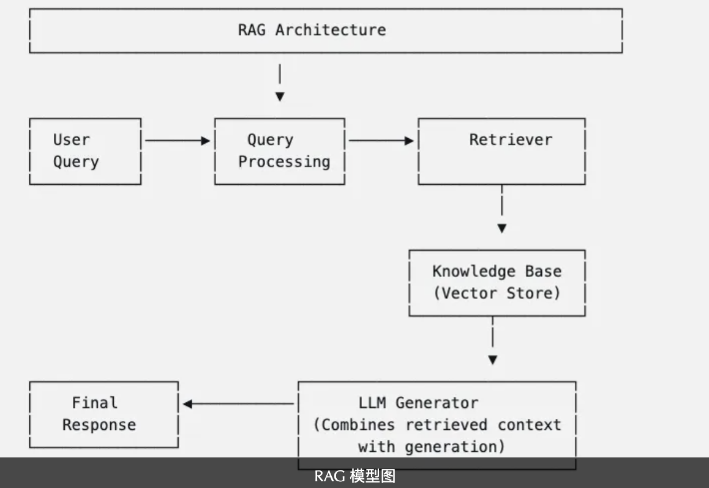

```JSON
举例：
问题："高数期末考试是什么时候？"
如果使用 RAG 实现，系统将：
a) 处理这个查询
b) 从大学数据库中检索当前学期的考试时间表
c) 将此信息连同查询一起提供给大型语言模型 (LLM)
然后，大型语言模型 (LLM) 将生成包含最新信息的准确回复："高数期末考试安排在 12 月 15 日下午 2:00，地点在B教学楼"
```

2、MCP ：

虽然 RAG 侧重于在生成 **之前**进行检索，但 MCP 为大型语言模型 (LLM) 提供了一个标准化的接口，以便在生成过程 **中**请求额外信息或执行操作。 **当处理需要多个信息来源，但又必须在模型上下文窗口容量限制内运行的复杂任务时，MCP 尤其有价值。**工作原理如下：

**识别**：模型识别出何时需要额外的信息或工具。

**协议执行**：按照预定义的协议，模型输出一个结构化的请求。

**外部处理**：外部系统处理此请求，以获取数据或执行操作。

**持续生成**：模型整合结果并继续生成响应。

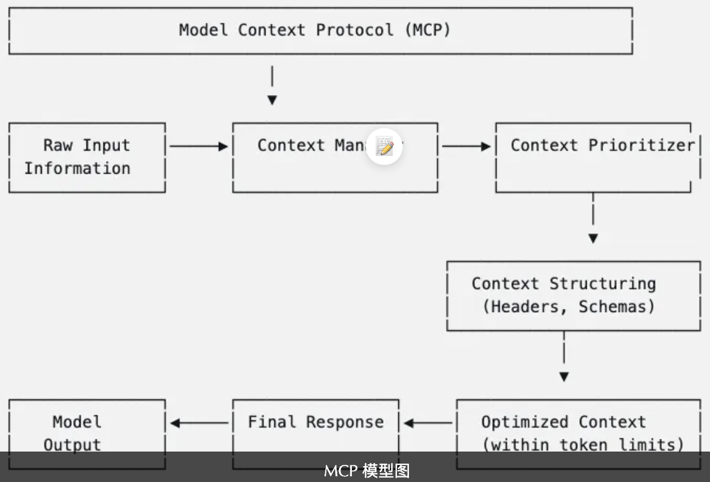

| **优势** | **RAG** | **MCP** | **实践选择** |
| --- | --- | --- | --- |
|  | **增强准确性**：提供基于事实的、最新的信息**减少幻觉**：利用知识库中的信息**可定制的知识**：从特定领域来源获取知识**透明度**：通过来源提供引用 | **上下文优化**：最大限度地利用有限的上下文窗口**结构化信息**：使用模型更容易理解的模式和格式**信息层级**：优先考虑任务的关键信息**一致性**：为可预测的模型行为提供标准化的格式**性能提升**：在相同的上下文大小下实现更好的推理 | **RAG 更容易实现，并且非常适合直接的信息检索。MCP 为需要各种工具和数据源的复杂、多步骤任务提供了更大的灵活性。**在实践中， ==许多先进的AIGC系统开始结合这两种方法的元素——==**==使用 RAG 进行广泛的知识访问，而使用 MCP 进行特定的工具使用和动态信息检索==** |

```JSON
举例：
问题："高数期末考试是什么时候？"
如果使用 MCP 实现
a) 模型识别出它需要当前的考试时间表
b) 生成一个结构化的 MCP 调用：
{action: "fetch_exam_schedule", course: "高数", semester: "current"}
c）外部系统处理此调用并返回考试详情，模型将此信息整合到响应中："高数期末考试在 12 月 15 日下午 2:00，地点在 B教学楼"
```

## 4.19（企业落地实操）企业知识库落地时如何评估RAG效果——可以以这个为准快速看总结
==RAG怎么从“能用”到“交付”？==

==通过“基准集 >自动化打分 >定位-修正-回归”的闭环，可以把金融 RAG 助手从“能用”迭代到“可交付==

1、评估什么？

（1） **检索质量（retriever——是否找到正确的信息？）**

```JSON
检索相关性 (Relevance of RetrievedDocuments):
检索返回的文档是否真的与用户查询相关?(例如:查询“第三季度盈利指引”返回的是正确的 Q3 报告，而不是 Q1 的)

召回率 (Recall):
对于一个查询，系统是否能够从本地知识库中找出 所有 或大部分相关的文档片段?((对于政策、招投标等场景尤其重要，漏掉关键条款后果严重)

精确率 (Precision):
在返回的 顶部 结果中，相关文档的比例有多高？是否引入了过多噪音？

上下文相关性(Context Relevance)：
在检索到的文档片段(Chunks)中，传递给生成模型的具体文本内容是否与用户查询紧密相关?
```

（2） **生成质量 (Generator-基于检索到的信息，生成的答案好不好?）**

```JSON
忠实度/可靠性/接地性(FaithfuInessGroundedness):
生成的答案是否 严格 遵循检索到的文档内容?是否避免了“编造”信息(幻觉)?这一点在金融领域至关重要

答案相关性(Answer Relevance):
生成的答案是否直接、有效地利用了检索到的上下文来回答用户的具体问题?

准确性(Accuracy):
答案中呈现的事实信息(如数字、日期、特定政策条款、招标要求)是否与源文档一致?

完整性(Completeness):
基于可用的检索信息，答案是否覆盖了查询的关键方面?是否遗漏了上下文中重要的细节?

简洁性与清晰度(Conciseness& Clarity):
答案是否表述清晰，没有不必要的术语(除非目标用户明确需要)，并且篇幅适当?如金融专业人士重视效率。

流畅性 (Fluency):
语言表达是否自然、符合语法习惯
```

（3）端到端系统质量（整体用户体验与效用）

```JSON
整体正确性(Overall Correctness):
结合检索和生成，最终的答案在事实上是否正确，并且对金融专业人士的任务有用?

来源可追溯性 (Source AttributionTraceability):
系统能否准确地标明生成答案所依据的具体来源文档(最好能定位到章节/页码)?这对验证和建立信任至关重要。

鲁棒性/边界情况处理(RobustnessHandling Edge Cases):
 如何处理模糊的查询?
 当知识库中不存在相关信息时，系统如何响应?是明确告知无法回答，还是给出不相关的答案?
 如何处理需要整合多个文档信息(例如，比较不同时期的政策变化)的查询?

响应速度/延迟(Latency/Speed):
系统返回答案的速度如何?是否满足用户工作流的要求?

偏见与公平性(Bias & Fairness):
系统是否会因为底层数据或大模型的偏见而表现出无意的倾向?(例如，更倾向于引用某类报告)
```

2、评估维度总览

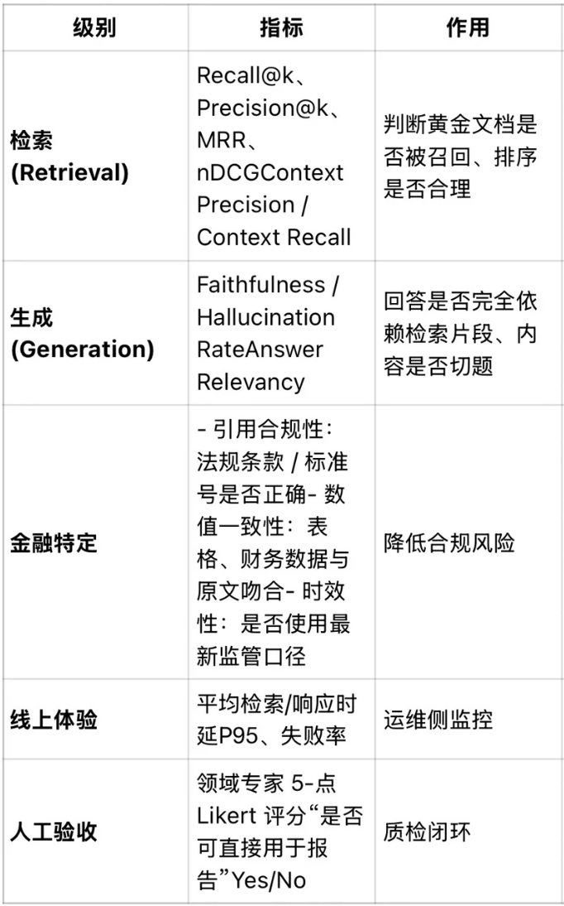

3、怎么评估？

**（1）构建代表性的测试集（Develop a RepresentativeTest set)：**

```JSON
a）查询来源: 收集金融专业人士可能提出的真实问题。可以来自系统日志(如果有)、与领域专家访谈，或者基于常见工作任务人工构造

b)查询类型: 包含多样化的查询:
 事实查找:"X公司 2023 年 Q3 的收入是多少?"
 摘要总结:"总结最新货币政策声明的关键变化。"
 对比分析:"比较招标A和招标 B 的关键要求差异。"
 定义解释:"根据我们的内部报告，解释[某个金融术语]。
 影响分析:"根据研究报告乙，政策 Y对我们的投资策略有何潜在影响?"
 无答案查询:测试知识库中没有答案的情况
 模糊查询: 测试系统处理不明确问题的能力。

c）黄金标准(Ground Truth): 对于测试集中的一部分查询，需要人工标注:
“理想”的相关文档及具体段落
仅基于这些段落的、事实正确的理想答案、这部分工作量大，但是是客观评估的关键
```

（2）评估手段

```JSON
组件级评估(Component-Level Evaluation):a）检索器指标:
使用标准信息检索指标，如Precision@K,Recall@K, Mean ReciprocalRank(MRR)，NDCG@K，对照黄金标准文档进行评估。

b) 生成器指标(给定黄金标准上下文):
如果将“完美”的上下文喂给生成模型，可以评估其生成能力。可使用 ROUGE,BLEU (评估与参考答案相似度，需谨慎使用)，BERTScore，或专门的忠实度指标(如检查事实矛盾)。但人类判断往往仍是必需的。
```

```JSON
端到端评估(End-to-End Evaluation):a）人工评估 (黄金标准方法):
向评估人员(最好是领域专家)展示查询、系统生成的答案，以及(可选的)检索到的源文档。
使用评估细则(Rubrics)对忠实度、答案相关性、准确性、完整性、清晰度等维度打分。
最好有多位评估员进行标注，并计算评估者间一致性 (Inter-AnnotatorAgreement).
“哪个答案更好(A VS B)”的成对比较也是有效的方法。

b）自动化端到端指标(谨慎使用):
(如 RAGASARES)，自动测量忠实度、答案相关性等。这些指标对于开发过程中的相对比较可能有用，但在金融这种高风险领域，必须用人工评估进行校准和验证

c) 定性分析(Qualitative Analysis)！错误分析 (Error Analysis): 深入分析失败案例。是检索失败(找错/漏找文档)?还是生成失败(幻觉、理解错误)?或是两者皆有?这有助于发现系统短板。
用户接受度测试(User AcceptanceTesting-UAT):让最终的目标用户(如金融分析师、合规官)在真实场景下使用系统完成任务，收集关于易用性、可信度、实际价值的反馈。
```

4、迭代循环

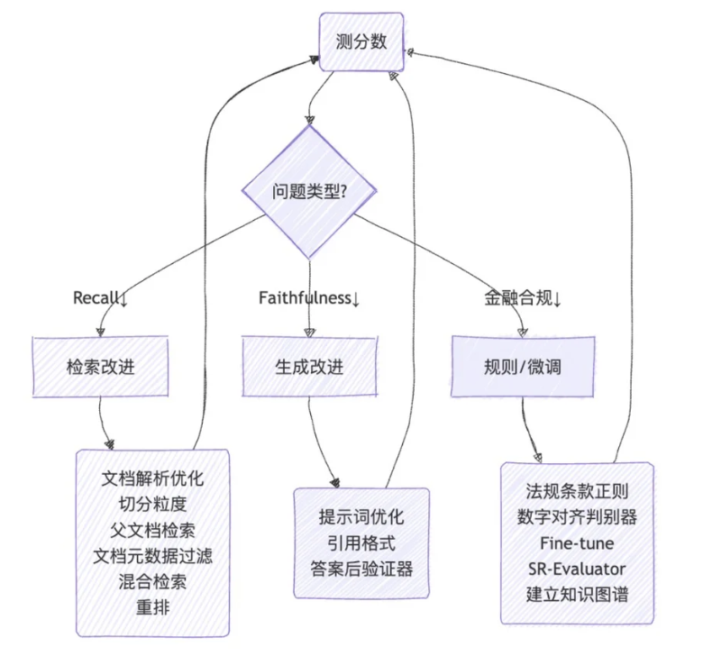

（1）定位问题：

```JSON
若 Context Recall<0.8 说明黄金文档常未进入k条检索结果，先调retriever。
若检索OK但 Faithfulness<0.9 检索已命中，但生成内容出现引用错误或幻觉，优先优化生成Prompt
若合规失败 >加入领域规则 +LLM 二次校验
```

（2）小步快迭代：

```JSON
检索层:调 chunk size、overlap；在研报中可用Section heading 做增量分块。组合 BM25*向量的Hybrid检索;并叠加领域微调（如金融领域embedding微调）生成层：
设定Prompt模板，强制要求生成内容中的Token必须出现在指定引用段（ctx_i），禁止自由发挥
采用二阶段生成：
   阶段1：草稿版回答，附带原文引用；
   阶段2：压缩为3条精炼Bullet Points，以降低幻觉发生率。

   举例：   用户问题：“请问《资管新规》对非标资产投资有限制吗？”    【草稿版回答示范】   回答内容：   根据《资管新规》第五章第27条规定，资管产品不得直接或变相投资于禁止投资的非标准化债权资产，包括但不限于房地产项目、土地储备贷款等。（引用来源：ctx_15）   另外，在《资管新规》补充指导意见中也明确，资管产品应优先配置标准化债权资产，鼓励金融机构加大对实体经济支持力度，严控非标资产比例。（引用来源：ctx_32）      【压缩总结版】：   《资管新规》第27条明确禁止资管产品投资特定类别的非标准化债权资产（如土地储备贷款）。    补充指导意见要求资管产品优先配置标准化债权，严控非标资产规模。    金融机构需通过加强内控，确保资管业务合规投资，防范信用风险。合规校验失败：
对生成回答中的关键字段（金额、比例、日期）进行Regex抽取，并与检索片段对齐核验；若不一致，回退生成"无法确认"的保守回答
对生成回答中涉及的法规条款（如《资管新规》第X条）进行同源比对，保证出处一致性。
```

（3）线上监控：

RAG质量评估指标（如Recall@k、Faithfulness）接入Datadog Traces，实时监控；

设定动态阈值：如Faithfulness < 0.5时，自动触发告警并引入人工复核

每周生成质量趋势报表（Percentile 95下降趋势（P95下降趋势=系统最差5%的回答质量在持续变好，整体可信度在提高）、Recall稳定性），辅助版本迭代与上线决策

5、快速checklist（快速健康检查指标）

所有评估与监控脚本接入CI/CD流程，确保每周自动运行质量评估

```JSON
【CI/CD流程】：
比如做一个RAG系统，每周都会有：
检索模型优化Prompt版本更新LLM参数微调召回策略调整
每次更新后，就重新评估一下系统质量（比如Recall、MRR、Faithfulness有没有变好/变坏）。

那就把评估脚本（比如跑150条基准queries、计算Recall@5、MRR、Faithfulness等）接入到CI/CD里，比如：
代码合并到主分支（git merge/push）的时候，
自动触发评估脚本
自动输出一份测试报告（比如pdf或者html），
如果某个关键指标下降（比如Faithfulness P95<0.85），就阻止上线或者弹出报警。
```

| 指标 | 标准 |
| --- | --- |
| 有代表性的基准查询集 | ≥150条 |
| Recall@5 | > 0.85 |
| MRR（Mean Reciprocal Rank） | ≥ 0.75 |
| Faithfulness（事实一致性） | > 0.9 |
| Answer Relevancy（回答相关性） | > 0.85 |
| 数字/条款对齐一致性 | ≥ 0.98 |

## 4.20 构建RAG——主要工具和框架
在实践中，可能会将以下工具和框架结合起来：

（1）使用LangChain定义一个检索链，首先进行混合搜索（例如，使用Weaviate的混合查询，同时使用向量相似度和关键词匹配），

（2）然后通过交叉编码器重排序结果，然后将顶部段落格式化为GPT-3.5或Llama-2等语言模型的提示，

（3）最后使用语言模型的答案。

（4）向量数据库执行繁重工作（向量数学等）；LangChain只是协调各部分。这种模块化方法意味着可以交换组件（例如，使用不同的语言模型或切换到更高效的向量索引），而无需重写整个RAG Pipeline

1、 **向量数据库**

专门用于存储嵌入向量并支持快速相似性搜索的数据库，对于小规模或简单部署，即使是内存中的Faiss索引或SQLite全文搜索也足够

```JSON
Faiss是一个库（C++带Python绑定），可以在内存中处理数百万个向量，并提供各种索引策略（flat、IVF、HNSW）用于高效的近似最近邻搜索。

Pinecone和Weaviate是云原生向量数据库服务，处理扩展、持久性和过滤。它们允许不仅存储嵌入向量，还存储元数据（如文档ID、标签），并执行混合查询（结合向量相似性和元数据过滤）。

Chroma（开源）和Milvus是2024年其他流行的向量存储。这些允许自托管持久向量数据库。
```

2、 **检索/编排框架**

使用如LangChain和LlamaIndex（前身为GPT Index）等框架，而不是手动编写所有检索和提示逻辑。这些框架提供上下文分割工具——它们可以将文档分成适合语言模型上下文窗口的大小，使用智能分块逻辑来保持段落语义连贯（例如，按段落或部分分块），甚至可以按标题或元数据存储文本分割，以便提供给语言模型的上下文是有意义的

```JSON
LangChain提供涉及语言模型的行动链抽象，例如一个RetrievalQA链，它接收问题，使用检索器获取文档，然后用这些文档调用语言模型。它支持与许多向量数据库和语言模型API的集成，所以只需几行代码，就可以配置一个使用Pinecone进行检索和GPT-4进行生成的LangChain QAChain。

LlamaIndex也专注于索引方面。它帮助构建数据索引（具有各种结构，如列表索引、树索引用于分层检索等），并提供简单的查询接口。例如，可以构建文档的向量索引，然后执行index.query("我的问题")，它将处理查询嵌入、检索最佳节点，并为语言模型组装上下文。
```

**3、混合搜索解决方案**

一些搜索引擎结合了密集和稀疏搜索

```JSON
Azure认知搜索和ElasticSearch可以混合使用关键词BM25搜索和向量搜索，这可以改善某些查询的结果，特别是那些具有特定关键词（如错误代码或专有名词）的查询，纯语义搜索可能会遗漏这些。

LlamaIndex等工具允许插入混合检索器（一步使用关键词搜索，另一步使用向量搜索，并合并结果）。
```

**4、重排序器**

检索步骤通常会获取10-20个候选段落

```JSON
使用重排序模型（通常是较小的基于BERT的交叉编码器，它接收查询和每个候选段落并评分相关性）可以大大提高精度。

重排序器重新阅读每个候选段落并考虑完整的查询上下文，给出相关性分数，允许系统选择最佳的3个提供给语言模型。
例如，可以使用SentenceTransformers的交叉编码器模型（如cross-encoder/ms-marco-MiniLM-L-6-v2）对向量搜索的初始结果进行重排序
```

## 4.21 OpenAI 分享 RAG 技术的最佳实践（这些优化方式在面试中都可以讲）
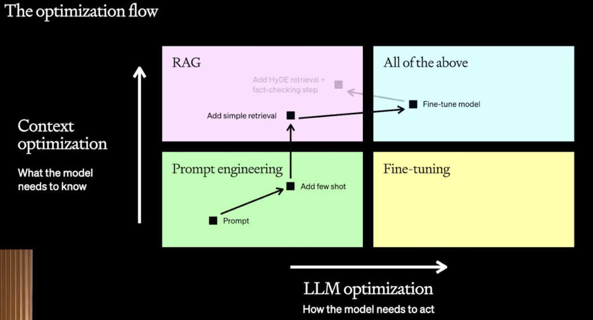

需求1：客户有大量文档（比如10万份），希望模型只基于这些文档进行知识检索。

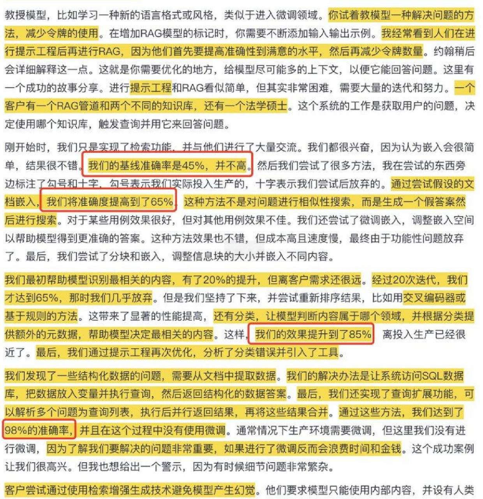

从基础嵌入起步，通过优化嵌入策略、引入语义规则与结构化识别，最终让文档问答系统从 45% 准确率提升至 98%，核心突破在于‘结构感知 + 问题意图理解 + 多模态辅助’的组合策略。”

```JSON
解决方案：
1.  直接将 PDF 和 docx 文件嵌入 ，准确率是 45%，容易“看起来相关，实际无关”

技术实现：
使用标准的文档解析器（如 PDFMiner、python-docx）将 PDF / DOCX 文档转为文本。
按固定长度（如每段 500 字）进行切块（chunking）。
使用基础嵌入模型（如 OpenAI Ada v2）将每段文本转换为向量，存入向量数据库。
用户提问时通过向量相似度检索出相应文本，送入语言模型生成答案。

问题与挑战：
格式信息丢失：如标题、段落结构、列表、表格等格式被破坏。
文档分块不合理：简单等长切块导致语义割裂或遗漏上下文。
语义漂移严重：问题与段落主题偏离时，难以检索到有用信息。
嵌入误差大：嵌入模型泛化不足，尤其对行业术语不敏感。


2.  经过 20 次调优迭代，解决细节小 Bug ，准确率到 65%，能基本覆盖文档主干内容，但对复杂结构仍不稳定

技术优化点
改进切块策略：
引入基于句子/段落的语义切块（text splitter with overlap），保留上下文。
针对结构性较强的文档（如合同）采用按标题或目录切块。

嵌入模型升级：
由基础嵌入模型（如 Ada v2）切换到更强语义理解的模型（如 text-embedding-3-large）。
对部分垂直语料进行 LoRA 微调或使用行业向量微调（如金融、医药）。

上下文拼接优化：
将多个 chunk 拼接为更完整的上下文窗口，提升生成准确性。
采用降重策略：去除重复信息，确保 token 利用率最优。

问句清洗与预处理：
将用户问题归一化（如统一单位、时间格式）。
清除“冗余口语成分”提高检索效果


3.  基于规则进行优化 ，譬如先判断问题属于什么领域（退一步思考） ，然后再回答，系统能根据“问题是什么”选择“怎么搜”，有效提升问题对内容的定位能力， 效果提升到 85%

技术优化点
问题意图识别模块：
引入轻量分类器或 prompt-based 判断问题属于哪一类：
例如：政策类、数据类、定义类、操作步骤类，分类后选择不同的召回策略/嵌入维度。

基于规则的召回引导：
如果问题是定义型 → 优先召回章节标题含“定义”“术语”的段落；
如果是数据型 → 优先召回包含数字、统计、表格标记的段落；
如果是操作类 → 提取“步骤”、“流程”、“操作”相关关键词。

文档优先级排序引擎：
多文档场景中根据来源可靠性打分（如“公司制度文档 > 知识论坛”）。

二次检索机制：
第一次召回不准确时自动 fallback 二次语义扩展检索。


4.  发现数据里有一些是结构化数据（如表格） ，为此定制提取解决，精准识别结构化数据内容并与自然语言问题建立强关联，准确率进一步提升至 98%

背景问题
表格、图像、代码段等结构化数据难以被传统文本嵌入模型捕捉。
比如：“请问去年6月的销售收入是多少？”——如果该数据在表格中，标准嵌入方式几乎无法检索到。

技术突破点
结构化表格识别与提取：
引入表格结构解析工具（如 unstructured、pdfplumber、Tabula）。
将表格转为结构化 JSON 格式，并附加表头语义嵌入。

多模态模型辅助（如 GPT-4o）：
若为扫描PDF或图片表格，使用多模态模型读取图像内容并转化为文字。

结构化 chunk + Schema 联动机制：
为表格类信息设计 schema-aware chunk，建立字段与上下文语义映射，如：
{
  "field": "销售收入",
  "date": "2023-06",
  "value": "1.23亿"
}

图文一致性对齐与比对：
对比用户问题关键词与结构化字段内容的相似度，增强召回与上下文匹配精度。
```

| 阶段 | 技术主轴 | 准确率 | 核心改进点 | 存在问题 |
| --- | --- | --- | --- | --- |
| 阶段1 | 基础文档嵌入 |  | 快速集成但无结构保留 | 无语义切块、嵌入弱、结构丢失 |
| 阶段2 | 嵌入优化 + 分段调优 |  | 上下文增强、模型升级 | 部分复杂问题仍难准确召回 |
| 阶段3 | 规则 + 意图识别 |  | 问题归类 + 召回策略适配 | 特殊结构数据依旧薄弱 |
| 阶段4 | 表格结构提取 + 多模态 |  | 表格解析、schema化匹配 | 成本高、适配复杂 |

| 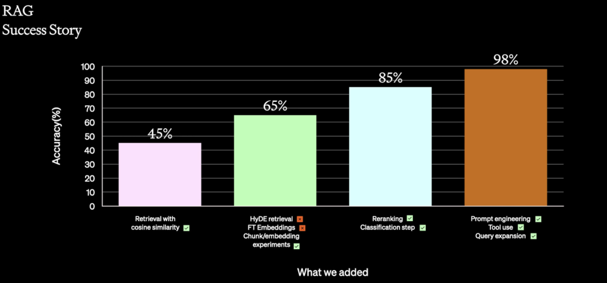 | 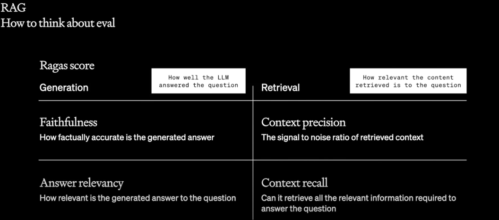 |
| --- | --- |

## 4.22 多轮对话
多轮问答中经常会出现一个关键问题：指代消解。如果不做这一步处理，直接回应用户的问题，很容易导致答非所问，甚至回错信息。

```JSON
指代消解：搞清楚用户在新一轮提问中提到的“它”、“他们”、“这个”等指代词，具体指的是什么内容。
```

```JSON
举例：
问题1：2025年，大模型的落地场景有哪些？回答11：大模型可以根据任务类型分为知识类和执行类两种应用场景问题2：那请问它们有什么区别，能给我举个例子么？要识别出这个指代词“它们”的具体含义，否则模型就无法给出正确回答。
```

### 1、指代消解如何处理？
（1）方法1：直接利用LLM + prompt 进行指代消解

通过设计合适的 prompt 引导它理解上下文中的指代词，并生成正确的回答。 **这种方法不对上下文内容进行修改，仅补全指代词或恢复上下文中省略的信息，确保问题原意不变。通过把历史对话（history）和当前提问（use query）一起提供给大模型，可以让它更好地进行语义补全。**

一个示例 prompt：

```JSON
请根据对话上下文，补全用户的提问。如果问题中存在代词或上下文省略，请你补全完整的问题。
并且保持问题原意不变。

对话上下文：{history}
用户提问: {user query}
```

举例：失败案例，单靠prompt不能每次都成功

```JSON
背景上下文（history）：
OpenAI 于 2015 年在美国成立，致力于推动人工智能安全发展。
GPT-4 是其发布的最新语言模型，在多个任务中表现出色。

用户当前提问（user query）：
它的能力相比之前有哪些提升？

构造的 Prompt：
请根据上下文补全这个问题，如果存在指代词，请补全为完整、明确的问题。
对话上下文：{history}
用户提问: {user query}


模型输出（失败示例）：
它的能力相比之前有哪些提升？
```

局限性： **通过构造合适的 prompt可以引导大模型对简单的代词进行指代还原。但对于需要推理和跨句推断的复杂表达，当前大模型仍然存在一定限制。**这也说明，在构建 RAG 系统时，想依赖 prompt 来完成所有指代消解任务，还需结合更复杂的语境推理能力或专门的工具支持。

（2）方法2：结合 Few-shot Prompt 与 CoT 技术，提升消解类任务表现

通过展示多个参考示例（Few-shot Prompt），让模型学习如何仿照示例完成后续任务，这种“上下文学习”方式无需微调模型就能获得较好的效果。 **==实践中，只需向 LLM 提供 5 个左右的示例，它通常就能较为准确地模仿输出。==**然而， **当任务涉及复杂语义理解，例如是否需要词语替换、是否保留原问题结构等，模型仍可能难以直接判断正确答案。**

为此，可以引入另一种常用且有效的方法： **==思维链（Chain-of-Thought, CoT）提示策略，以提升 LLM 在处理复杂逻辑任务时的表现，特别是在需要中间推理步骤（如数学运算、因果分析）时表现尤为显著。==**

```JSON
通过在 Prompt 中显式引导模型写出推理过程，从而提高最终答案的准确性。相较于直接给出最终答案，引入思维链能显著提升 LLM 的逻辑清晰度与判断能力。
```

举例：给 大模型看 4个参考例子。第一个是一个空的对话历史，第二个是最简单的例子，第三个是一个替换失败的例子，最后一个是替换两个指代的例子。

```JSON
你是一个智能客服助手，在处理用户提问时，经常会遇到模糊的代词（比如“它”、“他们”、“这个”、“他”等），你的任务是：
阅读历史对话和当前用户提问；
判断用户提问中的代词具体指代什么内容；
写出推理过程；
输出将代词替换为明确指代对象的版本，使客服对话更清晰。
请严格按照以下格式作答：


示例 1：空上下文
【历史对话】
 （无）
【当前问题】
 它什么时候发货？
【推理过程】
 当前对话没有上下文，无法判断“它”具体指代的对象，因此不能替换。
【替换结果】
 无法识别“它”指代对象，请用户补充信息。

示例 2：最基础的单指代替换
【历史对话】
 用户：我刚买了一个蓝牙耳机。
 客服：好的，订单已创建。
【当前问题】
 它支持降噪吗？
【推理过程】
 结合上下文，“我刚买了一个蓝牙耳机”，下一句用户说“它支持降噪吗？”，因此“它”指代“蓝牙耳机”。
【替换结果】
 蓝牙耳机支持降噪吗？

示例 3：错误替换示范 + 正确答案
【历史对话】
 用户：我买了个空气炸锅，还顺便下单了一袋冷冻薯条。
 客服：两个商品都安排发货了。
【当前问题】
 它能调温度吗？
【推理过程】
 上下文中提到两个对象：空气炸锅 和 冷冻薯条。逻辑上，只有空气炸锅具备调温功能，因此“它”应指代“空气炸锅”。
【替换结果】
 空气炸锅能调温度吗？

示例 4：多个指代词替换
【历史对话】
 用户：我买了加湿器和空气净化器。
 客服：两个商品都会在明天送达。
【当前问题】
 它们能定时开关吗？它们的水箱容量大吗？
【推理过程】
 “它们”在上下文中明确指代“加湿器和空气净化器”，用户的问题涉及两个指代词，需分别替换两次。
【替换结果】
 加湿器和空气净化器能定时开关吗？加湿器和空气净化器的水箱容量大吗？


请开始处理以下对话：
【历史对话】
 （此处插入用户对话历史）
【当前问题】
 （此处插入用户当前提问）
请写出推理过程，并输出完成替换的版本。
```

### 2、大模型多轮对话实际踩过的坑/方案（5条实操总结）
**==1、前置信息不足==**

（1）知识问答时，模型答不全 或者 答偏了：

```JSON
引入RAG（检索增强生成）：当用户发起一个问题，模型在生成回答前，先在知识库中检索相关材料。
然后将这些结果作为前置信息一起传入大模型，帮助它“看资料答题”。
```

（2）带“人设”的对话，模型答得不自然

当设计角色对话（客服、医生、儿童、小白用户等）时，大模型生成内容常常“不接地气：比如少年说得像专家；不专业；客服没有服务态度等，这是因为没有明确“它是谁、面对谁”。

```JSON
在 Prompt 或系统信息中加入清晰的人设定义：如：
你是一位6岁的小男孩，性格活泼，对新奇事物充满好奇心
```

（3）主动推送类对话，尴尬且无效

比如：做一个“AI销售助理”，你让模型主动给客户推荐套餐、介绍新产品，结果输出的内容太“硬”，自言自语

```JSON
 Prompt 或系统信息中加入清晰用户画像和目标策略：
你是一位汽车销售助理，当前用户是一位年轻男性，已了解过SUV车型，对操控性能有要求，预算在20万以内。
你的目标是引导用户了解本月促销活动，并推荐与之匹配的新款紧凑型SUV。
```

**==2、对话上下文遗忘问题==**

前几轮聊得挺好，模型人设也稳，逻辑也在线；但后续继续聊就开始幻觉跑偏了。虽然现在很多大模型都有100k+上下文窗口，具备较长记忆能力，但是能记不代表“记得住”

```JSON
上下文窗口长 ≠ 每个token都一样重要
大模型会对离当前位置更近的信息权重更高，越靠前的信息注意力会衰减得越厉害
对于人设、目标、背景这些“高维软信息”，一旦被挤到很前面，就容易被“遗忘”
```

解决方案建议：

（1） **“对话窗口 + 截断机制”**：不要让所有历史对话无节制堆进去，建议“滑动窗口”，拼接历史对话 + 当前 Query → 交给 RAG 去做上下文感知检索：

```JSON
控制每次进入模型的上下文轮数，比如最近6~8轮，直接拼接上下文，交给 RAG 去检索：在检索前，把最近的对话历史和当前的 Query拼接在一起，形成一个更完整的上下文。

更早的内容，要么截断、要么摘要提炼；避免上下文超载带来的混乱、误记，

比如：
当前用户已连续对话20轮。你只保留最近8轮放进prompt。第9~20轮的内容提前提炼成摘要，插入系统信息中。
```

【代码示例】如下：

```Python
def assemble_context(history, current_query):
    """
    将历史对话和当前查询拼接成一个用于检索的上下文字串。        Args:        history (list of dicts): 历史对话 [{role: "user/assistant", content: "..."}]        current_query (str): 用户最新的输入

    Returns:
        str: 拼接后的上下文
    """
    # 只保留最近几轮，避免上下文过长
    recent_history = history[-4:]  # 例如保留最近2轮对话

    history_str = ""
    for turn in recent_history:
        role = "用户" if turn["role"] == "user" else "助手"
        history_str += f"{role}: {turn['content']}\n"

    context_for_retrieval = f"对话历史:\n{history_str}最新提问: {current_query}"
    return context_for_retrieval
```

【使用示例】

```Bash
history = [
    {"role": "user", "content": "帮我订一张去北京的票"},
    {"role": "assistant", "content": "好的，什么时候出发？"}
]
current_query = "明天"

context = assemble_context(history, current_query)

print("--- Context for RAG Retrieval ---")
print(context)
```

输出结果：这样传入RAG，检索时就能带上上下文，避免理解偏差

```Python
对话历史:
用户: 帮我订一张去北京的票
助手: 好的，什么时候出发？
最新提问: 明天
```

（2） **每隔几轮，重复前置信息**：

```JSON
比如每5轮对话，就重新强调一次人设和目标，从而避免“人设漂移”
可以自动在prompt中加一个简短复述：“你是一个专业的xx顾问，面对的是一位刚注册公司的年轻老板，目的是指导他完成首次纳税申报”
```

（3） **对历史对话做结构化摘要 & 注入模型对话**

```JSON
把前面用户的关键输入、模型的承诺、任务状态等信息结构化成摘要
用“记忆注入”的方式放入 prompt 开头/作为 Tool/Memory 组件输入


比如：客服机器人，可以整理对话状态如下：
{
  "用户身份": "首次注册用户",
  "当前问题": "如何绑定银行卡",
  "模型承诺": "将指导他完成开户流程"
}
然后将这段结构信息作为“系统摘要提示”注入模型对话
```

**==3、过度信任大模型，多度放权==**

很多人做Agent系统时陷入了一个常见误区：“都交给大模型干就好了，它能自动思考、自动拆解、自动执行。”

（1） **评测太少，错觉以为“能上线”：边缘 case模型乱答；模型答非所问等**

方案：

```JSON
至少准备100个+全覆盖的样本集
样本要涵盖：复杂问题、错误输入、边缘场景等
分类评估覆盖率、精确度、鲁棒性……
```

比如：“企业报销流程助手”Agent，如果你只测“怎么报销差旅”，就太理想化。你还应该测：

```JSON
错别字：“我要报校”
话术模糊：“帮我搞定上次出差的费用”
用户情绪：“你们系统怎么又不批了？”
用户反问：“公司政策不说出差餐补200吗？”
……
```

（2） **黑箱，过程不监控**

如果把意图识别、信息抽取、选择工具、填槽、执行等全交给大模型“自动推理”是非常多问题，不可控，而且无法干预

方案：

```JSON
每一个步骤都要“可观测”，打好 trace log
每一个节点的输入输出，都要有记录 & 能独立评估
模型失败后，能追溯是哪一步出错，甚至自动 fallback
```

比如：Agent帮用户“创建工单”，但因参数填错工单没成功，如果没有记录过程日志是根本无法发现异常愿意的，用户只觉得AI没反应。

**（3）性能不控，响应慢**

多轮对话下模型调用比较频繁，一个流程可能调用5~10次模型，造成用户点击按钮后，要等10秒、30秒、甚至几分钟才出结果；多个用户同时操作就会“排队”、“挂起”

方案：

```JSON
控制调用次数，优先能结构化处理的就别上大模型
做好异步任务队列 / 请求超时控制 / 优先级机制
```

**（4）内容不过滤的风险问题**

大模型的幻觉导致合规等风险。

方案：

```JSON
用户输入内容：意图+安全性识别（识别诱导、攻击等）
模型输出内容：内容质检与分类（例如命中违规词、答非所问、幻觉概率）
引入“内容可信度评分”机制，例如判断是否涉及引用未命中的RAG知识
```

### 3、*多轮对话实现方案（状态管理 + 全局变量）
多轮对话中需要状态管理解决以下3个核心问题：

```Python
用户提问是连续的：当前输入依赖于上一个问题的回答
需要从用户处收集多个信息：填槽，例如订票流程。
AI需要引导用户完成一个任务：如报销流程、问诊路径、注册流程。
```

以 **电商智能导购对话机器人**为例，用“对话状态管理 + 全局变量”的方式管理多轮对话，帮助用户完成找商品，选规格，比价，下单引导等过程

（1） **状态枚举**：比如

```Python
NIT - 初始状态
ASK_CATEGORY - 询问商品类别
ASK_PRICE_RANGE - 询问价格区间
ASK_BRAND - 询问品牌
LIST_PRODUCTS - 展示商品列表
ASK_SPEC - 询问规格
CONFIRM_ORDER - 确认订单
DONE - 完成
```

（2）全局变量（全局上下文）：举例（填槽后）

```JSON
{
  "category": "蓝牙耳机",   // 商品类别
  "price_range": "200-300元", // 价格区间
  "brand": "小米",           // 品牌
  "product_id": "B123",      // 商品ID
  "spec": "黑色，带降噪"     // 商品规格
}
```

全局变量的作用：

| **用途** | **说明** | **举例** |
| --- | --- | --- |
| 存储用户已提供的信息 | 避免重复提问，便于后续用 | { "category": "耳机", "brand": "小米" } |
| 决定当前应进入的状态 | 判断还有哪些信息未填写 | 如果 price_range 为空 → 转到 ASK_PRICE_RANGE |
| 为 Prompt 模板提供动态填充内容 | 提升交互自然性，生成更好的回复 | "您选的小米耳机价格在300以内，目前有这几款：" |
| 驱动业务逻辑调 | 向下游接口（如商品查询、下单接口）传参 | 调用下单API |
| 支持容错/修改场景 | 用户更换品牌或重新选规格时需要上下文对照 | 假设用户说“换成华为”，系统根据上下文判断是更换品牌 |

```JSON
更新全局变量：

{}
→ 用户说：“我想买耳机”
{ "category": "耳机" }

→ 用户说：“预算两三百”
{ "category": "耳机", "price_range": "200-300元" }

→ 用户说：“小米的吧”
{ "category": "耳机", "price_range": "200-300元", "brand": "小米" }

→ 用户说：“我要黑色的，有降噪”
{ "category": "耳机", "price_range": "200-300元", "brand": "小米", "spec": "黑色，降噪" }
```

（3）完整对话示例与状态流转：

| **用户输入** | **当前状态** | **操作/提取** | **下一个状态** | **上下文更新** |
| --- | --- | --- | --- | --- |
| “我要买耳机” | INIT初始状态 | 提取品类：耳机 | ASK_PRICE_RANGE | {"category": "耳机"} |
| “预算两三百” | ASK_PRICE_RANGE询问价格区间 | 提取价格区间：200-300 | ASK_BRAND | {"price_range": "200-300元"} |
| “prefer小米” | ASK_BRAND询问品牌 | 提取品牌：小米 | LIST_PRODUCTS | {"brand": "小米"} |
| “第三个看起来不错” | LIST_PRODUCTS展示商品列表 | 选中某商品ID | ASK_SPEC | {"product_id": "B123"} |
| “黑色的，要带降噪” | ASK_SPEC询问规格 | 提取规格参数 | CONFIRM_ORDER | {"spec": "黑色，带降噪"} |
| “下单吧” | CONFIRM_ORDER确认订单 | 意图识别确认购买 | DONE | 所有上下文用于生成订单请求 |

（4）Prompt 模板设计（系统根据 **填充的槽位**来继续推进对话或生成产品推荐）

按对话状态不同生成不同的追问内容：

**==可以先设计一些基础模板，包含对话的主要环节和逻辑；利用 LLM 生成具体的追问内容，并在模板中动态填充相关的用户信息。允许 LLM 在模板框架内灵活生成符合对话进程和用户需求的内容，避免过于死板==**

| **状态** | **Prompt 基础核心模板** |
| --- | --- |
| ASK_PRICE_RANGE询问价格区间 | 需要定义，如“您的预算大概是多少呢？方便我帮您筛选{category}产品。” |
| ASK_BRAND询问品牌 | 需要定义，如“您有没有偏好的品牌呢？例如：{example_brands}？” |
| LIST_PRODUCTS展示商品列表 | 需要定义，如“为您找到以下几款{category}，请问您更倾向哪一款？” |
| ASK_SPEC询问规格 | 需要定义，如“您希望选择什么颜色、是否需要降噪功能等？” |
| CONFIRM_ORDER确认订单 | 需要定义，如“为您下单：{brand} {category}，{spec}，￥{price}，是否确认下单？” |

例如，针对 ASK_PRICE_RANGE 状态，模板可以是：

```Python
“您的预算大概是多少呢？方便我帮您筛选{category}产品。”
```

当用户在对话中提供了 `category = "蓝牙耳机"` 时，模板变为：

```Python
“您的预算大概是多少呢？方便我帮您筛选蓝牙耳机产品。”
```

系统需要记录用户的每次输入，并将相关信息存储在 **上下文**中，并填充模板占位符

使用 LLM 生成灵活的追问，根据当前的上下文（包括历史对话、已填充的信息等）来生成 **自然且个性化**的追问内容，保证对话的自然流畅，避免过于死板，如：

```Python
“根据您的预算（200-300元），以下几款耳机可能合适，您更喜欢哪一款？”
```

## 4.23【案例】某证券公司投研知识问答（这个流程图可以参考怎么画）
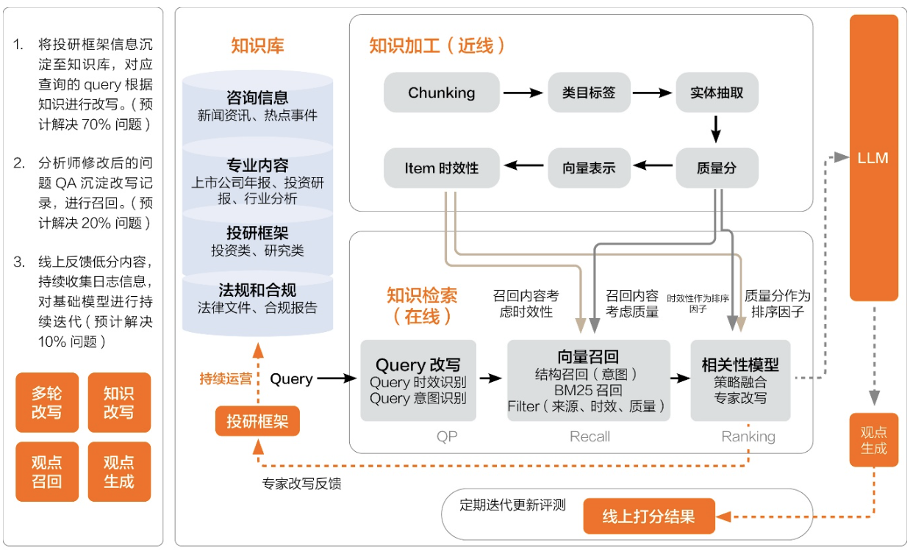

**1、构建投研知识底座**
 围绕投研流程中高频使用的信息源，构建包括【咨询快讯、行业研报、投教知识、研究框架、指标说明】等内容的知识库。结合历史问答和专家经验，统一整理为结构化“投研框架”，实现可持续迭代的知识沉淀与运营。

2、 **知识内容加工处理**
 针对不同来源的文本内容，进行结构化处理，包括：文本切分（Chunking）、类目归属、实体信息抽取、质量评估打分、时效性标注及向量化等步骤，提升知识检索的效率与准确性。

```JSON
“质量分”在的作用是衡量知识项的信息质量与可信度，作为知识召回排序与后续生成输入的重要因子。构建质量分，需结合内容特征、元数据和专家反馈
```

比如质量分的维度有：

| **维度** | **含义** | **示例** |
| --- | --- | --- |
| 来源权威性 | 内容是否来自权威/可信来源 | 上市公司公告 > 新闻摘要 > 社交媒体 |
| 内容完整性 | 内容是否涵盖关键要素/结构化程度 | 一段研报vs完整章节 |
| 时效性 | 内容是否过时/是否近期 | 法规政策类3个月内有效，新闻24小时内更优 |
| 专业性 | 行文用词是否准确、是否具备专业判断 | 行业术语丰富 vs 通用语言 |

打分方法：

（1） **规则评分（Heuristic Rules）：**通过业务规则（如内容类型+发布时间+来源URL）设定分值-适合冷启动

```JSON
if 来源 == '证监会官网':
    来源分 = 1.0
elif 来源 == '财经媒体':
    来源分 = 0.8
else:
    来源分 = 0.5
```

（2）模型评分：将模型打分输出进行加权融合，形成最终质量分

（3）用户/专家反馈融入：如引用频次高、专家打分高的内容，质量分动态提升。

一个常见的融合打分方法如：

```JSON
质量分 = α * 来源分 + β * 时效分 + γ * 专业性分 + δ * 用户/专家反馈分
```

α~δ 可由专家设定或通过实验优化

3、 **知识检索机制**
 用户Query输入后，系统通过“意图识别”与“Query重写”提升问题理解能力，结合混合检索机制（语义召回、BM25等），reranker模型进行重排序打分后，从而提取最优答案候选内容供大模型生成使用。

4、 **点输出与优化闭环**
 针对大模型输出的观点内容，建立 **专家打分机制**， **用于构建高质量RLHF训练样本**，不断优化模型生成质量与问答匹配度，实现“人机共训”的智能增强闭环。

## 4.24 RAG最全排查策略（重要！）
RAG和一般的算法不同，他是一个由多个模块组合而成的系统方案，RAG 系统由“数据入库 → 知识检索 → Prompt 构造 → LLM 生成 → 后处理”五大板块组成，任何一个环节出问题都可能导致最终 bad case。，因此，RAG问题一般的分析思路总结如下（所有rag项目都可以参考以下思路）

建议从 **==指标设计 → 流程定位 → 深度原因分析 → 方案验证 → 收益回溯5大步骤==**展开：

```JSON
1、【指标设计】最终指标的评估体系设计、数据集的选择
2、对于bad case，需要分析全流程的计算结果，确认从bad case开始出错的位置，例如路由、召回、prompt构造、大模型、cot结果、反思等等，出错的次数多的就是问题的关键节点。

3、【流程定位】对出问题的环节，确定这个位置出现该问题的原因：

比如：
路由的错误，大部分情况就是分类模型的错误，类目（比如意图识别）的边界设计是否合理，知识是否有重合，模型本身的能力是否充足，如果是用大模型做的，那prompt是否有描述清楚等
召回的错误，大大部分原因是知识切片是否合理，如果是向量召回，两者的语义相关性是否足够等

4、【深度原因分析】路径越长最好分析的数据量要更多：
有些看不出问题的bad case，在数量更多的时候会容易发现问题，能感知到某些问题的聚集性，便能总结出某类型占所有问题的占比，占比高了就是重要问题，一旦解决肯定能带来可控可预知的收益

5、【方案验证】针对问题提出解决方案，实施和实验6、【收益回溯】回溯问题的解决情况：
比如：
某个问题在bad case里的出现比例30%降低到15%，整体准确率是83%，那很可能整体准确率就能提升到85%以上了，带来2个点的收益，就是非常明确的收益
```

1、明确最终目标与评估指标

（1） **确定核心业务指标**

```JSON
回答准确率（正确答案数 / 总查询数）
回答召回率（正确召回数 / 应召回总数）
用户满意度（NPS、好评率）
接口延迟、超时率、成本（token 用量 or 资源消耗）
```

（2） **选取数据评测集**

```JSON
正负例均衡：既包含典型问答，也要覆盖长尾、模糊、跨域、多轮对话等场景；
案例分层：按业务模块（路由/召回/生成）或难度分层（简单/中等/困难）标注，便于后续定位；
持续更新：线上每周抽样 100–200 条真实用户 bad-case，补充到评测集中。
```

2、全流程 Bad Case 定位

（1）收集 Bad Case 清单

```JSON
定期从日志或人工反馈系统导出“模型答错”或“用户投诉”案例；
对每条 bad case 打标签：错因初判（例：没有召回到正确文档 / 回答偏题 / 格式缺失 / 无法解析多轮上下文 等）。
```

（2）逐个pipeline分析

```JSON
路由阶段：LLM 判断用户意图或领域的步骤，打出“路由命中率”；
召回阶段：向量检索或关键词检索召回的 Top-K，统计召回命中率；
Prompt 构造：拼接 context → prompt，检查 context 覆盖度、token 截断情况；
生成阶段：LLM 输出结果，统计“生成事实错误率”与“生成格式合规率”；
后处理：是否做 rerank、是否有二次校验环节。
```

（3）定位首个故障节点：

```JSON
对比每个模块的“坏例占比”：
如果 60% 的 bad case 从召回阶段就没出现正确文档，先重点查召回；
如果召回没问题，但 70% 的 bad case 在生成后出现“答案不完整”或“跑题”，就转向 prompt/模型部分
```

3、深度原因分析：针对定位到的“关键节点”，再进一步拆解原因：

| **模块** | **常见问题** | **深度原因排查** |
| --- | --- | --- |
| 路由 | 问题被分到错误领域（知识库） | • 意图分类模型混淆 • 类目划分不合理 • 示例 Prompt 不足 / 指令含糊 |
| 召回 | 没有召回正确 chunk | • 文档切片策略不当（过大/过小） • 向量索引未覆盖新文档 • 相似度阈值过高/过低 |
| Prompt 构造 | 上下文不完整 / token 截断 | • 直接拼全量 chunk • 滑窗策略未生效 • 缺少上下文摘要或分组 |
| 模型生成 | 幻觉/跑题 | • LLM 较少接触该领域数据 • 缺少 Few-shot 示例 • 未加“只用下方信息”指令 |
| 后处理 | 未做 rerank / 无校验 | • Reranker 无 • 缺少规则校验 • 缺少人工抽查流程 |

4、制定针对性优化方案：

```JSON
1、路由层面增强意图分类：可以做少量 LoRA 微调；
重构类目边界：合并或拆分过于相似的领域；
Prompt 强指令：加上“仅限 XX 领域”明确上下文。

2、召回层面优化切片策略：从“均匀定长”改为“按文档段落+标题”切割
多检索融合：关键词检索 + 向量检索混合检索
动态阈值：针对长尾领域调低召回阈值，保证召回覆盖

3、Prompt 构造摘要压缩：先用 TextRank / LLM 做每个 chunk 摘要，再拼接摘要而非全集
分组提示：对不同文档来源分块标注，保持逻辑顺序
上下文滑窗：只保留 Top-K 最近对话 + 最相关 chunk。

4、模型生成Few-shot 示例：在 prompt 前加 3–5 条正负例证明如何回答；
生成指令：加“禁止回答超出提供信息”或“若无信息请直接回复未找到”；
使用新模型：对比 GPT-3.5、Claude、火山模型，看哪家在该领域表现更优。

5、后处理 & 校验Reranker 上线：使用小模型做检索结果 rerank，再送生成；
人工复核：每日抽查 Top50 bad case，快速迭代 prompt/模型。
```

5、效果回溯与持续优化

**1、量化收益：记录优化前后各模块指标**：如召回命中率从 65% 上升到 80%，生成准确率从 70% 提升到 85%； **统计最终整体准确率提升点**，比如从 75% → 82%，提升 7 个百分点。

**2、回溯验证：**在同一评测集上做对比测试：优化前后对 500 条 bad case 复测； **观察 bad case 数量的减少和新坏例的类型**，确保“漏网之鱼”不新增。

**3、形成复用闭环：**针对每次排查定位出的“Top3 痛点”，形成“排查-优化-验证”文档；把成功经验沉淀成“RAG 排查模板”，方便下一个业务线直接调用。

### 补充：
### 1、文档切块的技巧（这里和这个章节一起看： 4.2.2 ）
文档处理80%+问题都集中在分块，不是弄个移动窗口按着分就好了，不同类型的文章，尤其是不同知识密度的文章，切片粒度不同。

```JSON
1、从内容长度上，
（1）越专业性的文章内容，建议用更短的分块进行向量化，而且也尽可能保留完整一个句子中的专业名词。
（2）综述新闻类内容，分块可以稍微长一些，保留完整信息即可。
（3）建议额外加入一些分块信息，例如所在章节、位置、连续信息的拼接、文章章节标题等。防止因为分块内不包含这些信息导致无法召回，所以需要增加这部分数据（元数据）等。
```

### 2、检索的技巧（这里和这个章节一起看：4.10.1-4.10.4）
**1、不要迷信纯向量**，字面召回/BM25在高频场景下仍然非常有用

**2、大模型不“全能”，但非常适合做中间件/增强器。需要结合意图识别、query改写等策略**

**3、可以用 rerank 模块优化长尾表现 & 相似内容区分度。**

**4、卡阈值 + 无答案处理是必须的，不然大模型会“胡说八道”。**

**5、长句切片/短句合并等前处理很有用，尤其在 QA/搜索任务中**

（1）如果知识库的领域差异较大（垂直领域）必须拆分意图，通用大模型很容易“混义”：强烈建议通过意图识别+路由的方式处理，避免出现领域不同这种差距很大的情况。

（2）检索召回早期去调优向量，不如考虑增加字面召回（用BM25、关键词匹配的方式），召回率尽管低，但是准确率还是很高的，在线高频的case能快速解决，收益会非常大。

| **类型** | **特点** | **你提到的建议** |
| --- | --- | --- |
| BM25 / 字面召回 | 精准、高覆盖 | 高频query必须保留，不要全部靠向量 |
| 向量召回（如 bge-m3） | 语义泛化强 | 要卡阈值、关键词过滤补救“离谱召回” |
| 高频QA | 直接匹配 | 做成“fallback”机制，覆盖固定入口 |

（3）不对称相似度问题，除了去看向量模型（类似bge-m3之类的模型确实可以拷打），还可以考虑挖掘一些高频问题来进行补足修正，或者借助大模型进行问答对挖掘，QA匹配更容易见效。

（4）query改写是有用的，收益真的会很大

（5）如果切片数量非常多（例如达到10w以上），可以考虑增加rerank模块，对TOP内容进行重新调整，小数据量场景不敏感，大量文档后效果显著。语义空间密集了，TOPN召回的内容区分度不够高，通过精排模块能从中优中选优。

（6）关于向量的调优：

```JSON
a）使用 bge-m3，支持 prompt 增强多视角向量，切片能短还是尽量短（对长句切片（降低语义稀释））。
b）直接开源模型针对的是开放域，对于比较垂直的领域，确实是效果不是很好，此时，准备一些可供微调的数据，进一步微调是会有一定收益的，但也要把控好过拟合的风险。
c)向量召回的匹配重点有不稳定性，不知道模型认为的重点和你认为的重点是否一致，有一个比较快速的trick是，对query做关键词抽取，过滤或者降权答案内不带有特定关键词的召回结果，能提升准确率。（过滤无关键词召回结果）（提升精度）
d)卡召回阈值！向量召回或者向量索引，只管给TOPN，如果文档中不存在有关内容，那就没必要放到大模型内了，应该被过滤，此时就需要卡阈值，并做好无答案时下游应该有的回应
```

### 3、大模型在RAG下如何更可靠地生成基于知识库的内容？
大模型在绝大多数情况能结合检索结果给出合适的回答，但在一些情况下经常不行，具体原因如下：

| **问题** | **原因** | **解决策略** |
| --- | --- | --- |
| 模型不信知识库 | 训练时预设知识权重大 | 加元信息、引用源、CoT强化引用意图 |
| 微调失效 | 弱化推理/削弱结构性理解 | 优化prompt、回溯校验、避免过拟合 |
| 模型“乱编”答案 | 兜底机制缺失 | 添加“无答案判断”提示、后处理验证 |
| 检索内容弱 | 模型默认放弃使用 | 提升RAG检索质量、压缩冗余、聚焦重点段落 |

1、大模型并不总是“听话”的原因：

（1） **固有知识干扰**（模型内建知识权重过高）

模型内建了大量来自预训练阶段的“记忆”，在面对你提供的材料时，可能优先使用自己的经验，而不是你希望它参考的知识库。特别是在领域专业度较强或更新频繁的场景（如工程安全、医疗、法律），模型陈旧知识会显著影响结果可靠性。

（2） **对检索结果信任度不够**：

如果检索到的内容质量低、结构松散，模型很容易“半信半疑”，甚至选择忽略这些内容，转而凭空编造。

2、解决方案：如何增强模型的“忠诚度”与“可控性”？

**（1）强化检索内容的“可信度信号”**

==加入==**==元信息：如时间戳、来源、作者、出处链接==**==等，让模型更愿意相信内容。==

示例提示词强化：“请仅依据以下2024年由国家应急管理部发布的标准进行回答：…”

（2） **==使用CoT（思维链）和分步骤引导==****：**明确告诉模型如何思考、分几步进行判断、引用哪一部分内容，能有效减少它凭空想象

（3） **==避免盲目微调SFT==****，RL效果也不一定好有待验证**

微调（尤其是全参数）容易让模型失去推理能力或忽视结构性内容，对知识注入反而有副作用。更有效的方式：

==提示词设计==

回溯验证（让模型自校结果）：大模型在生成完答案后，再用一轮检查流程来“验证自己的输出是否靠谱”即进行校对：“是不是有根据？是不是和资料矛盾？是不是瞎说的？”（常用方法：用 LLM 自我复审/用另一个独立模型（或另一轮调用）来检查前一轮回答的引用出处是否真的在资料中/多次让模型生成相同问题的回答，对比这些回答是否一致，如果回答出入很大）

3、 **设计兜底机制**：对“无答案”情况采取必要手段兜底

在所给资料中无信息时设计好兜底方案，例如给出“参考资料中未发现符合要求的回复”，甚至做后处理验证，都是可以的，知识库终究是有限的，所以我们很难避免去做这种兜底方案。无法确保知识库100%覆盖所有问题，因此兜底机制是稳定性保障的底线：

（1） **输出验证机制**：设计提示要求模型回答前 **明确声明是否找到了依据**：

“根据以下资料，若未找到相关内容，请回答‘资料中未发现相关描述’。”

**（2）兜底响应设计**：

设置统一的 fallback 答复形式（让它输出一个预设好的、安全的、统一格式的“无答案”回复），例如：“未在现有资料中找到直接答案，建议人工复查或补充现场信息。”

**（3）增加后处理**：用规则或模型二次校验模型是否输出了不符合规范的内容（如内容编造、不在文档中的术语等）

4、大模型本身质量的重要性： **更强的模型天然具有更高“忠诚度”**。

大模型如 GPT-4、Claude 3、Gemini 1.5，在上下文记忆、引用理解、推理能力上相对更可靠；小模型（如 llama2-7b）虽部署灵活，但更容易“偏题”或乱猜

## 4.25 【案例】如何基于LLM实现数量多、层级多的多标签分类的实战经验
举例：对企业介绍及其专利数据进行多标签分类

**==整体方案：标签表+清洗 → 候选召回 → 分层RAG裁决 → 结果合并/阈值/复核==**

其中LLM应用的节点：

```Python
层级分类器（L1–L4，逐层缩小范围）；
模糊冲突裁判（同一个词对应多个标签时）；
可解释性生成（给出证据和原因，便于审核）；
低置信结果的辅助说明（减少人工压力）
```

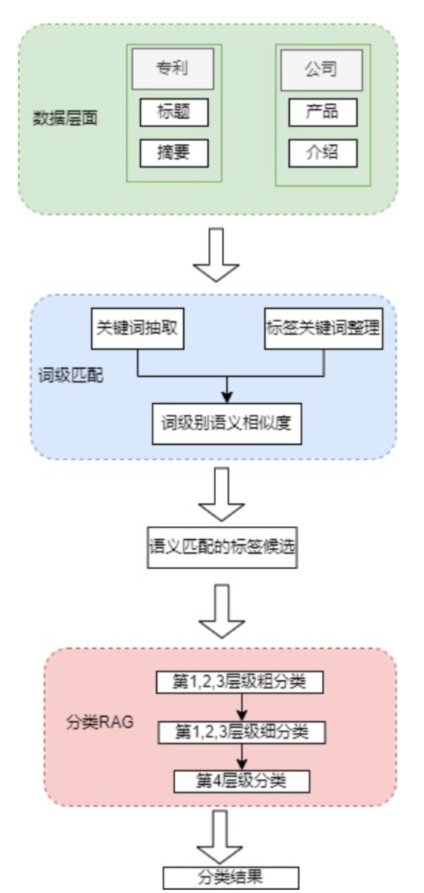

**1、标签表 + 数据清洗**

（1）做一张 **标签说明表：**存在 Excel 或数据库，需要填的内容举例如下：

**==定义+关键词（正反例）+示例（正反例）==**

```Python
label_id：标签编号（唯一 ID，比如 L3-001-005）
name：标签名称（比如 “智能驾驶”）
level：标签层级（1～4 层）
parent_id：父标签是谁（方便知道上下级关系）
definition：标签的定义/解释（它到底指什么）
positive_keywords：常见关键词（比如“自动泊车”“车道保持”）
negative_keywords：反例关键词（比如“车载娱乐”，虽然提到“汽车”，但不属于智能驾驶）
synonyms：同义词/缩写（比如“ADAS”也是自动驾驶相关）
positive_examples：正例的示例文本（比如某专利摘要中写到“路径规划方法”）
negative_rules：不符合的规则（比如“只涉及车身涂装的专利不算智能驾驶”）
```

（2） **原始数据清洗（打标签的对象）**

如： **公司数据**：提取出核心字段：

公司名

主营业务

产品清单

官网介绍（把 HTML 标签、广告话术、重复模版句子去掉，只留下干净的文字）

**专利数据**：名称、摘要、权利要求（可选）再去重

**2、候选召回（高召回、低成本）——词级匹配得到一批候选标签**

（1） **关键词抽取**

输入：公司介绍 / 专利摘要

工具：LAC、Jieba、KeyBERT 等

结果：提取出有意义的词（技术名词、产品名、功能词），比如“自动泊车、路径规划、L2驾驶”

（2） **标签关键词整理：**

输入：标签表里每个标签的定义/关键词

做法：

把同义词、缩写也放进来（智能驾驶 ↔ 自动驾驶 ↔ ADAS）

有些标签可能要人工补充典型关键词（比如“新能源”标签，补充“锂电池、光伏、风电”）

结果：每个标签都对应一组“代表词”

（3） **词级别语义相似度计算（比对谁更像）**

**==把 文本里的关键词 和 标签关键词 两两比较==**：

```Python
if完全一样，直接命中
if相近词（比如“自动泊车”和“智能泊车”），用向量相似度来判断相似度
if拼写差一点的词（“autopark” vs “auto-park”），再用 编辑距离 辅助判断
```

最后给每个标签算一个“匹配度分数”，高的留下来，低的淘汰。输出30～50 个候选标签比较合适

**3、分类RAG（先粗后细 → 到末级）**

标签 4 层、数量多。不能一次把 200+ 标签全丢给大模型。 **思路：每次只给它看一小撮“候选标签卡片”，让它在这些候选里选。先选大方向（L1-3 粗分），再在该方向里细分，最后判 L4 末级。**

（1） **L1~L3 粗分类：**每组调用一次 LLM，只允许 **在组内选择 0~3 个**标签。

```Python
a）每组调用一次 LLM，只允许在组内选择 0~3 个标签
b）要求模型必须给出证据（原文截取）和简短理由，方便解释与审核
c）把多组结果合并去重，得到一批粗方向的 L1/L2/L3 结果

prompt示例：

你是一个严格的分类器。只能从【候选清单】里选择标签。
【文本】
{{doc_text}}

【候选标签(同组)】
- {{label_id}}｜{{name}}
  定义：{{definition}}
  关键词：{{keywords}}
  例句：{{examples}}

请在本组中选择0~3个最匹配的标签。
每个标签给：
- score：0~1
- evidence：从原文中复制的证据句（<=80字）
- reason：简短原因（<=30字）

以JSON数组输出：
[{"label_id":"","score":0.0,"evidence":"","reason":""}]
不匹配则返回 []。
```

（2） **L1~L3 细分类：**只对上一步选中的【 **父分支】**继续细分：若 L1 选中“汽车”，就只在“汽车”这一支下做 L2；若 L2 选中“智能网联”，就只在其子类里做 L3。 **==方法同上：分组 → LLM 只看该组候选 → 返回 JSON。合并后，得到确定的 L3 分支。==**

（3） **L4 末级分类：对每个入围的 L3 节点，把它的 L4 子标签全部取出（通常数量可控）。**分组送入 LLM， **只在该 L3 的子类里选**（0~2 个），继续要求输出： “证据+理由”。给每个 L4 输出 **分数**，并设置阈值（如 ≥0.85 才采纳）。

```Python
你现在只判断【{{L3_name}}】这一支下的末级标签。
【文本】
{{doc_text}}

【候选(L4)】
- {{label_id}}｜{{name}}
  定义：{{definition}}
  关键词：{{keywords}}
  反例：{{negative_rules}}
  例句：{{examples}}

请选择0~2个最匹配的L4标签，并给出score/evidence/reason。
JSON数组输出，格式同上。
```

（4）结果合并与阈值：

```Python
a）层级继承：命中 L4，自动补齐其父链（L3/L2/L1）
b）建议将“前面候选/精排分数 + LLM 分数”做个加权平均
c）阈值策略：
```

**层级继承**：命中 L4，自动补齐其父链（L3/L2/L1）。

**分数融合**：可以把“前面候选/精排分数 + LLM 分数”做个加权平均。

**阈值策略**：

**L1/L2/L3：**要求可以宽松一点（阈值低），这样不容易漏掉方向。

**L4：**要求阈值高，宁可少认一点，也要保证对的。

人工复核：对于阈值在特定区间（如 0.75~0.85），标记为 `review_needed=true` ，进行人工复核

```Python
阈值策略：
L1/L2：≥0.70 通过；0.60–0.70 复核；<0.60 丢弃。
L3：≥0.78 通过；0.68–0.78 复核。
L4：≥0.85 通过；0.75–0.85 复核；<0.75 丢弃。
```

```Python
输出示例：

{
  "doc_id": "patent_123",
  "labels": [
    {"label_id":"L1-汽车","level":1,"score":0.96},
    {"label_id":"L2-智能网联","level":2,"score":0.93},
    {"label_id":"L3-智能驾驶","level":3,"score":0.91},
    {
      "label_id":"L4-自动泊车",
      "level":4,
      "score":0.89,
      "evidence":"……文本中出现“自动泊车、路径规划”……",
      "reason":"与定义高度一致",
      "sources":["embedding","bm25","llm"]
    }
  ],
  "review_needed": false
}
```

## 4.26 【学员辅导案例】AI销售培训助手
1、目标：用“仿真对话+自动评分+纠错反馈+认证通关”的方式，提升一线客服/销售上岗前的知识掌握度、话术一致性与合规性。

**核心价值**：

缩短培训周期：从 T+7 缩至 T+2（示例目标）

一致化话术：关键问题命中率 ≥ 95%

合规兜底：高风险用语零容忍拦截率 ≥ 99%

可量化评估：学员转正前必须通过标准化测评（≥80 分）

2、核心功能：

```Python
（1）对话仿真：基于真实高质量客服-用户多轮对话构建场景库，LLM 扮演“用户”；学员扮演“客服”进行应答。
（2）RAG 检索：按用户意图/话题检索知识库中“标准答案/金句/流程卡”。
（3）自动评分：将学员回答与“标准答案+评分规则”比对，生成维度化分数与纠错建议。
（4）培训报告：单场景报告 + 汇总报告 + 复训建议，输出 PDF/可视化仪表盘。
（5)通关认证：题库/场景闯关制。
```

3、业务流程：

培训负责人发布训练任务 → 学员进入“仿真对话” → AI 用户连续追问（如：异议/价格敏感/售后/合规坑点） → 学员应答 → 系统实时或对话结束后评分 → 生成报告/错题本 → 达标发证

（1）单轮：

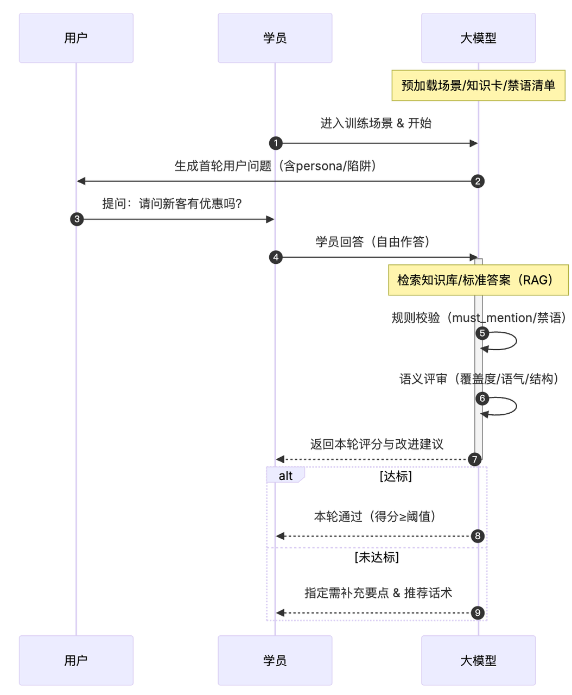

（2）多轮对话：


4、知识库构建：

```Python
来源：历史高评分通话、优秀话术示例、常见异议、政策更新、价格与活动 FAQ、售后场景
清洗：去隐私（手机号/地址脱敏）、去时效过期内容、去噪（口头语）
标注：意图标签、难度、风险级别（合规/价格/承诺）、必答点（关键要点清单）


示例：
{
  "scenario_id": "SCN-2025-08-001",
  "title": "新用户首次询价+赠品异议",
  "intents": ["价格咨询", "优惠政策", "售后保障"],
  "difficulty": "M",
  "risk_level": "M",
  "user_persona": {"type": "价格敏感", "tone": "务实", "region": "华东"},
  "turns": [
    {"role": "user", "text": "新用户有优惠吗？"},
    {
      "role": "coach_standard",
      "key_points": [
        "识别是否新客",
        "解释新客权益A/B/C",
        "提醒时效与限制条件"
      ],
      "golden_reply": "您好，首次下单的新用户可享受A权益…（含时效、适用范围、限制条件）",
      "reference_docs": ["KB-PROMO-NEW-USER", "KB-TERMS-2025Q3"]
    },
    {"role": "user", "text": "隔壁家还送赠品，你们能匹配吗？"},
    {
      "role": "coach_standard",
      "key_points": [
        "价格政策边界",
        "可替代方案（积分/延保）",
        "禁止承诺的合规红线"
      ],
      "golden_reply": "我们的价格政策是… 赠品按照…（提供同等价值替代与边界说明）",
      "risk_tags": ["合规-价格承诺"]
    }
  ]
}
```

5、评估体系：

**准确性**：是否覆盖 must_mention 要点；事实无误、无幻觉

**合规性**：禁语、越权承诺、价格红线；高风险项“一票否决”

**结构化表达**：开场确认、信息收集、答复顺序、确认闭环

**同理心与语气**：礼貌、安抚、积极用语

**业务策略**：替代方案、交叉销售/延保引导是否得当

**时效与效率**：首响时间、无效赘述、引导下一步
