# 5、Agent

## 5.0 Agent基本概念及原理
### 补充： ==Agent智能体生态系统14层：==**==只有基础模型层（10%）是 AI 大模型工作，其他13层（90%）都是架构设计工程工作（如下图）==**
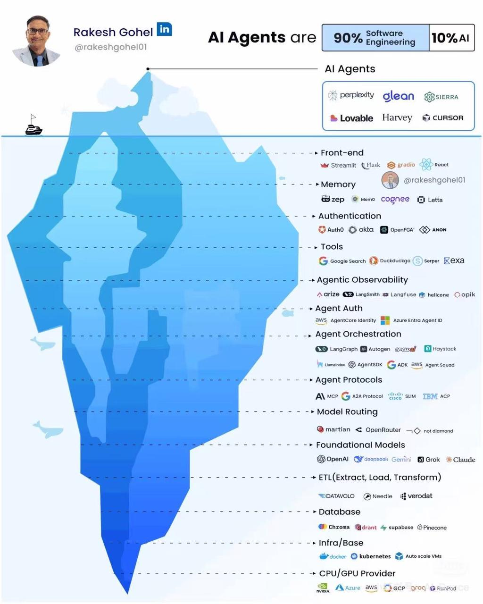

```Python
自下而上：
1、第1层：CPU/GPU 提供商层：为 AI 智能体提供计算能力，用于训练、推理和低延迟的执行
2、第2层：基础设施层：容器和编排工具等基础设施，确保 AI 智能体能够可扩展、可靠且分布式地部署
3、第3层：数据层：实现快速访问的数据系统，用于存储记忆、检索上下文以及在结构化和向量化数据中进行实时决策
4、第4层：ETL（提取、加载、转换）层：这些平台从各种来源收集原始数据，并将其转换成 AI 智能体可以使用的格式
5、第5层：基础模型层：包括大模型和小模型，是 AI 智能体的认知核心，支持推理、对话和行动
6、第6层：模型路由层：根据成本、延迟和输出质量，将任务分配给最适合的模型，从而提高效率
7、第7层：AI 智能体协议层：定义 AI 智能体之间的交互和通信方式（如 MCP、A2A协议，有助于结构化的多 AI 智能体协作和上下文管理）
8、第8层：AI 智能体编排层：使 AI 智能体能够执行工作流、与其他 AI 智能体交互，并在工具和环境中进行协调
9、第9层：AI 智能体认证层：处理 AI 智能体在可信生态系统内的安全身份、访问控制和基于角色的权限
10、第10层：AI 智能体可观测层：通过日志、反馈循环和分析跟踪 AI 智能体的行为，以便持续改进调试智能体
11、第11层：AI 智能体工具层：智能体使用的 API、搜索和外部工具，用于获取实时数据、自动化决策等
12、第12层：认证层：通过安全的身份验证和用户访问控制层保护 AI 智能体的操作
13、第13层：记忆层：存储之前的交互和上下文知识，使智能体随着时间的推移进行个性化和适应
14、第14层：前端应用层：用户与智能体无缝交互的 UI 组件，比如： Web 应用和聊天界面
```

### 5.0.1 概念
Agent （代理）这个词来源于拉丁语“agere”，意为“行动”。现在可以表示在各个领域能够独立思考和行动的人或事物的概念。它强调自主性和主动性 。AI Agent 目前国内通常翻译为 AI 智能体或AI智能代理，是以智能方式行事的代理。Agent感知环境，自主采取行动以实现目标，并可以通过学习或获取知识来提高其性能。1个精简的Agent决策流程：

**==Agent:P(感知)>P(规划)→A(行动)==**

（1）感知(Perception)：指Agent从环境中收集信息并从中提取相关知识的能力。

（2）规划(Planning)：指Agent为了某一目标而作出的决策过程。

（3）行动(Action)：指基于环境和规划做出的动作。

其中，Policy是Agent做出Action的核心决策，而行动又通过观察(Observation)成为进一步Perception的前提和基础，形成自主地闭环学习过程。Al agents 则是使用 LLMs 智能调度。

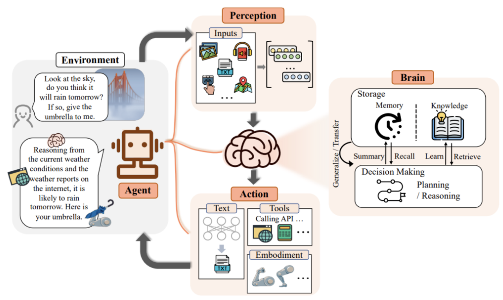

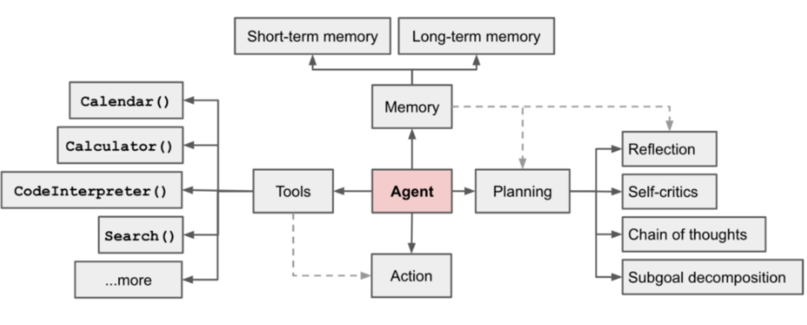

### 5.0.2 关键组件
在 LLM 驱动的 Al Agent 系统中，LLM 充当代理的大脑，并由几个关键部分组成:

**Planning 规划**

- **子目标和分解**(Subgoal decomposition)：Agent 将大型任务分解为更小、可管理的子目标，从而能够有效处理复杂的任务。

- **反思和完善**(Reflection)：Agent 可以对过去的行为进行自我批评和自我反思，从错误中吸取教训，并针对未来的步骤进行完善，从而提高最终结果的质量。

- **自我批评**(Self-critics)

- **思维链**(Chain of thoughts)

**Memory 记忆**

- **短期记忆**(Short-term memory)：我认为所有的上下文学习(参见提示工程)都是利用模型的短期记忆来学习。

- **长期记忆**(Long-term memory)：这为代理提供了长时间保留和回忆(无限)信息的能力，通常是通过利用外部向量存储和快速检索。

**Tool use 工具使用**

-Agent 学习调用外部 API来获取模型权重中缺失的额外信息(通常在预训练后很难更改)，包括当前信息、代码执行能力、对专有信息源的访问等。

-如日历、计算器、代码解释器、网络搜索引擎等

1、单Agent系统的关键组件：

Al Agent不是插件或API接口，但架构中经常使用这两种工具。Al Agent的代理能力使其能够自主采取行动来实现特定结果，因此需要某些关键组件。如果没有正确的组件，企业将无法构建能够规划、行动和学习的Al Agent。

构建一个AI Agent的关键组件如下，根据需要完成的任务类型的不同，AlAgent可能需要更多或更少的组件

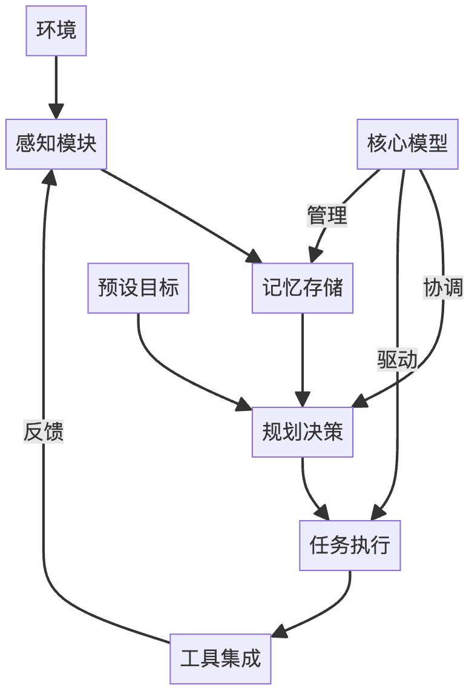

```JSON
主要模块解读：
环境：系统所处的外部环境感知模块：通过传感器/输入接口获取环境信息记忆存储：长期记忆和短期记忆的存储系统规划决策：基于目标和记忆制定行动计划任务执行：具体动作的执行单元工具集成（工具集成）：外部API/工具的调用接口预设目标：系统的初始目标设定核心模型（模型）：协调各模块的中央处理器
```

记忆：AI Agent的记忆库，存储信息、过去的经验和与任务相关的偏好。人工智能的记忆分为用于进程间任务的短期记忆、用于环境信息和过去行动的长期记忆，以及在某些情况下可由多Agent访问的全局记忆;

规划：根据需求紧迫程度或用户偏好将目标分解为更小的任务，并利用基于过去经验或用户行为(保留在记忆中)的启发式方法来优化过程，通常涉及利用记忆改进规划的自我批评过程;

任务：当前要执行的任务列表，与工具配合执行和跟踪每项任务;

工具集成：支持AIAgent与各种环境交互，包括API接口、数据库、用户界面和网络浏览器，扩展Agent操作和控制环境的能力;

感知：使Agent能够感知周围环境，从文本、图像、音频、API接口或各种传感器(如位置数据、环境数据或网络连接等技术数据)中收集数据;

模型：包括大模型、小模型或其他AI技术，帮助AIAgent理解自然语言、提供一般知识并推理复杂问题。每个Al Agent都能多次调用一个或多个模型

目标：AlAgent需要完成的总体任务;

环境：Al Agent将在其中行动的物理或数字领域(例如，机器人或自动驾驶汽车、客户体验、业务运营或网络连接助手)

2、多Agent系统的关键组件

（1）工作流程：

```JSON
从用户提示开始，用户提示可以是人类用户的请求、已确定目标的软件流程或其他Al Agent

与用户或其他Agent之间的通信由Proxy Agent提供，Proxy Agent还可能包含安全措施:

协调Agent负责监督系统运行，协调工作流程、了解其他Agent的角色并检查他们的工作;

主 Agent设定目标，并提示下一个Agent开始工作;

子Agent将其输出返回给主Agent进行审查，以便主Agent协调下一步工作;

个Agent可根据其负责的任务调用合适的大模型、小模型或其他AI技术。
```

（2）关键组件：以文档撰写为例：

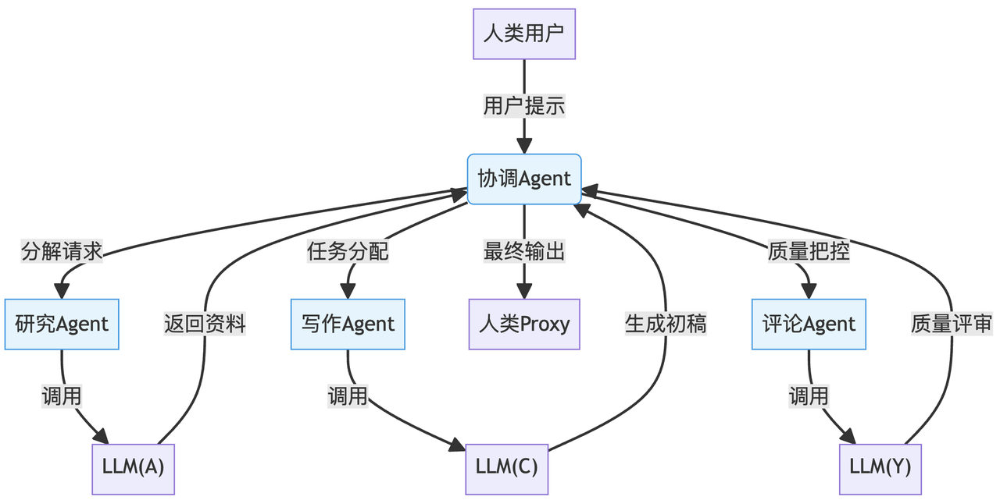

用户提示: 以用户要求文档撰写开始，可以由人类驱动，也可以由其他AI Agent驱动;

协调Agent:在本例中，协调Agent负责控制workflow。协调Agent了解workflow中其他Agent的能力，协调工作并检查其他Agent的工作;

目标提示词（分解请求）：协调Agent的子目标与提示下一个Agent开始工作的步骤相结合，每个Agent都可以使用适合完成其任务的大模型来处理指令;

输出提示词（返回资料）：子代理将输出结果返回给协调Agent审核，以便主Agent协调下一步工作;

LLM：多Agent系统中不同的Agent可能会使用相同的LLM，或者可以根据Agent要完成的任务设计其使用某个LLM 或其他AI技术;

协作：人类和Al Agent将建立协作关系，在此工作流程中，编辑Agent会帮助人类完成最终的文档定稿。

### 5.0.3 Al Agent 的不同类型
Al Agent基于智能水平和能力，通常可以划分为5种类型：

（1） **Simple Reflex Agents - 简单反射代理**，往往基于有限的智能，受限的感知能力做出相应行动，且不具备环境适应性；

（2） **Model-Based Reflex Agents -基于模型的反射代理**，更多是基于模型代理和内部状态做出决策，相比SimpleReflex Agents，MBRA提供了更高级的智能和适应性。

（3） **Goal-Based Agents-基于目标的代理**，一种高度适应性强的实体， **利用知识和搜索算法**来选择能够最佳实现其目标的选项。 **目前大部分智能体都是这种基于目标的类型**。

（4） **Utility-based agents -基于效用的代理**，一种根据其目标做出决策并评估多个场景以最大化预期效用函数的代理方法

（5） **Learning Agents -学习代理**，是 AI 领域中的关键组件，能够利用当前和以前的经验，避免不必要的行为，并学习新的选项以提高性能。此种类型代理能够将感知能力整合到早期未见的环境观察中，并将其存储为内部状态，从而为未来的决策和行动提供有用的信息。因此，Learning Agents 不仅仅是执行任务，还包括研究和规划。

### 5.0.4 Al Agent 的 PLANNING 规划
Planning规划：一项复杂的任务通常涉及许多步骤。Agent需要了解它们是什么并提前计划，绝大多数场景都需要基于目标做任务的拆解。

1、 **如何对复杂任务进行拆解？**

（1） **思维链**（CoT）：增强复杂任务模型性能的标准提示技术。

> ==可以对模型指示进行“一步一步思考”(step by step)==，以利用更多的测试时间计算将困难任务分解为更小、更简单的步骤。CoT 将大型任务转化为多个可管理的任务，并阐明模型思维过程的解释。
>

（2） **Tree of Thoughts**：通过在每一步探索多种推理可能性来扩展 CoT。首先将问题分解为多个思考步骤，并在每个步骤中生成多个思考，从而创建树结构。搜索过程可以是 BFS(广度优先搜索)或 DFS(深度优先搜索)，每个状态由分类器(通过提示)或多数投票进行评估。

任务分解可以通过：

a）通过 LLM 和简单的提示如 "Steps for XYz.\n1."、"What are the subgoals for achievingXYZ?"来完成，

b）通过使用特定于任务的指令：例如"Write a story outline：用于写小说

c）人工输入

**2、PLANNING分解阶段和规划阶段的组合方式（2种）：**

（1） **先分解后规划**： ==先把任务拆解为子任务，然后为每个任务制定规划==，

如【Plan and Solve模式】（见5.2.2）：

将原始的“让我们一步步来思考”，转化为：让我们“首先制定计划”和“执行计划”的两步提示指令

使Agent擅长处理数学、常识及符号推理的工作

但是缺乏灵活调整机制，因为任务在最初都被固定下来了，任何一步失误都会导致整体的失误

（2） **边分解边规划**： ==任务分解和子任务规划交错进行==

如【ReAct模式】（见5.1.1）

将推理与规划分开处理，在推理（思考步骤）与规划（行动步骤）之间进行切换，显著提升了规划能力

但是处理复杂任务时，如果流程太长，可能会导致LLM出现幻觉，让子任务和子任务规划偏离目标

3、 **如何对进行自我反省？**

允许Agent通过完善过去的行动决策和纠正以前的错误来迭代改进。它在不可避免地会出现试错的现实任务中发挥着至关重要的作用。

（1）ReAct 通过将动作空间扩展为特定于任务的离散动作和语言空间的组合，将推理和动作集成在LLM 中。前者使LLM能够与环境交互(例如使用维基百科搜索API)，而后者则提示LLM以自然语言生成推理轨迹。

（2）Reflexion （见5.2.6）是一个为智能体配备动态记忆和自我反思能力以提高推理技能的框架。Reflexion有一个标准的 RL （强化学习（Reinforcement Learning））设置，其中奖励模型提供简单的 **二元奖励**：

这种奖励机制简单明了，通常表示任务的成功或失败。例如，在决策任务中，如果智能体成功完成任务，则获得正奖励；如果失败，则获得负奖励

而动作空间遵循 ReAct 中的设置，其中特定于任务的动作空间通过语言进行增强，以实现复杂的推理步骤。在每个操作之后，Agent可以选择根据自我反思结果决定重置环境以开始新的试验。

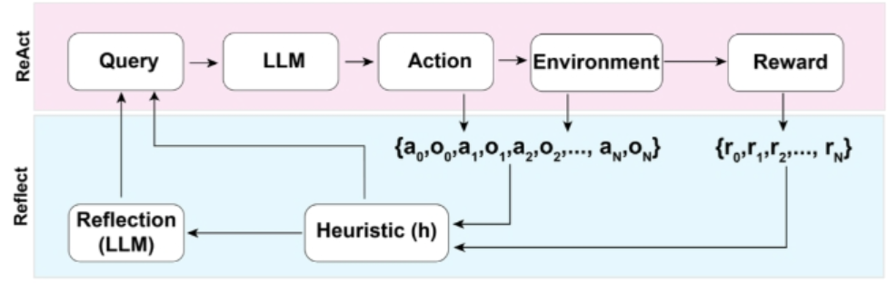

### 5.0.5 Al Agent 的 **Memory 记忆存储**
即AI能够记忆你更多的信息，可以更拟人，更具情感化，更好的为你服务

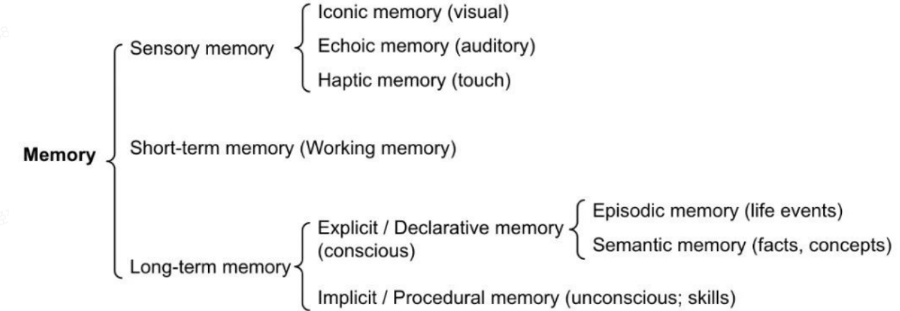

1、 **记忆类型：3类**

用于 **获取、存储、保留以及随后检索**信息的过程。

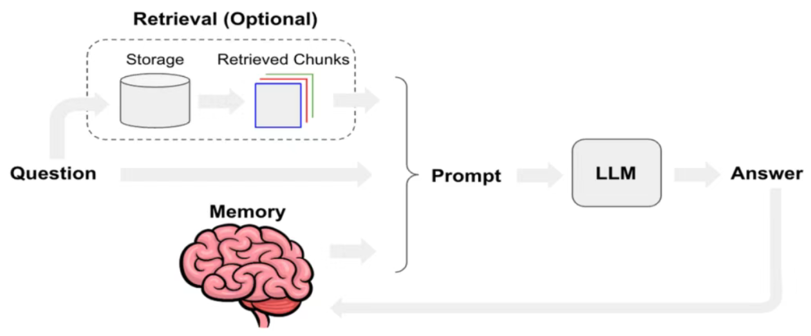

| **记忆类型** | **具体内容** |  | **==映射关系==** | 举例 |
| --- | --- | --- | --- | --- |
| Sensory memory **感觉记忆** | 记忆的最早阶段，提供在原始刺激结束后保留感觉信息，通常只有几秒钟，包括视觉、听觉、触觉 |  | ==学习原始输入：==**==包括文本、图像==**==等形式，短暂保留感觉印象== | 看一张图片，在图片消失后能够在脑海中回想他的视觉印象 |
| Short-term memory /working memory**短期记忆/工作记忆** | 存储当前意识到的以及执行学习和推理等复杂认知任务所需的信息，持续20-30秒钟 | 主要通过上下文窗口或滚动缓存维持；• 适用于保持当前会话连贯性；• **依赖于 LLM 的 token 限制，不能存储跨会话知识**。 | **==上下文学习（比如直接写入Prompt中的信息）==**==，处理复杂任务的临时存储空间，受上下文窗口限制== | 在心算时记住几个数字，但是记忆有限 |
| Long-term memory **长期记忆****==作用：==**1）提升用户体验：避免用户重复输入信息2）增强产品粘性：通过个性化服务提升留存，留住用户，AI产品有你所有的记忆时，用户不会迁移去用别的、不懂你的产品吗 | 存储相当长时间的信息，从几天到几十年不等，存储容量基本无上限，包括：（1）外显/陈述性记忆：对事实和事件的记忆，指可以有意识地回忆起来的记忆，包括情景记忆（事件/经历）和语义记忆（事实/概念）（2）内隐/程序性记忆：记忆无意识，设计自动执行技能，例如骑自行车，用手机打字等 | **可持久化存储知识、用户偏好、交互事件等，包括****· 语义记忆**：结构化知识• **情节记忆**：用户行为记录• **程序性记忆**：执行流程和策略 | ==如查询场景，==**==关注外部向量存储==**==，具备快速检索和基本无限的存储容量== | 学会游泳，多年后再次游泳仍然能够掌握，因为这个技能是属于长期以及的持久存储 |

**==2、多轮对话中让AI保持长期记忆的优化方式【面试真题】/Agent如何获取上下文对话信息==**

场景举例：以下场景都会涉及到Agent长期记忆：如

全能顾问能记住你的重要事情和偏好

AI伴侣会记住你的过往事情

教育辅导场景：学习导师可以追踪你的学习进度

（1）System Prompt存储法： **把用户的重要信息实时或异步存储到“系统提示词”**。

优点：全局生效，无需专门再去设计记忆调用环节，OpenAI采用此方法

缺点：system prompt的信息容量有限，不适合存储大量个性化数据

（2）RAG检索增强： **将用户信息存入知识库**，需要时就会自动查询调用。

优点：存储容量大，信息调用灵活

缺点：对于记忆调用时抽取的准确率要求较高，如果没有优化好，效果不如system prompt

（3） **设置外部记忆系统：将用户特征提取后，转化为结构化的数据存入数据库**。（这里会涉及到实体关系抽取和知识图谱的能力）

系统可提取重要的用户偏好、意图、需求等，存储到独立数据库中，后续对话根据内容或关键词从记忆系统提取相关信息，动态填充到当前对话中。对于超长时间或跨多天的对话特别有用，如用户和模型讨论一周前项目细节，通过外部存储可重新加载关键信息。

优点：实现简单，门槛很低

缺点：会损失很多定义字段外的信息

比如在医疗场景下，病人可能会描述多个症状和过去的医疗历史（如“我有糖尿病史，最近觉得经常口渴和疲劳”）。ConversationKGMemory 可以构建一个包含病人症状、疾病历史和可能的健康关联的知识图谱，从而帮助 AI 提供更全面和深入的医疗建议。

```Python
from langchain.memory import ConversationKGMemory fromlangchain.llms
import OpenAl llm=OpenAl(temperature=0)memory=ConversationkGMemory( llm=llm)
memory.save_context({"input":"小李是程序员"},{"output": "知道了，小李是程序员"})memory.save_context({"input":"莫尔索是小李的笔名"},{"output":"明白，莫尔索是小李 的笔名"})

variables= memory.load memory_variables(["input":"告诉我关于小李的信息”})
print(variables)#输出
{'history':’On 小李:小李 is 程序员,小李 的笔名 莫尔索.}
```

比如在法律咨询场景下，客户可能会提到特定的案件名称、相关法律条款或个人信息(如“我在去年的交通事故中受了伤，想了解关于赔偿的法律建议”)。ConversationEntityMemory 可以帮助 AI记住这些关键实体和实体关系细节，从而在整个对话过程中提供更准确、更个性化的法律建议。

```Python
Ilm=ChatOpenAl(model="gpt-3.5-turbo",temperature=0)
memory=ConversationEntityMemory(llm=llm)
_input={"input": "wx: qt02745"} memory.
load_memory_variables(_input) memory. save_
context(_input,
{"output":"是吗，这个wx号是干嘛的”})
print(memory.load_memory_variables({"input": "莫尔索是谁?"}))#输出，可以看到提取了实体关系{history':"Human:搜索wx《gt02745》的作者是\n AI:是吗，这个wx是干嘛的'，
'entities': {'wx': 'qt02745。"}}
```

（4） **对历史对话进行阶段性总结摘要：**当对话内容变得过长时，可以在每轮对话结束时生成一个摘要，将之前的对话压缩成一个短小的表示形式，保留对话的核心信息。

比如，在教育辅导中，学生可能会提出不同的数学问题或理解难题（如“我不太理解二次方程的求解方法”）。ConversationSummaryMemory 可以帮助 AI 总结之前的辅导内容和学生的疑问点，以便在随后的辅导中提供更针对性的解释和练习

（5） **滑动窗口获取最近部分对话内容**

以商品咨询场景为例在一个电商平台上，如果用户询问关于特定产品的问题(如手机的电池续航时间)，然后又问到了配送方式，ConversationBufferWindowMemory 可以帮助AI只专注于最近的一两个问题(如配送方式)，而不是整个对话历史，以提供更快速和专注的答复。

```JSON
from langchain.memory importConversationBufferWindowMemory

#只保留最后1次互动的记忆
memory=
ConversationBufferWindowMemory(k=1)
```

**==3、分层记忆架构 【实践】==**

（1） **分层记忆架构：****==短期记忆 + 中期记忆 + 长期知识库==**

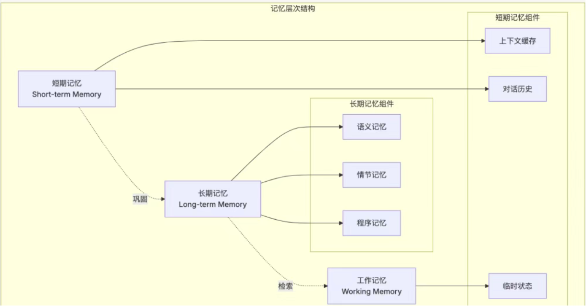

| **记忆层级** |  | **作用** |
| --- | --- | --- |
| 短期记忆 | （1）工作记忆：当前任务的上下文信息 （2）对话历史：近期的交互记录 （3)临时状态：执行过程中的中间结果 | 使用上下文窗口或会话历史，实现对话轮次间的连贯性。 适用于当前对话中的引用、追问与反问处理。优先使用高性能缓存方案 |
| 中期记忆 |  | 对用户历史对话进行聚焦提取、嵌入编码并存入向量数据库，以支持语义相关召回。 适用于跨轮对话、任务型助手等需要回忆近期语义信息的场景 。推荐配合向量化召回机制 |
| 长期记忆 |  | 将结构化知识（如用户偏好、FAQ、行业资料）持久化至 SQL 数据库，供知识增强、个性化推荐等长期任务使用。沉淀稳定知识，适合结构化存储与批量查询场景 |

**动态组合**上述策略，根据业务复杂度与实时性需求进行灵活配置，是构建高性能 LLM 应用的关键能力之一。

（2） **检索性能优化策略**

```Python
a）压缩历史对话内容：借助 LLM 进行层级摘要，对用户历史交互进行语义压缩，保留关键要素同时降低 token 成本。

举例：
原始历史对话（共 7 轮），全部原文约 80-100 tokens；如果用于 embedding 或加入上下文，可能影响后续推理成本和效率
 用户：我想买一副蓝牙耳机。 AI：请问您有偏好的品牌吗？ 用户：小米的吧。 AI：预算大概是多少呢？ 用户：两三百吧，不想太贵。 AI：您希望耳机具备哪些功能？比如降噪、防水等？ 用户：降噪要有，颜色最好是黑色。

 通过 LLM 进行一轮 层级摘要，生成如下结果
 用户希望购买一副价格在200-300元的小米蓝牙耳机，要求支持降噪功能，颜色偏好为黑色。

token 减少到约 30；
保留全部关键信息；
可用于后续：召回商品、构建用户画像、补全对话等场景；同时进一步压缩为结构化槽位
category：蓝牙耳机brand：小米price_range：200-300元spec：降噪，黑色
```

```Python
b）长文本拆分（Chunking）：针对文档或长篇对话内容，使用语义块切分方法，优化向量化与召回效果，使知识检索更聚焦、更精准。

举例：你现在有一篇商品文档，内容如下（约500词）：
小米降噪蓝牙耳机Air 3 Pro支持40dB主动降噪，具备三种降噪模式，适配多场景环境。续航方面，单次充电可使用6小时，搭配充电盒可达28小时。耳机采用11mm动圈单元，支持LHDC高清音频解码，适合HiFi级用户。防水等级达到IPX4，可应对日常汗水和细雨侵袭。此外，耳机支持快速配对、双设备连接、触控操作和语音助手功能。若直接向量化整个段落存在缺陷：语义密度太高，大模型 embedding 无法精确聚焦

语义 Chunking 拆分：按语义块将文档拆成几个可检索的“小知识单元”，每个chunk 50-100 tokens

C1：小米Air 3 Pro支持最高40dB的主动降噪，拥有三种降噪模式，适配不同场景。C2：单次充电续航6小时，搭配充电盒总续航可达28小时。C3：配备11mm动圈单元，支持LHDC高清音频解码，适合HiFi级听感用户。C4：防水等级为IPX4，可防汗防雨，适用于日常运动与通勤。C5：支持快速配对、双设备连接、触控控制与语音助手功能。用户提问：“它防水吗？”有语义拆分：直接召回 C4无语义拆分：召回内容包含降噪、续航、音质、防水等信息混合体
```

```Python
c）检索窗口动态扩展：支持按需扩大检索上下文范围（如查询全用户 vs 查询当前用户），结合缓存策略适配不同业务目标。

举例：

用户提问：“我去年双十一买的耳机型号是什么？”
——这个问题伟“用户个性化信息查询”，需要查找用户的历史订单记录，甚至是系统外部信息。

“检索窗口”指的是你让系统“查哪一类信息”的策略：
当前用户窗口：只查当前用户的私有信息（如订单、对话记录）全局窗口：查所有用户共享的知识库、商品数据、规则文档等混合窗口：根据意图动态决定使用哪些检索范围if当前用户窗口：系统仅在用户的历史订单记录中做 embedding 检索返回：“2023年11月11日，你下单购买了小米 Air 3 Pro 蓝牙耳机。”if全局窗口：如果用户问：“现在还有去年买的那款耳机吗？”系统可能需要进入商品全量知识库（不只是用户的私有数据）进行向量检索，查：当前商品是否在售；是否改款或停产；是否有替代品推荐；返回“小米 Air 3 Pro 已停售，推荐您尝试 Air 4 SE，功能类似。”if混合窗口：如果用户问：“那个我买过的耳机还能保修吗？”系统识别意图：查询“购买记录 + 商品政策”：在“用户私有数据窗口”中查历史订单；在“商品知识库”中查售后政策；拼接后生成回答：“您于 2023年11月购买的 Air 3 Pro 已过保。根据售后政策，支持付费维修服务。”如何实现动态扩展：1、意图识别 + Slot 填槽：判断当前用户提问是否涉及“个性化信息”、“通用知识”或“两者结合”。2、配置检索优先级策略：如售后问题 → 优先查“商品政策库”；订单问题 → 优先查“用户数据库”3、缓存结合检索范围：使用 Redis 缓存用户最近的历史行为/语义摘要，优先本地命中，避免每次都做全库 embedding 检索
```

（3）成本控制与系统性能平衡：

在部署 LLM 驱动的记忆系统时，应在响应效率与资源消耗之间做好权衡，具体手段如下：

```Python
a）使用 Redis 等内存型缓存系统作为短期记忆容器，支持毫秒级向量召回，降低 LLM 重复推理成本；

b）采用 FAISS 等本地部署向量库 实现语义快速匹配，规避远程向量服务带来的网络开销；

c）利用 PostgreSQL 等关系型数据库 存储结构化长周期数据，如用户偏好、历史交互标签、业务指标等，适配低频但高价值的数据持久化需求。
```

（4）场景化落地推荐方案：

根据实际业务类型与系统复杂度，建议采用如下记忆系统配置：

| **应用类型** | **推荐架构配置** |
| --- | --- |
| 聊天机器人 | Pinecone / FAISS + Redis： 用于实时语义检索与对话缓存，提升上下文一致性 |
| 金融数据分析 | PostgreSQL + 向量数据库： 构建支持回溯分析的中长期记忆库，输出财报摘要与风险预警 |
| 全能AI助手 | Letta AI + NoSQL：支撑复杂任务代理系统的长期规划、阶段性目标与多轮任务追踪 |

#### 1、如何在 Agent 中实现长期记忆？（实操级拆解）
长期记忆分为三类： **情景的、语义、程序。**

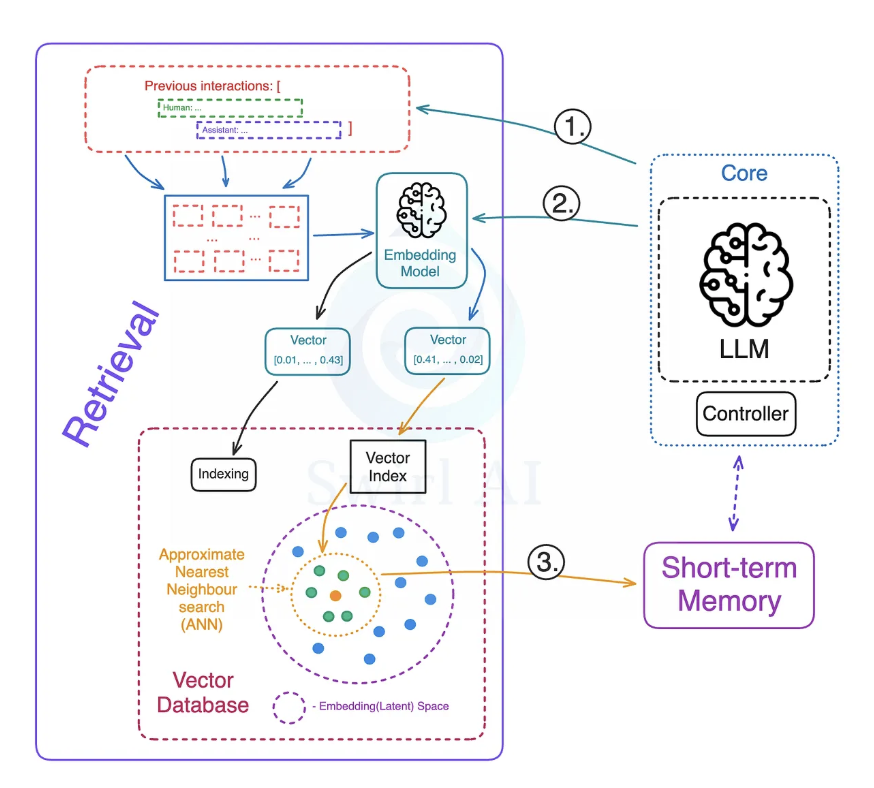

```JSON
1、与agent交互，
每次你在和模型对话、点击按钮、执行某个工作流，系统就会把这些行为记录下来。
比如你对 Agent 说：“下次请记住我喜欢生成 Markdown 格式”，或者你完成了一次文案审核，这些都算“交互历史”。

2、执行的操作将被写入支持语义检索的向量数据库中（示例图中向量数据库）
存进去的内容可以后面随时取用，不会被遗忘

3、对话前“回忆”相关记忆（检索）
每次模型准备响应用户前，系统会去“记忆库”里查一查：你之前说过的内容，有没有哪些和这次对话相关？索出来的内容，会被自动拼接进Prompt里发给大模型

4.模型收到 Prompt 时，结合短期记忆，一起用来生成回答，以此实现AI记住了你是谁、记住了上次的事情，实现多轮、多任务上下文的连续性
```

（1） **情景记忆**（记住你和AI之间发生过什么（动作、对话、执行））：包含agent历史执行的交互和操作，这种记忆的实现本质就是RAG。不同之处在于，为检索阶段存储的上下文来自Agent内部，而不是外部数据来源。

（2） **语义记忆：**记住知识（比如你告诉AI你喜欢法国文学、你是做审计的

（3） **程序记忆**：写在agent脑子里的“功能模块调用逻辑”和“系统行为规则”：它不是靠上下文记住的，也不是靠向量检索回来的，而是直接“嵌入到系统逻辑”或“编码写入”中的固定流程或工具配置

**【长期记忆的关键设计要素】**

需要回答三个问题： **存什么？怎么存？怎么查？**

```Python
（1）存什么（经验内容）
将过往交互中的关键信息（用户反馈、执行过程、结果说明等）抽取出来。
这些内容经过语义向量化，成为长期记忆的“知识单元”。

（2）怎么存（存储方式）
除了内容本身，还需要给经验打上元数据标签。
常见的元数据包括：所属场景（scene）、时间戳（timestamp）、优先级（priority）等。
这样不仅能按语义找，还能结合场景或时间等条件进行过滤。

（3）怎么查（检索方式）输入新的 query 后，先通过语义相似度匹配可能的历史经验。然后再结合元数据进行二次过滤和排序，例如优先选择近期且用户反馈较好的经验。
最终把结果作为上下文输入到 LLM 中，帮助智能体做更合理的推理和决策。
```

**==长期记忆的向量数据库设计核心：将经验语义转化为可计算的向量，并通过相似性检索实现跨场景复用。通过结构化的经验定义、元数据设计和检索策略，A Agent 能从历史经验中快速学习，逐步提升决策能力这正是 Agent“智能化”和“持续进化”的关键==**

（1）数据结构示例： **一条长期记忆记录，通常由三部分组成：向量 + 文本内容 + 元数据。**数据表举例如下

| **字段名** | **类型** | **说明** |
| --- | --- | --- |
| **id** | 字符串 | 唯一标识，如 exp_12345 |
| **vector** | 向量 | 文本内容的语义向量 |
| **content** | 字符串 | 经验的具体描述，例如“处理某字段缺失时，用户采用了均值填充” |
| **scene** | 字符串 | 使用场景标签，如“data_cleaning”“missing_value_processing” |
| **timestamp** | 整数 | 经验创建时间（Unix 时间戳） |
| **priority** | 整数 | 优先级评分（1~5），通常根据用户反馈或业务效果动态调整 |
| **source** | 字符串 | 数据来源标记，例如"user_feedback" 或 "task_success" |

（2）以milvus为例：创建用于存储长期记忆的集合：

```Python
from pymilvus import connections, FieldSchema, CollectionSchema, DataType, Collection, utility

# 1. 连接 Milvus 服务
connections.connect("default", host="localhost", port="19530")

# 2. 定义字段
fields = [
    # 唯一 ID
    FieldSchema(name="id", dtype=DataType.VARCHAR, max_length=50, is_primary=True),

    # 经验向量 (768维，与嵌入模型输出维度一致)
    FieldSchema(name="vector", dtype=DataType.FLOAT_VECTOR, dim=768),

    # 经验文本内容
    FieldSchema(name="content", dtype=DataType.VARCHAR, max_length=2000),

    # 适用场景 (数组类型)
    FieldSchema(name="scene", dtype=DataType.ARRAY, element_type=DataType.VARCHAR, max_length=100),

    # 时间戳
    FieldSchema(name="timestamp", dtype=DataType.INT64),

    # 优先级
    FieldSchema(name="priority", dtype=DataType.INT32),

    # 来源
    FieldSchema(name="source", dtype=DataType.VARCHAR, max_length=100)
]

# 3. 创建集合 schema
schema = CollectionSchema(fields, description="AI Agent 长期记忆: 历史经验存储")

# 4. 创建集合 (如已存在则删除重建)
collection_name = "agent_long_term_memory"
if utility.has_collection(collection_name):
    utility.drop_collection(collection_name)

collection = Collection(name=collection_name, schema=schema)

# 5. 创建向量索引 (加速相似度检索)
index_params = {
    "index_type": "IVF_FLAT",   # 适合中小规模数据的精确检索
    "metric_type": "COSINE",    # 用余弦相似度衡量向量距离
    "params": {"nlist": 1024}   # 聚类数量，影响检索速度和精度
}

collection.create_index(field_name="vector", index_params=index_params)

# 6. 加载集合到内存，准备检索
collection.load()
```

（3）将历史经验写入数据库

```Python
from sentence_transformers import SentenceTransformer  # 嵌入模型

# 初始化嵌入模型（将文本转为向量）
embedder = SentenceTransformer('all-MiniLM-L6-v2')

def add_experience(collection, experience):
    """
    向长期记忆添加一条经验
    :param collection: Milvus集合对象
    :param experience: 经验字典 (含content, scene等字段)
    """

    # 1. 生成唯一ID
    experience_id = f"exp_{experience['timestamp']}"

    # 2. 将经验文本转为向量
    vector = embedder.encode(experience["content"]).tolist()

    # 3. 组装插入数据
    data = [
        [experience_id],            # id
        [vector],                   # vector
        [experience["content"]],    # content
        [experience["scene"]],      # scene
        [experience["timestamp"]],  # timestamp
        [experience["priority"]],   # priority
        [experience["source"]]      # source
    ]

    # 4. 插入向量数据库
    collection.insert(data)
    print(f"已添加经验: {experience_id}")


# 示例：添加一条用户反馈的经验
new_experience = {
    "content": "在处理用户年龄数据时，若缺失值比例超过10%，直接删除字段会导致样本量减少过多，用户建议改用中位数填充并标记缺失记录",
    "scene": ["data_cleaning", "missing_value_processing", "age_field"],
    "timestamp": 1690000000,
    "priority": 4,   # 较高优先级（用户明确反馈）
    "source": "user_feedback"
}

add_experience(collection, new_experience)
```

（4）检索：根据任务查询相似经验，通过元数据过滤

```Python
def retrieve_similar_experiences(collection, query_text, scene_filters=None, top_k=3):
    """
    检索与当前任务相似的历史经验    :param query_text: 当前任务描述 (如“如何处理年龄字段的高比例缺失值”)    :param scene_filters: 场景过滤条件 (如["missing_value_processing"])    :param top_k: 返回最相似的前k条    :return: 相似经验列表    """

    # 1. 将查询文本转为向量
    query_vector = embedder.encode(query_text).tolist()

    # 2. 构建检索参数 (结合向量相似度和元数据过滤)
    search_params = {
        "metric_type": "COSINE",
        "params": {"nprobe": 10}  # 检索时探查的聚类数量，平衡速度和精度
    }

    # 3. 元数据过滤条件 (如仅检索“缺失值处理”场景的经验)
    expr = None
    if scene_filters:
        # Milvus中数组包含条件的表达式 (如scene包含"missing_value_processing")
        expr = " && ".join([f"'{s}' in scene" for s in scene_filters])

    # 4. 执行检索
    results = collection.search(
        data=[query_vector],
        anns_field="vector",
        param=search_params,
        limit=top_k,
        expr=expr,   # 元数据过滤
        output_fields=["content", "scene", "priority", "source"]  # 需要返回的字段
    )

    # 5. 整理结果 (提取相似度分数和经验内容)
    similar_experiences = []
    for hit in results[0]:
        similar_experiences.append({
            "id": hit.id,
            "similarity": hit.score,   # 余弦相似度 (0-1，越大越相似)
            "content": hit.entity.get("content"),
            "scene": hit.entity.get("scene"),
            "priority": hit.entity.get("priority")
        })

    return similar_experiences


# 示例：查询与“处理年龄字段中超过10%的缺失值”相关的经验
query = "如何处理年龄字段中超过10%的缺失值？"
similar_exps = retrieve_similar_experiences(
    collection,
    query_text=query,
    scene_filters=["missing_value_processing", "age_field"],
    top_k=2
)

print("相似经验检索结果：")
for exp in similar_exps:
    print(f"相似度: {exp['similarity']:.2f}, 内容: {exp['content']}")
```

（5）更新与维护长期记忆：淘汰过时经验，强化高频的复用经验

```Python
def update_experience_priority(collection, exp_id, new_priority):
    """ 更新经验优先级（如被多次复用的经验提升优先级） """
    collection.update(
        expr=f"id == '{exp_id}'",
        partition_name=None,
        params={"priority": new_priority}
    )


def prune_old_experiences(collection, days_threshold=365):
    """ 删除超过阈值天数的低优先级经验（如1年未复用的优先级≤1经验） """
    # 计算阈值时间戳（当前时间 - 天数×86400秒）
    current_ts = 1690000000  # 实际使用时用 time.time()
    threshold_ts = current_ts - days_threshold * 86400

    # 删除条件：时间戳早于阈值 且 优先级 <= 2
    expr = f"timestamp < {threshold_ts} && priority <= 2"
    collection.delete(expr=expr)
    print(f"已删除过时低优先级经验")
```

【实践过程】

1、构建存储机制

| 存储类型 | 说明 | 推荐工具 |
| --- | --- | --- |
| 文本型存储 | 持久化历史对话文本列表（暴力法） | Redis / SQLite |
| 向量化记忆库 | 将内容 embedding 后存入向量库 | FAISS / Chroma / Weaviate |
| 结构化记忆表 | 以“人物、事件、偏好、位置”结构组织 | JSON / PostgreSQL |

2、写入记忆：

写入时要做2个处理（举例）：

```JSON
（1）提取摘要/核心信息：不要原封不动塞进数据库
如：“用户说他来自广州，喜欢黑咖啡” → {"位置": "广州", "偏好": "黑咖啡"}

（2）生成 embedding 并附加 元数据metadata：
store_memory("用户喜欢黑咖啡", metadata={"来源": "对话", "时间": "2024-04-12"})
```

3、检索记忆

Agent 处理当前用户指令之前，先进行记忆检索（可以用混合检索：关键词 + 向量搜索）：

`relevant_memories = memory_db.similarity_search(user_query, top_k=5)`

4、 **将检索到的记忆整理好，插入到 prompt（核心）**

```JSON
你知道以下这些事情：
- 用户喜欢黑咖啡
- 用户来自广州
- 上次说过希望推荐精品咖啡店

现在用户问：最近有什么适合的咖啡推荐吗？
```

5、更新记忆

```JSON
（1）检测记忆是否冲突—，如冲突需要替换旧信息
（2）为记忆加元数据，如打标签、加时间、加来源，便于未来追溯和排序(摘要+分类+向量)
```

记忆结构:

```JSON
{
  "user_id": "123456",
  "memory": [    {      "content": "用户喜欢黑咖啡",      "embedding": [...],      "timestamp": "2024-04-12",      "category": "偏好",      "source": "对话"    },
    ...
  ]
}
```

##### **Mem0长期记忆系统——以记忆为核心的可扩展架构（开源）**
通过动态地提取、整合和检索对话中的关键信息，赋予 AI 智能体可靠的长期记忆能力。

https://github.com/mem0ai/mem0

https://mem0.ai/

[AI_Long_Term_Memory_Breakthrough.pdf ](https://internal-api-drive-stream.feishu.cn/space/api/box/stream/download/preview/FoWlbNU75oPj17xXphUc0QVhnue?mount_point=docx_file&preview_type=16)

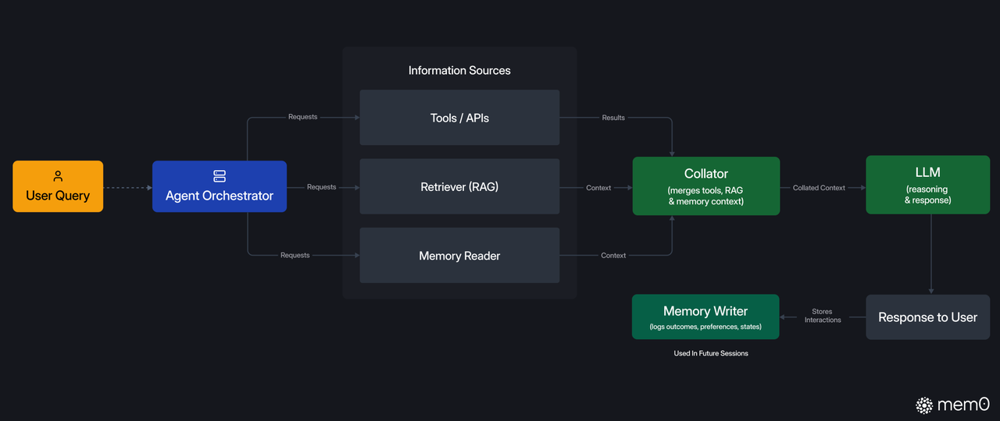

1、核心架构：

2个主要阶段构成： **==提取（Extraction） 和 更新（Update）==**

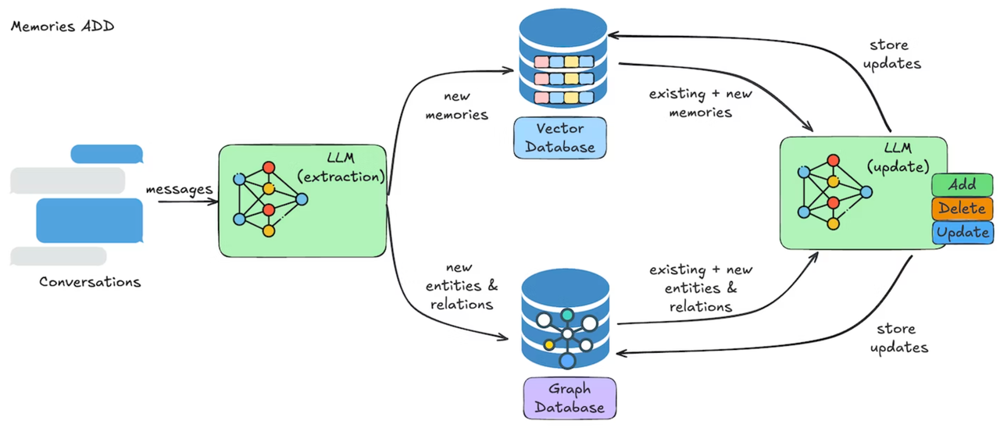

（1）提取：

Mem0 接收到新对话内容，提取阶段开始工作。结合以下两种信息共同构成一个完整的提示词输入到LLM执行提取操作

**a）全局上下文**：从数据库中检索整个对话的摘要，提供对话的宏观主题。

**b）局部上下文**：对话中最近的几条消息，提供细粒度的即时背景。

如提取出关键事实（“用户出行偏好公务舱”），形成一组候选记忆

（2）更新：

提取出的候选记忆通过function calling实现 是否需要添加、更新or删除记忆，来维护一个精炼、准确且与时俱进的长期记忆库

```Python
a）每一个候选记忆都会在向量数据库中检索出语义最相似的已有记忆
b) 将候选记忆与检索到的相似记忆提交给LLM
c）LLM决策执行操作：新增、更新已有记忆、删除矛盾记忆、无需操作
```

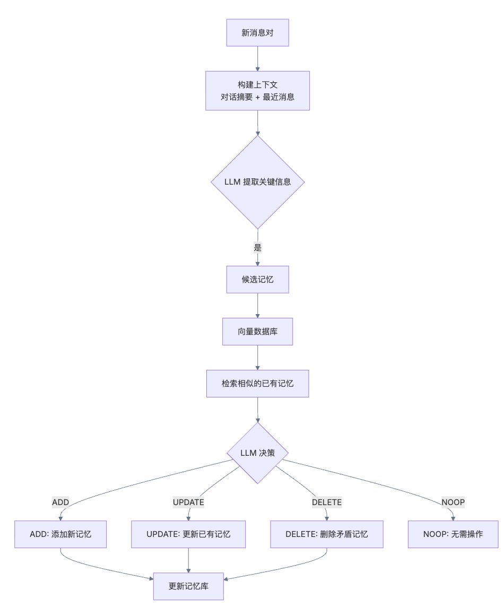

**2、Mem0-graph memory 长期记忆系统架构设计**

https://docs.mem0.ai/platform/features/graph-memory

知识图谱能够记录更复杂的关系和高级概念，和主要存储事实片段的 Mem0 向量数据库一起使用时，两者可以互相补充，让整个记忆系统更加全面

（注：和知识图谱 的实现逻辑一起学习）

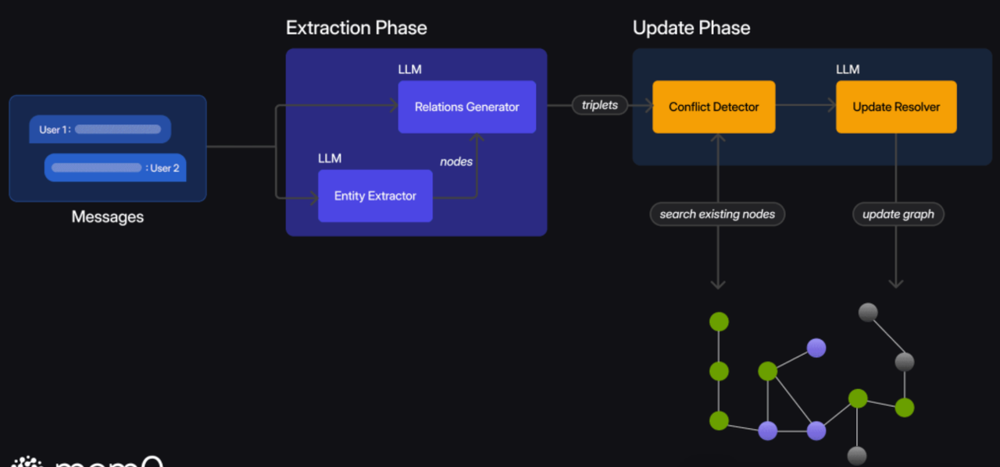

（1） **图提取（关键实体与关系）：**

通过大语言模型（LLM），从文本中找出关键实体和对应类型（比如：“Jack - 人”），再创建连接这些实体的关系三元组（比如： (Jack, 住在, 北京)）

(Mem0 自动构建实体的图形表示，检索考虑实体之间的图形关系），如

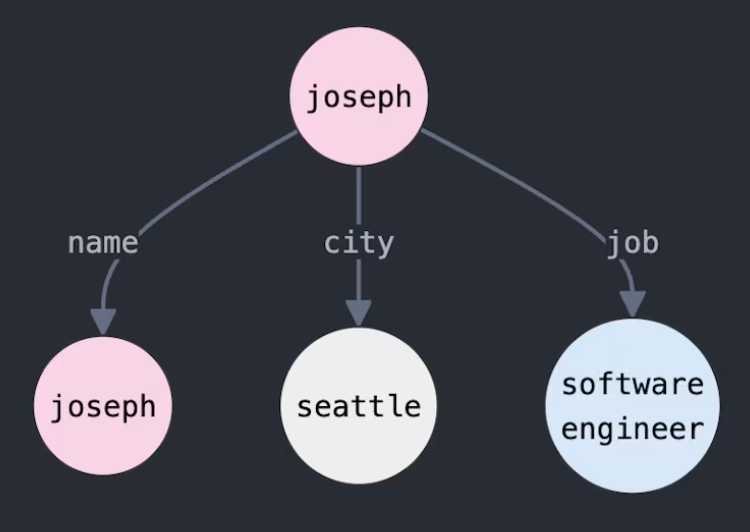

（2） **图更新与冲突解决：**

加入新信息时，Mem0-g 会检查新关系是否和图里已有的关系有冲突。如果冲突， LLM 的“更新解析器”（update reslolver）决定是否将旧关系标记为“过时”，而不是直接删除。这样的设计保留了信息的时间顺序

##### **Letta (前身为MemGPT)记忆系统——（开源）**
采用”虚拟内存“概念管理智能体的记忆。核心创新：双层记忆架构，

**（1）****==上下文内记忆（直接存在于模型上下文窗口中的系统指令、可读写记忆块和当前对话）==**

**（2）****==上下文外记忆（存储历史对话和外部知识的长期存储）==**

当上下文窗口接近填满时，系统会自动将对话历史压缩为递归摘要并存储为记忆块，同时保留原始对话供后续检索，通过工具如core_memory_append、core_memory_replace 和 recall 实现记忆的编辑与检索，从而使 Agent在长期交互中保持连贯性。

通过 Letta 框架搭建的电商客服机器人问答流程示例如下：

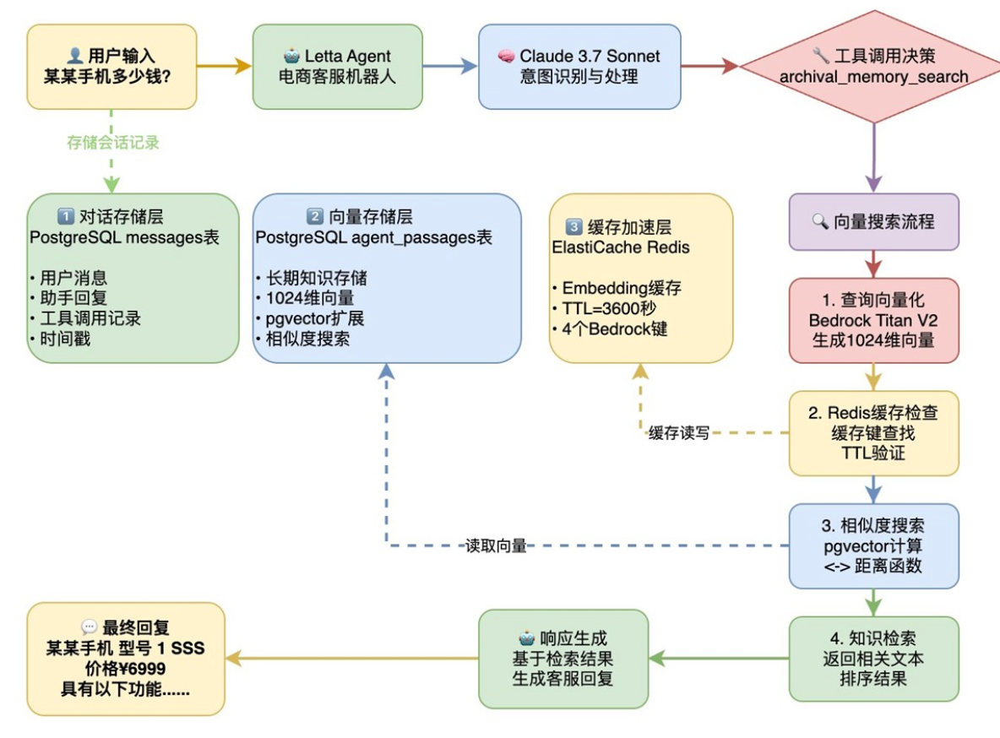

##### 亚马逊云科技的托管记忆解决方案（AgentCore Memory）
1、初始化到记忆检索的完整工作流程图如下：LLM起到两个作用：（1）记忆提取；（2）上下文注入

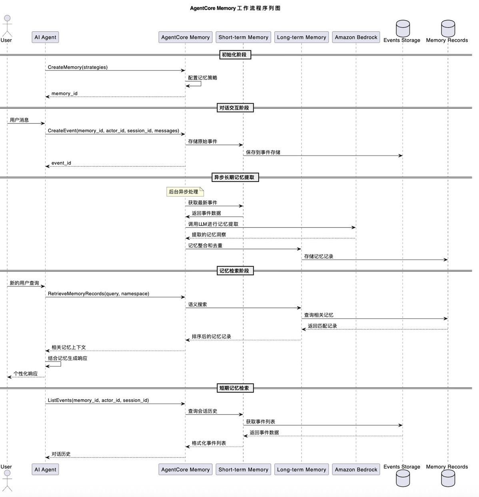

（1） **记忆提取：用LLM进行记忆提取（Memory → LLM）：**

Memory 的长期记忆依赖于对对话内容的自动分析和提炼。AgentCore Memory 内置多种记忆策略（Memory Strategy）定义如何将原始对话转化为结构化长期记忆。长期记忆记录生成后存储于 Memory 中，对应特定类型（如事实、摘要、偏好），每条记录有唯一ID供检索

例如：

- **SemanticMemoryStrategy（语义记忆策略）**： ==从对话中抽取出事实和知识，以便日后查询==。
- **SummaryMemoryStrategy（摘要策略）**： ==为每个会话生成对话摘要，提炼主要内容==。
- **UserPreferenceMemoryStrategy（用户偏好策略）**： ==捕获用户的偏好、风格和重复选择等信息==。

（2） **上下文注入（Memory → Prompt）：Memory 提供存储和检索API，供应用在调用LLM推理时提取相关记忆并注入对话上下文中。**

例如：

开发者在每次生成回复前，调用 `list_events` 获取当前会话最近N条对话记录，将其附加到 LLM 的提示中，维护对话连续性。

对于跨会话的信息，可以使用 `retrieve_memories` 接口通过语义查询长期记忆，例如查询某用户的偏好或某主题的事实知识，然后把检索到的内容纳入提示。

（3） **Memory as tool：Memory 模块可以与Agent框架的推理流程集成，实现自动的上下文注入。**

AgentCore Memory 可被包装成一个工具（Tool）供 LLM 调用。例如：

开发者通过 `AgentCoreMemoryToolProvider` 将 Memory 注册为工具，使得当模型需要回忆信息时，可以自主调用如 “ `agent_core_memory` ” 工具执行 `retrieve` 动作来查询记忆

2、Memory工作机制（组件）：

Memory 模块以记忆存储（Memory Store）的形式存在，每个 Memory 实例都有唯一的 ID。记忆事件（Event）是 Memory 中基本的数据单元，用于存储一次交互的信息，包括参与者、会话标识和消息内容等。每个事件记录包含以下关键属性：

- actorId：参与者ID，用于标识是谁的记忆。例如可以是终端用户ID，或特定Agent标识等。
- sessionId：会话ID，用于将一系列相关交互归组为同一会话（对话）。
- payload：承载实际内容的数据，可以是对话消息（包括角色和消息内容）、工具调用、系统事件等。Memory允许一次事件存储多个消息片段，方便批量写入多轮交互。
- eventId：事件的唯一标识符，支持通过ID精确检索事件。

基于这些储存的Memory， SDK提供了很多API来和储存的memory交互，完成如创建提取删除

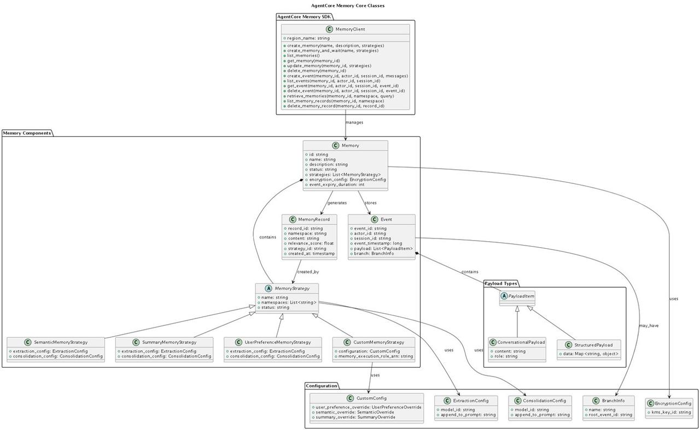

（1）记忆管理：记忆增删改查

```Python
CreateMemory: 创建记忆资源
GetMemory: 获取记忆详情
ListMemories: 列出所有记忆资源
UpdateMemory: 更新记忆配置
DeleteMemory: 删除记忆资源
```

（2）短期记忆操作：

```Python
CreateEvent: 创建事件
GetEvent: 获取特定事件
ListEvents: 列出会话中的事件
DeleteEvent: 删除特定事件

短期记忆工作流程：
事件创建: 使用 CreateEvent 操作捕获每个交互
会话管理: 通过 sessionId 维护对话上下文
历史检索: 使用 ListEvents 和 GetEvent 访问过往交互
```

（3）长期记忆操作：语义

```Python
RetrieveMemoryRecords: 语义搜索记忆记录
ListMemoryRecords: 列出命名空间中的记忆记录
DeleteMemoryRecord: 删除特定记忆记录

长期记忆工作流程：
策略配置: 在 CreateMemory 操作中添加记忆策略
异步提取: 后台自动从原始事件中提取洞察
记忆整合: 将新提取的信息与现有信息合并
语义检索: 使用 RetrieveMemoryRecords 进行智能搜索
```

3、Memory策略处理逻辑：

（1）一次完整的对话中， **短期记忆像一个“对话缓冲区”。每当用户和 Agent 交流一轮，系统都会把这轮对话的信息都记下来形成“事件（Event）”：包括用户query、Agent 回复内容、是否调用工具、工具返回结果。**按时间顺序堆叠在当前会话的记忆里 （2） Agent 需要理解上下文时，可以调用 `list_events` 查看最近几轮的记录，再把这些内容作为提示（context）喂给大模型。即使对话很长，大模型本身不用一直记着前文。Agent 只在需要时检索相关的历史再注入进prompt，保持上下文连贯，也避免了窗口太长导致“记不住”或“遗忘”问题

（3） **长期记忆是 Agent 的“用户档案”。随着用户和 Agent 反复交互，系统会逐步积累关于这个用户的偏好、习惯和常见请求。**比如能自动提炼出“这个用户喜欢 Python 写法”“更偏好简洁的输出格式”“经常问关于品牌分析的问题”，并存进长期记忆。下次用户再问，Agent 能主动调用历史偏好，让回答更贴近用户的习惯和语气

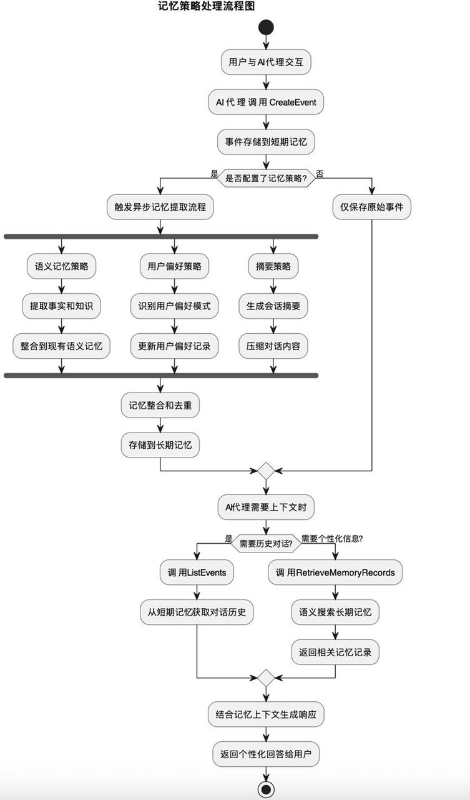

4、案例：智能宠物管家，使用4种记忆策略来实现长期记忆管理，使用的时候可以指定一个，也可以同时指定多个：

（1） **语义记忆 (Semantic Memory)：**存储事实性知识和基本信息

示例：Max是一只2岁的金毛寻回犬，性格友好好动”；“Alice完成狂犬病疫苗接种，体重30kg超重”

```JSON
{
    StrategyType.SEMANTIC.value: {
        "name": "PetKnowledgeBase",
        "description": "存储宠物基本信息、品种特征、健康状况等事实性知识",
        "namespaces": ["/pets/{actorId}/knowledge"]
    }
}
```

（2） **偏好记忆 (User Preference Memory)：**

```JSON
{
    StrategyType.USER_PREFERENCE.value: {
        "name": "PetPreferences",
        "description": "跟踪每个宠物的个性化偏好和习惯",
        "namespaces": ["/pets/{actorId}/preferences"]
    }
}
```

示例：

```JSON
{
"context": "Alice特别喜欢鸡肉，每次都吃得很香",
"preference": "喜欢鸡肉食物",
"categories": ["饮食", "偏好"]
}
```

（3） **摘要记忆 (Summary Memory)：**

```JSON
{
    StrategyType.SUMMARY.value: {
        "name": "PetActivitySummary",
        "description": "创建和维护宠物日常活动的时间线摘要",
        "namespaces": ["/pets/{actorId}/summaries/{sessionId}"]
    }
}
```

示例：存储格式（XML）：

```XML
<summary>
<topic name="训练进展">
        Max学会了握手技能，只用了3次练习就掌握了。
    </topic>
<topic name="饮食习惯">
        Max特别喜欢鸡肉，护理员Alice建议每天给200g。
    </topic>
</summary>
```

（4） **自定义记忆 (Custom Memory) – 核心特性**

```Python
{
    StrategyType.CUSTOM.value: {
        "name": "PetRoleSpecificMemory",
        "description": "针对不同宠物护理角色的专业记忆提取和管理",
        "namespaces": ["/pets/{actorId}/professional"],
        "configuration": {
            "semanticOverride": {
                "extraction": {
                    "appendToPrompt": CUSTOM_EXTRACTION_PROMPT,  # 自定义提取提示词
                    "modelId": "anthropic.claude-3-sonnet-20240229-v1:0"  # 指定提取模型
                }
            }
        }
    }
}
```

自定义提取Prompt设计：

```Python
CUSTOM_EXTRACTION_PROMPT = """
根据当前激活的角色，专门提取相关领域的信息并添加角色标签：

护理员角色：日常护理、饮食管理、清洁卫生、生活习惯
- 提取格式：[护理员] 时间戳 | 活动类型 | 详细描述 | 重要性(1-10)

训练师角色：行为训练、技能培养、纪律管理、训练进度
- 提取格式：[训练师] 时间戳 | 技能名称 | 掌握程度 | 重要性(1-10)

医疗助手角色：健康监测、疫苗提醒、医疗建议、症状记录
- 提取格式：[医疗助手] 时间戳 | 健康项目 | 状态描述 | 重要性(1-10)

请仅提取与当前角色相关的专业信息，忽略无关内容。
"""
```

输入文本：“训练师Bob专业训练报告：Max今天完成了高级服从性训练，坐下指令响应时间2秒，握手动作标准度95%。”

Memory提取结果：“[训练师] 2025-08-01 | 高级服从训练 | Max完成高级服从性训练，对于坐下指令的响应时间为2秒，握手动作的标准度为95% | 9”

#### 2、电商客服场景下：Agent + RAG + 长期记忆的完整处理过程
```JSON
假设用户提问：
 “我上次买的那件蓝色连衣裙码数不合适，可以换成M码吗？”
```

1、Step 1：用户发起问题（用户输入）

`“我上次买的那件蓝色连衣裙码数不合适，可以换成M码吗？”`

2、step 2：意图识别

识别用户当前要做的事，例如：申请换货

```JSON
{
  "intent": "换货申请",
  "动作类型": "换货",
  "对象": "蓝色连衣裙",
  "目标尺寸": "M码"
}
```

3、step3：检索用户长期记忆

查询用户最近的购买记录、偏好、交互内容

（1）检索内容

```JSON
- 订单号：#20240501456123
- 商品：蓝色简约连衣裙（S码）
- 购买时间：2024-05-01
- 用户历史偏好：多次更换尺码，常穿M码
```

（2）输出记忆段：

```JSON
用户在本月1日购买了一件S码蓝色连衣裙，用户在过去3次购买中偏好M码，曾因尺码不合适申请过退换货。
```

4、Step 4：RAG 检索相关知识库

查找“蓝色连衣裙的换货规则”或“平台换货流程”

```JSON
检索到的相关片段：如

- 所有女装类商品支持7天无理由退换；
- 换货要求商品吊牌完整、未洗未穿；
- 用户需在订单详情页点击“申请换货”；
- 平台将自动为可换商品生成换货单。
```

```JSON
输出知识：
该商品支持7天内换货，要求吊牌完整、无洗穿痕迹。请在订单详情页提交换货申请，系统会自动处理。
```

5、step5：拼接上下文 Prompt，由LLM生成

```JSON
你知道以下用户信息：
- 用户于2024-05-01购买了S码蓝色连衣裙；
- 用户过往多次偏好M码，曾换货成功；
- 当前请求更换M码，未提到商品是否洗穿。

以下是平台规则：
- 女装支持7天无理由退换；
- 商品需吊牌完整，未洗穿；
- 需在订单详情中申请换货。

请根据以上信息，判断是否支持换货，并用客服语气回复用户。
```

6、Step 6：LLM生成响应（Agent输出）

```JSON
您好，您在5月1日购买的蓝色连衣裙支持7天内换货，只要商品保持吊牌完好、未洗未穿，您可以在订单详情页点击“申请换货”，我们会为您更换为M码。如有任何问题欢迎继续咨询~
```

7、Step 7：更新用户长期记忆

系统将用户本轮行为追加入记忆库：

```JSON
{
  "时间": "2024-05-06",
  "行为": "换货咨询",
  "商品": "蓝色连衣裙",
  "操作建议": "换成M码",
  "响应结果": "客服已提示换货流程"
}
```

8、step8：写入缓存（可选）

本问题+响应存入缓存池（Redis），下次有用户问同类问题可快速复用

#### **==3、AI短期记忆==**
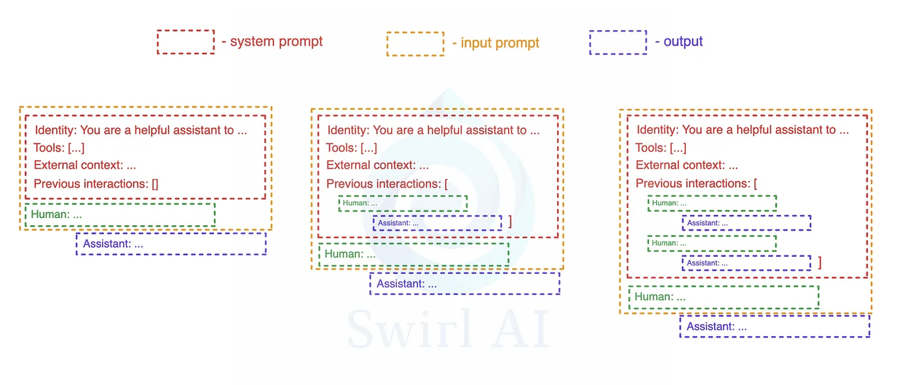

现在大多数聊天机器人系统在处理短期记忆时，采用的方法都很 “实在”— **把对话历史中的每一句话都存储下来**。当我们与助手聊天时，正在发生的交互会被持续地输入到系统提示中，这样系统就能“记住”它已经采取的操作，并从中获取信息来决定下一步。

大模型通常借助 ChatML 的 prompt 模板，自动将这些对话拼接进去：如下：

```Python
<lin startl>systemYou are ChatGPT,a large language model trained by OpenAI, Answer as concisely as possible.
Knowledge cutoff:2021-09-01
Current date:2023-03-01<|im_endl>
<im_start>user
How are you|im_end>
<im_start>assistantI am doing well|im_end>
 <im_start>userHow are you now<|in_end|>
```

但这种方式就像聊天时非要记住对方说的每一个字、每一个标点符号一样，非常不合理。实际应用中的麻烦：

**Token 用量暴增**：每次对话都要消耗大量 token。消耗太快成本吃不消

**上下文窗口溢出(LLM 的上下文窗口大小有限)**：模型处理上下文的能力是有限的，存的对话太多，很容易超出它的处理上限，导致信息丢失或出错。即使上下文窗口很大(例如 100 万个词条)，LLM 考虑所有相关上下文的能力也会随着传递给提示的数据量的增加而降低

**响应延迟**：要处理的历史信息太多，模型思考的时间就变长了，用户等待回复的时间也跟着变长，体验感直线下降。

（补充）借助 `system message` 、 `user message` 和 `assistant message` 可以实现“多轮对话”机制，使得模型可以具备上下文或者和用户对话记忆的能力。 ==只需要将模型返回的==``  ==消息+用户新的提问==``  ==拼接到模型的messages参数中==，并再次向模型进行提问即可实现多轮对话

封装实现：

```Python
from openai import OpenAI

ds_api_key = "你的API KEY"
# 实例化客户端
client = OpenAI(api_key=ds_api_key,
                base_url="https://api.deepseek.com")

def multi_chat_with_model(msg,count=5): #msg表示用户提出的问题，count=5表示只保留最近5轮对话
    text = '张三，男，1990年10月25日出生于中国台湾省高雄市。\
        2013年毕业于北京工业大学的信息工程专业，由于在校表现良好，毕业后被中科院信息技术部破格录取。'

    messages=[
        {"role": "system", "content": text},
        {"role": "user", "content": msg}
    ]
    while True:
        response = client.chat.completions.create(
            model="deepseek-reasoner",
            messages=messages
        )

        # 获取模型回答
        answer = response.choices[0].message.content
        print(f"模型回答: {answer}")


        # 询问用户是否还有其他问题
        user_input = input("您还有其他问题吗？(输入退出以结束对话): ")
        if user_input == "退出":
            break

        # 记录用户回答
        messages.append({"role": "assistant", "content": answer})
        messages.append({"role": "user", "content": user_input})
```

**3种短期记忆管理策略**

（1）简单粗暴的 ==“记忆瘦身法”==：原理就是只保留最近的 N 条对话记录。比如：想让聊天机器人只 “记住” 最后 3 条消息：劣势： **重要的历史信息可能会被误删，而且每次输入 prompt 的轮次固定，可能过长或过短，影响效果**

```Python
from langchain_core.messages import RemoveMessage

def filter_messages(state):    messages = state["messages"]    # 只保留最后3条消息    messages = [RemoveMessage(m.id) for m in messages[:-3]]    return {"messages": messages}

builder = StateGraph(MessagesState)
builder.add_node("filter_messages", filter_messages)builder.add_node("chat_model_node", chat_model_node)
builder.add_edge(START, "filter_messages")builder.add_edge("filter_messages", "chat_model_node")builder.add_edge("chat_model_node", END)
graph = builder.compile()
```

（2）精准控制 ==“记忆量”==：同样是保留一定量的记忆历史，但计算保留的历史信息符合事先设定的特定 tokens 大小

a）设置 `allow_partial=True` ，表示允许消息部分拆分，但可能会丢失上下文；

b） `strategy="last"` 是从最后开始计算；

c） `max_tokens=100` 指定了最大 tokens 数量；

d） `token_counter` 则用于计算 token 数量。这样就能更精准地控制记忆量，避免出现 token 用量过多和上下文窗口溢出的问题

```Python
from langchain_core.messages import trim_messages

def chat_model_node(state: MessagesState):
messages = trim_messages(
allow_partial=True,   # 允许消息在中间部分部分拆分；这种方法可能会丢失上下文。          strategy="last",   # 从哪里开始算，last最后开始
max_tokens=100,  # 最大tokens数量
token_counter=ChatOpenAI(model="gpt-3.5-turbo"),
 state=state["messages"]
 )
  response = llm.invoke(messages)
  return {"messages": response}
```

（3）动态摘要： ==抓住对话 “重点”==：定期对对话历史进行总结，只保留关键信息。但一般来说当积累到 K 轮对话才开始总结，这样能避免频繁总结带来的过多消耗

节选：比如设置当对话消息数量超过 6 条时，就调用 `summarize_conversation` 函数进行总结。总结时，会根据之前有没有总结过生成不同的提示消息，让模型生成新的摘要，然后删除旧消息，只保留关键信息。

```Python
def should_continue(state: State) -> Literal["summarize_conversation", END]:    messages = state["messages"]
 if len(messages) > 6:
 return "summarize_conversation"
 return END
```

#### 【补充】基于coze /dify 智能体的短期记忆实现方式
用处是储存用户对话，让AI记住你们前文，实现个性化服务

- 开始对话，都会从数据库中获取过往沟通
- 结束对话，会汇总当前的记录，存入数据库

-coze：

可通过数据库实现，选择添加数据库后，新建数据表

| 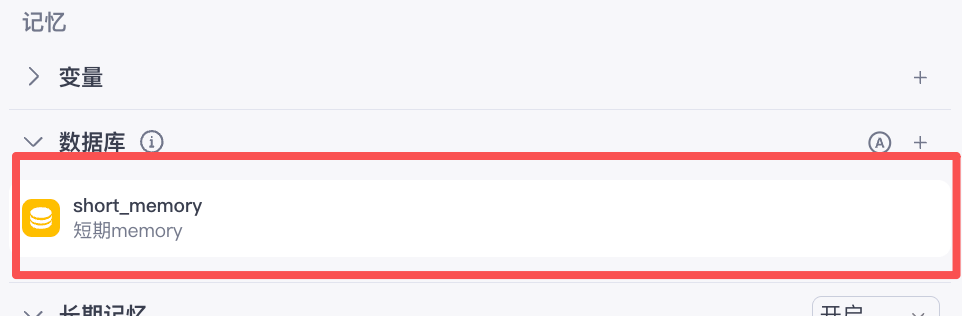 | 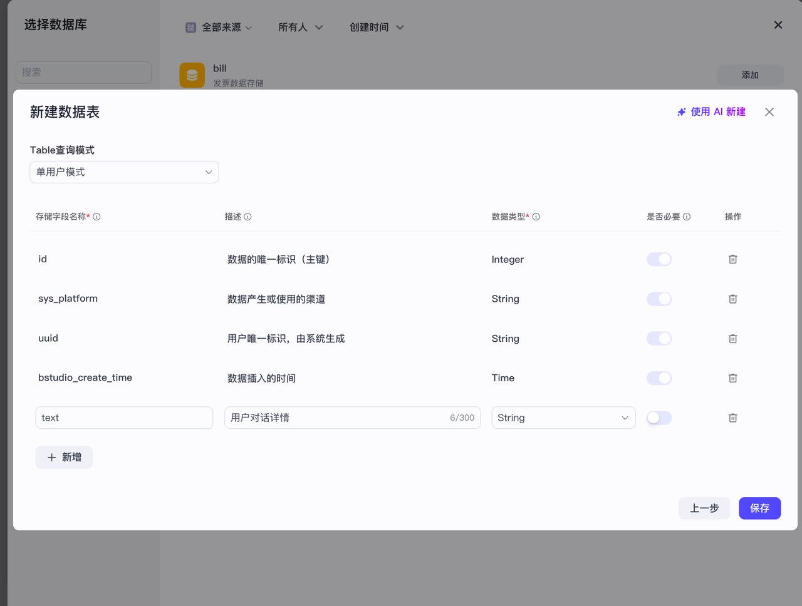 |
| --- | --- |

-dify：可通过会话变量实现

| 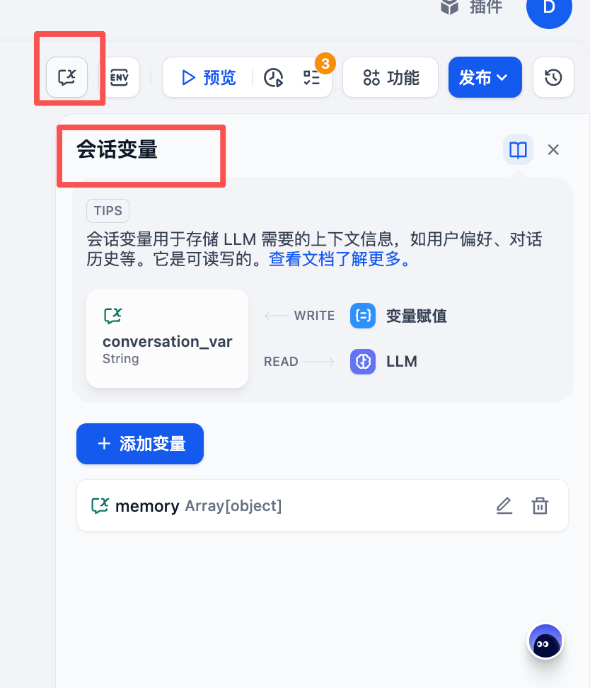 | 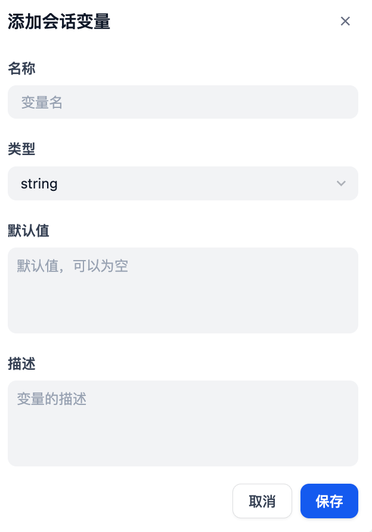 |
| --- | --- |

#### 【补充】 **多轮对话中的历史记忆与精准检索优化**
Agent中，如果既有RAG知识库检索，同时已开启多轮上下文对话，会导致的问题/矛盾：

**（1）不开启历史记忆**：用户说话可能前后不搭，系统无法理解上下文，答非所问。

**（2）开启历史记忆**：系统会带入前文的多轮对话，导致当前 query 被污染，不够“干净”，检索不准。

比如：典型场景：

用户先问“帮我查销量前五的万圣节童装”，下一轮突然问“那它们的配送时间呢？”

如果全量拼接历史，系统可能会混淆主题，召回“童装”信息不准；如果完全不用历史，又无法知道“它们”指的是前文的童装。

1、待解决问题：多轮对话要在 上下文利用 与 检索纯净度 之间找到平衡

```Python
1、历史信息裁剪：是全带？还是只带几轮？还是做摘要
2、话题切换如何识别：新问题还是延续
3、检索如何兜底：仅靠语义召回容易“跑偏”
```

2、解决方案思路：3步建议：

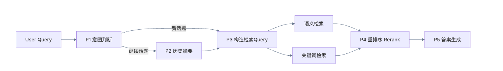

（1）意图判断：用来识别用户当前提问是否和前文属于同一话题

通过：小模型分类器：判断“延续 / 新话题”。规则识别：如含有“它们/上面/刚刚说的”等指代词则视为延续话题

（2）在保留上下文的同时避免噪音

```Python
最近窗口：只取最近2-3轮
摘要拼接：先对前文做意图+槽位摘要，再拼接
结构化存储：存储成 JSON slot，而非长文本
```

（3）混合检索

```Python
多路召回：语义检索+关键词检索
重排序：基于语义相关性 + 关键词覆盖度 + 置信度
兜底策略：当语义不稳定时，关键词检索结果优先
```

举例：

第1轮：用户query：“帮我查销量前五的万圣节童装。”

-》Agent收集到槽位：“童装+销量+万圣节”，得到榜单。

第2轮：用户query：“ **这些衣服**多久能送到？”

-》Agent：

**（1）意图判断**：识别为延续话题（“这些衣服”指童装）。

**（2）对话上下文控制**：只保留上一轮的摘要：

```JSON
{
  "topic": "童装销量榜单",
  "slots": {"节日":"万圣节","品类":"童装"}
}
```

（3） **检索增强**：

```Python
语义检索：“童装的配送时间”
关键词检索：“童装 物流 配送”
Rerank 后选择最相关的
```

第3轮：用户query：“那鞋子呢？”

-》Agent：

**（1）意图判断**：切换话题（“鞋子”与前文“童装”不同）。

**（2）对话上下文控制：**丢弃前文，只用新 query 检索。

3、当“准确率不够”时，怎么升级？

（1）基线：先通过 Prompt优化来实现

```Python
1、拉 30–50 组多轮对话样例，做 离线 A/B
调权重（rerank 中 0.6/0.4）
窗口长度（最近2/3/4轮）
摘要粒度（slots 多 vs 少）

2、设置3类指标：
路由准确率（延续/新话题判对率）≥ 90%
检索命中率（Top3 含答案的比例）≥ 85%
最终回答正确率（人工判定）≥ 80%
```

（2）少样本增强

```Python
1、意图判断：在prompt中加 5–10 组 few-shot（延续 vs 新话题典型例子）
2、历史摘要：在prompt中加 5 组“好摘要/坏摘要”对比举例
```

（3）微调：

如果规则 & few-shot 已经吃满，但路由误判仍>10%，或Top3 命中率卡在 <85%等那再考虑微调，如意图/延续判定：小分类模型（如小型 BERT），几千条标注即可

### 5.0.6 Single Agent vs Multi-Agent框架
**==智能体 =大语言模型(LLM)+观察+思考+行动 +记忆==**

1、Single agent：

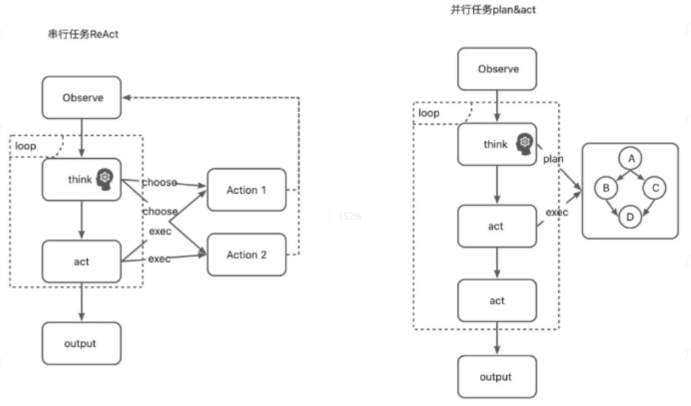

2、Multi-Agent

**==多智能体=智能体+环境（environment）+标准流程（SOP）+通信+经济==**。各agent分工明确、一起协作。

环境通讯：agent之间交互，消息传递，共同记忆，执行顺序等

sop：定义sop，编排任务

评审：输入输出结果解析

成本：agent之间的资源分配

proxy：自定义proxy，可编程，执行大小模型

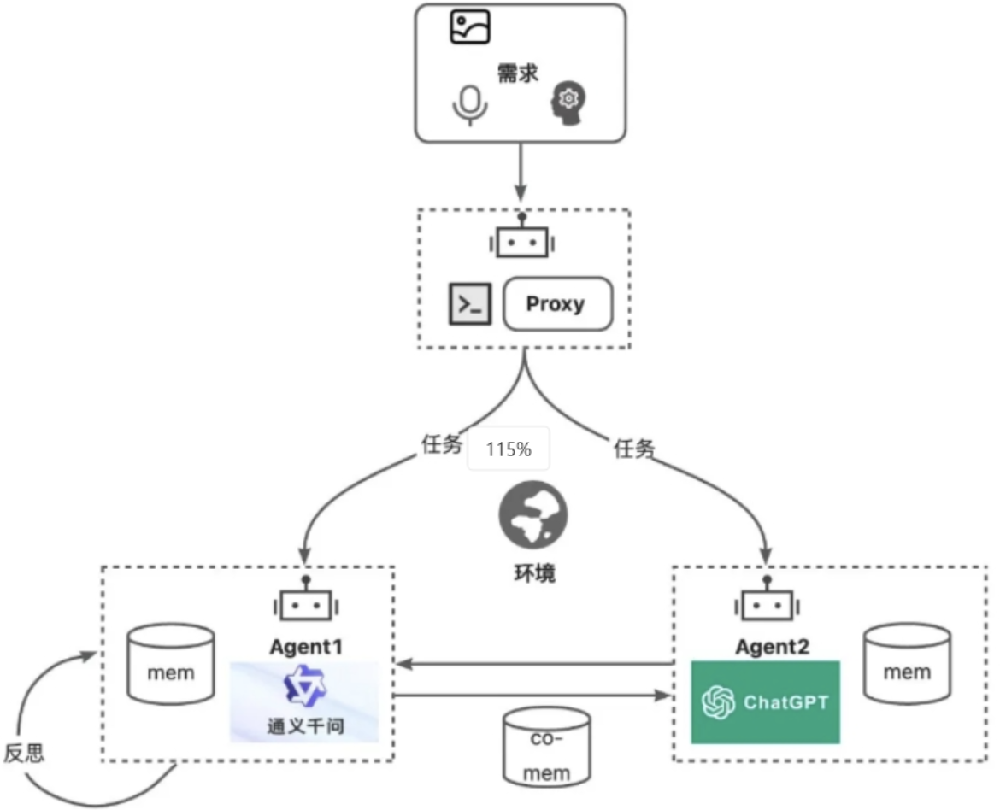

**（1）Multi-Agent 框架 主要组件功能**

a） **智能体**：多智能体系统中的智能体协同工作，每个智能体都具备独特有的 LLM、观察、思考、行动和记忆

b） **环境**：所有的 agent 应该处于同一个环境中。环境中包含了全局的状态信息，agent 与环境之间存在信息的交互与更新。

c） **标准流程(SOP)**：要完成一个复杂的任务，现有multi-agent框架往往采用 SOP 的思想，把复杂的任务分解成若干个子任务。例如，在汽车制造的 SOP 中，一个智能体焊接汽车零件，而另一个安装电缆，保持装配线的有序运作。

d） **controller**：可以是LLM，也可以是预先定义好的规则。它主要负责环境在不同 agent 和 stage 之间的切换。

e） **memory**：在 single-agent 中，记忆只包括了用户、LLM 回应和工具调用结果这几个部分。而在 multi-agent 框架中，一方面由于 agent 数量的增多使得消息数量增多，另一方面，在每条消息中可能还需要对发送方、接收方等字段进行记录。

**（2）核心交互流程：**

a）controller：更新当前环境的装填，选择下一时刻行动的agentA

b）agentA与环境交互，更新自身memory

c）agentA调用LLM，基于指令执行动作，获取输出Message

d）将输出的message更新至公共环境中

举例如下：有3个智能体，他们相互作用，可将信息或行动的输出结果发布到环境中，同时也会被其他智能体观察到

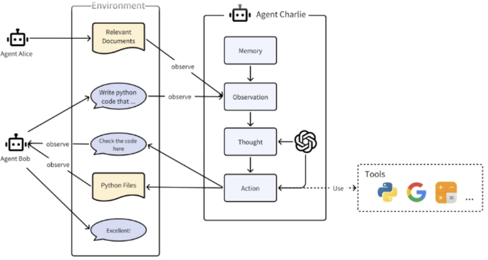

Charlie：

（1）具备的组件：LLM、观察、思考、行动、记忆。思考和行动由LLM驱动，能够在行动的过程中调用外部工具

（2）观察 来自Alice的相关文件和来自Bob的需求，获取有帮助的记忆

（3）根据观察到的环境，思考如何写代码、执行写代码的动作，最终发布结果

（4）将结果发布到环境中，通知Bob，Bob在接收后恢复一句赞美Excellent！

### 5.07 目前主流的Agent架构
（1） **Camel-AI（****https://camel-ai.org****）：开源框架，**专注于多智能体协作，支持角色扮演与任务分工，适用于复杂任务的长链条推理。例如模拟软件开发流程（如项目经理、工程师协作）或科研实验设计。

（2） **微软AutoGen（https://microsoft.github.io/autogen/stable/）：**支持多代理对话框架，允许智能体通过自然语言交互协作完成任务。提供灵活的API调用和工具集成能力，适用于需动态调整策略的场景（如数据分析、客服系统）

（3） **MetaGPT（https://github.com/geekan/MetaGPT****）****：**模拟软件公司的工作流程（如需求分析、编码、测试），通过角色化智能体分工提升代码生成质量。例如清华NLP组的ChatDev项目就基于此架构

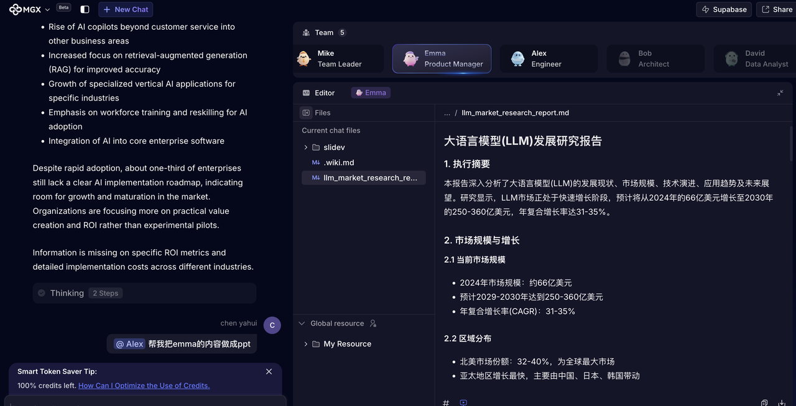

（4） **LangChain/LangGraph****（https://github.com/langchain-ai/langchain）****：开源框架，**以模块化工具链为核心，支持快速构建Agent应用。通过记忆管理（Memory）、工具调用（Tools）和规划（Planning）的标准化接口，降低开发门槛：适合中小型项目，灵活性强，可快速集成RAG（检索增强生成）和知识图谱

（5） **HuggingGPT（https://huggingface.co/spaces/microsoft/HuggingGPT/tree/main）：**以LLM为核心调度器，调用HuggingFace平台模型库完成任务（如文本生成、图像处理）。适用于多模态任务处理

（6） **通用型Agent架构**：比如Manus，该架构支持多种应用场景，如商业分析和旅行规划等

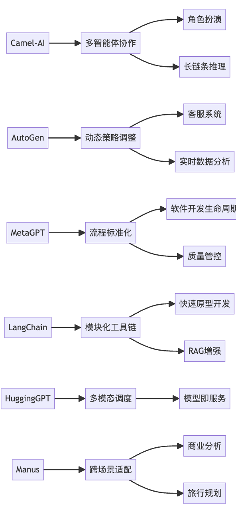

### 5.0.8 Agent系统架构与基础设施单元（一套地基，支撑所有 Agent 应用）
==让企业和开发者更轻松、更安全地构建、运行和管理 AI Agent（6个统一模块）==

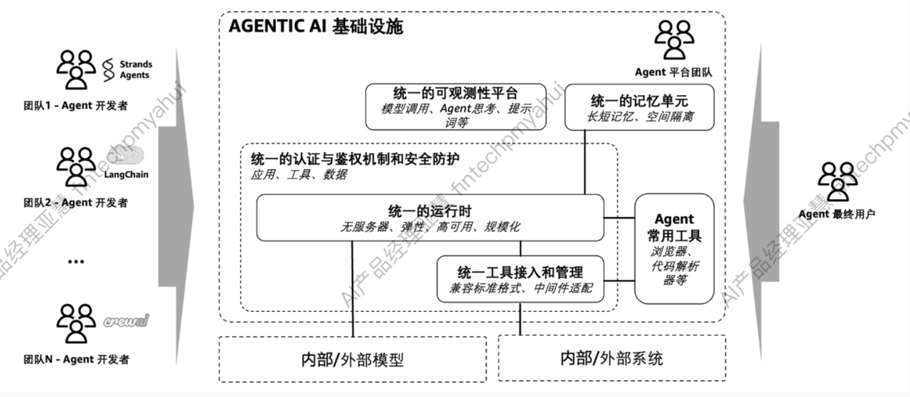

1、 **统一的通用基础工具（统一的运行时）：Agent 的生命系统。**所有智能行为都要在它里面执行，解决3个问题：

**（1）会话管理**：每个用户的 Agent 都在独立的沙箱里运行，互相隔离，确保安全，不会串数据。

**（2）生命周期管理**：Agent 的状态可能随时变化，比如等待接口响应、调用模型、暂停任务等。运行时能自动保存这些状态，哪怕系统重启，也能恢复现场。

**（3）接口标准化**：所有 Agent 都通过统一的 HTTP 接口暴露出来，支持健康检查，让它们能无缝接入企业系统。

2、 **统一的工具接入与管理：Agent 的工具箱管理器（比如浏览器、搜索引擎、数据库、API）**，通过 **工具网关（Gateway）**。

（1）支持多种接入协议，比如标准API、MCP协议；

（2）能做工具的 **发现、删除、鉴权**；

（3）内置一个“搜索功能”，Agent提问时，它可以动态匹配最合适的工具，而不是全部加载

3、 **统一的记忆单元：Agent 的大脑**，能理解上下文、记住用户偏好

（1） **短期记忆**：存当前会话的聊天内容，让Agent能接得上话

（2） **长期记忆**：会异步抽取对话中的重点，比如语义事实、用户喜好、摘要等，形成结构化信息

4、 **统一的通用基础工具：Agent 的“手和眼”**，2个最重要的通用工具是：

（1） **浏览器（Browser）**：让Agent像人类一样看网页、点按钮、抓数据。

（2） **代码解析器（Code Interpreter）**：让Agent能写代码、跑脚本、分析数据。

5、 **统一的认证与安全防护：Agent 的门禁系统**，目标是： **保证谁能访问、访问什么、访问时是否安全**

（1）支持多种身份系统（GitHub、企业登录、OAuth等）

（2）支持双向认证：入站验证用户、出站验证外部资源

（3）内置 **安全防护机制**，防止模型输出不合规内容，比如泄露敏感信息或出现“幻觉”

6、 **统一的可观测性：Agent 的监控中心**，监控分3层：

（1） **基础设施层**：看服务器、显存、CPU等资源使用

（2） **应用层**：看模型调用、API延迟、执行链路

（3） **业务层**：看Agent任务完成率、用户体验、错误率

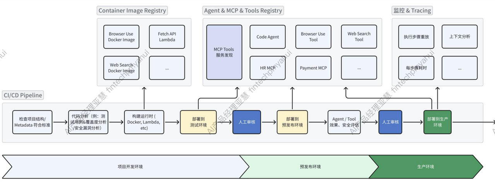

### 5.0.9 AI Agent监控
在Agent系统中， **==需要监控：用户输入-最终输出的整个处理流程，包括模型调用、推理过程、工具使用等各环节，==**主要需要关注指标、追踪两方面：

（1）重要指标：

```Python
a）响应时间指标：总体请求处理时间（Total Time）： 从接收用户请求到生成最终响应的完整时间（端到端）。
如：用户询问”巴黎的天气如何？”，系统可能需要800ms来理解问题，400ms调用天气API，再用100ms生成回答，总计1300ms。

首个token生成时间（TTFT）： 记录从请求开始到生成第一个响应token的时间。（对于提供流式响应的系统特别重要）
如：如果系统在接收到问题后能在100ms内开始生成回答，这表明系统的初始响应速度较快

模型延迟（Model Latency）： 衡量模型推理所需的时间，可以评估不同模型的性能表现，为特定场景选择最适合的模型。
```

```Python
b）Token使用指标：直接关系到系统的运营成本和效率输入Token数量： 发送给模型的token数量。
包含：系统提示词、上下文历史和用户问题的请求，帮助优化提示词设计和上下文管理策略

输出Token数量（OutputTokenCount）： 统计模型生成的token数量。
如：一个详细的天气报告响应可能产生200个token，有助于控制响应的简洁度和成本
```

```Python
c）工具使用指标：调用频率： 记录每个工具被调用的次数。
如：客服Agent，可能发现知识库查询工具的使用频率是订单查询工具的5倍，可指导后续优化工具的设计和缓存策略

工具执行时间： 监控每个工具的执行耗时。
如：天气API的平均响应时间超过800ms，可能需要考虑更换模型或实施缓存
```

（2）完整的执行链路追踪（trace）——追踪系统

传统指标能反映系统的健康状况和性能特征，但无法解释Agent在特定情境下做出某个决策的原因；日志可提供详细的事件记录，但往往缺乏跨服务的关联性，难以构建完整的执行图谱。追踪数据（端到端）通过层次化结构，能精确记录Agent从： **接收用户输入、理解意图、规划执行路径、调用工具、生成响应的完整决策链条**，使开发者能够快速定位性能瓶颈、识别错误根因。Agent追踪系统关注2个核心维度

```Python
a）Agent执行追踪：提供完整的执行链路视图，包括系统级追踪和推理周期追踪。

-系统级追踪：记录每个请求的完整生命周期，从用户输入、系统提示词到最终响应的全过程
-推理周期追踪：深入到每个推理步骤的细节，详细记录当前思考步骤的内容、工具调用的决策过程以及中间结果的处理方式

b）错误和异常追踪：系统中的错误和异常包括2类：客户端错误和服务器错误
-客户端错误：记录由客户端引起的问题，如参数错误、认证失败等，这
-服务器错误：模型调用失败、资源不足等
```

Agent完整链路如下：

-Trace ID：Agent执行循环中的一次完整会话（包含了从用户输入到最终响应生成的所有中间步骤）：从用户发起请求到Agent返回最终结果的整个生命周期会共享同一个trace ID。

-Span ID：执行循环中的每个具体操作（每个步骤通过span表示），如模型调用、工具执行、上下文检索等，每个span ID都是唯一的，并通过父子关系构建完整的执行树状结构。

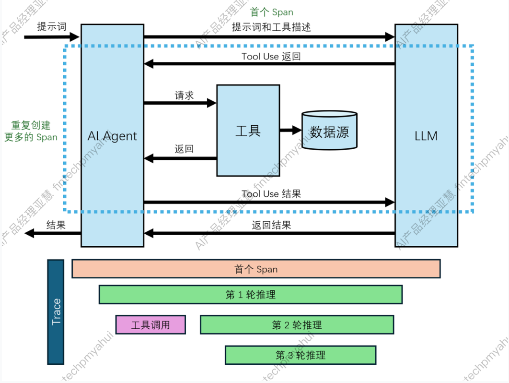

（3）将 Agent 的追踪数据打入到 Langfuse 平台进行监控，保证重要指标的收集和功能异常的分析

a）对不同的 LLM 模型进行效果和成本对比测试，在 Langfuse 中观察不同的 Latency, Token 和 Cost

b）模拟新功能上线，分析功能调用全流程

| 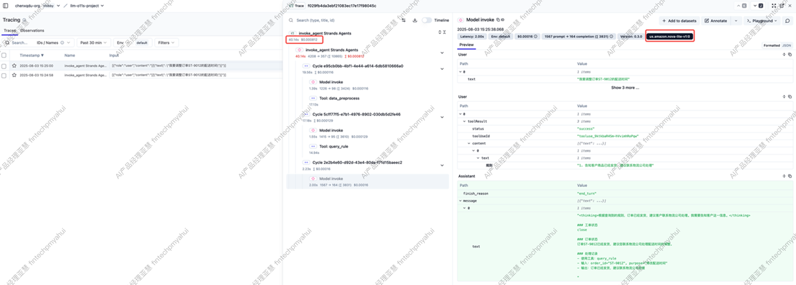 | 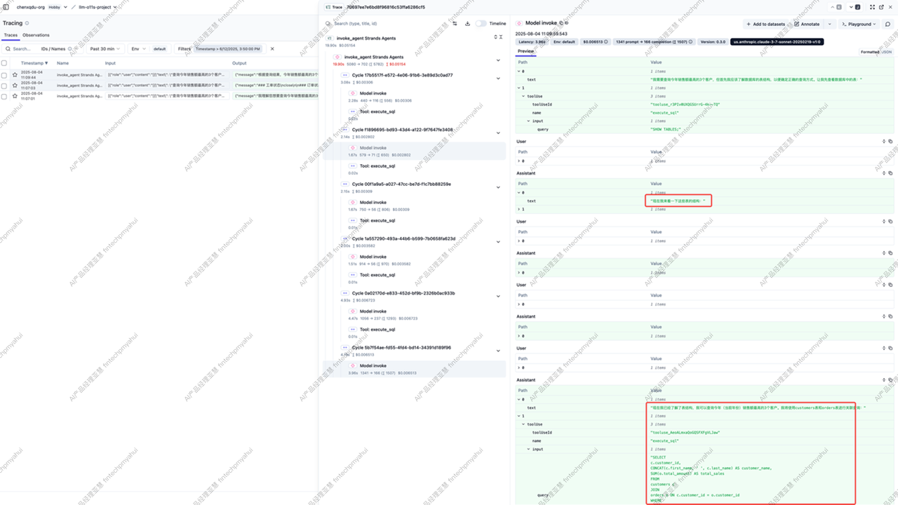 |
| --- | --- |

## 5.1 Agent 的2个技能
有了 RAG 和提示词，相当于和大语言模型建立起了很好的沟通机制，就可以借助大语言模型来“执行工作”了，于是引入Agent。有2个技能：

### **（1）Function calling（函数调用）/Tool use**
```JSON
自主解析内容并结构化填槽，自主决策使用工具并结构化调用System Prompt 中写明可以使用哪些工具，使用时候给出什么参数，写成什么格式
意图识别：用户要求做什么任务
决策是否使用工具，使用哪个工具
调取工具设定的信息传递结构
调取所有上下文内容解析并填槽
缺少信息就发起追问，直至全部填写
按照槽的格式生成模型回复
```

大语言模型的 Function Calling 能力，本质上是一种将自然语言指令 **转译为可执行函数调用**的机制。这使得用户用自然语言发出的请求，能够被模型解析并触发相应的程序操作，从而完成任务。 **==可被调用的函数形式多种多样，例如 Java 函数、Python 方法等，而在 AI 应用场景中，最常见的执行接口是基于微服务架构的 API 请求==**。

**==模型通过结构化提示（Prompt），将输入的用户需求转化为标准的 API 调用格式，实现从“理解语言”到“驱动系统”的闭环操作。==**以 API 调用为例，通过设计明确的提示模板（包含接口名、参数结构、调用条件等），可以让模型自动生成符合规范的 API Request，从而连接真实服务，实现对外部系统的操控。

「工具」：就是各种API接口或软件操作，如搜索、编辑数据库、编辑文件等

```Bash
## Instruction
你是一个人工智能编程助手，根据用户请求和函数定义，调用函数来完成任务，并以代码格式进行回应，无需回复其他话语。请特别注意函数的定义。

## 函数定义
  tools = [
  {
    "type": "function",
    "function": {
      "name": "get_current_time",
      "description": "Get the current local time of a given city",
      "parameters": {
        "type": "object",
        "properties": {
          "city": {
            "type": "string",
            "description": "The name of the city, e.g. Tokyo, New York"
          }
        },
        "required": ["city"]
      }
    }
  }
]

## 用户请求
  现在东京几点钟了？
```

---

**（附）再给出一个“外部函数创建”（封装外部工具）的示例（含具体过程）：**

（1）创建外部函数：

假设编写一个通过OpenWeather API实时获取天气信息的API，并作为模型可调用的外部函数之一。为了确保和大语言模型之间的顺畅通信，此时要求函数的输入和输出都是字符串格式。具体函数编写如下 ==（注意，黄色高亮部分是函数说明，帮助大模型理解，一定要写，且以多行字符串的形式）==

```Python
def get_weather(loc):
    """
    查询即时天气函数
    :param loc: 必要参数，字符串类型，用于表示查询天气的具体城市名称，\
    注意，中国的城市需要用对应城市的英文名称代替，例如如果需要查询北京市天气，则loc参数需要输入'Beijing'；
    :return：OpenWeather API查询即时天气的结果，具体URL请求地址为：https://api.openweathermap.org/data/2.5/weather\
    返回结果对象类型为解析之后的JSON格式对象，并用字符串形式进行表示，其中包含了全部重要的天气信息
    """
    # Step 1.构建请求
    url = "https://api.openweathermap.org/data/2.5/weather"

    # Step 2.设置查询参数
    params = {
        "q": loc,
        "appid": 'xxx',    # 输入API key
        "units": "metric",            # 使用摄氏度而不是华氏度
        "lang":"zh_cn"                # 输出语言为简体中文
    }

    # Step 3.发送GET请求
    response = requests.get(url, params=params)

    # Step 4.解析响应
    data = response.json()
    return json.dumps(data)  #将json转换成字符串
```

（2）封装成工具：在（1）的基础上将上述外部函数封装成工具：工具箱是有格式要求的，必须按照以下字典格式：

```Python
#外部工具（外部函数）封装到工具箱（列表）
tools = [
    {
        "type": "function",
        "function":'外部函数的完整描述'
    }
]
```

（3）外部函数格式要求（（2）中的字典变量）也需要遵循格式要求：

使用一个字典进行完整描述，每个字典都有3个参数（三组键值对），各参数（Key）名称及解释如下：

```Python
-name：代表函数函数名称字的符串，必选。

-description：用于描述函数功能的字符串，可选，但该参数传递的信息实际上是Chat模型对函数功能识别的核心依据。即Chat函数实际上是通过每个函数的description来判断当前函数的实际功能的。

-parameters：函数的参数说明，必选，要求遵照JSON Schema格式进行输入，JSON Schema是一种特殊的JSON对象，专门用于验证JSON数据格式是否满足要求。
```

示例：对于get_weather函数需要创建字典来进行完整描述：

```Python
#外部函数的完整描述：

get_weather_function = {
    'name': 'get_weather',
    'description': '查询即时天气函数，根据输入的城市名称，查询对应城市的实时天气',
    'parameters': {
        'type': 'object', #json对象类型
        'properties': { #参数成员描述
            'loc': {
                'description': "城市名称，注意，中国的城市需要用对应城市的英文名称代替，例如如果需要查询北京市天气，则loc参数需要输入'Beijing'",
                'type': 'string'
            }
        },
        'required': ['loc']
    }
}
```

因此修改tool参数值为：

```Python
tools = [
    {
        "type": "function",
        "function":get_weather_function
    }
]
```

（4）将工具箱挂靠给大模型：

```Python
#将工具箱挂靠给模型
ds_api_key = "Your_api_key"

#实例化客户端
client = OpenAI(api_key=ds_api_key,
                base_url="https://api.siliconflow.cn/v1")

#first response
response = client.chat.completions.create(
    model="deepseek-ai/DeepSeek-V2.5",
    messages=[
        {"role": "user", "content": "请帮我查询北京地区今日天气情况"}
    ],
    tools=tools, #模型已经知道调用什么工具解决什么问题
)

response_message.tool_calls[0]
```

（5）大模型本身没有外部函数调用的权限，所以 **需要给大模型赋予调用函数的权限-》人为调用**

```Python
available_functions = {
            "get_weather": get_weather,
        }
```

```Python
# 完成对话需要调用的函数名称
function_name = response_message.tool_calls[0].function.name

# 基于外部函数库获取具体的函数对象
fuction_to_call = available_functions[function_name]

# 执行该函数所需要的参数，将其反序列化成字典对象，便于下一步函数调用时进行传输传递
function_args = json.loads(response_message.tool_calls[0].function.arguments)

#调用外部函数：
function_response = funcition_to_call(**function_args）
```

返回示例如下：

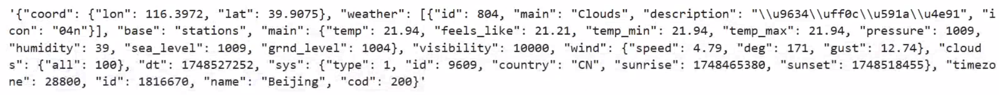

```Python
#second response,追加function返回消息
second_response = client.chat.completions.create(
    model="deepseek-ai/DeepSeek-V3",
    messages=messages)
```

返回示例如下：

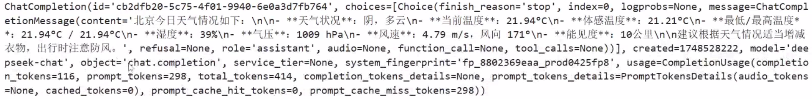

---

要实现大语言模型的函数调用能力， **==通常需要通过以下3个关键要素来完成自然语言指令到可执行 API 请求的转换==**：

```JSON
任务说明（Instruction）
首先，需要明确告知模型其职责是“根据用户请求和函数定义，调用相应的函数完成任务，并以结构化代码格式输出结果”。这一提示为模型设定了解析指令并构造函数调用的目标。

函数定义（Function Schema）
 这是实现函数调用的核心，它定义了可用函数的名称、参数格式、参数说明、数据类型等内容。该部分通常以 OpenAI 支持的 JSON Schema 规范书写，确保模型能够准确解析和使用。我们也可以借助模型本身来生成这一结构。

用户请求（User Input）
 即用户以自然语言发出的意图，例如“查一下东京现在几点”或“告诉我北京今天的天气”。模型接收到请求后，会结合上方函数定义，自动生成符合规范的函数调用代码，如 API Request，进而实现从人类语言到计算机指令的转换。
```

把上述的例子输入给到gpt40，GPT 就会输出以下 API Request，这就可以直接被机器运行。我们就实现了将自然语言指令转变为计算机可执行指令。

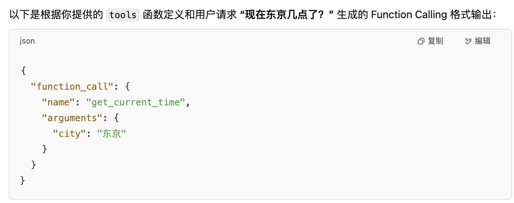

（2）工具分类

| **工具类型** | **功能描述** | **典型示例** |
| --- | --- | --- |
| 信息检索 | 获取外部信息 | **搜索引擎、数据库查询、API调用** |
| 计算工具 | 数学和逻辑计算 | 计算器、代码执行器、数据分析 |
| 通信工具 | 与外部系统交互 | 邮件发送、消息推送、文件传输 |
| 创作工具 | 内容生成和编辑 | 图像生成、文档编辑、代码生成 |
| 控制工具 | 系统操作和控制 | 文件操作、系统命令、设备控制 |

（3）function calling 工作流程：

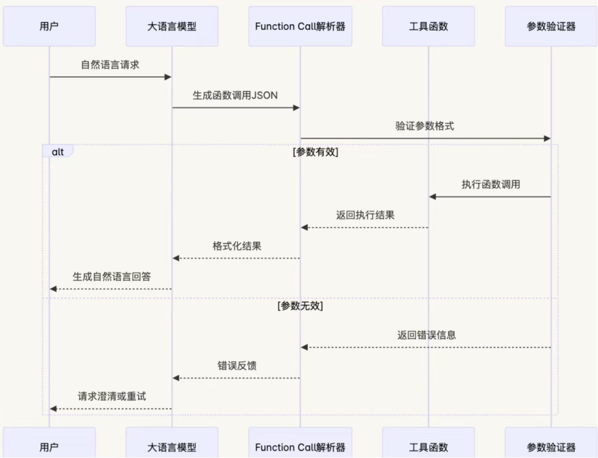

### **（2）Re-Act（Reasoning and Act：推理并且执行）**
将 **思考与行动融合**的能力，使大语言模型不仅能执行任务，还能根据反馈结果进行 **动态调整和错误修正**，实现更高层次的自主智能。

比如，在函数调用的场景中，我们定义了一个接口，其中参数 `"location"` 需要使用 **英文拼写的城市名**，如 `"Beijing"` 。但用户自然语言输入可能是“现在北京天气如何？”——模型初次调用时可能会直接将 `"location"` 设为 `"北京"` 。

此时，API 会返回一个报错信息： **"location must be English"。**拥有 ReAct 能力的大语言模型不会停在这里，而是会 **分析错误原因，推理出应对策略**，意识到“北京”应当转换为英文拼音 “Beijing”，并随后重新构造函数调用，完成修正。这种机制让大模型不仅“能执行”，还能“边做边想”，具备一定的“容错恢复”与“上下文自修正”能力，是 AI Agent 实用化的一大关键能力。

```JSON
{
  "agent_session": [
    {
      "step": 1,
      "thought": "用户提问：现在北京几点了？我需要通过函数调用来获取时间。",
      "action": {
        "type": "function_call",
        "name": "get_current_time",
        "arguments": {
          "city": "北京"
        }
      },
      "observation": "API 返回错误：location must be English",
      "reflection": "我调用函数时使用了中文城市名 '北京'，但函数要求英文格式，因此调用失败。"
    },
    {
      "step": 2,
      "thought": "我需要将 '北京' 转换成英文拼写 'Beijing'，以符合 API 参数要求。",
      "action": {
        "type": "retry_function_call",
        "name": "get_current_time",
        "arguments": {
          "city": "Beijing"
        }
      },
      "observation": "API 返回成功，当前时间为 2025-05-18 14:32:00",
      "reflection": "城市名改为英文后，函数调用成功，说明已解决参数格式问题。"
    },
    {
      "step": 3,
      "thought": "我已经获取到用户所需的信息。",
      "action": {
        "type": "respond_to_user",
        "content": "现在北京的时间是 2025年5月18日 14:32。"
      },
      "observation": "用户未提出进一步问题",
      "reflection": "任务完成，无需进一步处理。"
    }
  ]
}
```

## 5.2 Agent 的9种设计模式
### 5.2.1 **==ReAct 模式（当前最流行的 Agent 架构模式，结合了推理和行动）==**
**1、 ReAct原理——让大模型“边想边做边回看”**

（1）在传统的 Chain-of-Thought（COT）机制中，大语言模型被提示“请一步步推理”，于是它会 **先计划好所有的步骤**，然后一口气把整个流程写出来，不管中间是否已经得到答案，也不会中途调整。

例如：

```JSON
任务：
用户问“为什么我今天飞上海的航班还没起飞？”

模型可能会一次性按流程列出所有可能原因：
检查天气是否异常；
检查航班是否排队等待；
检查飞机是否有机械故障；
检查空中交通是否拥堵；
检查起飞机场是否关闭。
```

**问题在于**：不管第1步就已经有结果，它都会继续列下去，无法基于中间反馈优化后续路径。

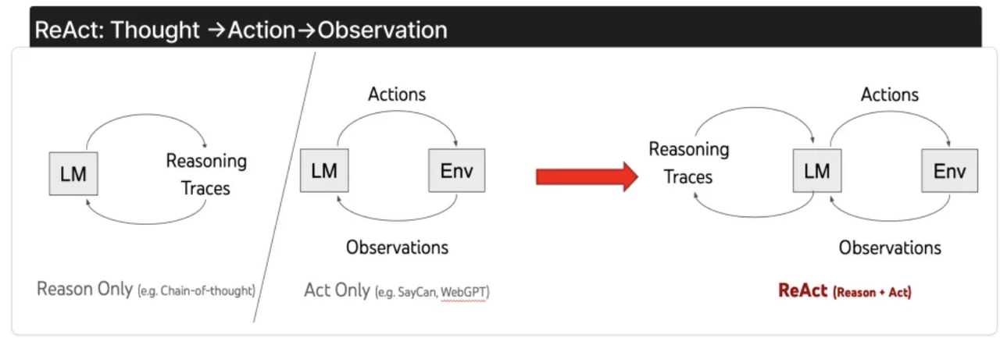

（2）有 React 的情况是： **==推理 + 行动 + 观察==**

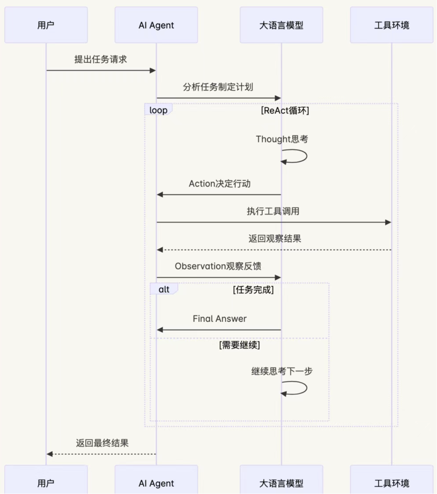

ReAct 的核心在于： **将每一步“行动”后加入一轮“观察（Observation）”**，模型可以根据观察结果决定下一步行为，形成一个反馈闭环。同样是问“为什么我今天飞上海的航班还没起飞？”

```JSON
Agent 采用“边思考边行动”的方式执行，每一步都有反馈并动态调整策略：

Step 1
Thought：用户提到航班未起飞，我先去查询当前天气情况。
Action：调用天气 API，获取出发地天气。
Observation：天气晴朗，无降雨无大风。
Reflection：天气不是延误原因，我要排查其他因素。

Step 2
Thought：我查看航班状态，看是否在等待起飞或排队。
Action：查询航班实时状态。
Observation：航班状态为“等待滑行”，起飞队列拥堵。
Reflection：查到延误是由于跑道繁忙，我已经有了合理解释。

Step 3
Final Answer：您的航班尚未起飞，是因为目前机场起飞航班较多，处于滑行等待状态。
```

2、 **ReAct 实现**

本质上所有的 Agent 设计模式都是 **将人类的思维、管理模式以结构化prompt的方式告诉大模型来进行规划，并调用工具执行，且不断迭代的方法（**代码链接: https://github.com/samwit/langchain-tutorials/blob/main/agents/YT_Exploring_ReAct_on_Langchain.ipynb）

（1） **生成提示词：**

在构建基于 ReAct（Reason + Act）的多步推理式提示词时，我们通常需要将以下几部分结合：

```JSON
系统内置的提示模板：格式为 Question -> Thought -> Action -> Observation 的结构；

用户真实问题：填入实际任务；

业务自定义内容：对提示词中的 Action 和 Observation 做定制，尤其是 Action 要贴合你使用的工具或接口，比如 "Send message to someone" 可能就是你后台实际调用的 "send_message_api"；

Few-shot 示例：提前准备4~5个与业务类似的推理链条，让模型学会怎样一步步进行“边做边想”的任务拆解。
```

蓝色字体可以定制为自己的业务场景

红色字体为用户输入的问题

```JSON
Question：罗素·克劳（Russell Crowe）获得奥斯卡奖的第一部电影是哪部？这部电影的导演是谁？
Thought：我需要查找 Russell Crowe 的奥斯卡获奖记录，并找到他第一次获奖的电影名称。
Action：搜索【Russell Crowe 奥斯卡 奖项】
Observation：Russell Crowe 于2001年凭借电影《角斗士》获得奥斯卡最佳男主角奖。Thought：他的第一部奥斯卡获奖电影是《角斗士》，接下来我需要查找这部电影的导演。
Action：搜索【电影 角斗士 导演】
Observation：《角斗士》的导演是雷德利·斯科特（Ridley Scott）。Thought：综合以上信息，Russell Crowe 首次获得奥斯卡奖的电影是《角斗士》，导演是雷德利·斯科特。
Action：完成【《角斗士》，导演：雷德利·斯科特】
... 列出4.5个类似的例子（few shot）Question：{这里写入用户的问题}
```

（2） **调用大模型生成Thought+Action：**

将 few-shot 示例提示词发送给大语言模型时，我们的目标是让模型 **按步骤生成 Thought 和 Action**，但不立即输出 Observation。如果不加控制，模型会模仿示例中的完整链条，一口气生成完整的 Thought → Action → Observation → 下一轮 Thought……这样的推理流水线。然而在实际应用中，我们通常希望先执行 Action，等拿到真实环境反馈后再生成对应的 Observation，而不是让模型 **臆造 Observation 内容**。

==为了解决这个问题，可以在调用模型时设置一个“停止词”（stop sequence），例如==``  ==，这样当模型生成到==``  ==这个关键词时就自动停止输出。==

==这一技巧确保了模型只返回当前应执行的 Thought 和 Action，而 Observation 留给真实系统或 Agent 执行环境处理，从而实现“模型负责思考，环境提供反馈”的闭环协作机制。==

Prompt（包含 Few-Shot 示例 + 用户问题）

```YAML
You are an intelligent agent that solves complex problems step by step using Thought, Action, and Observation.

Follow this format exactly:
Question: <user question>
Thought: <what you are thinking>
Action: <the action you will take>
Observation: <this will be provided after the action>

---

Question: Who is the author of the novel "The Trial" and what nationality was he?
Thought: I need to find out who wrote "The Trial", and then determine that person's nationality.
Action: Search["The Trial novel author"]

---

Question: What year did the Apollo 11 mission land on the moon?
Thought: I need to find the date when Apollo 11 landed on the moon.
Action: Search["Apollo 11 moon landing date"]

---

Question: 在电影《角斗士》中扮演主角的是谁？
Thought: 我需要找到电影《角斗士》的主演是谁。
Action: Search["电影 角斗士 主角"]
```

请求代码（使用 `stop=["Observation"]` 控制输出）

```Python
import openai

response = openai.ChatCompletion.create(
    model="gpt-4",
    messages=[
        {"role": "system", "content": "You are a helpful reasoning agent."},
        {"role": "user", "content": prompt_string}  # 上面的提示词
    ],
    temperature=0.3,
    stop=["Observation"]
)

print(response["choices"][0]["message"]["content"])
```

示例输出结果（受 stop 控制）

```JSON
Question: 在电影《角斗士》中扮演主角的是谁？
Thought: 我需要找到电影《角斗士》的主演是谁。
Action: Search["电影 角斗士 主角"]
```

（3） **调用外部工具：**

拿到 Action 之后，大模型可以调用外部工具。首先判断这里的 Action 是不是 Finish，如果不是我们就可以利用大模型把 Action 后面的自然语言转换为外部工具能识别的 API 接口，这个转换过程就是大模型的 function calling 功能，本质上是对大模型进行微调，专门用于语言格式转换的模型，但并非所有的大模型都支持 function calling。

（4） **生成Observation：**

API 接口返回后，还会将接口返回内容转换为自然语言输出，生成 Observation，然后将 Observation 的内容，加上刚刚的 Thought， Action 内容输入给大模型，重复第 2，3 步，直至 Action 为Finish 为止。

（5） **完成输出：**

**将最后一步的 Observation 转化为自然语言输出给用户。**由此，可以看到 Agent 要落地一个场景，需要定制两项内容。 **（1）****==Prompt 模板中 few shot 中的内容。（2）function calling 中的外部工具定义。==**

而 Prompt 模板中 fewshot 本质上就是人类思维模式的结构化体现，通过查阅各个设计模式的 prompt 模板是很好的学习 Agent 设计模式的方法

架构上，就是先有 topic， 然后生成大纲，根据大纲丰富内容。这里会有一个大纲生成器，一个内容生成器

STORM 主要有几个阶段：

生成初步大纲 + 调查相关主题

确定不同的视角

“采访主题专家”（角色扮演的LLM）

精炼大纲（使用引用）

编写部分内容，然后撰写文章

### 5.2.2 Plan and solve 模式
先有计划再来执行：需要计划，且过程中计划可能会变化，需要随时应对加入新的计划。提示词就是 Zero shot 的提升。

| 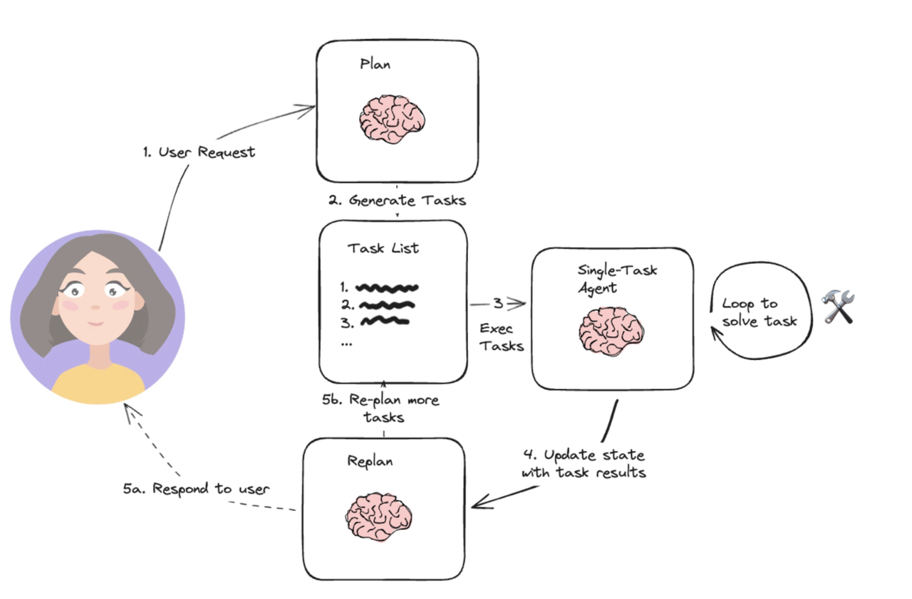 | 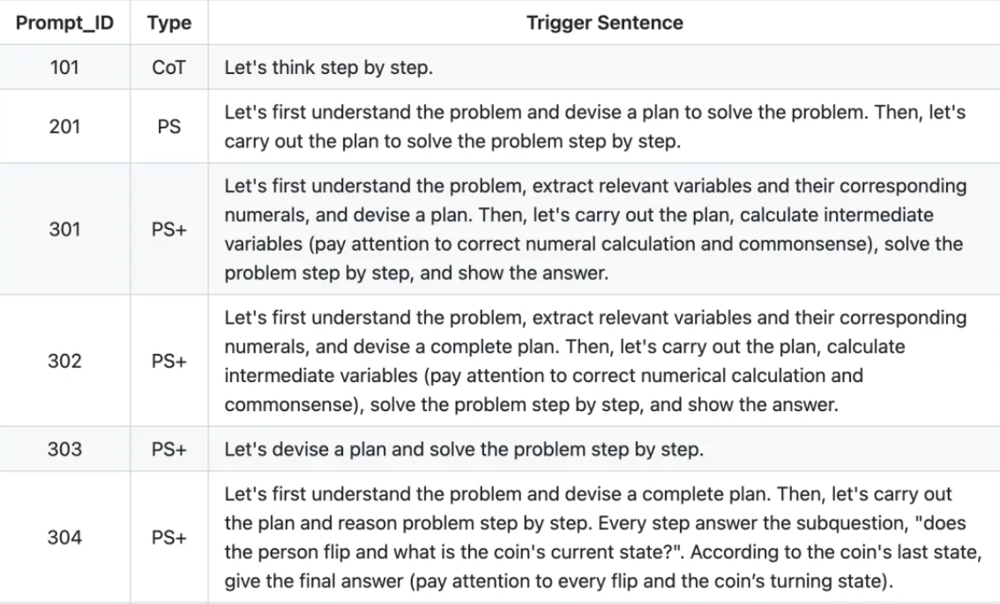 |
| --- | --- |

**规划器**： ==负责让 LLM 生成一个多步计划来完成一个大任务。==代码中有 Planner 和和 Replanner，Planner 负责第一次生成计划；Replanner 是指在完成单个任务后，根据目前任务的完成情况进行 Replan，所以 Replanner 提示词中除了 Zeroshot，还会包含：目标，原有计划，和已完成步骤的情况。

**执行器**： **接受用户查询和规划中的步骤**，并调用一个或多个工具来完成该任务。

### 5.2.3 Reason without Observation（REWOO）
这种方法是相对 ReAct中的Observation 来说的，ReAct 提示词结构是 Thought→ Action→ Observation, 而 REWOO 把 Observation 去掉了。但实际上，REWOO 只是将 Observation 隐式地嵌入到下一步的执行单元中了，即由下一步骤的执行器自动去 observe 上一步执行器的输出

举例：常见的审批流环环相扣，假设目标是完成 c，步骤如下：

- 需要从部门 A 中拿到 a 文件，
- 拿着 a 文件去部门 B 办理 b 文件，
- 拿着 b 文件去部门 C 办理 c 文件
- 任务完成

第 2，3 步骤中 B，C 部门对 a，b 文件的审查本身就是一类Observation。

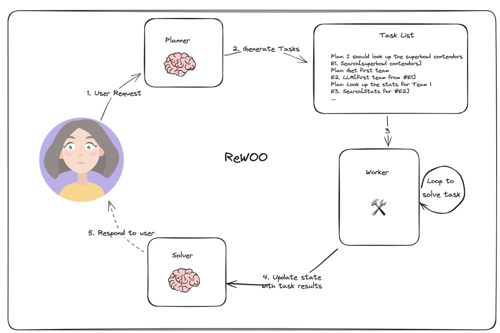

**Planner**：负责 ==生成一个相互依赖的“链式计划”==， ==定义每一步所依赖的上一步的输出==。

**Worker**： ==循环遍历每个任务，并将任务输出分配给相应的变量==。当调用后续调用时，它还会用变量的结果替换变量。

**Solver**：求解器 ==将所有这些输出整合为最终答案==。

### 5.2.4 LLM Compiler
Compiler-编译：就是 **如何进行任务编排使得计算更有效率**，原论文题目是《An LLM Compiler for Parallel Function Calling》就是通过 **并行Function calling来提高效率**，比如用户提问张译和吴京差几岁，planner 搜索张译年龄和搜索吴京年龄同时进行，最后合并即可。

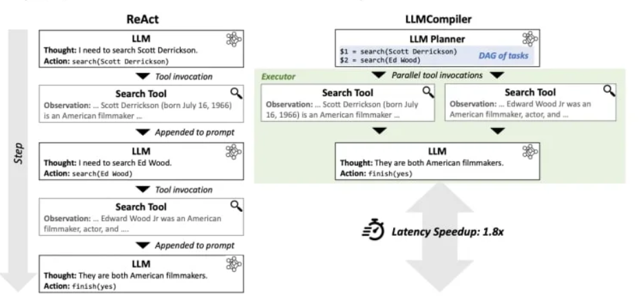

重点是希望生成一个 DAG：Direct Acyclic Graph，有向无环图

架构上有一个 **Planner(规划器)**，有一个 **Jointer(合并器)**

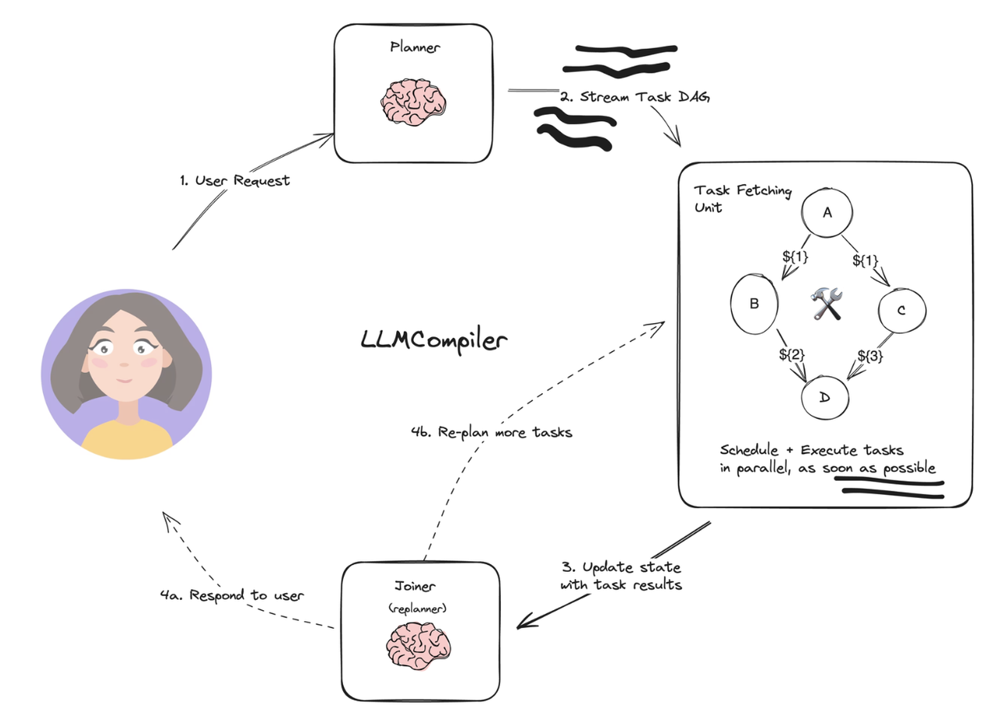

### 5.2.5 Basic Reflection
类比学生(Generator)写作业，老师(Reflector)来批改建议，学生根据批改建议来修改，如此反复。

**Generate Prompt**

```JSON
prompt = ChatPromptTemplate.from_messages(
    [
        (
            "system",
            "You are an essay assistant tasked with writing excellent 5-paragraph essays."
            " Generate the best essay possible for the user's request."
            " If the user provides critique, respond with a revised version of your previous attempts.",
        ),
        MessagesPlaceholder(variable_name="messages"),
    ]
)

llm = ChatFireworks(
    model="accounts/fireworks/models/mixtral-8x7b-instruct",
    model_kwargs={"max_tokens": 32768},
)

generate = prompt | llm
```

**Reflect Prompt**

```JSON
reflection_prompt = ChatPromptTemplate.from_messages(
    [
        (
            "system",
            "You are a teacher grading an essay submission. Generate critique and recommendations for the user's submission."
            " Provide detailed recommendations, including requests for length, depth, style, etc.",
        ),
        MessagesPlaceholder(variable_name="messages"),
    ]
)

reflect = reflection_prompt | llm
```

架构上有一个 Generator，一个 Reflector。

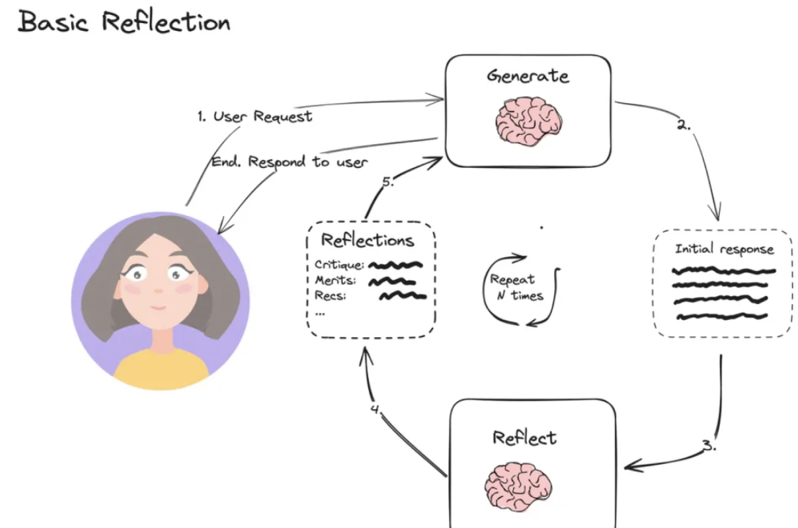

### 5.2.6 Reflexion
是 5.2.5 Basic reflection 的升级版，本质上是强化学习的思路。和 Basic reflection 相比， ==引入了外部数据来评估回答是否准确，并强制生成响应中多余和缺失的方面，这使得反思的内容更具建设性==。

提示词方面：会让大模型针对问题在回答前进行反思和批判性思考，反思包括有没有漏掉(missing)或者重复(Superfluous)，然后回答问题，回答之后再有针对性的修改(Revise)

架构上，有一个 Responder：自带批判式思考的陈述 Critique；有一个 Revisor：以 Responder 中的批判式思考作为上下文参考对初始回答做修改。

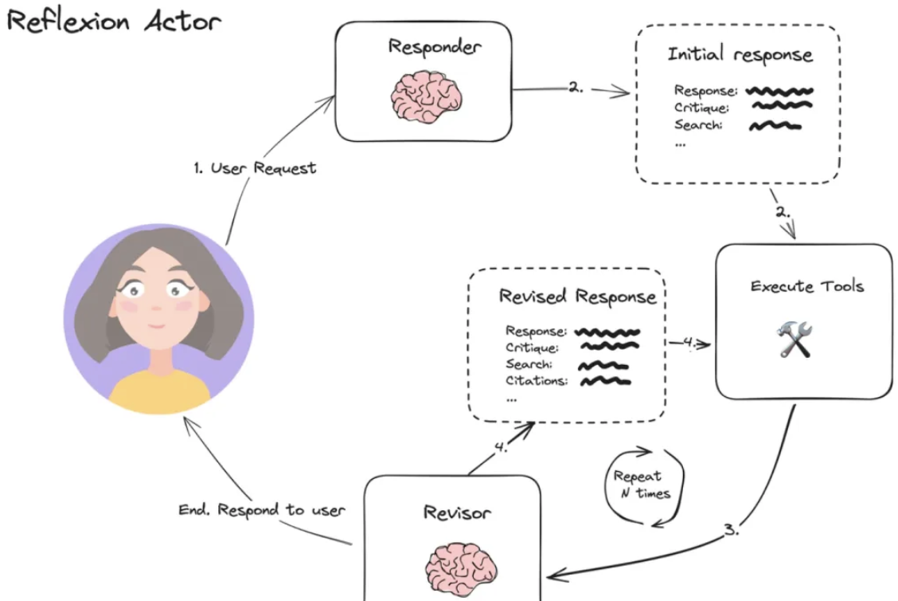

### 5.2.7 Language Agent Tree Search（LATS）
Tree search + ReAct+Plan&solve 的融合体。在原作的图中可与看到 LATS 中通过树搜索的方式进行 Reward(强化学习的思路)，同时还会融入 Reflection，从而拿到最佳结果。所以：

**LATS = Tree search + ReAct+Plan&solve + Reflection + 强化学习**

**Reasoning via planning**

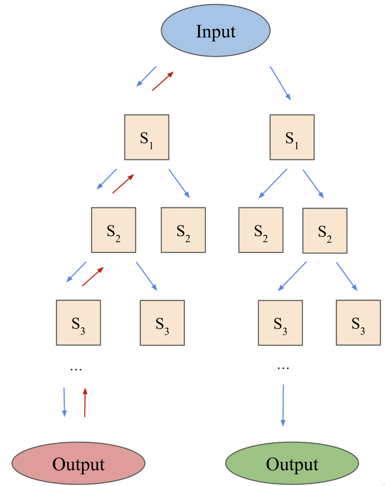

规划中的推理（LATS）

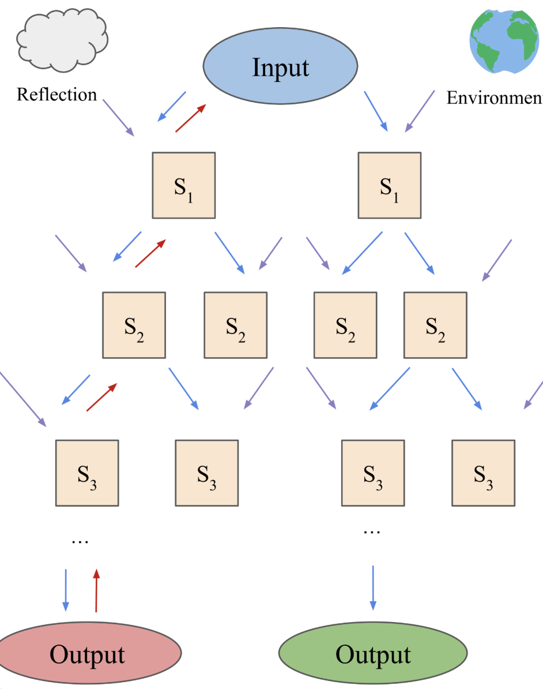

架构上，就是多轮的 Basic Reflection， 多个 Generator 和 Reflector

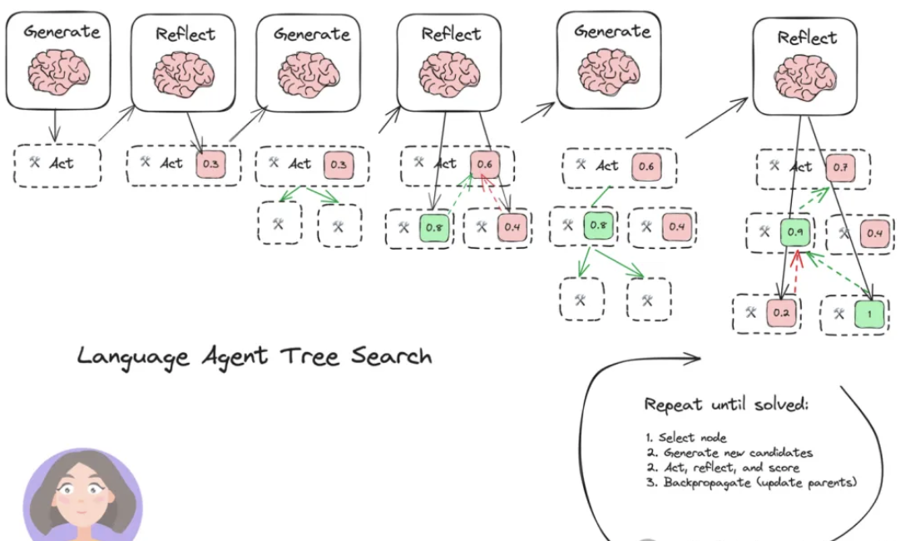

### 5.2.8 Self-Discover
让大模型在更小粒度上 task 本身进行反思，比如Plan&Slove 是反思 task 是不是需要补充，而 Self-discover 是对 task 本身进行反思

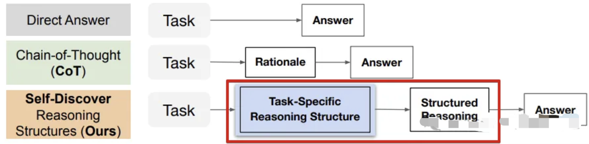

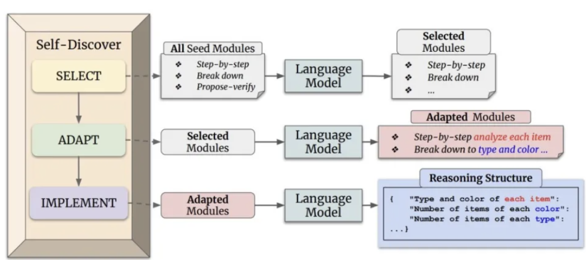

Selector: **从众多的反省方式中选择合适的反省方式**；

Adaptor: 使用选择的反省方式进行反省；

Implementor: 反省后进行重新 Reasoning;

### 5.2.9 Storm
可以从零生成一篇像维基百科的文章。主要思路是先让 agent 利用外部工具搜索生成大纲，然后再生成大纲里的每部分内容

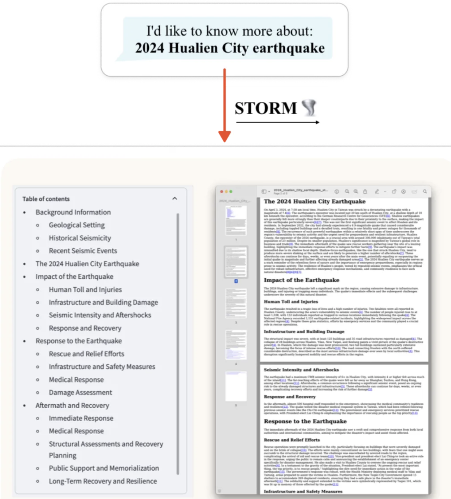

架构上，就是先有 topic， 然后生成大纲，根据大纲丰富内容。这里会有一个大纲生成器，一个内容生成器

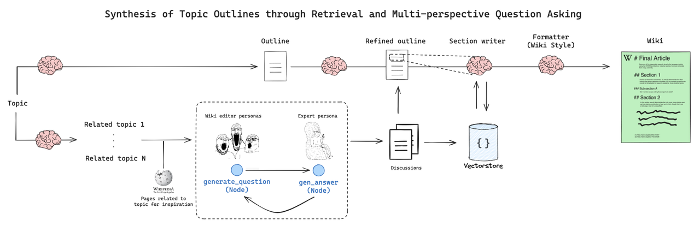

STORM 主要有几个阶段：

生成初步大纲 + 调查相关主题

确定不同的视角

“采访主题专家”（角色扮演的LLM）

精炼大纲（使用引用）

编写部分内容，然后撰写文章

## 5.3 为什么要用Agent及方案？
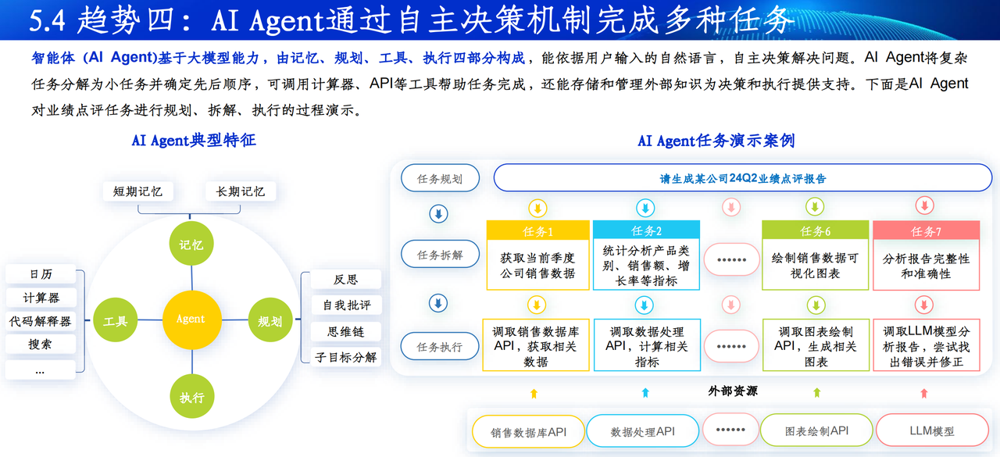

### 5.3.1 为什么要用Agent？
大模型本身是无法与外部环境进行交互的，所以要用Agent来解决，同时将复杂的任务分拆成多个标准化的任务，“指派”给特定的agent去执行。

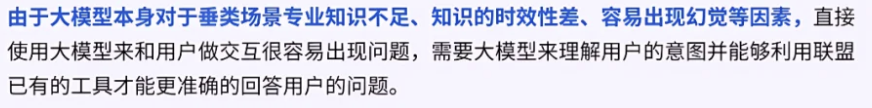

**1、用Agent优化RAG**

（1）简单的单向 RAG 应用往往很难满足企业级应用的要求，很多时候需要借助 Agent 的思想让 RAG 应用更聪明与智能。

（2）利用 Agent 优化 RAG 有哪些方法?

a） **将复杂问题拆分成多个步骤或者小问题**，并借助不同的 RAG pipiline来完成

b）在多知识源的 RAG 应用中， **能够回答跨越多知识源、多 RAGpipiline的问题**（比如比较两个文档中知识的差异）

c） **将知识密集型任务的 RAG 应用与其他类型的应用进行集成，以完成更加复杂的流程**，比如涉及数据操作的任务

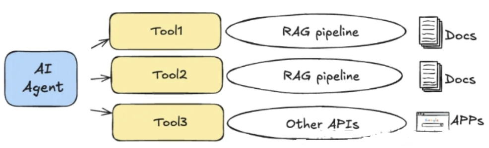

在上面架构中，传统的RAG应用(RAG pipeline)退化成一个Agent 可以使用的 Tool，Agent 借助于 LLM 推理完成任务的步骤、使用的工具以及输入参数，并调用必要的工具来最终完成任务。比如，在完成一个数据比对任务时，Agent 可能会借助LLM 推理，决定首先调用第一个 RAG 应用获得数据，再调用另一个 RAG 应用获得数据，最后将两部分数据输入 LLM 进行比对获得答案。

### 5.3.2 Agent在落地时候遇到很多挑战
（1）工具的识别：

市面上开源大模型对于外部工具使用能力只有Chat GPT-3.5/4以上的准确率才能符合要求，但成本高，在企业应用中 **需要训练自己的大模型学会如何更准确的识别工具**。

（2）Agent架构：

当前Agent仍处于发展的初级阶段，从应用场景来看，从智能客服->智能创意->推荐系统>自动驾驶->智能机器人到一个复杂的智能规划系统， **所需要感知与交互的环境因素越来越复杂、所要决策的事项也越来越困难，面对的风险程度和安全级别也差异很大**。

所以目前没有一种通用的Agent适合在所有场景使用，每种应用场景都需要根据其特点、成本、效率、风险相结合来设计Agent架构。

#### 5.3.2.1 Workflow 与Agent的显著差异（Agent与当前落地的偏差）——面试常考
1、对比：

> **工作流 Workflow：**把 LLMs 和工具通过代码， **==预编排好执行路径==**的规则流程
>

> **AI Agent：**由 LLMs **==自主指导执行过程和工具使用==**的自主系统
>

| **维度** | **Workflow** | **Agent优势** | **当前落地偏差** |
| --- | --- | --- | --- |
| **自主决策** | 依赖预设规则+条件分支，无自主决策 | 动态环境感知+实时决策 | （1）环境感知依赖人工数据标注，决策易受LLM幻觉影响（如错误调用API）（2）90%的Agent实则为规则引擎 |
| **路径规划** | 严格遵循线性/分支流程，变更需人工调整 | 支持动态路径规划，适应复杂场景 | 复杂任务拆解成功率不足60%，需人工干预流程分支 |
| **任务处理** | 线性/并行步骤 | 去中心化自主协作 | 多Agent协作≈任务队列分发 |
| **长期记忆** | 仅缓存当前会话历史 | 知识图谱关联记忆 | 实际部署中记忆模块常被阉割，仅保留5轮对话缓 |
| **交互模式** | 输入-输出映射 | 上下文感知+主动干预 | 记忆模块仅缓存对话历史 |
| **技术栈成熟度** | 状态机/规则引擎（如Airflow） | LLM+推理框架（如LangChain）+工具协同 | 70%项目仍重度依赖传统规则引擎，LLM仅作NLU模块 |
| **适应性** | 需人工迭代流程 | 自主策略（如强化学习） | 学习模块常被阉割 |

**1.1 workflow 几种类型（Anthropic总结）**

https://www.anthropic.com/engineering/building-effective-agents

（1） **增强型 LLM：**给 LLM 配上检索、工具、记忆等增强功能，LLM 可以主动使用，生成自己的搜搜查询、选择合适的工具。但是不会规划任务，无法自行决定下一步做什么，不能自主进行多轮交互

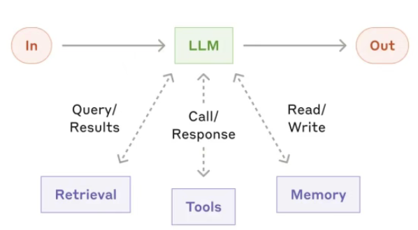

（2） **提示链工作流**：将任务分解为多个子环节，由多个 LLM 分别处理前一个环节的输出

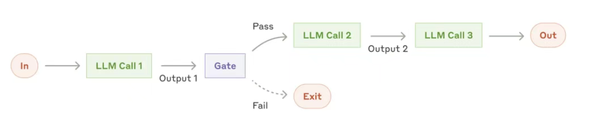

（3） **路由式工作流：**允许 LLM 分类 input，并在更合适的子任务中解决

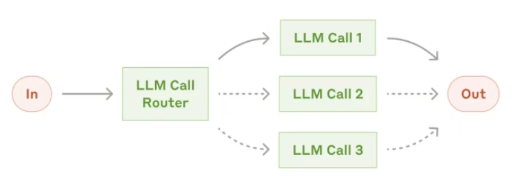

（4） **并行式工作流**：提升任务执行性能，分解为单因素单个模型处理会更好

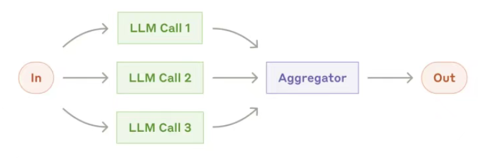

1. 2 Agent：

通常指： **自主智能体**，不断基于环境反馈的循环使用工具。能够理解复杂输入，推理与规划，以及从错误中恢复。

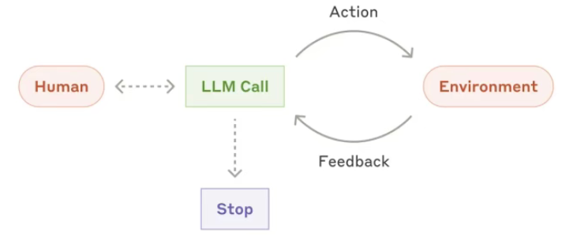

2、Agent 框架解决的核心问题

以 AutoGen / CrewAI 为代表的 Agent，把 **==对话内的动态规划与工具调用作为第一性能力==**。 **执行动作很难事先画成固定分支，必须在对话上下文中动态决策、跨工具灵活组合、支持“问一句 → 查一下 → 再决定”。**

**举例：真实 ToC 客服链路示例**

用户query：“ **我 8 月 1 号下的单今天还没到，收件地址要换，而且被重复扣费了。**”

```Python
Agent：
1、意图识别 & 澄清
Planner Agent 拆出多意图：物流异常 / 改址 / 计费异常
先问关键澄清：订单号 、 新地址 、扣费凭证2、跨系统取证
OMS / 物流：查轨迹与 SLA
计费 / 支付：核对重复扣款
CRM：识别 客户VIP等级、历史补偿记录

3、政策推理与合规
Policy/Critic Agent 套用规则组合：如“假期延误 + VIP + 改址”
评估：补偿区间 、 是否免费改址 、 是否触发人工复核4、方案生成与协商
给出可行方案：
改址 + 加急补发 or 原包裹拦截 + 差额退款 + 账单冲正
根据用户反馈实时调整5、执行与闭环
调用工单/票据：落账 / 发券 / 改单 / 寄件，写入 CRM 备注
生成总结：时限 & 跟踪号
任一步失败：自动备选策略或升级人工
```

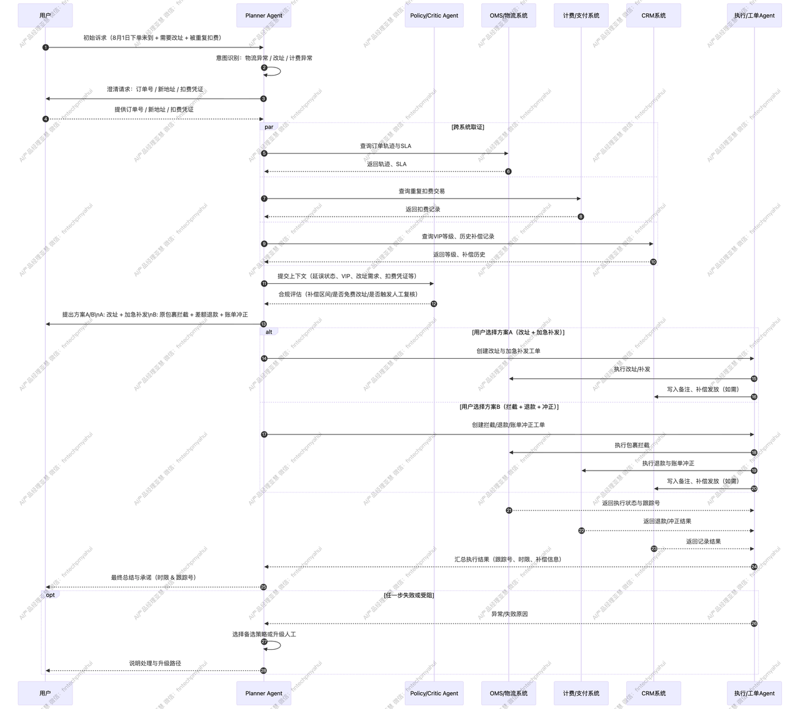

#### 5.3.2.2 多Agent协作的14大失败原因
原文地址（需要魔法）：https://arxiv.org/html/2503.13657v1

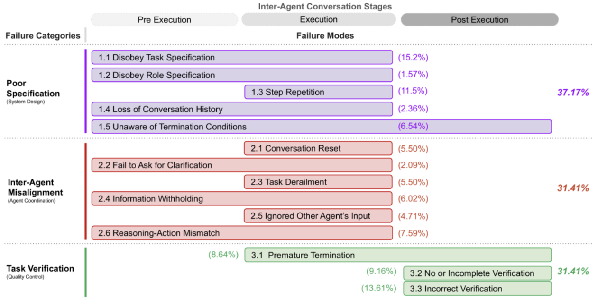

1、 **规范与系统设计失败**

包括任务/角色规范不遵守(如程序员越权决策)、步骤重复、对话历史丢失、未明确终止条件等。

示例:ChatDev中，需求分析师(CPO)擅自决定产品愿景，超出职责范围

2、 **智能体间的不对齐**

涉及沟通低效(如反复重置对话)、任隐瞒关键务偏离(如讨论无关内容)、信息、忽视他人输入等。

示例：某智能体发现凭证错误却未纠正，导致后续失败。

**3、任务验证与终止问题**

过早终止执行、验证机制缺失或不正确(如仅检查代码编译，未验证功能)

### 5.3.3 技术方案
#### 5.3.3.1 工具识别
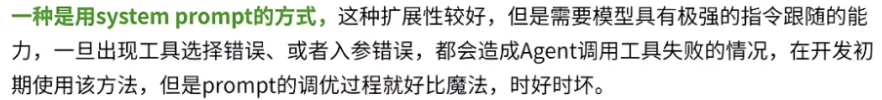

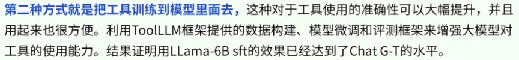

大模型识别工具的方式主要有两种：

**工具分类**

| **工具类型** | **功能描述** | **典型示例** |
| --- | --- | --- |
| **信息检索** | 获取外部信息 | 搜索引擎、 **数据库查询、API调用** |
| **计算工具** | 数学和逻辑计算 | 计算器、代码执行器、数据分析 |
| **通信工具** | 与外部系统交互 | 邮件发送、消息推送、文件传输 |
| **创作工具** | 内容生成和编辑 | 图像生成、文档编辑、代码生成 |
| **控制工具** | 系统操作和控制 | 文件操作、系统命令、设备控制 |

#### 5.3.3.2 Agent实现
传统方案是基于Langchain的agent来开发实现，但是langchain有很多问题：

过度封装、异步并发效率低、版本前后不兼容、核心功能难以控制，

由于langchain是用python实现的，解释性语言运行速度慢、并发处理能力较弱，虽然灵活性很高，但也造成了性能低的问题，所以比较适合做实验或小型应用，但是 **企业级高并发应用并不合适**。

所以在ReAct范式基础上，结合京东内部公共组件和自研组件，融入了 **工具/接口的接入、自定义工具的编排、记忆模块、vearch向量检索、prompt引擎、流式回调函数、各模块的监控、并用golang重写了Agent主要架构，提升了系统的稳定性和高并发能力，性能上整体提升50%以上。**

Agent的核心部分主要分了2个阶段，

（1） **初始化**阶段：

> 对环境信息的收集， ==包括用户的输入、历史记忆加载、工具的接入、prompt接入、模型的接入，流式非流式回调接入==，这部分在langchain中agent启动阶段是比较耗时的。
>

针对每轮用户的交互，Agent都需要重新初始化，我们采用Agent复用的方式进行预加载，除了用户的输入和历史记忆，其他模块全部提前加载，提升效率。

（2） **迭代执行**阶段：

> 包含4个部分， **==预处理模块、规划、后处理模块、执行==**。
>

> a） **预处理模块**：需要维护一个 ==阶段状态(第几轮迭代)和数据的拼接处理(用户的输入+大模型回复+执行结果)==。
>

> b） **规划模块**：通过大模型推理阶段，这 ==里需要预留对工具的解析模块==，因为不同的模型对于工具的输入是不一样的。
>

> c） **后处理模块**： ==对模型规划的结果进行解析，结束或调用工具==，如果需要调用工具，就进入执行阶段
>

d） **执行模块**：在模型的调用和工具的调用中预设自定义钩子，用户可以根据需求在自定义工具执行的任意阶段进行流式输出

#### 5.3.3.3 合理的架构
（1）完全智能化架构 vs 安全性架构

完全智能化架构：系统的运行 **完全依靠agent自主执行**（左图）

安全性架构：系统运行 **依靠提前编写好的任务流，Agent只做流程的选择和判断**（右图）

| 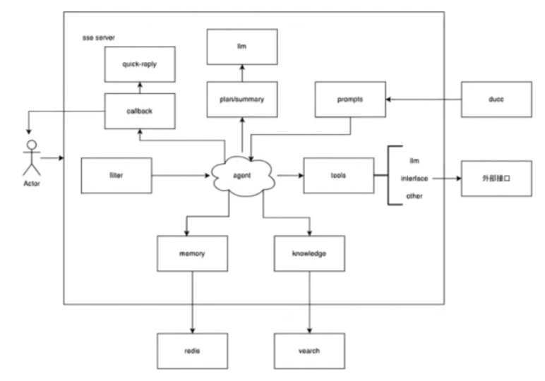 | 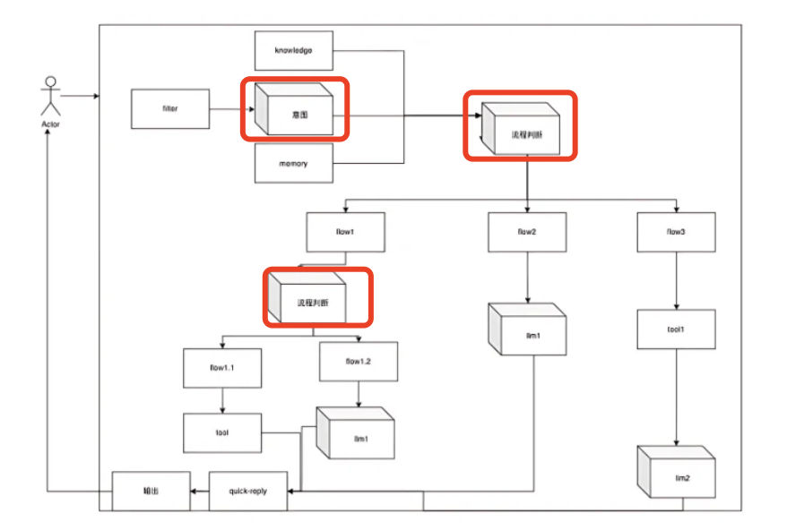 |
| --- | --- |

##### 以京东-LLM based Agent（京粉智能推广助手）为例：
重点主要是3个部分：

（1）Agent架构：核心大模型识别、可扩展且安全可控的架构

（2）记忆：大模型对用户的理解：记忆对应技术方案主要是短期记忆、长期记忆、垂类领域知识

（3）快捷回复：用户意图路径规划：主要是通过历史信息借助大模型续写、结合应用功能预设问题、根据应用业务目标规划用户使用路径图

根据整体实践，通过对 **AI Agent+工具+memory+快捷回复可以解决通用大模型应用的常见问题**。

既有简单任务，又有复杂任务，且随着时间推移增加的任务会越来越多，同时业务的定制化内容越来越复杂， **==所以从业务、安全、成本、效率评估，最终确定通过自定义任务流+Agent自主决策相结合的方式，兼容动态规划、自主决策执行任务流于业务的可定制化、可扩展性。==**

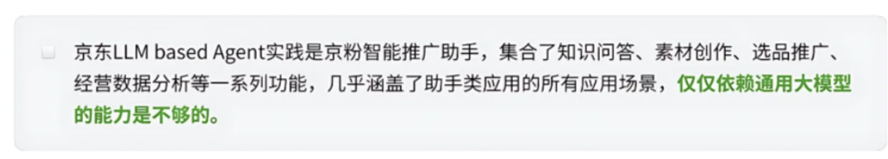

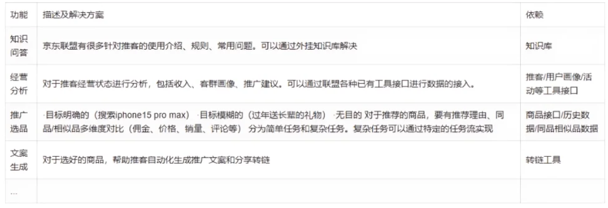

##### 业务效果
| 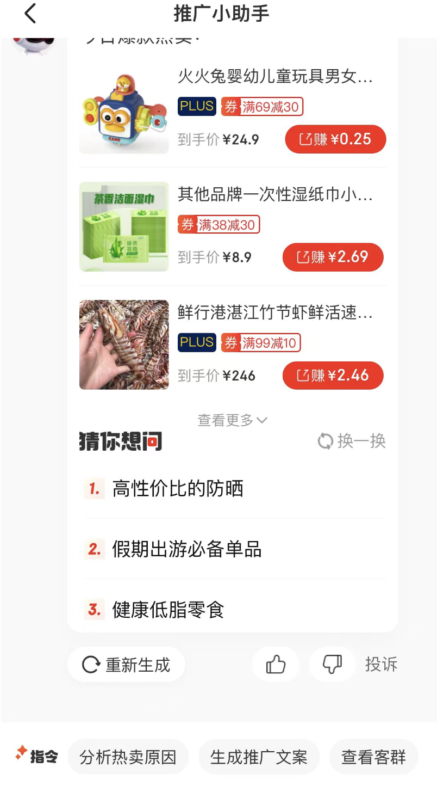 | 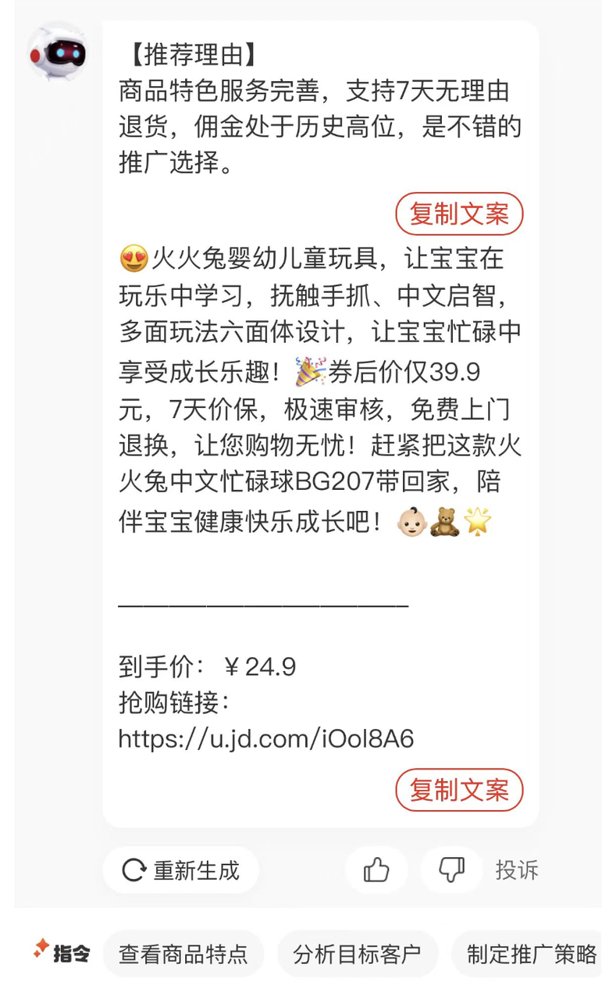 | 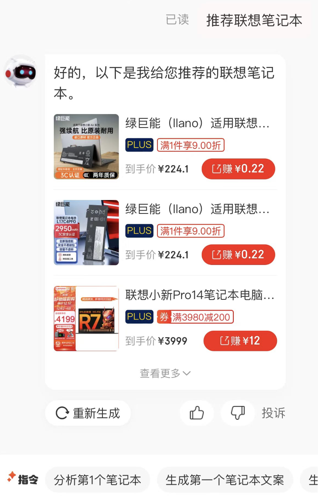 |
| --- | --- | --- |

#### 5.3.3.4 记忆
> Agent记忆（Agent Memory）：Agent在执行任务过程中存储和管理信息的能力和机制，用于记录交互历史、任务状态、用户偏好等关键信息，支持Agent在多轮对话和长期任务中保持上下文连贯性、个性化响应及持续学习能力。 **==本质是通过扩展大模型有限的上下文窗口（通常为16K-2M tokens）==**
>

1、挑战：

（1）大模型token的限制，和系统内存的限制， **无法将用户的所有历史信息进行存储和加载到模型中**。

（2）如何模拟人类大脑记忆和检索方式， **构建长/短期记忆**。

（3）多轮对话中的 **垂类领域知识的结构化记忆**。

> **所以Agent要解决的核心问题：如何在一个本质上****``**  **的、记忆窗口极其有限（或信息过载）的系统中，去执行一个需要长期****``**  **跟踪的复杂任务**
>

2、技术方案：

（1）从形式上看，Agent的记忆包括 **内部试验信息**(智能体与环境交互过程中的历史步骤)； **跨试验信息**(在多个试验中积累的信息，包括成功和失败的行动及其洞察)； **外部知识**(智能体可以通过API调用等手段获取的文本形式的外部知识)。

（2）记忆是个管理系统， **智能体的记忆操作包括记忆写作（记录信息）、记忆管理和记忆阅读（检索信息），涉及到CURD的操作，增加记忆、更新记忆、搜索记忆、获取特定记忆、获取所有记忆等系统（即****==理解、存储、删除、检索4个过程）==**，通过以下方式对短期记忆、长期记忆、垂类领域知识进行存储和检索。

https://arxiv.org/pdf/2404.13501

https://mp.weixin.qq.com/s/6BCdNqCV0A_ldKdrGbWr4g

> （1） **==短期记忆==**：比较容易，存储即时对话上下文：包括 **短期滑窗多轮对话的方式和定长时间内的多轮对话**都可以作为短期记忆， **短期记忆要尽可能的存储细节信息，但是轮数要尽可能的少**。
>

举例：处理用户查询时需临时记录“用户偏好咖啡口味”这一信息。 **可以使用基于队列或栈的轻量级数据结构，支持快速读写（如Redis缓存）**，依赖大模型的上下文窗口直接存储，超出容量时通过总结摘要压缩信息，但这种需要平衡实时响应速度与信息完整性，防止因窗口限制导致关键细节丢失。

> （2） **==长期记忆==**：持久化存储用户历史行为、企业知识库、任务经验等数据，支持个性化服务和复杂推理。
>

将短期的详细记忆提取出实体信息，可以通过NER（命名实体识别：Named Entity Recognition）抽取实体信息，也可以通过大模型对缓存量表征并存入向量库中。

举例：记录用户过去3个月的所有购物偏好，用于精准推荐。因为比较长， **所以一般使用向量数据库存储**，将文本语义编码为向量，支持相似性检索（如用户问“昨天的会议结论”时，自动关联历史会议记录），或者 **基于知识图谱存储**，结构化存储实体关系，增强逻辑推理能力（如企业级系统中存储产品与客户关联信息）。或者采用 **混合存储，结合向量检索与关系型数据库（如PostgreSQL）**，兼顾语义匹配和结构化查询

（3）垂类领域知识，比如京东的skuid，是一个数字类型，不代表任何语义信息，在前面的对话中可能会输出给用户某个skuid。

如果短期记忆已被压缩成长期记忆，就会导致不包含任何语义信息的数字类型消失，可以通过自定义结构化信息存储的方式将这类信息与长/短时记忆进行融合存储和检索，这样在用户多轮次对话中就可以通过(“分析上一个商品”)从记忆中获取结构化的skuid来查找并分析该商品，而不是必须输入分析上一个商品的 “skuid”才能够识别。

（4）检索时 **同时检索短时缓存记忆和向量库长时记忆检索**(通过vearch实现) **以及垂类领域知识**， **将三部分进行融合后，作为整体的记忆模块，节省记忆空间**。

Agent 应该学会判断： **哪些信息值得进入长期记忆，哪些只是过眼云烟**。一个不加选择就把所有对话历史都存入向量数据库的 Agent，最终只会在检索时被无关信息淹没。

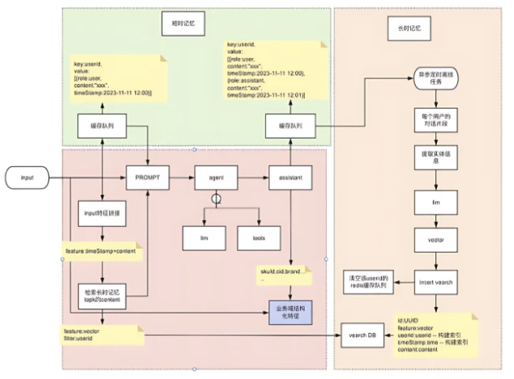

#### 5.3.3.5 快捷回复
（1）3种实现方式：

a）通过历史信息和用户的当前输入， **利用大模型总结续写能力，生成一些用户可能继续输入的内容**。

b）结合应用的功能 **预设一些常用问题**

c）重点：可以根据应用的业务目标，来规划用户使用路径图，使用户按照快捷回复的路径最终达成我们需要的业务目标，在实际业务中可以结合1、2点，既有用户想输入的，又有我们想让用户看到的功能。

比如京粉智能推广助手的最终业务目标是帮助推客选品并推广，那么所有的功能点最终都要导向帮助推客生成推广文案和推广链接并分享。

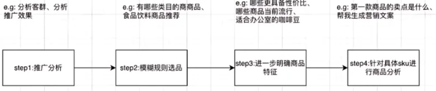

#### 5.3.4 Agent 评估体系
Agent 评估是指对 Agent 在执行任务、决策制定和用户交互方面的性能进行评估和理解的过程。由于 Agent 具有固有的自主性，对其进行评估对于确保其正常运行至关重要。

**1、评估的基础步骤：**

> **==1、定义评估的目标和指标：==**
>

**目标**：评估Agent的任务执行效果，包括准确性、响应时间、效率和用户体验，具体指标包括如：任务完成度（Task Completion Rate）、准确性（Accuracy）、响应时间（Response Time）

> **==2、收集数据并准备测试：==**
>

最好使用真实场景的数据进行测试数据集的构建；构建的测试数据根据实际处理任务以及任务复杂度进行构建，尤其对于复杂的多步骤任务，构建完整的推理步骤进行 Agent 应用的评估对于整体效果有着更好的保障。

举例：电商Agent-订外卖类任务，

**-数据来源**

收集的数据可以包括：

- 用户的常见需求（如常点的餐品、餐厅、时间偏好等）。
- 外卖平台的订单历史数据。
- 用户的互动记录，尤其是关于订餐、支付、取消订单等相关操作的数据

……

**-构建测试数据集**：

对于电商Agent多步骤任务（如订外卖，选择餐品、确认时间、支付、并提交订单等），需要构建多轮交互的数据集，确保数据集覆盖了从查询到最终确认订单的所有步骤。

例如：评测数据集中的一个典型场景可能是：

- 用户输入：“我想点个外卖，今晚吃披萨，送到我家。”
- 第一步：Agent查询附近披萨店。
- 第二步：Agent展示披萨店选项。
- 第三步：用户选择披萨，并指定送餐时间。
- 第四步：Agent询问是否使用优惠券，并选择支付方式。
- 第五步：Agent确认订单并下单

**-测试任务复杂度**：

应覆盖多种情境，如：

- 用户选择的餐厅没有外卖服务，Agent需要提供备选餐厅。
- 用户没有指定送餐时间，Agent需要询问并提供推荐。
- 用户使用优惠券、积分等其他促销手段时，Agent应当能准确计算价格

> **==3、执行并分析结果。==**
>

**-执行评估：**

- **自动化测试**：利用自动化脚本或模拟用户行为来执行任务，记录每一步的成功率、响应时间、工具调用等信息。可以选择一个能力最强的模型，使用 LLM as jugde 。
- **人工评估**：最准确的评估结论仍然是人工评估，在早期mvp/0-1/早期数据量没有那么多的情况下，让然推荐人工评估，逐条检查任务完成情况。例如，评估Agent是否成功执行外卖下单，是否根据上下文提供了适当的反馈。

> **==4、优化测试数据集，效果优化迭代==**
>

**-优化迭代测试数据集：**

- **badcase分析，找问题：**根据前期评估结果，识别模型的薄弱环节（如某些步骤的执行频繁出错），例如，测试在用户未明确指定送餐时间的情况下，Agent能否推理出合理的送餐时间
- **更新数据集，加入更复杂的场景：**若用户在选择餐品时多次更改选择，测试Agent是否能及时更新状态并正确处理用户的新请求
- （拓展，看你的场景）加入更多的多语言、多地区的测试数据，确保Agent能在全球范围内准确完成任务，避免地域性差异或语言问题导致错误。

**-效果优化迭代**：

- **模型优化**：根据测试结果和反馈对Agent的模型进行调整和优化。例如，通过多步骤推理能力或增强工具调用准确性来提高整体表现（微调/提示词）。
- **用户体验改进**：根据用户反馈优化交互流程，减少不必要的步骤/优化交互，提升用户满意度。

2、评估指标体系

Agent 标准评估指标包括：业务类型、效率类型、安全类型等。但是必须要结合你的实际业务场景去定制你的指标

| **类别** | **指标名称** | **定义** | **公式** | **公式说明** | **应用场景** |
| --- | --- | --- | --- | --- | --- |
| 业务类指标 | 任务完成率 (TCR) | **成功完成的任务数占总任务数的比例** |  | 为为成功完成的任务数，N 为总任务数 | 电商客服：处理退换货、物流查询等任务时，成功解决问题的比例；金融风控：信贷审批的准确性。 |
| 决策准确率 (Decision Accuracy) | **每个决策步骤的正确比例** |  |  | 医疗辅助：AI 诊断推理正确性；供应链调度：货物分拣路径规划的准确性。 |
| 工具调用正确率 (Tool Call Accuracy) | **Agent 调用工具时，能够提供正确辅助的比例** |  |  | 企业 HR：招聘工具调用准确性；旅游服务：行程规划工具调用合理性。 |
| 效率类指标 | 平均任务耗时 (Average Time) | **完成一个任务所需的平均时间** |  | tend为任务结束时间，tstart为任务开始时间，N 为任务总数 | 银行柜台辅助：开卡、转账等业务的平均处理时间。 |
| 平均交互轮数 (Average Steps) | **完成任务所需的平均对话轮数** |  | 第steps_i个任务的交互轮数，N为任务总数 | 零售客服：退换货、商品咨询等任务的平均对话轮数。 |
| 安全性指标 | 偏见发生率 (Bias Rate) | **Agent 在决策过程中是否存在不合理的偏见** |  |  | 招聘：简历筛选的性别、年龄偏见；打车平台：网约车调度的区域偏见。 |

3、常见的Agent评估框架

| **框架名称** | **主要聚焦** | **特点** | **商用/开源** |
| --- | --- | --- | --- |
| AgentBoard [https://github.com/hkust-nlp/AgentBoard](https://github.com/hkust-nlp/AgentBoard) | 轨迹与事件回放 | 细粒度多轮交互评测、可视化回放 | 开源 |
| AgentBench [https://github.com/THUDM/AgentBench](https://github.com/THUDM/AgentBench) | LLM-as-Agent 综合基准 | 8 大模拟环境覆盖对话、游戏、文件操作等场景 | 开源 |
| τ-bench (Tau-bench) [https://github.com/sierra-research/tau-bench](https://github.com/sierra-research/tau-bench) | 用户-Agent 真实对话评测 | 三层评估（数据库、策略文档、用户模拟），聚焦零售客服、航旅场景 | 开源 |
| GAIA | 测评AI助手在解决现实复杂、多模态、多步骤问题上的通用能力，强调多轮推理和综合应用 | – 多模态（文本、图像等）、多阶段真实问题任务 – 任务多样，通用性强，考察系统性AI能力 | 开源 |
| WebArena | AI智能体在仿真Web上的自动任务执行与复杂交互，通过虚拟Web页面评测Agent能力 | – 高仿真、可控、可复现的Web交互环境 – 覆盖电商、论坛、协作开发等多类网站 – 包含实用工具、知识资源，支持复杂任务链 | 开源 |

举例：Agent Board：

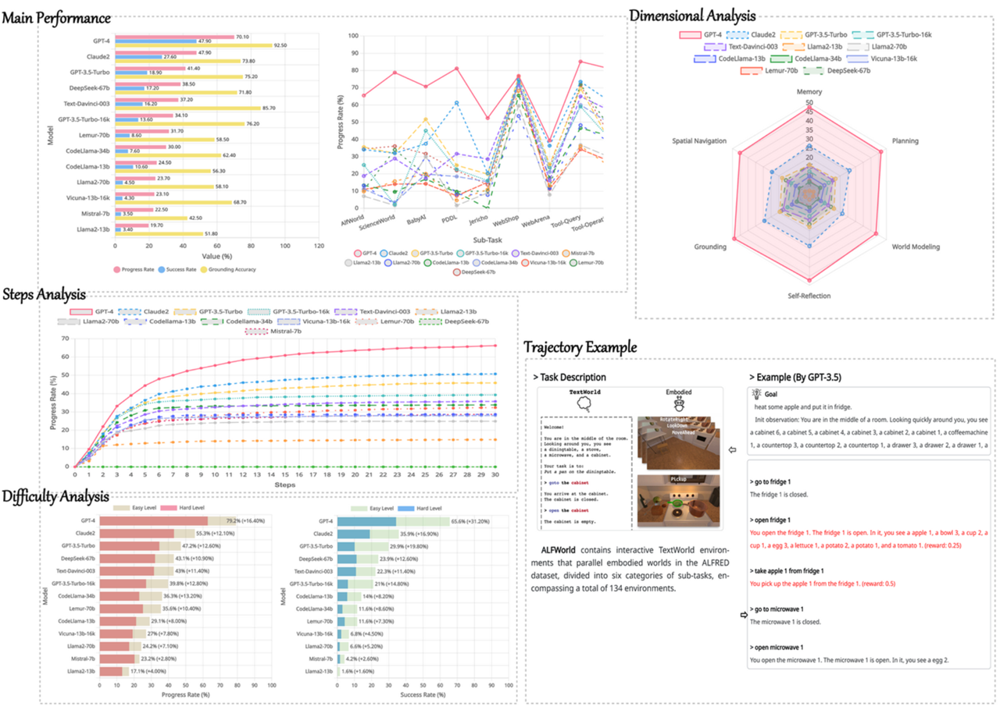

```Python
Success Rate（任务成功率）：衡量 Agent 在规定最大交互步数内“完全达到”环境目标的比例
Progress Rate（进度率）：衡量 Agent 在多步任务中已完成子目标的比例，反映累进式推进能力
Grounding Accuracy（落地准确率）：衡量 Agent 在每步操作（如点击、API 调用）中生成“合法、可执行”动作的比例，用于评估动作的有效性及环境交互质量维度能力评分

AgentBoard 进一步将 Agent 能力拆解为以下六大维度，并分别打分：
Memory（记忆）：长程上下文信息的利用能力
Planning（规划）：将整体目标分解为可执行子目标的能力
World Modeling（建模）：推断并维护环境隐状态的能力
Retrospection（回顾）：基于环境反馈自我反思并修正行为的能力
Grounding（落地）：生成有效动作并成功执行的能力
Spatial Navigation（空间导航）：在需要移动或定位的任务中，高效到达目标的能力难度分层分析
Easy/Hard Breakdown：分别统计“易”“难”子集上的 Success Rate 与 Progress Rate，帮助识别在不同难度样本上的性能差异长程交互趋势
Long-Range Interaction Curve：展示随着交互步数增加，Progress Rate 的变化趋势，用于评估 Agent 在“长对话”“长任务”中的持续推进能力
```

AgentBench 为了支持模型开发与公平对比，将数据分为两个子集：

- Dev 集：包含 4,000 多条多轮交互样本，主要用于内部调试和方法迭代。在这一部分，你可以多次试验、调整模型参数。
- Test 集：包含 13,000 多条多轮交互样本，用于公开 leaderboard 排名和最终性能评估。这个集合不公开标签，保证各团队在同一标准下公平竞争。

4、 **Agent质量评估实践建议**

在设计一个通用的Agent评估体系时，我们的目标是 **既要评估Agent是否“能做对事”，也要评估它是否“做得够好”**。一个完整的评估方案通常包含三部分： **==数据准备、指标设计、归因分析。==**

（1）准备评估数据： **有高质量的评估数据集**

```Python
（1）最佳做法：从真实业务场景中采集实际任务数据，整理成标准化的Agent测试集
比如：
智能客服Agent，可以采集历史对话、用户请求和预期动作
自动化办公Agent，可以记录真实任务的输入输出流。

（2）但如果暂时没有真实业务数据，也可以采用“自举式”生成：
人工编写一些高质量示例任务，再利用 self-instruct 的方式，让模型自动扩充出一批多样化测试数据（适合冷启动阶段快速搭建初始评测集）
```

（2）评估指标设计： **至少要关注2类核心指标**

a） ==Tool调用准确率：==是Agent最基础的能力指标，工具调用是否正确，参数提取是否精准，直接决定了任务是否能顺利完成

```Python
-细粒度评估：对每一次工具调用逐项比对，分析工具类型是否匹配、参数是否提取正确。
例如统计参数识别的准确率、召回率等（如下图）

-粗粒度评估：直接比较任务执行后的结果是否与预期一致。比如在AgentBench中，可以检测任务执行后系统状态或数据变更是否符合预期
```

**Tool 调用分析图：**

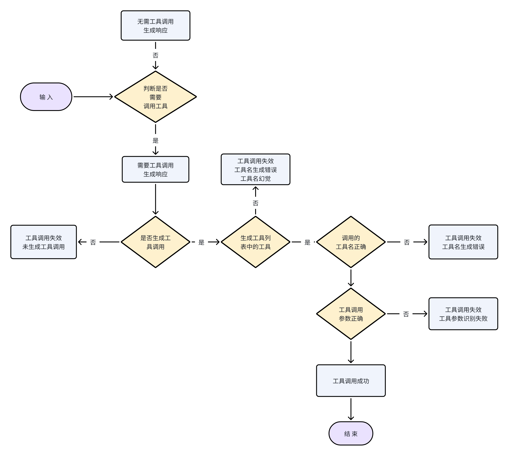

b） ==任务总体完成率：==衡量Agent能否真正完成整个任务

```Python
对一些有固定正确答案的场景：可以用Rouge、BLEU、等自动化指标进行打分

对开放性或过程型任务：则更适合通过结果状态一致性判断，任务执行后的系统或数据状态是否与目标一致。
```

（3）归因分析：

```Python
-规则式分析：基于预定义规则自动判断错误来源（如工具调用错误、参数提取失败、知识缺失等）

-LLM as Judge：让高级大语言模型扮演评审者，根据任务上下文推理出失败原因
```

（4）其他实践建议：

a） **自动化评估与人工评估结合的方式：**用自动化指快速量化性能，用人工评估（或LLM评估）补充对连贯性、逻辑性、自然性的判断（更加符合实际业务场景要求）

b）指标应该匹配业务场景设计，比如：

- 聊天型Agent更关注：互动性和对话连贯性
- 工具型Agent更关注：任务完成率和执行准确率
- 翻译型或生成型Agent：强调流畅度与准确性

c）持续监控与可观测性：形成“ **评估—反馈—优化”**的闭环

可结合 **Langfuse**等可观测性框架，对Agent的任务执行过程进行监控。包括：任务完成率、平均调用次数、推理时延、成本等指标的持续观测

## 5.4 京东商家智能助手：Multi-Agents在电商领域的探索应用
### 5.4.1 背景
电商助手是一款集合了多种电商经营决策功能的工具软件，旨在帮助电商从业者完成 **从商品发布到订单管理、客服沟通、数据分析等一系列电商运营任务**。京东零售基于 Multi-Agents 理念搭建了商家助手大模型在线推理服务架构，这一系统的核心是算法层基于 ReAct 范式定制多个 LLM AI Agents，每个 Agent 都有专门业务角色和服务功能，可以调用不同的工具或多 Agent 协同工作来解决相应的问题。

fintechpmyahui

### 5.4.2 当前商家进行经营决策的流程 vs Agent
（1）平台向商家传递各种信息，包括新玩法、新规则条款，以及可能的惩罚通知等。

（2）面对平台的各种消息和随之而来的疑问，商家需要一个经营助手Agent协助，这个经营助手Agent通常扮演一个专门提供平台知识百科的咨询顾问角色。

（3）当商家提出赔付、运费等与业务相关的复杂问题，Agent需要先理解需求，然后 **从长篇的业务文本中抽取出问题解决的大方向或目标**。

（4）定位问题后， **Agent形成逐步的解题思路，再灵活调用各种资源和工具来解决问题，其中包括调用知识库、进行搜索和检索，以及使用人脑进行总结和筛选重点内容。经过这一系列操作后将问题的最终答案返还给商家。**

但是当前京东实际上并没有“经营助手顾问”这个角色。每天提供专属服务的实际上是在线客服、业务运营人员以及产品经理，他们解答各种问题。

> 那是否需要为每个岗位角色构建一个 Agent？解决这个问题时，回到应用场景，从商家的需求出发：无论谁在回答问题，对商家来说都只有一个人帮助他们解答问题。 ==因此，构建一个 Agent 即可，它映射到为商家提供专属咨询服务的多个业务岗位的人。 构建这样一个 AI 版的 Agent 对商家和平台都有好处。对商家而言，他们将体验到一个永远在线的百科全书，能够突破时间、体力和知识掌握的极限。对平台来说，可以降低成本。==
>

多领域助手与商家的经营协作时，整个团队是如何协作经营的呢？

**（ Agent ReAct 范式的一个典型例子，即基于观察（observation）来更新整个推理（reasoning）过程。 在解决问题的思路上，人类和 Agent 非常相似）**

比如，商家提了一个问题：“最近我的店铺经营得怎么样？”

（1）这时候 **可以直接“调度”数据分析师这一角色**，将任务分配给团队中的数据分析专家，这位专家经过一系列操作后，会返回给商家一份数据报告。接下来，商家需要阅读并理解这份数据报告，他可能会发现新用户的留存率不佳的问题。这时，商家会根据新发现的问题更新决策。

-》

（2）商家重新选择一个角色，比如用户研究专家，来分析新用户的偏好，解决新用户的留存率不佳的问题。这样的“拿到结果更新决策 - 调度新的专业角色 - 输出结果”会不断循环往复。

**一个经营诊断与优化的问题，电商商家团队的成员要懂得数据分析、平台知识、用户研究、商品选品、定价、营销投放，还需要有人掌握制作图片和音视频素材的技能，以及完成所有操作和客户售后运营。而商家自己，需要清楚地了解每个团队成员的专长（profile），以便在更新决策时知道如何调度这些资源。**

**当商家发展到一定阶段，通常会聘请一个“最强大脑”来代理所有这些调度工作。这个“最强大脑”可以被理解为一个“总管”。有了总管，所有的调度工作都由总管代理完成，而商家只需要与总管沟通即可。这样的协作模式可以极大地提高商家的经营效率。商家想要完成一个经营诊断，他只需向总管提出：“帮我看看最近经营得怎么样？”然后他就可以耐心等待。总管在接到任务后，会进行一系列的操作，最终给出结论：“你最近新客户的留存情况不太好，我这里有一些商品营销创意的建议，你看看是否采纳。”相关的专家们的输出材料会作为附件提供给商家。**

### 5.4.3 构建 AI 版的商家经营团队
**从单一个体到各个专业领域的专家团队，再到基础的执行工具，共同帮助商家完成了一个决策过程。**在当前的团队配置中，可以关注三类主要角色：

（1） **领域专家（各种Agent）**：以咨询顾问为代表， **这类角色不仅具备决策能力，还能够调度工具**。在 AI 空间中，他映射 Agent。

（2） **工具（服务能力接口API）**：这类角色 **不具备决策能力，只能执行任务**。

（3） **总管（最强的Agent）**：作为整个决策发起的引擎，总管不需要在某一领域深耕，但必须具备通用的电商知识，了解如何经营业务。在面对问题时，总管能知道如何发起调度，负责整体的专业服务流程编排，

商家经营团队的运作模式提供了 AI Agent 的现实版样例：用Transformers 和研发代码可以构建“AI 版的商家经营团队”：一个由 **==Master Agent（主代理）领导的多领域 Agents 团队，团队同时掌控着一系列原子能力工具 API。==**

1、业务价值：

（1） **体验提升**：商家可以享受到 7*24 小时的在线服务

（2） **效率提高**：商家不再需要学习使用各种工具和专业知识，只需 **用他们最熟悉的经营语言与 Master Agent 沟通，即可直接享受系统提供的各种服务**

（3） **决策质量提升**：由于有大量的备选方案可供选择，商家的决策效率和质量自然会提高。

（4） **成本节约**：商家可以减少人力和时间的投入，平台也可以减少不必要的运营开支，让京东业务人员从繁琐的问答中解放

**2、ReAct Agent 构建：**

构建 ReAct Agent 时，每个 Agent 会经历一个 inner loop，这个内部循环称为 reasoning（推理），对应于思维过程，即生成解题思路和大目标的步骤。reasoning 过程包含两个主要部分：

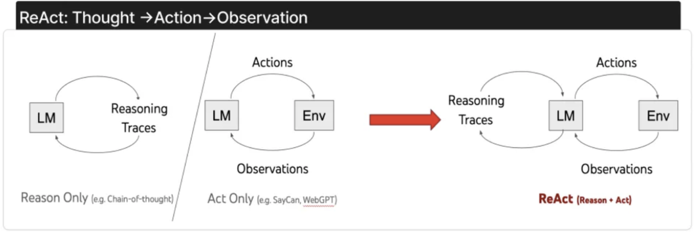

（1） **Thought（思考）**：将其定义为 **用人类自然语言描述的解题决策思路**。但是，为了调度系统工具，LLM 需要发出指令，因此需要将这种人类语言翻译成系统能解析的研发语言（即下面的 action code）。

（2） **生成 Action Code**（动作代码） ：基于生成的 Thought，Agent 会继续生成 Action Code。这个 Code 不直接执行 Action，而是执行 action 的指令。Action Code 是基于 Thought 解析出来的，因为 Thought 是拆分多步骤的解题思路，所以 Action Code 是对应的一系列任务。每个任务的定义可能非常复杂，提取 JSON 中的一些简单字段来说明：

- 调度对象：告诉系统你要调度的工具是谁，比如 Master Agent 可能会调度其他 Agents 或 API。

- 输入信息：提供给调度对象的信息，即函数的输入参数。

-Job Description：如果调度的是 Agent，需要让 Agent 明白分配给它的任务是什么，类似于工作描述。

-Trust_Mode：这是考虑性能和 Agent 质量的一个字段，它决定了 Agent 在接收到工具返回的observation（观察结果）后，是再次进行 reasoning 还是直接输出结果。

Action Code 是服务端可解析的代码，它会与环境中广义的 Agents API 和 Tools 进行交互并执行代码。当这些工具完成工作并将 observation 返回给 Agent 时，Agent 将进行下一轮的 reasoning。这个过程会一直持续，直到 Agent 生成了一个 Trust_Mode 变为 1 的输出，这意味着 Agent 认为所有的推理和调度都已完成，可以将结果推送给用户。

**3、Multi-Agent 工作流程（举例）：**

普通的 Agent 与 Master Agent 的区别在于： **==Master Agent 直接与用户交互，而普通 Agent 则接收来自 Master Agent 的 Action Code，这些 Action Code 转化为服务层协议，作为它们的输入参数。==**

打招呼：商户打开“商家智能助手”，助手会与商家打招呼

第1轮：

（1）商家提问：“在京东开店需要交多少保证金？”，用户和 Master Agent 之间建立联系， **Master Agent 会从 Memory 中获取与用户相关的近期和远期特征**。

（2）Master agent 开始内部推理：

a）Master agent 的 LLM 理解商家的提问 ，但意识到缺少必要的条件，因此无法直接派发任务

b） LLM 向商家追问一个条件 ，因为保证金与商家经营的类目密切相关。这时，它会调用一个名为 Echo 的工具，Echo 的作用仅仅是将信息传递给用户，不做任何处理。

c）Master agent 将 Trust_Mode 设置为 1，因为 Echo 的任务是单向传递信息，不需要再返回给 LLM 进行推理

d）Action Code 开始执行，Echo API 被唤起， 将问题传回给用户，同时将上下文信息推送给 Memory

第2轮：

（1）商家回答说：“卖花”，这时用户的信息再次流向 Agent， **LLM 根据商家提供的信息和 Memory，生成解答思路在 Thought 中**。

a）LLM 知道需要调度的对象是 Consulting Advisor（咨询顾问 Agent）， **并向 Advisor 传递了一个 Job Description，且需要与他沟通并分配任务**。

b）Agent 之间的通信协议基于 Action Code，告知 Advisor 商家需要查询的类目对应的入住保证金费用。

c）此时 Trust_Mode 设置为 1，意味着 Advisor 完成任务后不需要再返回给 LLM，因为 LLM 信任 Advisor 专门执行此类咨询任务。这是出于性能考虑，避免让用户等待过久。

d）随后， **Advisor Agent 执行任务并返回输出，同时更新 Memory**

e）最终， **Master Agent 回答用户的问题**

第3轮：

（1）客户提出：“为花店起名”， Master Agent 的 LLM 识别出 **这是一个明确的问题**。

（2）为了解决这个问题，将会进行 3 轮 ReAct。

a） **不需要调用其他 Agents，而是直接调用一个特定的 API 会更加高效**。它调用的是一个名为“Shop Name Generator”的 API，这是一个基于大语言模型的起名工具，它需要接收的输入参数是店铺的类目信息。

b）他 **从 Memory 中提取了之前 “咨询顾问 Agent” 提供的信息，即商家经营的是“生活鲜花”，并将这个信息作为参数传递给 Shop Name Generator**。此时，Trust_Mode 为 0，这意味着 API 生成的店铺名字将返回给 Master Agent 做其他的推理，而不是直接输出给用户。

c）回到 ReAct 流程中， **API 输出了一系列的店铺名字，但用户此时还不会看到任何输出的结果**。

d）所有这些步骤完成后，相关信息都会被推入 Memory

### 5.4.4 Multi-Agent 分层次架构
1、好处：

（1） **Multi-Agent 架构采用“分层次”的方法，将一个大模型的复杂生成任务，拆解成了多个层级化的下一步文本预测。这样，每个模型需要处理的推理难度就相对较小，因此模型的规模不需要很大，从而减少了训练和部署的计算资源消耗，并且可以快速迭代**。

（2） **可方便灵活地接入各种资源方，比如营销的 Agent可以迅速地整合进系统中**

2、潜在问题：

（1）可能导致风险的累积。如果 **Master Agent 出错**，那么整个任务的结果可能就会受到影响。因此可能需要实施全链路监控，以确保系统的稳定性和可靠性。

（2）由于可能需要 **经过多个 LLM 生成步骤，响应时间有时可能会较长**。

（3）商家面临的问题通常涉及工具操作，这些问题都需要结合具体的业务情境来解决。因此Agent 也需要“死记硬背”所有 Tools 的能力。目前在整个推理流程的多个环节中可以整合 Retrieval（检索）过程。例如在生成 Thought 之后，Agent 可以暂停并调用检索工具或 Agent，等待 Observation 返回后再明确调用哪个 Tools，然后生成 Action Code。这意味着 Thought 和 Action 可以分两轮生成。

### 5.4.5 ReAct SFT：垂域样本构建
在解决相对确定性输出的问题时，核心工作在于构建垂直领域的知识。这意味着将人类专家的知识传授给系统，特别是针对商家领域的知识。对于这类问题，通常 **使用标准的 SFT 加上一些预训练模型基本上就足够了**。

（1）如何构建样本基础池？ **==鉴于先解决比较确定性的问题，可以从在线客服、运营和产品的回复，以及商家满意度收集的接口等获得真实的数据，然后对这些数据进行清洗。接着，研发团队会根据系统的调用路径构建一个全面的路径树。最后，业务人员将构造一些剧本，描述可能的问答场景。==**将这两部分结合起来，我们就得到 SFT 样本 的基础池。

（2）对基础池进行丰富度扩充： **==最主要的是对问题（Q）的扩充。有了问题和答案（A），以及调用路径，接下来需要生成中间的标签（label）即 thought 和 action code，这就需要依赖先验的知识库==**。

（3）需要研发的配合，需要按照标准来注册 API：因为工具的调用靠注册信息的质量，如果两个不同的工具，它们的描述写成一样的，那么大模型也无能为力， **==因为它只能通过工具的自我介绍来选择工具来执行任务。因此，知识的准确性非常重要。==**

### 5.4.6 复杂输入下的 Thought 生成
复杂输入的问题，不像简单输入那样直接。解决这类问题，关键在于遵循 Agent 推理的流程： **先生成 Thought，再解析 Action Code。因此，生成一个强大的 Thought 变得非常重要。**对比单纯用 RAG 和用 LLM agent 解题的效果，比较一下有和没有好的 Thought 的区别。

1、RAG

假设：用户提出一个问题：“在京东卖红酒要多少钱？”

如果直接使用 Retrieval（检索增强）来解决问题，按照经典的方式，先进行 Query（查询）并计算 Similarity（相似度），然后召回一些文本。 **在召回的文本中，可能会看到白酒、黄酒等，但实际上并没有答案，因为红酒这个类目在我们的知识库中并不存在，它不是开店保证金的一个选项。基于错误的信息片段，再加上用户模糊的问题，即使是非常强大的 Summary Model（总结模型）也无法给出正确的答案。**要解决这个问题，我们需要让模型理解红酒实际上与哪些类目是有关联的。这就需要模型不仅要有检索能力，还要有推理和关联的能力，以便正确地将问题与相关的知识库内容关联起来，从而提供准确的答案。

2、LLM Agent 解题

商家助手中的 “咨询顾问 Agent” 经过训练后，会以特定的方式解题。还是开始于 Master Agent 与用户的对话。

例如商家提问：“京东红酒入住资费是多少？”

（1）Master Agent 并不直接理解这个问题， **而是将用户的询问“京东红酒入住资费是多少？”通过 Action Code 传递给咨询顾问 Agent。Action Code 中的 Job Description 是“请回答京东红酒入住资费”**。

（2）咨询顾问 Agent：处理查询时，

a）首先 **理解**红酒实际上属于葡萄酒这一类别

b）Advisor 的 **Thought 中生成出应该查询的是葡萄酒类目的入住资费**，并确定了使用哪些关键词来传给调度的检索 API 做关键入参。

c）生成 Action Code 时，Advisor 会传递给检索 API 这个关键入参，即 **Search Query“葡萄酒保证金“。这个参数不再是用户的原始问题，而是根据 Advisor 的推理进行了调整**。API 本身没有决策能力，但由于 Agent 具有推理能力，它能确保传递给工具的输入是正确的，从而用正确的参数唤起正确的工具

（3）Summary API 接收到一个关键的输入参数，称为 Thought for Answer，即回答思路。这个思路是 **Advisor 在推理过程中在 thought 生成的关于红酒与葡萄酒类目关系的理解。Advisor 告诉用户红酒和葡萄酒之间的关系，并按照葡萄酒类目的答案来回答用户的问题。**

（4）advisor 继续遵循经典的 RAG 流程：

Search Query 变为“葡萄酒保证金”。虽然召回的葡萄酒与原始问题的“红酒”相似性不高，但由于顾问使用了“葡萄酒”和“保证金”作为搜索关键词，并将回答问题的思路作为 Prompt 的一部分传递给总结 API，API 就能够根据 Advisor 提供的推理思路，正确地回答关于红酒保证金的问题，即通过查看葡萄酒的保证金来得知红酒的保证金情况。

### 5.4.7 全链路 ReAct 监控
为了定位 Bad Case实施了全链路 ReAct 监控：收集在线推理生成的 Thought、Action Code 和 Observation，然后通过人工打标 + 大模型来进行评估。

（1）评估函数会将人工打标的输出与 Agent 生成的输出进行比较，以确定两者之间的差异。这个评估与 Agent 的具体定义紧密相关，因为不同的 Agent 可能有不同的评估标准。评估主要基于三个结果： **Thought、Action Code 和 Observation**。 **Observation 虽然是作为下一轮推理的输入，但它本身并不是由 LLM 生成的，它的质量会影响下一轮的 Thought 生成。**

（2）对于 Observation 的评估：包括预测销量的准确性或用户对生成图像的满意度等，这些指标并不完全由 LLM 控制，因此 Observation 的评估也与服务的业务指标相关。

基于评估结果， **会有一个流程决定 Agent 的表现**。

（1）如果 Agent 在第一轮的 ReAct 得分很低，会继续累积这个分数，但如果得分低于某个阈值将停止后续的推理，并且该 Agent 将不再参与后续得分的累加，意味着它已经退出了推理过程。

（2）如果 Agent 的得分符合要求，会检查是否为最后一轮推理。如果不是最后一轮，Agent 将更新后进入下一轮评估。如果是最后一轮，将触发结束流程。

（3）在多轮推理和评估后，当触发结束评估时，会得到一个全链路累积的 ReAct 得分。这个推理过程是链式的，涉及到递减的折扣因子γ和η，这些因子会影响 Agent 的 ReAct 得分和整体得分。评价核心在于能够快速定位问题节点，这是由架构决定的，必须通过这种方式来尽早发现并解决问题，防止问题在推理过程中蔓延。

## 5.5 【案例】金融交易-多智能体股市预测框架
金融市场的复杂性和波动性使得交易和市场预测面临挑战，需综合多种信息并采用先进算法。传统深度学习和强化学习方法对数据量要求高，限制了解释性。本研究 **提出了一种专为金融交易设计的多模态多代理系统，利用多个专门的LLM代理处理文本新闻、蜡烛图和交易信号图等数据。表现优于传统规则和强化学习模型。**

https://arxiv.org/pdf/2411.08899

1、FinAgent框架，缩短训练时间并引入按投资组合百分比预测交易头寸的决策过程，以改善风险管理和资本配置。框架包含四个主要模块：摘要模块、技术分析模块、反思模块、预测模块。

> **摘要模块**： ==将大量新闻数据浓缩为简明摘要，突出影响股票交易的事实信息==。
>

> **技术分析模块**：利用LLM的视觉推理能力 ==分析蜡烛图和技术指标，为次日交易策略提供解读==。
>

> **反思模块**： ==评估过去交易的短期和中期表现，并生成交易信号图表和效果分析==。
>

> **预测代理模块**： ==整合各模块信息，预测交易行动、确定仓位大小，并提供决策解释。==
>

> **奖励代理模块**：根据预测输出执行交易并 ==计算绩效指标，反思和预测代理在后续迭代中使用这些指标==。
>

2、方法：

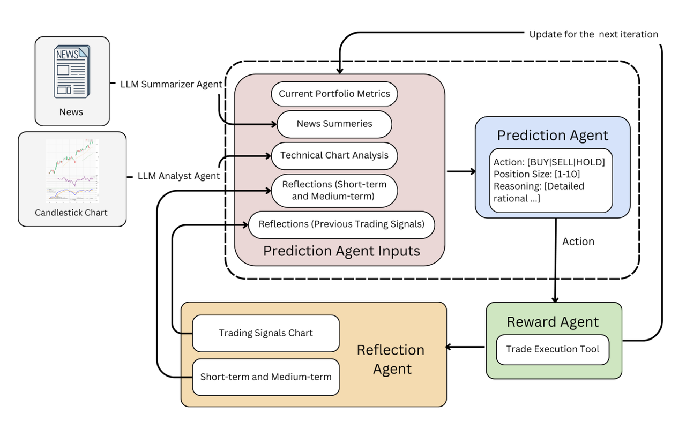

**（1）摘要模块（LLM Summarizer Agent）：**

==从新闻文本中生成特定股票的简明信息摘要==。公式描述如何利用前一天的新闻文本生成摘要。𝑠 表示指定股票，𝑆 是新闻文本输入，𝑋 1 𝑠 𝑡 − 1 是生成的摘要。该方法用于金融分析，提炼前一天的新闻信息。

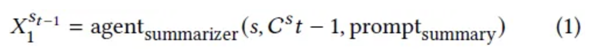

**（2）技术分析模块（LLM Analyst Agent）：**

**从历史价格数据和技术指标图像中提取洞察**。通过视觉能力的语言模型代理分析特定股票𝑠的蜡烛图和技术指标图像。生成的技术分析𝑋₂𝑠𝑡−1基于过去60天的数据，帮助识别模式、趋势和潜在信号。该模块补充了文本分析模块，为交易决策提供全面依据。

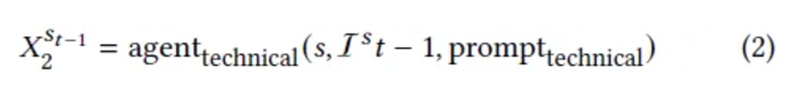

**（3）反思模块（Reflection Agent）：**

分为2个部分，分析过去的交易表现和信号。

a）通过语言模型代理（agent reflection1） ==生成过去L天的交易数据分析==，提供 ==短期和中期的交易表现洞察==。

b）通过视觉代理（agent reflection2） ==分析过去30天的交易信号的可视化数据==，提供信号模式及其有效性的反馈。


**【提示词】：摘要、技术分析、反思**

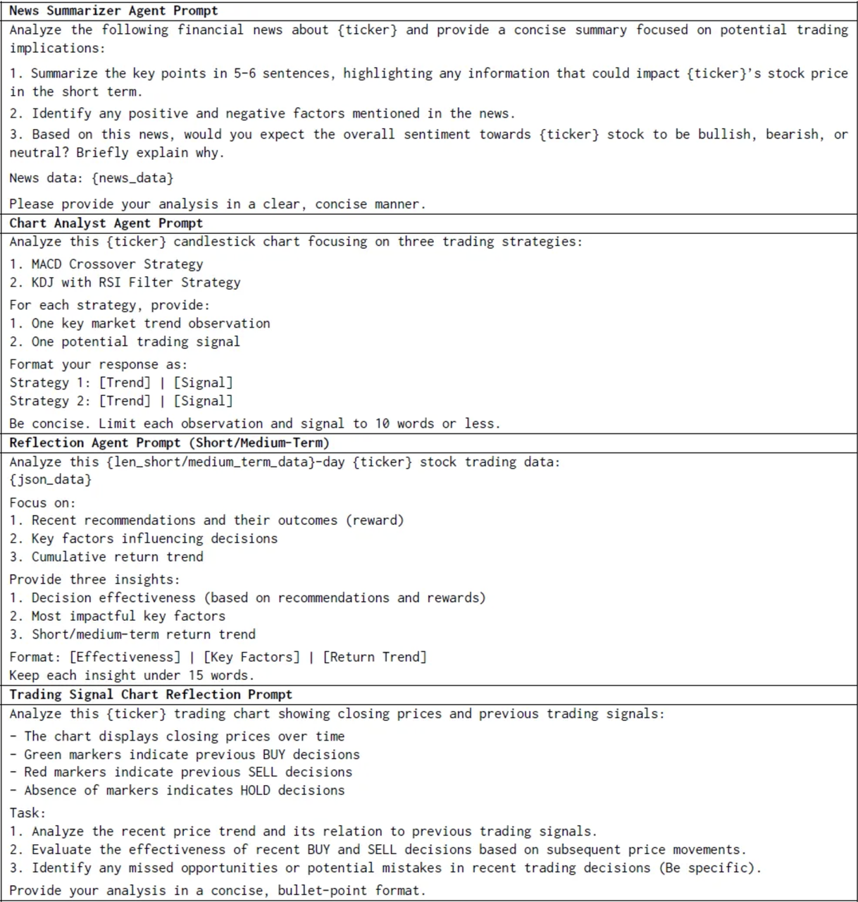

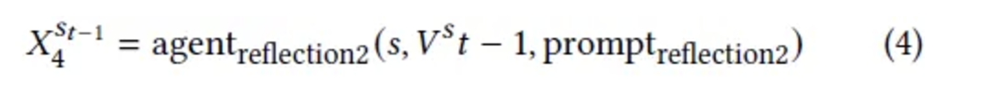

**（4）最终决策模块（Prediction Agent）：**

==通过整合（1）、（2）、（3）（新闻摘要、技术分析和反思结果）生成交易建议==。决策过程公式化为：

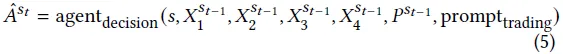

涉及多个变量和模块的输出。 **输出包括推荐行动（买、卖、持有）、仓位大小（1到10）和详细解释**。该方法确保交易决策受益于所有模块的综合分析。

**【提示词】：最终决策**

## 5.6 【案例】Trading Agents投资助手-多智能体协同框架
1、背景：

通过给智能体应用分配明确且定义清晰的角色和具体目标，能够将复杂目标分解为更小、可管理的子任务。而金融交易需要整合多种信号、输入和专业知识。在真实场景中，依赖专家团队协作并做出高风险决策，充分体现了任务的多面性。 **在投资真实场景中，会收集大量数据，包括财务指标、价格变动、交易量、历史表现、经济指标和新闻情绪。这些数据随后由量化专家（quants）进行分析，包括数学家、数据科学家和工程师，使用先进的工具和算法来识别趋势并预测市场走势**。受此启发，Trading Agents在模拟交易公司中定义了七个不同的智能体角色：

**每个智能体有特定的名称、角色、目标和约束条件，以及根据其功能量身定制的上下文、技能和工具：**

• 基本面分析师

• 情绪分析师

• 新闻分析师

• 技术分析师

• 研究员

• 交易员

• 风控经理

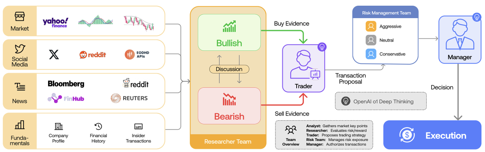

2、交易智能体的整体框架组织：

**所有智能体均采用ReAct提示框架，融合了推理与行动，共享并监控环境状态，从而采取适合上下文的行动，如研究、交易、辩论或风险管理。**

• I. **分析师团队：4名**分析师同时收集市场信息

• II. **研究团队**：团队讨论并评估所收集的数据

• III. **交易员**：根据研究人员的分析，交易员做出交易决策

• IV. **风险管理团队**：风险守护者根据当前市场状况对决策进行评估，以降低风险

• V. **基金经理**：基金经理批准并执行交易

**2.1 分析师团队：**

由专业的智能体组成， **负责收集和分析各类市场数据，以支持交易决策。每个智能体专注于市场分析的不同方面，**共同构建出对市场状况的全面视角。

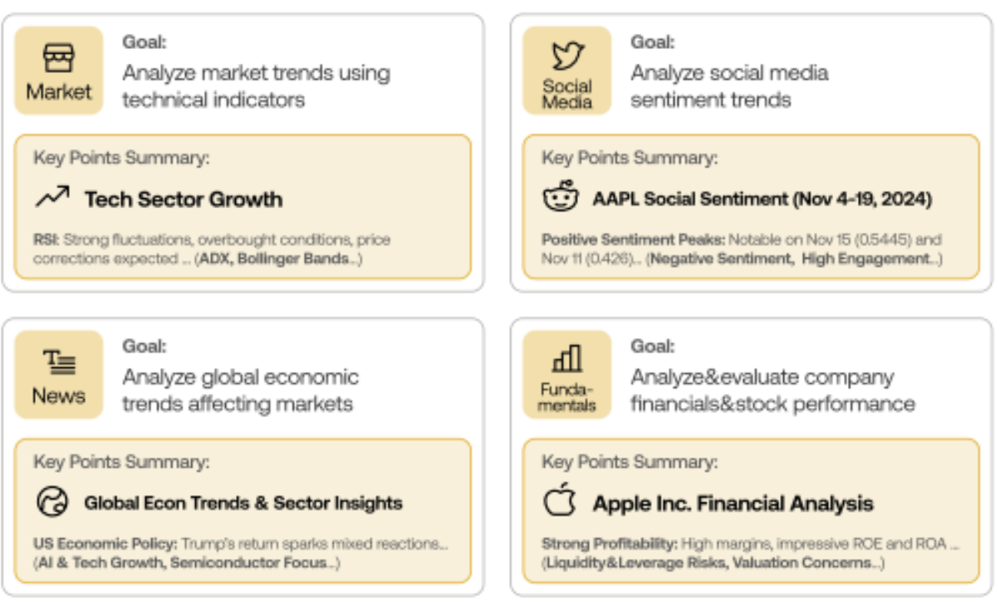

**基本面分析师智能体（market）**：分析财务报表、收益报告、内部交易等数据， **评估公司的基本面**，识别被低估或被高估的股票，揭示其长期投资潜力。

**情绪分析师智能体（social media）**：处理大量社交媒体内容，提取情绪评分和内部人士情绪， **衡量市场情绪，预测短期内投资者行为对股票价格的影响**。

**新闻分析师智能体（news）**：分析新闻、政府公告和宏观经济指标，评估 **市场宏观经济状况、重大事件和公司变化**，识别可能引发市场波动的新闻事件，帮助预测市场动态的突变。

**技术分析师智能体（fundementals）**：计算并选择适合 **特定资产的技术指标**，如MACD和RSI， **分析价格模式和交易量，预测未来价格走势**，协助确定交易时机。

**2.2 研究团队：**

负责对分析师团队提供的信息 **进行批判性评估**。团队由 **持有看涨和看跌观点的智能体组成，通过多轮辩论来权衡投资决策的风险与收益，形成平衡的理解**

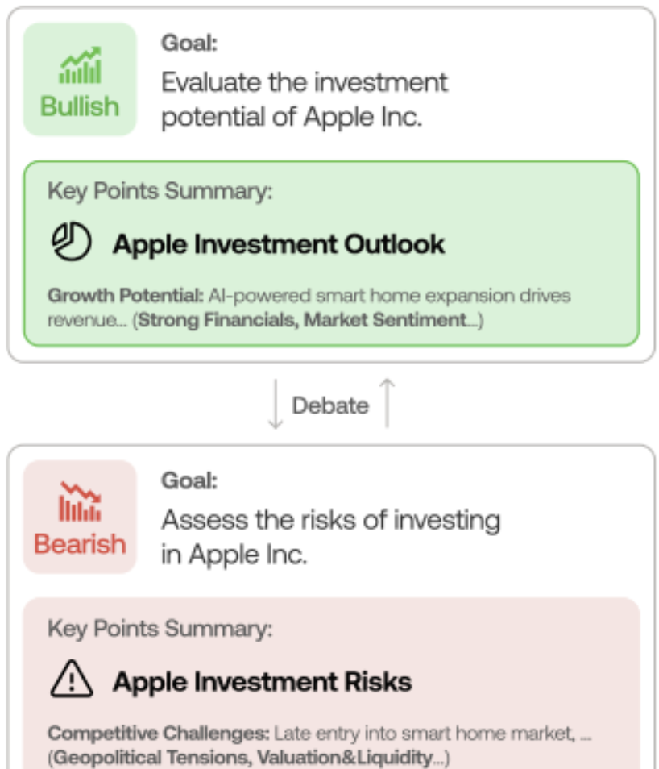

• **看涨研究员**：突出积极的指标、增长潜力和有利的市场环境，倡导投资机会，并支持在某些资产中建立或维持头寸。

• **看跌研究员**：关注潜在的不利因素、风险和不利的市场信号，提供谨慎的见解，质疑投资策略的可行性，并强调可能的负面结果。

**2.3 交易团队：**

基于分析师团队的全面分析和研究团队的深入见解，负责 **执行交易决策**。综合评估定量数据和定性信息，以 **确定最佳交易策略**

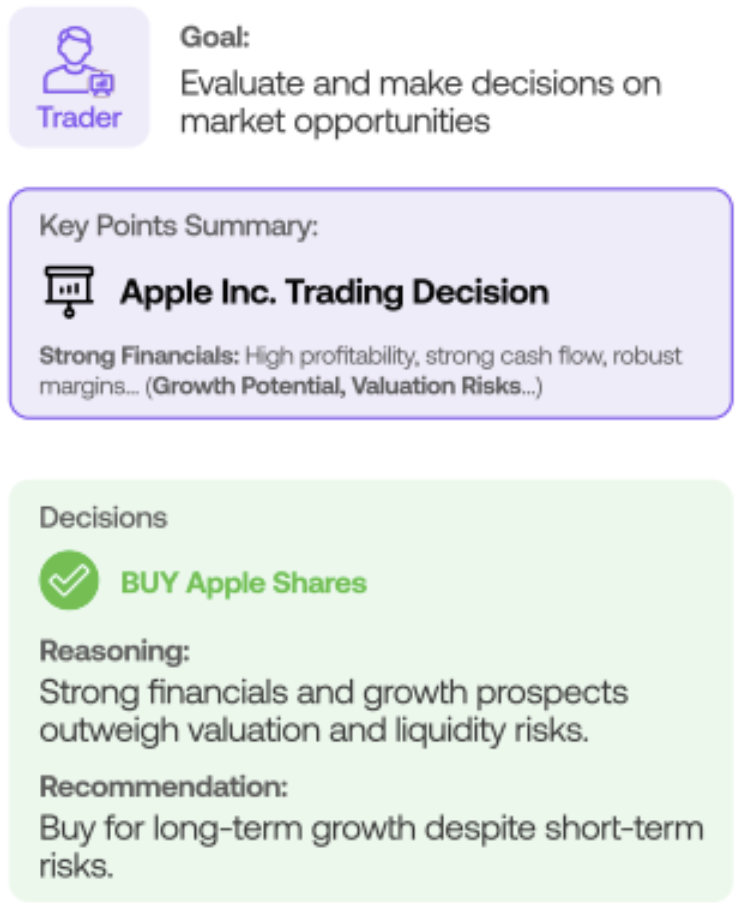

• 评估分析师和研究人员的建议与见解。

• 确定交易时机和规模，以最大化收益。

• 在市场上执行买入或卖出指令。

• 根据市场动态和新信息调整投资组合。

**2.4 风险管理团队：**

负责 **监控和调控公司对各类市场风险的敞口，持续评估投资组合的风险状况**，确保交易活动在预设风险范围内，并符合监管要求

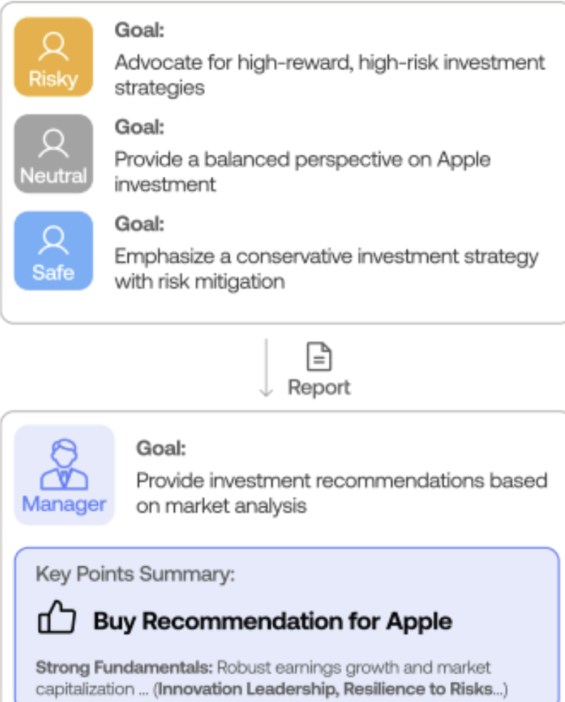

• 评估市场波动、流动性和对手方风险等因素。

• 实施风险缓解策略，如设置止损或分散持仓。

• 向交易代理反馈风险敞口，并建议调整交易策略。

• 确保整体投资组合与公司的风险承受能力和投资目标一致。

## 5.7 【案例】通过多Agent构建深度思考框架的思路
背景：AI 作为双刃剑，在帮助我们的同时也有可能弱化我们的思考能力，尤其是深度思考。如果我们过度依赖AI，而不是将其作为工具来增强思考能力，深度思考的本质价值就会被削弱。可以通过构建一个“六顶思考帽”AI Agent，来辅助和促进我们的深度思考，成为思考的得力助手，而不是思考的替代者。

1、“六顶思考帽”：

由爱德华·德博诺（Edward de Bono）提出的一种创新思维方法， **通过分离不同的思考模式，帮助我们全面、系统地看待问题。**每顶帽子代表一种特定的思维模式，戴上不同的帽子时，我们会集中于特定的思考方向：

**白帽**：代表 **客观、事实导向**的思维。着重收集和分析客观数据，避免主观判断。

**红帽**：代表 **情感、直觉**的思维。允许感性和情绪表达，使决策过程更加人性化。

**黑帽**：代表 **批判性、审慎**的思维。帮助我们发现风险和潜在问题，避免盲目乐观。

**黄帽**：代表 **乐观、积极**的思维。鼓励我们寻找机遇和积极因素，促进正向思考。

**绿帽**：代表 **创造性、发散**思维。帮助我们跳出框架，探索新的解决方案。

**蓝帽**：代表 **组织和控制思维**的流程。管理整个思考过程，确保思考有序进行。

2、构建“六顶思考帽”AI Agent：

1中每顶帽子的思考方向一一对应：

**白帽：**收集 项目的市场数据、成本数据、收益预测等客观信息 。

**红帽：**分析自己对这个项目的 感觉，是否有直觉上的偏好或担忧 。

**黑帽：**分析项目 可能存在的风险 ，如市场风险、技术风险、资金风险等。

**黄帽：**分析 项目可能带来的机会 ，如潜在的市场增长、利润空间、品牌价值等。

**绿帽：**思考 如何改进项目 ，使其更具竞争力，或者是否有其他的创新想法。

**蓝帽：**规划整个决策流程，总结各方面的分析结果，并做出最终的决策 。

3、构建思路：

（1） **明确 Agent 的目标：**

a）辅助投资决策， **通过多角度分析新项目，提供全面且结构化的评估**，最终支持用户做出更明智的投资选择。

b）Agent 不是直接给出“投资”或“不投资”的决定，而是 **提供充分的分析，将决策权交给用户**。

（2） **定义每个思考帽的** **AI** **组件 (Node)**

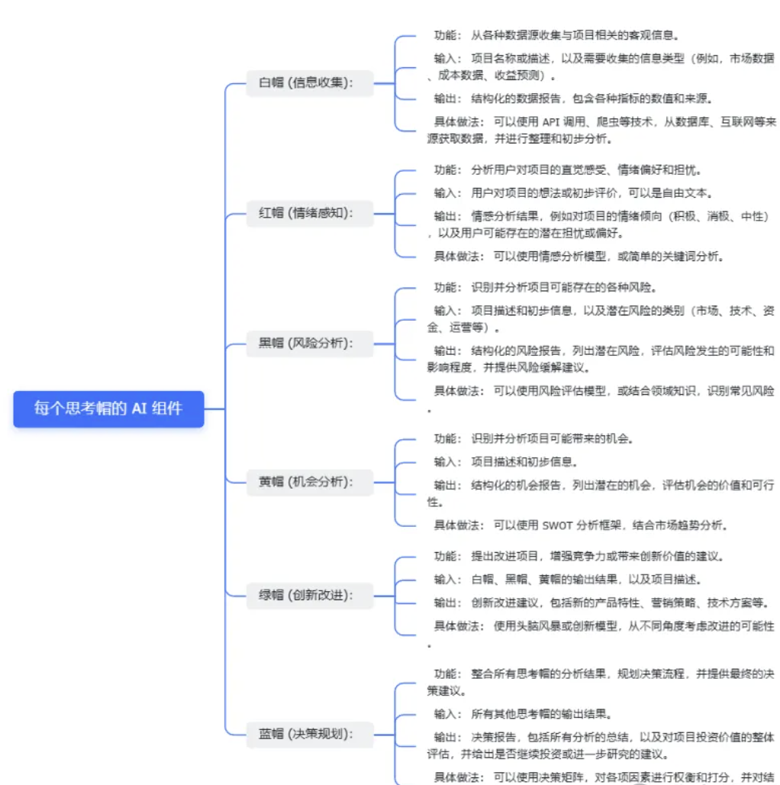

（3） **构建流程关系 (workflow)：**

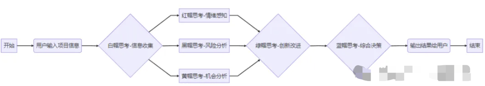

* **开始节点：**可以是一个初始提示节点，要求 **用户输入项目信**息。

* **白帽节点：**获取初始信息后， **首先进入白帽节点**，收集客观数据。

* **分支节点：**白帽输出后，可以 **同时进入红帽、黑帽和黄帽节点，并行进行分析**。

* **绿帽节点：** **当红帽、黑帽、黄帽的分析完成后，进入绿帽节点**，进行创新改进思考。

* **蓝帽节点：** **最后所有思考帽的输出结果都传入蓝帽节点，进行综合分析和决策建议**。

* **退出节点：** **将蓝帽的输出结果呈现给用户**，完成整个流程。

在特定节点增加循环结构：允许 Agent 基于蓝帽的输出结果进行迭代分析，例如当蓝帽提出需要补充数据时，可以再次触发白帽节点。

可以增加用户反馈环节，在输出结果给用户的节点后，可以再增加节点：用户针对 Agent 的分析结果提出意见，使 Agent 能够学习和改进。

## 5.8 【案例】基于 Multi-Agent 协同框架构建智能研报编写系统（ChatReport）
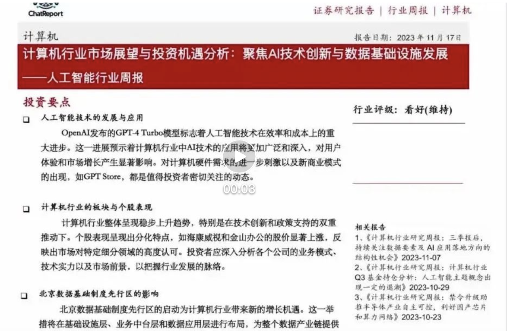

1、业务背景：

传统的研报编写过程面临着诸多挑战：市场变化迅速，人工编写的研报难以及时跟进最新的市场动态；选择合适的分析方法来解读数据并得出结论是一项极具挑战的任务，这需要编写者具备深厚的专业知识和丰富的经验；研报编写涉及大量数据收集和事实验证工作，不仅耗时且容易出错。

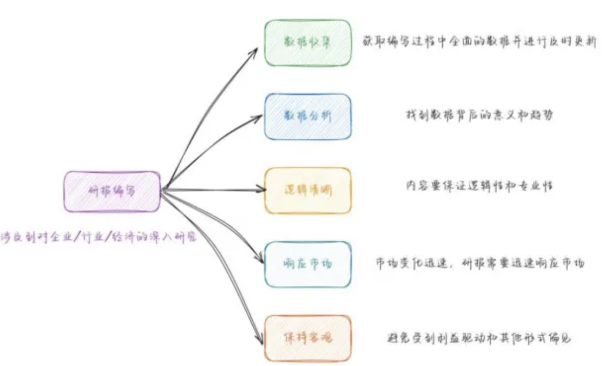

2、解决方案：

构建一个基于“Internet of Agents”框架的多智能体系统实现更高效和智能化的研报编写。设计了模拟六种金融公司角色的大型模型，包括 **首席执行官、研究员、助理研究员、实习生、审核师和归纳师**。每个角色在研报编写过程中扮演不同的功能和任务，使用不同的工具，并从多个维度相互配合，从而提高研报的质量和效率：

**（1）Internet of Agents 架构**

包括4个层级：代理层、流（Flow）层、平台层和应用层。

a）代理（Agents）层：由功能各异的代理组成，大模型是“大脑”，控制整体行为。每个代理都配备了键值（k-v）数据存储结构、不同的工具以及一定的规划能力

b）流（Flow）层：重视代理间的通信机制，实现数据流和控制流的分离：数据流采用JSON格式进行数据传输，每个代理可以根据角色、阶段和主题订阅所需数据；控制流则采用了类似传感网络中的Sleep/Active 机制，通过动态调整代理的活跃状态来优化资源利用率和响应速度，并引入中断机制来对其它Agents进行请求，保证整个编写流程处于敏捷开发的状态

c）平台（Platform）层：引入状态管理器和知识管理器。状态管理器负责控制预定义的整体阶段流程，而知识管理器则基于角色基础访问控制（RBAC）机制，为不同层级的代理提供适当的知识访问权限

d）应用（Application）层：将这一框架应用于不同的任务，如研究报告生成、代码生成、法律文书撰写和NPC 对话等领域

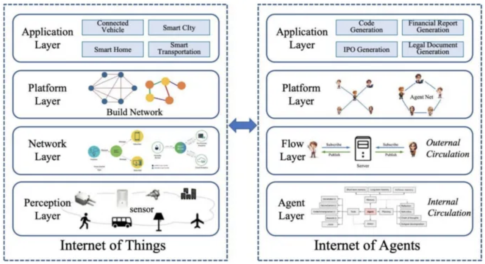

（2） **ChatReport 产品架构**

基于Internet of Agents框架之上搭建金融领域应用系统，能够结合金融行业的因果知识，融合实时行业、企业的新闻公告及财务数据，结合真实研报编写场景下的多种职业角色，通过大语言模型的多种能力，赋能自动化研报编写系统，

**A.****==6个Agent类别：==**

a）首席分析师：

拥有各行各业的领域知识，负责 **研报的整体思路规划，对研报整体内容进行把控**

b）研究员：

熟悉研报编写的完整流程， **对研报的主要内容进行编写**

c）助理研究员：

获取数据后，进行 **数据分析并用图表进行展示**

d）实习生：

熟悉如何 **利用各个渠道查找需要的数据**

e）审查师：

配合首席进行 **研报审查，主要负责语法或计算漏洞**

f）归纳师：

**研报最终的归纳总结，并形成摘要**，方便速读


**B. 业务流程：包括****==4个关键阶段：==****设计、编写、审查和归纳，每个阶段都有其独特的重要性和执行者**

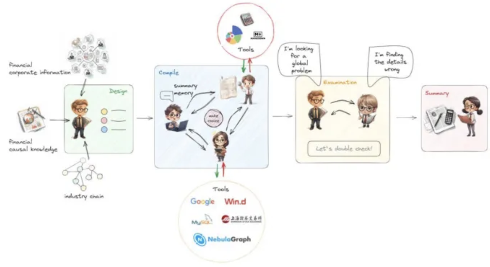

a） **设计阶段：实习生+首席分析师**

> 从用户的需求出发：用户提供的行业领域和研报类型是启动整个流程的关键。 ==实习生迅速搜集行业新闻和相关公司的最新公告，确保研报内容的时效性和相关性。首席分析师利用深厚的领域知识，包括对金融公司、行业信息、因果关系及产业链的了解，基于标准化模板制定出详细的研报大纲==。
>

b） **编写阶段：实习生+研究员+助理研究员**

团队的协作模式变得更重要。

> ==研究员主导研报的撰写工作，利用行业的深刻理解和分析能力构建研报的核心内容==。 ==实习生利用信息搜集和数据处理的能力，运用各种工具如万得量价数据、证券交易所公告查询系统，以及图数据库查询能力，为研报提供最新的数据支持。助理研究员专注于图表的制作，使用各种高效的工具，如计算器和MarkDown表格生成器，以图形化方式呈现复杂数据==，使研报更加直观易懂。
>

c） **审查阶段：首席分析师+审查师**

> ==首席分析师负责整体逻辑和结构的把关==，确保研报的准确性和逻辑性。 ==审查师专注研报细节，语法和计算错误==，确保研报的专业性和无误。
>

d） **归纳阶段：归纳师**

> 全面 ==审视研报，提炼出关键信息和主要观点，确保研报的核心内容突出==且易于理解
>

[p.mp4](https://internal-api-drive-stream.feishu.cn/space/api/box/stream/download/preview/Ny3DbIYOtoczY0xm2drc85eInRb?mount_point=docx_file&preview_type=16)

## 5.9 【案例】Manus工作原理：AI Agent的多智能体架构
Manus 作为一款通用 AI 智能体，搭建了思维与行动之间的桥梁：它不仅思考，更能交付结果，也是Multi-Agent 系统的体现。作为一个"通用型AI代理"，Manus能够自主执行任务，从简单的查询到复杂的项目，无需用户持续干预。用户只需输入简单的提示，无需AI知识或经验，即可获得高质量的输出。

**1、核心架构解析**

核心由3大模块构成： **==Multi-Agent系统的特点：环境隔离的任务执行；模块化的Agent设计；灵活的任务调度机制==**

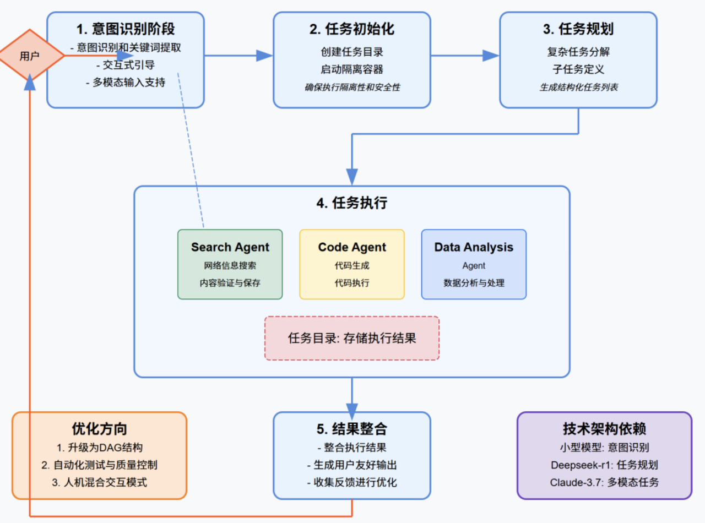

（1） **规划模块（Planning）**

规划模块作为"大脑"（系统的决策中枢）负责“理解用户意图”，“将复杂任务分解为可执行的步骤”，并“制定执行计划”。这一模块使Manus能够处理抽象的任务描述，并将其转化为具体的行动步骤。

任务理解与分析

任务分解与优先级排序

执行计划制定

资源分配与工具选择

语义理解与意图识别（NLU）

复杂任务分解为DAG结构

异常处理与流程优化

（2） **记忆模块（Memory）**

使Manus能够存储和利用历史信息，提高任务执行的连贯性和个性化程度。该模块管理 **3类关键信息，构建长期记忆体系：**

**用户偏好**：记录用户的习惯和喜好，使后续交互更加个性化

**历史交互**：保存过去的对话和任务执行记录，提供上下文连贯性

**中间结果**：存储任务执行过程中的临时数据，支持复杂任务的分步执行

```Python
class MemorySystem:
    def __init__(self):
        self.user_profile = UserVector()  # 用户偏好向量
        self.history_db = ChromaDB()      # 交互历史数据库
        self.cache = LRUCache()           # 短期记忆缓存
```

（3） **工具使用模块（Tool Use）**

负责实际执行各种操作。该模块能够调用和使用多种工具来完成任务，包括：

网络搜索与信息检索

数据分析与处理

代码编写与执行

文档生成

数据可视化

**2、运转逻辑与工作流程：**

| 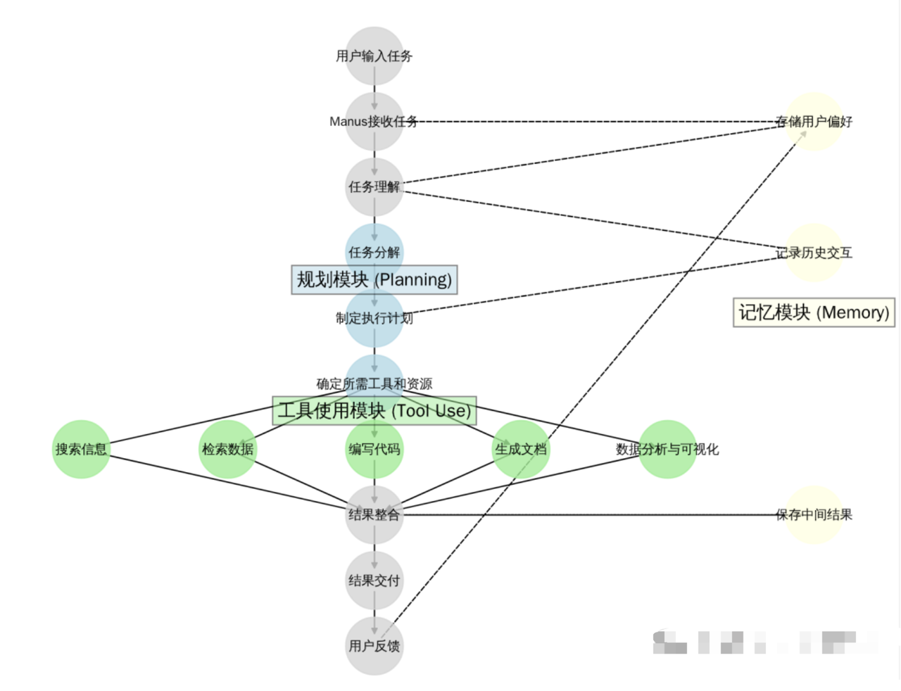 | 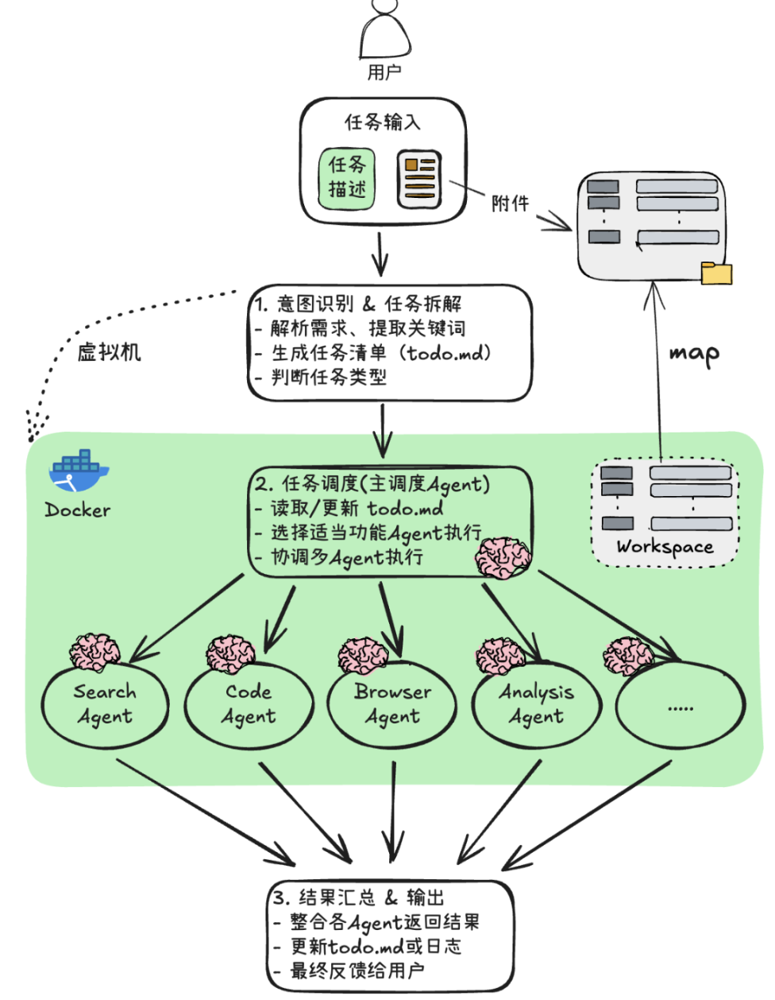 |
| --- | --- |

2. 1 完整执行流程：

a） **任务接收**：用户提交任务请求，可以是简单的查询，也可以是复杂的项目需求。Manus接收这一输入开始处理

b） **任务理解**：Manus分析用户输入，理解任务的本质和目标。在这一阶段，记忆模块提供用户偏好和历史交互信息，帮助更准确地理解用户意图。

==运用先进的自然语言处理技术对用户==**==输入进行意图识别和关键词提取==**

**==在需求不明确时，通过对话式引导帮助用户明晰目标==**

==支持==**==文本、图片、文档等多模态输入==**==，提升交互体验==

c） **任务分解**：规划模块将复杂任务自动分解为多个可执行的子任务，建立任务依赖关系和执行顺序。

```Python
// todo.md
- [ ] 调研日本热门旅游城市
- [ ] 收集交通信息
- [ ] 制定行程安排
- [ ] 预算规划
```

d） **任务初始化与环境准备**：为确保任务执行的隔离性和安全性，系统创建独立的执行环境：

```Python
# 创建任务目录结构
mkdir -p {task_id}/
docker run -d --name task_{task_id} task_image
```

e） **执行计划制定**：为每个子任务制定执行计划，包括所需的工具和资源。历史交互记录在这一阶段提供参考，帮助优化执行计划。

f） **自主执行**：工具使用模块在虚拟环境中自主执行各个子任务，包括搜索信息、检索数据、编写代码、生成文档和数据分析与可视化等。执行过程中的中间结果被记忆模块保存，用于后续步骤。每个 Agent 的执行结果都会保存到任务目录，确保可追溯性

```Python
class SearchAgent:
    def execute(self, task):
        # 调用搜索 API
        results = search_api.query(task.keywords)

        # 模拟浏览器行为
        browser = HeadlessBrowser()
        for result in results:
            content = browser.visit(result.url)
            if self.validate_content(content):
                self.save_result(content)
```

**Search Agent**: 负责网络信息搜索，获取最新、最相关的数据，采用 **混合搜索策略（关键词+语义）**

**Code Agent**: 处理代码生成和执行，实现自动化操作，支持Python/JS/SQL等语言

**Data Analysis Agent**: 进行数据分析，提取有价值的洞见，Pandas/Matplotlib集成

g） **动态质量检测**：

```Python
def quality_check(result):
    if result.confidence < 0.7:
        trigger_self_correction()
    return generate_validation_report()
```

h） **结果整合**：将各个子任务的结果整合为最终输出，确保内容的连贯性和完整性。

智能整合所有 Agent 的执行结果，消除冗余和矛盾

生成用户友好的多模态输出，确保内容的可理解性和实用性

i） **结果交付**：向用户提供完整的任务结果，可能是报告、分析、代码、图表或其他形式的输出。

j） **用户反馈与学习**：用户对结果提供反馈，这些反馈被记忆模块记录，用于改进未来的任务执行。强化模型微调，不断提升系统性能。

**2.2 技术架构依赖**

轻量级模型：负责意图识别，提供快速响应

Deepseek-r1：专注于任务规划，把控全局策略

Claude-3.7-sonnet：处理复杂的多模态任务，提供深度理解能力

**3、与传统AI助手的差异对比**

```Markdown
+ 端到端任务交付：不仅提供建议，还能直接执行任务并交付结果
+ 任务分解能力：能够将复杂任务分解为可管理的步骤
+ 工具使用能力：能够调用和使用各种工具完成任务
+ 动态环境适应能力：能够根据任务需求调整执行策略
+ 长期记忆保持：能够记住用户偏好和历史交互，提供个性化体验
+ 结果导向：注重交付完整的任务结果，而非仅提供信息
- 单次交互模式：传统AI主要停留在"对话"层面
- 静态响应机制：缺乏自主执行能力
- 无状态设计：每次对话独立，缺乏连续性
```

## 5.10 阿里RAG落地案例【小二Copilot】最佳实践
1、整体架构

知识库的构建直接决定知识检索与生成的质量边界。 **将解析后的数据构建成一个多层异构图，捕捉不同信息粒度和抽象水平之间的关系，支持下游任务的语义理解和推理检索**

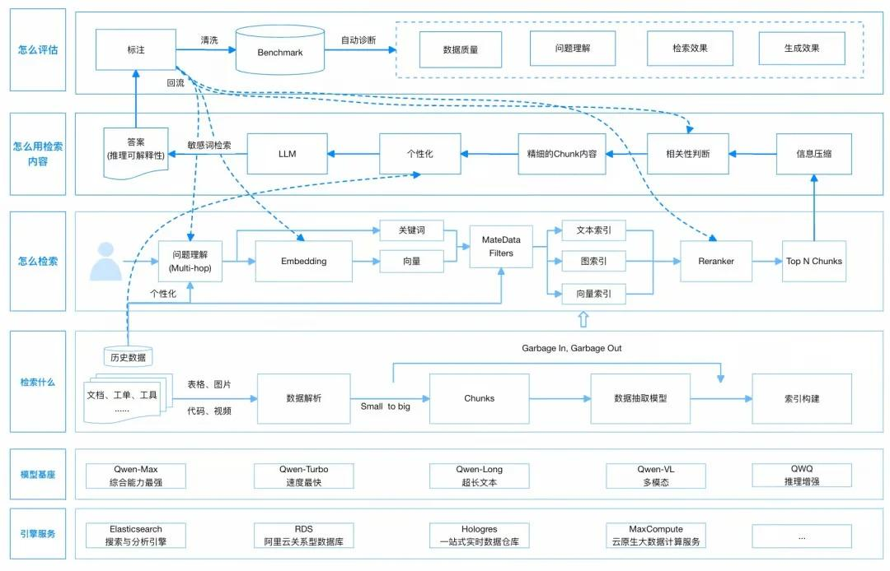

2、RAG数据增强：抽象不同数据的特征，挖掘它们之间的关系

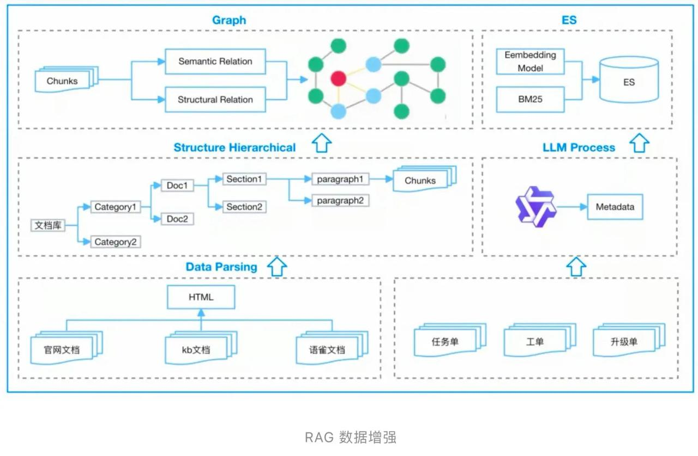

3、多层次知识库构建：核心流程可以概述为： **Node（文档tree、工具、chunk等）->问题（原子粒度）->社区（问题聚类，该类的解决方案流程等）->主题（产品）->类目（产品线）**

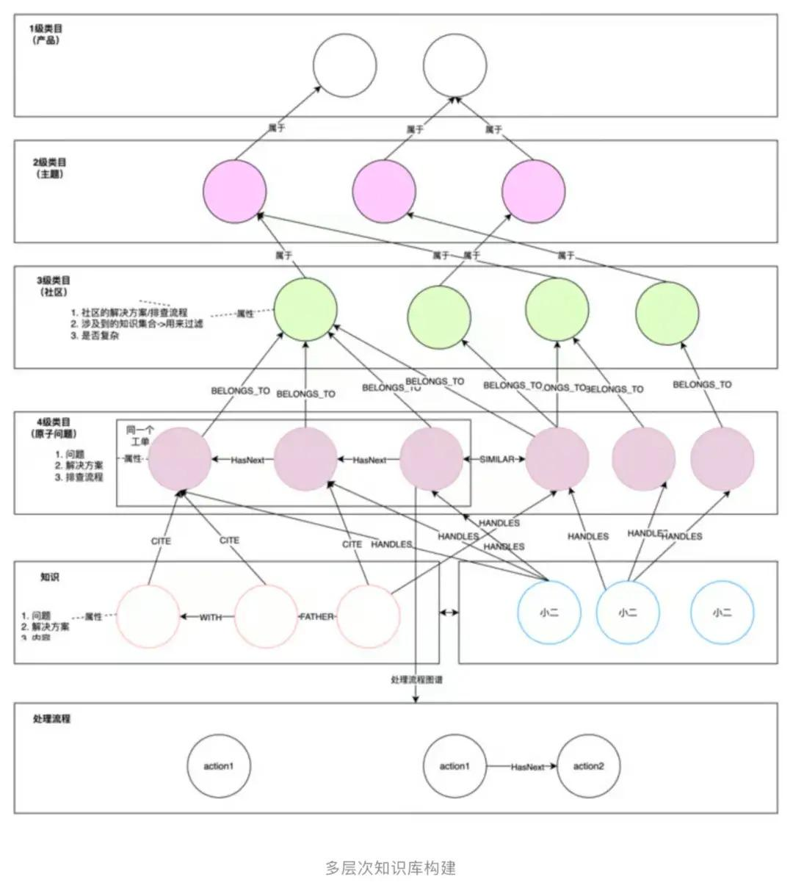

4、检索策略：增加文本异构检索能力和 **构建”混合语义+向量+图谱“三位一体的混合检索架构**，实现不同源数据的协同召回；并且引入迭代式检索，提升复杂场景下的准确性。

| 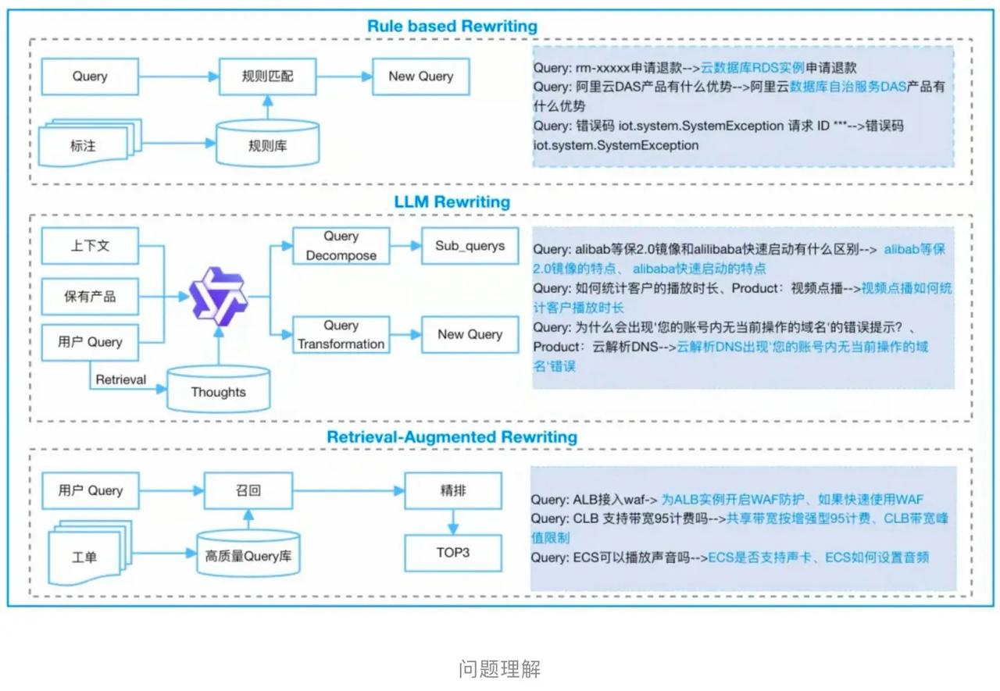 | 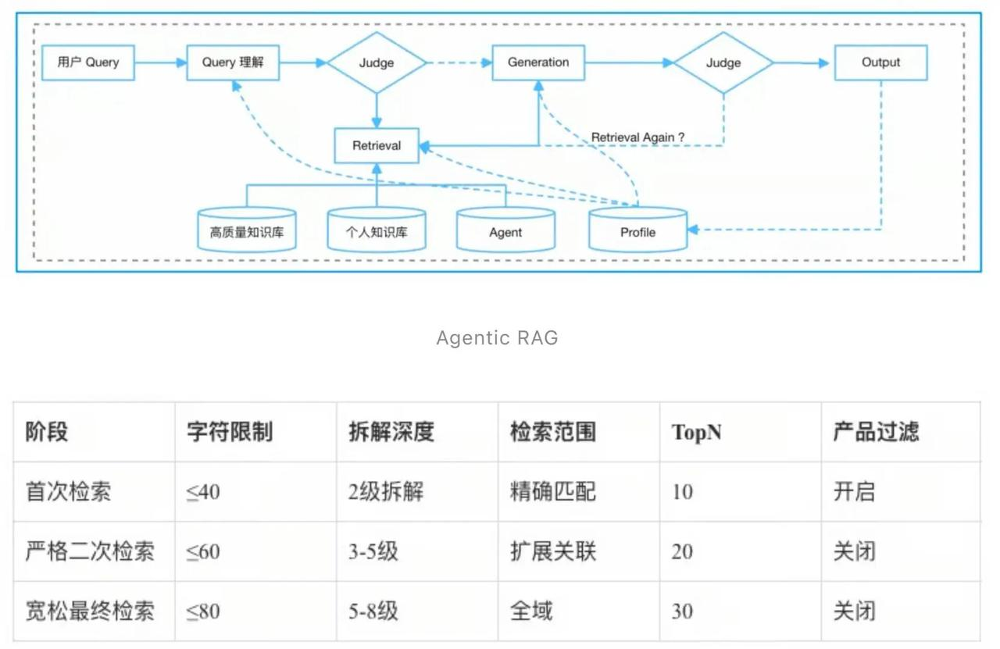 |
| --- | --- |

| 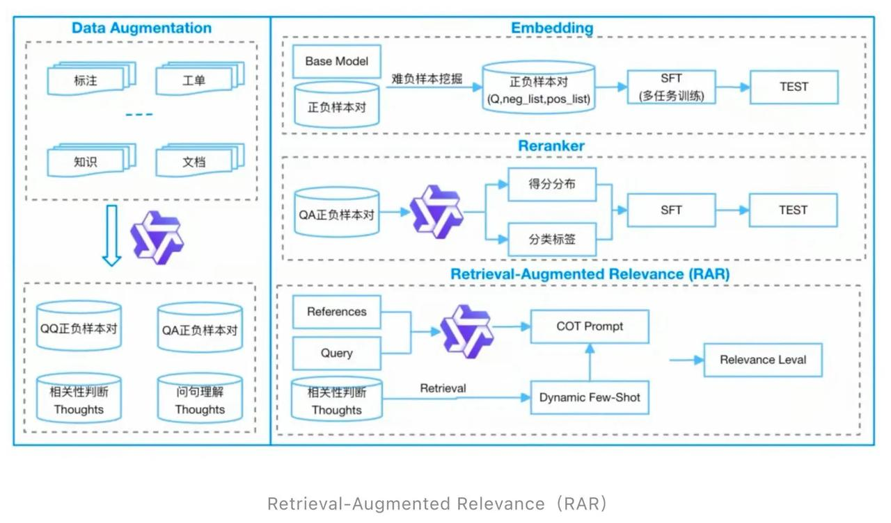 | 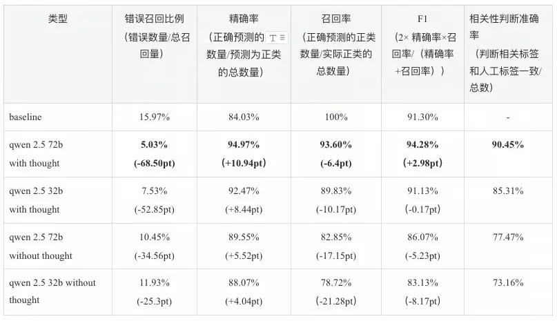 |
| --- | --- |

5、生成控制优化主要包含2个核心方面：（1） **过滤掉无法解决问题的参考信息**，（2） **进一步完善参考信息的质量和实用性**。

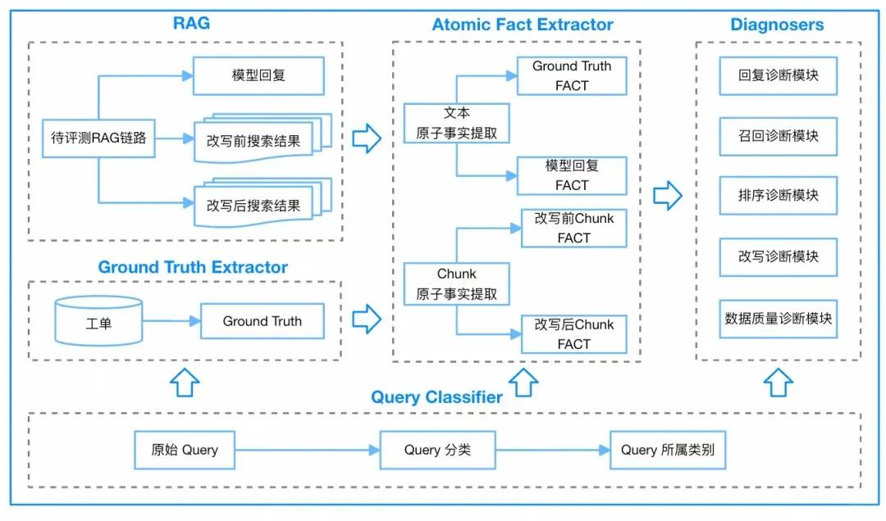

## 5.11 【案例】百度TURA：让搜索引擎“动”起来的下一代AI Agent架构
https://arxiv.org/pdf/2508.04604

1、业务背景

痛点：现有检索增强生成(RAG)只能读取已索引的静态网页，无法回答“下周从北京到上海的最低票价是多少”这类需要实时数据的问题。用户希望一次对话就能完成查票、订酒店、看天气、规划路线等多件事

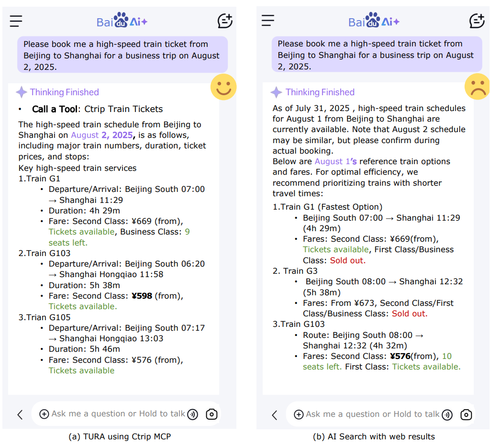

2、架构：

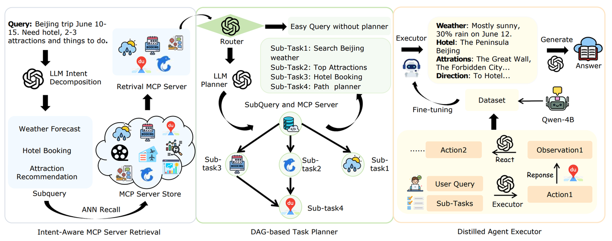

| 阶段 | 关键模块 | 一句话总结 |
| --- | --- | --- |
| Intent-Aware MCP Server | 检索 Retrieval | 把用户一句话拆成多个“小意图”，再从上千个工具里秒选最相关的几个 |
| 规划 | DAG-based Task Planner | 把小意图画成有向无环图（DAG），让能并行的步骤一起跑，省时间 |
| 执行 | Distilled Agent Executor | 用“小模型”蒸馏“大模型”的推理能力，既快又准地调用工具拿结果 |

（1）意图感知检索：在 1 秒内锁定 5 个最相关工具

工具选择场景中，用户的自然语言请求往往复杂且包含多个子任务。如果检索系统不能准确理解意图并找到对应的工具，将直接影响最终响应质量。为了提升效率和准确性，TURA（Tool Use Retrieval Augmentation）在检索流程中引入了 **3项关键能力**：

```Python
1. 查询分解（Query Decomposition）
目的：将用户的长句、多意图需求，拆解成多个可直接检索的子任务。示例：用户输入 “去北京玩 5 天” → LLM 自动拆解为：
「查北京天气」
「找 5 个景点」
「订酒店」
「规划路线」
价值：通过分解，检索引擎可以针对每个子任务独立匹配工具，大幅降低单次检索的语义复杂度


2. 语义增强索引（Index Augmentation）
目的：让系统能够理解并覆盖不同表达方式，弥合“用户口语 vs 工具文档/API描述”的差距。方法：为每个工具预先生成 20 条不同的“可能问法”（paraphrase），扩充索引内容。
效果：即便用户使用了完全不同的说法（如“规划行程” vs “路线推荐”），也能被准确召回。

3. 向量召回（Vector Retrieval with ERNIE MaxSim）
实现：使用 ERNIE 模型进行多向量匹配（MaxSim 策略），从工具库中找到最相关的候选工具。结果：在 Recall@5（前5个召回结果覆盖率）上达到了 0.8289，显著优于单纯的密集检索。
```

（2）任务规划：

复杂查询不再是线性流水，而是 **并行图：**订酒店和查天气互不依赖，可以同时跑；路线规划需等前两者完成后才启动，节省 44% 延迟

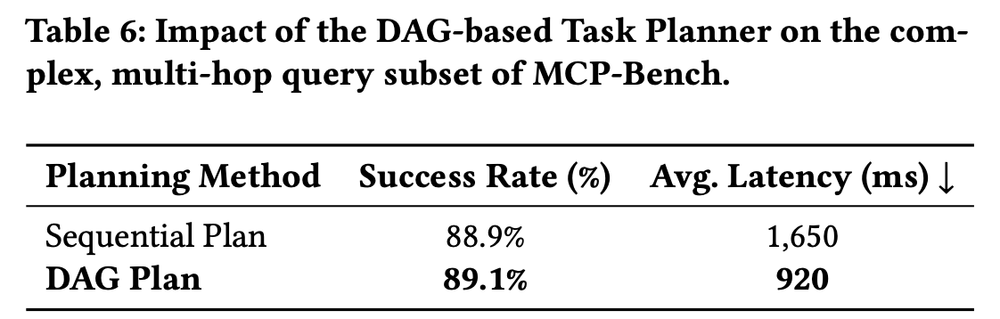

（3）蒸馏执行器：小模型也能打大模型

老师：DeepSeek-V3（671B）；学生：Qwen3-4B 蒸馏版

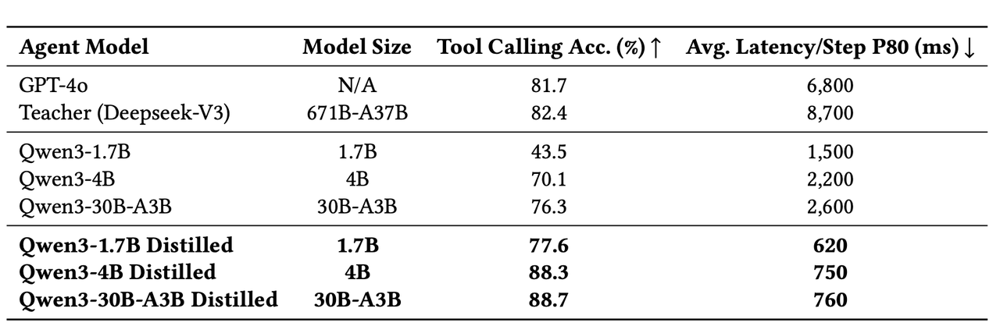

## 5.12 使用 Dify 工作流搭建智能体，前端接入智能体并实现前后端交互的核心逻辑（面试被问）
1、整体思路： **3层架构：前端负责展示和用户输入，后端负责中转和安全，Dify 负责智能处理**

```Python
前端：比如一个聊天界面，负责收集用户输入、展示回复、控制会话
后端：负责把请求安全地转发给 Dify，同时加上鉴权、埋点、限流等逻辑
Dify：负责真正的问答逻辑，如调用模型、检索知识、执行工作流等
```

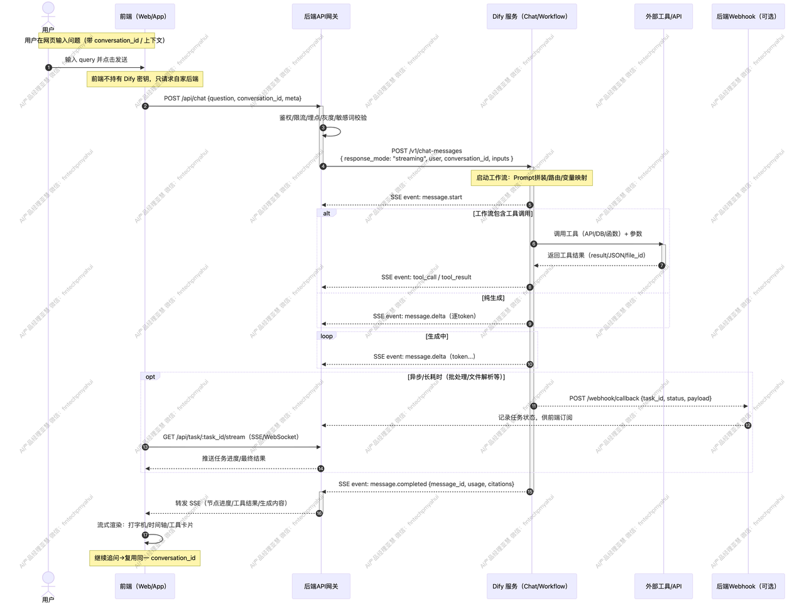

2、核心交互流程：

```Python
（1）用户提问：用户在前端输入问题，比如“我想了解一下 ChatBI 课程的功能”，点击发送。
             前端会把问题、用户ID、会话ID 这些信息打包发到自建后端接口，比如 /api/ask

（2）后端中转（不能让前端直接调用Dify官方接口）：
            后端收到请求后：校验用户身份；检查速率（比如防止有人刷接口）；记录日志、埋点数据；用自己的服务端密钥，调用 Dify 的官方接口，转发请求

（3）Dify 处理逻辑：Dify 收到请求后，会启动已配置的智能体
           最后把模型生成的回答，流式返回给后端

（4）后端再转发给前端：后端会用 SSE 流（Server-Sent Events）实时把 Dify 的响应流转发给前端，
           用户看到流式的实时回复

（5）前端实时渲染：前端监听流事件，每收到一个 token 就更新 UI，形成流式体验
           如果有工具节点、检索结果或引用来源，也会同步展示在界面上
```

## 5.13 【学员大厂案例】搜索 Query 商业潜力挖掘 Agent
1、背景：

搜索平台：当用户在搜索一些意图比较泛的查询的时候（如“考研难不难”）时，由于ecpm（每千次展示成本）低于平台的最低阈值，不会有任何广告展现。ecpm=bid *预估ctr *预估cvr。预估ctr和预估cvr都是算法预测的，而bid可以由广告主调整或者自动出价系统调整，但由于转化可能性比较低，所以广告主或者系统不会设置高的bid，导致许多查询没有广告

```Python
面向搜索广告行业的长尾流量变现场景。传统搜索引擎在处理大量泛信息类查询（如教育、培训等非强交易型词）时，面临2大痛点：
 1）依赖历史 CTR/CVR 预估，难以识别冷查询的真实商业价值，导致大量可变现流量未被激活；
 2）模型无法理解自然语言中的隐性意图，无法判断用户是否具有课程咨询、服务购买等潜在需求；
 3）查询意图难以自动映射到广告系统可用的业务标签，导致后续广告位无法触发，无法形成完整的用户需求画像
```

2、产品定位：

```Python
解决上述问题，构建“搜索 Query 商业潜力挖掘 Agent”，结合 BERT 小模型 + LLM 意图理解 + 意图标签知识库，实现冷查询商业价值判定、广告意图映射与提示词自动生成，将原本无广告的冷查询转化为后续可匹配投放的广告位，从而提升长尾流量变现效率与广告主 ROI
```

3、业务流程：

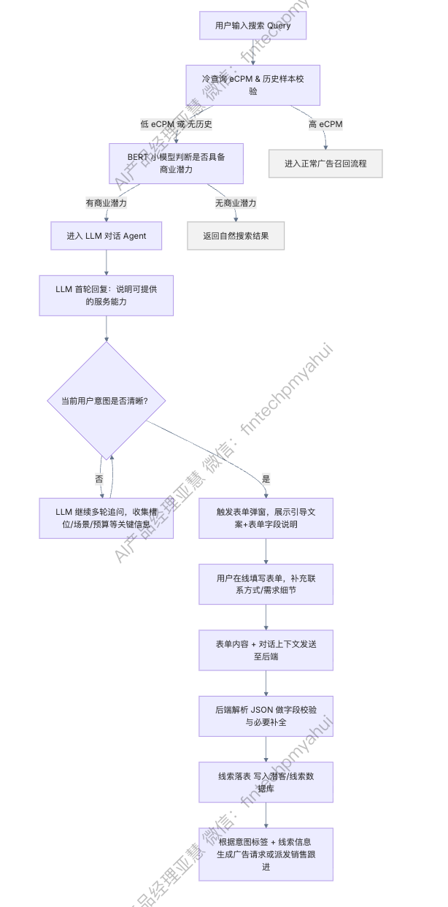

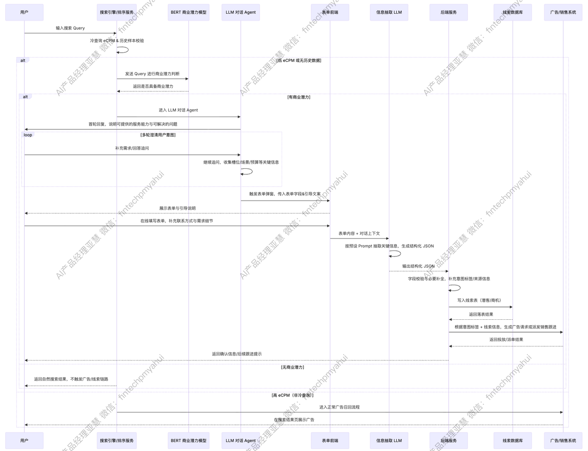

## 5.14 【学员辅导案例】简历检索/简历筛选
**1、业务背景**
 招聘方在人才库中检索候选人，典型任务包括：（1）按岗位 JD 找候选人（技能、经验、行业、项目）；（2）从海量简历中快速筛选满足硬条件的人（城市、年限、学历、薪资等）；（3）复杂需求 query（多关键词、多条件、同义表达），但是传统搜索方式召回不足或排序不准

```Python
典型场景
强筛选 + 文本搜索：北京、3-5 年、本科、Java、微服务
语义表达：做过“推荐系统效果优化/召回排序/CTR 预估”的人
多意图复杂 query：支付风控+反欺诈+实时特征工程
```

**2、痛点**

（1）仅用 SQL/字段匹配做“搜索本体”，导致复杂 query 召回低

（2）语义检索（Embedding）单用会出现不确定性，且缺乏硬约束能力

（3）缺少可解释性与反馈闭环，无法快速定位 badcase 与优化

**3、建议方案：**

```Python
1、SQL 做强约束过滤（学历、年限、城市等结构化字段）——SQL不承担模糊检索，只负责缩小范围

2、搜索引擎负责“召回与排序”。需要采用混合检索架构
-BM25 处理关键字相关性强的部分
-Embedding 做语义召回（同义词、含义相近但不同表达）
-Rerank 做最终排序
```

**4、业务流程：**

```Python
数据结构
Resume 表（结构化字段）：candidate_id、city、work_years、degree……

ResumeText 表（文本域）：summary、skills_text、projects_text、experience_text……
——用来做粗召回，一人一行，每个 candidate_id 对应一条记录，文本是拼接后的整体简历内容

Chunk 表：按项目/经历切分，每条 chunk 关联 candidate_id
——一段经历/一个项目/一个技能点=一条 chunk，一个candidate_id 会对应多条chunk，用于embedding

索引
倒排索引（BM25）：基于 ResumeText / ChunkText
向量索引（ANN）：基于 Chunk embedding
候选人列表：由结构化过滤条件（城市、年限、学历等）筛选后得到的candidate_id 集合，用于限定后续BM25/向量召回/精排的搜索空间
```

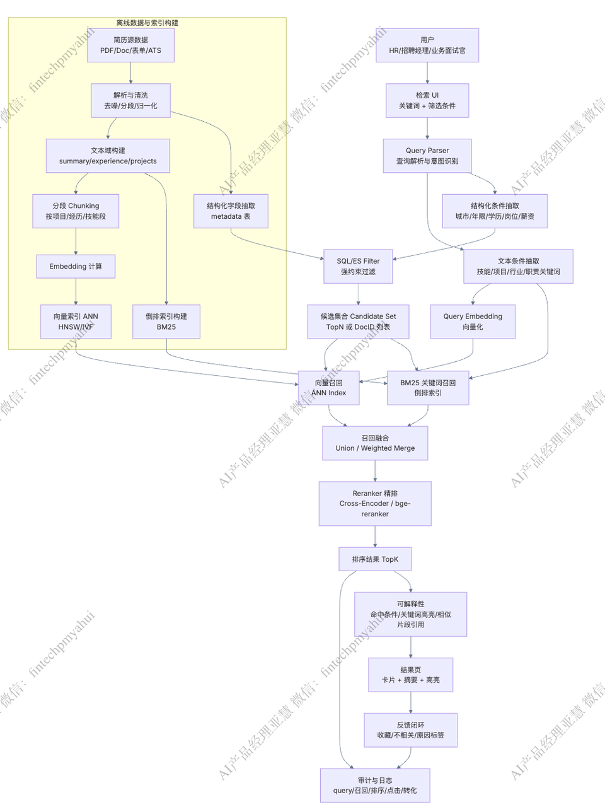

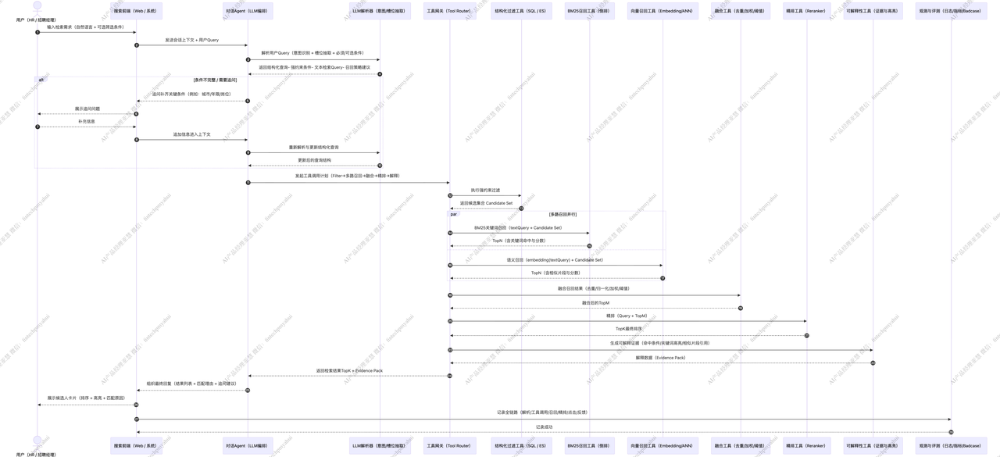
