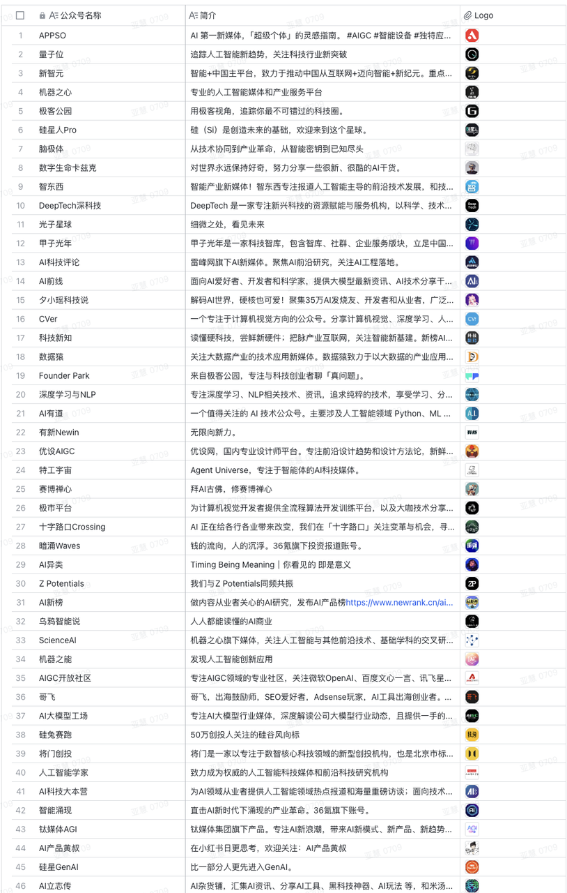

# 15、其他产品经理通用

## 15.1 我关注的微信公众号（40+和AI相关）


## 15.2 如何将技术特性转化为业务价值？
1、通常出现的3类误区：

（1） **直接展示技术指标：**

> ``
>

1. ``  ``  ``
2. ``  ``  ``
3. ``  ``  ``

> ``
>

1. ``  ``  ``  ``  ``  ``

> ``
>

1. ``  ``  ``
2. ``  ``  ``
3. ``  ``  ``

（2） **过度简化因果关系：**

> ``
>

1. ``  ``
2. ``  ``
3. ``  ``

> ``
>

1. ``  ``  ``  ``  ``  ``

> ``
>

1. ``  ``
2. ``  ``
3. ``  ``

（3） **数据缺乏支撑**

> ``
>

1. ``  ``
2. ``  ``
3. ``  ``

> ``
>

1. ``  ``  ``  ``  ``  ``

> ``
>

1. ``  ``
2. ``  ``
3. ``  ``

2、正确做法：

**（1）建立完整的因果链**

> ``
>

> ``
>

> **``**  **：**
>

> ``  ``  ``  ``  ``
>

> ``
>

> ``  ``  ``
>

> ``
>

> ``
>

> ``
>

> ``
>

1. ``
2. ``
3. ``

> ``
>

> ``
>

**（2）多维度价值分析框架：收入增长维度、成本优化维度、风险管理维度**

**A. 收入增长维度：**

> ``
>

> ``
>

> ``
>

> ``  ``  ``  ``  ``  ``  ``
>

> ``
>

> ``  ``  ``  ``  ``
>

> ``
>

> ``
>

> ``
>

> ``  ``  ``  ``  ``  ``  ``  ``  ``
>

> ``
>

> ``  ``  ``  ``  ``
>

> ``
>

> ``  ``  ``  ``  ``
>

> ``
>

**B. 成本优化维度：**

> ``
>

> ``
>

> ``
>

> ``
>

> ``
>

> ``
>

> ``  ``  ``  ``  ``
>

> ``
>

> ``
>

> ``
>

> ``
>

> ``  ``  ``
>

> ``  ``  ``  ``  ``
>

> ``  ``  ``
>

> ``
>

> ``
>

> ``  ``  ``
>

> ``  ``  ``
>

> ``  ``  ``
>

> ``
>

**C. 风险管理维度：**

> ``
>

> ``
>

> ``
>

> ``
>

> ``
>

> ``
>

> ``  ``  ``  ``  ``
>

> ``  ``  ``
>

> ``  ``  ``
>

> ``
>

> ``
>

> ``
>

> ``
>

> ``
>

> ``
>

> ``
>

> ``  ``  ``  ``
>

> ``  ``  ``
>

> ``  ``  ``
>

> ``
>

> ``
>

> ``
>

> ``
>

> ``
>

> ``
>

（3）价值量化框架：

**A. 直接业务价值**

```Python
（1）收入维度
   指标类型：
   a) 规模指标
      - GMV增长率
      - 销售额增长
      - 客户数增长
      - 市场份额变化   b) 质量指标
      - 客单价变化
      - 毛利率变化
      - 复购率提升
      - 客户流失率变化   c) 效率指标
      - 转化率提升
      - 成交周期变化
      - 营销ROI改善
      - 获客成本变化（2）成本维度
   指标类型：
   a) 资源成本
      - 计算资源成本
      - 存储资源成本
      - 网络资源成本
      - 第三方服务成本   b) 运营成本
      - 人力成本
      - 维护成本
      - 服务成本
      - 管理成本   c) 效率成本
      - 流程处理成本
      - 错误处理成本
      - 变更实施成本
      - 协作沟通成本（3）风险维度
   指标类型：
   a) 技术风险
      - 系统故障率
      - 数据安全事件
      - 性能问题频率
      - 技术债务量   b) 业务风险
      - 交易失败率
      - 客户投诉率
      - 合规违规率
      - 运营中断时间   c) 市场风险
      - 竞争力变化
      - 市场反应速度
      - 创新能力指标
      - 品牌影响指数
```

**B. 间接业务价值**

```Python
（1）用户价值
   指标类型：
   a) 体验指标
      - 用户满意度
      - NPS评分
      - 功能使用率
      - 问题解决率   b) 行为指标
      - 使用频率
      - 使用深度
      - 停留时长
      - 互动程度   c) 忠诚度指标
      - 品牌认知度
      - 推荐意愿
      - 活跃程度
      - 生命周期价值（2）运营价值
   指标类型：
   a) 效率指标
      - 响应时间
      - 处理效率
      - 自动化程度
      - 资源利用率   b) 能力指标
      - 业务覆盖率
      - 创新实现速度
      - 问题解决能力
      - 决策支持能力   c) 协同指标
      - 跨部门协作效率
      - 信息共享程度
      - 流程集成度
      - 资源共享率（3）组织价值
   指标类型：
   a) 员工价值
      - 工作效率
      - 满意度
      - 技能提升
      - 创新参与度   b) 文化价值
      - 数字化程度
      - 创新氛围
      - 协作文化
      - 学习能力   c) 管理价值
      - 决策效率
      - 执行力
      - 变革能力
      - 风险控制能力
```

**C. 长期战略价值**

```Python
（1）竞争力价值
   指标类型：
   a) 市场地位
      - 市场占有率趋势
      - 品牌价值变化
      - 客户基础扩展
      - 生态系统影响力   b) 创新能力
      - 技术领先程度
      - 专利储备
      - 创新成果转化
      - 研发效率提升   c) 适应能力
      - 市场响应速度
      - 业务扩展能力
      - 风险抵御能力
      - 变革实施效率（2）可持续发展价值
   指标类型：
   a) 技术演进
      - 架构扩展性
      - 技术更新能力
      - 标准化程度
      - 集成适应性   b) 业务增长
      - 新业务孵化能力
      - 市场拓展潜力
      - 产品创新效率
      - 服务升级能力   c) 组织发展
      - 人才培养效果
      - 知识积累程度
      - 组织学习能力
      - 文化适应性（3）战略协同价值
   指标类型：
   a) 业务协同
      - 资源整合效果
      - 能力复用程度
      - 协同创新成果
      - 跨界整合能力   b) 生态价值
      - 合作伙伴发展
      - 生态系统完善度
      - 价值链整合度
      - 平台影响力   c) 社会价值
      - 环境影响
      - 社会贡献
      - 监管合规性
      - 可持续发展
```

**【案例】以电商客群分析平台升级为例：**

1、初始情况：

```Python
技术层面：
- 客群分析单次耗时2小时
- 分析维度仅支持20个
- 计算资源利用率低于30%
- 规则配置更新需1天生效业务影响：
- 营销人员一天仅能尝试3-4个客群规则
- 客群定向精准度低，平均转化率3%
- 客群圈选环节成为营销链路瓶颈
- A/B测试周期长，运营成本高
```

2、优化方案：

**（1）计算引擎升级**

```Python
具体措施：
- 分布式计算引擎改造
- 内存计算优化
- 索引结构优化
- 主要缓存设计技术指标：
- 单次分析从2小时降至3分钟
- 并发分析能力提升5倍
- 资源利用率提升到75%
```

（2） **分析模型优化**

```Python
具体措施：
- 预计算常用标签
- 构建标签索引
- 轻度预聚合设计
- 多级缓存优化技术指标：
- 可分析维度扩展至100个
- 规则配置实时生效
- 90%查询延迟<1秒
```

3、如何转化为业务价值：

（1） **收入增长维度**

```Python
原理链条：技术改进 → 性能提升 → 用户体验改善 → 用户行为改变 → 业务指标提升 → 收入增长1. 技术改进
计算引擎升级：
- 分析耗时从2小时降至3分钟
- 并发能力提升5倍
分析模型优化：
- 分析维度从20个扩展到100个
- 规则配置实时生效2. 性能提升
- 客群计算速度提升97%
- 维度组合能力提升400%
- 规则生效等待时间降低99%3. 用户体验改善
[营销人员视角]
- 客群分析从等待2小时到3分钟内出结果
- 可以灵活组合100个维度筛选目标客群
- 规则修改后即可看到客群效果4. 用户行为改变
[营销人员的分析行为]
- 客群规则测试：
  · 从每天3-4次增加到15-20次
  · 单次规则使用维度从2-3个增加到6-8个
  原因：快速响应支持频繁尝试优化- 客群优化频率：
  · 从每周1-2次增加到每天3-4次
  · 单次优化迭代2-3个方案到6-8个方案
  原因：实时反馈支持快速迭代改进5. 业务指标提升
- 客群精准度：
  · 营销转化率从3%提升到6%
  原因：更多维度组合帮助精准定位目标客群
  · 客均触达成本降低45%
  原因：减少无效触达，提升资源利用效率- 营销效率：
  · A/B测试周期从7天缩短到1天
  原因：规则验证反馈加快
  · 活动上线时间从3天减少到0.5天
  原因：客群筛选环节不再是瓶颈6. 收入增长
- 直接收入提升：
  · 营销GMV提升45%
    - 客群转化率翻倍贡献30%
    - 活动频次提升贡献15%
  · 营销ROI提升80%
    - 触达精准度提升贡献50%
    - 运营效率提升贡献30%
```

**（2）成本优化维度**

```Python
原理链条：技术改进 → 自动化水平提升 → 效率提升和资源优化 → 成本降低1. 计算引擎升级带来的优化
- 技术改进：分布式计算 + 内存计算
- 直接影响：
  · 计算性能提升40倍
  · 资源利用率提升150%
- 成本节省：
  · 计算资源成本降低50%
    - 服务器数量减少60%
    - 年节省硬件成本180万2. 分析模型优化带来的优化
- 技术改进：预计算 + 多级缓存
- 直接影响：
  · 重复计算减少80%
  · 存储效率提升60%
- 成本节省：
  · 存储成本降低40%
    - 数据冗余度降低
    - 年节省存储成本60万
```

**（3）风险管理维度**

```Python
原理链条：技术改进 → 系统能力提升 → 风险防控增强 → 业务安全保障1. 系统能力提升
计算引擎升级带来：
- 分析结果准确性提升
  · 计算错误率从1%降至0.1%
  · 数据一致性达到99.9%分析模型优化带来：
- 客群规则标准化
  · 规则复用率提升60%
  · 验证成功率提升50%2. 风险防控增强
- 营销风险控制
  · 客群规则验证自动化
  · 异常波动实时预警
  · 效果预测准确率提升50%3. 业务安全保障
- 决策风险降低60%
  · 减少规则失误带来的营销损失
  · 避免客群偏差造成的资源浪费
```
